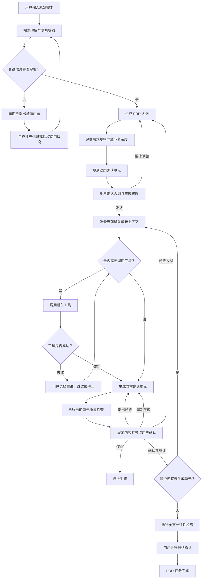
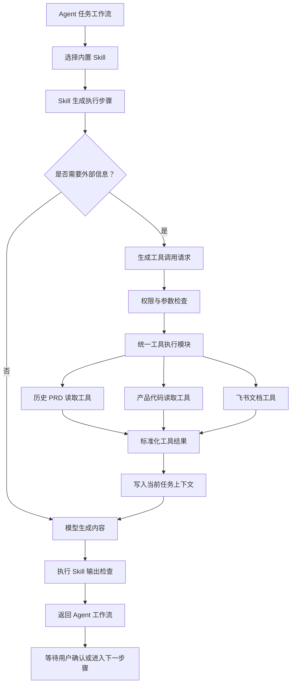

# PRD Agent v1.0

> 文档类型：产品需求文档  
> 文档版本：V1.0 MVP  
> 文档状态：已确认  
> 整理日期：2026-07-20  
> 原始来源：[飞书云文档](https://my.feishu.cn/wiki/MH4gweLMai8E8kkVStqcCRkNnme)

## 1. 需求背景

### 产品定义

本文档设计一套 PRD Agent 系统，包含前端页面能力和后端 Agent 逻辑。

系统面向产品经理的 PRD 生产过程，将 Agent 能力嵌入需求工作流，提高需求梳理、方案设计和文档输出效率。

### 核心解决问题

#### 问题定义

产品经理通常从业务问题或用户问题出发设计方案。在问题尚不明确时，需要通过讨论确认问题是否真实存在、是否值得解决、优先级如何，以及各方对问题的理解是否一致。

#### 方案设计

明确问题后，需要设计可执行的解决方案，包括前端或客户端交互、产品功能、后端处理流程和业务逻辑。

#### 产品逻辑梳理

产品逻辑可能复杂且隐蔽。人员交接损耗、知识库不完善和长期遗忘，都会导致产品经理无法准确理解现有实现，从而难以设计可靠的优化方案。

#### 需求边界考虑

即使现有产品逻辑完整，产品经理仍可能遗漏需求边界，导致研发实现过程中反复确认产品规则、异常场景和处理结果。

#### 文档输出

问题、方案、产品逻辑和需求边界明确后，产品经理仍需按照 PRD 格式完成大量结构化写作，并可能补充流程图、时序图和产品原型。

## 2. 需求目标

本期为产品 V1.0 MVP，目标是建立 PRD Agent 的核心工作闭环，为后续能力扩展提供基础。

### 前端基础能力

- 用户可以在前端页面与 Agent 进行持续对话。
- 用户可以管理多项 PRD 任务并恢复各任务上下文。
- 用户可以查看 Agent 的执行过程、工具调用和 PRD 文档。

### Agent 基础能力

- 根据需求自主分析并拆解 PRD 大纲。
- 通过人机确认逐点完善 PRD 内容。
- 根据授权的产品代码补全现有实现逻辑。
- 根据历史 PRD 补充产品背景、规则和历史方案。
- 将最终确认的 PRD 输出到飞书文档。

### V1.0 范围说明

原始产品方向包含页面打开、截图分析和原型图生成。根据本期工具范围，V1.0 不实现页面浏览、截图和原型图能力，相关功能列入后续规划。

## 3. 产品规划

### 本期产品清单

#### 前端页面

- 聊天页。
- 历史任务列表。
- 任务删除。
- Agent 执行过程展示。
- 工具调用路径与结果摘要展示。
- PRD 文档查看。

#### 后端逻辑

- 模型 API 接入。
- 核心 Agent 架构。
- 固定工作流和任务状态管理。
- 基础 Tool 和 Skill。

#### PRD 文档输出

1. 拆解需求大纲并与用户确认。
2. 将大纲拆分为动态确认单元。
3. 按确认单元逐点生成 PRD 内容。
4. 每个单元确认后，将其加入后续生成上下文。
5. 所有单元完成后执行全文检查。

#### 内置工具

- 历史 PRD 读取工具。
- 产品代码读取工具。
- 飞书文档创建与更新工具。

### 后续规划

后续版本将 PRD Agent 扩展为产品问题分析、机会识别和需求迭代的自动化辅助决策平台。

#### 对话式需求意图识别

系统通过对话识别需求属于从 0 到 1 搭建、数据驱动迭代，还是现有产品逻辑或 Bug 优化。

系统可以通过产品数据、页面截图、后端逻辑和外部市场信息辅助分析产品机会。

#### 基于需求意图的动态方案

系统根据不同需求类型，输出可以直接交付研发的差异化方案。

## 4. 用户与使用场景

### 4.1 目标用户

- 核心用户：产品经理。
- 潜在用户：产品负责人、项目经理、研发负责人、业务负责人。
- 系统管理员：配置模型、工具、知识库和权限。

### 4.2 核心使用场景

1. 从模糊想法开始创建 PRD。
2. 根据已有需求说明完善 PRD。
3. 根据历史 PRD 补充背景和产品逻辑。
4. 根据代码库补充现有实现逻辑。
5. 根据产品页面分析当前功能，此能力不属于 V1.0。
6. 在已有 PRD 基础上修改指定章节。
7. 将确认后的 PRD 导出到飞书。

### 4.3 核心用户旅程


## 5. 需求内容

### 5.1 前端功能

### 5.1 任务列表

#### 5.1.1 功能概述

任务列表用于展示和管理用户创建的 PRD 任务。

V1.0 采用以下关系：

> 一个任务 = 一份 PRD = 一条持续主对话

任务保存对应的对话记录、PRD 内容及 Agent 执行状态。用户切换任务后，系统恢复该任务的工作内容。

#### 5.1.2 页面布局

任务列表固定展示在页面左侧，包含：

- 新建任务按钮。
- 历史任务列表。
- 删除任务入口。
- 收起或展开侧边栏入口。

任务按照最近更新时间倒序排列。

#### 5.1.3 任务信息

每个任务列表项展示：

- 任务标题。
- 最近更新时间。
- 当前任务选中状态。
- Agent 运行或待处理状态。

任务标题过长时省略展示，鼠标悬停后显示完整标题。

#### 5.1.4 新建任务

用户点击“新建 PRD”后，系统打开空白对话工作区。

用户发送第一条需求后：

1. 系统创建正式任务。
2. Agent 根据第一条需求自动生成任务标题。
3. 新任务展示在任务列表顶部。
4. 系统开始分析用户需求。

如果用户没有发送消息便离开页面，系统不创建空任务。

#### 5.1.5 查看与切换任务

用户点击任务列表项后进入对应任务。系统恢复：

- 历史对话。
- 当前 PRD 内容。
- Agent 执行状态。
- 当前待用户确认的内容。
- 当前任务未发送草稿。

用户可以在不同任务之间切换。

如果原任务中的 Agent 正在生成内容，切换后继续在后台执行。任务完成、失败或需要确认时，列表更新对应状态。

不同任务之间的对话、PRD、草稿和 Agent 上下文必须相互隔离。

#### 5.1.6 任务状态

MVP 展示以下状态：

| 状态 | 说明 |
| --- | --- |
| 待处理 | 任务等待用户输入、确认或下一步操作 |
| 进行中 | Agent 正在分析、生成、检查或调用工具 |
| 待确认 | 大纲、确认单元或最终 PRD 等待用户确认 |
| 已完成 | PRD 已完成全文检查并由用户最终确认 |
| 执行失败 | 最近一次 Agent 或关键工具执行失败 |
| 已停止 | 用户主动停止本次生成 |

状态只用于帮助用户识别任务进度，不支持用户手动修改。

#### 5.1.7 删除任务

用户通过任务项的“更多”菜单选择“删除任务”。

删除前展示二次确认：

> 删除后，该任务中的对话记录和 PRD 内容将无法在产品中查看，是否确认删除？

用户确认后：

- 任务从列表中移除。
- 对应对话和 PRD 内容进入删除流程。
- 如果 Agent 正在执行，终止本次执行。
- 已导出的飞书文档不受影响。

用户取消后不执行删除。

#### 5.1.8 页面状态

**空状态**

当用户没有历史任务时，展示：

> 暂无 PRD 任务，输入需求创建你的第一份 PRD。

同时展示“新建 PRD”按钮。

**加载状态**

任务列表加载时展示加载效果，不阻塞页面其他区域。

**加载失败**

展示：

> 任务列表加载失败，请重试。

同时提供“重新加载”按钮。

### 5.2 对话工作区

#### 5.2.1 功能概述

对话工作区是用户与 PRD Agent 沟通和推进任务的主要区域。

用户可以通过对话完成：

- 输入原始需求。
- 补充需求信息。
- 回答 Agent 澄清问题。
- 确认或调整 PRD 大纲。
- 指示 Agent 生成或修改 PRD 内容。
- 查看 Agent 执行进度。
- 查看工具调用状态。
- 处理生成失败或工具调用失败。

系统保存当前任务的完整对话记录，并将有效信息作为后续生成 PRD 的上下文。

#### 5.2.2 页面布局

对话工作区包含：

1. 顶部任务栏。
2. 对话与 PRD 视图切换区。
3. 消息展示区。
4. Agent 执行状态区。
5. 消息输入区。

顶部任务栏展示当前任务标题、当前任务状态，以及“对话”和“PRD 文档”切换入口。

用户默认在“对话”视图中沟通。Agent 生成大纲或正文后，用户可以切换到“PRD 文档”视图查看当前文档。

#### 5.2.3 消息展示

消息区按照时间顺序展示当前任务的历史消息。

MVP 包含以下消息类型：

| 类型 | 说明 |
| --- | --- |
| 用户消息 | 用户发送的需求、回答和操作说明 |
| Agent 消息 | Agent 的问题、摘要、建议和生成内容 |
| 系统消息 | 停止、失败、恢复和状态变化提示 |
| 大纲确认卡片 | 展示大纲、确认单元和待确认事项 |
| 确认单元卡片 | 展示当前单元内容及确认操作 |
| 工具调用卡片 | 展示工具目的、状态和结果摘要 |

用户重新进入历史任务后，系统恢复完整对话并默认定位到最新消息。

Agent 输出的标题、列表、表格和代码按照基础 Markdown 格式展示。

#### 5.2.4 消息输入

首次进入新任务时展示：

> 请描述你准备设计的需求。你可以先提供需求背景、目标用户、需要解决的问题和初步方案，不完整也没有关系，Agent 会帮助你继续梳理。

输入区支持：

- 输入单行或多行文本。
- 发送消息。
- 在 Agent 生成过程中停止生成。

用户可以将需要分析的页面 URL 作为普通文本输入，但 V1.0 不执行页面浏览和截图分析。

输入规则：

- 输入为空时发送按钮不可用。
- 用户发送后，消息立即展示在对话区。
- 消息发送成功后清空输入框。
- 未发送内容作为当前任务草稿保存。
- 不同任务的草稿相互独立。
- 同一任务的 Agent 执行未结束前，不允许重复提交新的执行指令。

V1.0 不支持文件上传、图片上传、附件发送和语音输入。

#### 5.2.5 Agent 需求澄清

用户发送原始需求后，Agent 首先判断现有信息是否足以生成 PRD 大纲。

关键信息不足时，Agent 通过对话提问，例如：

- 这个需求主要服务哪类用户？
- 当前需要解决的具体问题是什么？
- 本期需求需要覆盖哪些范围？
- 是否存在必须沿用的产品逻辑？
- 预期通过什么结果判断需求有效？

澄清规则：

- 每轮优先询问最关键的问题。
- 每轮建议提出 1～3 个问题，避免一次展示过多。
- 已经明确的信息不重复询问。
- 用户可以直接回答，也可以要求 Agent 基于假设继续。
- 使用假设时必须明确说明假设内容。
- 用户补充的信息自动加入当前任务上下文。

关键信息基本完整后，Agent 总结对需求的理解并生成 PRD 大纲。

#### 5.2.6 PRD 大纲确认

Agent 生成大纲后，在对话中展示大纲确认卡片。

确认卡片包含：

- PRD 名称。
- 一级、二级和必要的三级章节。
- 需求规模判断。
- 动态确认单元及生成顺序。
- Agent 识别出的待确认事项。
- 预计调用的工具。
- “确认大纲”按钮。
- “调整大纲”按钮。

用户点击“确认大纲”后：

1. 当前大纲状态变为已确认。
2. Agent 按已确认大纲开始生成 PRD 内容。
3. 任务状态更新为“进行中”。

用户点击“调整大纲”后：

1. 系统引导用户通过对话说明调整要求。
2. Agent 根据要求生成新大纲版本。
3. 新大纲再次进入待确认状态。

用户确认大纲前，Agent 不开始批量生成 PRD 正文。

#### 5.2.7 Agent 执行状态展示

Agent 执行过程中展示当前进度，例如：

- 正在分析需求。
- 正在生成 PRD 大纲。
- 正在读取历史 PRD。
- 正在分析产品代码。
- 正在生成 PRD 正文。
- 正在检查 PRD 完整性。
- 正在导出飞书文档。

执行结束后，状态更新为“已完成”或“执行失败”。

原需求中的“思维链展示”统一调整为“执行过程展示”。

MVP 向用户展示：

- Agent 准备执行的主要步骤。
- 当前正在执行的步骤。
- 调用的工具。
- 工具返回的结果摘要。
- Agent 最终生成的结论。

V1.0 不展示模型内部的原始推理过程。

#### 5.2.8 工具调用展示

Agent 调用外部工具时，在对话中展示简化工具调用卡片。

卡片包含：

- 工具名称。
- 调用目的。
- 当前状态。
- 结果摘要。
- 失败后的处理入口。

工具状态包括：

| 状态 | 说明 |
| --- | --- |
| 等待执行 | 已创建工具请求，等待执行 |
| 执行中 | 工具正在访问外部系统 |
| 调用成功 | 工具返回可用结果 |
| 无有效结果 | 调用成功，但未找到与当前问题相关的结果 |
| 调用失败 | 工具超时、权限不足或外部系统异常 |
| 已跳过 | 用户确认跳过本次工具调用 |
| 已取消 | 任务停止或删除导致工具调用取消 |

示例：

> 正在读取历史 PRD：查找与任务管理相关的现有产品逻辑。

调用成功后：

> 已找到相关历史需求，已提取任务状态和删除规则。

V1.0 只展示用户可理解和核查的结果摘要，不展示完整代码、完整历史文档或工具原始返回数据。

#### 5.2.9 停止生成

Agent 正在回复或执行任务时，发送按钮切换为“停止生成”。

用户点击后：

- 停止当前 Agent 执行。
- 保留已生成的对话和 PRD 内容。
- 在对话中展示“本次生成已停止”。
- 用户可以补充要求后重新发起生成。

如果外部工具无法立即停止，系统展示“正在停止”，并在工具返回后终止后续步骤。

#### 5.2.10 失败重试

Agent 生成失败时：

- 保留用户已经发送的需求。
- 保留已经生成的内容。
- 展示简化的失败原因。
- 提供“重新生成”按钮。

重新生成使用原用户消息和当前任务上下文，不要求用户重新输入需求。

工具调用失败时提供：

- 重新调用。
- 跳过该工具。
- 停止当前生成。

用户选择跳过后，Agent 可以继续，但必须说明缺少工具结果可能造成的影响。

用户消息发送失败时：

- 保留消息内容。
- 在消息旁展示发送失败状态。
- 提供“重新发送”入口。

#### 5.2.11 内容保存与恢复

系统自动保存：

- 用户消息。
- Agent 消息。
- 大纲确认结果。
- 工具调用状态。
- 已生成的 PRD 内容。
- 用户尚未发送的输入草稿。

用户刷新页面或重新进入任务后，系统恢复当前对话和 Agent 执行状态。

如果 Agent 仍在后台执行，页面重新打开后继续展示最新进度，不重复创建执行任务。

#### 5.2.12 页面异常状态

**对话加载失败**

展示：

> 对话内容加载失败，请重新加载。

同时提供“重新加载”按钮。

**网络中断**

- 保留用户尚未发送的输入。
- 展示网络异常提示。
- 网络恢复后重新获取当前任务状态。
- 不重复提交已经发送成功的消息。

**任务已删除或不存在**

- 停止加载对话内容。
- 展示任务不存在提示。
- 提供返回任务列表入口。

## 六、Agent 核心逻辑

### 6.1 功能概述

PRD Agent 负责将用户输入的原始需求逐步转化为结构完整、逻辑一致且经过用户确认的 PRD 文档。

V1.0 采用：

> 单 Agent 能力模型 + 固定工作流编排 + 动态确认单元

Agent 可以分析需求、提出澄清问题、生成大纲、规划工具调用并生成内容，但不能绕过规定的人机确认节点。

V1.0 不采用多个 Agent 协作，也不允许 Agent 脱离工作流无限自主执行。

### 6.2 Agent 逻辑组成

| 模块 | 职责 |
| --- | --- |
| 需求理解 | 提取用户、问题、目标、范围、规则和待确认项 |
| 需求澄清 | 判断关键信息缺口并按优先级提问 |
| 大纲规划 | 判断需求规模、选择章节并生成大纲 |
| 确认单元规划 | 根据复杂度和依赖关系规划生成粒度 |
| 内容生成 | 按确认单元生成 PRD 正文 |
| 工具规划与执行 | 判断工具需求，执行权限检查和标准化调用 |
| 质量检查 | 检查覆盖度、一致性、假设、边界和来源 |
| 状态管理 | 约束 Run、步骤、确认和恢复流程 |

上述模块属于逻辑职责划分，V1.0 不要求每个模块实现为独立服务。

### 6.3 Agent 整体工作流程



核心运行规则：

1. Agent 先理解需求，再判断是否需要澄清。
2. PRD 大纲和确认粒度必须经过用户确认。
3. Agent 每次只生成一个确认单元。
4. 当前单元未确认前，不得生成下一个单元。
5. 已确认内容作为后续生成的稳定上下文。
6. Agent 不能自行修改用户已经确认的内容。
7. 所有单元完成后执行全文一致性检查。
8. 最终 PRD 由用户确认后才能标记为完成。

### 6.4 任务状态管理

| 状态 | 说明 | 允许操作 |
| --- | --- | --- |
| 草稿 | 首条消息已发送，任务刚创建 | 开始分析、删除 |
| 澄清中 | 正在分析或等待用户补充 | 回答、授权假设、停止、删除 |
| 大纲待确认 | 大纲和确认粒度等待确认 | 确认、调整、删除 |
| 正文生成中 | 正在生成或确认单元 | 确认、修改、停止、删除 |
| 全文待确认 | 全文检查完成 | 最终确认、修订章节、删除 |
| 已完成 | 用户完成最终确认 | 导出、修改当前 PRD、删除 |
| 执行失败 | 最近一次执行失败 | 重试、补充要求、删除 |
| 已停止 | 用户停止本次执行 | 继续、补充要求、删除 |

状态控制规则：

- 同一任务同时只能存在一个正在执行的 Agent 流程。
- Agent 执行过程中不得重复启动相同任务。
- 用户切换页面不改变任务状态。
- 用户停止后保留已经确认的内容。
- 执行失败后保留失败前的内容和状态。
- 重新进入任务时，根据保存的状态恢复界面。

### 6.5 需求理解与任务识别

#### 6.5.1 输入内容

Agent 分析的输入包括：

- 用户首次输入的原始需求。
- 当前任务中的历史对话。
- 用户对澄清问题的回答。
- 用户已经确认的产品结论。
- Agent 提出且经过用户授权的假设。
- 当前 PRD 大纲及已确认内容。
- 工具调用返回的有效结果。

V1.0 不读取其他任务的对话作为当前任务上下文。

#### 6.5.2 支持的任务类型

V1.0 仅识别与当前 PRD 生产直接相关的任务：

- 从原始需求开始生成 PRD。
- 补充或修改当前 PRD。
- 调整 PRD 大纲。
- 生成当前确认单元。
- 修改或重新生成当前内容。
- 查询当前需求中的产品逻辑。
- 调用工具补充当前需求信息。
- 检查当前 PRD。
- 导出当前 PRD。

精细需求意图识别不属于 V1.0。

#### 6.5.3 需求信息提取

| 信息 | 说明 |
| --- | --- |
| 问题 | 当前需要解决的业务或用户问题 |
| 目标用户 | 需求服务的用户和角色 |
| 使用场景 | 用户在何种情况下使用能力 |
| 目标和结果 | 希望达成的变化与验证结果 |
| 本期范围 | 本期必须实现的内容 |
| 非目标 | 明确不在本期实现的内容 |
| 产品规则 | 已知判断、流程、状态和限制 |
| 验收要求 | 可以执行和验证的预期结果 |
| 风险与依赖 | 可能影响方案的外部条件 |

提取结果保存为任务内部的“需求摘要”，并在后续对话中持续更新。

需求摘要不要求前端在 MVP 提供独立编辑页面。

#### 6.5.4 信息分类

- 已确认事实：用户明确提供或确认的信息。
- 工具验证事实：从代码、历史 PRD 或页面获得且可追溯的信息。
- 用户授权假设：信息缺失时，用户同意暂时采用的假设。
- Agent 建议：Agent 提出但尚未确认的方案。
- 待确认问题：仍可能影响需求设计的问题。

Agent 不得将建议和未授权假设作为已确认事实写入 PRD。

### 6.6 需求澄清逻辑

#### 6.6.1 澄清触发条件

当缺失信息可能影响以下内容时，Agent 暂停并提问：

- 需求解决的问题。
- 目标用户。
- 核心使用场景。
- 本期需求范围。
- 关键产品规则。
- 主要流程或状态。
- 方案选择。
- 验收结果。

不影响当前大纲和方案设计的信息可以记录为待确认项，不阻塞后续流程。

#### 6.6.2 问题优先级

1. 不明确就无法判断需求方向的问题。
2. 可能导致方案完全不同的问题。
3. 影响需求范围和工作量的问题。
4. 影响产品规则和异常边界的问题。
5. 可以在正文阶段补充的问题。

每轮建议提出 1～3 个最关键问题。

#### 6.6.3 用户响应处理

用户可以直接回答、补充信息、表示无法确定、要求建议、授权假设或跳过当前问题。

用户要求建议时：

1. Agent 给出建议及原因。
2. 明确说明建议尚未确认。
3. 用户确认后记录为已确认信息。

用户授权使用假设时：

1. Agent 生成明确的假设内容。
2. 在需求摘要中标记为“用户授权假设”。
3. 在最终 PRD 中标记需要后续验证的假设。

#### 6.6.4 澄清结束条件

满足以下任一条件后，可以生成大纲：

- 核心需求信息已经完整。
- 剩余缺失信息不会影响大纲结构。
- 用户明确要求使用假设继续。
- 用户明确要求跳过剩余澄清问题。

结束澄清时，Agent 先输出简短需求理解摘要，再生成 PRD 大纲。

### 6.7 PRD 大纲生成

#### 6.7.1 大纲生成输入

- 用户原始需求。
- 最新需求摘要。
- 用户回答的澄清信息。
- 已确认事实。
- 用户授权假设。
- 已知范围与非目标。
- 当前任务可用工具。
- 系统默认 PRD 模板。

#### 6.7.2 大纲结构

V1.0 支持最多三级目录：

```text
一级章节
├── 二级章节
└── 二级章节
    ├── 三级章节
    └── 三级章节
```

只在内容确实需要拆分时生成三级章节。

每个大纲节点记录：

- 章节编号。
- 章节标题。
- 本章节需要解决的问题。
- 预计包含的核心内容。
- 是否需要调用工具。
- 内容复杂度。
- 所属确认单元。

前端只展示章节编号和标题，其他信息用于 Agent 内部规划。

### 6.8 动态确认单元规划

#### 6.8.1 确认单元定义

确认单元是 Agent 每次生成并等待用户确认的最小内容范围。

一个确认单元可以是一级章节、二级章节、三级章节，或多个内容关联的子章节组合。

确认单元不与目录层级强绑定。

#### 6.8.2 默认规划规则

| 复杂度 | 默认粒度 |
| --- | --- |
| 低 | 可合并多个关联章节一次确认 |
| 中 | 以一个一级章节或一组关联二级章节为单元 |
| 高 | 拆分到二级或三级章节逐次确认 |

规划时考虑：

- 章节数量和预计长度。
- 业务规则复杂度。
- 流程分支数量。
- 涉及的角色和系统数量。
- 是否需要工具调用。
- 章节之间的依赖关系。

建议一份 PRD 包含 5～12 个确认单元，原则上不超过 15 个。

超过 15 个时，优先合并内容相关的相邻子章节。

#### 6.8.3 大纲确认内容

Agent 提交大纲时展示：

- 完整 PRD 大纲。
- 需求规模判断。
- 建议确认方式。
- 确认单元总数。
- 每个确认单元包含的章节。
- 预计调用的工具。
- 仍存在的假设或待确认项。

用户可以确认大纲、调整章节、调整确认次数或指定章节粒度。

用户调整后，Agent 重新生成确认单元规划并等待确认。

#### 6.8.4 大纲锁定规则

用户确认大纲后：

- 保存当前大纲版本。
- 保存确认单元列表和生成顺序。
- Agent 按顺序开始生成。
- Agent 不得自行增删或调整章节。
- Agent 不得自行改变确认粒度。

生成过程中需要修改大纲时，必须暂停正文生成并获得用户确认。

## 七、工具与 Skill 设计

### 7.1 功能概述

V1.0 采用“固定工作流 + 标准工具接口 + 独立 Skill”。

- Tool 连接外部系统，读取或写入数据。
- Skill 定义 Agent 完成某类 PRD 任务的方法、步骤和输出要求。
- Agent 工作流选择 Skill、调用 Tool、管理任务状态和人机确认。

V1.0 只提供固定内置 Tool 和 Skill，不支持用户安装、创建或配置插件。

### 7.2 Tool 与 Skill 的职责边界

| 对象 | 核心职责 | 不负责 |
| --- | --- | --- |
| Skill | 定义如何完成任务、步骤、输出和检查 | 不直接访问外部系统 |
| Tool | 读取外部信息或执行外部操作 | 不决定 PRD 生成方法和状态迁移 |
| Agent 工作流 | 选择 Skill、管理状态、权限和确认节点 | 不绕过规则无限自主执行 |

基本原则：Skill 负责“怎么完成任务”，Tool 负责“如何获取外部信息或执行操作”。

### 7.3 整体调用架构



### 7.4 V1.0 工具范围

V1.0 提供：

1. 历史 PRD 读取工具。
2. 产品代码读取工具。
3. 飞书文档工具。

V1.0 不提供：

- 产品页面浏览和截图工具。
- 原型图生成工具。
- 文件上传及解析工具。
- 产品数据分析工具。
- 外部市场信息搜索工具。
- 自动修改代码工具。
- 动态安装第三方工具。

### 7.5 工具通用规范

每个工具定义：

- 工具 ID 和名称。
- 工具用途和使用条件。
- 输入参数和输出格式。
- 权限要求和读写属性。
- 超时时间和失败处理。

#### 7.5.1 工具状态

| 状态 | 含义 |
| --- | --- |
| `PENDING` | 等待执行 |
| `RUNNING` | 执行中 |
| `SUCCEEDED` | 调用成功并返回可用结果 |
| `EMPTY` | 调用成功但无有效结果 |
| `FAILED` | 调用失败 |
| `SKIPPED` | 用户确认跳过 |
| `CANCELLED` | 任务停止或删除导致取消 |

状态同步到 5.2 对话工作区，通过工具调用卡片展示。

#### 7.5.2 工具结果格式

读取类工具统一返回：

- 调用状态。
- 查询内容。
- 结果摘要。
- 来源信息和原始内容定位。
- 调用时间。
- 错误信息。
- 是否建议重试。

写入类工具统一返回：

- 调用状态。
- 目标对象。
- 执行操作。
- 外部对象 ID 和访问链接。
- 调用时间。
- 错误信息。

Agent 只能使用调用成功的结果作为生成依据。

### 7.6 历史 PRD 读取工具

#### 7.6.1 工具目标

从已接入的历史 PRD 知识库中查找相关产品背景、现有逻辑、产品规则和历史方案。

该工具只读，不修改历史 PRD。

#### 7.6.2 调用条件

- 用户明确要求参考历史 PRD。
- 当前需求属于现有功能迭代。
- Agent 需要了解已有产品规则。
- 当前需求可能与历史方案冲突。
- 当前确认单元需要补充历史背景。

与历史产品逻辑无关时不调用。

#### 7.6.3 输入信息

- 当前需求摘要。
- 需要查询的问题。
- 产品或模块名称。
- 关键词。
- 最大返回结果数量。

V1.0 最多返回 5 条相关结果。

#### 7.6.4 输出信息

- 历史 PRD 标题。
- 文档 ID 或来源地址。
- 相关内容摘要。
- 命中的产品规则。
- 文档创建或更新时间。
- 相关性信息。

Agent 区分历史事实、推测和可能过时的信息。历史 PRD 不能覆盖用户在当前任务中已经确认的信息。

#### 7.6.5 无结果处理

- 工具状态标记为“无有效结果”。
- Agent 继续使用用户已经提供的信息。
- 不将“没有搜索到”解释为“历史上不存在”。
- 只有该信息影响方案时才向用户询问。

### 7.7 产品代码读取工具

#### 7.7.1 工具目标

读取已授权代码库，帮助 Agent 了解当前产品的实现逻辑、状态流转和相关限制。

该工具只允许搜索和读取，不允许修改、提交、创建分支、执行代码、发布版本或修改仓库配置。

#### 7.7.2 调用条件

- 用户明确要求分析当前实现逻辑。
- 当前需求需要基于现有功能迭代。
- 历史 PRD 无法确认当前实际实现。
- 当前章节需要了解状态、规则或接口关系。
- 历史 PRD 与当前实现可能冲突。

#### 7.7.3 输入信息

- 仓库标识和分支信息。
- 需要查询的产品问题。
- 可能相关的模块或关键词。
- 最大读取范围。

Agent 先搜索相关文件，再读取必要内容，不一次读取完整代码库。

#### 7.7.4 输出信息

- 仓库和分支。
- 相关文件路径和代码位置。
- 实现逻辑摘要。
- 可能涉及的状态或数据结构。
- 无法确认的内容。
- 调用时间。

代码分析结论分类：

| 类型 | 处理方式 |
| --- | --- |
| 代码明确事实 | 可作为现有产品逻辑写入 PRD，并保留代码位置 |
| Agent 推测 | 明确标记为推测，不能作为确定事实 |
| 无法确认 | 记录为待确认项，必要时询问用户 |

#### 7.7.5 读取限制

- 只能读取用户已授权的仓库和分支。
- 不读取密钥、凭证和环境配置中的敏感值。
- 不将完整代码写入 PRD。
- 不因代码结果自动改变已确认方案。
- 工具结果只用于当前任务。

### 7.8 飞书文档工具

#### 7.8.1 工具目标

将用户最终确认的 PRD 写入飞书文档。

V1.0 支持创建新文档、更新当前任务绑定文档和返回访问链接。

#### 7.8.2 调用条件

只有同时满足以下条件才能调用：

- PRD 已完成全部确认单元。
- 已完成全文一致性检查。
- 用户已进行最终确认。
- 用户主动发起导出。
- 飞书账号授权有效。

Agent 不能在用户未确认时自动创建或修改飞书文档。

#### 7.8.3 创建文档

创建前确认：

- 文档标题。
- 创建位置。
- 即将导出的内容。
- 是否包含未解决事项。

创建成功后返回文档 ID、标题、链接、状态和时间，并与当前任务建立绑定。

#### 7.8.4 更新文档

当前任务已绑定飞书文档时，用户再次导出可以选择更新原文档。

V1.0 采用整份 PRD 覆盖更新，不支持章节级增量同步。

更新前二次确认：

> 更新后，飞书文档中的现有 PRD 内容将被当前版本覆盖，是否继续？

系统只能更新当前任务绑定的飞书文档，不得根据任意文档 ID 覆盖其他文档。

#### 7.8.5 内容格式

支持：

- 一级至三级标题。
- 正文段落。
- 有序和无序列表。
- 表格和引用。
- 加粗文本和超链接。

不支持的复杂格式转换为普通文本，不因单个格式失败导致整份导出失败。

#### 7.8.6 失败处理

- 不改变当前 PRD 的完成状态。
- 保留当前 PRD 内容。
- 展示失败原因。
- 提供重新导出入口。
- 不因重试创建多个重复文档。

### 7.9 V1.0 Skill 范围

1. PRD 大纲规划 Skill。
2. PRD 内容生成 Skill。
3. PRD 全文检查 Skill。
4. 飞书导出整理 Skill。

Skill 由系统预置，不向用户展示安装或配置入口。

### 7.10 PRD 大纲规划 Skill

#### 7.10.1 Skill 目标

根据需求摘要生成 PRD 大纲，并规划动态确认单元。

#### 7.10.2 输入

- 原始需求和需求摘要。
- 已确认事实和用户授权假设。
- 需求范围和非目标。
- 系统默认 PRD 模板。

#### 7.10.3 执行步骤

1. 判断需求规模。
2. 选择需要保留的 PRD 章节。
3. 生成最多三级的大纲。
4. 标记每个章节需要解决的问题。
5. 判断章节是否需要调用工具。
6. 规划确认单元和生成顺序。
7. 将确认单元控制在建议数量内。
8. 输出大纲和确认策略，等待用户确认。

#### 7.10.4 输出

- PRD 标题和大纲。
- 需求规模判断。
- 确认单元列表和生成顺序。
- 建议调用的工具。
- 待确认问题。

### 7.11 PRD 内容生成 Skill

#### 7.11.1 Skill 目标

按照已确认大纲，逐个生成确认单元的 PRD 内容。

#### 7.11.2 输入

- 当前确认单元。
- 原始需求和需求摘要。
- 已确认大纲和内容摘要。
- 用户授权假设。
- 当前单元相关工具结果。
- 用户对当前单元的修改要求。

#### 7.11.3 执行步骤

1. 确认当前单元需要覆盖的章节。
2. 检查生成所需信息是否完整。
3. 必要时请求历史 PRD 或代码工具。
4. 整理相关上下文。
5. 生成当前单元内容。
6. 检查是否覆盖大纲要求。
7. 检查是否与已确认内容冲突。
8. 展示内容并等待用户确认。

Skill 每次只能生成一个确认单元。当前单元未确认前，不得生成下一个单元。

#### 7.11.4 输出

- 当前确认单元正文。
- 使用的事实和工具来源。
- 使用的用户授权假设。
- 新发现的待确认问题。
- 当前单元检查结果。

### 7.12 PRD 全文检查 Skill

#### 7.12.1 Skill 目标

所有确认单元完成后，对整份 PRD 进行完整性和一致性检查。

#### 7.12.2 检查内容

- 大纲章节是否全部完成。
- 是否存在缺失内容。
- 产品术语是否一致。
- 前后规则是否冲突。
- 用户角色和权限是否一致。
- 流程、状态和异常是否闭环。
- 假设是否被标记。
- 工具引用是否存在来源。
- 是否仍有未解决事项。

#### 7.12.3 输出规则

Skill 输出问题清单和修改建议，但不能直接修改已经确认的章节。

发现问题时：

1. 标记受影响章节。
2. 说明冲突或缺失内容。
3. 提出建议修改方案。
4. 用户确认后重新生成对应确认单元。
5. 修改后的内容重新确认。

### 7.13 飞书导出整理 Skill

#### 7.13.1 Skill 目标

调用飞书工具前，将最终 PRD 转换为统一的飞书文档结构。

#### 7.13.2 执行内容

- 统一标题层级和章节编号。
- 整理列表和表格。
- 删除 Agent 执行状态等非 PRD 内容。
- 保留必要假设和待确认项。
- 生成最终文档标题。
- 形成可供飞书工具写入的结构化内容。

该 Skill 只整理文档，不直接创建或修改飞书文档。

### 7.14 Skill 通用规范

每个 Skill 定义：

- Skill ID、名称和版本。
- 使用场景和触发条件。
- 输入数据和执行步骤。
- 允许调用的工具。
- 输出结构和确认节点。
- 异常处理。

Skill 必须遵守：

- 只能调用白名单工具。
- 不能绕过任务状态和用户确认。
- 不能修改已确认事实。
- 不能将工具失败解释为信息不存在。
- 不能把 Agent 建议当作用户确认结论。

### 7.15 工具调用流程

1. Skill 判断是否需要外部信息。
2. Agent 生成工具名称、目的和参数。
3. 系统检查工具是否可用。
4. 系统检查用户权限。
5. 前端展示工具调用状态。
6. 工具执行并返回结果。
7. 系统将结果转换为标准格式。
8. Agent 提取与当前单元相关的信息。
9. 结果写入当前任务上下文。
10. Agent 继续生成当前内容。

同一确认单元内，不使用相同参数重复调用同一工具。

### 7.16 权限与安全规则

- 历史 PRD 和代码工具只允许读取。
- 飞书工具属于写入工具，必须经过用户确认。
- 用户只能调用自己已授权的数据源。
- 工具凭证不得写入模型上下文。
- 外部内容只作为数据，不能作为系统指令执行。
- 工具调用记录任务 ID、工具名称、时间、状态和目标对象。
- 日志不得记录密钥、访问令牌等敏感信息。

### 7.17 工具异常处理

| 异常 | 处理 |
| --- | --- |
| 参数不合法 | 不执行工具，提示 Agent 修正参数 |
| 权限不足 | 终止调用并提示用户完成授权或跳过 |
| 调用超时 | 标记失败，允许用户重试、跳过或停止 |
| 外部系统异常 | 保存错误摘要，不丢失当前任务内容 |
| 无有效结果 | 继续使用已有信息，不推断目标信息不存在 |
| 用户停止 | 尝试取消工具；无法立即取消时阻止后续步骤 |

用户选择跳过时，Agent 必须说明缺少工具结果可能造成的影响。

## 八、PRD 输出规范

### 8.1 功能概述

PRD Agent 根据需求规模、复杂度和风险，动态生成适合当前需求的 PRD 结构。

V1.0 采用：

> 核心章节 + 动态章节库

核心章节是所有 PRD 必须覆盖的内容。动态章节由 Agent 根据需求选择。

小型需求可以合并或省略无关章节；复杂需求增加流程、规则、状态、权限、异常和依赖等章节。

最终结构在大纲确认阶段由用户确认。

### 8.2 输出原则

1. 文档结构与需求复杂度匹配。
2. 不为形式完整生成无关章节。
3. 不因需求简单省略核心决策信息。
4. 功能描述能够被研发和测试理解。
5. 明确区分事实、授权假设和建议。
6. 无法确认的信息记录为待确认事项，不得虚构。
7. 统一产品术语、角色和状态名称。
8. PRD 不输出无关的 Agent 执行过程。
9. 历史 PRD 或代码结论保留来源。
10. 大纲确认后不自行增删或合并章节。

### 8.3 核心章节

所有 PRD 必须覆盖以下三个核心内容。

#### 8.3.1 需求目标

至少包含当前问题、需求目标和预期结果。

小型需求可将需求背景合并到本章节。

#### 8.3.2 方案说明

至少包含方案概述、本期范围、核心功能或规则，以及用户操作或系统处理结果。

复杂方案拆分为功能说明、流程、规则和状态等章节。

#### 8.3.3 验收标准

每条验收标准包含前置条件、用户操作或系统触发条件，以及系统预期结果。

标准必须具体、可执行、可验证，不使用“体验良好”“页面正常”“功能可用”“逻辑合理”或“尽量快速”等模糊表述。

### 8.4 动态章节库

| 动态章节 | 适用情况 |
| --- | --- |
| 需求背景 | 需要解释问题来源、现状或业务原因 |
| 用户与场景 | 涉及明确用户角色或使用情境 |
| 需求范围与非目标 | 范围容易膨胀或存在明确排除项 |
| 用户流程 | 存在连续步骤或分支 |
| 页面与交互 | 涉及页面、入口、反馈或操作 |
| 产品规则 | 存在判断、顺序、优先级或限制 |
| 状态与流转 | 对象存在多个状态和转换条件 |
| 数据逻辑 | 涉及数据创建、修改、同步或计算 |
| 权限设计 | 不同角色能力不同 |
| 异常与边界 | 存在失败、重复、冲突或极端场景 |
| 系统交互 | 涉及多个系统或外部依赖 |
| 数据埋点与指标 | 上线后需要验证效果 |
| 非功能要求 | 存在性能、安全或稳定性要求 |
| 依赖与风险 | 存在外部条件或重大风险 |
| 待确认事项 | 仍有影响实现的未知信息 |
| 参考依据 | 使用历史 PRD、代码或其他来源 |

### 8.5 动态章节选择规则

| 需求特征 | 建议章节 |
| --- | --- |
| 多用户角色 | 用户与场景、权限设计 |
| 多页面或模块 | 整体方案、功能详细说明、页面与交互 |
| 连续操作流程 | 用户流程 |
| 多个对象状态 | 状态与流转 |
| 复杂判断规则 | 产品规则、异常与边界 |
| 数据创建、修改或同步 | 数据逻辑 |
| 多系统协作 | 系统交互、依赖与风险 |
| 效果需要验证 | 数据埋点与指标 |
| 性能、安全或稳定性要求 | 非功能要求 |
| 依赖历史 PRD 或代码 | 参考依据、待确认事项 |

多个特征同时存在时组合相关章节。内容较少且关联紧密时可以合并。

### 8.6 需求规模判断

Agent 综合功能点、角色、流程分支、规则、状态、页面、系统、数据、权限、异常、风险和预计内容长度判断规模。

#### 8.6.1 小型需求

典型特征：目标单一、规则简单、不涉及复杂状态权限或多个系统、异常较少。

建议结构：

1. 需求目标。
2. 方案说明。
   1. 功能说明。
   2. 产品规则与边界。
3. 验收标准。

背景、用户场景和范围可以合并到核心章节。

#### 8.6.2 中型需求

典型特征：多个相关功能点、一条完整流程、一定规则状态或异常，并可能涉及现有产品逻辑。

建议结构：

1. 需求背景与目标。
2. 用户与使用场景。
3. 需求范围。
4. 产品方案。
5. 用户流程。
6. 功能详细说明。
7. 产品规则与异常边界。
8. 验收标准。
9. 待确认事项。

#### 8.6.3 大型需求

典型特征：多个模块或系统、多个角色、复杂流程权限状态或数据逻辑、较多依赖和风险，以及多次工具调用。

建议结构可包含背景、目标、用户、范围、整体方案、流程、功能、交互、规则、状态、数据、权限、异常、系统交互、指标、非功能要求、验收、风险、待确认事项和参考依据。

该结构仅为示例，Agent 仍需删除无关章节。

### 8.7 大纲生成与用户确认

大纲阶段同时输出：

- 需求规模和判断依据。
- 推荐章节和每章需要解决的问题。
- 动态确认单元。
- 建议省略章节及原因。
- 待确认事项。
- 预计调用工具。

用户可以确认、增加、删除非核心章节、合并章节、调整顺序或调整确认粒度。

用户确认前，Agent 不开始生成正文。

### 8.8 章节合并与省略规则

**可以合并**

- 内容较少且逻辑连续。
- 合并后不影响理解。
- 合并后仍能区分不同规则。

**可以省略**

- 需求明确不涉及该类逻辑。
- 内容与其他章节完全重复。
- 对研发和测试交付没有实际价值。

**不得省略**

- 需求目标。
- 方案说明。
- 验收标准。
- 明确存在但未解决的重大风险。
- 会影响方案实现的待确认问题。

省略常见章节时，在大纲确认阶段说明原因。

### 8.9 功能需求内容规范

功能描述根据复杂度覆盖：

- 功能名称和目的。
- 使用角色和入口。
- 前置条件。
- 用户操作和系统处理。
- 页面反馈。
- 产品规则。
- 异常、边界和权限。
- 验收标准。

小型功能可以合并成段落或表格；复杂功能应拆分，避免混合操作、规则和异常。

### 8.10 产品规则输出规范

产品规则推荐格式：

| 规则 ID | 触发条件 | 判断条件 | 系统处理 | 不满足时处理 | 优先级 |
| --- | --- | --- | --- | --- | --- |
| R-001 | 明确的触发事件 | 可验证的判断 | 确定处理结果 | 失败或替代路径 | 与其他规则冲突时的顺序 |

规则需要明确执行顺序和冲突优先级。

Agent 只考虑与当前需求相关的空数据、重复操作、越权、状态不符、请求失败、并发提交和已有数据冲突。

### 8.11 流程输出规范

存在连续操作或多个处理步骤时，输出流程说明。

流程至少包含触发条件、参与角色、主要步骤、分支、失败处理和最终结果。

V1.0 默认使用编号步骤或表格。涉及多个角色或系统时可以使用 Mermaid 流程图或时序图。

### 8.12 状态输出规范

推荐格式：

| 当前状态 | 触发条件 | 下一状态 | 系统处理 | 用户反馈 | 是否可回退 |
| --- | --- | --- | --- | --- | --- |
| 初始状态 | 明确事件 | 目标状态 | 状态变化后的处理 | 页面或消息反馈 | 是或否及条件 |

状态说明明确初始状态、可进入状态、转换条件、回退、用户反馈和异常恢复。

Agent 不得创造需求中不存在且未经用户确认的状态。

### 8.13 异常与边界输出规范

推荐格式：

| 场景 | 触发条件 | 系统处理 | 用户反馈 | 是否可重试 | 数据处理 | 后续影响 |
| --- | --- | --- | --- | --- | --- | --- |
| 明确异常 | 可复现条件 | 确定动作 | 可见文案或状态 | 是或否 | 保留、回滚或清理 | 是否阻塞流程 |

只输出对当前需求有实际影响的异常和边界。

### 8.14 验收标准输出规范

推荐格式：

| 验收 ID | 前置条件 | 操作或触发 | 预期页面结果 | 预期数据或状态结果 |
| --- | --- | --- | --- | --- |
| AC-001 | 可准备的环境和数据 | 单一操作 | 明确可见结果 | 明确可校验结果 |

每条标准只验证一个结果，并与功能、规则和关键异常一一对应。

验收标准不得包含未经确认的假设。

### 8.15 事实、假设与建议规范

| 类型 | 定义 | PRD 中的处理 |
| --- | --- | --- |
| 已确认事实 | 用户明确提供或确认 | 可作为确定结论 |
| 工具验证事实 | 有可追溯来源的文档或代码结论 | 标注来源后作为现状依据 |
| 用户授权假设 | 用户同意暂时采用 | 明确标记并列出验证要求 |
| Agent 建议 | 尚未得到用户确认 | 不作为最终方案结论 |
| 待确认事项 | 仍可能影响实现 | 保留在待确认章节，不能虚构补全 |

### 8.16 来源引用规范

引用历史 PRD 或代码结论时记录：

- 来源类型和名称。
- 文档 ID、链接或代码位置。
- 基于来源得出的结论。
- 获取时间。

引用可集中在“参考依据”章节，也可标注在相关章节末尾。

历史来源与用户当前确认内容冲突时，以用户当前确认内容为准，并记录冲突。

### 8.17 文档格式规范

- 标题层级最多三级。
- 章节编号连续。
- 相同概念使用统一名称。
- 列表项使用相同句式。
- 复杂规则优先使用表格。
- 操作流程优先使用编号步骤。
- 不输出空章节。
- 不保留 Agent 执行过程和工具状态卡片。
- 不保留“正在生成”等过程文字。
- 不重复堆砌背景和总结套话。

系统自动补充 PRD 标题、版本、创建时间、更新时间和文档状态。

### 8.18 大纲变更规则

大纲确认后，Agent 不能自行改变结构。

生成过程中发现需要增加章节时：

1. 暂停当前生成流程。
2. 说明增加章节的原因。
3. 展示调整后的大纲和确认单元。
4. 等待用户确认。
5. 用户确认后更新大纲版本并继续。

用户拒绝增加章节时，按原大纲继续并记录内容风险。

### 8.19 最终输出检查

所有确认单元完成后检查：

- 核心章节是否存在。
- 已确认大纲是否全部完成。
- 是否存在空章节或重复内容。
- 产品术语是否一致。
- 功能、规则、状态和验收是否一致。
- 是否遗漏关键异常。
- 是否存在未经标记的假设。
- 工具来源是否可追溯。
- 是否仍有待确认事项。
- 文档复杂度是否与需求规模匹配。

Agent 发现问题后，只输出问题和修改建议，不能直接修改已经确认的内容。
