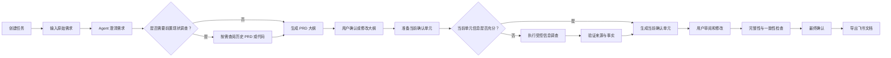
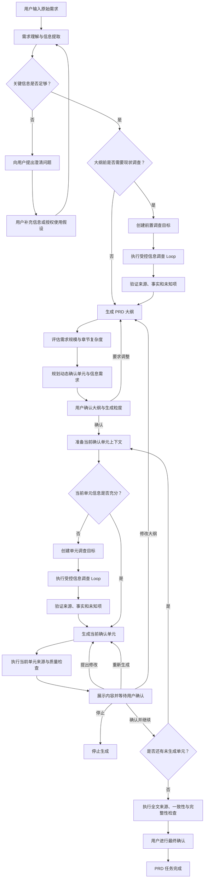
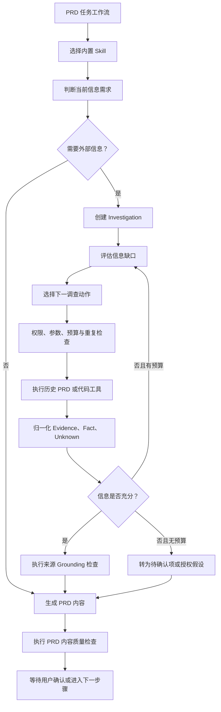

# PRD Agent v1.1

> 文档类型：产品需求文档  
> 文档版本：V1.1 MVP  
> 文档状态：已确认（实现约束修订）  
> 整理日期：2026-07-20  
> 原始来源：[飞书云文档](https://my.feishu.cn/wiki/MH4gweLMai8E8kkVStqcCRkNnme)

## 1. 需求背景

### 产品定义

本文档设计一套 PRD Agent 系统，包含前端页面能力和后端 Agent 逻辑。

系统面向产品经理的 PRD 生产过程，将 Agent 能力嵌入需求工作流，提高需求梳理、方案设计和文档输出效率。**生成经过用户确认、可交付研发与测试的需求文档，是系统唯一的主业务目标。**

历史 PRD 和授权代码库是 PRD 生成过程中的辅助信息源，用于补充产品背景、现有实现逻辑、字段约束、状态规则和需求边界。系统不以全面分析代码库为目标，也不要求每个需求或每个章节都调用外部工具；只有当缺失信息会影响大纲、方案、规则、验收或风险判断时，才启动受控的信息调查。

### 核心解决问题

#### 问题定义

产品经理通常从业务问题或用户问题出发设计方案。在问题尚不明确时，需要通过讨论确认问题是否真实存在、是否值得解决、优先级如何，以及各方对问题的理解是否一致。

#### 方案设计

明确问题后，需要设计可执行的解决方案，包括前端或客户端交互、产品功能、后端处理流程和业务逻辑。

#### 产品逻辑梳理

产品逻辑可能复杂且隐蔽。人员交接损耗、知识库不完善、历史 PRD 过期以及代码持续演进，都会导致产品经理无法准确理解现有实现，从而难以设计可靠的优化方案。

系统应在确有必要时查阅历史 PRD 或授权代码，并明确区分：当前系统事实、用户目标方案、用户授权假设、Agent 建议和无法确认的信息。

#### 需求边界考虑

即使现有产品逻辑完整，产品经理仍可能遗漏需求边界，导致研发实现过程中反复确认产品规则、异常场景和处理结果。

#### 文档输出

问题、方案、产品逻辑和需求边界明确后，产品经理仍需按照 PRD 格式完成大量结构化写作，并可能补充流程图、时序图和产品原型。

## 2. 需求目标

本期为产品 V1.1 MVP，目标是建立 PRD Agent 的核心工作闭环，并通过受控的信息调查、来源追溯和质量评测提高生成结果的可靠性。

### 前端基础能力

- 用户可以在前端页面与 Agent 进行持续对话。
- 用户可以管理多项 PRD 任务并恢复各任务上下文。
- 用户可以查看 Agent 的执行过程、信息调查、工具调用和 PRD 文档。

### Agent 基础能力

- 根据需求自主分析并拆解 PRD 大纲。
- 通过人机确认逐点完善 PRD 内容。
- 判断生成大纲或当前确认单元所需的信息是否完整。
- 将信息缺口转化为明确的调查问题，并判断信息是必需、可选还是无需调查。
- 根据需要查阅历史 PRD 和授权代码库；代码查阅始终服务于 PRD 生成，不成为独立主流程。
- 在明确预算和终止条件内执行有限的信息调查，不允许无边界自主循环。
- 将不同工具结果归一化为可追溯来源、已验证事实、未知项和来源冲突。
- 检查来源是否真正支持相关结论，避免把推测或空结果写成确定事实。
- 根据历史 PRD 补充产品背景、规则和历史方案。
- 根据授权的产品代码补全现有实现逻辑、字段约束、状态流转和相关限制。
- 将最终确认的 PRD 输出到飞书文档。

### V1.1 范围说明

原始产品方向包含页面打开、截图分析和原型图生成。根据本期工具范围，V1.1 不实现页面浏览、截图和原型图能力，相关功能列入后续规划。

V1.1 不引入多 Agent、MemoryOS、通用 Agent Runtime，也不依赖外部 Coding Agent 作为主执行器。外部 Coding Agent 仅作为后续可替换的代码调查适配器。

## 3. 产品规划

### 本期产品清单

#### 前端页面

- 聊天页。
- 历史任务列表。
- 任务删除。
- Agent 执行过程展示。
- 信息调查目标、进度、来源、已确认事实和未知项展示。
- 工具调用路径与结果摘要展示。
- PRD 文档查看。

#### 后端逻辑

- 模型 API 接入。
- 核心 Agent 架构。
- 固定 PRD 工作流和任务状态管理。
- 受控信息调查 Loop。
- 信息需求判断与调查预算控制。
- 轻量 Evidence 与 Verified Fact 数据模型。
- 来源 Grounding 检查与文档质量检查。
- 基础 Tool 和 Skill。
- 固定评测数据集、Baseline 与 Ablation 运行能力。

#### PRD 文档输出

1. 澄清原始需求并维护结构化需求摘要。
2. 必要时在大纲生成前执行前置现状调查。
3. 拆解需求大纲并与用户确认。
4. 将大纲拆分为动态确认单元。
5. 在每个确认单元生成前判断信息是否充分。
6. 必要时按预算执行历史 PRD 或代码调查。
7. 对工具事实执行来源校验后，按确认单元逐点生成 PRD 内容。
8. 每个单元确认后，将其加入后续生成上下文。
9. 所有单元完成后执行来源检查、完整性检查和一致性检查。

#### 内置工具

- 历史 PRD 读取工具。
- 产品代码调查工具。
- 飞书文档创建与更新工具。

### 后续规划

后续版本将 PRD Agent 扩展为产品问题分析、机会识别和需求迭代的自动化辅助决策平台。

#### 对话式需求意图识别

系统通过对话识别需求属于从 0 到 1 搭建、数据驱动迭代，还是现有产品逻辑或 Bug 优化。

系统可以通过产品数据、页面截图、后端逻辑和外部市场信息辅助分析产品机会。

#### 基于需求意图的动态方案

系统根据不同需求类型，输出可以直接交付研发的差异化方案。

#### 检索与代码调查增强

- 历史 PRD 从关键词检索逐步升级为关键词与向量混合检索，并通过评测验证收益。
- 代码调查可增加 Symbol、Reference、OpenAPI、数据库 Schema、事件消费者和 Git 历史等确定性能力。
- 通过统一接口接入 Codex、Claude Code 或其他 Coding Agent，并与原生工具型调查器进行效果、成本和时延对比。

## 4. 用户与使用场景

### 4.1 目标用户

- 核心用户：产品经理。
- 潜在用户：产品负责人、项目经理、研发负责人、业务负责人。
- 系统管理员：配置模型、工具、知识库和权限。

### 4.2 核心使用场景

1. 从模糊想法开始创建 PRD。
2. 根据已有需求说明完善 PRD。
3. 根据历史 PRD 补充背景和产品逻辑。
4. 根据代码库补充现有实现逻辑。
5. 根据产品页面分析当前功能，此能力不属于 V1.1。
6. 在已有 PRD 基础上修改指定章节。
7. 将确认后的 PRD 导出到飞书。

### 4.3 核心用户旅程



前置现状调查只在现有实现会影响大纲、方案结构或关键规则时触发。单元级调查只服务于当前确认单元，不默认扫描完整代码库。

## 5. 需求内容

### 5.1 前端功能

### 5.1 任务列表

#### 5.1.1 功能概述

任务列表用于展示和管理用户创建的 PRD 任务。

V1.1 采用以下关系：

> 一个任务 = 一份 PRD = 一条持续主对话

任务保存对应的对话记录、PRD 内容及 Agent 执行状态。用户切换任务后，系统恢复该任务的工作内容。

#### 5.1.2 页面布局

任务列表固定展示在页面左侧，包含：

- 新建任务按钮。
- 历史任务列表。
- 删除任务入口。
- 收起或展开侧边栏入口。

任务按照最近更新时间倒序排列。

#### 5.1.3 任务信息

每个任务列表项展示：

- 任务标题。
- 最近更新时间。
- 当前任务选中状态。
- Agent 运行或待处理状态。

任务标题过长时省略展示，鼠标悬停后显示完整标题。

#### 5.1.4 新建任务

用户点击“新建 PRD”后，系统打开空白对话工作区。

用户发送第一条需求后：

1. 系统创建正式任务。
2. Agent 根据第一条需求自动生成任务标题。
3. 新任务展示在任务列表顶部。
4. 系统开始分析用户需求。

如果用户没有发送消息便离开页面，系统不创建空任务。

#### 5.1.5 查看与切换任务

用户点击任务列表项后进入对应任务。系统恢复：

- 历史对话。
- 当前 PRD 内容。
- Agent 执行状态。
- 当前待用户确认的内容。
- 当前任务未发送草稿。

用户可以在不同任务之间切换。

如果原任务中的 Agent 正在生成内容，切换后继续在后台执行。任务完成、失败或需要确认时，列表更新对应状态。

不同任务之间的对话、PRD、草稿和 Agent 上下文必须相互隔离。

#### 5.1.6 任务状态

MVP 展示以下状态：

| 状态 | 说明 |
| --- | --- |
| 待处理 | 任务等待用户输入、确认或下一步操作 |
| 进行中 | Agent 正在分析、生成、检查或调用工具 |
| 待确认 | 大纲、确认单元或最终 PRD 等待用户确认 |
| 已完成 | PRD 已完成全文检查并由用户最终确认 |
| 执行失败 | 最近一次 Agent 或关键工具执行失败 |
| 已停止 | 用户主动停止本次生成 |

状态只用于帮助用户识别任务进度，不支持用户手动修改。

#### 5.1.7 删除任务

用户通过任务项的“更多”菜单选择“删除任务”。

删除前展示二次确认：

> 删除后，该任务中的对话记录和 PRD 内容将无法在产品中查看，是否确认删除？

用户确认后：

- 任务从列表中移除。
- 对应对话和 PRD 内容进入删除流程。
- 如果 Agent 正在执行，终止本次执行。
- 已导出的飞书文档不受影响。

用户取消后不执行删除。

#### 5.1.8 页面状态

**空状态**

当用户没有历史任务时，展示：

> 暂无 PRD 任务，输入需求创建你的第一份 PRD。

同时展示“新建 PRD”按钮。

**加载状态**

任务列表加载时展示加载效果，不阻塞页面其他区域。

**加载失败**

展示：

> 任务列表加载失败，请重试。

同时提供“重新加载”按钮。

### 5.2 对话工作区

#### 5.2.1 功能概述

对话工作区是用户与 PRD Agent 沟通和推进任务的主要区域。

用户可以通过对话完成：

- 输入原始需求。
- 补充需求信息。
- 回答 Agent 澄清问题。
- 确认或调整 PRD 大纲。
- 指示 Agent 生成或修改 PRD 内容。
- 查看 Agent 执行进度。
- 查看工具调用状态。
- 处理生成失败或工具调用失败。

系统保存当前任务的完整对话记录，并将有效信息作为后续生成 PRD 的上下文。

#### 5.2.2 页面布局

对话工作区包含：

1. 顶部任务栏。
2. 对话与 PRD 视图切换区。
3. 消息展示区。
4. Agent 执行状态区。
5. 消息输入区。

顶部任务栏展示当前任务标题、当前任务状态，以及“对话”和“PRD 文档”切换入口。

用户默认在“对话”视图中沟通。Agent 生成大纲或正文后，用户可以切换到“PRD 文档”视图查看当前文档。

#### 5.2.3 消息展示

消息区按照时间顺序展示当前任务的历史消息。

MVP 包含以下消息类型：

| 类型 | 说明 |
| --- | --- |
| 用户消息 | 用户发送的需求、回答和操作说明 |
| Agent 消息 | Agent 的问题、摘要、建议和生成内容 |
| 系统消息 | 停止、失败、恢复和状态变化提示 |
| 大纲确认卡片 | 展示大纲、确认单元和待确认事项 |
| 确认单元卡片 | 展示当前单元内容及确认操作 |
| 工具调用卡片 | 展示工具目的、状态和结果摘要 |

用户重新进入历史任务后，系统恢复完整对话并默认定位到最新消息。

Agent 输出的标题、列表、表格和代码按照基础 Markdown 格式展示。

#### 5.2.4 消息输入

首次进入新任务时展示：

> 请描述你准备设计的需求。你可以先提供需求背景、目标用户、需要解决的问题和初步方案，不完整也没有关系，Agent 会帮助你继续梳理。

输入区支持：

- 输入单行或多行文本。
- 发送消息。
- 在 Agent 生成过程中停止生成。

用户可以将需要分析的页面 URL 作为普通文本输入，但 V1.1 不执行页面浏览和截图分析。

输入规则：

- 输入为空时发送按钮不可用。
- 用户发送后，消息立即展示在对话区。
- 消息发送成功后清空输入框。
- 未发送内容作为当前任务草稿保存。
- 不同任务的草稿相互独立。
- 同一任务的 Agent 执行未结束前，不允许重复提交新的执行指令。

V1.1 不支持文件上传、图片上传、附件发送和语音输入。

#### 5.2.5 Agent 需求澄清

用户发送原始需求后，Agent 首先判断现有信息是否足以生成 PRD 大纲。

关键信息不足时，Agent 通过对话提问，例如：

- 这个需求主要服务哪类用户？
- 当前需要解决的具体问题是什么？
- 本期需求需要覆盖哪些范围？
- 是否存在必须沿用的产品逻辑？
- 预期通过什么结果判断需求有效？

澄清规则：

- 每轮优先询问最关键的问题。
- 每轮建议提出 1～3 个问题，避免一次展示过多。
- 已经明确的信息不重复询问。
- 用户可以直接回答，也可以要求 Agent 基于假设继续。
- 使用假设时必须明确说明假设内容。
- 用户补充的信息自动加入当前任务上下文。

关键信息基本完整后，Agent 总结对需求的理解并生成 PRD 大纲。

#### 5.2.6 PRD 大纲确认

Agent 生成大纲后，在对话中展示大纲确认卡片。

确认卡片包含：

- PRD 名称。
- 一级、二级和必要的三级章节。
- 需求规模判断。
- 动态确认单元及生成顺序。
- Agent 识别出的待确认事项。
- 预计的信息需求，包括需要确认的问题、建议来源、必需程度和调用时机。
- 预计调用的工具。
- “确认大纲”按钮。
- “调整大纲”按钮。

用户点击“确认大纲”后：

1. 当前大纲状态变为已确认。
2. Agent 按已确认大纲开始生成 PRD 内容。
3. 任务状态更新为“进行中”。

用户点击“调整大纲”后：

1. 系统引导用户通过对话说明调整要求。
2. Agent 根据要求生成新大纲版本。
3. 新大纲再次进入待确认状态。

用户确认大纲前，Agent 不开始批量生成 PRD 正文。大纲中标记的信息需求只是调查计划，不代表一定会调用工具；系统在实际生成对应单元前再次判断是否仍有信息缺口。

#### 5.2.7 Agent 执行状态展示

Agent 执行过程中展示当前进度，例如：

- 正在分析需求。
- 正在判断是否缺少外部信息。
- 正在生成 PRD 大纲。
- 正在调查历史 PRD。
- 正在调查产品代码。
- 正在验证工具来源和现有逻辑事实。
- 正在生成 PRD 正文。
- 正在检查 PRD 完整性和一致性。
- 正在导出飞书文档。

执行结束后，状态更新为“已完成”或“执行失败”。

原需求中的“思维链展示”统一调整为“执行过程展示”。

MVP 向用户展示：

- Agent 准备执行的主要步骤。
- 当前正在执行的步骤。
- 当前调查目标和已经覆盖的信息类别。
- 调用的工具。
- 工具返回的结果摘要和来源数量。
- Agent 已确认的现有逻辑、仍无法确认的内容和停止原因。
- Agent 最终生成的结论。

V1.1 不展示模型内部的原始推理过程。

#### 5.2.8 信息调查与工具调用展示

Agent 需要外部信息时，在对话中展示“信息调查卡片”。一次信息调查可以包含一个或多个工具调用，但必须围绕一个明确问题，并受调用预算与终止条件限制。

调查卡片包含：

- 调查目标。
- 调查信息的必需程度：必需、可选或无需。
- 当前状态和进度。
- 已调用的工具及用途。
- 已确认的现有逻辑或历史信息。
- 仍无法确认的内容。
- 来源数量和可核查定位。
- 调查停止原因。
- 失败后的处理入口。

工具调用卡片包含：

- 工具名称。
- 调用目的。
- 当前状态。
- 结果摘要。
- 失败后的处理入口。

工具状态包括：

| 状态 | 说明 |
| --- | --- |
| 等待执行 | 已创建工具请求，等待执行 |
| 执行中 | 工具正在访问外部系统 |
| 调用成功 | 工具返回可用结果 |
| 无有效结果 | 调用成功，但未找到与当前问题相关的结果 |
| 调用失败 | 工具超时、权限不足或外部系统异常 |
| 已跳过 | 用户确认跳过本次工具调用 |
| 已取消 | 任务停止或删除导致工具调用取消 |

示例：

> 调查目标：确认优惠金额当前支持的格式。

调查进行中：

> 已检查接口定义和校验逻辑，正在确认数据库存储格式。

调查完成后：

> 已确认：接口以字符串传输，当前校验仅允许整数格式。无法确认：是否存在当前仓库之外的客户端消费者。来源：3 个代码位置，commit `abc123`。

V1.1 只展示用户可理解和核查的调查过程，不展示完整代码、完整历史文档、工具原始返回数据或模型私有推理。

#### 5.2.9 停止生成

Agent 正在回复或执行任务时，发送按钮切换为“停止生成”。

用户点击后：

- 停止当前 Agent 执行。
- 保留已生成的对话和 PRD 内容。
- 在对话中展示“本次生成已停止”。
- 用户可以补充要求后重新发起生成。

如果外部工具无法立即停止，系统展示“正在停止”，并在工具返回后终止后续步骤。

#### 5.2.10 失败重试

Agent 生成失败时：

- 保留用户已经发送的需求。
- 保留已经生成的内容。
- 展示简化的失败原因。
- 提供“重新生成”按钮。

重新生成使用原用户消息和当前任务上下文，不要求用户重新输入需求。

工具调用失败时提供：

- 重新调用。
- 跳过该工具。
- 停止当前生成。

用户选择跳过后，Agent 可以继续，但必须说明缺少工具结果可能造成的影响。

用户消息发送失败时：

- 保留消息内容。
- 在消息旁展示发送失败状态。
- 提供“重新发送”入口。

#### 5.2.11 内容保存与恢复

系统自动保存：

- 用户消息。
- Agent 消息。
- 大纲确认结果。
- 工具调用状态。
- 已生成的 PRD 内容。
- 用户尚未发送的输入草稿。

用户刷新页面或重新进入任务后，系统恢复当前对话和 Agent 执行状态。

如果 Agent 仍在后台执行，页面重新打开后继续展示最新进度，不重复创建执行任务。

#### 5.2.12 页面异常状态

**对话加载失败**

展示：

> 对话内容加载失败，请重新加载。

同时提供“重新加载”按钮。

**网络中断**

- 保留用户尚未发送的输入。
- 展示网络异常提示。
- 网络恢复后重新获取当前任务状态。
- 不重复提交已经发送成功的消息。

**任务已删除或不存在**

- 停止加载对话内容。
- 展示任务不存在提示。
- 提供返回任务列表入口。

## 六、Agent 核心逻辑

### 6.1 功能概述

PRD Agent 负责将用户输入的原始需求逐步转化为结构完整、逻辑一致且经过用户确认的 PRD 文档。

V1.1 采用：

> 单 Agent 能力模型 + 固定 PRD 工作流编排 + 动态确认单元 + 按需触发的受控信息调查 Loop

外层 PRD 工作流负责需求澄清、大纲、逐单元生成、人机确认和全文检查；内层信息调查 Loop 只在缺少必要外部信息时运行，用于查阅历史 PRD 或授权代码。代码调查是 PRD 生成的附属步骤，不是独立业务主线。

Agent 可以分析需求、提出澄清问题、生成大纲、规划信息调查并生成内容，但不能绕过规定的人机确认节点。

V1.1 不采用多个 Agent 协作，不允许 Agent 脱离工作流无限自主执行，也不自研通用 Agent Runtime。

### 6.2 Agent 逻辑组成

| 模块 | 职责 |
| --- | --- |
| 需求理解 | 提取用户、问题、目标、范围、规则和待确认项 |
| 需求澄清 | 判断关键信息缺口并按优先级提问 |
| 大纲规划 | 判断需求规模、选择章节并生成大纲 |
| 确认单元规划 | 根据复杂度和依赖关系规划生成粒度 |
| 信息需求判断 | 判断大纲或当前单元是否缺少外部信息，并标记必需程度 |
| 调查规划 | 将模糊信息缺口转换为明确问题、覆盖要求和工具预算 |
| 受控信息调查 | 在有限 Loop 内调用历史 PRD 或代码工具，防止重复和无进展 |
| Evidence 归一化 | 将工具结果转换为来源证据、已验证事实、未知项和来源冲突 |
| 来源验证 | 检查来源是否支持相关事实和正文结论 |
| 内容生成 | 按确认单元生成 PRD 正文 |
| 文档质量检查 | 检查覆盖度、一致性、假设、边界、验收和来源 |
| 状态管理 | 约束 Run、步骤、确认、调查和恢复流程 |

上述模块属于逻辑职责划分，V1.1 不要求每个模块实现为独立服务或独立 Agent。

### 6.3 Agent 整体工作流程



核心运行规则：

1. Agent 先理解需求，再判断是否需要澄清。
2. 外部信息调查不是所有任务的必经步骤。
3. 前置调查只在现有逻辑会影响大纲或核心方案时触发。
4. PRD 大纲和确认粒度必须经过用户确认。
5. Agent 每次只生成一个确认单元。
6. 当前单元未确认前，不得生成下一个单元。
7. 已确认内容作为后续生成的稳定上下文。
8. Agent 不能自行修改用户已经确认的内容。
9. 信息调查必须具有明确问题、预算、覆盖要求和终止条件。
10. 调查失败或信息不足时，不得虚构结论；应降级为假设、风险或待确认项。
11. 所有单元完成后执行全文来源、一致性和完整性检查。
12. 最终 PRD 由用户确认后才能标记为完成。

### 6.4 任务状态管理

| 状态 | 说明 | 允许操作 |
| --- | --- | --- |
| 草稿 | 首条消息已发送，任务刚创建 | 开始分析、删除 |
| 澄清中 | 正在分析或等待用户补充 | 回答、授权假设、停止、删除 |
| 大纲待确认 | 大纲和确认粒度等待确认 | 确认、调整、删除 |
| 正文生成中 | 正在调查、生成或确认单元 | 确认、修改、停止、删除 |
| 全文待确认 | 全文检查完成 | 最终确认、修订章节、删除 |
| 已完成 | 用户完成最终确认 | 导出、修改当前 PRD、删除 |
| 执行失败 | 最近一次执行失败 | 重试、补充要求、删除 |
| 已停止 | 用户停止本次执行 | 继续、补充要求、删除 |

状态控制规则：

- 同一任务同时只能存在一个正在执行的 Agent 流程。
- Agent 执行过程中不得重复启动相同任务。
- 用户切换页面不改变任务状态。
- 用户停止后保留已经确认的内容和已完成调查结果。
- 执行失败后保留失败前的内容和状态。
- 重新进入任务时，根据保存的状态恢复界面。

### 6.5 需求理解与任务识别

#### 6.5.1 输入内容

Agent 分析的输入包括：

- 用户首次输入的原始需求。
- 当前任务中的历史对话。
- 用户对澄清问题的回答。
- 用户已经确认的目标方案和产品结论。
- Agent 提出且经过用户授权的假设。
- 当前 PRD 大纲及已确认内容。
- 经来源验证的工具事实。
- 当前任务中的未知项和来源冲突。

V1.1 不读取其他任务的对话作为当前任务上下文。

#### 6.5.2 支持的任务类型

V1.1 仅识别与当前 PRD 生产直接相关的任务：

- 从原始需求开始生成 PRD。
- 补充或修改当前 PRD。
- 调整 PRD 大纲。
- 生成当前确认单元。
- 修改或重新生成当前内容。
- 查询当前需求中的产品逻辑。
- 调用工具补充当前需求信息。
- 检查当前 PRD。
- 导出当前 PRD。

精细需求意图识别不属于 V1.1。

#### 6.5.3 需求信息提取

| 信息 | 说明 |
| --- | --- |
| 问题 | 当前需要解决的业务或用户问题 |
| 目标用户 | 需求服务的用户和角色 |
| 使用场景 | 用户在何种情况下使用能力 |
| 目标和结果 | 希望达成的变化与验证结果 |
| 本期范围 | 本期必须实现的内容 |
| 非目标 | 明确不在本期实现的内容 |
| 产品规则 | 已知判断、流程、状态和限制 |
| 验收要求 | 可以执行和验证的预期结果 |
| 风险与依赖 | 可能影响方案的外部条件 |
| 信息需求 | 生成大纲或正文仍需确认的外部信息 |

提取结果保存为任务内部的“需求摘要”，并在后续对话中持续更新。

需求摘要不要求前端在 MVP 提供独立编辑页面。

#### 6.5.4 信息分类

| 类型 | 定义 | 示例 |
| --- | --- | --- |
| 当前系统事实 | 由代码、Schema 或仍有效的文档支持的当前行为 | 当前字段以 string 传输 |
| 用户目标决策 | 用户确认的新需求目标或方案选择 | 新需求需要支持 decimal |
| 用户授权假设 | 用户同意暂时采用、仍需后续验证的信息 | 假设旧客户端继续兼容 |
| Agent 建议 | Agent 提出但尚未确认的方案 | 建议保持 wire type 不变 |
| 未知信息 | 现有来源无法支持或否定的内容 | 无法确认是否存在外部消费者 |
| 来源冲突 | 不同来源对同一现状给出不同描述 | 历史 PRD 与当前代码不一致 |

Agent 不得将目标决策误写成当前系统事实，也不得将建议和未授权假设作为已确认事实写入 PRD。

### 6.6 需求澄清逻辑

#### 6.6.1 澄清触发条件

当缺失信息可能影响以下内容时，Agent 暂停并提问：

- 需求解决的问题。
- 目标用户。
- 核心使用场景。
- 本期需求范围。
- 关键产品规则。
- 主要流程或状态。
- 方案选择。
- 验收结果。
- 必需的信息调查无法通过工具完成。

不影响当前大纲和方案设计的信息可以记录为待确认项，不阻塞后续流程。

#### 6.6.2 问题优先级

1. 不明确就无法判断需求方向的问题。
2. 可能导致方案完全不同的问题。
3. 影响需求范围和工作量的问题。
4. 影响产品规则和异常边界的问题。
5. 工具调查后仍无法确认的必需信息。
6. 可以在正文阶段补充的问题。

每轮建议提出 1～3 个最关键问题。

#### 6.6.3 用户响应处理

用户可以直接回答、补充信息、表示无法确定、要求建议、授权假设或跳过当前问题。

用户要求建议时：

1. Agent 给出建议及原因。
2. 明确说明建议尚未确认。
3. 用户确认后记录为用户目标决策或已确认信息。

用户授权使用假设时：

1. Agent 生成明确的假设内容。
2. 在需求摘要中标记为“用户授权假设”。
3. 在最终 PRD 中标记需要后续验证的假设。

#### 6.6.4 澄清结束条件

满足以下任一条件后，可以生成大纲：

- 核心需求信息已经完整。
- 剩余缺失信息不会影响大纲结构。
- 可以通过受控信息调查补充缺失信息。
- 用户明确要求使用假设继续。
- 用户明确要求跳过剩余澄清问题。

结束澄清时，Agent 先输出简短需求理解摘要，再进入前置调查判断或大纲生成。

### 6.7 PRD 大纲生成

#### 6.7.1 大纲生成输入

- 用户原始需求。
- 最新需求摘要。
- 用户回答的澄清信息。
- 当前系统事实。
- 用户目标决策。
- 用户授权假设。
- 已知范围与非目标。
- 当前任务可用工具。
- 系统默认 PRD 模板。

#### 6.7.2 大纲结构

V1.1 支持最多三级目录：

```text
一级章节
├── 二级章节
└── 二级章节
    ├── 三级章节
    └── 三级章节
```

只在内容确实需要拆分时生成三级章节。

每个大纲节点记录：

- 章节编号。
- 章节标题。
- 本章节需要解决的问题。
- 预计包含的核心内容。
- 内容复杂度。
- 所属确认单元。
- 信息需求列表，而不是单一的“是否调用工具”布尔值。

每条信息需求至少包含：

- 需要确认的问题。
- 建议来源：用户、历史 PRD、代码或无需外部来源。
- 必需程度：`NONE`、`OPTIONAL` 或 `REQUIRED`。
- 需要覆盖的信息类别。
- 触发时机：大纲前或当前单元生成前。
- 缺失时的处理方式。

前端默认只展示章节编号和标题；信息需求在大纲确认卡片中以简化形式展示。

### 6.8 动态确认单元规划

#### 6.8.1 确认单元定义

确认单元是 Agent 每次生成并等待用户确认的最小内容范围。

一个确认单元可以是一级章节、二级章节、三级章节，或多个内容关联的子章节组合。

确认单元不与目录层级强绑定。

#### 6.8.2 默认规划规则

| 复杂度 | 默认粒度 |
| --- | --- |
| 低 | 可合并多个关联章节一次确认 |
| 中 | 以一个一级章节或一组关联二级章节为单元 |
| 高 | 拆分到二级或三级章节逐次确认 |

规划时考虑：

- 章节数量和预计长度。
- 业务规则复杂度。
- 流程分支数量。
- 涉及的角色和系统数量。
- 是否存在 `REQUIRED` 信息需求。
- 章节之间的依赖关系。

建议一份 PRD 包含 5～12 个确认单元，原则上不超过 15 个。

超过 15 个时，优先合并内容相关的相邻子章节。

#### 6.8.3 大纲确认内容

Agent 提交大纲时展示：

- 完整 PRD 大纲。
- 需求规模判断。
- 建议确认方式。
- 确认单元总数。
- 每个确认单元包含的章节。
- 预计的信息需求和工具。
- 仍存在的假设或待确认项。

用户可以确认大纲、调整章节、调整确认次数、指定章节粒度或要求取消某项可选调查。

用户调整后，Agent 重新生成确认单元规划并等待确认。

#### 6.8.4 大纲锁定规则

用户确认大纲后：

- 保存当前大纲版本。
- 保存确认单元列表和生成顺序。
- Agent 按顺序开始生成。
- Agent 不得自行增删或调整章节。
- Agent 不得自行改变确认粒度。
- Agent 可以根据实际信息缺口调整某条调查的具体查询动作，但不能借此改变已确认方案。

生成过程中需要修改大纲时，必须暂停正文生成并获得用户确认。

### 6.9 信息需求与受控调查规则

#### 6.9.1 信息需求等级

| 等级 | 含义 | 处理方式 |
| --- | --- | --- |
| `NONE` | 当前上下文足以生成内容 | 不调用外部信息工具 |
| `OPTIONAL` | 外部信息可提高质量，但不是正确生成的必要条件 | 预算允许时调用；失败或跳过不阻塞 |
| `REQUIRED` | 缺少该信息会使规则、方案或验收不可靠 | 必须调查；失败后询问用户、使用授权假设或保留待确认项 |

#### 6.9.2 调查触发原则

- 修改已有产品逻辑、字段、接口、状态或权限时，优先判断是否需要代码调查。
- 历史背景、历史决策或业务术语不明确时，优先判断是否需要历史 PRD 调查。
- 纯新增且不依赖现有系统的需求，不默认调用代码工具。
- 工具调用成本超过信息价值时，可以将 `OPTIONAL` 调查跳过并记录原因。

#### 6.9.3 调查 Loop 约束

一次调查必须具有：

- 一个明确调查问题。
- 所需覆盖的信息类别。
- 最大迭代轮数和最大工具调用数。
- 已执行动作的去重记录。
- 无进展检测。
- 明确停止原因。

默认约束建议：

- 最大调查轮数：5。
- 最大工具调用数：12。
- 完全相同的工具与参数最多调用 1 次。
- 连续 2 轮没有新增有效来源时停止。
- 最多允许 1 次调查重新规划。
- 来源校验最多允许 1 次定向补充调查。

具体阈值以评测结果调整，不视为固定最优值。

#### 6.9.4 调查停止原因

- `COVERAGE_COMPLETE`：所需信息已覆盖。
- `NO_PROGRESS`：连续调查没有新增有效信息。
- `MAX_ITERATIONS_REACHED`：达到最大轮数。
- `TOOL_BUDGET_EXHAUSTED`：达到工具调用预算。
- `TOKEN_BUDGET_EXHAUSTED`：达到上下文或模型预算。
- `PERMISSION_DENIED`：缺少数据源权限。
- `HUMAN_INPUT_REQUIRED`：必须由用户补充或决策。
- `USER_STOPPED`：用户停止任务。

达到预算或无进展时，系统必须返回当前已确认事实、未知项和风险，不得强行生成确定性结论。

## 七、工具与 Skill 设计

### 7.1 功能概述

V1.1 采用“固定 PRD 工作流 + 标准工具接口 + 受控信息调查 + 独立 Skill”。

- Tool 连接外部系统，读取或写入数据。
- Skill 定义 Agent 完成某类 PRD 任务的方法、步骤和输出要求。
- Investigation 定义围绕一个信息需求的有限多步调查过程。
- Agent 工作流选择 Skill、管理 Investigation、调用 Tool、管理任务状态和人机确认。

V1.1 只提供固定内置 Tool 和 Skill，不支持用户安装、创建或配置插件。

### 7.2 Tool、Skill 与 Investigation 的职责边界

| 对象 | 核心职责 | 不负责 |
| --- | --- | --- |
| Skill | 定义如何完成 PRD 任务、输出和检查 | 不直接访问外部系统，不自行迁移业务状态 |
| Tool | 执行一次确定性的读取或写入操作 | 不决定是否继续调查，不直接生成最终 PRD 结论 |
| Investigation | 围绕一个问题选择工具、累计来源、判断覆盖并停止 | 不改变用户已确认的大纲或目标方案 |
| Agent 工作流 | 选择 Skill、管理状态、权限、调查预算和确认节点 | 不绕过规则无限自主执行 |

基本原则：Skill 负责“怎么完成任务”，Tool 负责“如何执行一次外部操作”，Investigation 负责“是否还需要继续查”，工作流负责“业务状态是否允许这样做”。

### 7.3 整体调用架构



### 7.4 V1.1 工具范围

V1.1 对产品层提供：

1. 历史 PRD 读取工具。
2. 产品代码调查工具。
3. 飞书文档工具。

产品代码调查工具内部可以组合多个只读、确定性的仓库操作，但前端仍将其展示为一次围绕明确问题的信息调查。

V1.1 不提供：

- 产品页面浏览和截图工具。
- 原型图生成工具。
- 文件上传及解析工具。
- 产品数据分析工具。
- 外部市场信息搜索工具。
- 自动修改或执行代码工具。
- 动态安装第三方工具。

### 7.5 工具通用规范

每个工具定义：

- 工具 ID 和名称。
- 工具用途和使用条件。
- 输入参数和输出 Schema。
- 权限要求和读写属性。
- 超时时间、响应大小和失败处理。
- 可生成的 Evidence 类型。
- 是否允许自动重试。

#### 7.5.1 工具状态

| 状态 | 含义 |
| --- | --- |
| `PENDING` | 等待执行 |
| `RUNNING` | 执行中 |
| `SUCCEEDED` | 调用成功并返回可用结果 |
| `EMPTY` | 调用成功但无有效结果 |
| `FAILED` | 调用失败 |
| `SKIPPED` | 用户确认跳过 |
| `CANCELLED` | 任务停止或删除导致取消 |

状态同步到 5.2 对话工作区，通过调查卡片和工具调用卡片展示。

#### 7.5.2 读取类工具结果格式

读取类工具统一返回：

```json
{
  "status": "SUCCEEDED",
  "query": "需要确认的问题",
  "summary": "用户可理解的结果摘要",
  "evidence": [
    {
      "evidence_id": "ev-001",
      "source_type": "code_or_document",
      "name": "来源名称",
      "locator": "文档链接或代码位置",
      "repository": "可选仓库",
      "resolved_commit_sha": "可选 commit",
      "path": "可选文件路径",
      "line_start": 10,
      "line_end": 20,
      "symbol": "可选符号",
      "excerpt": "最小必要片段",
      "content_hash": "sha256:...",
      "extraction_method": "source_read_or_parser",
      "retrieved_at": "ISO-8601 时间"
    }
  ],
  "facts": [
    {
      "fact_id": "fact-001",
      "subject": "目标对象",
      "predicate": "属性或关系",
      "value": "结构化值",
      "fact_scope": "CURRENT_STATE",
      "fact_type": "CODE_VERIFIED",
      "confidence": "high",
      "evidence_ids": ["ev-001"]
    }
  ],
  "unknowns": [],
  "source_conflicts": [],
  "coverage": {},
  "error": null,
  "retry_recommended": false
}
```

约束：

- `Evidence` 表示工具直接取得的最小可核查来源。
- `Fact` 表示由来源支持的结构化事实，不等于最终 PRD 结论。
- `EMPTY` 只表示本次查询没有有效结果，不表示目标信息不存在。
- 工具不得把模型推测标记为 `CODE_VERIFIED` 或 `DOCUMENT_SUPPORTED`。

#### 7.5.3 写入类工具结果格式

写入类工具统一返回：

- 调用状态。
- 目标对象。
- 执行操作。
- 外部对象 ID 和访问链接。
- 调用时间。
- 内容哈希或幂等键。
- 错误信息。

Agent 只能使用调用成功且经过来源校验的结果作为确定性生成依据。

### 7.6 历史 PRD 读取工具

#### 7.6.1 工具目标

从已接入的历史 PRD 知识库中查找相关产品背景、现有逻辑、产品规则和历史方案。

该工具只读，不修改历史 PRD。

#### 7.6.2 调用条件

- 用户明确要求参考历史 PRD。
- 当前需求属于现有功能迭代。
- Agent 需要了解已有产品规则或历史决策。
- 当前需求可能与历史方案冲突。
- 当前确认单元需要补充历史背景。

与历史产品逻辑无关时不调用。

#### 7.6.3 输入信息

- 当前需求摘要。
- 需要查询的问题。
- 产品或模块名称。
- 关键词。
- 时间、标签或权限过滤条件。
- 最大返回结果数量。

V1.1 最多返回 5 条相关结果。

#### 7.6.4 输出信息

- 历史 PRD 标题。
- 文档 ID 或来源地址。
- 相关章节和最小必要摘要。
- 命中的产品规则。
- 文档创建或更新时间。
- 相关性信息。
- 可能过时或与当前代码冲突的标记。
- Evidence 和 Document-supported Fact。

Agent 区分历史事实、推测和可能过时的信息。历史 PRD 不能覆盖用户在当前任务中已经确认的目标方案，也不能在未验证时被视为当前系统事实。

#### 7.6.5 检索策略

- Portfolio Core 版本先使用关键词或全文检索。
- 向量检索作为后续增强项加入。
- 加入向量检索后，必须通过 keyword-only 与 hybrid retrieval 对比评测验证收益。
- 检索召回只代表相关，不代表内容仍然有效。

#### 7.6.6 无结果处理

- 工具状态标记为“无有效结果”。
- Agent 继续使用用户已经提供的信息。
- 不将“没有搜索到”解释为“历史上不存在”。
- 只有该信息影响方案时才向用户询问。

### 7.7 产品代码调查工具

#### 7.7.1 工具目标

读取已授权代码库，帮助 Agent 了解当前产品的实现逻辑、字段约束、状态流转、接口关系和相关限制。

该工具只允许搜索和读取，不允许修改、提交、创建分支、执行代码、发布版本或修改仓库配置。

代码调查只服务于当前 PRD 的信息需求，不以全面理解完整代码库为目标。

#### 7.7.2 调用条件

- 用户明确要求分析当前实现逻辑。
- 当前需求需要基于现有功能迭代。
- 历史 PRD 无法确认当前实际实现。
- 当前章节需要了解字段、状态、规则、接口或数据关系。
- 历史 PRD 与当前实现可能冲突。
- 缺少该信息会使方案或验收不可靠。

#### 7.7.3 输入信息

- 仓库标识。
- 用户选择的分支、Tag 或 commit。
- 系统解析后的固定 `resolved_commit_sha`。
- 需要查询的产品问题。
- 可能相关的模块、Symbol 或关键词。
- 所需覆盖的信息类别。
- 最大读取范围。
- 最大调查轮数和最大工具调用数。

同一 Investigation 全程绑定同一个 `resolved_commit_sha`，不得自动切换代码版本。

#### 7.7.4 内部只读能力

产品层可以只暴露一个“产品代码调查工具”，内部按技术栈组合：

- `repo_tree`：查看目录和候选模块。
- `search_text`：精确文本和关键词搜索。
- `read_file`：按范围读取必要内容。
- `find_symbol`：定位定义。
- `find_references`：查找引用。
- `parse_openapi`：确定性提取接口字段、类型、必填、枚举和校验。
- `parse_database_schema`：确定性提取数据库字段、类型、空值和默认值。
- `find_related_tests`：查找相关测试和既有行为示例。

V1.1 可以限定一种 Demo 技术栈，不要求支持所有语言和框架。

#### 7.7.5 输出信息

- 仓库和固定 commit。
- 调查结论摘要。
- Evidence：文件、行号、Symbol、最小代码片段、内容哈希和提取方法。
- Verified Facts：当前接口、校验、数据结构、状态或引用关系。
- Coverage：已检查和未检查的信息类别。
- Unknowns：无法确认的内容。
- Source Conflicts：代码、Schema、测试或历史文档之间的冲突。
- Stop Reason：调查结束原因。
- 调用时间和资源用量。

代码分析结论分类：

| 类型 | 处理方式 |
| --- | --- |
| 代码明确事实 | 经来源校验后可作为当前系统事实写入 PRD，并保留 commit 与代码位置 |
| Agent 推测 | 明确标记为推测，不能作为确定事实 |
| 无法确认 | 记录为待确认项，必要时询问用户 |
| 来源冲突 | 同时展示冲突来源，不自动选择有利于当前方案的一方 |

#### 7.7.6 读取限制

- 只能读取用户已授权的仓库和版本。
- 不读取密钥、凭证和环境配置中的敏感值。
- 不将完整代码写入 PRD。
- 不因代码结果自动改变已确认方案。
- 工具结果只用于当前任务。
- 第一版优先支持本地只读仓库适配器，以保证可复现评测；GitHub、GitLab 等远程适配器后续接入统一接口。

### 7.8 飞书文档工具

#### 7.8.1 工具目标

将用户最终确认的 PRD 写入飞书文档。

V1.1 支持创建新文档、更新当前任务绑定文档和返回访问链接。

#### 7.8.2 调用条件

只有同时满足以下条件才能调用：

- PRD 已完成全部确认单元。
- 已完成全文来源、一致性和完整性检查。
- 用户已进行最终确认。
- 用户主动发起导出。
- 飞书账号授权有效。

Agent 不能在用户未确认时自动创建或修改飞书文档。

#### 7.8.3 创建文档

创建前确认：

- 文档标题。
- 创建位置。
- 即将导出的内容。
- 是否包含未解决事项。

创建成功后返回文档 ID、标题、链接、状态和时间，并与当前任务建立绑定。

#### 7.8.4 更新文档

当前任务已绑定飞书文档时，用户再次导出可以选择更新原文档。

V1.1 采用整份 PRD 覆盖更新，不支持章节级增量同步。

更新前二次确认：

> 更新后，飞书文档中的现有 PRD 内容将被当前版本覆盖，是否继续？

系统只能更新当前任务绑定的飞书文档，不得根据任意文档 ID 覆盖其他文档。

#### 7.8.5 内容格式

支持：

- 一级至三级标题。
- 正文段落。
- 有序和无序列表。
- 表格和引用。
- 加粗文本和超链接。

不支持的复杂格式转换为普通文本，不因单个格式失败导致整份导出失败。

#### 7.8.6 失败处理

- 不改变当前 PRD 的完成状态。
- 保留当前 PRD 内容。
- 展示失败原因。
- 提供重新导出入口。
- 不因重试创建多个重复文档。

### 7.9 V1.1 Skill 范围

1. 需求澄清 Skill。
2. PRD 大纲规划 Skill。
3. 信息调查规划 Skill。
4. PRD 内容生成 Skill。
5. PRD 来源与全文检查 Skill。
6. 飞书导出整理 Skill。

Skill 由系统预置，不向用户展示安装或配置入口。

### 7.10 PRD 大纲规划 Skill

#### 7.10.1 Skill 目标

根据需求摘要生成 PRD 大纲，并规划动态确认单元和潜在信息需求。

#### 7.10.2 输入

- 原始需求和需求摘要。
- 当前系统事实、用户目标决策和用户授权假设。
- 需求范围和非目标。
- 系统默认 PRD 模板。

#### 7.10.3 执行步骤

1. 判断需求规模。
2. 选择需要保留的 PRD 章节。
3. 生成最多三级的大纲。
4. 标记每个章节需要解决的问题。
5. 判断是否存在会影响大纲的前置信息需求。
6. 为章节生成 `NONE`、`OPTIONAL` 或 `REQUIRED` 信息需求。
7. 规划确认单元和生成顺序。
8. 将确认单元控制在建议数量内。
9. 输出大纲、信息需求和确认策略，等待用户确认。

#### 7.10.4 输出

- PRD 标题和大纲。
- 需求规模判断。
- 确认单元列表和生成顺序。
- 信息需求列表及其必需程度。
- 建议调用的工具。
- 待确认问题。

### 7.11 信息调查规划 Skill

#### 7.11.1 Skill 目标

将一个明确的信息缺口转换为可执行、可终止的 Investigation。

#### 7.11.2 输入

- 当前需求摘要。
- 当前确认单元。
- 调查问题。
- 可用数据源和权限。
- 已有 Evidence、Fact 和 Unknown。
- 调查预算。

#### 7.11.3 输出

- 调查目标。
- 建议数据源。
- 所需覆盖的信息类别。
- 第一项调查动作。
- 最大轮数、最大工具调用数和停止条件。
- 信息不足时的降级策略。

### 7.12 PRD 内容生成 Skill

#### 7.12.1 Skill 目标

按照已确认大纲，逐个生成确认单元的 PRD 内容。

#### 7.12.2 输入

- 当前确认单元。
- 原始需求和需求摘要。
- 已确认大纲和内容摘要。
- 当前系统事实和用户目标决策。
- 用户授权假设。
- 当前单元相关的 Verified Facts、Evidence 定位、Unknown 和 Source Conflicts。
- 用户对当前单元的修改要求。

#### 7.12.3 执行步骤

1. 确认当前单元需要覆盖的章节。
2. 生成当前单元的信息需求。
3. 判断需求是否已被用户事实、历史事实或代码事实覆盖。
4. 必要时启动受控 Investigation。
5. 接收 Verified Facts、Unknowns 和 Source Conflicts。
6. 只使用经过来源校验的事实生成确定性内容。
7. 将 Unknown 转为待确认事项、假设或风险。
8. 将 Inferred 内容明确标记为推测或建议。
9. 检查是否覆盖大纲要求。
10. 检查是否与已确认内容冲突。
11. 执行来源 Grounding 和文档质量检查。
12. 展示内容并等待用户确认。

Skill 每次只能生成一个确认单元。当前单元未确认前，不得生成下一个单元。

#### 7.12.4 输出

- 当前确认单元正文。
- `used_fact_ids`。
- 使用的用户授权假设。
- 新发现的待确认问题。
- 来源冲突和风险。
- `grounding_status`。
- 当前单元文档质量检查结果。

### 7.13 PRD 来源与全文检查 Skill

#### 7.13.1 Skill 目标

所有确认单元完成后，对整份 PRD 执行来源校验、完整性和一致性检查。

#### 7.13.2 Source Grounding 检查

- 代码或历史文档相关结论是否有 Evidence。
- Evidence 是否属于正确文档版本或代码 commit。
- Evidence 是否真正支持对应 Fact 和正文结论。
- 是否将推测错误标记成代码明确事实。
- 是否把 `EMPTY` 错误解释为“不存在”。
- 历史 PRD 是否可能已经过时。
- 用户目标方案是否被误写为当前系统行为。
- 来源冲突是否被隐藏或未经用户确认就自动解决。

#### 7.13.3 Document Quality 检查

- 大纲章节是否全部完成。
- 是否存在缺失内容。
- 产品术语是否一致。
- 前后规则是否冲突。
- 用户角色和权限是否一致。
- 流程、状态和异常是否闭环。
- 假设是否被标记。
- 验收标准是否具体、可执行和可验证。
- 是否仍有未解决事项。

#### 7.13.4 输出规则

Skill 输出问题清单和修改建议，但不能直接修改已经确认的章节。

发现 Grounding 缺口时：

1. 标记受影响结论和章节。
2. 说明现有来源为什么不足。
3. 在预算允许时最多触发 1 次定向补充调查。
4. 仍不足时将结论降级为假设、风险或待确认项。

发现文档问题时：

1. 标记受影响章节。
2. 说明冲突或缺失内容。
3. 提出建议修改方案。
4. 用户确认后重新生成对应确认单元。
5. 修改后的内容重新确认。

### 7.14 飞书导出整理 Skill

#### 7.14.1 Skill 目标

调用飞书工具前，将最终 PRD 转换为统一的飞书文档结构。

#### 7.14.2 执行内容

- 统一标题层级和章节编号。
- 整理列表和表格。
- 删除 Agent 执行状态等非 PRD 内容。
- 保留必要假设、风险、待确认项和参考依据。
- 生成最终文档标题。
- 形成可供飞书工具写入的结构化内容。

该 Skill 只整理文档，不直接创建或修改飞书文档。

### 7.15 Skill 通用规范

每个 Skill 定义：

- Skill ID、名称和版本。
- 使用场景和触发条件。
- 输入数据和执行步骤。
- 允许调用的工具或 Investigation 类型。
- 输出结构和确认节点。
- 异常处理。

Skill 必须遵守：

- 只能调用白名单工具。
- 不能绕过任务状态和用户确认。
- 不能修改已确认事实或目标方案。
- 不能将工具失败或空结果解释为信息不存在。
- 不能把 Agent 建议当作用户确认结论。
- 不能让模型单独决定无限继续调查。

### 7.16 受控工具调查流程

1. Skill 判断是否缺少外部信息。
2. 系统创建 Information Need，并标记 `NONE`、`OPTIONAL` 或 `REQUIRED`。
3. 对需要调查的信息创建 Investigation。
4. Agent 生成工具名称、目的和参数。
5. 系统检查工具可用性、用户权限、预算和重复动作。
6. 前端展示调查目标和工具状态。
7. 工具执行并返回结果。
8. 系统将结果转换为 Evidence、Fact、Unknown 和 Source Conflict。
9. 系统更新调查 Coverage。
10. Coverage 完整时结束调查。
11. Coverage 不完整但仍有预算时选择下一动作。
12. 达到预算、无进展或需要用户输入时停止调查。
13. Source Grounding Checker 验证 Fact 与来源。
14. 结果写入当前任务上下文。
15. Agent 继续生成当前内容。

同一 Investigation 内，不使用相同 commit、工具和标准化参数重复调用同一操作。失败重试必须使用明确的重试策略记录，不视为新的调查动作。

### 7.17 权限与安全规则

- 历史 PRD 和代码工具只允许读取。
- 飞书工具属于写入工具，必须经过用户确认。
- 用户只能调用自己已授权的数据源。
- 工具凭证不得写入模型上下文。
- 外部内容只作为数据，不能作为系统指令执行。
- 工具调用记录任务 ID、Investigation ID、工具名称、时间、状态和目标对象。
- 代码 Evidence 必须记录固定 commit。
- 日志不得记录密钥、访问令牌等敏感信息。

### 7.18 工具异常处理

| 异常 | 处理 |
| --- | --- |
| 参数不合法 | 不执行工具，提示 Agent 修正参数 |
| 权限不足 | 终止调用并提示用户完成授权或跳过 |
| 调用超时 | 标记失败，按策略有限重试；耗尽后停止 Investigation |
| 外部系统异常 | 保存错误摘要，不丢失当前任务内容 |
| 无有效结果 | 更新 Coverage，不推断目标信息不存在 |
| 重复动作 | 拒绝执行，要求选择不同查询或结束调查 |
| 连续无进展 | 停止调查并输出 Unknown 和停止原因 |
| 调查预算耗尽 | 停止调查；`REQUIRED` 信息转为用户问题，`OPTIONAL` 信息记录风险 |
| 用户停止 | 尝试取消工具；无法立即取消时阻止后续步骤 |

用户选择跳过时，Agent 必须说明缺少工具结果可能造成的影响。

## 八、PRD 输出规范

### 8.1 功能概述

PRD Agent 根据需求规模、复杂度和风险，动态生成适合当前需求的 PRD 结构。

V1.1 采用：

> 核心章节 + 动态章节库

核心章节是所有 PRD 必须覆盖的内容。动态章节由 Agent 根据需求选择。

小型需求可以合并或省略无关章节；复杂需求增加流程、规则、状态、权限、异常和依赖等章节。

最终结构在大纲确认阶段由用户确认。

### 8.2 输出原则

1. 文档结构与需求复杂度匹配。
2. 不为形式完整生成无关章节。
3. 不因需求简单省略核心决策信息。
4. 功能描述能够被研发和测试理解。
5. 明确区分当前系统事实、用户目标决策、授权假设、建议和未知信息。
6. 无法确认的信息记录为待确认事项、风险或假设，不得虚构。
7. 统一产品术语、角色和状态名称。
8. PRD 不输出无关的 Agent 执行过程。
9. 历史 PRD 或代码结论保留来源和版本定位。
10. 来源召回不等于事实成立；确定性结论必须通过 Grounding 检查。
11. 大纲确认后不自行增删或合并章节。
12. 代码查阅只用于提高 PRD 的准确性和可实施性，不将 PRD 改写为纯技术分析报告。

### 8.3 核心章节

所有 PRD 必须覆盖以下三个核心内容。

#### 8.3.1 需求目标

至少包含当前问题、需求目标和预期结果。

小型需求可将需求背景合并到本章节。

#### 8.3.2 方案说明

至少包含方案概述、本期范围、核心功能或规则，以及用户操作或系统处理结果。

复杂方案拆分为功能说明、流程、规则和状态等章节。

#### 8.3.3 验收标准

每条验收标准包含前置条件、用户操作或系统触发条件，以及系统预期结果。

标准必须具体、可执行、可验证，不使用“体验良好”“页面正常”“功能可用”“逻辑合理”或“尽量快速”等模糊表述。

### 8.4 动态章节库

| 动态章节 | 适用情况 |
| --- | --- |
| 需求背景 | 需要解释问题来源、现状或业务原因 |
| 用户与场景 | 涉及明确用户角色或使用情境 |
| 需求范围与非目标 | 范围容易膨胀或存在明确排除项 |
| 用户流程 | 存在连续步骤或分支 |
| 页面与交互 | 涉及页面、入口、反馈或操作 |
| 产品规则 | 存在判断、顺序、优先级或限制 |
| 状态与流转 | 对象存在多个状态和转换条件 |
| 数据逻辑 | 涉及数据创建、修改、同步或计算 |
| 权限设计 | 不同角色能力不同 |
| 异常与边界 | 存在失败、重复、冲突或极端场景 |
| 系统交互 | 涉及多个系统或外部依赖 |
| 数据埋点与指标 | 上线后需要验证效果 |
| 非功能要求 | 存在性能、安全或稳定性要求 |
| 依赖与风险 | 存在外部条件或重大风险 |
| 待确认事项 | 仍有影响实现的未知信息 |
| 参考依据 | 使用历史 PRD、代码或其他来源 |

### 8.5 动态章节选择规则

| 需求特征 | 建议章节 |
| --- | --- |
| 多用户角色 | 用户与场景、权限设计 |
| 多页面或模块 | 整体方案、功能详细说明、页面与交互 |
| 连续操作流程 | 用户流程 |
| 多个对象状态 | 状态与流转 |
| 复杂判断规则 | 产品规则、异常与边界 |
| 数据创建、修改或同步 | 数据逻辑 |
| 多系统协作 | 系统交互、依赖与风险 |
| 效果需要验证 | 数据埋点与指标 |
| 性能、安全或稳定性要求 | 非功能要求 |
| 依赖历史 PRD 或代码 | 参考依据、待确认事项 |

多个特征同时存在时组合相关章节。内容较少且关联紧密时可以合并。

### 8.6 需求规模判断

Agent 综合功能点、角色、流程分支、规则、状态、页面、系统、数据、权限、异常、风险和预计内容长度判断规模。

#### 8.6.1 小型需求

典型特征：目标单一、规则简单、不涉及复杂状态权限或多个系统、异常较少。

建议结构：

1. 需求目标。
2. 方案说明。
   1. 功能说明。
   2. 产品规则与边界。
3. 验收标准。

背景、用户场景和范围可以合并到核心章节。

#### 8.6.2 中型需求

典型特征：多个相关功能点、一条完整流程、一定规则状态或异常，并可能涉及现有产品逻辑。

建议结构：

1. 需求背景与目标。
2. 用户与使用场景。
3. 需求范围。
4. 产品方案。
5. 用户流程。
6. 功能详细说明。
7. 产品规则与异常边界。
8. 验收标准。
9. 待确认事项。

#### 8.6.3 大型需求

典型特征：多个模块或系统、多个角色、复杂流程权限状态或数据逻辑、较多依赖和风险，以及多次工具调用。

建议结构可包含背景、目标、用户、范围、整体方案、流程、功能、交互、规则、状态、数据、权限、异常、系统交互、指标、非功能要求、验收、风险、待确认事项和参考依据。

该结构仅为示例，Agent 仍需删除无关章节。

### 8.7 大纲生成与用户确认

大纲阶段同时输出：

- 需求规模和判断依据。
- 推荐章节和每章需要解决的问题。
- 动态确认单元。
- 建议省略章节及原因。
- 待确认事项。
- 预计调用工具。

用户可以确认、增加、删除非核心章节、合并章节、调整顺序或调整确认粒度。

用户确认前，Agent 不开始生成正文。

### 8.8 章节合并与省略规则

**可以合并**

- 内容较少且逻辑连续。
- 合并后不影响理解。
- 合并后仍能区分不同规则。

**可以省略**

- 需求明确不涉及该类逻辑。
- 内容与其他章节完全重复。
- 对研发和测试交付没有实际价值。

**不得省略**

- 需求目标。
- 方案说明。
- 验收标准。
- 明确存在但未解决的重大风险。
- 会影响方案实现的待确认问题。

省略常见章节时，在大纲确认阶段说明原因。

### 8.9 功能需求内容规范

功能描述根据复杂度覆盖：

- 功能名称和目的。
- 使用角色和入口。
- 前置条件。
- 用户操作和系统处理。
- 页面反馈。
- 产品规则。
- 异常、边界和权限。
- 验收标准。

小型功能可以合并成段落或表格；复杂功能应拆分，避免混合操作、规则和异常。

### 8.10 产品规则输出规范

产品规则推荐格式：

| 规则 ID | 触发条件 | 判断条件 | 系统处理 | 不满足时处理 | 优先级 |
| --- | --- | --- | --- | --- | --- |
| R-001 | 明确的触发事件 | 可验证的判断 | 确定处理结果 | 失败或替代路径 | 与其他规则冲突时的顺序 |

规则需要明确执行顺序和冲突优先级。

Agent 只考虑与当前需求相关的空数据、重复操作、越权、状态不符、请求失败、并发提交和已有数据冲突。

### 8.11 流程输出规范

存在连续操作或多个处理步骤时，输出流程说明。

流程至少包含触发条件、参与角色、主要步骤、分支、失败处理和最终结果。

V1.1 默认使用编号步骤或表格。涉及多个角色或系统时可以使用 Mermaid 流程图或时序图。

### 8.12 状态输出规范

推荐格式：

| 当前状态 | 触发条件 | 下一状态 | 系统处理 | 用户反馈 | 是否可回退 |
| --- | --- | --- | --- | --- | --- |
| 初始状态 | 明确事件 | 目标状态 | 状态变化后的处理 | 页面或消息反馈 | 是或否及条件 |

状态说明明确初始状态、可进入状态、转换条件、回退、用户反馈和异常恢复。

Agent 不得创造需求中不存在且未经用户确认的状态。

### 8.13 异常与边界输出规范

推荐格式：

| 场景 | 触发条件 | 系统处理 | 用户反馈 | 是否可重试 | 数据处理 | 后续影响 |
| --- | --- | --- | --- | --- | --- | --- |
| 明确异常 | 可复现条件 | 确定动作 | 可见文案或状态 | 是或否 | 保留、回滚或清理 | 是否阻塞流程 |

只输出对当前需求有实际影响的异常和边界。

### 8.14 验收标准输出规范

推荐格式：

| 验收 ID | 前置条件 | 操作或触发 | 预期页面结果 | 预期数据或状态结果 |
| --- | --- | --- | --- | --- |
| AC-001 | 可准备的环境和数据 | 单一操作 | 明确可见结果 | 明确可校验结果 |

每条标准只验证一个结果，并与功能、规则和关键异常一一对应。

验收标准不得包含未经确认的假设。

### 8.15 事实、目标、假设与建议规范

| 类型 | 定义 | PRD 中的处理 |
| --- | --- | --- |
| 当前系统事实 | 有当前代码、Schema 或有效文档来源支持的现有行为 | 标注来源和版本后作为现状依据 |
| 用户目标决策 | 用户明确确认的新需求目标或方案选择 | 作为目标方案结论，不得误写为当前行为 |
| 用户授权假设 | 用户同意暂时采用、仍需验证的信息 | 明确标记并列出验证要求 |
| Agent 建议 | 尚未得到用户确认的方案 | 不作为最终方案结论 |
| 未知信息 | 现有来源无法支持或否定的内容 | 保留在待确认、风险或依赖章节 |
| 来源冲突 | 不同来源对同一现状给出不一致描述 | 同时记录冲突来源并要求用户或责任人确认 |

当前系统事实和用户目标决策可以不同，这种差异通常正是需求变更的依据，不应被错误合并。

### 8.16 来源引用规范

引用历史 PRD 或代码结论时至少记录：

- 来源类型和名称。
- 文档 ID、链接或代码仓库。
- 文档版本、更新时间或固定 `commit_sha`。
- 文件路径、行号和 Symbol（代码来源适用）。
- 支持该事实的最小必要摘要或片段。
- 提取方式：直接读取、结构化 Parser 或模型推断。
- 事实置信度和验证状态。
- 获取时间。

引用可集中在“参考依据”章节，也可标注在相关章节末尾。最终 PRD 不需要展示完整代码，只展示可核查定位和简短依据。

冲突处理规则：

- 用户当前确认内容决定“目标方案”。
- 当前系统行为优先使用所选代码版本和 Schema 作为依据。
- 历史 PRD 只作为历史背景，可能过时。
- 如果没有生产部署版本或运行时数据，代码结论应表述为“基于所选代码版本”。
- 历史来源与当前代码冲突时，不得直接以用户目标方案覆盖“当前系统事实”；应分别记录当前现状、目标变化和冲突来源。

### 8.17 文档格式规范

- 标题层级最多三级。
- 章节编号连续。
- 相同概念使用统一名称。
- 列表项使用相同句式。
- 复杂规则优先使用表格。
- 操作流程优先使用编号步骤。
- 不输出空章节。
- 不保留 Agent 执行过程和工具状态卡片。
- 不保留“正在生成”等过程文字。
- 不重复堆砌背景和总结套话。

系统自动补充 PRD 标题、版本、创建时间、更新时间和文档状态。

### 8.18 大纲变更规则

大纲确认后，Agent 不能自行改变结构。

生成过程中发现需要增加章节时：

1. 暂停当前生成流程。
2. 说明增加章节的原因。
3. 展示调整后的大纲和确认单元。
4. 等待用户确认。
5. 用户确认后更新大纲版本并继续。

用户拒绝增加章节时，按原大纲继续并记录内容风险。

### 8.19 最终输出检查

所有确认单元完成后检查：

- 核心章节是否存在。
- 已确认大纲是否全部完成。
- 是否存在空章节或重复内容。
- 产品术语是否一致。
- 功能、规则、状态和验收是否一致。
- 是否遗漏关键异常。
- 是否存在未经标记的假设。
- 当前系统事实和用户目标方案是否被正确区分。
- 工具来源是否可追溯到正确文档版本或代码 commit。
- Evidence 是否真正支持正文中的确定性结论。
- 是否把工具空结果、模型推测或过时历史文档写成确定事实。
- 来源冲突是否被记录和处理。
- 是否仍有待确认事项。
- 文档复杂度是否与需求规模匹配。

Agent 发现问题后，只输出问题和修改建议，不能直接修改已经确认的内容。来源不足时，最多允许一次定向补充调查；仍不足时必须降级结论。

## 九、质量评测与 MVP 验收

### 9.1 评测目标

评测用于验证：受控信息调查、来源验证和工具调用是否真正提高 PRD 的准确性、完整性和可实施性，而不是仅增加系统复杂度。

评测应在完整 Web、飞书和生产级异步基础设施之前建立，并作为 Agent 逻辑迭代的回归门禁。

### 9.2 固定评测数据集

V1.1 建立一个可复现的 Demo Repository 和不少于 10 个需求案例，覆盖：

- 不需要代码调查的纯新增需求。
- `OPTIONAL` 历史资料调查。
- `REQUIRED` 代码调查。
- 字段类型或校验限制。
- 状态流转和权限规则。
- 数据库存储约束。
- 历史 PRD 与当前代码冲突。
- 工具无结果。
- 必须向用户澄清的信息。
- 跨文件或跨模块引用。
- 调查无进展或预算耗尽。

每个案例至少定义：

- 原始需求。
- 期望的信息需求类型。
- 必需调查的来源或信息类别。
- 期望识别的当前系统事实。
- 期望保留的未知项和来源冲突。
- PRD 必须包含的关键内容。
- 期望提出的澄清问题。

### 9.3 对比版本

至少比较：

1. `Direct Prompt`：需求与固定上下文直接生成 PRD。
2. `Single Retrieval`：最多一次工具检索后生成。
3. `Bounded Investigation Loop`：按 Coverage 多步调查。
4. `Loop + Source Grounding`：调查后验证 Fact 与正文结论。

加入历史 PRD 向量检索后，再比较：

- Keyword-only Retrieval。
- Keyword + Vector Hybrid Retrieval。

### 9.4 核心指标

#### PRD 质量

- Requirement Coverage。
- Boundary Recall。
- Required Section Coverage。
- Acceptance Criteria Executability。
- Internal Consistency。

#### 信息调查与来源质量

- Information Need Detection Precision / Recall。
- Verified Fact Accuracy。
- Evidence Precision。
- Unsupported Claim Rate。
- Critical Unknown Recall。
- Source Conflict Detection Rate。

#### Agent 工程指标

- Tool Call Count。
- Duplicate Action Rate。
- No-progress Termination Rate。
- Token Cost。
- Latency。
- 多次运行稳定性。

### 9.5 MVP 验收要求

- 至少存在一套可以重复运行的评测脚本和固定案例。
- 每次 Agent 或 Prompt 修改后可以生成对比报告。
- README 展示真实测量结果，不预填未经运行验证的数字。
- 至少记录一个失败案例、失败轨迹、修复方式和回归结果。
- 受控 Loop 相比单次工具检索的收益或局限必须有数据说明。

