# M0 Agent Core 第三部分设计方案：Repository Tools 与确定性 Evidence

> 日期：2026-07-21  
> 适用范围：M0 Agent Core / 总体设计阶段 2：Repository Tools 与 Evidence  
> 前置 Step：`2026-07-21-m0-agent-core-step-2-domain-workflow-implementation.md`  
> 目标：在不引入 Information Need Planner、Investigation Loop 和语义 Grounding 的前提下，建立固定代码版本上的只读仓库工具、确定性 Parser、Evidence/Fact 数据分层和可重复评测入口。

## 1. 实现目标

第三步解决的核心问题不是“让 Agent 自动调查”，而是先证明底层信息能力满足以下条件：

1. 所有仓库读取都来自授权仓库和固定 `resolved_commit_sha`，不受工作区未提交修改影响。
2. Tool 输入、输出、限制和错误均为结构化 Schema，不允许任意 Shell、任意路径或网络访问。
3. `repo_tree`、`search_text`、`read_file`、OpenAPI、数据库 Schema 和相关测试查找可以独立运行并产生确定性结果。
4. Raw Tool Result、Evidence、Fact、Unknown 和 Source Conflict 分层存储，任何一层都不能冒充下一层。
5. 每条代码 Evidence 都包含仓库、commit、路径、行号、最小片段、内容哈希和提取方法。
6. Parser 直接产生的确定性 Fact 可以通过机械校验进入 `SUPPORTED`；普通文本搜索结果不能自动升级为 Fact。
7. `EMPTY`、`PARTIAL`、`FAILED` 和 `BLOCKED` 保持不同语义，查询为空绝不等于代码中不存在目标能力。
8. 固定 Eval Case 可以运行 `Single Retrieval` Ablation，与 Direct Prompt 和 Minimal Workflow 保持输入哈希、报告和失败记录可比较。

本阶段交付后，应能独立演示如下闭环：

```text
Repository Binding
  → Resolve immutable commit
  → Validate registered Tool Action
  → Read Git objects under allowed prefix
  → Produce bounded Raw Tool Result
  → Normalize minimal Evidence
  → Optionally derive deterministic Parser Facts
  → Persist Tool Call + Evidence + Fact/Unknown/Conflict
  → Re-read and verify locator/hash reproducibly
```

## 2. 与 Step 2 及后续阶段的边界

### 2.1 复用 Step 2

- 复用 `Task`、`AgentRun`、`OutlineVersion`、`ConfirmationUnit`、乐观锁和命令幂等语义。
- 复用 `canonical_json`、`sha256_json`、PostgreSQL Store 风格和 Domain Event 追加规则。
- Tool Call 可选关联 `task_id`、`run_id` 和 `unit_id`，但不改变 Task 主状态。
- 继续使用 PostgreSQL；内存 Store 只用于快速单测。
- Step 2 的 `GENERATING`、Outline 确认和 Unit 确认语义保持不变。

### 2.2 本阶段新增

- 本地仓库授权配置和不可变 `RepositorySnapshot`。
- Tool Registry、Action Schema、Action Signature 和版本化限制策略。
- `repo_tree`、`search_text`、`read_file`、`parse_openapi`、`parse_database_schema`、`find_related_tests`。
- Tool Result、Source Evidence、Deterministic Fact、Unknown、Source Conflict 领域模型。
- Tool Call、Evidence、Fact 和链接关系的 PostgreSQL 表及事务接口。
- Evidence Locator/Hash 的确定性复核器。
- `Single Retrieval` Eval 配置和工具级质量指标。

### 2.3 明确不实现

- `InformationNeedPlanner` 和 `NONE / OPTIONAL / REQUIRED` 自动判断。
- 多步 `InvestigationGraph`、Coverage、预算循环、Replan、无进展停止和 Grounding 回退。
- 由模型自由选择工具或参数。
- 模型 Fact Extractor、自然语言 Evidence 语义判定和 PRD Claim Grounding。
- 历史 PRD 检索、远程 GitHub/GitLab、Codex/Claude Code Investigator。
- `find_symbol`、`find_references` 的跨语言实现；在 Demo 技术栈验证后再加入。
- Git 历史、事件消费者、Import Graph、状态机解析和任意代码执行。
- 将工具结果自动写入 Step 2 的已确认正文。

Step 3 的 Tool 可以被测试或由固定 Eval Action 调用，但不能自行决定“何时应该查”。该决策留给 Step 4 的 Information Need 与 Investigation Loop。

## 3. 关键设计决策

| 主题 | 决策 | 原因 |
| --- | --- | --- |
| 代码版本读取 | 从 Git Object 读取固定 commit，不直接读取当前工作树 | 工作树可变，无法保证 Evidence 可复现 |
| 仓库授权 | `repository_id` 映射服务端配置的 `root + allowed_prefix` | 客户端不得提交任意本地路径 |
| Tool 执行 | Registry 中的确定性 Python Tool；Git CLI 仅作为受限 Object Reader | 拒绝任意 Shell 和未注册能力 |
| Schema 边界 | Tool 输入/输出使用 Pydantic v2；领域内部可继续使用 Step 2 dataclass | 外部不可信数据需要严格校验，同时避免重写已稳定领域实体 |
| 搜索方式 | 对受限 Git Blob 做固定字符串搜索，默认不解释正则 | 避免正则拒绝服务和参数注入，结果更可复现 |
| Parser | OpenAPI 使用 YAML/JSON Parser；PostgreSQL DDL 使用 SQL AST Parser | 不用脆弱正则伪装完整语法支持 |
| Fact 晋级 | 只有 Parser Fact 通过 commit/locator/hash/重算校验后可为 `SUPPORTED` | 普通文本相关性不代表完整陈述成立 |
| Evidence 大小 | 保存最小行片段和 Locator，不保存完整文件 | 控制上下文、泄密风险和存储量 |
| 空结果 | `EMPTY` 只描述本次 Action 无结果 | 不能推导“目标信息不存在” |
| 幂等 | `tool_id + canonical arguments + commit + schema_version` 形成签名 | 参数顺序和工具升级不应产生错误重复判断 |
| Step 2 集成 | 本阶段只提供独立 `RepositoryEvidenceService` | 先测准工具，再在下一步插入内层 Loop |

依赖边界：

- 新增 Pydantic v2 作为 Tool Action/Result 的运行时边界校验。
- OpenAPI Loader 必须使用安全、无自定义构造器且能保留节点行号的 YAML/JSON Parser。
- PostgreSQL DDL 使用支持 PostgreSQL Dialect 的 SQL AST Parser，并将依赖版本固定在锁文件中。
- 不引入 `pygit2`；M0 只封装本机 Git Object 只读命令，减少原生依赖和构建复杂度。
- Parser 库升级会改变 `extractor_version`，必须重跑 Parser Fixture 与 Evidence Hash 回归。

## 4. 总体架构

```mermaid
flowchart LR
    CALLER["CLI / Eval / Future Investigation"] --> SERVICE["RepositoryEvidenceService"]
    SERVICE --> REGISTRY["Tool Registry + Action Validator"]
    REGISTRY --> POLICY["Repository Access / Limit Policy"]
    POLICY --> SNAPSHOT["RepositorySnapshot Resolver"]
    SNAPSHOT --> READER["Git Object Reader"]
    READER --> TOOLS["Tree / Search / Read / Test Finder"]
    READER --> PARSERS["OpenAPI / PostgreSQL DDL Parsers"]
    TOOLS --> RAW["Raw Tool Result"]
    PARSERS --> RAW
    RAW --> NORMALIZER["Evidence Normalizer"]
    NORMALIZER --> VALIDATOR["Deterministic Evidence Validator"]
    VALIDATOR --> FACTS["Evidence / Fact / Unknown / Conflict"]
    FACTS --> DB[("PostgreSQL")]
```



执行原则：

- `RepositoryEvidenceService` 管理权限、幂等、事务和结果聚合，不实现调查循环。
- Tool 只读取和解析，不直接生成 PRD 文本。
- Evidence Normalizer 只做机械转换，不解释业务含义。
- Deterministic Validator 只验证 commit、Locator、Hash 和 Parser 可重算性，不做自然语言语义判断。
- PostgreSQL 保存用户可见 Tool/Evidence 事实；进程内缓存不是事实来源。

## 5. 建议代码结构

```text
src/prd_agent/
  domain/
    repository_entities.py      # Binding、Snapshot、ToolCall
    evidence_entities.py        # Evidence、Fact、Unknown、Conflict、Links
    repository_enums.py         # Tool/Fact/Verification/Extraction 状态
  repository/
    bindings.py                 # repository_id → 授权 root/prefix
    snapshot.py                 # revision → resolved_commit_sha
    object_reader.py            # GitObjectReader Protocol
    git_cli_reader.py           # 只允许固定 Git Object 命令
    path_policy.py              # 路径、扩展名、敏感目录规则
    content_policy.py           # 文本、二进制、大小和敏感模式规则
  tools/
    registry.py                 # tool_id/schema_version/handler 白名单
    models.py                   # Pydantic Tool Action/Result Schema
    policies.py                 # ToolLimitPolicy v1
    repository/
      repo_tree.py
      search_text.py
      read_file.py
      find_related_tests.py
      parse_openapi.py
      parse_database_schema.py
  evidence/
    normalizer.py
    deterministic_validator.py
    fact_builder.py
    conflict_detector.py
  application/
    repository_evidence_service.py
  storage/
    postgres_evidence.py
    memory_evidence.py
    migrations/
  eval/
    single_retrieval.py
```

模块只能依赖更内层的 Protocol 和领域 Schema。Tool Handler 不得直接写数据库；应用服务在 Tool 成功并完成 Schema 校验后统一提交。

## 6. 领域与边界模型

### 6.1 RepositoryBinding 与 Snapshot

```text
RepositoryBinding:
  repository_id: str
  root_path: server-configured absolute path
  allowed_prefix: POSIX relative path
  default_revision: str
  enabled: bool

RepositorySnapshot:
  repository_id: str
  resolved_commit_sha: 40-char lowercase hex
  allowed_prefix: str
  resolved_at: datetime
  resolver_version: str
```

约束：

- 客户端只能提交 `repository_id` 和可选 revision，不能提交 `root_path`。
- revision 只在 Snapshot 创建时解析一次，之后所有 Action 只接收 40 位 commit SHA。
- Demo Repository 绑定项目 Git Root，并把 `allowed_prefix` 固定为 `eval/fixtures/demo-repo`。
- Evidence 展示路径应相对于 `allowed_prefix`，不能泄露主机绝对路径。

### 6.2 ToolAction

```json
{
  "tool_id": "read_file",
  "tool_schema_version": "1",
  "repository_id": "demo-repo",
  "resolved_commit_sha": "40-char-sha",
  "arguments": {
    "path": "src/api/validators.py",
    "line_start": 1,
    "line_end": 40
  },
  "purpose": "确认订单金额和币种校验规则"
}
```

Action Signature：

```text
sha256_json({
  "tool_id": tool_id,
  "tool_schema_version": tool_schema_version,
  "repository_id": repository_id,
  "resolved_commit_sha": resolved_commit_sha,
  "arguments": canonical_arguments
})
```

`purpose` 用于公开 Trace，不参与重复签名；相同读取不会因为措辞不同而重复执行。

### 6.3 ToolResult

```text
ToolResult:
  tool_call_id: str
  action_signature: str
  status: SUCCEEDED | PARTIAL | EMPTY | FAILED | BLOCKED
  items: tuple[ToolResultItem, ...]
  truncation: TruncationInfo | None
  public_summary: str
  error_code: str | None
  duration_ms: int
```

状态语义：

- `SUCCEEDED`：Action 完整执行且至少返回一个有效 Item。
- `PARTIAL`：命中结果，但因条数、字节或时间限制被截断。
- `EMPTY`：Action 正常完成但没有匹配 Item；不代表目标不存在。
- `FAILED`：内部读取或 Parser 失败，不能产生确定性 Fact。
- `BLOCKED`：路径、文件类型、权限或敏感策略拒绝。

### 6.4 SourceEvidence

```text
SourceEvidence:
  evidence_id: str
  tool_call_id: str
  source_type: CODE
  repository_id: str
  resolved_commit_sha: str
  path: POSIX relative path
  line_start: int | None       # 1-based inclusive
  line_end: int | None         # 1-based inclusive
  symbol: str | None
  excerpt: str                 # 已执行敏感信息过滤
  content_hash: str            # 规范化 excerpt 的 SHA-256
  source_blob_id: str | None   # Git Blob OID
  extraction_method: TREE | SEARCH | SOURCE_READ | OPENAPI_PARSE |
                     DATABASE_SCHEMA_PARSE | RELATED_TEST_SEARCH
  redaction_applied: bool
  retrieved_at: datetime
```

`content_hash` 使用 UTF-8、LF 换行、无额外首尾空行的准确 Evidence 片段计算。后续 Grounding 可以按 Locator 重新读取并重算。

### 6.5 DeterministicFact

```text
DeterministicFact:
  fact_id: str
  task_id: str | None
  subject: str
  predicate: str
  value_json: JSON value
  fact_scope: CURRENT_STATE
  fact_type: CODE_VERIFIED
  confidence: HIGH | MEDIUM
  verification_status: SUPPORTED | PARTIALLY_SUPPORTED |
                       UNSUPPORTED | CONFLICTING
  extractor_id: str
  extractor_version: str
  evidence_ids: tuple[str, ...]
```

本阶段 Fact 晋级规则：

- OpenAPI/DDL Parser 输出必须能从同一 commit 的 Evidence 重新运行 Parser 得到相同 canonical value。
- 所有 Evidence 必须通过 path、line、blob、hash 和 commit 校验。
- 满足以上机械条件的 Parser Fact 可为 `SUPPORTED + CODE_VERIFIED`。
- `search_text`、`read_file` 和 `find_related_tests` 只产出 Evidence，不直接产出 `CODE_VERIFIED` Fact。
- 任何模型生成或自然语言总结只能标记为候选/推测，本阶段不持久化为确定性 Fact。
- Step 5 的语义 Grounding 仍可将 Fact 降级；本阶段的 `SUPPORTED` 只表示机械来源链成立。

### 6.6 Unknown 与 SourceConflict

```text
UnknownItem:
  unknown_id
  task_id | None
  tool_call_id
  statement
  reason: EMPTY_RESULT | PARTIAL_RESULT | PARSE_UNSUPPORTED |
          ACCESS_BLOCKED | TOOL_FAILED
  severity: LOW | MEDIUM | HIGH
  resolution_type: RETRY_WITH_DIFFERENT_ACTION | ASK_USER |
                   MARK_AS_RISK

SourceConflict:
  conflict_id
  task_id | None
  subject
  description
  fact_ids
  status: OPEN | RESOLVED | ACCEPTED
```

规则：

- `EMPTY` 可以产生“本次固定查询未找到匹配”的 Unknown，但不能产生“代码中不存在该能力”的 Fact。
- Step 3 只检测同一 subject/predicate 的 Parser Fact canonical value 明确不相等这一类机械冲突。
- 代码、测试和自然语言之间的语义冲突留给后续 Grounding。

## 7. Repository Object Reader

### 7.1 选择 Git Object，而非工作树

`GitObjectReader` 对外接口：

```python
class GitObjectReader(Protocol):
    def resolve_commit(self, binding, revision: str) -> str: ...
    def list_blobs(self, snapshot, prefix: str = "") -> tuple[BlobEntry, ...]: ...
    def read_blob(self, snapshot, path: str) -> BlobContent: ...
```

第一版 `GitCliObjectReader` 只能通过 `subprocess.run([...], shell=False)` 调用封装好的只读 Git Object 命令。用户文本永远不能成为命令名、选项或 Shell 表达式。

建议允许的底层能力仅为：

- revision 解析为 commit。
- 列举指定 commit 的 tree/blob。
- 按 `commit:path` 读取 blob。

搜索由 Python 在通过策略过滤且有总字节预算的 Blob 上执行，不直接把用户 query 传给 Git 命令。

### 7.2 路径规则

规范化使用 `PurePosixPath`，并拒绝：

- 绝对路径、空路径、`.`、`..`、NUL 和反斜杠逃逸。
- 解析后超出 `allowed_prefix` 的路径。
- `.git`、`.env*`、私钥、证书、凭证目录、构建缓存和依赖目录。
- Symlink 指向；M0 不跟随 Git Tree 中的 symlink。
- 超过限制的单文件和二进制文件。

路径比较在规范化后进行，错误返回稳定的 `BLOCKED_PATH`、`BLOCKED_FILE_TYPE` 或 `FILE_TOO_LARGE`，不把绝对路径写入日志。

## 8. Tool 设计

### 8.1 版本化限制策略

初始 `ToolLimitPolicy v1`：

```text
max_tree_entries = 1000
max_search_candidate_files = 300
max_search_scanned_bytes = 5 MiB
max_search_results = 100
max_read_lines = 200
max_excerpt_bytes = 16 KiB
max_parser_input_bytes = 1 MiB
max_related_tests = 20
tool_timeout_seconds = 5
```

值必须来自版本化 Policy，不写死在 Tool Handler。每个 Tool Call 保存 Policy 版本和实际截断原因。

### 8.2 `repo_tree`

输入：`prefix`、`max_depth`、可选扩展名过滤。  
输出：按 POSIX path 字典序稳定排列的目录/文件条目、Blob OID、大小和截断信息。

规则：

- 只展示 `allowed_prefix` 内路径。
- `max_depth` 相对查询 prefix 计算。
- 超过条数返回 `PARTIAL`，结果前缀仍保持确定性。
- 不把目录列表本身升级为业务 Fact。

### 8.3 `search_text`

输入：非空固定字符串、可选路径/扩展名过滤、大小写选项。  
输出：path、1-based line、匹配行最小片段、Blob OID。

规则：

- 默认固定字符串，不接受正则。
- 二进制、阻止路径和超大 Blob 不参与搜索。
- 先按 path，再按 line/column 排序。
- 达到扫描字节或结果条数限制时为 `PARTIAL`。
- query 不得出现在错误堆栈或敏感日志中。

### 8.4 `read_file`

输入：path、`line_start`、`line_end`。  
输出：带准确行号的最小文本片段和 Blob OID。

规则：

- 行号 1-based inclusive；`line_start <= line_end`。
- 调用方必须显式给出范围，不提供“默认读取完整文件”。
- 超过 200 行拒绝或按 Policy 返回 `PARTIAL`，不能静默扩大读取范围。
- 敏感模式命中时在进入 Tool Result 前完成掩码，并标记 `redaction_applied`。

### 8.5 `parse_openapi`

输入：OpenAPI JSON/YAML path、可选 operation/path filter。  
输出：接口、方法、request/response 字段、类型、required、enum、format、nullable 和约束。

规则：

- 支持 OpenAPI 3.x；不承诺 Swagger 2.0。
- 只解析同一文档或同一 snapshot 内允许路径的本地 `$ref`。
- 外部 URL `$ref` 返回 `BLOCKED_EXTERNAL_REFERENCE`，不发起网络请求。
- 每个确定性 Fact 链接到对应字段所在行或可复核文档片段。
- Canonical value 必须稳定排序，YAML/JSON 表示差异不影响 Fact Hash。

### 8.6 `parse_database_schema`

输入：DDL path、可选 table filter，dialect 固定为 PostgreSQL。  
输出：table、column、type、nullable、default、PK/UK/FK/CHECK。

规则：

- 使用 SQL AST Parser，不用正则覆盖完整 DDL。
- Parser 不支持的语句返回 `PARTIAL + PARSE_UNSUPPORTED`，保留可解析部分。
- 类型和默认值使用 canonical PostgreSQL 表示。
- 注释文字只能作为 Evidence，不能覆盖 AST 得到的结构 Fact。

### 8.7 `find_related_tests`

输入：源 path、symbol/keywords、最大结果数。  
输出：相关测试路径、命中位置、命中原因和确定性分值。

第一版排序规则：

1. 明确 symbol 固定字符串命中。
2. 源文件 basename/module 名命中。
3. 调用方给出的关键词命中。
4. path 相似度仅作为最后 tie-breaker。

同分按 path/line 排序。该 Tool 产出“当前测试示例 Evidence”，不直接宣称所有边界已被测试覆盖。

## 9. Evidence Normalization 与确定性校验

### 9.1 Normalizer

Normalizer 只接受已通过 Tool Result Schema 的 Item：

```text
ToolResultItem
  → validate snapshot/path/line
  → minimize excerpt
  → redact sensitive content
  → normalize LF and line range
  → calculate content_hash
  → create SourceEvidence
```

不得在 Normalizer 中：

- 修改 Tool 状态。
- 补写不存在的行号或 Symbol。
- 把 `public_summary` 当作 Evidence。
- 根据文件名推断业务 Fact。

### 9.2 Deterministic Validator

复核顺序：

1. `repository_id` 已授权且 Snapshot 仍存在。
2. `resolved_commit_sha` 与 Tool Call 完全一致。
3. path 在允许范围，Git Blob OID 匹配。
4. 重新读取行范围得到同一 canonical excerpt/hash。
5. Parser Fact 以相同 Parser 版本和输入重新计算得到同一 canonical value。
6. Fact 至少链接一条有效 Evidence。

任一步失败时 Fact 不能为 `SUPPORTED`。模型或调用方不能覆盖确定性失败结果。

## 10. 应用服务与事务

公共接口：

```python
class RepositoryEvidenceService:
    def resolve_snapshot(
        self, repository_id: str, revision: str | None
    ) -> RepositorySnapshot: ...

    def execute(
        self,
        action: ToolAction,
        *,
        actor_id: str,
        idempotency_key: str,
        task_id: str | None = None,
        run_id: str | None = None,
        unit_id: str | None = None,
    ) -> RepositoryEvidenceBundle: ...

    def get_bundle(self, tool_call_id: str) -> RepositoryEvidenceBundle: ...
```

事务边界：

1. 创建 Tool Call `RUNNING` 与幂等记录。
2. 在数据库事务外执行只读 Tool，避免长事务。
3. Tool Result 通过 Schema 后，在一个事务中写入终态 Tool Call、Evidence、Fact/Link、Unknown/Conflict 和 Domain Event。
4. 同幂等键同输入返回原 Bundle；同键不同输入拒绝。
5. 同 Action Signature 的重复执行策略由调用方决定；Step 3 默认复用成功结果，失败重试必须使用新幂等键并记录 `retry_of_tool_call_id`。
6. 进程在 Tool 执行中崩溃时，恢复器将超时 `RUNNING` 标为 `FAILED/WORKER_LOST`；不伪造 Evidence。

## 11. PostgreSQL 模型

新增或扩展表：

```text
repository_snapshots
  snapshot_id, repository_id, resolved_commit_sha, allowed_prefix,
  resolver_version, resolved_at

tool_calls
  tool_call_id, actor_id, task_id nullable, run_id nullable, unit_id nullable,
  snapshot_id, tool_id, tool_schema_version, policy_version,
  purpose, arguments_json, action_signature, idempotency_key,
  retry_of_tool_call_id nullable, status, public_summary, error_code,
  truncation_json, started_at, ended_at

source_evidence
  evidence_id, tool_call_id, source_type, repository_id,
  resolved_commit_sha, path, line_start, line_end, symbol,
  excerpt, content_hash, source_blob_id, extraction_method,
  redaction_applied, retrieved_at

verified_facts
  fact_id, task_id nullable, tool_call_id, subject, predicate,
  value_json, fact_scope, fact_type, confidence,
  verification_status, extractor_id, extractor_version, created_at

fact_evidence_links
  fact_id, evidence_id, support_type

unknown_items
  unknown_id, task_id nullable, tool_call_id, statement, reason,
  severity, resolution_type, created_at

source_conflicts
  conflict_id, task_id nullable, subject, description, status, created_at

source_conflict_facts
  conflict_id, fact_id
```

关键约束：

- `(repository_id, resolved_commit_sha, allowed_prefix)` 唯一。
- `(actor_id, idempotency_key)` 唯一。
- 成功 Tool Call 的 `action_signature` 建普通索引；是否复用由应用 Policy 决定。
- `source_evidence.tool_call_id` 必须指向 `SUCCEEDED/PARTIAL` Tool Call。
- `fact_evidence_links` 唯一 `(fact_id, evidence_id)`。
- Fact 为 `SUPPORTED` 时至少一条 Evidence Link；该跨表约束由事务服务和 Repository 集成测试共同保证。
- Evidence、Fact 和 Link 只追加；定位错误通过新记录和 supersede 关系修正，不原地篡改来源。

## 12. 安全与隐私重点

### 12.1 只读和无网络

- Tool Registry 不注册写文件、执行代码、Git checkout/commit/push 或网络工具。
- 不通过 `shell=True`、Shell 拼接或用户提供命令运行任何程序。
- 本地仓库根由服务端配置；工具返回值不包含绝对路径。
- Parser 禁止远程 `$ref`、include、扩展加载和自定义执行钩子。

### 12.2 敏感信息最小化

路径层阻止常见密钥、环境和凭证文件；内容层识别并掩码 Token、私钥和连接串模式。任何敏感模式原文都不能进入：

- Tool Result。
- Evidence excerpt。
- Model Context。
- Domain Event、日志或测试快照。

被掩码 Evidence 标记 `redaction_applied=true`，Fact 不得依赖被掩码值本身。

### 12.3 资源限制

- Tree、扫描文件数、扫描字节、结果条数、读取行数、Parser 输入和执行时间全部有硬限制。
- 超限优先返回可解释的 `PARTIAL`，不能无界继续。
- 无法安全截断的 Parser 输入返回 `BLOCKED/INPUT_TOO_LARGE`。

## 13. Eval 接入

新增 `Single Retrieval` Ablation：

```text
固定 Eval Case
  → 读取 case 对应的固定 Tool Action
  → 执行一次 RepositoryEvidenceService
  → 将 Evidence/Parser Facts 作为受限上下文
  → 生成与 Step 2 相同稳定 Markdown
  → 输出现有质量指标 + 工具指标
```

本阶段 Tool Action 由 Ground Truth Fixture 显式给定，不由模型规划，确保只测“工具和 Evidence 是否正确”。建议新增指标：

- `tool_action_success_rate`。
- `required_source_recall`。
- `evidence_locator_accuracy`。
- `evidence_content_hash_accuracy`。
- `deterministic_fact_precision`。
- `empty_result_truthfulness`。
- `sensitive_content_leak_count`，必须为 0。

报告必须同时记录 Tool、Parser 和 Policy 版本。`unsupported_claim_rate` 仍保持 `not_applicable`，直到语义 Grounding 实现。

## 14. 实现重点

### 重点一：固定 commit 是所有代码事实的根

仅在 Tool Result 中附带一个 commit 字段不够；读取本身必须发生在该 commit 的 Git Object 上。测试必须证明修改当前工作树不会改变同一 Snapshot 的输出。

### 重点二：Evidence 和 Fact 不能合并

搜索命中只说明某段文本存在。只有结构化 Parser 的输出经过可重算校验，才能成为确定性 Fact。普通代码片段的业务含义留给后续 Fact Extractor 和 Grounding。

### 重点三：`EMPTY` 不等于“不存在”

空结果可能来自 query 不准确、路径过滤、截断或代码采用不同命名。所有公开摘要、Unknown 和 Eval 都必须避免把 `EMPTY` 写成否定事实。

### 重点四：先拦截路径和敏感内容，再构造 Evidence

安全过滤不能放到展示层补救，因为 Tool Result、日志或数据库可能已经泄露。路径、Blob 和内容必须在出 Reader/Tool 边界前完成检查。

### 重点五：限制和排序必须确定性

同一 commit、参数、Tool/Policy 版本必须得到相同排序、截断点、Hash 和 Action Signature。否则无法复现 Eval，也无法可靠判断重复 Action。

### 重点六：Step 3 不改变 Step 2 的用户确认语义

Repository Tool 是未来 Unit Preparation 的信息来源，不是新的 Task 状态机。失败、空结果和冲突只形成 Evidence/Unknown，不允许跳过 Outline 或 Unit 确认。

## 15. TDD 实施顺序

每个 Slice 按一条可观察行为测试完成 RED → GREEN，再增加下一行为，避免一次写完所有测试。

### Slice 1：Repository Binding 与固定 Snapshot

- 从授权 `repository_id` 解析固定 40 位 commit。
- 拒绝未知/禁用仓库和非法 revision。
- 证明工作树变化不影响 Snapshot 读取。

### Slice 2：Path/Content Policy 与 Git Object Reader

- 路径规范化、前缀隔离、symlink/敏感/二进制/超大文件阻止。
- Tree/Blob 的稳定排序和读取。
- 确保错误不泄露绝对路径和敏感内容。

### Slice 3：`repo_tree`、`search_text`、`read_file`

- 逐个工具实现成功、空结果、截断、失败和阻止语义。
- 引入 Tool Registry、Pydantic Action/Result 和 Action Signature。

### Slice 4：OpenAPI 与 PostgreSQL DDL Parser

- 先覆盖 Demo Fixture 中最小可用字段。
- 再加入本地 `$ref`、约束、unsupported/partial 和 canonical value。
- 只允许 Parser Fact 进入确定性 Fact Builder。

### Slice 5：相关测试查找与 Evidence Normalizer

- 实现稳定命中规则和排序。
- 从所有 Tool Result 生成最小 Evidence、Hash、Blob 和 redaction 标记。

### Slice 6：Deterministic Validator 与 Fact/Unknown/Conflict

- 重读 Locator/Hash。
- 复算 Parser Fact。
- 强制普通文本 Evidence 不能自动晋级。
- 固化 `EMPTY`、`PARTIAL` 和机械冲突语义。

### Slice 7：PostgreSQL 与恢复

- Tool Call 两阶段事务、幂等、重试关联、追加 Evidence/Fact。
- 进程丢失后的 `RUNNING → FAILED/WORKER_LOST`。
- 重启后按 `tool_call_id` 恢复相同 Bundle。

### Slice 8：Single Retrieval Eval

- 固定 Action Fixture。
- 新增工具/Evidence 指标和报告字段。
- 与 Direct Prompt、Minimal Workflow 结果并存，不覆盖历史报告。

## 16. 单元测试方案

### 16.1 测试原则

- 测试公共 Tool/Service 接口，不断言私有方法调用次数。
- Git Fixture 使用临时仓库创建至少两个 commit，明确验证版本固定；不依赖开发者当前工作区状态。
- Parser Fixture 使用小而完整的 OpenAPI/DDL 文档，并保留行号 Ground Truth。
- 所有排序、Hash、Action Signature、错误码和截断点做精确断言。
- 安全测试断言敏感原文未出现在 Result、Evidence、Event 和异常字符串中。
- PostgreSQL 约束属于集成测试；纯领域晋级规则仍使用内存 Store 做快速单测。

### 16.2 Binding、Snapshot 与路径策略

建议文件：`tests/repository/test_snapshot.py`、`test_path_policy.py`

| 测试 | 输入 | 关键断言 |
| --- | --- | --- |
| `test_resolves_revision_to_lowercase_full_sha` | branch/tag/short SHA | Snapshot 只保存同一 40 位 SHA |
| `test_rejects_unknown_repository_id` | 未配置 ID | `UNKNOWN_REPOSITORY`，不回显主机路径 |
| `test_rejects_revision_that_is_not_commit` | blob/tree revision | `INVALID_REVISION` |
| `test_snapshot_read_ignores_worktree_changes` | commit 后修改工作树 | 同一 Snapshot 的 blob/hash 不变 |
| `test_normalizes_posix_relative_path` | `src/api/../api/routes.py` | 规范化到允许路径或按严格策略拒绝，行为固定 |
| `test_rejects_absolute_parent_and_nul_paths` | `/etc/passwd`、`../x`、NUL | 全部 `BLOCKED_PATH` |
| `test_scope_prefix_cannot_be_escaped` | 指向 fixture 外路径 | Reader 从未返回内容 |
| `test_blocks_symlink_entry` | Git symlink | `BLOCKED_SYMLINK` |
| `test_blocks_secret_and_dependency_paths` | `.env`、pem、`node_modules` | `BLOCKED_PATH` |

### 16.3 Tool Registry 与 Action Signature

建议文件：`tests/tools/test_registry.py`、`test_action_signature.py`

| 测试 | 关键断言 |
| --- | --- |
| `test_registry_rejects_unregistered_tool` | 未注册 tool_id 无法执行 |
| `test_registry_rejects_wrong_schema_version` | 版本错误有稳定错误码 |
| `test_action_schema_rejects_extra_arguments` | Pydantic `extra=forbid` 生效 |
| `test_signature_is_stable_across_argument_order` | JSON key 顺序不改变签名 |
| `test_signature_changes_with_commit` | 相同 Action 不同 commit 签名不同 |
| `test_signature_changes_with_tool_schema_version` | Tool 语义升级不复用旧结果 |
| `test_purpose_does_not_change_signature` | 公开说明不同仍识别同一读取 |

### 16.4 Tree、Search 与 Read

建议文件：`tests/tools/repository/test_repo_tree.py`、`test_search_text.py`、`test_read_file.py`

| 测试 | 关键断言 |
| --- | --- |
| `test_tree_returns_stable_sorted_relative_paths` | path 字典序稳定且无绝对路径 |
| `test_tree_honors_prefix_depth_and_extension` | 过滤结果准确 |
| `test_tree_marks_partial_at_exact_entry_limit` | 截断点、总量和状态准确 |
| `test_search_is_literal_by_default` | `.`、`*` 不作为正则 |
| `test_search_reports_exact_one_based_line_and_column` | Locator 精确 |
| `test_search_case_option_is_deterministic` | 大小写配置生效 |
| `test_search_skips_binary_blocked_and_oversized_blobs` | 不读取被阻止内容 |
| `test_search_empty_does_not_create_negative_fact` | 仅产生 EMPTY/Unknown |
| `test_search_marks_partial_on_result_or_byte_budget` | 两类截断原因可区分 |
| `test_read_requires_explicit_valid_line_range` | 空范围、倒序、0 行拒绝 |
| `test_read_never_returns_more_than_policy_lines_bytes` | 硬限制生效 |
| `test_read_normalizes_crlf_for_locator_and_hash` | 行号与 Hash 可复算 |
| `test_read_redacts_secret_before_result_creation` | 原始 Secret 不出现在任何输出 |

### 16.5 OpenAPI Parser

建议文件：`tests/tools/repository/test_parse_openapi.py`

| 测试 | 关键断言 |
| --- | --- |
| `test_json_and_yaml_forms_produce_same_canonical_facts` | 表示差异不改变 Fact |
| `test_extracts_method_path_field_type_required_enum_format` | 核心契约字段完整 |
| `test_local_ref_resolves_within_snapshot_scope` | `$ref` Evidence 链正确 |
| `test_external_ref_is_blocked_without_network_access` | `BLOCKED_EXTERNAL_REFERENCE` |
| `test_operation_filter_limits_evidence_and_facts` | 不读取无关接口 |
| `test_unsupported_openapi_version_fails_explicitly` | 不静默误解析 Swagger 2.0 |
| `test_malformed_document_produces_failed_without_fact` | 无伪造 Fact |
| `test_fact_recalculation_matches_canonical_value` | Parser 复算通过后才 SUPPORTED |

### 16.6 PostgreSQL DDL Parser

建议文件：`tests/tools/repository/test_parse_database_schema.py`

| 测试 | 关键断言 |
| --- | --- |
| `test_extracts_table_columns_type_null_default_and_checks` | Demo `orders` Ground Truth 全命中 |
| `test_extracts_primary_unique_and_foreign_keys` | 约束类型不混淆 |
| `test_table_filter_avoids_unrelated_facts` | 只返回目标表 |
| `test_comments_do_not_override_ast_fact` | 注释不能成为结构事实 |
| `test_unsupported_statement_is_partial_not_success` | 保留已解析项并报告 unsupported |
| `test_malformed_ddl_fails_without_supported_fact` | 失败不产生 Fact |
| `test_equivalent_type_forms_have_canonical_value` | 类型表示稳定 |

### 16.7 Related Tests、Evidence 与 Fact Policy

建议文件：`tests/tools/repository/test_find_related_tests.py`、`tests/evidence/test_normalizer.py`、`test_fact_policy.py`

| 测试 | 关键断言 |
| --- | --- |
| `test_symbol_match_ranks_before_module_and_keyword` | 排序符合固定规则 |
| `test_related_test_ties_sort_by_path_and_line` | 同分可复现 |
| `test_related_tests_do_not_claim_complete_coverage` | 只生成 Evidence |
| `test_normalizer_builds_minimal_excerpt_and_exact_hash` | 行范围和 Hash 精确 |
| `test_normalizer_rejects_locator_outside_snapshot` | 不写 Evidence |
| `test_normalizer_never_uses_public_summary_as_evidence` | 摘要不进入来源链 |
| `test_validator_detects_commit_blob_line_and_hash_mismatch` | 四类失败分别可识别 |
| `test_text_evidence_cannot_auto_promote_code_verified_fact` | 领域硬门禁 |
| `test_parser_fact_requires_evidence_and_recalculation` | 缺一不可 SUPPORTED |
| `test_inferred_fact_cannot_become_code_verified` | 类型不可越权升级 |
| `test_empty_result_creates_unknown_not_nonexistence_fact` | EMPTY 语义正确 |
| `test_conflicting_parser_values_create_open_conflict` | 两个 Fact 均保留，不自动选边 |

### 16.8 应用服务、幂等和错误

建议文件：`tests/application/test_repository_evidence_service.py`

| 测试 | 关键断言 |
| --- | --- |
| `test_execute_returns_tool_evidence_bundle` | 公共接口贯穿 Registry→Evidence |
| `test_same_idempotency_key_and_input_replays_bundle` | Tool 不重复执行 |
| `test_same_idempotency_key_different_input_conflicts` | 明确拒绝 |
| `test_successful_action_signature_can_be_reused_by_policy` | 复用来源可追踪 |
| `test_failed_retry_uses_new_call_and_retry_link` | 失败历史不覆盖 |
| `test_tool_failure_persists_no_evidence_or_fact` | 原子终态正确 |
| `test_partial_result_persists_only_returned_evidence` | 不虚构被截断内容 |
| `test_bundle_never_changes_task_outline_or_unit_status` | Step 2 状态语义不被绕过 |
| `test_error_event_contains_code_not_sensitive_payload` | 日志/Event 安全 |

预计纯单元测试约 50～60 项；优先保证安全、版本固定、Locator/Hash 和 Fact 晋级门禁，不追求每个第三方 Parser 分支穷举。

## 17. 集成与端到端测试

这些测试不计入快速单测数量，但属于完成定义：

### 17.1 临时 Git Repository 集成测试

- 创建 Commit A，执行并保存 Evidence。
- 创建 Commit B 或修改工作树。
- 用 Commit A Snapshot 重跑，必须得到相同 Locator/Hash/Fact。
- 用 Commit B Snapshot 重跑，签名和受影响 Evidence 必须变化。

### 17.2 PostgreSQL 集成测试

- Tool Call 终态、Evidence、Fact 和 Links 原子提交。
- 相同 `(actor_id, idempotency_key)` 并发只有一个结果。
- 失败/阻止 Tool Call 不存在孤儿 Evidence。
- `SUPPORTED` Fact 不允许没有 Evidence Link。
- 重启新 Service 后 `get_bundle` 内容、排序和 Hash 不变。
- `RUNNING` 超时恢复为 `FAILED/WORKER_LOST`。

### 17.3 Single Retrieval Eval 回归

- 10 个固定 Case 的 Tool Action 全部使用清单中的 commit。
- Required Source Locator Recall 达到方案设定阈值。
- Deterministic Fact Precision 为 1.0；宁可 Unknown，不允许错误 Fact。
- 敏感内容泄漏数为 0。
- Direct Prompt 和 Minimal Workflow 历史结果仍可复跑。

## 18. 验收用例

### Case A：固定版本读取

在工作树修改 `validators.py` 后读取 Eval 固定 commit，结果仍为 commit 中的原始规则，Evidence Hash 不变。

### Case B：精确文本与最小读取

搜索 `unsupported currency`，返回准确文件/行；随后读取最小范围，Evidence 不包含完整文件。

### Case C：数据库确定性 Fact

解析 `db/schema.sql`，得到 `orders.amount = NUMERIC(12,2), NOT NULL, CHECK amount > 0`，每条 Fact 均有可重算 Evidence。

### Case D：OpenAPI 本地引用

解析新增 Demo OpenAPI Fixture，通过本地 `$ref` 得到字段约束；外部 URL `$ref` 被明确阻止且无网络请求。

### Case E：空结果真实性

搜索不存在的固定字符串，Tool Call 为 `EMPTY`，生成 Unknown“本次查询未命中”，不生成“代码中不存在”Fact。

### Case F：截断

结果达到条数或字节预算后返回 `PARTIAL` 和明确 truncation，不继续扫描、不伪造总结果。

### Case G：敏感文件和内容

读取 `.env` 被路径策略阻止；普通文件中的假 Token 被内容策略掩码，原文不进入 Result、Evidence、Event 或异常。

### Case H：重复与版本变化

同幂等键同输入返回原 Bundle；相同参数换 commit 或 Tool Schema 版本后 Action Signature 必须变化。

## 19. 完成定义

- 六个首版 Repository Tool 均有严格输入/输出 Schema、稳定错误码和版本号。
- 读取来自固定 Git commit，工作树变化不影响已有 Snapshot。
- 所有路径、内容、字节、条数和时间限制由版本化 Policy 控制。
- Tool Result、Evidence、Fact、Unknown、Conflict 分层清晰。
- 普通文本 Evidence 无法自动晋级为 `CODE_VERIFIED` Fact。
- Parser Fact 只有通过 commit/locator/hash/重算校验才能为 `SUPPORTED`。
- `EMPTY/PARTIAL/FAILED/BLOCKED` 不被错误写成否定事实。
- Tool Call 和结果支持幂等、失败重试关联、PostgreSQL 恢复和 Domain Event。
- 不存在任意 Shell、代码执行、写仓库、网络读取或绝对路径泄露能力。
- 单元测试覆盖安全门禁、固定版本、工具限制、Parser、Evidence Hash 和 Fact 晋级规则。
- 临时 Git 和 PostgreSQL 集成测试通过。
- Single Retrieval Eval 可与 Step 1/2 报告并列运行，敏感信息泄漏数为 0。

## 20. Step 3 之后的衔接

下一步进入受控 Investigation Loop：

1. 新增 Information Need Planner 和 Requiredness Policy。
2. 根据 Need 类型初始化 Coverage 模板。
3. 让模型只能从本步骤完成的 Tool Registry 中选择结构化 Action。
4. 加入预算、Action Signature 重复检测、无进展停止和一次 Replan。
5. Tool/Evidence 领域语义保持不变，Investigation 只负责“下一步查什么、是否继续”。

再下一步才实现 Source Grounding：对自然语言 Fact 和 PRD Claim 做语义支持校验，并允许一次定向补充调查。后续阶段不得放宽本步骤确立的固定 commit、路径权限、Evidence 最小化和确定性失败门禁。
