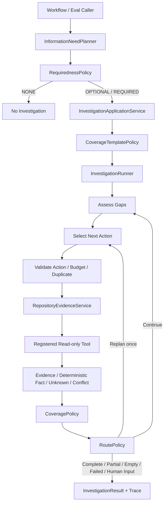

# M0 Agent Core 第四步设计方案：受控 Investigation Loop

> 文档状态：代码已实现并通过真实 PostgreSQL 门禁  
> 版本：0.3  
> 日期：2026-07-23  
> 对应总设计：阶段 3「受控 Investigation Loop」  
> 前置实现：Step 1 Eval Baseline、Step 2 最小 PRD Workflow、Step 3 Repository Tools 与确定性 Evidence

## 1. 文档目的

本文档定义 PRD Agent 第四步的实现边界：在现有固定 commit、只读 Repository Tools、Evidence、确定性 Fact、Unknown 与 Conflict 之上，增加 Information Need Planner、Coverage、调查预算、动作去重、无进展停止、一次 Replan 和可审计 Investigation Trace。

本步骤解决的问题是：系统不再由评测 Fixture 预先指定一次工具调用，而是能围绕一个明确问题，在严格边界内决定“是否需要查、下一步查什么、何时停止”。

本步骤不实现语义 Grounding，也不宣称工具结果已经支持最终 PRD Claim。交付物是可重复评测的 `Bounded Investigation Loop`，并与现有 `Single Retrieval` 做真实对比。

## 2. 步骤编号与总设计映射

仓库实施步骤比总体设计的阶段编号大 1：

| 仓库实施步骤 | 总设计阶段 | 当前状态 |
| --- | --- | --- |
| Step 1 | 阶段 0：评测场景与 Baseline | 已实现 |
| Step 2 | 阶段 1：最小 PRD 垂直切片 | 已实现 |
| Step 3 | 阶段 2：Repository Tools 与 Evidence | 主链路已实现，仍有硬化项 |
| **Step 4** | **阶段 3：受控 Investigation Loop** | **本文设计范围** |
| Step 5 | 阶段 4：Grounding 与 Eval | 后续 |
| Step 6 | 阶段 5：完整 PRD Workflow | 后续 |
| Step 7 | 阶段 6：Web 展示 | 后续 |
| Step 8 | 阶段 7：历史 PRD 与 RAG | 后续 |
| Step 9 | 阶段 8：外部集成 | 后续 |
| Step 10 | 阶段 9：产品化基础设施 | 后续 |

因此，“第四步”不是总设计的“阶段 4 Grounding”，而是总设计的“阶段 3 受控 Investigation Loop”。Grounding 保持为第五步。

## 3. 当前实现基线

### 3.1 已可直接复用的能力

当前代码已经提供：

- `WorkflowService`：需求摘要、澄清、大纲确认、单个确认单元、Markdown 输出、幂等和乐观锁。
- `RepositoryEvidenceService`：Tool Action 校验、固定 Snapshot、工具执行、Evidence 归一化、确定性 Fact 构造、Conflict 检测和持久化。
- `ToolRegistry`：按 `tool_id + tool_schema_version` 注册和校验结构化 Action。
- 六个只读仓库工具：`repo_tree`、`search_text`、`read_file`、`parse_openapi`、`parse_database_schema`、`find_related_tests`。
- Git Object Reader：所有读取绑定 40 位 `resolved_commit_sha`，不读取工作树漂移内容。
- Evidence 真实性链：repository、commit、blob、locator、excerpt、content hash 可复核。
- `ToolStatus`：`SUCCEEDED / PARTIAL / EMPTY / FAILED / BLOCKED`。
- `UnknownItem`：Empty、Partial、Blocked、Failed 等结果不会自动升级为否定事实。
- 内存与 PostgreSQL Evidence Store。
- Direct Prompt、Minimal Workflow、Single Retrieval 三套 Eval 配置。

### 3.2 2026-07-23 验证结果

本设计编写前的本地验证结果：

| 验证项 | 结果 |
| --- | --- |
| 全量自动化测试 | `63 passed` |
| Direct Prompt | 30/30 Runs 成功 |
| Minimal Workflow | 30/30 Runs 成功 |
| Single Retrieval | 30/30 Runs 成功 |
| Single Retrieval `requirement_coverage` | 均值 0.90 |
| Minimal Workflow `requirement_coverage` | 均值 0.85 |
| `unsupported_claim_rate` | 尚未实现 Grounding，保持 `not_applicable` |

这些数字只证明离线契约与当前 Stub/Heuristic 路径可重复运行，不等于真实模型质量结论。

### 3.3 进入 Loop 前必须正视的缺口

当前 Step 3 主链路可用，但尚未完全达到其设计文档的全部门禁：

1. 缺少真实 PostgreSQL 的原子性、并发幂等和约束集成测试。
2. `RUNNING` Tool Call 失联后没有 stale 扫描和 `WORKER_LOST` 收敛策略。
3. `save_running` 与 `complete` 之间发生进程崩溃时，会保留可审计但不能自动恢复的 `RUNNING` 记录。
4. 总设计 Portfolio Core 要求的 `find_symbol`、`find_references` 尚未实现；当前 Registry 只有六个工具。
5. `tool_calls` 尚无 `investigation_id`，Action Signature 也尚未按 Investigation 建立重复约束。
6. 现有 `RequirementBrief.from_mapping` 明确拒绝写入调查支持字段，Step 4 不能直接把 Investigation 强行塞进 Step 2 的模型输出路径。

处理原则：第 1～3 项作为 Step 4 开始循环调用工具前的 P0 硬化切片；第 4 项不阻塞最小 Loop，但必须在需要 Symbol/Reference Coverage 的 Case 进入发布门禁前补齐；第 5～6 项由本步骤新增的领域和持久化边界解决。

## 4. 本步骤目标

第四步完成后，系统必须能够：

1. 对给定阶段或确认单元生成结构化 Information Need。
2. 区分 `NONE`、`OPTIONAL`、`REQUIRED`，并由系统策略而非模型决定是否执行调查。
3. 根据 Need 类型初始化明确的 Coverage 模板。
4. 在固定 commit 和工具白名单内执行最多 5 轮、12 次工具调用的有限 Loop。
5. 拒绝同一 Investigation 内完全相同的成功 Action。
6. 根据新增 Evidence、Fact、Unknown、Conflict 和 Coverage 变化判断是否有进展。
7. 连续两轮无进展时确定性停止。
8. Coverage 仍有缺口且原计划无有效动作时，最多 Replan 一次。
9. 为所有终止路径保存明确 `stop_reason`。
10. 产生面向用户的公开 Trace，不泄露模型私有推理、完整代码或敏感内容。
11. 从持久化 Investigation 状态继续，不重复已经完成的 Action，也不重置预算。
12. 运行 `Single Retrieval` 与 `Bounded Investigation Loop` 的可比评测。

## 5. 明确不在本步骤实现

- Source Grounding Checker。
- PRD Claim 与 Fact 的语义支持判定。
- Grounding 失败后的定向补充调查；本步骤只预留 `trigger_kind`。
- 自然语言 Evidence 自动升级为 `CODE_VERIFIED`。
- 完整动态确认单元和全文 PRD Workflow。
- 历史 PRD Retriever、全文检索或 pgvector。
- Web、FastAPI、SSE、Redis、Celery、OIDC 和多 Worker。
- GitHub/GitLab、飞书、Codex 或 Claude Code 外部适配器。
- 任意代码执行、Shell、网络读取、代码写入或仓库修改。

`PARTIAL` 的 Investigation 可以向后续步骤提供 Evidence、Unknown 和风险，但在 Step 5 Grounding 完成前，不能据此生成已验证的自然语言当前系统结论。

## 6. 核心设计决策

### 6.1 外层 Workflow 与内层 Investigation 分离

`WorkflowService` 继续拥有用户确认、Task、Run、Outline 和 Unit 的业务语义。`InvestigationService` 只负责一个 Information Need 的调查生命周期。

```text
PRD Workflow
  └─ UNIT_PREPARATION
      └─ InformationNeedPlanner
          ├─ NONE      → 返回主流程
          ├─ OPTIONAL  → Policy 决定跳过或创建 Investigation
          └─ REQUIRED  → 创建 Investigation
                           └─ Bounded Investigation Loop
```

Investigation 不能确认大纲、确认 Unit、改变 Task 最终状态或绕过用户输入节点。

### 6.2 模型提议，Policy 裁决

模型可以输出：

- 信息缺口描述。
- 建议 Requiredness。
- 建议 Coverage。
- 下一 Tool Action。
- 一次 Replan 结果。

确定性 Policy 必须裁决：

- 是否允许从 `NONE` 升为调查。
- 是否有数据源和工具权限。
- Tool 是否注册且参数是否合法。
- Snapshot 是否与 Investigation 固定 commit 一致。
- 是否超预算。
- Action 是否重复。
- 是否有进展。
- 是否继续、Replan 或停止。

### 6.3 Coverage 是停止依据，不是模型自评分

模型不能直接把 Coverage 写成 `COVERED`。Coverage 更新必须引用本轮产生的 Evidence、Fact、Unknown 或 Conflict，并通过 `CoveragePolicy` 校验。

### 6.4 Action Signature 与请求幂等分离

- `idempotency_key`：防止客户端或 Worker 重试创建第二次物理调用。
- `action_signature`：防止模型在同一 Investigation 中重复做同一逻辑动作。

Action Signature 继续复用 Step 3 的算法：

```text
hash(tool_id + schema_version + repository_id + normalized_arguments + resolved_commit_sha)
```

重复判断的作用域是 `investigation_id + action_signature`。

### 6.5 Loop 不修改 Step 3 的事实语义

Step 4 组合已有 Tool/Evidence 能力，不改变以下规则：

- 普通搜索和文件片段仍只是 Evidence。
- 只有确定性 Parser 结果在机械复核后可以形成 `CODE_VERIFIED` Fact。
- `EMPTY` 不等于不存在。
- `PARTIAL` 不等于完整覆盖。
- 外部内容不具有系统指令权。

## 7. 总体架构



建议新增模块：

```text
src/prd_agent/
  investigation/
    models.py
    planner.py
    coverage.py
    budget.py
    progress.py
    policies.py
    runner.py
    trace.py
    errors.py
  application/
    investigation_service.py
  storage/
    memory_investigation.py
    postgres_investigation.py
  eval/
    bounded_investigation.py
```

## 8. 领域模型

### 8.1 InformationNeed

```python
class Requiredness(StrEnum):
    NONE = "NONE"
    OPTIONAL = "OPTIONAL"
    REQUIRED = "REQUIRED"


class NeedStatus(StrEnum):
    PLANNED = "PLANNED"
    SKIPPED = "SKIPPED"
    INVESTIGATING = "INVESTIGATING"
    SATISFIED = "SATISFIED"
    UNSATISFIED = "UNSATISFIED"


class InformationNeed(BaseModel):
    information_need_id: str
    task_id: str | None
    run_id: str | None
    unit_id: str | None
    trigger_stage: str
    question: str
    requiredness: Requiredness
    source_types: tuple[str, ...]
    required_coverage: tuple[str, ...]
    fallback: str
    status: NeedStatus
    planner_version: str
    context_hash: str
```

约束：

- `question` 只能包含一个可调查问题；多个独立问题拆成多个 Need。
- `NONE` 的 `required_coverage` 必须为空，且不得创建 Investigation。
- `REQUIRED` 必须有至少一个 Coverage Requirement 和明确 fallback。
- `source_types` 首版只允许 `CODE`；历史 PRD 留到 Step 8。
- `context_hash` 固定 Planner 输入，重试必须使用同一输入版本。

### 8.2 Coverage Requirement

```python
class CoverageStatus(StrEnum):
    NOT_REQUIRED = "NOT_REQUIRED"
    MISSING = "MISSING"
    PARTIAL = "PARTIAL"
    COVERED = "COVERED"
    CONFLICTING = "CONFLICTING"


class CoverageItem(BaseModel):
    key: str
    description: str
    status: CoverageStatus
    evidence_ids: tuple[str, ...] = ()
    fact_ids: tuple[str, ...] = ()
    unknown_ids: tuple[str, ...] = ()
    conflict_ids: tuple[str, ...] = ()
    updated_at_iteration: int | None = None
```

首版内置 Coverage Key：

| Key | 含义 | 典型工具 |
| --- | --- | --- |
| `repository_structure` | 相关模块和候选路径已定位 | `repo_tree` |
| `api_contract` | 接口字段、类型、必填、枚举或格式 | `parse_openapi`, `read_file` |
| `validation_logic` | 输入校验或业务校验位置 | `search_text`, `read_file` |
| `storage_schema` | 表字段、类型、Null、默认值、约束 | `parse_database_schema` |
| `downstream_usage` | 下游读取或引用情况 | 当前可用 `search_text`；补齐后优先 `find_references` |
| `tests` | 当前行为和边界测试 | `find_related_tests`, `read_file` |

### 8.3 Investigation

```python
class InvestigationStatus(StrEnum):
    PLANNED = "PLANNED"
    RUNNING = "RUNNING"
    COMPLETE = "COMPLETE"
    PARTIAL = "PARTIAL"
    EMPTY = "EMPTY"
    FAILED = "FAILED"
    CANCELLED = "CANCELLED"
    HUMAN_INPUT_REQUIRED = "HUMAN_INPUT_REQUIRED"


class StopReason(StrEnum):
    COVERAGE_COMPLETE = "COVERAGE_COMPLETE"
    NO_PROGRESS = "NO_PROGRESS"
    MAX_ITERATIONS_REACHED = "MAX_ITERATIONS_REACHED"
    TOOL_BUDGET_EXHAUSTED = "TOOL_BUDGET_EXHAUSTED"
    TOKEN_BUDGET_EXHAUSTED = "TOKEN_BUDGET_EXHAUSTED"
    PERMISSION_DENIED = "PERMISSION_DENIED"
    HUMAN_INPUT_REQUIRED = "HUMAN_INPUT_REQUIRED"
    USER_STOPPED = "USER_STOPPED"
    UNRECOVERABLE_ERROR = "UNRECOVERABLE_ERROR"


class Investigation(BaseModel):
    investigation_id: str
    information_need_id: str
    task_id: str | None
    run_id: str | None
    unit_id: str | None
    repository_id: str
    resolved_commit_sha: str
    status: InvestigationStatus
    coverage: dict[str, CoverageItem]
    iteration_count: int
    tool_call_count: int
    replan_count: int
    no_progress_rounds: int
    token_usage: int
    completed_action_signatures: frozenset[str]
    budget: InvestigationBudget
    stop_reason: StopReason | None
    policy_version: str
    version: int
```

### 8.4 InvestigationBudget

```python
class InvestigationBudget(BaseModel):
    max_iterations: int = 5
    max_tool_calls: int = 12
    max_replans: int = 1
    no_progress_limit: int = 2
    same_action_limit: int = 1
    token_budget: int = 12000
```

所有值由服务端 Profile 生成并持久化。模型只能读取剩余预算，不能扩大预算。

### 8.5 InvestigationResult

```python
class InvestigationResult(BaseModel):
    investigation_id: str
    status: InvestigationStatus
    stop_reason: StopReason
    coverage: dict[str, CoverageItem]
    evidence_ids: tuple[str, ...]
    fact_ids: tuple[str, ...]
    unknown_ids: tuple[str, ...]
    conflict_ids: tuple[str, ...]
    public_summary: str
    risk_summary: tuple[str, ...]
```

结果只保存 ID 和公开摘要；完整对象由 Evidence Query 边界读取，避免在 Workflow State 中复制大段代码片段。

## 9. Requiredness 与 Coverage 模板策略

### 9.1 Requiredness 决策

`InformationNeedPlanner` 输出建议后，`RequirednessPolicy` 应执行以下确定性规则：

| 场景 | 最低等级 |
| --- | --- |
| 纯新增、与当前系统无依赖 | `NONE` |
| 外部信息只改善背景或措辞 | `OPTIONAL` |
| 修改既有字段、接口、状态、权限、校验、存储 | `REQUIRED` |
| 用户明确要求“基于当前实现” | `REQUIRED` |
| 当前上下文已有同 commit 的完整有效 Coverage | `NONE` 或复用已有结果 |
| 数据源未配置但信息非关键 | `OPTIONAL` 并跳过 |
| 数据源未配置且信息关键 | `REQUIRED`，进入 `HUMAN_INPUT_REQUIRED` |

Policy 可以将模型建议升级，但不能无依据将 `REQUIRED` 降级为 `OPTIONAL/NONE`。

### 9.2 Coverage 模板

首版提供版本化模板：

```python
COVERAGE_TEMPLATES = {
    "FIELD_OR_FORMAT_CHANGE": (
        "api_contract",
        "validation_logic",
        "storage_schema",
        "tests",
    ),
    "STATE_OR_RULE_CHANGE": (
        "validation_logic",
        "downstream_usage",
        "tests",
    ),
    "PERMISSION_CHANGE": (
        "validation_logic",
        "downstream_usage",
        "tests",
    ),
    "CODE_LOCATION_ONLY": (
        "repository_structure",
    ),
}
```

不适用项必须明确写为 `NOT_REQUIRED`，不能靠字段缺失表达。

### 9.3 Coverage 更新规则

- 至少一个已校验 Evidence 可以把 `MISSING` 更新为 `PARTIAL`。
- 只有满足该 Coverage Item 的完成谓词时才能更新为 `COVERED`。
- Parser 产生的 Supported 确定性 Fact 可以完成对应的 `api_contract` 或 `storage_schema`。
- 搜索命中本身通常只能达到 `PARTIAL`；读取最小必要片段后才可能完成代码位置类 Coverage。
- 工具截断时最高只能为 `PARTIAL`。
- 有相关 Conflict 时必须为 `CONFLICTING`，不能被后续单一来源静默覆盖。
- `EMPTY` 产生 Unknown，但不能把 Coverage 更新为 `COVERED`。
- Coverage 每次更新必须记录依据 ID 和迭代号。

## 10. Investigation Loop

### 10.1 节点

```text
START
→ ASSESS_GAPS
→ SELECT_NEXT_ACTION
→ VALIDATE_ACTION
→ EXECUTE_TOOL
→ COLLECT_RESULT
→ UPDATE_COVERAGE
→ MEASURE_PROGRESS
→ ROUTE
   ├─ CONTINUE → ASSESS_GAPS
   ├─ REPLAN   → SELECT_NEXT_ACTION
   └─ STOP     → FINALIZE
```

Step 3 的 `RepositoryEvidenceService` 已经包含执行、Evidence 归一化、确定性 Fact 构造和 Conflict 检测。Step 4 Runner 不重复实现这些内部阶段，而是在一次 Service 调用前后建立 Loop 控制。

### 10.2 ASSESS_GAPS

输入当前 Coverage，按以下顺序选择最高优先级缺口：

1. `CONFLICTING` 且可以通过另一个已授权来源消解。
2. `MISSING` 的 Required Coverage。
3. `PARTIAL` 的 Required Coverage。
4. Optional Coverage。

如果所有 Required Coverage 都是 `COVERED` 或 `NOT_REQUIRED`，立即以 `COVERAGE_COMPLETE` 停止。

### 10.3 SELECT_NEXT_ACTION

模型接收最小上下文：

- 调查问题。
- 当前最高优先级 Gap。
- Coverage 摘要。
- 已完成 Action 的公开摘要。
- 可用 Tool 的 Schema。
- 固定 repository 和 commit。
- 剩余预算。

模型输出单个 Action，不允许一次输出工具链。

```json
{
  "tool_id": "search_text",
  "tool_schema_version": "1",
  "arguments": {"query": "discount_value"},
  "purpose": "定位 discount_value 的校验与存储使用位置",
  "target_coverage": ["validation_logic", "storage_schema"]
}
```

`repository_id` 与 `resolved_commit_sha` 由服务端补入，不能接受模型覆盖。

### 10.4 VALIDATE_ACTION

验证顺序：

1. Investigation 仍为 `RUNNING`，未收到取消标记。
2. 迭代、工具调用和 Token 预算仍有余额。
3. Tool 存在于当前 Registry 和 Investigation 白名单。
4. 参数通过 Pydantic Schema。
5. 参数不包含绝对路径、路径穿越或超限值。
6. Action commit 与 Investigation 固定 commit 相同。
7. `target_coverage` 确实仍有缺口。
8. Action Signature 未成功执行过。

模型参数错误允许一次同输入结构修复；策略拒绝、重复动作和权限错误不做模型格式修复。

### 10.5 EXECUTE_TOOL

调用现有 `RepositoryEvidenceService.execute`：

```python
idempotency_key = f"investigation:{investigation_id}:action:{action_signature}:attempt:{attempt}"
```

每个 Tool Call 必须写入 `investigation_id`。恢复时先查相同幂等键和 Action Signature，再决定重放结果、等待 stale 判定或开始新动作。

### 10.6 MEASURE_PROGRESS

一轮被视为“有进展”，必须至少满足一项：

- 新增一个不同 `content_hash + locator` 的有效 Evidence。
- 新增一个不同语义键的确定性 Fact。
- 新增一个此前未知的 Unknown。
- 新增一个此前未发现的 Conflict。
- 至少一个 Required Coverage 状态按下列方向前进：

```text
MISSING → PARTIAL → COVERED
```

以下不算进展：

- 仅 public summary 变化。
- 同一 Evidence 换 ID 重复写入。
- Action 被重复策略拒绝。
- `PARTIAL` 与 `MISSING` 之间来回抖动。
- 模型声称“已经理解”，但没有新的来源或 Coverage 依据。

连续无进展次数达到 2，停止为 `NO_PROGRESS`。

### 10.7 Replan

仅在以下条件同时满足时允许一次 Replan：

- Required Coverage 仍未完成。
- 尚有工具、迭代和 Token 预算。
- 原计划的候选动作已重复、无效或连续没有进展。
- `replan_count < max_replans`。

Replan 只能改变候选动作顺序和查询策略，不能改变原调查问题、Requiredness、固定 commit 或扩大预算。若问题本身错误，应停止并进入 `HUMAN_INPUT_REQUIRED`，不能伪装成 Replan。

### 10.8 Stop Reason 优先级

同一边界同时满足多个条件时，使用稳定优先级：

1. `USER_STOPPED`
2. `PERMISSION_DENIED`
3. `HUMAN_INPUT_REQUIRED`
4. `COVERAGE_COMPLETE`
5. `NO_PROGRESS`
6. `TOOL_BUDGET_EXHAUSTED`
7. `TOKEN_BUDGET_EXHAUSTED`
8. `MAX_ITERATIONS_REACHED`
9. `UNRECOVERABLE_ERROR`

这样同一输入和状态不会因条件判断顺序不同产生不同报告。

### 10.9 终态映射

| 条件 | Investigation Status | Stop Reason |
| --- | --- | --- |
| Required Coverage 完整 | `COMPLETE` | `COVERAGE_COMPLETE` |
| 有有效 Evidence，但 Coverage 未完整 | `PARTIAL` | 具体预算或无进展原因 |
| 所有成功调用均无结果 | `EMPTY` | 具体预算或无进展原因 |
| 关键权限缺失且不可继续 | `HUMAN_INPUT_REQUIRED` | `PERMISSION_DENIED` |
| 必须由用户提供业务决策 | `HUMAN_INPUT_REQUIRED` | `HUMAN_INPUT_REQUIRED` |
| 用户停止 | `CANCELLED` | `USER_STOPPED` |
| 状态或存储无法安全恢复 | `FAILED` | `UNRECOVERABLE_ERROR` |

## 11. Planner 与模型契约

### 11.1 Information Need Planner 输出

```json
{
  "question": "当前订单金额字段的 API、校验和存储格式是什么？",
  "suggested_requiredness": "REQUIRED",
  "need_kind": "FIELD_OR_FORMAT_CHANGE",
  "source_types": ["CODE"],
  "suggested_coverage": [
    "api_contract",
    "validation_logic",
    "storage_schema",
    "tests"
  ],
  "fallback": "ASK_USER_OR_MARK_UNKNOWN",
  "public_reason": "该需求修改已有字段格式，需要确认现有接口、校验和存储约束"
}
```

输出经过 `extra="forbid"` 的 Schema 校验，并允许一次同输入格式修复。Planner 版本、模型 ID、输入 Hash 和 Token Usage 必须记录。

### 11.2 Action Selector 输出

Action Selector 只能看到工具公开 Schema 和必要调查上下文，不读取：

- 访问令牌或本地绝对路径。
- 完整 Git 文件。
- 与当前 Need 无关的聊天历史。
- 模型私有推理。
- 其他用户或任务的数据。

### 11.3 离线确定性 Selector

测试和首个 Eval 必须提供 `ScriptedInvestigationModel` 或等价 Stub：根据 Case 与 Coverage 产生固定 Action 序列。它用于验证 Loop 控制，不作为真实智能质量结论。

真实模型 Adapter 使用同一结构化协议，不能绕过 Policy。

## 12. 持久化设计

### 12.1 新增表

```sql
CREATE TABLE information_needs (
    information_need_id TEXT PRIMARY KEY,
    task_id TEXT NULL,
    run_id TEXT NULL,
    unit_id TEXT NULL,
    trigger_stage TEXT NOT NULL,
    question TEXT NOT NULL,
    requiredness TEXT NOT NULL,
    source_types_json JSONB NOT NULL,
    required_coverage_json JSONB NOT NULL,
    fallback TEXT NOT NULL,
    status TEXT NOT NULL,
    planner_version TEXT NOT NULL,
    context_hash TEXT NOT NULL,
    created_at TIMESTAMPTZ NOT NULL
);

CREATE TABLE investigations (
    investigation_id TEXT PRIMARY KEY,
    information_need_id TEXT NOT NULL REFERENCES information_needs(information_need_id),
    task_id TEXT NULL,
    run_id TEXT NULL,
    unit_id TEXT NULL,
    repository_id TEXT NOT NULL,
    resolved_commit_sha CHAR(40) NOT NULL,
    status TEXT NOT NULL,
    coverage_json JSONB NOT NULL,
    budget_json JSONB NOT NULL,
    iteration_count INTEGER NOT NULL,
    tool_call_count INTEGER NOT NULL,
    replan_count INTEGER NOT NULL,
    no_progress_rounds INTEGER NOT NULL,
    token_usage INTEGER NOT NULL,
    stop_reason TEXT NULL,
    policy_version TEXT NOT NULL,
    version INTEGER NOT NULL,
    created_at TIMESTAMPTZ NOT NULL,
    updated_at TIMESTAMPTZ NOT NULL
);

CREATE TABLE investigation_steps (
    investigation_step_id TEXT PRIMARY KEY,
    investigation_id TEXT NOT NULL REFERENCES investigations(investigation_id),
    sequence INTEGER NOT NULL,
    iteration INTEGER NOT NULL,
    step_type TEXT NOT NULL,
    status TEXT NOT NULL,
    public_summary TEXT NOT NULL,
    input_hash TEXT NOT NULL,
    output_json JSONB NOT NULL,
    created_at TIMESTAMPTZ NOT NULL,
    UNIQUE (investigation_id, sequence)
);
```

### 12.2 现有表变更

- `tool_calls` 新增 `investigation_id` 外键。
- `verified_facts`、`unknown_items`、`source_conflicts` 新增 `investigation_id`。
- `tool_calls` 增加 `attempt`、`retry_of_tool_call_id`。
- 对已成功 Action 建立部分唯一约束或事务内锁定：

```sql
CREATE UNIQUE INDEX uq_investigation_successful_action
ON tool_calls(investigation_id, action_signature)
WHERE status IN ('SUCCEEDED', 'PARTIAL', 'EMPTY');
```

`FAILED` 是否允许重试由 Tool Retry Policy 决定，且必须增加 `attempt` 和 `retry_of`，不能伪装成新 Action。

### 12.3 事务边界

每个节点采用短事务：

1. 读取 Investigation 版本和取消状态。
2. 校验预算与动作。
3. 预留 Action，写 `RUNNING` Tool Call。
4. 事务外执行只读工具。
5. 在同一完成事务中写 ToolResult、Evidence Bundle、Coverage、计数、Step 和 Domain Event。
6. 使用 Investigation `version` 乐观锁防止并发完成覆盖。

工具执行期间不持有数据库长事务。

### 12.4 恢复

- 每个节点完成后持久化，不依赖进程内 Graph State。
- 恢复时从 `investigations + investigation_steps + tool_calls` 重建状态。
- 已完成 Action 从持久化 Action Signature 恢复。
- 预算使用量从持久化计数恢复，不从默认值重新开始。
- stale `RUNNING` 超过阈值后收敛为 `FAILED/WORKER_LOST`。
- 如果工具契约明确支持安全重试，可以创建关联重试；否则停止为 `PARTIAL/UNRECOVERABLE_ERROR`。
- 不允许通过重新执行工具来“猜测”上一次调用是否成功。

## 13. 与现有 Workflow 的接入

### 13.1 Step 4 最小接入点

为控制范围，本步骤先提供两个调用入口：

1. 独立 `InvestigationApplicationService.run(...)`，供测试、CLI 和 Eval 调用。
2. 在现有单 Unit Workflow 的 `UNIT_PREPARATION` 与 `generate_unit` 之间增加可选 Investigation Hook。

Hook 只注入：

- Investigation Result 摘要。
- Deterministic Fact ID。
- Unknown ID。
- Conflict ID。
- Evidence Locator 摘要。

它不改变 Step 2 的 Outline/Unit 确认 Policy。

### 13.2 RequirementBrief 的兼容处理

现有 `RequirementBrief.from_mapping` 拒绝模型直接写调查支持字段，这是正确的安全边界。Step 4 应新增应用服务命令，由系统引用 Investigation 结果：

```python
AttachInvestigationResult(
    task_id,
    information_need_id,
    investigation_id,
    expected_task_version,
)
```

只有系统查询到属于当前 Task、固定版本且终态有效的 Fact/Unknown/Conflict ID 后，才能创建新的 `RequirementBriefVersion` 或 Unit Context。模型不能自行提交这些 ID。

### 13.3 REQUIRED 降级

`REQUIRED` 调查未完成时：

- `HUMAN_INPUT_REQUIRED`：主流程进入用户澄清。
- 用户可提供信息、明确授权假设或修改范围。
- 未授权假设不能进入 `target_decisions`。
- Step 4 最小 Eval 可以结束为 Partial，但正式 Workflow 不得生成确定性当前系统结论。

`OPTIONAL` 调查失败或跳过时可继续，但必须保存风险说明。

## 14. Trace、事件与可观测性

### 14.1 公开 Trace

每个 Investigation Step 记录：

- `sequence`、`iteration`、`step_type`、`status`。
- 公开目的和结果摘要。
- Coverage 变化。
- Tool ID、状态和耗时。
- 剩余预算。
- Stop Reason。

不记录模型私有推理、完整 Prompt、完整文件或敏感值。

### 14.2 Domain Event

至少产生：

- `InformationNeedPlanned`
- `InvestigationStarted`
- `InvestigationActionSelected`
- `InvestigationToolCompleted`
- `InvestigationCoverageUpdated`
- `InvestigationReplanned`
- `InvestigationCompleted`
- `InvestigationStopped`
- `InvestigationFailed`

### 14.3 指标

| 指标 | 计算方式 |
| --- | --- |
| Information Need Precision/Recall | Planner 输出与 Ground Truth 比较 |
| Coverage Completion Rate | 完成的 Required Coverage / 总 Required Coverage |
| Tool Call Count | 每个 Investigation 实际物理调用数 |
| Duplicate Action Rate | 被拒绝重复动作 / Selector 提议动作 |
| No-progress Termination Rate | `NO_PROGRESS` Investigation / 总 Investigation |
| Replan Rate | 发生 Replan 的 Investigation / 总 Investigation |
| Stop Reason Distribution | 各 Stop Reason 数量分布 |
| Evidence Yield | 新 Evidence 数 / Tool Call |
| Fact Yield | 新确定性 Fact 数 / Tool Call |
| Latency | Planner、Selector、Tool 和总时延 |
| Token Usage | Planner + Selector + Replan Token |

Step 4 的 `unsupported_claim_rate` 继续为 `not_applicable`，直到 Step 5 Source Grounding 实现。

## 15. 错误与降级策略

| 错误 | 处理 | 是否消耗预算 |
| --- | --- | --- |
| Planner 结构错误 | 同输入修复一次，仍失败则 Need 失败 | 消耗模型 Token，不消耗 Tool Call |
| 未注册 Tool | 拒绝 Action，计一次无效选择 | 不消耗物理 Tool Call |
| 参数 Schema 错误 | 同输入修复一次 | 不消耗物理 Tool Call |
| 重复成功 Action | 拒绝；选择不同动作或停止 | 不消耗物理 Tool Call |
| Commit 不一致 | 直接拒绝并失败，不允许修复为其他 commit | 不消耗 Tool Call |
| Tool `EMPTY` | 保存 Unknown，更新无进展 | 消耗 Tool Call |
| Tool `PARTIAL` | 保存 Evidence/Unknown，Coverage 最高 Partial | 消耗 Tool Call |
| Tool `FAILED` | 按 Tool Retry Policy 有限重试或换动作 | 每次物理调用均消耗 |
| Tool `BLOCKED` | 权限类转人工输入，内容类换安全动作 | 依实际物理调用计数 |
| Evidence 校验失败 | Tool Call 收敛失败，不接纳 Evidence | 消耗 Tool Call |
| Store 完成失败 | 回滚完成事务，依 stale 策略恢复 | 不重复增加已持久化计数 |
| 连续无进展 | `PARTIAL/EMPTY + NO_PROGRESS` | 停止 |
| 预算耗尽 | `PARTIAL/EMPTY + 对应 Stop Reason` | 停止 |
| 用户停止 | 写取消标记，阻止下一节点 | 停止 |

错误消息必须是稳定 `error_code + public_message + retryable + correlation_id`，不得返回 Provider 堆栈、绝对路径或凭证。

## 16. 安全约束

第四步增加模型选择动作的能力，因此必须保持更严格的边界：

1. 模型只从版本化 Tool Registry 白名单选择。
2. `repository_id` 和 commit 由服务端绑定，不接受模型自由填写。
3. 所有路径仍通过 Step 3 Path/Content Policy。
4. 不暴露 Shell、网络、代码执行、写文件、Git 写入工具。
5. 外部代码和文档一律作为不可信数据，不执行其中指令。
6. Action Purpose 只用于公开说明，不改变授权范围。
7. Tool Result 进入 Selector 前只提供必要摘要，避免上下文膨胀和提示注入。
8. Evidence 展示前再次脱敏。
9. Trace 和 Eval 报告不包含完整代码、绝对路径和密钥。
10. 不同 Task/Actor 的 Need、Investigation、Tool Call 和 Evidence 必须隔离。

## 17. Eval 设计

### 17.1 新配置

新增：

```json
{
  "config_id": "bounded-investigation-v1",
  "prompt_version": "information-need-v1+action-selector-v1",
  "model_id": "scripted-investigation-model",
  "dataset_version": "eval-v1",
  "trials_per_case": 3,
  "timeout_seconds": 120,
  "budget": {
    "max_iterations": 5,
    "max_tool_calls": 12,
    "max_replans": 1,
    "no_progress_limit": 2
  }
}
```

### 17.2 对比组

必须并列运行：

1. Direct Prompt。
2. Minimal Workflow。
3. Single Retrieval。
4. Bounded Investigation Loop。

数据集、commit、Trial 数、模型类别和报告协议保持一致。使用真实模型对比时，四组必须使用可比的模型版本和采样配置。

### 17.3 Case 增强

每个 Case 增加：

```json
{
  "expected_requiredness": "REQUIRED",
  "expected_coverage": ["api_contract", "validation_logic", "storage_schema"],
  "allowed_tools": ["search_text", "read_file", "parse_database_schema"],
  "forbidden_actions": [],
  "expected_stop_reasons": ["COVERAGE_COMPLETE"],
  "max_reasonable_tool_calls": 5
}
```

至少覆盖：

- `NONE`：不应调用工具。
- `OPTIONAL`：预算不足时可跳过。
- `REQUIRED`：多步定位并读取。
- Parser 直接完成 Coverage。
- Search 后 Read 的两步调查。
- `EMPTY` 后换不同动作。
- 重复动作拒绝。
- 连续无进展停止。
- 一次 Replan 后完成。
- 预算耗尽后保留 Unknown。
- 权限阻止后人工输入。
- Source Conflict 导致 Coverage `CONFLICTING`。

### 17.4 Step 4 指标门禁

- 所有预期 `NONE` Case 的 Tool Call Count 为 0。
- 相同成功 Action 的物理执行次数为 1。
- 所有 Investigation 都有非空 Stop Reason。
- 不存在超过配置预算的 Investigation。
- `COVERAGE_COMPLETE` 后不再执行工具。
- Required Coverage 未完成时不能报告 `COMPLETE`。
- 敏感信息泄漏数为 0。
- 四套 Eval 报告可从固定命令重复生成。

模型质量数字不在设计文档中预填，必须由真实运行报告产生。

## 18. 测试方案

### 18.1 领域与 Policy 单元测试

- `NONE` Need 禁止创建 Investigation。
- `REQUIRED` Need 缺 Coverage 被拒绝。
- 模型建议降级时 Policy 保持最低 Requiredness。
- Coverage 模板版本稳定。
- `MISSING → PARTIAL → COVERED` 合法。
- `COVERED → MISSING` 非显式失效时非法。
- Conflict 将 Coverage 设为 `CONFLICTING`。
- `EMPTY` 不完成 Coverage。
- 预算不能为负或被模型扩大。
- Stop Reason 优先级稳定。

### 18.2 Action 与预算测试

- 相同参数不同键顺序产生相同 Signature。
- 相同 Action 在不同 commit 上 Signature 不同。
- 同 Investigation 重复成功 Action 被拒绝。
- 不同 Investigation 可执行同一逻辑 Action。
- Failed Action 只有 Retry Policy 允许时可关联重试。
- 被策略拒绝的动作不消耗物理 Tool Call。
- 实际 Tool Call、Iteration、Token 分别达到上限时停止。

### 18.3 Progress 与 Replan 测试

- 新 Evidence Locator 计为进展。
- 相同内容与 Locator 的重复 Evidence 不计进展。
- 新 Unknown 首次计为进展，重复 Unknown 不计。
- Coverage 前进重置 `no_progress_rounds`。
- 连续两轮无进展停止。
- Replan 最多一次。
- Replan 不能换 commit、问题或扩大预算。

### 18.4 Runner 测试

- 一次 Parser 调用完成 Coverage。
- Search → Read → Parser 多轮完成。
- `COVERAGE_COMPLETE` 立即停止。
- `PARTIAL`、`EMPTY`、`FAILED`、`BLOCKED` 路由正确。
- Action Selector 连续输出重复动作时停止而非死循环。
- 格式修复只发生一次。
- 用户取消后不执行下一动作。
- Trace 顺序和公开摘要稳定。

### 18.5 持久化与恢复测试

- Need、Investigation、Step、Tool Call、Coverage 原子写入。
- 同一 Need 最多一个活动 Investigation。
- 两个 Worker 竞争同一 Investigation 时只有一个预留成功。
- 进程在 Tool 前、Tool 后、完成事务前分别崩溃时可恢复。
- stale `RUNNING` 收敛到 `WORKER_LOST`。
- 恢复后预算不重置、Action 不重复。
- Investigation 乐观锁拒绝过期写入。
- PostgreSQL 部分唯一索引阻止重复成功 Action。

这些测试必须使用真实 PostgreSQL；SQLite 或内存实现只能用于快速单元测试。

### 18.6 Workflow 与 Eval 回归

- Step 2 所有用户确认测试保持通过。
- Step 3 所有路径、安全、Parser、Evidence 测试保持通过。
- `REQUIRED` Partial 回到用户澄清。
- `OPTIONAL` Partial 可以继续并保存风险。
- Direct、Minimal、Single Retrieval 报告不回归。
- Bounded Loop 报告记录 Coverage、Stop Reason 和 Tool Trace。

## 19. TDD 实施顺序

### Slice 0：Step 3 硬化门禁（P0）

- 为 PostgresEvidenceStore 增加真实 PostgreSQL 原子性和并发测试。
- 增加 stale `RUNNING` 检测与 `WORKER_LOST` 收敛。
- 明确 Store 失败后的回滚和重试行为。

交付：Loop 可以安全复用 Tool Call 底座。

### Slice 1：Information Need 与 Requiredness

- 新增领域枚举和模型。
- 实现 Planner Schema、一次修复和 RequirednessPolicy。
- 实现内存 Store 和单元测试。

交付：可判断 `NONE / OPTIONAL / REQUIRED`，但尚不调用工具。

### Slice 2：Coverage 与 Budget

- 实现 Coverage Template、状态迁移和完成谓词。
- 实现 InvestigationBudget 和 Stop Reason Policy。
- 增加非法状态和边界测试。

交付：可创建带固定 Coverage 和预算的 Investigation。

### Slice 3：Action Selector 与验证

- 定义结构化 Selector 契约。
- 服务端绑定 repository/commit。
- 接入 Tool Registry、参数校验和 Action Signature 去重。

交付：模型只能提出一个合法、非重复、预算内 Action。

### Slice 4：单轮 Runner

- 串联 Gap、Select、Validate、RepositoryEvidenceService 和 Coverage Update。
- 保存 Investigation Step 与公开 Trace。

交付：一次调查迭代可完整持久化。

### Slice 5：有限 Loop、无进展与 Replan

- 增加 Continue/Stop 路由。
- 实现进展指纹、连续无进展和一次 Replan。
- 实现全部 Stop Reason。

交付：多轮调查不会无限循环。

### Slice 6：PostgreSQL、并发与恢复

- 增加 Investigation 表、外键、索引和乐观锁。
- 实现节点恢复、stale Tool Call 处理和取消。
- 跑真实 PostgreSQL 集成测试。

交付：崩溃和并发下不重复动作、不重置预算。

### Slice 7：Workflow Hook

- 在 Unit Preparation 增加可选 Need/Investigation Hook。
- 系统级 Attach Result，不允许模型伪造 Fact ID。
- 验证 Required/Optional 降级路径。

交付：最小 PRD Workflow 可以按需调查，但仍保留用户确认语义。

### Slice 8：Bounded Investigation Eval

- 新增 Scripted Selector、配置、Case Ground Truth 和指标。
- 并列运行四组 Eval。
- 输出 Failure Analysis，并基于结果调整阈值。

交付：Single Retrieval 与有限 Loop 的可复现对比报告。

### Slice 9：Symbol/Reference Coverage 补齐（P1）

- 实现或明确后置 `find_symbol`、`find_references`。
- 对需要 downstream/reference Coverage 的 Case 启用门禁。

交付：满足 Portfolio Core 总设计中的 Repository Tool 清单。

## 20. 验收用例

### Case A：无需调查

纯新增、不依赖现有实现。Planner 输出 `NONE`，Tool Call Count 为 0，主流程继续。

### Case B：字段格式多步调查

先解析 OpenAPI，再读取校验，再解析数据库 Schema。Required Coverage 完整后以 `COVERAGE_COMPLETE` 停止，不继续搜索。

### Case C：重复动作

Selector 第二次提出同 commit、同工具、同参数。Policy 拒绝物理执行，要求不同动作；连续无有效动作后停止。

### Case D：Empty 不代表不存在

首次搜索为空，保存 Unknown；仍有预算时换不同查询。最终报告不得写“代码中不存在该字段”。

### Case E：Partial 与截断

工具结果被限制截断，Coverage 最高为 `PARTIAL`。预算耗尽后 Investigation 为 `PARTIAL`，保留风险。

### Case F：无进展

两轮只返回重复 Evidence。以 `NO_PROGRESS` 停止，Tool Call 不超过预算。

### Case G：一次 Replan

原计划无法覆盖 Storage，Replan 一次切换到数据库 Parser，完成后停止。第二次 Replan 被拒绝。

### Case H：固定 commit

调查开始后仓库分支移动。所有动作仍读取原 SHA；模型提出其他 SHA 时被拒绝。

### Case I：权限阻止

Required Need 的仓库未授权。不得降级成 `NONE`，进入 `HUMAN_INPUT_REQUIRED/PERMISSION_DENIED`。

### Case J：崩溃恢复

第三次动作完成前 Worker 崩溃。恢复后沿用 Coverage、预算和已完成 Signature，不重复前两次动作；stale 调用有明确终态。

## 21. 完成定义

第四步只有同时满足以下条件才算完成：

- Information Need、Requiredness、Coverage、Budget、Investigation、Stop Reason 均为版本化领域模型。
- `NONE / OPTIONAL / REQUIRED` 的 Policy 和降级语义有自动化测试。
- 每个 Investigation 固定 repository 和 commit。
- 所有模型 Action 都经过 Registry、Schema、权限、预算和重复校验。
- 同一 Investigation 的相同成功 Action 物理执行不超过一次。
- Coverage 更新全部可追溯到 Evidence、Fact、Unknown 或 Conflict。
- 连续无进展、预算耗尽、Coverage 完整、权限不足和用户停止都能确定性结束。
- Replan 最多一次，不能改问题、commit 或预算。
- 所有终态都有 Stop Reason、公开 Trace 和持久化结果。
- 崩溃恢复后不重复已完成 Action、不重置预算。
- 真实 PostgreSQL 的原子性、并发、唯一约束和 stale 恢复测试通过。
- Step 1～3 全量测试继续通过。
- Direct Prompt、Minimal Workflow、Single Retrieval、Bounded Investigation 四套 Eval 可重复运行。
- `NONE` Case 无无意义 Tool Call，敏感信息泄漏数为 0。
- 不把普通 Evidence、`EMPTY`、`PARTIAL` 或模型推断升级为已 Grounded Claim。

## 22. 完整需求剩余步骤评估

### 22.1 以总设计 10 个阶段为口径

当前代码已建立 Step 1～3 的主链路，因此从“现在”到总设计中的完整 V1.1/Production Profile，还剩 **7 个主步骤（Step 4～Step 10）**，另有 Step 3 硬化收尾。

| 后续步骤 | 主要交付 | 是否属于 Portfolio Core |
| --- | --- | --- |
| Step 4 | 受控 Investigation Loop | 是 |
| Step 5 | Source Grounding、定向回退、Loop + Grounding Eval | 是 |
| Step 6 | 动态确认单元、章节版本、全文检查、Evidence Appendix | 是 |
| Step 7 | Next.js/FastAPI、任务与调查展示、SSE/轮询 | Production Profile 后置能力 |
| Step 8 | 历史 PRD 检索、可选 pgvector、RAG Ablation | Portfolio 增强/完整范围 |
| Step 9 | GitHub/GitLab、飞书、外部 Coding Agent Adapter | Production Profile/外部集成 |
| Step 10 | Redis、Celery、Outbox、OIDC、多 Worker、部署告警 | Production Profile |

### 22.2 两个更实用的完成口径

- **达到 Portfolio Core“核心系统可完整生成一份 PRD”**：还差 **3 个主步骤（Step 4～6）**，外加 Step 3 硬化。第四步实现完成后还差 2 步。
- **达到总设计全部阶段的完整 V1.1/Production Profile**：还差 **7 个主步骤（Step 4～10）**，外加 Step 3 硬化。第四步实现完成后还差 6 步。

不建议把 Web、RAG 或外部集成提前到 Step 4 前面。当前最大价值链仍是：

```text
受控调查 → Grounding → 完整 PRD Workflow → 展示与集成
```

## 23. 第四步之后的衔接

Step 5 在本步骤稳定的 InvestigationResult 上实现 Source Grounding：

1. 对自然语言 Fact 检查 Evidence 是否真正支持，而非仅相关。
2. 对 PRD Claim 建立 `section_fact_links`。
3. 关键 Claim 缺来源时，最多触发一次 `GROUNDING_RETRY` 类型的定向 Investigation。
4. 再次失败时删除、降级或转为 Unknown/Assumption/Risk。
5. 启用 `unsupported_claim_rate`、Evidence Precision 和 Verified Fact Accuracy。

Step 5 不得放宽本步骤确立的预算、重复检测、Coverage、Stop Reason、固定 commit 和恢复语义。

## 24. 2026-07-23 实现与自测记录

已落地：

- Information Need、Requiredness、Coverage、Budget、Investigation、Stop Reason 领域模型。
- Requiredness、Coverage、Route、重复动作、无进展和一次 Replan Policy。
- 结构化 Planner、Model Action Selector 与离线 Scripted Selector。
- 同步可恢复 Investigation Runner、内存 Store 和 PostgreSQL Store。
- Tool Call 的 `investigation_id`、attempt、retry 关联和 stale `WORKER_LOST` 收敛。
- `find_symbol`、`find_references`，Repository Tool 总数达到 8 个。
- Workflow Unit Generation 的 ID-only Investigation Context Hook。
- Bounded Investigation Eval、运行元数据和对比指标。
- Step 4 PostgreSQL Migration 与 opt-in 真实数据库集成测试。

自测结果：

| 项目 | 结果 |
| --- | --- |
| 全量自动化测试 | `82 passed`，无跳过项 |
| PostgreSQL 集成测试 | PostgreSQL 16.14 本地实例真实执行通过 |
| Direct Prompt Eval | 30/30 成功 |
| Minimal Workflow Eval | 30/30 成功 |
| Single Retrieval Eval | 30/30 成功 |
| Bounded Investigation Eval | 30/30 成功 |
| PostgreSQL Eval 持久化 | 四组各 30 条，共 120 条 |
| Coverage Completion Rate | 0.90 |
| Duplicate Action Rate | 0.0667；重复动作均被策略拒绝 |
| No-progress Termination Rate | 0.10；对应无历史 PRD 来源 Case |
| 平均 Tool Call Count | 1.80 |
| 敏感信息泄漏 | 0 |

后续阶段事项：

1. 使用真实模型替换 Scripted Selector 后运行多 Trial 稳定性和成本评测。
2. `unsupported_claim_rate` 继续保持 `not_applicable`，由 Step 5 Grounding 启用。
