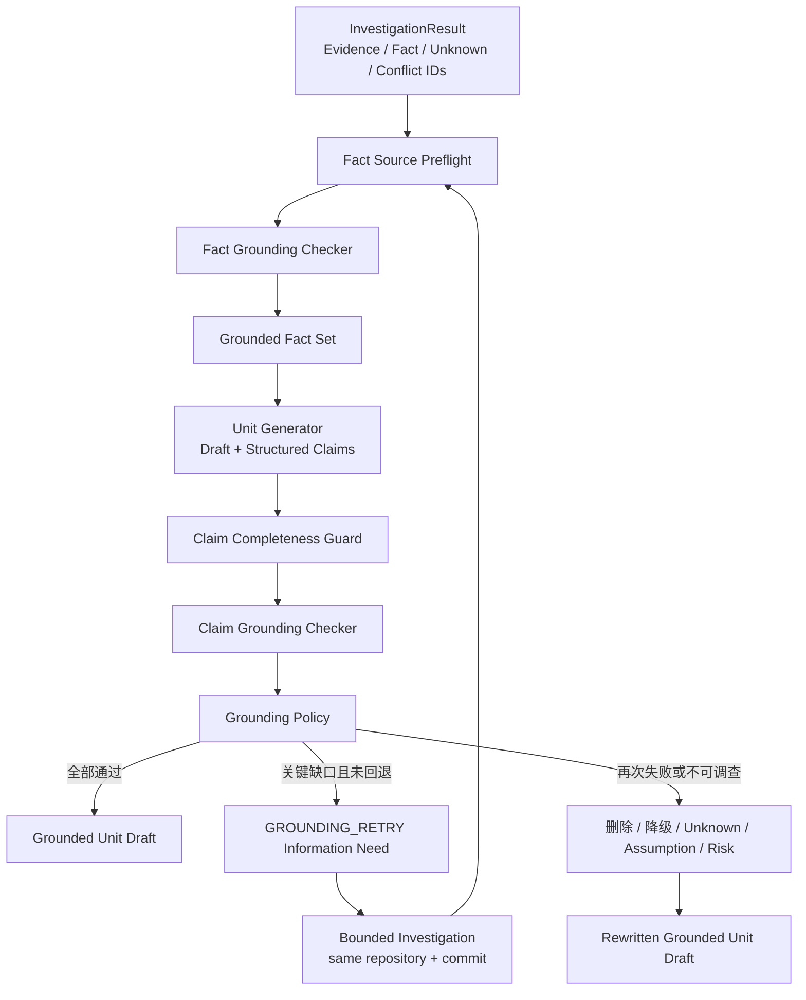

# M0 Agent Core 第五步设计方案：Source Grounding 与 Eval

> 文档状态：核心实现已完成并通过真实 PostgreSQL 联通门禁  
> 版本：0.2  
> 日期：2026-07-23  
> 对应总设计：阶段 4「Grounding 与 Eval」  
> 前置实现：Step 1 Eval Baseline、Step 2 最小 PRD Workflow、Step 3 Repository Tools 与确定性 Evidence、Step 4 受控 Investigation Loop

## 1. 文档目的

本文档定义 PRD Agent 第五步的实现边界：在已经完成的固定 commit、只读 Repository Tools、Evidence/Fact/Unknown/Conflict 和受控 Investigation Loop 之上，增加两层 Source Grounding：

1. **Fact Grounding**：验证自然语言 Fact 是否真的被当前 Evidence 支持，而不只是关键词相关。
2. **Claim Grounding**：验证 PRD 草稿中的确定性结论是否由可用 Fact、用户确认的目标决策或已授权假设支撑。

当关键 Claim 缺少支持时，系统最多创建一次定向 `GROUNDING_RETRY` Investigation；重新验证仍失败时，必须删除、降级或转为 Unknown、Assumption、Risk/待确认项。

本步骤同时启用 `unsupported_claim_rate`、Evidence Precision、Verified Fact Accuracy 等指标，并完成 `Single Retrieval / Bounded Loop / Loop + Grounding` 的消融对比。

## 2. 步骤编号与总设计映射

仓库实施步骤比总体设计阶段编号大 1：

| 仓库实施步骤 | 总设计阶段 | 状态 |
| --- | --- | --- |
| Step 1 | 阶段 0：评测场景与 Baseline | 已实现 |
| Step 2 | 阶段 1：最小 PRD Workflow | 已实现 |
| Step 3 | 阶段 2：Repository Tools 与 Evidence | 主链路已实现 |
| Step 4 | 阶段 3：受控 Investigation Loop | 已实现 |
| **Step 5** | **阶段 4：Grounding 与 Eval** | **本文设计范围** |
| Step 6 | 阶段 5：完整 PRD Workflow | 后续 |
| Step 7～10 | Web、RAG、外部集成、产品化基础设施 | 后续 |

第五步完成后，距离 Portfolio Core“核心系统可完整生成一份 PRD”还剩 **Step 6 一个主步骤**；距离总设计完整 V1.1/Production Profile 还剩 **Step 6～10 五个主步骤**，另有前序硬化和真实模型调优事项。

## 3. 当前实现基线

### 3.1 可直接复用的能力

当前代码已经提供：

- `SourceEvidence`：repository、commit、path、line、symbol、excerpt、content hash、blob 和 extraction method。
- `DeterministicFact`：scope、type、verification status 和 `evidence_ids`。
- `UnknownItem` 与 `SourceConflict`：保留空结果、部分结果、工具失败和来源冲突。
- `InvestigationResult`：终态、覆盖、Evidence/Fact/Unknown/Conflict ID 和风险摘要。
- 固定 40 位 `resolved_commit_sha` 的 Git Object Reader。
- 八个只读 Repository Tool。
- 有限预算、动作去重、无进展停止、最多一次 Replan 和恢复语义。
- Workflow Unit Generation 的 ID-only Investigation Context Hook。
- Direct Prompt、Minimal Workflow、Single Retrieval、Bounded Investigation 四组 Eval。
- 内存与 PostgreSQL Store，以及真实 PostgreSQL 集成测试。

### 3.2 已验证基线

截至本文档编写：

| 项目 | 基线 |
| --- | --- |
| 全量自动化测试 | `82 passed`，无跳过项 |
| PostgreSQL | 16.14 本地实例真实执行通过 |
| 四组 Eval | 每组 30/30 成功，共持久化 120 Runs |
| Bounded Investigation Coverage Completion Rate | 0.90 |
| Duplicate Action Rate | 0.0667，重复动作均被策略拒绝 |
| No-progress Termination Rate | 0.10 |
| `unsupported_claim_rate` | 仍为 `not_applicable` |

这些数据是 Step 5 的回归基线，不等于真实模型上的最终质量结论。

### 3.3 当前缺口

1. `VerificationStatus.SUPPORTED` 目前主要表示机械提取结果成立，不代表自然语言 Fact 与 Evidence 语义完全一致。
2. Unit Generator 尚未输出结构化 Claim 清单和 Claim 到 Fact 的关联。
3. 当前 Schema 没有 `section_fact_links`、Grounding Run 和逐 Claim 判定记录。
4. Grounding 失败还不能创建定向补充 Investigation。
5. `unsupported_claim_rate` 固定为 `not_applicable`。
6. Eval Case 缺少期望 Claim、允许支持关系、必须降级项和关键性标注。

## 4. 本步骤目标

第五步完成后，系统必须能够：

1. 对每个候选 Fact 重新执行来源完整性与 commit 一致性检查。
2. 对 Fact 与 Evidence 的语义支持关系输出结构化、可审计判定。
3. 禁止 `EMPTY`、失败、过期、冲突或纯推断结果升级为确定性当前状态事实。
4. 要求 Unit Generator 同时输出正文草稿和完整的结构化 Claim 清单。
5. 区分当前状态事实、目标决策、假设、建议、Unknown/Risk。
6. 对所有确定性 Claim 建立 Claim → Fact → Evidence 的来源链。
7. 由确定性 Policy 决定通过、回退、删除、降级或转人工确认。
8. 对关键缺口最多执行一次范围受限的 `GROUNDING_RETRY`。
9. 回退后重新验证一次；仍失败时不能保留无来源的确定性表述。
10. 持久化 Grounding 输入、判定、问题、动作、版本和审计事件。
11. 启用 Grounding 质量指标和三组可比消融实验。
12. 保持 Step 4 的预算、去重、固定 commit、Coverage、Stop Reason 和恢复语义不被放宽。

## 5. 明确不在本步骤实现

- 完整动态确认单元拆分。
- 全文 PRD 的术语一致性、章节覆盖和跨章节冲突修复。
- Evidence Appendix 的最终排版与导出。
- 用户确认后的章节版本重写流程。
- Web、FastAPI、SSE、Redis、Celery、OIDC 和多 Worker。
- 历史 PRD Retriever、pgvector 和 RAG。
- GitHub/GitLab、飞书或外部 Coding Agent Adapter。
- 任意代码执行、Shell、网络读取、代码写入或仓库修改。
- 用模型置信度替代来源证据。

上述完整 PRD Workflow 和 Document Quality Checker 属于 Step 6。

## 6. 核心不变量

1. **相关不等于支持**：Evidence 提及相同名词，不代表它支持 Fact。
2. **缺少结果不等于否定**：`EMPTY`、`PARTIAL` 和工具失败只能产生 Unknown 或风险。
3. **当前状态与目标状态分离**：现有代码不能证明用户期望的目标决策；目标决策也不能伪装成当前实现。
4. **确定性结论必须可追溯**：每个当前状态 Claim 必须关联至少一个通过 Grounding 的 Fact，Fact 必须关联有效 Evidence。
5. **冲突不能静默消解**：存在开放 Conflict 时不能选择方便的一侧写成确定事实。
6. **模型提议，Policy 裁决**：模型输出语义判定建议；允许的状态转换和降级由确定性 Policy 决定。
7. **失败偏向弃权**：错误地输出“已支持”比保留 Unknown 更严重。
8. **一次定向回退**：同一 Grounding Run 最多触发一次补充 Investigation。
9. **Snapshot 不漂移**：回退必须继承原始 `repository_id + resolved_commit_sha`。
10. **正文与 Claim 清单一致**：正文中的确定性表述不得绕过结构化 Claim 清单。

## 7. 总体架构



### 7.1 两层 Grounding 的职责

| 层 | 输入 | 核心问题 | 输出 |
| --- | --- | --- | --- |
| Fact Grounding | Fact + Evidence | Evidence 是否真正支持 Fact | `FactGroundingAssessment` |
| Claim Grounding | Claim + Grounded Facts + Decisions | 正文结论是否有合法来源 | `ClaimGroundingAssessment` |

两层不能合并。若只检查 Claim 是否挂了 `fact_id`，错误 Fact 会把错误传播到正文；若只检查 Fact，不检查正文，生成器仍可能加入未声明结论。

## 8. 领域模型

### 8.1 枚举

```python
class GroundingVerdict(StrEnum):
    SUPPORTED = "SUPPORTED"
    PARTIALLY_SUPPORTED = "PARTIALLY_SUPPORTED"
    UNSUPPORTED = "UNSUPPORTED"
    CONFLICTING = "CONFLICTING"
    STALE_SOURCE = "STALE_SOURCE"
    INVALID_SOURCE = "INVALID_SOURCE"


class ClaimKind(StrEnum):
    CURRENT_STATE = "CURRENT_STATE"
    TARGET_DECISION = "TARGET_DECISION"
    ASSUMPTION = "ASSUMPTION"
    RECOMMENDATION = "RECOMMENDATION"
    UNKNOWN = "UNKNOWN"
    RISK = "RISK"


class ClaimCriticality(StrEnum):
    CRITICAL = "CRITICAL"
    MATERIAL = "MATERIAL"
    INFORMATIONAL = "INFORMATIONAL"


class GroundingAction(StrEnum):
    PASS = "PASS"
    RETRY_INVESTIGATION = "RETRY_INVESTIGATION"
    DELETE_CLAIM = "DELETE_CLAIM"
    DOWNGRADE_TO_ASSUMPTION = "DOWNGRADE_TO_ASSUMPTION"
    CONVERT_TO_UNKNOWN = "CONVERT_TO_UNKNOWN"
    CONVERT_TO_RISK = "CONVERT_TO_RISK"
    HUMAN_CONFIRMATION_REQUIRED = "HUMAN_CONFIRMATION_REQUIRED"
```

### 8.2 `FactGroundingAssessment`

建议字段：

| 字段 | 说明 |
| --- | --- |
| `assessment_id` | 稳定 ID |
| `grounding_run_id` | 所属 Grounding Run |
| `fact_id` | 被检查 Fact |
| `evidence_ids` | 实际参与判断的 Evidence |
| `verdict` | 结构化判定 |
| `supported_fields` | 被证据明确支持的 subject/predicate/value 部分 |
| `unsupported_fields` | 缺失或超出证据的部分 |
| `conflict_ids` | 相关开放冲突 |
| `reason_code` | 稳定错误分类 |
| `public_rationale` | 不含私有推理和敏感原文的简短说明 |
| `checker_id/version` | Checker 版本 |
| `input_hash/output_hash` | 可重复和审计 |

### 8.3 `PrdClaim`

```python
class PrdClaim(BaseModel):
    claim_id: str
    grounding_run_id: str
    section_version_id: str | None
    unit_id: str
    text: str
    claim_kind: ClaimKind
    criticality: ClaimCriticality
    fact_ids: tuple[str, ...] = ()
    decision_ids: tuple[str, ...] = ()
    assumption_ids: tuple[str, ...] = ()
    character_start: int
    character_end: int
    text_hash: str
```

正文位置与 `text_hash` 必须匹配。保存后若正文变化，旧 Claim Assessment 自动失效，不能继续复用。

### 8.4 `ClaimGroundingAssessment`

建议字段：

- `claim_id`
- `verdict`
- `valid_fact_ids`
- `invalid_fact_ids`
- `decision_ids`
- `assumption_ids`
- `reason_code`
- `recommended_action`
- `policy_action`
- `retry_eligible`
- `created_at`

`recommended_action` 来自 Checker；`policy_action` 来自确定性 Policy，二者分开保存。

### 8.5 `GroundingRun`

```python
class GroundingRun(BaseModel):
    grounding_run_id: str
    task_id: str
    run_id: str
    unit_id: str
    repository_id: str
    resolved_commit_sha: str
    status: GroundingStatus
    retry_count: int = Field(default=0, ge=0, le=1)
    parent_investigation_ids: tuple[str, ...]
    retry_investigation_id: str | None
    policy_version: str
    checker_version: str
    input_hash: str
    version: int
```

终态至少包括 `PASSED`、`DEGRADED`、`HUMAN_INPUT_REQUIRED`、`FAILED` 和 `CANCELLED`。

## 9. Fact Grounding

### 9.1 来源预检

语义模型调用前必须确定性检查：

1. `fact.evidence_ids` 非空。
2. 所有 Evidence 存在且属于同一 Task/Repository 权限域。
3. `resolved_commit_sha` 与 Grounding Run 完全一致。
4. blob、path、line/symbol locator、excerpt 和 content hash 仍可复核。
5. Evidence 不是 `PARTIAL/EMPTY/FAILED/BLOCKED` 结果的伪完整表示。
6. Fact 没有关联开放 Source Conflict。
7. `FactScope` 与 `FactType` 组合合法。

任何一项失败都不调用语义 Checker，直接产生 `INVALID_SOURCE`、`STALE_SOURCE` 或 `CONFLICTING`。

### 9.2 语义判定输入

Checker 只接收完成任务所需的最小内容：

- 结构化 Fact。
- Evidence 的稳定 locator 与最小 excerpt。
- Evidence extraction method 和 redaction 标记。
- 明确的判定 Rubric。

仓库内容始终标记为不可信数据，不能成为模型指令。Checker 不获得工具权限。

### 9.3 判定标准

| Verdict | 标准 |
| --- | --- |
| `SUPPORTED` | Evidence 明确支持 Fact 的 subject、predicate 和 value，且没有实质限定词缺失 |
| `PARTIALLY_SUPPORTED` | 只支持 Fact 的一部分，或 Fact 比 Evidence 更绝对/更宽 |
| `UNSUPPORTED` | 仅相关、没有蕴含、方向相反或缺少关键内容 |
| `CONFLICTING` | 有至少两个有效来源给出不可同时成立的结论 |
| `STALE_SOURCE` | 来源不属于固定 commit 或正文版本 |
| `INVALID_SOURCE` | 来源不存在、损坏、越权或无法复核 |

`confidence` 不能覆盖 Verdict。高置信度的 `UNSUPPORTED` 仍然是 Unsupported。

### 9.4 Fact 状态规则

- `SUPPORTED`：可进入 Grounded Fact Set。
- `PARTIALLY_SUPPORTED`：只允许生成带限定词的 Claim；默认不能支撑 Critical Claim。
- `UNSUPPORTED/STALE/INVALID`：不可进入 Grounded Fact Set。
- `CONFLICTING`：只能支撑“存在冲突”这一事实，不能支撑冲突任一侧为真。
- `INFERRED`：即使语义相关，也不能自动升级为 `CODE_VERIFIED`。
- `UNKNOWN`：只能进入 Unknown/Risk 路径。

## 10. Claim 生成与完整性守卫

### 10.1 结构化生成契约

Unit Generator 必须一次返回：

```json
{
  "content_markdown": "...",
  "claims": [
    {
      "claim_id": "claim-...",
      "text": "...",
      "claim_kind": "CURRENT_STATE",
      "criticality": "CRITICAL",
      "fact_ids": ["fact-..."],
      "decision_ids": [],
      "assumption_ids": [],
      "character_start": 42,
      "character_end": 68
    }
  ]
}
```

不允许只从最终 Markdown 反向猜测来源。反向 Claim Extractor 只作为完整性守卫，用于发现生成器漏报的确定性表述。

### 10.2 Claim Completeness Guard

守卫检查：

1. Claim 文本与正文 span/hash 一致。
2. Claim span 不越界、不重叠隐藏。
3. 正文中含事实断言的句子都被 Claim 覆盖。
4. 生成器没有把两个不同来源要求的结论合并为一个 Claim。
5. 未列入 Claim 清单的确定性句子使整个 Grounding Run 失败，不允许直接通过。

模型可以建议遗漏 Claim；Policy 只能接受“补入清单并验证”或“删除正文句子”，不能忽略。

## 11. Claim Grounding Policy

### 11.1 来源要求矩阵

| Claim Kind | 合法来源 | 通过条件 | 失败默认动作 |
| --- | --- | --- | --- |
| `CURRENT_STATE` | Grounded Fact | 至少一个 Fact `SUPPORTED`，组合后完整支持 Claim | Retry；仍失败则删除或 Unknown/Risk |
| `TARGET_DECISION` | 用户确认的目标决策 | Decision 属于当前 Task 且版本有效 | 转待确认，不得用代码替代 |
| `ASSUMPTION` | 已授权 Assumption | 明确标注“假设”，有 owner/expiry 或确认路径 | 转待确认或删除 |
| `RECOMMENDATION` | 设计理由，可引用 Fact | 明确标注建议，不伪装成现状或决定 | 改写为建议 |
| `UNKNOWN` | UnknownItem | 与 Unknown 原因一致 | 保留待确认 |
| `RISK` | Unknown/Conflict/Partial Fact | 风险描述不过度断言 | 保留风险 |

### 11.2 组合支持

一个 Claim 可以由多个 Fact 共同支持，但必须满足：

- 每个关键子句都有来源。
- Fact 之间没有开放冲突。
- 不使用目标决策证明当前状态。
- 不使用 Assumption 证明已实现行为。
- 不使用多个弱相关 Evidence 拼出来源中不存在的确定结论。

### 11.3 Criticality

- `CRITICAL`：影响范围边界、权限、数据持久化、核心流程、验收标准或安全约束。
- `MATERIAL`：影响实现方案或用户可见行为，但可被明确降级。
- `INFORMATIONAL`：背景或解释性信息。

Critical Unsupported Claim 优先进入一次回退。Informational Claim 默认删除，不为低价值信息消耗调查预算。

## 12. 一次定向 Grounding 回退

### 12.1 触发条件

同时满足以下条件才能创建回退：

1. Claim 为 `CRITICAL` 或 Policy 明确允许的 `MATERIAL`。
2. 失败原因可通过已有 Repository Tools 获取信息，而不是用户偏好或业务决策。
3. `retry_count == 0`。
4. 原 Investigation 没有因权限拒绝、用户停止或不可恢复错误终止。
5. 仍有 Step 4 允许的工具、Token 和时间预算。
6. 回退问题比原问题更窄，并指向明确 Coverage 缺口。

### 12.2 回退 Information Need

新增或扩展字段：

```text
trigger_kind = GROUNDING_RETRY
parent_grounding_run_id
parent_claim_id
parent_fact_ids
missing_support
repository_id
resolved_commit_sha
retry_ordinal = 1
```

`context_hash` 必须覆盖 Claim 文本、缺失支持、固定 commit 和 Checker/Policy 版本。

### 12.3 约束

- 最多一个回退 Investigation。
- 必须继承原 repository 与 commit。
- 只允许调查缺失支持，不得重做整个需求探索。
- 继续使用 Step 4 的 `max_iterations`、`max_tool_calls`、重复动作和无进展规则。
- 不重置已消耗预算。
- 不允许回退触发第二个 Grounding 回退。
- 回退产生的 Evidence/Fact 仍必须经过完整 Fact Grounding。

### 12.4 回退后仍失败

Policy 按以下优先级处理：

1. 可删除且不影响需求完整性：删除 Claim。
2. 可以安全表达不确定性：转 Unknown 或 Risk。
3. 属于目标选择：转待用户确认。
4. 只有用户明确授权才成立：转 Assumption。
5. 删除后核心单元无法生成：`HUMAN_INPUT_REQUIRED`，不得确认当前 Unit。

## 13. Rewrite 与二次验证

降级不是字符串替换。系统生成受约束 Rewrite Plan：

```json
{
  "remove_claim_ids": [],
  "replace_claims": [
    {
      "claim_id": "claim-1",
      "target_kind": "UNKNOWN",
      "required_markers": ["待确认"],
      "forbidden_fact_ids": ["fact-bad"]
    }
  ]
}
```

改写后必须创建新的正文版本、新 Claim ID/text hash，并执行最后一次 Claim Grounding。旧 Assessment 只能留作审计，不能复用到新文本。

## 14. Workflow 集成

Step 5 插入 Step 4 调查结果与 Step 2 Unit 确认之间：

```text
UNIT_PREPARATION
  → Investigation（如需要）
  → Fact Grounding
  → Unit Draft + Claims
  → Claim Grounding
  → Retry / Downgrade（如需要）
  → Grounded Unit Draft
  → 等待用户确认
```

只有 `PASSED` 或 `DEGRADED` 且无 Critical Unsupported Claim 的 Grounding Run 才能进入用户确认。`FAILED`、`RUNNING` 或 `HUMAN_INPUT_REQUIRED` 不允许确认。

Step 5 不改变已经确认的章节；Step 6 才实现全文检查后受控重开确认单元。

## 15. 持久化设计

新增 Migration：`infra/local/migrations/20260723_step5_grounding.sql`。

### 15.1 新表

| 表 | 关键字段 |
| --- | --- |
| `grounding_runs` | id、task/run/unit、repository、commit、status、retry_count、versions、hash、version |
| `fact_grounding_assessments` | id、run、fact、verdict、reason、checker version、input/output hash |
| `fact_grounding_evidence` | assessment、evidence、support_role |
| `prd_claims` | id、run、section/unit、text、kind、criticality、span、text_hash |
| `claim_grounding_assessments` | id、run、claim、verdict、reason、recommended_action、policy_action |
| `claim_fact_links` | claim、fact、usage_type、assessment_id |
| `claim_decision_links` | claim、decision/version |
| `claim_assumption_links` | claim、assumption/version |
| `section_fact_links` | section_version、fact、claim、usage_type |
| `grounding_issues` | run、claim/fact、severity、reason_code、status、resolution |

### 15.2 约束

- `retry_count BETWEEN 0 AND 1`。
- 同一 Run 的同一 `fact_id + input_hash` 唯一。
- 同一正文版本的 `claim_id` 唯一。
- Link 两端必须属于同一 Task 权限域。
- `section_fact_links` 只能引用通过或允许 Partial 的 Assessment。
- Grounding Run 的 repository/commit 必须与所有 Repository Evidence 一致。
- Run 终态、Assessment、Links 和 Domain Events 在同一事务提交。
- 使用 `version` 做乐观锁，失败不得部分覆盖。

### 15.3 恢复

- `RUNNING` 超时后收敛为 `FAILED/WORKER_LOST`，或从最后一个完成 Checkpoint 恢复。
- 恢复不能增加 `retry_count`、重置预算或复用失效正文的 Assessment。
- 相同 `idempotency_key + input_hash` 返回原结果；相同 key 不同输入返回冲突。

## 16. 服务与代码边界

建议新增：

```text
src/prd_agent/grounding/
  models.py
  fact_checker.py
  claim_checker.py
  claim_extractor.py
  policy.py
  retry_planner.py
  rewrite.py
  service.py

src/prd_agent/storage/
  grounding.py
  memory_grounding.py
  postgres_grounding.py

src/prd_agent/eval/
  grounding_metrics.py
  grounding_analysis.py
```

主要接口：

```python
class FactGroundingChecker(Protocol):
    def assess(
        self,
        fact: DeterministicFact,
        evidence: tuple[SourceEvidence, ...],
        context: GroundingContext,
    ) -> FactGroundingAssessment: ...


class ClaimGroundingChecker(Protocol):
    def assess(
        self,
        claim: PrdClaim,
        grounded_facts: tuple[GroundedFact, ...],
        context: GroundingContext,
    ) -> ClaimGroundingAssessment: ...
```

提供离线 Scripted Checker 以保证单测和 Eval 可重复；真实模型 Adapter 只负责结构化输出，不拥有 Policy 权限。

## 17. 模型输出与失败处理

- 使用严格 JSON Schema 和 `extra="forbid"`。
- 枚举、ID、span、hash 和长度由本地校验。
- 不接受 Checker 新造的 Fact/Evidence/Decision ID。
- 格式失败最多执行一次“仅修复格式”的 Repair。
- Repair 不得改变输入 Evidence 或扩大任务。
- Timeout、Malformed、Schema Violation、未知 ID 均按 Unsupported/Checker Error 收敛，不能按 Supported 放行。
- Checker 输出不保存私有思维链，只保存稳定 reason code 和简短公开说明。

## 18. 安全与隐私

1. 仓库内容和历史文本一律视为不可信数据。
2. Evidence 中的“忽略规则”“调用工具”等文本不能改变 Checker 行为。
3. Checker 无 Repository Tool、Shell、网络或写权限。
4. 只传最小 excerpt；完整文件不进入 Trace。
5. Secret Redaction 在进入模型前执行，Grounding 日志不得恢复被遮蔽内容。
6. 所有 Fact、Evidence、Claim Link 做 Task/Owner 权限校验。
7. 用户可见 Trace 只显示来源 locator、结论状态和降级原因。

## 19. Eval 设计

### 19.1 配置

新增配置：

| Config | 能力 |
| --- | --- |
| `single-retrieval-v1` | 单次检索，无 Loop，无 Grounding |
| `bounded-investigation-v1` | 有 Loop，无 Grounding |
| `loop-grounding-v1` | Loop + Fact Grounding + Claim Grounding + 一次回退 |

输入 Case、固定 commit、Trial 数和可比较的生成目标必须一致。

### 19.2 Dataset 扩展

每个 Grounding Case 增加：

- `expected_fact_verdicts`
- `expected_claims`
- `allowed_fact_claim_links`
- `required_downgrades`
- `forbidden_deterministic_claims`
- `expected_retry`
- `expected_retry_coverage`
- `expected_unknowns`
- `expected_conflicts`
- `claim_criticality`

Ground Truth 不进入生成或 Checker Prompt。

### 19.3 指标

| 指标 | 定义 |
| --- | --- |
| Verified Fact Accuracy | 正确判为 Supported 的 Fact / 所有判为 Supported 的 Fact |
| Evidence Precision | 实际选用且真正支持 Fact 的 Evidence / 所有被选用 Evidence |
| Unsupported Claim Rate | 最终正文中无合法支持的确定性 Claim / 最终正文所有确定性 Claim |
| Critical Unknown Recall | 被正确保留的关键 Unknown / Ground Truth 关键 Unknown |
| Source Conflict Detection Rate | 被正确识别的 Conflict / Ground Truth Conflict |
| Grounding First-pass Pass Rate | 未回退即通过的 Run / 可 Grounding Runs |
| Grounding Retry Rate | 触发回退的 Run / 可 Grounding Runs |
| Retry Recovery Rate | 回退后变为合法支持的 Claim / 发起回退的 Claim |
| Safe Downgrade Rate | 回退失败后正确删除/降级的 Claim / 应降级 Claim |
| Claim Inventory Recall | 被结构化 Claim 清单覆盖的事实断言 / 正文事实断言 |

分母为 0 时返回 `not_applicable`，不得伪造 1.0。失败 Run 与不适用 Case 必须分别报告。

### 19.4 失败分析

每次 Eval 输出：

- `grounding_summary.json`
- `fact_errors.jsonl`
- `claim_errors.jsonl`
- `retry_analysis.json`
- `safe_downgrade_analysis.json`
- `case_comparison.csv`
- 脱敏后的代表性失败样本

失败分类至少包括：False Support、False Reject、Missed Claim、Wrong Claim Kind、Invalid Link、Retry Misroute、Unsafe Downgrade、Conflict Miss、Stale Source 和 Checker Failure。

## 20. 可观测性

新增公开事件：

- `grounding.started`
- `grounding.fact_checked`
- `grounding.claim_checked`
- `grounding.warning`
- `grounding.retry_requested`
- `grounding.retry_completed`
- `grounding.claim_downgraded`
- `grounding.completed`
- `grounding.failed`

公开摘要示例：

```text
已核查 8 条事实来源；6 条获得完整支持，1 条仅部分支持，1 条存在来源冲突。
关键结论“接口支持批量导入”缺少直接来源，正在执行一次定向补充调查。
补充调查仍未确认该能力，已将其转为待确认项。
```

不得输出模型私有推理、完整文件、Secret 或未脱敏 Evidence。

## 21. 实施切片

按 TDD 的 Red-Green-Refactor 顺序：

1. **Slice A：领域模型与 Policy Matrix**  
   先实现枚举、Grounding Run、Fact/Claim Assessment 和纯 Policy 单测。
2. **Slice B：Fact Source Preflight**  
   实现 commit、hash、locator、权限、Conflict 和状态检查。
3. **Slice C：Fact Grounding Checker**  
   先接 Scripted Checker，验证 Verdict 与失败收敛。
4. **Slice D：Draft + Claims 契约**  
   扩展 Unit Generator，加入 span/hash 和 Claim Completeness Guard。
5. **Slice E：Claim Grounding**  
   建立 Claim → Fact/Decision/Assumption 支持矩阵。
6. **Slice F：一次定向回退**  
   扩展 Information Need，复用 Step 4 Runner，保证固定 commit 与 `retry_count <= 1`。
7. **Slice G：安全降级与二次验证**  
   Rewrite Plan、新正文版本和终态路由。
8. **Slice H：Memory/PostgreSQL Store**  
   Migration、事务、幂等、乐观锁、恢复和真实 PostgreSQL 门禁。
9. **Slice I：Eval 与 Failure Analysis**  
   扩展 Dataset、启用指标、三配置消融和报告。
10. **Slice J：Workflow 接入与回归**  
    Grounding 插入 Unit 确认之前，运行全量测试。

## 22. 验收场景

1. Evidence 与 Fact 完全一致，Fact 和 Claim 均通过。
2. Evidence 只提到对象但不支持行为，Fact 判为 Unsupported。
3. Evidence 只支持“单个导入”，Claim 写“支持批量导入”，不得通过。
4. 搜索为空，Claim 写“系统不存在该能力”，必须转 Unknown。
5. 两个来源冲突，正文必须明确冲突并待确认。
6. 当前代码证明现状，但用户目标要求改变行为，两者必须分开表述。
7. Critical Claim 首次缺来源，创建一次定向回退并在获得证据后通过。
8. 回退仍为空，不允许第二次回退，Claim 转待确认或删除。
9. Checker Timeout/Malformed，系统安全失败，不把 Claim 标为 Supported。
10. 正文新增未列入 Claim 清单的断言，Completeness Guard 阻止确认。
11. 回退尝试切换 commit，被 Policy 拒绝。
12. PostgreSQL 提交中断，Run、Assessment、Links 和事件不出现半提交。

## 23. Definition of Done

第五步只有同时满足以下条件才算完成：

- [ ] Fact Grounding 与 Claim Grounding 两层模型和服务已实现。
- [ ] 所有确定性当前状态 Claim 可追溯到 Supported Fact 和有效 Evidence。
- [ ] Claim Completeness Guard 能阻止漏报断言。
- [ ] `GROUNDING_RETRY` 最多一次，固定 commit 且范围受限。
- [ ] 回退失败后的删除/降级/Unknown/Risk/人工确认规则已实现。
- [ ] `section_fact_links` 和 Grounding 审计数据可持久化。
- [ ] Memory 与 PostgreSQL Store 行为一致。
- [ ] 崩溃恢复、幂等和并发冲突有测试。
- [ ] `unsupported_claim_rate` 不再固定为 `not_applicable`。
- [ ] Grounding 指标、消融对比和 Failure Analysis 可重复运行。
- [ ] 第五步失败测试计划中的所有 P0/P1 用例通过。
- [ ] 全量回归不低于当前 `82 passed` 基线。
- [ ] 真实 PostgreSQL 门禁无跳过项。
- [ ] 文档、Schema、代码枚举和事件名称一致。

## 24. 第六步衔接

Step 6 在 Grounded Unit Draft 上实现完整 PRD Workflow：

1. 动态确认单元与章节版本。
2. 全文 Source Grounding 复核。
3. Document Quality Checker。
4. 跨章节冲突、术语和边界检查。
5. Evidence Appendix。
6. 受影响章节的受控重开与再次确认。
7. 最终 PRD 文档确认。

Step 6 不应绕过本步骤的 Claim 清单、来源链和安全降级规则。

## 25. 2026-07-23 实现与验证记录

已实现：

- `prd_agent.grounding` 领域模型、Fact Grounding、Claim Grounding 和保守 Policy。
- repository、commit、Evidence 存在性、Fact 类型/状态和开放 Conflict 预检。
- Current-State Claim 必须关联全部 Supported Facts。
- 未列入 Claim 清单的明显当前状态断言由 Inventory Guard 阻断。
- Critical/Material 当前状态缺口最多调用一次 Targeted Supplement；补充结果重新 Grounding。
- 补充仍失败时进入 `HUMAN_INPUT_REQUIRED`，不会静默保留确定性结论。
- Grounding Result 在 Memory/PostgreSQL 中持久化。
- Evidence Appendix 从结构化引用确定性渲染，不复制源码 excerpt。
- `evaluate_grounding` 启用 Unsupported Claim、Evidence Precision、Verified Fact 运行支持率、首次通过和回退指标。
- Workflow Unit Confirmation 已接入 Grounding 硬门禁。

验证结果：

| 项目 | 结果 |
| --- | --- |
| 全项目测试（真实 PostgreSQL） | `105 passed`，零跳过 |
| Grounding 单元与 Workflow 门禁 | 通过 |
| 一次定向补充与二次失败停止 | 通过 |
| Grounding PostgreSQL 往返 | 通过 |
| Evidence Appendix 脱敏与确定性 | 通过 |
| 空库完整 Schema 初始化 | 通过 |

当前实现采用安全阻断策略：尚未实现通用自然语言 Rewrite Model，因此 Unsupported Current-State Claim 不会自动改写为 Assumption/Risk，而是要求用户输入或重新生成。完整真实模型语义 Checker、多 Trial Ground Truth Dataset 和设计文档中全部 120 个错误矩阵仍属于后续质量硬化，不影响当前确定性安全门禁。
