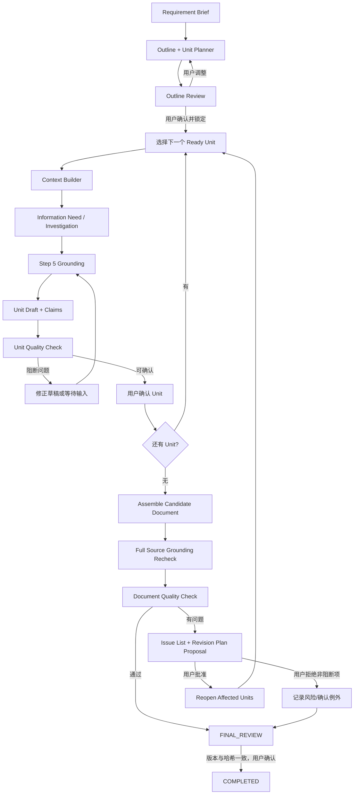

# M0 Agent Core 第六步设计方案：完整 PRD Workflow

> 文档状态：Portfolio Core 核心实现已完成并通过真实 PostgreSQL 联通门禁  
> 版本：0.2  
> 日期：2026-07-23  
> 对应总设计：阶段 5「完整 PRD Workflow」  
> 前置实现：Step 1～4 已实现；Step 5 Source Grounding 与 Eval 已完成设计、尚待实现

## 1. 文档目的

本文档定义 PRD Agent 第六步的实现边界：把现有“需求摘要 → 单节点大纲 → 单确认单元 → Markdown”的最小垂直切片，扩展为可以完成整份 PRD 的核心工作流。

第六步交付：

1. 多节点、最多三级的动态大纲。
2. 5～12 个建议确认单元，原则上不超过 15 个。
3. 严格顺序和依赖控制的逐单元准备、调查、Grounding、生成、检查与用户确认。
4. 不可变章节版本和仅使用已确认内容的上下文。
5. 单元级与全文级 Document Quality Checker。
6. 全文 Source Grounding 复核。
7. 只提出问题、不直接改写已确认章节的受控修订流程。
8. 确定性的 Markdown 汇编和 Evidence Appendix。
9. 基于文档版本、内容哈希和用户显式命令的最终确认。

完成本步骤即达到总体设计的 Portfolio Core：“核心系统可以完成一份完整 PRD”。Web 展示、RAG、外部集成和产品化基础设施仍属于 Step 7～10。

## 2. 步骤映射与完成口径

| 仓库步骤 | 总设计阶段 | 状态 |
| --- | --- | --- |
| Step 1 | 阶段 0：Eval Baseline | 已实现 |
| Step 2 | 阶段 1：最小 PRD Workflow | 已实现 |
| Step 3 | 阶段 2：Repository Tools 与 Evidence | 主链路已实现 |
| Step 4 | 阶段 3：受控 Investigation Loop | 已实现 |
| Step 5 | 阶段 4：Grounding 与 Eval | 已设计、待实现 |
| **Step 6** | **阶段 5：完整 PRD Workflow** | **本文设计范围** |
| Step 7～10 | Web、RAG、外部集成、产品化基础设施 | 后续 |

第六步完成后：

- **Portfolio Core**：达到完成状态。
- **完整 V1.1/Production Profile**：还剩 Step 7～10 四个主步骤。

## 3. 当前实现基线

### 3.1 已有能力

当前代码已有：

- `WorkflowService`：启动任务、澄清、生成大纲、确认大纲、生成/确认一个单元。
- `TaskTransitionPolicy`：覆盖 `DRAFT` 到 `COMPLETED` 的主要 Task 状态边。
- `OutlinePolicy` 与 `UnitPolicy`。
- Requirement Brief、Outline、Confirmation Unit、Section Version、Document Version 领域实体。
- 幂等键、输入哈希、乐观版本检查、Domain Event 和 Workflow Checkpoint。
- 内存与 PostgreSQL Workflow Repository。
- 只从已确认输入渲染 Markdown 的基础保护。
- Step 4 的 Unit Investigation Context Hook。
- Step 5 设计中的 Grounded Unit Draft、Claim 清单、Grounding Run 和来源关联契约。

### 3.2 当前限制

当前实现仍是 Step 2 垂直切片：

1. 大纲只有一个 `OutlineNode`。
2. 每个 Outline 固定创建一个 `ConfirmationUnit`。
3. `UnitPolicy` 明确限制只能确认 `sequence=1`。
4. 确认第一个单元后直接进入 `FINAL_REVIEW`。
5. 没有 `FinalizePrd` 命令，Task 不能通过公开服务进入 `COMPLETED`。
6. Section Version 只关联 Unit，没有 `outline_node_id`、状态、内容哈希和确认时间。
7. Document Version 只有 Markdown，没有状态、来源快照和最终确认信息。
8. 没有动态确认单元规划、依赖图和 Context Dependency。
9. 没有 Document Quality Checker、Quality Issue 或 Revision Plan。
10. 当前 Renderer 固定输出“第一确认单元”，不能汇编多个章节。

### 3.3 回归基线

Step 6 开始实现前的已知基线：

| 项目 | 结果 |
| --- | --- |
| 全量自动化测试 | `82 passed`，无跳过项 |
| PostgreSQL | 本地 PostgreSQL 16.14 真实执行通过 |
| 四组 Eval | 每组 30/30 成功，共 120 Runs |
| Step 5 | 设计与失败测试计划已完成，代码未实现 |

Step 6 的最终测试数必须高于该基线；不能用删除或跳过既有测试换取通过。

## 4. 本步骤目标

系统必须能够：

1. 根据 Requirement Brief 生成完整多级大纲。
2. 根据复杂度、依赖、长度、规则和 Information Need 规划动态确认单元。
3. 让用户在锁定大纲前确认章节和确认粒度。
4. 锁定后禁止 Agent 自行增删章节、改变顺序或确认粒度。
5. 每次只准备和生成当前可执行单元。
6. 前一单元未确认时禁止生成下一单元。
7. Context Builder 只读取当前有效、已确认的上游内容。
8. 每个单元依次通过 Investigation、Step 5 Grounding 和单元质量检查。
9. 每次用户确认都保存不可变 Section Version。
10. 所有单元确认后汇编候选全文并执行全文检查。
11. Quality Checker 只产生结构化问题和建议，不直接修改已确认章节。
12. 用户批准 Revision Plan 后只重开受影响单元及其失效下游。
13. 修订内容重新执行 Grounding、质量检查和用户确认。
14. 生成确定性 Evidence Appendix。
15. 最终确认必须绑定精确 Document Version 和内容哈希。
16. 最终确认后 Task 进入 `COMPLETED`，结果保持可追溯和可重复渲染。

## 5. 明确不在本步骤实现

- Next.js、FastAPI、SSE 或轮询界面。
- 飞书创建/覆盖和外部文档绑定。
- 历史 PRD 检索、全文检索、pgvector 和 RAG。
- GitHub/GitLab、Codex、Claude Code 或其他外部 Adapter。
- Redis、Celery、Outbox、OIDC、多 Worker 和部署告警。
- 任意代码写入或 Repository 修改。
- 自动接受质量修订。
- 在用户未确认时修改已确认章节。
- 把 Document Quality Checker 与 Source Grounding Checker 合并。

Portfolio Core 输出本地 Markdown；飞书导出留给后续外部集成阶段。

## 6. 核心不变量

1. **一次只生成一个单元**：当前单元未确认，后续单元不得进入准备状态。
2. **大纲锁定**：Outline 确认后，Agent 不得自行改变节点、单元映射、顺序或粒度。
3. **确认内容不可变**：修改通过新 Section Version 表达，不覆盖旧版本。
4. **稳定上下文**：后续单元只读取已确认且未失效的上游 Section Version。
5. **草稿不进入正式文档**：`GENERATING/PENDING_CONFIRMATION/FAILED` 内容不出现在候选全文。
6. **Grounding 先于确认**：没有 Step 5 合法终态的单元不能等待用户确认。
7. **Quality 不改正文**：Checker 只能报告问题，不能写入已确认 Section。
8. **修订需用户授权**：只有用户批准 Revision Plan 后才能重开单元。
9. **依赖变更会失效下游**：上游确认版本变化后，使用旧上下文的下游必须重新验证或重开。
10. **最终确认绑定版本**：用户确认的是精确的 Document Version + content hash。
11. **完成不可伪造**：所有单元确认、全文检查通过且用户显式确认后才能 `COMPLETED`。
12. **来源可追溯**：Evidence Appendix 由 Step 5 的 Link 数据确定性生成，不由模型自由编写。

## 7. 总体流程



## 8. 大纲与动态确认单元规划

### 8.1 结构化输出

`OutlinePlanner` 输出：

```json
{
  "title": "订单退款能力 PRD",
  "scale": "MEDIUM",
  "scale_rationale": "涉及角色、状态流转、权限和异常处理",
  "nodes": [
    {
      "node_key": "scope",
      "parent_key": null,
      "sequence": 1,
      "level": 1,
      "title": "范围与目标",
      "purpose": "定义边界",
      "complexity": "LOW",
      "required_information": []
    }
  ],
  "units": [
    {
      "unit_key": "unit-scope",
      "sequence": 1,
      "title": "范围、目标与角色",
      "node_keys": ["scope", "roles"],
      "depends_on_unit_keys": [],
      "estimated_size": "SMALL"
    }
  ],
  "omitted_sections": [],
  "open_questions": []
}
```

模型只能提议；本地 `OutlinePlanPolicy` 校验和归一化。

### 8.2 大纲约束

- 最大三级。
- 所有 `node_key` 唯一。
- 父节点必须存在且在子节点之前。
- 同层 `sequence` 连续、无重复。
- 每个节点必须属于且只属于一个确认单元。
- 不能有孤立节点。
- Unit 依赖必须形成有向无环图。
- Unit `sequence` 必须是依赖图的合法拓扑序。
- 默认 5～12 个 Unit，硬上限 15。
- 小需求允许少于 5 个，但必须给出规模依据。
- 超过 15 个必须由确定性合并策略处理，不能静默截断节点。

### 8.3 粒度策略

| 复杂度 | 默认策略 |
| --- | --- |
| `LOW` | 合并相邻且同一主题的节点 |
| `MEDIUM` | 一级章节或关联二级章节为一个 Unit |
| `HIGH` | 拆到二/三级章节，并使状态、权限、验收尽量独立确认 |

存在 `REQUIRED` Information Need、多个角色、复杂状态机或高风险权限规则时，优先拆分；只因标题数量多不能机械拆分。

### 8.4 大纲调整

用户在 `OUTLINE_REVIEW` 可以：

- 调整节点标题、层级和顺序。
- 合并/拆分确认单元。
- 调整调查 Requiredness。
- 指定某节点必须单独确认。

调整创建新的 Outline Version，旧版本标记 `SUPERSEDED`。只有确认后的版本能进入生成。

## 9. 确认单元状态机

扩展 `UnitStatus`：

```text
PENDING
  → PREPARING
  → INVESTIGATING
  → GENERATING
  → PENDING_CONFIRMATION
  → CONFIRMED

PREPARING / INVESTIGATING / GENERATING
  → FAILED
  → HUMAN_INPUT_REQUIRED

PENDING_CONFIRMATION
  → GENERATING              用户要求修改草稿
  → CONFIRMED               用户确认

CONFIRMED
  → REVISION_REQUIRED       用户批准全文修订或依赖失效
  → SUPERSEDED              新 Outline Version 取代

REVISION_REQUIRED
  → PREPARING
```

### 9.1 Ready Unit

Unit 只有满足以下条件才是 Ready：

1. Outline 已确认。
2. Unit 状态为 `PENDING` 或 `REVISION_REQUIRED`。
3. 所有 `depends_on_unit_ids` 都为 `CONFIRMED`。
4. 依赖的 Section Version 未失效。
5. 没有更小 sequence 的 Ready/Active Unit。
6. Task 为 `GENERATING`。

`UnitSchedulingPolicy` 选择唯一 Ready Unit。即使依赖图允许并行，Portfolio Core 仍按确定性顺序串行执行。

### 9.2 用户确认

`ConfirmUnit` 必须携带：

- `task_id`
- `unit_id`
- `unit_version`
- `draft_content_hash`
- `grounding_run_id`
- `quality_run_id`
- `expected_task_version`
- `idempotency_key`

任何版本或哈希不匹配都返回冲突，禁止“确认看到之前的草稿，却提交当前草稿”。

## 10. Context Builder

每个 Unit 的上下文由确定性 Builder 组装：

1. 当前 Requirement Brief Version。
2. 锁定的 Outline Version 和当前 Unit/Nodes。
3. 当前 Unit 的目标、Information Needs 和修改要求。
4. 所有直接依赖 Unit 的最新已确认 Section 摘要。
5. 必需的全局术语、角色、状态和范围约束。
6. Step 5 Grounded Facts、Target Decisions、Authorized Assumptions、Unknowns 和 Conflicts 的 ID。
7. 上次修订的 Quality Issues 和用户批准的 Revision Instruction。

不得加入：

- 未确认草稿。
- 已 Superseded/Invalidated 的 Section。
- 其他 Task 内容。
- 完整无关 Evidence 或代码。
- 模型私有推理。

### 10.1 Context Dependency

保存：

```text
consumer_unit_id
producer_unit_id
producer_section_version_id
dependency_type
content_hash
created_at
```

Unit 确认时保存其实际输入依赖。上游新版本确认后，通过旧 `producer_section_version_id` 生成的下游 Unit 标为 Stale，进入 Impact Analysis。

## 11. 单元生成流水线

```text
PREPARE_CONTEXT
  → PLAN_INFORMATION_NEEDS
  → INVESTIGATE_IF_REQUIRED
  → FACT_GROUNDING
  → GENERATE_DRAFT_AND_CLAIMS
  → CLAIM_GROUNDING
  → UNIT_QUALITY_CHECK
  → SAVE_DRAFT_VERSION
  → WAIT_USER_CONFIRMATION
```

只有以下条件全部满足才进入 `PENDING_CONFIRMATION`：

- Grounding Run 为 `PASSED` 或允许的 `DEGRADED`。
- 无 Critical Unsupported Claim。
- Unit Quality 无 `BLOCKER/ERROR`。
- 正文覆盖 Unit 的所有 Outline Nodes。
- 草稿内容哈希、Claim 清单和来源 Link 已保存。

用户要求修改时创建新的 Draft Version；旧 Draft 不删除，但不能成为确认对象。

## 12. 章节版本模型

### 12.1 `PrdSectionVersion`

建议扩展为：

```python
class SectionStatus(StrEnum):
    DRAFT = "DRAFT"
    PENDING_CONFIRMATION = "PENDING_CONFIRMATION"
    CONFIRMED = "CONFIRMED"
    INVALIDATED = "INVALIDATED"
    SUPERSEDED = "SUPERSEDED"


class PrdSectionVersion(BaseModel):
    section_version_id: str
    task_id: str
    document_id: str
    outline_id: str
    outline_node_id: str
    unit_id: str
    version: int
    status: SectionStatus
    title: str
    content: str
    content_hash: str
    source_run_id: str
    grounding_run_id: str
    quality_run_id: str
    supersedes_section_version_id: str | None
    confirmed_by: str | None
    confirmed_at: datetime | None
```

一个 Unit 可以产生多个 Section Version，每个对应一个 Outline Node。Unit 草稿内容先按节点结构化输出，再由 Renderer 汇编。

### 12.2 不可变与当前版本

- Version 行不可原地修改。
- `CONFIRMED` 后内容永久不可变。
- 当前版本通过明确指针或查询规则选取。
- 同一 Node 同时只能有一个有效 `CONFIRMED` 版本。
- 新确认版本将旧版本标记为 `SUPERSEDED`，但旧文档快照仍引用旧版本。

## 13. Document Quality Checker

### 13.1 与 Source Grounding 分离

| Checker | 回答的问题 |
| --- | --- |
| Source Grounding | 结论是否有正确来源 |
| Document Quality | 文档是否完整、一致、清楚、可执行 |

Quality Checker 不调用调查工具、不改变 Fact Verdict、不修正文档。

### 13.2 检查类型

```python
class QualityIssueType(StrEnum):
    OUTLINE_COVERAGE = "OUTLINE_COVERAGE"
    EMPTY_OR_DUPLICATE_CONTENT = "EMPTY_OR_DUPLICATE_CONTENT"
    TERMINOLOGY_INCONSISTENCY = "TERMINOLOGY_INCONSISTENCY"
    RULE_CONFLICT = "RULE_CONFLICT"
    STATE_FLOW_GAP = "STATE_FLOW_GAP"
    ROLE_PERMISSION_CONFLICT = "ROLE_PERMISSION_CONFLICT"
    EXCEPTION_GAP = "EXCEPTION_GAP"
    BOUNDARY_GAP = "BOUNDARY_GAP"
    ACCEPTANCE_NOT_EXECUTABLE = "ACCEPTANCE_NOT_EXECUTABLE"
    ASSUMPTION_NOT_LABELED = "ASSUMPTION_NOT_LABELED"
    OPEN_ITEM_UNRESOLVED = "OPEN_ITEM_UNRESOLVED"
    SOURCE_LINK_INCOMPLETE = "SOURCE_LINK_INCOMPLETE"
```

严重度：

- `BLOCKER`：无法安全完成或会导致核心规则矛盾。
- `ERROR`：必须修订后才能最终确认。
- `WARNING`：可由用户显式接受并记录例外。
- `INFO`：建议改进，不阻塞。

### 13.3 两级检查

**Unit Quality**：

- Unit Nodes 覆盖。
- 与已确认上游内容一致。
- 术语、角色、状态和边界。
- 当前单元验收标准。
- 假设、风险和待确认标记。

**Full Document Quality**：

- 所有 Outline Nodes 有且只有一个有效确认 Section。
- 无空章节和大面积重复。
- 全局术语一致。
- 规则、状态、权限、异常和验收闭环。
- 当前状态与目标状态分离。
- 所有阻断 Unknown/Conflict 已处理。
- 来源 Link 完整。

### 13.4 确定性检查优先

以下检查不调用模型：

- 节点覆盖和版本完整性。
- 空内容、标题重复和完全重复段落。
- Claim/Fact/Section Link 完整性。
- 必需章节和验收条目是否存在。
- 未解决 `BLOCKER/ERROR` 数量。
- Document Version/hash 一致性。

模型只处理语义一致性，并返回严格结构化 `QualityIssue`。Policy 决定严重度上限、路由和是否阻断。

## 14. Quality Run 与 Issue

```python
class QualityRun(BaseModel):
    quality_run_id: str
    task_id: str
    scope: Literal["UNIT", "DOCUMENT"]
    scope_id: str
    document_version_id: str | None
    status: QualityRunStatus
    checker_version: str
    policy_version: str
    input_hash: str
    issue_ids: tuple[str, ...]


class QualityIssue(BaseModel):
    issue_id: str
    quality_run_id: str
    issue_type: QualityIssueType
    severity: QualitySeverity
    affected_unit_ids: tuple[str, ...]
    affected_section_version_ids: tuple[str, ...]
    description: str
    suggested_resolution: str
    status: IssueStatus
```

`description` 只能说明问题，不包含自动改写后的正文。

## 15. 全文汇编

### 15.1 Candidate Document

所有 Unit 首次确认后：

1. 按锁定 Outline 的节点顺序读取当前有效确认 Section。
2. 确定性生成正文。
3. 生成 Document Version，状态为 `CHECKING`。
4. 对整个 Document Version 执行 Step 5 Grounding 复核。
5. 执行 Full Document Quality。
6. 无阻断问题时进入 `FINAL_REVIEW`。

Document Version 必须保存：

- `outline_version_id`
- `requirement_brief_version`
- 有序 `section_version_ids`
- `grounding_run_id`
- `quality_run_id`
- `markdown`
- `content_hash`
- `status`
- `created_at`

### 15.2 Renderer

Renderer 是纯函数：

```python
render_document(
    metadata,
    brief,
    outline,
    confirmed_sections,
    open_items,
    evidence_appendix,
) -> str
```

它必须：

- 完全按 Outline 顺序输出。
- 保持最多三级标题。
- 不输出未确认草稿。
- 不生成新的业务内容。
- 相同输入产生字节级相同 Markdown。
- 统一换行、列表、表格和尾部空行。

## 16. Evidence Appendix

Evidence Appendix 从 Step 5 的结构化 Link 确定性生成：

```text
## 参考依据

### 章节：权限与角色
- Claim: 普通成员不能执行退款
  - Fact: fact-123
  - Source: src/refund/policy.py:42-55
  - Commit: abcdef123456...
  - Verification: SUPPORTED

## 假设、风险与待确认
- Assumption ...
- Risk ...
- Unknown ...
- Source Conflict ...
```

规则：

- 不复制完整代码或大段原文。
- locator 使用 repository-relative path。
- commit 显示固定短 SHA，同时保存完整 SHA。
- 相同 Evidence 去重，但保留被哪些 Claim 使用。
- Target Decision、Assumption、Unknown 和 Conflict 分区展示。
- Invalid/Stale/Unsupported 来源不得显示为“已验证依据”。
- Appendix 内容参与 Document content hash。

## 17. 全文问题与受控修订

### 17.1 Checker 不能直接修改

全文检查只创建 `QualityIssue` 和 `RevisionPlanProposal`：

```json
{
  "revision_plan_id": "revision-...",
  "base_document_version_id": "document-...",
  "items": [
    {
      "issue_ids": ["issue-1"],
      "unit_id": "unit-permission",
      "reason": "角色权限与验收条件冲突",
      "instruction": "统一普通成员权限，并补充拒绝场景验收",
      "downstream_unit_ids": ["unit-acceptance"]
    }
  ]
}
```

### 17.2 用户操作

用户可以：

- 批准全部修订。
- 批准部分非阻断修订。
- 对 `WARNING/INFO` 记录接受理由。
- 对 `BLOCKER/ERROR` 补充信息后批准修订。
- 拒绝建议，但不能绕过未解决的 `BLOCKER/ERROR` 最终确认。

### 17.3 Revision 执行

用户批准后：

1. 验证 Proposal 基于当前 Document Version。
2. Task 从 `FINAL_REVIEW` 回到 `GENERATING`。
3. 目标 Unit 标记 `REVISION_REQUIRED`。
4. 基于旧上游版本的下游 Unit 进入 Impact Analysis。
5. 被判定输入失效的下游 Unit 同样标记 `REVISION_REQUIRED`。
6. 未受影响 Unit 保持 `CONFIRMED`。
7. 逐个重新生成、Grounding、Quality 和确认。
8. 创建新的 Section Versions 和 Document Version。
9. 重新执行全文检查。

禁止原地改旧 Section，也禁止一次性让模型重写整份 PRD。

## 18. 最终确认

新增 `FinalizePrd`：

```python
class FinalizePrd(BaseModel):
    task_id: str
    document_version_id: str
    document_content_hash: str
    expected_task_version: int
    acknowledged_warning_ids: tuple[str, ...] = ()
    idempotency_key: str
    actor_id: str
```

Policy 检查：

1. Task 为 `FINAL_REVIEW`。
2. Document 是当前 Candidate。
3. Version 和 hash 匹配。
4. 所有 Unit 为 `CONFIRMED`。
5. 所有 Outline Nodes 被有效 Section 覆盖。
6. 全文 Grounding 通过或合法降级。
7. 无开放 `BLOCKER/ERROR`。
8. 所有 `WARNING` 已确认或明确保留。
9. 当前 Outline/Brief/Section 版本与 Document 快照一致。

成功后：

- Document 状态变为 `CONFIRMED`。
- 保存 `confirmed_by/confirmed_at`。
- Task 进入 `COMPLETED`。
- 写 `PrdFinalized` Domain Event。
- 完成状态不自动触发飞书或其他外部写入。

## 19. 完成后的修改

总设计允许 `COMPLETED → GENERATING`。Portfolio Core 采用显式 `ReopenPrd`：

- 必须说明修改原因。
- 基于已确认 Document 创建 Revision Session。
- 不修改历史最终版本。
- 选择受影响 Unit 并执行相同修订流程。
- 新版本再次最终确认后成为当前最终文档。

外部文档同步不属于本步骤。

## 20. 持久化设计

新增 Migration：`infra/local/migrations/20260723_step6_complete_workflow.sql`。

### 20.1 扩展表

| 表 | 变更 |
| --- | --- |
| `outline_nodes` | parent_id、level、stable_key、omission reason |
| `confirmation_units` | status 扩展、draft hash、active section set、grounding/quality run、revision fields |
| `prd_section_versions` | outline_node、status、hash、run ids、supersedes、confirmed metadata |
| `prd_document_versions` | status、outline/brief snapshot、section ids、hash、checks、confirmed metadata |
| `agent_runs` | `run_kind` 增加 UNIT/QUALITY/REVISION/FINALIZE |

### 20.2 新表

| 表 | 用途 |
| --- | --- |
| `confirmation_unit_nodes` | Unit 与 Outline Node 映射 |
| `confirmation_unit_dependencies` | Unit DAG |
| `unit_context_dependencies` | 实际消费的上游 Section Version |
| `unit_draft_versions` | 用户确认前的不可变草稿 |
| `quality_runs` | 单元/全文 Quality 执行 |
| `quality_issues` | 结构化问题和状态 |
| `revision_plans` | 用户批准前后的修订方案 |
| `revision_plan_items` | Issue 到 Unit/Instruction 映射 |
| `document_section_snapshots` | Document 使用的有序 Section Versions |
| `document_warning_acknowledgements` | 用户接受的 Warning |

### 20.3 关键约束

- Unit sequence 在 Outline 内唯一。
- 每个 Outline Node 恰好映射一个 Unit。
- Unit dependency 禁止 self-loop；完整 DAG 由应用 Policy 验证。
- Section `(outline_node_id, version)` 唯一。
- 同一 Node 最多一个当前有效 Confirmed Section。
- Draft、Grounding、Quality 和 Confirmation 在同一 Task 权限域。
- Document `(task_id, version)` 唯一，`content_hash` 非空。
- Finalized Document 的所有 Section Snapshot 不可删除。
- User command 的业务状态变化、事件和幂等记录原子提交。

## 21. 原子性、幂等与恢复

### 21.1 原子命令边界

以下操作必须单事务：

- 确认大纲并锁定 Unit Plan。
- 保存 Unit 草稿、Grounding/Quality 关联并进入等待确认。
- 确认 Unit、创建 Section Version、推进 next sequence。
- 批准 Revision Plan 并标记受影响 Unit。
- 创建 Candidate Document 和 Section Snapshot。
- 最终确认 Document 与 Task。

### 21.2 恢复

Checkpoint 至少包含：

```text
task_id
run_id
outline_version
current_unit_id
current_unit_version
current_node
grounding_run_id
quality_run_id
document_version_id
revision_plan_id
task_version
```

恢复不能：

- 跳过用户确认。
- 重复创建 Section Version。
- 重置 Investigation/Grounding 预算。
- 把旧 Draft 当成当前 Draft。
- 重复推进 `current_unit_sequence`。
- 自动接受 Warning 或 Revision Plan。

## 22. 服务与代码边界

建议新增或扩展：

```text
src/prd_agent/workflow/
  outline_planner.py
  unit_planner.py
  scheduler.py
  context_builder.py
  unit_pipeline.py
  revision_service.py
  finalization_service.py

src/prd_agent/quality/
  models.py
  deterministic_checks.py
  checker.py
  policy.py
  service.py

src/prd_agent/rendering/
  document.py
  evidence_appendix.py

src/prd_agent/storage/
  workflow.py
  memory_workflow.py
  postgres_workflow.py
```

`WorkflowService` 作为编排入口，不直接承载所有 Checker、Renderer 和 Store 细节。

## 23. 命令

保留并扩展：

- `StartTask`
- `ReplyToTask`
- `ConfirmOutline`
- `ConfirmUnit`

新增：

- `RequestUnitRevision`
- `ApproveRevisionPlan`
- `RejectQualitySuggestion`
- `FinalizePrd`
- `ReopenPrd`
- `StopRun`
- `RetryRun`

所有命令必须包含 actor、idempotency key、expected task version；涉及正文时额外携带目标 version/hash。

## 24. Domain Events

新增：

- `OutlinePlanGenerated`
- `OutlinePlanConfirmed`
- `UnitPreparationStarted`
- `UnitInvestigationCompleted`
- `UnitGroundingCompleted`
- `UnitQualityChecked`
- `UnitDraftGenerated`
- `UnitConfirmationRequested`
- `UnitConfirmed`
- `AllUnitsConfirmed`
- `DocumentAssembled`
- `DocumentGroundingChecked`
- `DocumentQualityChecked`
- `RevisionPlanProposed`
- `RevisionPlanApproved`
- `UnitRevisionRequired`
- `DocumentFinalReviewReady`
- `DocumentWarningAcknowledged`
- `PrdFinalized`
- `PrdReopened`

事件 Payload 只包含 ID、版本、状态、数量和公开摘要，不包含完整正文或 Evidence excerpt。

## 25. Eval 与质量指标

在现有 Case 上新增 `complete-workflow-v1`：

- Outline Node Coverage。
- Unit Plan Validity。
- Unit Confirmation Order Violations。
- Confirmed Context Purity。
- Section Version Integrity。
- Full Document Required Section Coverage。
- Cross-section Consistency。
- Acceptance Criteria Executability。
- Revision Precision：实际重开 Unit / 应重开 Unit。
- Evidence Appendix Traceability。
- Finalization Safety Violations。
- End-to-end Completion Rate。
- 每份 PRD 的确认单元数、修订次数、用户确认节点数和总工具调用数。

Eval 的用户确认由固定 Scripted User 驱动，不能由 Agent 自动确认自己的输出。

## 26. 实施切片

1. **Slice A：多节点 Outline 与 Unit Plan 领域模型**  
   模型、校验、DAG、5～12 建议与 15 上限。
2. **Slice B：Unit Scheduler 与状态机**  
   Ready 规则、串行执行、当前 sequence 和失败路由。
3. **Slice C：Context Builder 与依赖快照**  
   只读确认内容、context hash 和下游失效检测。
4. **Slice D：多 Unit Pipeline**  
   逐单元接入 Investigation、Step 5 Grounding、Unit Quality。
5. **Slice E：Draft/Section Versioning**  
   不可变草稿、按 Node 保存 Section、用户确认哈希。
6. **Slice F：Document Quality**  
   确定性检查、Scripted Semantic Checker、Issue/Policy。
7. **Slice G：全文汇编与 Evidence Appendix**  
   纯 Renderer、Section Snapshot 和内容哈希。
8. **Slice H：Revision Plan**  
   用户批准、精确重开、下游影响和再次确认。
9. **Slice I：Finalization 与 Reopen**  
   Final Review、Warning acknowledgement、Completed 和历史版本。
10. **Slice J：PostgreSQL、恢复与完整 Eval**  
    Migration、合同测试、崩溃恢复和 Portfolio Core 报告。

## 27. 验收场景

1. 中等需求规划 6 个 Unit，按顺序逐个确认并完成 PRD。
2. 高复杂度状态机拆成多个关联 Unit，依赖顺序合法。
3. 当前 Unit 未确认时，生成下一 Unit 被拒绝。
4. 后续 Unit Context 只包含已确认上游 Section。
5. 用户修改草稿后旧 hash 不能被确认。
6. 所有 Unit 确认后生成包含全部节点的 Candidate Document。
7. 全文检查发现权限冲突，只输出 Issue 和 Revision Proposal。
8. 用户批准后只重开权限 Unit 和实际依赖它的验收 Unit。
9. 修订 Unit 产生新 Section Version，旧最终快照仍可重现。
10. Evidence Appendix 可从 Claim/Fact/Evidence Link 完整追溯。
11. 存在开放 Blocker 时 Finalize 被拒绝。
12. 用户确认 Warning、版本/hash 一致后 Task 进入 `COMPLETED`。
13. 重复 Finalize 使用相同幂等键返回原结果。
14. Finalize 事务中断后不存在“Task Completed、Document 未确认”的半状态。
15. Completed PRD Reopen 后创建新 Revision Session，不覆盖旧版本。

## 28. Definition of Done

- [ ] 多级 Outline 和动态 Unit Plan 已实现。
- [ ] Unit 数量、节点覆盖、依赖 DAG 和拓扑序有确定性校验。
- [ ] 每次只生成一个 Ready Unit。
- [ ] Step 5 Grounding 是 Unit 确认硬门禁。
- [ ] Context Builder 不读取未确认或失效内容。
- [ ] Draft、Section 和 Document 均为不可变版本。
- [ ] 单元和全文 Document Quality Checker 已实现并与 Grounding 分离。
- [ ] Checker 不能直接修改已确认 Section。
- [ ] Revision Plan 必须经用户批准，且只重开受影响 Unit。
- [ ] 上游变化能够检测并处理下游失效。
- [ ] Renderer 字节级确定，Evidence Appendix 可追溯且脱敏。
- [ ] Finalize 绑定 Document Version/hash，无开放 Blocker/Error。
- [ ] Task 可安全进入 `COMPLETED`，并可显式 Reopen。
- [ ] Memory/PostgreSQL 合同一致。
- [ ] 幂等、乐观锁、崩溃恢复和事务原子性测试通过。
- [ ] Step 6 单测计划中所有 P0/P1 用例通过。
- [ ] Step 1～5 回归全部通过，且无发布门禁 Skip。
- [ ] `complete-workflow-v1` Eval 和 Portfolio Core 报告可重复生成。

## 29. Step 7 衔接

Step 7 只为已完成的核心能力增加 Web 展示：

- Task 列表和当前阶段。
- 对话、Outline 和 Confirmation Unit 卡片。
- Investigation、Grounding 和 Quality Issue 摘要。
- PRD 与 Evidence Appendix 浏览。
- SSE 或轮询。

Web API 不得复制 Workflow Policy，也不得绕过 Step 6 的 version/hash、幂等和用户确认命令。

## 30. 2026-07-23 实现与验证记录

已实现：

- 最多三级 Outline、父子关系、节点唯一覆盖和最多 15 个 Unit 的结构化校验。
- Unit 依赖拓扑顺序和一次只生成当前 Unit 的串行门禁。
- 一个 Unit 覆盖一个或多个 Outline Nodes 的结构化 Section Draft。
- 已锁定 Outline 标题优先，模型不能擅自修改章节标题。
- Confirmed-only Context Builder，只读取直接依赖的当前确认版本。
- Grounding → Draft → Confirmation → Section Version 的完整流水线。
- 多 Unit 顺序确认和确定性全文汇编。
- Document Quality 确定性检查、结构化 Issue 和 Finalize 阻断。
- 用户批准 Quality Revision 后创建新 Section/Document Version。
- `FinalizePrd` 的 Task Version、Document ID、content hash 和幂等门禁。
- `ReopenPrd`：完成后显式重开选中 Unit 及依赖下游，历史文档不覆盖。
- Memory/PostgreSQL Store 的 Outline、Unit Draft、Section、Document、Grounding 和 Quality 往返。
- Step 5/6 幂等 Migration 和从空库执行的完整 Schema。
- CLI `finalize` 和 `reopen` 命令。

联通验证链路：

```text
Requirement Brief
  → 三级 Outline / Dynamic Units
  → Confirmed-only Context
  → Investigation Context
  → Fact/Claim Grounding
  → Section Drafts
  → Unit Confirmation
  → Immutable Section Versions
  → Document Quality
  → Evidence Appendix
  → Finalize
  → Completed
  → Reopen + Dependent Units
  → Document v2 + Finalize
```

| 项目 | 结果 |
| --- | --- |
| 全项目测试（真实 PostgreSQL） | `105 passed`，零跳过 |
| 两单元完整 Workflow + Finalize | 通过 |
| 多节点单 Unit | 通过 |
| Grounding/Quality/Renderer 联通 | 通过 |
| Quality Revision | 通过 |
| Completed → Reopen → Document v2 | 通过 |
| PostgreSQL 16.14 往返 | 通过 |
| 空库 `schema.sql` 初始化 | 通过 |
| Python Compile 与 Git whitespace | 通过 |

后续硬化项：

- 接入真实语义 Document Quality Checker，而非只使用确定性规则。
- 保存细粒度实际 Context Dependency Link，并以内容影响分析替代当前依赖 DAG 的保守下游重开。
- 增加 Warning acknowledgement、完整 Revision Plan 实体和单元级语义 Quality。
- 扩展 `complete-workflow-v1` 多 Trial Eval Dataset。
- 完成单测计划中全部 285 个穷举用例；当前自动化优先覆盖核心路径和 P0 安全门禁。
