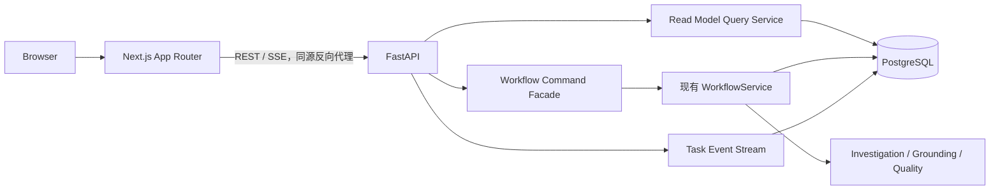

# M0 Agent Core 第七步设计方案：可演示 Web 工作台

> 文档状态：已实现  
> 版本：0.1  
> 日期：2026-07-24  
> 对应总设计：[PRD Agent V1.1 系统设计](../specs/2026-07-21-prd-agent-v1.1-design.md)  
> 上一步：[M0 Agent Core 第六步设计方案：完整 PRD Workflow](./2026-07-23-m0-agent-core-step-6-complete-prd-workflow-design.md)  
> 配套测试：[M0 Agent Core 第七步测试方案](./2026-07-24-m0-agent-core-step-7-web-test-plan.md)

## 1. 步骤定位

本项目的实现步骤比总设计阶段编号多一位：

| 当前实现步骤 | 总设计阶段 | 本步交付 |
| --- | --- | --- |
| Step 1～6 | 总设计阶段 1～5 | Eval、核心 Workflow、调查、Grounding、完整 PRD |
| **Step 7** | **总设计阶段 6：Web 展示** | **Next.js + FastAPI 可演示工作台** |
| Step 8 | 总设计阶段 7 | 历史 PRD 与 RAG |
| Step 9 | 总设计阶段 8 | GitHub/GitLab、飞书等外部集成 |
| Step 10 | 总设计阶段 9 | 队列、OIDC、恢复、部署与告警 |

进入本步时，Step 1～6 已完成真实 PostgreSQL 联通验证，完整项目基线为 `105 passed`、零 Skip。核心系统已经能完成多级 Outline、多 Confirmation Unit、Grounding、Quality Revision、Finalize 和 Reopen。

Step 7 不再改变 PRD 生成语义，只增加 API、查询模型、用户可见事件和 Web 展示。交付目标是：

> 用户在 30 秒内能够看到任务列表，创建一项 PRD 任务，推进确认节点，观察调查/质量状态，并浏览最终 Markdown PRD 与 Evidence Appendix。

## 2. 目标

### 2.1 产品目标

1. 提供任务列表、新建任务和任务切换。
2. 展示当前任务状态、运行状态和待用户操作。
3. 展示对话消息、Requirement Brief、大纲和 Confirmation Unit。
4. 展示 Investigation、Grounding 和 Quality Issue 的公开摘要。
5. 支持当前核心服务已经实现的用户命令。
6. 展示当前 PRD Markdown 和 Evidence Appendix。
7. 使用简单 SSE 推送状态变化；断线或不支持 SSE 时使用轮询恢复。
8. 对空状态、加载、失败、版本冲突和重连提供明确反馈。

### 2.2 技术目标

1. FastAPI 只做传输、认证、授权、Schema、错误映射和应用服务调用。
2. Next.js 只反映服务端状态，不复制 Workflow Policy。
3. 所有写命令继续使用幂等键和乐观锁。
4. 页面刷新或 SSE 断线后可从 PostgreSQL 快照和事件游标恢复。
5. 浏览器不接收模型私有推理、凭证、完整源码或未脱敏 Evidence。
6. OpenAPI 成为前后端接口契约的唯一来源。
7. API、组件和浏览器 E2E 均可使用确定性 Stub Model 测试。

## 3. 非目标

以下内容明确不属于 Step 7：

- 历史 PRD 全文检索、pgvector 和 RAG，留给 Step 8。
- GitHub/GitLab 远程仓库、飞书导出和 Coding Agent Adapter，留给 Step 9。
- Redis、Celery、Outbox、多 Worker、OIDC、审计平台、生产告警和高可用部署，留给 Step 10。
- WebSocket、模型 Token 流式输出和模型私有思维链展示。
- 前端自行决定状态迁移、调查预算、Grounding 或 Quality 是否通过。
- 在浏览器中修改原始 Evidence、Fact、Section Version 或最终文档哈希。
- 附件、图片、语音、页面浏览、截图分析和原型图生成。
- 未在 `WorkflowService` 落地的删除、草稿、停止和失败 Run 重试功能。
- 评测管理后台；Step 7 只保留现有 CLI/报告能力。

删除、草稿、停止和重试可以在界面中显示为后续能力，但不得出现可点击的伪入口。

## 4. 现状与必须补齐的差距

### 4.1 已有能力

- `WorkflowService` 已实现：
  - `StartTask`
  - `ReplyToTask`
  - `ConfirmOutline`
  - `ConfirmUnit`
  - `ApproveRevisionPlan`
  - `FinalizePrd`
  - `ReopenPrd`
  - `show`
- Memory/PostgreSQL Repository 已保存 Task、Run、Message、Brief、Outline、Unit、Section、Document、Grounding、Quality、Event 和 Checkpoint。
- `domain_events` 已按 `task_id + sequence` 唯一。
- 命令已包含 `actor_id`、`idempotency_key` 和必要的 `expected_task_version`。
- Markdown Renderer 和 Evidence Appendix 已完成。

### 4.2 Step 7 前置差距

| 差距 | 风险 | Step 7 处理 |
| --- | --- | --- |
| `prd_tasks` 没有 `owner_id` | API 暴露后无法证明任务隔离 | 增加 owner 字段、索引和服务端校验 |
| Repository 没有任务列表查询 | 无法构建侧边栏 | 增加游标分页的 `list_tasks` |
| Repository 没有事件查询 | SSE 无法重放 | 增加 `list_events(after_sequence, limit)` |
| `WorkflowSnapshot` 是领域对象集合 | 前端易依赖内部结构 | 建立独立公开 Read Model |
| 事件名称和总设计示例不完全一致 | 前端契约漂移 | 建立 Step 7 公开事件白名单与映射 |
| 没有 FastAPI/Next.js 依赖与目录 | 无 Web 入口 | 增加 `api` extra 和独立 `web/` |
| 授权只体现在命令 actor | 直接按 task_id 查询可能越权 | 公共服务入口强制 principal/owner |

## 5. 核心设计原则

1. **核心服务是唯一写入口**：API 不直接修改 Task、Unit、Document 或 Quality 数据。
2. **Command/Query 分离**：命令进入已有 Workflow Service；页面读取专用 Read Model。
3. **服务端决定可用操作**：前端只渲染 `available_actions`。
4. **事件用于提示刷新，不用于重建真相**：收到事件后重新拉取快照；数据库快照始终是事实来源。
5. **先公开摘要，再按需查看定位**：默认不传完整工具输出、源码或敏感 Evidence。
6. **固定本地身份仍必须隔离**：Portfolio Profile 使用 `local-user`，代码路径保持 owner 校验，为 Step 10 OIDC 留出替换点。
7. **同步执行但接口可演进**：Portfolio Profile 可在 API 进程内运行 Workflow；接口不暴露这一实现细节。

## 6. 总体架构



### 6.1 进程边界

Portfolio Profile 默认启动三个进程：

```text
PostgreSQL
FastAPI API
Next.js Web
```

Workflow 在 FastAPI 进程内同步执行。命令提交期间，页面展示本地 `submitting` 状态；命令返回后以响应快照为准。SSE 用于其他标签页、任务切换和后续异步化兼容，不把同步命令伪装成后台队列。

### 6.2 推荐目录

```text
src/prd_agent/
  api/
    app.py
    dependencies.py
    errors.py
    middleware.py
    schemas/
      commands.py
      read_models.py
      events.py
    routes/
      health.py
      tasks.py
      events.py
    services/
      command_facade.py
      task_query.py
      action_resolver.py
      event_stream.py
      public_mapper.py
  storage/
    memory.py
    postgres.py

web/
  app/
    layout.tsx
    page.tsx
    tasks/new/page.tsx
    tasks/[taskId]/page.tsx
  components/
    task-sidebar/
    conversation/
    outline/
    units/
    investigation/
    quality/
    document/
  lib/
    api/
    events/
    query/
  tests/

tests/
  api/
  web-e2e/
```

## 7. 身份与任务隔离

### 7.1 Portfolio Principal

FastAPI 通过依赖注入生成：

```python
UserPrincipal(
    user_id="local-user",
    roles=("product_manager",),
)
```

生产环境不能信任浏览器传入的 `actor_id`。所有命令的 `actor_id` 由服务端 principal 填充，API 请求体不得包含或覆盖它。

### 7.2 数据模型迁移

为 `prd_tasks` 增加：

```sql
owner_id TEXT NOT NULL
```

迁移规则：

1. 现有 Portfolio 数据回填为 `local-user`。
2. 新任务使用当前 principal 的 `user_id`。
3. 增加索引：

```sql
CREATE INDEX ix_prd_tasks_owner_updated
ON prd_tasks(owner_id, updated_at DESC, task_id DESC);
```

4. 所有任务、事件、消息、Evidence 和文档查询必须先通过拥有者任务作用域。
5. 不属于当前用户的资源统一返回 `404`，不泄露资源是否存在。

### 7.3 服务边界

以下入口必须接收 principal 或 owner：

- `show(task_id, actor_id)`
- `list_tasks(actor_id, cursor, limit)`
- 所有公开 Workflow 命令
- `list_events(task_id, actor_id, after_sequence, limit)`
- Investigation、Evidence 和 Quality 查询

仅在 API Router 中先查 owner、随后调用无 owner 的旧服务不够稳健；owner 校验应位于应用服务/仓储公共入口，使 CLI、API 和未来 Worker 行为一致。

## 8. 公共 Read Model

### 8.1 TaskSummary

```json
{
  "task_id": "task-...",
  "title": "优惠金额支持小数",
  "task_status": "OUTLINE_REVIEW",
  "run_status": "WAITING_USER",
  "display_status": "AWAITING_CONFIRMATION",
  "version": 3,
  "updated_at": "2026-07-24T10:00:00Z",
  "current_unit": null,
  "attention_required": true
}
```

`display_status` 是稳定的服务端展示枚举：

| 展示状态 | 来源 |
| --- | --- |
| `NEEDS_INPUT` | `CLARIFYING` 且 Run 等待用户 |
| `IN_PROGRESS` | Run 为 `QUEUED/RUNNING` |
| `AWAITING_CONFIRMATION` | Outline、Unit 或最终文档等待确认 |
| `COMPLETED` | Task 为 `COMPLETED` |
| `FAILED` | Task 或 Run 为 `FAILED` |
| `STOPPED` | Task 或 Run 为 `STOPPED` |

### 8.2 TaskDetail

```json
{
  "task": {},
  "run": {},
  "brief": {},
  "messages": [],
  "outline": {},
  "units": [],
  "investigations": [],
  "grounding": [],
  "quality": [],
  "document": {},
  "available_actions": [],
  "latest_event_sequence": 18
}
```

规则：

- 只返回当前有效 Outline 和 Unit，同时保留必要的版本号。
- Section 历史不默认返回；Document 只返回当前版本。
- Grounding 返回状态、公开 Issue 摘要和数量。
- Quality 返回严重级别、可操作描述和可批准的 `issue_id/unit_id`。
- Investigation 返回目标、Coverage、公开事实、Unknown 和停止原因。
- Tool Call 只返回目的、状态、公开摘要和用量，不返回完整参数、Token 或私有错误堆栈。
- Evidence 默认返回定位和短摘要；正文或代码片段必须经过现有内容策略和长度限制。

### 8.3 AvailableAction

```json
{
  "type": "CONFIRM_UNIT",
  "label": "确认本单元",
  "target_id": "unit-...",
  "expected_task_version": 8,
  "destructive": false
}
```

P0 动作：

- `SEND_MESSAGE`
- `CONFIRM_OUTLINE`
- `CONFIRM_UNIT`
- `APPROVE_REVISION_PLAN`
- `FINALIZE_PRD`
- `REOPEN_PRD`

Action Resolver 调用领域 Policy 或基于同一受测状态规则生成动作。不得在 React 组件中重新实现合法状态判断。

## 9. REST API

### 9.1 查询接口

| 方法与路径 | 用途 | P0 |
| --- | --- | --- |
| `GET /api/v1/tasks?cursor=&limit=` | 当前用户任务列表 | 是 |
| `GET /api/v1/tasks/{task_id}` | 当前公开快照 | 是 |
| `GET /api/v1/tasks/{task_id}/events?after_sequence=` | SSE 事件流和游标补拉 | 是 |
| `GET /api/v1/health/live` | 进程存活 | 是 |
| `GET /api/v1/health/ready` | 数据库和迁移可用 | 是 |

任务列表使用 `(updated_at, task_id)` 不透明游标，默认 20、最大 100，按最近更新时间倒序。禁止 offset 分页导致任务更新时重复或跳项。

### 9.2 命令接口

| 方法与路径 | 对应核心命令 |
| --- | --- |
| `POST /api/v1/tasks/from-message` | `StartTask` |
| `POST /api/v1/tasks/{task_id}/messages` | `ReplyToTask` |
| `POST /api/v1/tasks/{task_id}/outline/confirm` | `ConfirmOutline` |
| `POST /api/v1/tasks/{task_id}/units/{unit_id}/confirm` | `ConfirmUnit` |
| `POST /api/v1/tasks/{task_id}/revisions/approve` | `ApproveRevisionPlan` |
| `POST /api/v1/tasks/{task_id}/finalize` | `FinalizePrd` |
| `POST /api/v1/tasks/{task_id}/reopen` | `ReopenPrd` |

所有命令：

- 使用 `Idempotency-Key` Header。
- 除创建任务外，Body 携带 `expected_task_version`。
- Finalize 额外携带 `document_id` 和 `content_hash`。
- API 生成/透传 `X-Request-ID`。
- 成功统一返回新的 `TaskDetail`，减少一次额外读取。
- 同一幂等键、同一输入返回首次成功结果。
- 同一幂等键、不同输入返回 `409 IDEMPOTENCY_CONFLICT`。

### 9.3 错误契约

```json
{
  "type": "about:blank",
  "title": "Task version conflict",
  "status": 409,
  "error_code": "TASK_VERSION_CONFLICT",
  "message": "任务已更新，请刷新后重试。",
  "retryable": true,
  "correlation_id": "req-..."
}
```

| 领域异常 | HTTP | `error_code` |
| --- | --- | --- |
| 输入 Schema 错误 | 422 | `VALIDATION_ERROR` |
| `NotFound` 或 owner 不匹配 | 404 | `RESOURCE_NOT_FOUND` |
| `InvalidTransition` | 409 | `INVALID_TRANSITION` |
| `VersionConflict` | 409 | `TASK_VERSION_CONFLICT` |
| `IdempotencyConflict` | 409 | `IDEMPOTENCY_CONFLICT` |
| `ActiveRunConflict` | 409 | `ACTIVE_RUN_CONFLICT` |
| 模型/工具临时失败 | 503 | 稳定公开错误码 |
| 未分类异常 | 500 | `INTERNAL_ERROR` |

响应不返回 Python 类型、堆栈、SQL、绝对路径、密钥或原始模型错误。

## 10. SSE 与轮询

### 10.1 SSE 协议

```text
id: 18
event: unit.ready_for_confirmation
retry: 3000
data: {"event_id":"event-...","task_id":"task-...","task_version":8,"occurred_at":"...","payload":{"unit_id":"unit-..."}}
```

连接规则：

1. 客户端通过 `Last-Event-ID` 或 `after_sequence` 指定游标。
2. 服务端先重放游标后的持久化事件，再等待新事件。
3. 每 15 秒发送一次注释 Heartbeat。
4. Portfolio Profile 每 1 秒查询一次 `domain_events`，不引入 Redis/PubSub。
5. 单批最多 100 个事件，按 sequence 严格递增。
6. 客户端按 sequence 去重。
7. 收到用户可见事件后，失效并重新获取 TaskDetail；不直接用事件 payload 拼接领域状态。
8. 断线后指数退避重连，最长 15 秒。
9. 连续 3 次失败后切换为 3 秒轮询 TaskDetail。
10. 页面恢复可见或网络恢复时重新尝试 SSE。

### 10.2 公开事件映射

当前内部 CamelCase 事件在 API 边界映射为稳定小写名称：

| 内部事件 | 公共事件 |
| --- | --- |
| `TaskStarted` | `task.started` |
| `ClarificationRequested` | `task.input_required` |
| `OutlineGenerated` | `outline.ready_for_confirmation` |
| `OutlineConfirmed` | `outline.confirmed` |
| `UnitGenerated` | `unit.ready_for_confirmation` |
| `UnitGroundingBlocked` | `grounding.blocked` |
| `UnitConfirmed` | `unit.confirmed` |
| `DocumentQualityChecked` | `quality.checked` |
| `RevisionPlanApproved` | `revision.approved` |
| `PrdRendered` | `document.updated` |
| `PrdFinalized` | `document.finalized` |
| `PrdReopened` | `document.reopened` |
| `RunFailed` | `run.failed` |

未知内部事件不得原样透传；记录日志并让客户端通过快照恢复。

## 11. Web 信息架构

### 11.1 路由

| 路由 | 页面 |
| --- | --- |
| `/` | 最近任务；无任务时展示空状态 |
| `/tasks/new` | 未持久化的新任务输入页 |
| `/tasks/[taskId]` | 任务工作台 |

用户发送首条非空消息后才创建正式任务，并跳转到任务页。

### 11.2 桌面布局

```text
┌──────────────┬─────────────────────────────┬────────────────────┐
│ TaskSidebar  │ Conversation / Workflow     │ PRD / Evidence     │
│ 新建、列表   │ 消息、Outline、Unit、Issue  │ Markdown、追溯信息 │
└──────────────┴─────────────────────────────┴────────────────────┘
```

- 左栏：280px，可收起。
- 中栏：主要操作区。
- 右栏：当前 PRD，未生成时展示 Requirement Brief。
- 小屏幕下改为“对话 / PRD / 调查”三个页签，禁止水平溢出。

### 11.3 核心组件

| 组件 | 职责 |
| --- | --- |
| `TaskSidebar` | 新建、列表、状态、更新时间、切换 |
| `TaskHeader` | 标题、展示状态、版本、连接状态 |
| `ConversationTimeline` | 用户消息、公开系统消息和工作流卡片 |
| `RequirementBriefCard` | 背景、目标、范围、问题 |
| `OutlineCard` | 多级大纲、Unit 分组和确认 |
| `ConfirmationUnitCard` | 当前内容、Grounding/Quality 摘要和确认 |
| `InvestigationCard` | 目标、Coverage、Fact、Unknown、停止原因 |
| `QualityIssueList` | 严重级别、影响 Unit、修订批准 |
| `PrdDocumentView` | 安全 Markdown 和文档元信息 |
| `EvidenceAppendixView` | Appendix 导航、来源定位 |
| `ConnectionStatus` | Live、重连中、轮询模式 |

### 11.4 交互约束

- 提交命令后仅禁用相同动作，不伪造服务端成功。
- 409 版本冲突时保留用户输入，刷新快照并提示重新确认。
- 幂等重放不新增重复 Toast、消息或卡片。
- Outline、Unit、Revision 和 Finalize 必须二次确认其精确对象版本。
- `FINALIZE_PRD` 按钮只使用服务端返回的 Document ID/hash。
- `REOPEN_PRD` 必须选择 Unit 并填写非空原因。
- 切换任务不取消正在执行的请求；返回结果只更新对应 task cache。

## 12. Markdown 与内容安全

1. 使用支持 CommonMark/GFM 的 React Renderer。
2. 禁止原始 HTML，或使用严格白名单 Sanitizer。
3. 禁止 `javascript:`、`data:` 和未知协议链接。
4. 外部链接增加 `rel="noopener noreferrer"`。
5. 代码、表格和长 URL 必须在容器内换行或滚动。
6. 不执行 Markdown 内的脚本、iframe、样式、表单或事件属性。
7. Evidence 中的仓库路径只显示允许的相对路径。
8. API 在序列化前执行公开内容策略；不能只依赖浏览器转义。

## 13. OpenAPI 与前端类型

- FastAPI 生成 `/openapi.json`。
- CI 将 OpenAPI 固定为版本化 Artifact。
- 前端从 OpenAPI 生成 TypeScript 类型和 Client。
- CI 比较生成结果，发现 Schema 漂移即失败。
- 前端不得手写一套重复的 Task/Unit/Quality 类型。
- 公共枚举新增值时前端必须有 `UNKNOWN` 展示兜底，但不得默默启用动作。

## 14. 数据访问与性能

### 14.1 Repository 新接口

```python
list_tasks(owner_id, *, cursor, limit) -> Page[TaskSummaryRow]
snapshot_for_owner(task_id, owner_id) -> WorkflowSnapshot
list_events(task_id, owner_id, *, after_sequence, limit) -> tuple[DomainEvent, ...]
latest_event_sequence(task_id, owner_id) -> int
```

Memory 与 PostgreSQL 必须通过同一合同测试。

### 14.2 性能预算

Portfolio 本地环境目标：

| 操作 | 目标 |
| --- | --- |
| 20 项任务列表 | p95 < 200ms |
| TaskDetail（不含模型执行） | p95 < 300ms |
| 命令 API 额外传输开销 | p95 < 100ms |
| 已持久化事件到页面感知 | p95 < 2s |
| 首屏 Production Build | 本机冷启动 < 3s |

这些是本地回归预算，不等同于 Step 10 生产 SLO。

## 15. 可观测性与健康检查

每个 API 请求记录：

- `correlation_id`
- 方法、路由模板、状态码和耗时
- 当前 `user_id` 的不可逆标识
- `task_id`、命令类型和结果
- 不记录消息正文、PRD 正文、Evidence 内容或 Idempotency-Key

健康检查：

- `/health/live`：进程事件循环可响应。
- `/health/ready`：数据库可连接、目标迁移版本存在。
- Next.js 容器只在 FastAPI Ready 后对外标记可用。

## 16. 实现切片

### Slice A：公开查询基础

- 增加 `owner_id` 迁移与领域字段。
- 增加 owner-scoped `list_tasks/snapshot/list_events`。
- 建立 Memory/PostgreSQL 合同测试。

### Slice B：FastAPI 骨架

- 增加依赖、App Factory、Principal、Request ID 和健康检查。
- 建立公共 Schema、错误契约和 OpenAPI 快照。

### Slice C：Read Model

- 实现 TaskSummary、TaskDetail、公开映射和 Action Resolver。
- 对 Investigation、Evidence、Grounding、Quality 做摘要和脱敏。

### Slice D：命令 API

- 逐个接入 7 个已实现命令。
- 保持 version/hash、幂等和 owner 门禁。

### Slice E：事件恢复

- 实现事件查询、公共事件映射、SSE、Heartbeat 和轮询回退。

### Slice F：Web Shell

- 初始化 Next.js、类型生成、TaskSidebar、空状态、新任务页和响应式布局。

### Slice G：工作流卡片

- Conversation、Brief、Outline、Unit、Investigation、Grounding 和 Quality。
- 所有动作由 `available_actions` 驱动。

### Slice H：PRD 浏览

- 安全 Markdown、Evidence Appendix、文档版本/hash 信息。

### Slice I：可访问性与失败恢复

- 键盘操作、焦点、ARIA、错误边界、版本冲突和 SSE 降级。

### Slice J：联通门禁

- FastAPI、真实 PostgreSQL、Next.js Production Build 和 Playwright 完整链路。

每个 Slice 独立通过测试后再进入下一 Slice，不允许最后集中补 owner 校验或错误处理。

## 17. 关键验收场景

### 场景 A：从模糊需求到大纲

1. 用户进入 `/tasks/new`。
2. 输入需求并发送。
3. 系统创建任务并在侧边栏置顶。
4. 若需澄清，页面展示问题和输入动作。
5. 大纲生成后展示层级、Unit 分组和确认入口。

### 场景 B：多 Unit 完整 PRD

1. 用户确认大纲。
2. 页面只显示当前 Ready Unit 的确认动作。
3. Unit 卡片展示 Grounding 和 Quality 状态。
4. 逐个确认后进入全文检查。
5. 页面展示最终 Markdown 和 Evidence Appendix。
6. 用户使用精确 Document ID/hash 完成 Finalize。

### 场景 C：Quality Revision

1. 全文检查产生 Blocker/Error。
2. Finalize 不可用。
3. 页面展示 Issue、影响 Unit 和修订建议。
4. 用户批准后只重开服务端给出的受影响 Unit。
5. 修订完成后生成新 Document Version。

### 场景 D：断线恢复

1. 用户在 Unit 生成期间断开 SSE。
2. 服务端继续保存任务和事件。
3. 客户端重连并从最后 sequence 重放。
4. 页面重新拉取快照，不重复创建命令或消息。

### 场景 E：完成后重开

1. 已完成任务展示只读文档和 Reopen 动作。
2. 用户选择 Unit 并填写原因。
3. 服务端创建新版本链，历史确认文档保持可重现。
4. 页面进入对应修订状态。

## 18. Definition of Done

- [ ] `owner_id` 已迁移，所有用户资源按 owner 隔离。
- [ ] Memory/PostgreSQL 支持任务列表、owner 快照和事件游标合同。
- [ ] FastAPI App、健康检查、错误契约和 OpenAPI 已实现。
- [ ] 7 个现有核心命令通过 API 可用。
- [ ] 所有命令保持幂等键、任务版本和文档 hash 门禁。
- [ ] TaskSummary、TaskDetail 和 AvailableAction 由服务端生成。
- [ ] Investigation、Grounding、Quality 和 Evidence 使用公开脱敏模型。
- [ ] SSE 支持游标重放、Heartbeat、重连和轮询回退。
- [ ] Next.js 支持任务列表、新建、切换、对话和工作流卡片。
- [ ] PRD Markdown 与 Evidence Appendix 安全展示。
- [ ] 版本冲突、网络失败、模型失败和空状态可恢复。
- [ ] 键盘、焦点、语义标签和响应式布局通过门禁。
- [ ] 前端类型由 OpenAPI 生成且 CI 无漂移。
- [ ] 真实 PostgreSQL + FastAPI + Next.js 浏览器 E2E 通过。
- [ ] Step 1～6 的 `105 passed` 基线无回归、无发布门禁 Skip。
- [ ] 能在 30 秒内完成固定 Demo 脚本的界面讲解。

## 19. 完整需求剩余步骤

完成 Step 7 后，距离总设计中的完整 Production Profile 仍有 **3 个主步骤**：

1. **Step 8：历史 PRD 与 RAG**  
   全文检索、可选 pgvector、Keyword/Hybrid Ablation。
2. **Step 9：外部集成**  
   GitHub/GitLab、飞书导出、外部 Coding Agent 对比。
3. **Step 10：产品化基础设施**  
   Redis、Celery、Outbox、OIDC、多 Worker、恢复、部署和告警。

Portfolio Core 已在 Step 6 完成；Step 7 完成后将得到可直接演示的 Portfolio 产品形态，但不应宣称已达到多用户生产部署标准。

## 20. Step 8 衔接

Step 8 只扩展历史 PRD 数据源和检索评测：

- 新增 Historical PRD Retriever。
- 增加 keyword-only 和 hybrid 查询。
- 让 Investigation Card 展示历史来源类型和版本。
- 保持本步的公开 Read Model、Evidence 脱敏、owner 隔离和事件契约。

Step 8 不得为了 RAG 改写 Step 7 的 Workflow 命令语义，也不得让前端直接访问向量库。

## 21. 2026-07-26 实现记录

已实现：

- `Task.owner_id`、旧数据回填迁移和 owner/update 复合索引。
- Memory/PostgreSQL 的 owner 快照、任务游标分页和事件 sequence 查询。
- Workflow 公共命令和 `show` 的 owner 门禁。
- FastAPI App Factory、健康检查、Request ID、CORS 和统一公开错误。
- Start、Reply、Confirm Outline、Confirm Unit、Approve Revision、Finalize、Reopen 七个命令 API。
- TaskSummary、TaskDetail、AvailableAction、Grounding 和 Quality 公开 Read Model。
- 当前 Document/Unit 的 Quality/Grounding 结果过滤，历史失败不污染当前展示。
- 持久化事件重放、Last-Event-ID、Heartbeat 和 SSE 公共事件映射。
- Next.js 16 三栏工作台、移动端单栏、任务列表和新任务页。
- Outline、Unit、Quality Revision、Finalize 和 Reopen 操作。
- 安全 GFM Markdown、OpenAPI TypeScript 类型生成和轮询降级。
- 离线 Heuristic Model 的可执行验收模板。

联通验证：

```text
Next.js Production UI
→ FastAPI
→ PostgreSQL
→ StartTask
→ ConfirmOutline
→ ConfirmUnit
→ Quality Revision
→ Confirm revised Unit
→ FinalizePrd
→ COMPLETED
```

桌面和 390px 移动视口均完成浏览器检查；移动视口不存在水平页面溢出。
