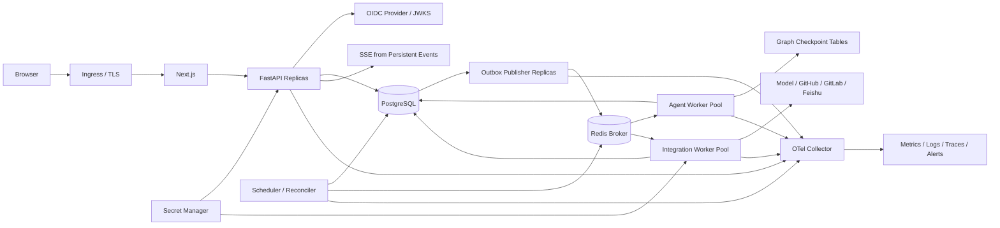

# PRD Agent 最后一步设计方案：Step 10 Production Profile

> 文档状态：设计完成，待 Step 1～9 发布门禁通过后实施
> 设计日期：2026-07-27
> 对应 PRD：`docs/product/2026-07-21-prd-agent-v1.1-prd.md`
> 对应总设计：`docs/superpowers/specs/2026-07-21-prd-agent-v1.1-design.md`“阶段 9：产品化基础设施”
> 前置设计：`2026-07-27-m0-agent-core-step-9-external-integrations-design.md`
> 配套测试：`2026-07-27-m0-agent-core-step-10-production-profile-test-plan.md`

## 0. 设计结论

Step 10 是 V1.1 路线的最后一步。它不新增 PRD 生成能力，而是把已经完成的 Portfolio Core / M1 功能产品迁移为可多用户、可异步、可恢复、可部署和可运维的 Production Profile。

本步骤完成五项核心变化：

1. **固定本地身份升级为 OIDC 身份和租户边界**：API 从验证后的 Token 构造 `UserPrincipal`，所有业务查询继续执行 owner/tenant 约束。
2. **同步执行升级为持久化异步调度**：业务事务与 Outbox 同时提交，Publisher 投递只包含 `run_id` 的 Celery 命令。
3. **单进程升级为多 Worker**：PostgreSQL 租约、fencing token、幂等记录和唯一约束共同防止重复副作用。
4. **进程内恢复升级为跨进程恢复**：PostgreSQL 业务状态是唯一事实源；Graph Checkpoint 只保存执行游标；Celery 和 Redis 不决定业务状态。
5. **本地运行升级为可发布系统**：引入连接池、迁移门禁、OpenTelemetry、SLO、告警、备份恢复、容量验证和渐进发布。

最重要的不变量：

> PostgreSQL 决定“业务现在是什么状态”；Graph Checkpoint 决定“图从哪里继续”；Outbox 决定“哪些已提交工作需要投递”；Celery 只负责唤醒；Redis 丢失不能改变业务事实。

Step 10 不把 at-least-once 消息系统包装成虚假的 exactly-once。系统通过业务幂等、租约 fencing、状态前置条件、唯一约束和外部副作用协调实现“重复执行安全”。

## 1. 步骤定位

| 仓库实施步骤 | 总设计阶段 | 交付 |
| --- | --- | --- |
| Step 7 | 阶段 6 | Web 工作台和 FastAPI |
| Step 8 | 阶段 7 | 历史 PRD 与 RAG |
| Step 9 | 阶段 8 | GitHub/GitLab、飞书和外部调查 Adapter |
| **Step 10** | **阶段 9** | **OIDC、Redis、Celery、Outbox、多 Worker、恢复、部署、备份和告警** |

完成 Step 10 后，V1.1 从“可演示的功能产品”达到总设计定义的 Production Profile。后续新增页面浏览、截图、原型、多 Agent、市场分析等能力属于新版本，不属于 Step 11。

## 2. 设计依据

### 2.1 PRD 约束

Step 10 必须保证：

- 一个任务仍等于一份 PRD 和一条持续主对话。
- 用户切换、刷新或断线后恢复消息、PRD、待确认内容和执行状态。
- 页面离开不停止后台任务。
- 同一任务最多一个活动 Run。
- 停止和失败保留已确认内容与已经完成的调查结果。
- 用户只能读取自己的任务、草稿、来源、连接和导出记录。
- Agent、Tool、Grounding、人机确认和飞书绑定规则不被基础设施绕过。
- 任务删除不删除已经导出的飞书文档。

### 2.2 总设计约束

- Production Profile 使用 Next.js、FastAPI、PostgreSQL、Redis、Celery、Outbox 和独立 Worker。
- API 不执行长模型或 Provider 调用。
- 业务写入与 Domain Event / Outbox 在同一数据库事务提交。
- Celery 消息只携带 `run_id`，不携带完整上下文、正文或凭证。
- Redis 只作为 Broker、取消加速和短期事件设施。
- Worker 必须从数据库和兼容的 Graph Checkpoint 恢复。
- API、Worker 和 Schema 必须支持向后兼容的滚动发布。

### 2.3 工程依据

- Celery 任务可能重复执行；`acks_late` 只适用于幂等任务，不能替代业务幂等。[Celery Tasks](https://docs.celeryq.dev/en/stable/userguide/tasks.html)
- PostgreSQL `FOR UPDATE SKIP LOCKED` 适合多个 Publisher 并发领取 Outbox 行，但只能用于队列式访问，不能作为通用一致读取语义。[PostgreSQL SELECT](https://www.postgresql.org/docs/current/sql-select.html)
- OAuth 2.0 Security BCP 推荐授权码流程使用 PKCE，且事务级 PKCE/nonce 必须绑定用户代理。[RFC 9700](https://datatracker.ietf.org/doc/html/rfc9700)
- Redis Pub/Sub 不持久化、不支持离线重放；本设计的业务事件重放因此继续使用 PostgreSQL Event Log。[Redis Streaming](https://redis.io/docs/latest/develop/use-cases/streaming/)
- OpenTelemetry 自动埋点适合覆盖 HTTP、数据库、Redis 等边界；领域状态迁移、Run 和 Investigation 仍需要手工业务 Span。[OpenTelemetry Python](https://opentelemetry.io/docs/zero-code/python/)

## 3. 实施前置 Gate

Step 10 实现前必须满足：

1. Step 1～9 的核心自动化与发布级 P0 用例通过。
2. Step 9 的远程仓库、飞书导出和外部 Agent 安全合同已经固定。
3. 当前工作树形成可审计 Commit；部署不得基于无法复现的未跟踪快照。
4. PostgreSQL Schema 具有迁移版本表，Readiness 能验证目标版本。
5. OpenAPI 生成类型是 Web 唯一 API 类型来源。
6. SSE 已采用公开事件白名单和事件 Sequence 恢复。
7. 默认 API 主路径已装配 Investigation、Evidence、Grounding 与 Quality。
8. 固定 Eval、失败分析和核心浏览器 E2E 能在 CI 中运行。
9. 外部连接使用服务端 `credential_ref`，没有 Token 明文进入业务表。

前置未通过时，可以独立实现 OIDC Validator、Outbox、租约、部署清单和测试设施，但不能宣告 Production Profile 可发布。

## 4. 目标与非目标

### 4.1 产品目标

1. 多个用户同时使用系统时，任务和外部连接严格隔离。
2. 用户关闭页面或 API 实例滚动重启后，Run 继续或可恢复。
3. Worker、Redis、Provider 或网络故障不会丢失已确认内容，也不会重复创建外部文档。
4. 用户停止任务后，系统在安全边界内尽快停止后续模型与工具步骤。
5. 运维人员能够发现积压、失败、恢复异常、外部限流、数据库风险和安全事件。

### 4.2 技术目标

1. API 请求不持有跨模型或 Provider 网络调用的数据库事务。
2. 多 Publisher、多 API、多 Worker 可以水平扩容。
3. 所有队列任务可重复投递且重复安全。
4. 业务状态、Graph 状态、消息状态和外部副作用的职责明确。
5. 迁移、滚动升级、备份恢复和灾难恢复具有可执行 Runbook。
6. 关键 SLO、容量和安全门禁能自动验证。

### 4.3 非目标

Step 10 不实现：

- 跨用户协作、任务共享、评论和组织级审批。
- 多 Agent Swarm、MemoryOS 或通用 Agent Runtime。
- 自动执行或修改代码。
- 通用 Connector 市场和用户自定义 Tool。
- 页面浏览、截图、原型、附件和语音。
- 跨区域 Active-Active 写入。
- 对模型或外部 Provider 提供 exactly-once 保证。
- 替换 Step 1～9 的 Domain 状态机、Grounding 或确认规则。

## 5. 核心不变量

### 5.1 状态与消息

1. PostgreSQL 业务表是唯一业务事实来源。
2. Redis、Celery Result Backend、Worker 内存和 SSE 连接均不是业务事实源。
3. 每个业务写入与对应 Outbox 行在同一事务提交。
4. Outbox 发布成功不等于业务执行成功。
5. 同一消息可以投递多次；同一业务副作用只能按幂等合同生效一次。
6. Worker 只能在持有当前租约和 fencing token 时提交节点结果。
7. 过期 Worker 即使恢复运行也不能覆盖新 Worker 结果。

### 5.2 身份与租户

1. `issuer + subject` 映射内部用户，浏览器提交的 `owner_id` 不可信。
2. 所有资源访问同时限定 `tenant_id + owner_id + resource_id`。
3. 无权限和不存在使用同一公开不可枚举策略。
4. 系统管理员角色不默认读取用户 PRD 正文。
5. Service Account 和普通用户使用不同 Principal 类型与 Scope。
6. 外部连接、Token 和 Webhook Secret 不能跨租户复用。

### 5.3 Workflow 与恢复

1. `task_id` 是聚合 ID，`run_id` 是一次执行单元，`thread_id` 是兼容 Graph 线程。
2. 运行中 Run 固定 `graph_name`、`graph_version`、`prompt_version` 和 `tool_schema_version`。
3. 不兼容 Graph 主版本不得直接读取旧 Checkpoint。
4. 恢复从已提交业务边界继续，不重新执行成功的 Tool Action 或外部写入。
5. 人机确认仍是持久化 Interrupt；Worker 重启不能跳过确认。
6. 删除、停止和版本冲突优先于继续执行。

### 5.4 外部副作用

1. Provider 网络调用期间不持有业务写事务。
2. 写调用前持久化 Run/Attempt 和幂等意图；调用后短事务提交结果。
3. 响应未知按 Provider 能力进入 Reconcile、Result Unknown 或 Manual Review。
4. Provider 回调只能更新已存在且目标匹配的内部操作。
5. 外部错误、Webhook 和返回正文均是不可信输入。

## 6. 总体架构



### 6.1 进程职责

| 进程 | 职责 | 禁止承担 |
| --- | --- | --- |
| Web | 会话、页面、BFF 可选、SSE 客户端恢复 | 不推导业务状态 |
| API | 鉴权、命令校验、短事务、查询、事件流 | 不执行长模型/Provider 调用 |
| Outbox Publisher | 领取并发布已提交消息 | 不修改 Run 业务状态 |
| Agent Worker | PRD Workflow、模型、Grounding | 不保存唯一事实到内存 |
| Integration Worker | Repository、历史检索、飞书和外部 Agent | 不绕过 Binding/确认 |
| Scheduler/Reconciler | 恢复过期租约、重投 Outbox、清理、核对 | 不自行生成 PRD 结论 |

### 6.2 物理队列

- `agent.run`: PRD Workflow 的启动、继续和恢复。
- `integration.read`: 历史 PRD、仓库和只读 Provider 调用。
- `integration.write`: 飞书等写入副作用。
- `maintenance.reconcile`: 结果未知、租约过期和状态核对。
- `maintenance.cleanup`: Checkpoint、事件和临时仓库清理。
- `evaluation.run`: 与生产用户 Run 隔离的固定 Eval。

队列使用独立并发、超时和速率配置。写队列不能与大规模只读调查共享无界 Worker 池。

## 7. 身份认证与授权

### 7.1 OIDC 流程

Web 使用 Authorization Code + PKCE：

1. 生成高熵 `state`、`nonce` 和 PKCE verifier。
2. 浏览器跳转受信任 Issuer。
3. 回调校验 `state`，服务端兑换授权码。
4. 校验 ID Token 签名、`iss`、`aud`、`exp`、`nbf`、`nonce` 和允许算法。
5. 建立 HttpOnly、Secure、SameSite 会话，或向 API 发送短期 Access Token。
6. API 通过缓存 JWKS 验证 Token；未知 `kid` 触发一次有界刷新。

禁止：

- Implicit Flow。
- Access Token 放入 URL。
- 将 ID Token 当作 API Access Token。
- 仅解码而不验签。
- 接受任意 Issuer、Audience 或算法。

### 7.2 Principal

```python
class UserPrincipal(BaseModel):
    principal_type: Literal["USER", "SERVICE"]
    tenant_id: str
    user_id: str
    external_subject_hash: str
    roles: frozenset[str]
    scopes: frozenset[str]
    session_id: str | None
```

公开日志不记录原始 Subject、Token 或 Session Cookie。

### 7.3 用户映射

`user_id` 由 `tenant_id + issuer + subject` 的唯一映射产生。首次登录可以按部署策略：

- 允许受邀用户自动创建内部账户。
- 未受邀用户返回统一的 Access Denied。
- 显示名和邮箱只作为可变 Profile，不作为授权键。

### 7.4 授权策略

| 能力 | 必需 Scope | 资源约束 |
| --- | --- | --- |
| 任务读写 | `tasks:read/write` | owner + tenant |
| Evidence 查看 | `evidence:read` | task owner + source binding |
| Repository 调查 | `repositories:read` | owner connection + binding |
| 飞书导出 | `exports:write` | completed task + binding + confirmation |
| 连接管理 | `connections:manage` | owner + tenant |
| Eval | `evaluations:run` | 独立环境/受限角色 |
| 运维元数据 | `operations:read` | 不含用户正文 |

跨用户共享不在 V1.1；即使同租户也不能访问其他 owner 的任务。

### 7.5 会话安全

- 会话轮换：登录、提权和刷新后更换 Session ID。
- CSRF：Cookie 会话的写接口使用同站策略和 CSRF Token。
- 登出：撤销本地会话；Access Token 短寿命降低撤销窗口。
- 账户禁用：API 每个请求检查内部用户状态或短 TTL 授权缓存。
- 时钟偏差：Token 时间校验只允许小范围配置偏差。

## 8. PostgreSQL 与事务边界

### 8.1 连接池

- API、Publisher、Agent Worker、Integration Worker 使用独立连接池和数据库角色。
- 每请求/每任务步骤获取连接，结束后归还。
- SSE 每次 Poll 使用独立短事务，不长期占用连接。
- 设置 `statement_timeout`、`lock_timeout`、`idle_in_transaction_session_timeout`。
- 连接池总上限必须小于数据库 `max_connections` 的安全预算。

### 8.2 事务规则

一次命令事务包含：

1. 验证 owner、版本和状态。
2. 写业务实体、幂等记录和 Domain Event。
3. 写 Outbox。
4. 提交。

事务外执行：

- 模型调用。
- Repository/飞书/外部 Agent 网络调用。
- SSE 等待。
- OIDC JWKS 网络刷新。

### 8.3 Schema 新增

建议新增或扩展：

```text
tenants
users
user_identities
user_sessions
service_principals
outbox_messages
inbox_receipts
worker_leases
run_attempts
graph_threads
graph_checkpoint_metadata
oauth_connections
oauth_refresh_leases
provider_webhook_deliveries
audit_events
schema_migrations
```

### 8.4 迁移策略

采用 Expand → Migrate → Contract：

1. Expand：新增 nullable 字段、表和索引，旧代码仍可运行。
2. Migrate：后台回填，记录游标和校验计数。
3. Cutover：新旧版本双读或受控切换。
4. Contract：确认无旧实例后删除旧字段。

大表索引使用非阻塞策略；禁止在部署启动时执行不可控长 DDL。

## 9. Outbox

### 9.1 模型

```python
class OutboxMessage(BaseModel):
    message_id: str
    aggregate_type: str
    aggregate_id: str
    aggregate_version: int
    topic: str
    payload_version: int
    payload: dict
    available_at: datetime
    attempts: int
    published_at: datetime | None
    lease_owner: str | None
    lease_expires_at: datetime | None
```

Celery 命令 Payload 最小化为：

```json
{
  "message_id": "outbox-...",
  "payload_version": 1,
  "run_id": "run-...",
  "reason": "START_OR_RESUME"
}
```

不包含消息正文、PRD、Evidence、Token 或 Provider External ID。

### 9.2 领取与发布

Publisher：

1. 使用 `FOR UPDATE SKIP LOCKED` 领取到期、未发布、未租用或租约过期的行。
2. 写入短租约并提交。
3. 发布到 Celery Broker。
4. 发布成功后按 `message_id + lease_owner` 标记完成。
5. 发布失败增加 attempt，计算有界退避，超过上限进入 Quarantine 并告警。

数据库提交后、Broker 发布前崩溃会重新领取；Broker 已收到、数据库未标记时会重复发布。消费者必须幂等。

### 9.3 顺序

- 同一 Task 的命令以 `aggregate_version` 校验，不依赖 Broker 全局顺序。
- 旧版本命令由 Worker 判定为已完成、过期或冲突。
- 用户可见事件通过 PostgreSQL `sequence` 重放，不依赖 Celery 顺序。

## 10. Inbox、幂等与重复投递

### 10.1 Inbox Receipt

Worker 处理消息前尝试插入：

```text
consumer_name + message_id
```

已存在时：

- 若业务 Run 已完成，确认消息并返回已保存结果。
- 若 Run 正由有效租约执行，确认重复唤醒或安全返回。
- 若原处理器崩溃且租约过期，进入恢复竞争。

Inbox 只是去重证据，不能替代 Run 状态检查。

### 10.2 命令幂等

HTTP 命令：

```text
operation + tenant_id + owner_id + task_id
+ expected_task_version + client_request_id
```

Worker：

```text
consumer + run_id + graph_node + node_input_version
```

Tool：

```text
tool_id + canonical_arguments + source_version
+ access_scope_hash + tool_schema_version
```

外部写入延续 Step 9 的 Export Intent/Run/Binding 合同。

## 11. Worker 租约与 Fencing

### 11.1 租约

`worker_leases` 记录：

- `resource_type`、`resource_id`。
- `lease_owner`。
- 单调递增 `fencing_token`。
- `acquired_at`、`heartbeat_at`、`expires_at`。

领取 Run：

1. 锁定 Run 行。
2. 验证 Run 可执行且未取消。
3. 新建或接管过期租约，递增 fencing token。
4. 将 `attempt_count` 增加并提交。

### 11.2 心跳

- Worker 定期短事务续租。
- 心跳失败不立即假定业务失败；Worker 停止启动新副作用并尝试安全退出。
- Scheduler 只接管超过租约和宽限期的 Run。

### 11.3 Fencing

每个节点结果提交必须包含当前 fencing token：

```sql
UPDATE agent_runs
   SET ...
 WHERE run_id = :run_id
   AND fencing_token = :token
   AND status IN (...)
```

更新 0 行表示 Worker 已失去所有权，必须丢弃本地结果。外部调用无法撤回时进入 Attempt/Reconcile，不能盲目再次调用。

## 12. Celery 执行合同

### 12.1 基本配置

- 任务只接受版本化 Schema。
- 长任务使用 soft/hard time limit。
- 幂等任务使用 late acknowledgment。
- Worker Lost 是否重投必须按任务类型配置，不能全局盲开。
- Prefetch 限制避免一个 Worker 占用过多长任务。
- Retry 只用于明确可重试且副作用安全的错误。
- 每次 Retry 保留相同业务 Run，不创建新 Run。

### 12.2 任务入口

```python
@celery.task(...)
def execute_run(command: RunCommand) -> None:
    validate_schema(command)
    run = load_run(command.run_id)
    acquire_or_resume_lease(run)
    execute_one_or_more_safe_steps(run)
```

Celery Task ID 可用于运维关联，但不是业务 `run_id`。

### 12.3 Worker 隔离

- Agent Worker：模型和图执行，低并发、较长 timeout。
- Read Integration Worker：只读 Provider，可按 Provider 限速。
- Write Integration Worker：外部副作用，低并发、严格幂等。
- Eval Worker：独立 Queue、数据库 Schema/租户和成本预算。

## 13. Graph Checkpoint 与版本

### 13.1 ID 映射

| ID | 作用 |
| --- | --- |
| `task_id` | PRD 聚合 |
| `run_id` | 一次启动/继续/恢复执行 |
| `thread_id` | `task_id + graph_name + graph_major_version` |
| `checkpoint_id` | 图执行游标 |
| `attempt_id` | Worker/Provider 单次尝试 |

### 13.2 Checkpoint 职责

Checkpoint 保存：

- 图节点和中断游标。
- 当前兼容图状态。
- 可重建的节点输入引用。

Checkpoint 不作为：

- Task Status。
- 用户消息、PRD、Evidence 或 Binding 的唯一副本。
- 外部写入成功的唯一证据。

### 13.3 版本升级

- Patch/Minor 兼容升级必须通过旧 Checkpoint 恢复合同测试。
- Major 升级为新 `thread_id`。
- 正在运行的旧版本 Worker 在部署窗口内继续支持。
- 无兼容 Worker 时，显式迁移或从已确认业务边界重建，禁止静默读取。

### 13.4 保留

- 活动、等待用户、恢复中：保留完整必要 Checkpoint。
- 完成/停止/失败：保留确认边界和最后失败点 30 天。
- 删除任务：清理正文 Checkpoint，保留最小审计元数据。
- Eval：使用独立保留策略。

## 14. Run 恢复与 Reconciler

Scheduler 周期扫描：

- `QUEUED` 超过派发阈值且无有效 Outbox。
- `RUNNING` 租约过期。
- `STOPPING` 超过停止阈值。
- Export `RESULT_UNKNOWN` 或 `MANUAL_REVIEW`。
- Outbox 长时间未发布。
- 临时 Repository Snapshot 超过 TTL。

恢复流程：

1. 锁定 Run，读取 Task、版本、取消标记和租约。
2. 判断终态、等待用户、可恢复、需人工复核或不可恢复。
3. 必要时生成唯一恢复 Outbox。
4. Worker 获取新 fencing token。
5. 从业务状态和兼容 Checkpoint 继续。

Reconciler 不根据 Redis 中是否存在 Key 推断 Run 完成或失败。

## 15. 停止与取消

### 15.1 事实与加速信号

- PostgreSQL `cancellation_requested_at` 是事实。
- Redis Cancel Key / PubSub 只是低延迟通知。
- Worker 在节点前、模型流中、工具调用前后和提交前检查取消。

### 15.2 状态

```text
RUNNING → STOPPING → STOPPED
```

- 已提交的确认内容和 Evidence 保留。
- 未提交模型输出丢弃。
- 无法取消的 Provider 调用完成后不再执行后续步骤。
- 外部写入结果未知进入核对，不直接标记 STOPPED 成功。

### 15.3 删除

删除先：

1. 标记 Task 删除中并请求取消。
2. 阻止新命令和新租约。
3. 等待/回收活动 Run。
4. 清理业务正文、Checkpoint、临时文件和短期事件。
5. 保留最小审计。

不调用飞书删除。

## 16. SSE 与客户端恢复

### 16.1 持久化事件

事件表至少包含：

- `event_id`、`task_id`、`tenant_id`、`owner_id`。
- Task 内单调 `sequence`。
- `public_event_type`、`payload_version`。
- 经过白名单的公开 Payload。
- `occurred_at`。

### 16.2 连接

- API 首先鉴权并 owner-scope Task。
- `Last-Event-ID` 或 `after_sequence` 恢复。
- 每次 Poll 使用短事务。
- 心跳不写数据库事件。
- API 实例无粘性要求。

### 16.3 Gap

客户端发现 Sequence 不连续时：

1. 暂停增量应用。
2. 拉取 Task Detail 快照和最新 Sequence。
3. 从新 Sequence 恢复 SSE。

事件超过保留期返回明确 `EVENT_CURSOR_EXPIRED`，客户端执行完整重同步。

### 16.4 Redis 的位置

Redis 可作为“有新事件”的唤醒加速，但事件正文和重放仍来自 PostgreSQL。Redis 清空时 SSE 最多退化为数据库 Poll，不丢业务事件。

## 17. 外部连接、OAuth 与 Secret

### 17.1 Secret

- 业务数据库只保存 `credential_ref`、加密 Envelope 元数据和非敏感状态。
- Token 值保存在 Secret Manager。
- Secret 访问以 Worker Service Identity 和最小权限授权。
- Secret 不进入 Celery Payload、SSE、普通日志、Trace Attribute 或 Metrics Label。

### 17.2 OAuth 连接

连接流程：

1. 用户发起连接，创建短期 state/PKCE 事务。
2. 回调验证 state、Issuer、目标 Provider 和当前用户。
3. Token 写入 Secret Manager，数据库保存 ref。
4. 拉取授权资源并创建 owner-scoped Binding。
5. Refresh 使用数据库租约防止多个 Worker 同时刷新。
6. `invalid_grant` 转为 `REAUTH_REQUIRED`，不反复重试。

### 17.3 Webhook

- 验证 Provider 签名、时间窗和 Delivery ID。
- 原始 Payload 有大小限制，不进入模型。
- `provider + delivery_id` 唯一去重。
- Webhook 只能触发已知 Binding 的刷新/失效，不创建任意资源。

### 17.4 限流协调

- 按 Provider、Connection 和操作类型建立 Token Bucket。
- Retry-After 有系统上限。
- 限流状态可存 Redis 加速；数据库保存关键 Run 状态。
- Redis 丢失时退化为本地保守限速，不解除 Provider 安全限制。

## 18. 安全设计

### 18.1 威胁边界

不可信输入：

- 用户正文。
- OIDC/OAuth 回调参数。
- Access Token Claims 中非授权字段。
- Repository、历史 PRD 和飞书内容。
- Provider 错误和 Webhook。
- Celery Payload。
- Graph Checkpoint 中旧版本数据。

### 18.2 控制

- TLS、HSTS、Secure Cookie、CSP 和明确 CORS Allowlist。
- JWT 算法、Issuer、Audience、时间和 Scope 校验。
- CSRF、Login CSRF、Open Redirect 和 Session Fixation 防护。
- 所有 ID 使用内部映射，拒绝自由 Provider URL/ID。
- SQL 参数化；出站 URL 固定 Provider Base URL。
- Celery 消息 Schema 严格、签名/可信 Broker、禁止 Pickle。
- Secret 和 PII 日志脱敏。
- Trace 默认不采集 Header、正文、Prompt、代码或 External ID。
- 临时仓库使用只读、无执行权限、磁盘配额和 TTL。
- Worker 容器非 root、只读根文件系统、最小网络策略。
- 依赖锁定、镜像扫描、SBOM 和签名发布。

### 18.3 审计

记录：

- 登录、登出、失败登录和账户禁用。
- 任务创建、确认、重开、停止、删除。
- 外部连接建立、刷新、失效和删除。
- Repository Binding 选择。
- 飞书预览、确认、创建、覆盖和人工复核。
- 管理员操作、数据导出和恢复。

审计保存主体、内部目标、动作、结果、时间、Correlation ID 和标准错误，不保存正文、Token、代码片段和 External ID 明文。

## 19. 可观测性

### 19.1 Trace

传播：

```text
HTTP request
→ command transaction
→ outbox message
→ Celery task
→ worker lease
→ graph node
→ model/tool/provider attempt
→ result transaction
→ public event
```

使用 W3C Trace Context；消息重复投递使用 Span Link，不伪造为单一调用。

### 19.2 Metrics

API：

- 请求量、延迟、5xx、409、401/403。
- 连接池使用率、等待时长、事务时长。
- SSE 连接数、重连、Gap 和游标过期。

Outbox/Queue：

- 未发布数量、最老年龄、发布失败和隔离数量。
- Queue Depth、派发延迟、Retry、Redelivery。

Worker：

- 活动租约、过期接管、fencing 拒绝。
- Run 各状态、节点时长、恢复次数和停止时长。
- Model/Tool/Provider 延迟、错误、限流和成本。

数据：

- 数据库复制延迟、锁等待、慢查询、磁盘和连接。
- Redis 内存、连接、拒绝写和 Broker 延迟。
- Backup Age、Restore Drill Age、Migration Drift。

### 19.3 Log

- 结构化 JSON。
- 必含 `service`、`environment`、`correlation_id`、可选内部 `task_id/run_id`。
- 禁止 owner 邮箱、Token、Cookie、正文、完整 Prompt、完整代码和 Provider 原始错误。
- 安全事件与普通应用日志分流。

## 20. SLO、容量与告警

以下为 Step 10 首版工程目标，必须通过 Staging 负载验证后再确认为生产承诺：

| 指标 | 初始目标 |
| --- | --- |
| API 可用性 | 月度 99.9%，不含计划维护 |
| 普通读取 API | p95 < 500 ms |
| 命令接收 API | p95 < 1 s，不含后台执行 |
| Outbox 派发延迟 | p95 < 3 s，p99 < 10 s |
| SSE 新事件可见延迟 | p95 < 3 s |
| Worker 崩溃恢复 | 95% 在 60 s 内重新获得租约 |
| 用户停止生效 | 非阻塞节点 p95 < 5 s |
| RPO | PostgreSQL ≤ 15 min |
| RTO | ≤ 4 h |

告警至少覆盖：

- API 5xx/鉴权异常突增。
- Outbox 最老年龄和 Quarantine。
- Queue 深度持续增长。
- Run 租约过期/恢复循环。
- Fencing 拒绝突增。
- Provider 401/429/5xx。
- PostgreSQL 连接、锁、复制、磁盘和备份。
- Redis 内存、连接和不可用。
- OIDC JWKS/Issuer 异常。
- Secret 访问失败。
- SSE Gap/游标过期异常。
- 审计写入失败。

每条告警必须有 Owner、严重级别、Runbook 和解除条件。

## 21. 部署

### 21.1 环境

| 环境 | 用途 |
| --- | --- |
| local | Docker Compose、Stub Provider、固定身份或本地 OIDC |
| CI | 临时 PostgreSQL/Redis、Fake OIDC/Provider、无公网 |
| staging | 独立数据、真实受限集成、负载、迁移和灾备演练 |
| production | 托管 PostgreSQL/Redis/Secret、最小权限、备份和告警 |

生产数据不得复制到 CI；Staging 使用合成或脱敏数据。

### 21.2 工作负载

- `web`
- `api`
- `outbox-publisher`
- `worker-agent`
- `worker-integration-read`
- `worker-integration-write`
- `scheduler-reconciler`
- `otel-collector`

### 21.3 健康检查

- Liveness：仅验证进程事件循环，不依赖外部 Provider。
- Readiness：配置、目标迁移版本、数据库短查询；按组件验证 Broker/Secret 等必要依赖。
- Worker Readiness：能连接数据库/Broker、识别当前消息 Schema 和 Graph 版本。
- Startup Probe：允许迁移后缓存和模型配置加载。

### 21.4 发布顺序

1. 备份并执行 Expand Migration。
2. 部署兼容旧 Schema 的 Publisher/Worker。
3. 部署 API/Web。
4. 观察错误、Queue 和租约。
5. 执行数据回填与校验。
6. 切换新路径。
7. 稳定窗口后 Contract Migration。

停止部署时先停止新流量，再优雅停止 Worker；超过宽限期的 Run 由租约恢复。

### 21.5 回滚

- 应用回滚必须仍兼容已执行的 Expand Schema。
- 已发布的新版 Payload 必须由 N-1 Worker 安全拒绝或兼容处理。
- 不通过破坏性 DDL 回滚数据。
- 外部副作用不随应用回滚自动撤销。

## 22. 备份、恢复与保留

### 22.1 备份

- PostgreSQL 自动备份和 PITR。
- 备份加密、跨故障域保存并定期校验。
- Secret Manager 使用平台版本与恢复策略。
- Redis 不纳入业务 RPO；重建 Redis 不改变任务状态。

### 22.2 恢复演练

至少季度执行：

1. 恢复到隔离环境。
2. 校验 Schema 版本和关键表计数。
3. 校验 owner 隔离抽样。
4. 重建 Outbox、租约和可恢复 Run。
5. 确认不会重复外部写入。
6. 记录实测 RPO/RTO。

### 22.3 数据保留

- 用户正文按产品政策保留，删除流程可验证。
- Checkpoint 按第 13.4 节。
- 公开事件保留期满足客户端恢复窗口。
- Audit 保留期独立，正文和代码不进入 Audit。
- 临时仓库和 Provider 原始响应短期或不落盘。

## 23. 故障行为

| 故障 | 系统行为 |
| --- | --- |
| API 实例崩溃 | 已提交命令由 Outbox 继续；未提交事务回滚 |
| Publisher 崩溃 | 租约过期后重领；允许重复发布 |
| Redis 丢失 | 从 PostgreSQL 重建待派发工作；业务状态不变 |
| Worker 崩溃 | 租约过期后接管；旧 Worker 被 fencing |
| PostgreSQL 短暂不可用 | 停止新业务写和副作用提交；恢复后重试 |
| OIDC/JWKS 不可用 | 已缓存有效 Key 在 TTL 内继续；新 Key 不盲信 |
| Provider 限流 | 有界退避和全局协调；Run Partial/Retryable |
| Secret Manager 不可用 | 不调用 Provider，不使用陈旧未知 Token |
| Graph 版本不兼容 | 明确阻塞迁移或从业务边界重建 |
| SSE 中断 | Last-Event-ID 恢复；Gap 时重新快照 |
| 审计写失败 | 高风险写操作失败关闭，不静默丢审计 |

## 24. API 与公开契约

新增/扩展：

| 方法与路径 | 用途 |
| --- | --- |
| `GET /api/v1/me` | 当前 Principal 的最小公开信息 |
| `GET /api/v1/connections` | owner-scoped 外部连接状态 |
| `POST /api/v1/connections/{provider}/authorize` | 创建 OAuth 授权事务 |
| `GET /api/v1/connections/{provider}/callback` | Provider 回调 |
| `DELETE /api/v1/connections/{connection_id}` | 断开连接，不删除外部资源 |
| `GET /api/v1/tasks/{task_id}/runs` | Run 与恢复状态 |
| `POST /api/v1/tasks/{task_id}/runs/{run_id}/stop` | 持久化停止请求 |
| `POST /api/v1/tasks/{task_id}/runs/{run_id}/retry` | 创建恢复命令 |
| `GET /api/v1/tasks/{task_id}/events` | 持久化 SSE |

所有写接口：

- 鉴权和 Scope。
- `Idempotency-Key`。
- `expected_task_version`（适用时）。
- 稳定错误码和 Correlation ID。
- `extra=forbid`。

不公开：

- `tenant_id/owner_id` 的可伪造输入。
- Token、Secret Ref、Provider External ID。
- Celery Task ID、Checkpoint 正文、租约 Owner。
- 内部堆栈和 Provider 原始错误。

## 25. 实施切片

### Slice 0：发布前 Gate

- 固定 Step 1～9 Commit、Eval 和 P0 E2E。
- 统一迁移、连接池、Readiness 和 OpenAPI 门禁。

### Slice A：Identity

- Fake OIDC、JWT Validator、Principal、用户映射。
- owner/tenant 全资源审计。
- Web Session、CSRF、登录/登出。

### Slice B：短事务与连接池

- Repository Factory/UoW。
- 每请求、SSE Poll 和 Worker Step 独立事务。
- Pool 与 timeout 指标。

### Slice C：Outbox 与 Publisher

- Outbox Schema、同事务写入。
- 多 Publisher 领取、重试、Quarantine。
- Payload 版本和最小化。

### Slice D：Celery 与 Inbox

- Redis Broker、Queue 路由。
- Run 命令 Schema、Inbox 和重复投递。
- Agent/Integration Worker 分离。

### Slice E：租约与恢复

- Lease、Heartbeat、Fencing。
- Scheduler/Reconciler。
- Worker Kill、Network Partition 和恢复测试。

### Slice F：Graph Checkpoint

- ID 映射、版本固定、Interrupt 恢复。
- Retention、Cleanup 和版本迁移。

### Slice G：OAuth/Secret/Webhook

- Secret Manager Adapter。
- Connection 管理和刷新锁。
- Webhook 验签、去重和资源约束。

### Slice H：Observability

- Trace、Metrics、结构化日志。
- Dashboard、Alert、Runbook 和成本监控。

### Slice I：Deployment/DR

- 容器、安全上下文、Network Policy。
- Expand/Migrate/Contract。
- Backup Restore、容量和滚动升级。

### Slice J：发布门禁

- 全量 Unit/Contract/Integration/E2E/Security/Chaos/Load。
- Production Readiness Review。

## 26. 关键验收场景

### A：API 提交后崩溃

业务事务和 Outbox 已提交，API 在响应前崩溃。客户端使用相同幂等键重试，得到同一 Run；Outbox 只产生一个逻辑命令。

### B：Publisher 重复发布

Broker 已接收消息，但 Publisher 在标记 `published_at` 前崩溃。消息再次发布，Worker 只执行一次业务节点。

### C：Worker 脑裂

Worker A 网络暂停导致租约过期，Worker B 接管并提交结果；A 恢复后因旧 fencing token 无法回写。

### D：外部写入响应丢失

Integration Worker 已创建飞书文档但未收到响应。Run 按 Step 9 Provider Capability 进入 Reconcile 或 Manual Review，不因 Celery Retry 创建第二份。

### E：Redis 全量清空

业务 Task、Run、事件和 Outbox 仍在 PostgreSQL。Redis 恢复后 Scheduler 重建可执行命令；已完成 Run 不重跑。

### F：跨租户攻击

Tenant A 用户猜到 Tenant B 的 Task、Evidence、Binding、Intent 和 Connection ID。所有接口返回相同不可枚举错误，Provider 调用数为 0。

### G：滚动发布

N 与 N+1 Worker 同时存在。运行中的旧 Graph 由兼容 Worker 完成，新 Run 使用新版本；未知 Payload 被安全拒绝并告警。

### H：恢复演练

从 PITR 备份恢复到隔离环境，重建 Redis 和 Worker。系统达到目标 RPO/RTO，且不会自动重复外部写入。

## 27. Definition of Done

- [ ] Step 1～9 发布门禁通过且存在可审计 Commit。
- [ ] OIDC 登录、Token 校验、会话、CSRF 和用户映射通过。
- [ ] 所有业务资源强制 tenant + owner 隔离。
- [ ] API、SSE、Publisher 和 Worker 使用独立连接池与短事务。
- [ ] 业务状态与 Outbox 同事务；多 Publisher 无丢失。
- [ ] Celery Payload 只含最小内部 ID 和版本，不含正文或凭证。
- [ ] 重复、乱序和延迟投递不会重复业务节点或外部副作用。
- [ ] Run Lease、Heartbeat、Fencing 和过期接管闭环。
- [ ] Graph Checkpoint 与业务状态职责分离，版本升级合同通过。
- [ ] 停止、删除、API/Worker 崩溃和 Redis 丢失可恢复。
- [ ] SSE 支持多 API 实例、Last-Event-ID、Gap 和游标过期。
- [ ] OAuth Token 进入 Secret Manager，Refresh 锁和 Reauth 闭环。
- [ ] Webhook 验签、去重、大小和 Binding 约束通过。
- [ ] 日志、Trace、Metrics、Queue Payload 和审计敏感泄漏为 0。
- [ ] Dashboard、关键告警和 Runbook 完成并演练。
- [ ] Expand/Migrate/Contract、滚动升级和回滚通过。
- [ ] PostgreSQL PITR、Redis 重建和季度恢复演练达到 RPO/RTO。
- [ ] 容量、负载、长稳和故障注入达到初始 SLO。
- [ ] Step 1～10 Python/Web/API/Worker/E2E/Eval 全量回归无 P0 Skip/XFail。
- [ ] Production Readiness Review 记录已知风险、容量和发布结论。

## 28. 需求覆盖矩阵

| PRD / 总设计需求 | Step 10 章节 |
| --- | --- |
| 多任务后台执行与恢复 | 6、12～16 |
| 同任务单活动 Run | 5、10～11 |
| 停止、失败与重试 | 14～15、23 |
| 页面刷新和断线恢复 | 16 |
| 多用户权限 | 7、18 |
| 业务事务与事件一致 | 8～10 |
| Redis、Celery、Outbox | 6、9～12 |
| 多 Worker 与崩溃恢复 | 11～14 |
| Graph Checkpoint | 13 |
| 外部连接和凭证 | 17 |
| 飞书幂等与绑定安全 | 5.4、17、26D |
| 部署、迁移和回滚 | 21 |
| 备份与恢复 | 22 |
| 日志、Trace、Metrics | 19 |
| SLO、告警和容量 | 20 |
| 安全与审计 | 18 |
| 完整发布门禁 | 25J、27 |

## 29. 最终交付

Step 10 的最终交付不是“加入 Celery 的代码”，而是一套能够证明以下结论的 Production Profile：

1. 相同业务流程在同步 Portfolio Core 与异步 Production Profile 中语义一致。
2. 重复消息、进程崩溃和网络分区不会破坏业务状态或重复外部副作用。
3. 多用户、多 API 和多 Worker 不会越权或相互污染。
4. 系统可以发布、观察、告警、回滚、备份和恢复。
5. Step 1～9 的 Grounding、安全和人机确认边界在生产基础设施下仍不可绕过。
