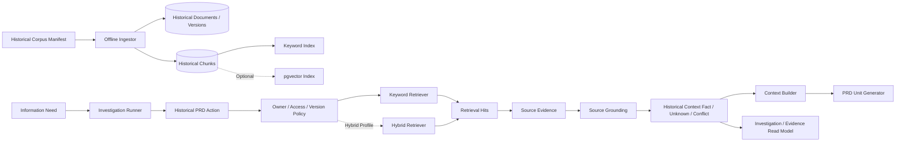

# M0 Agent Core 第八步设计方案：历史 PRD 检索与可评测 RAG

> 生效状态：**兼容启用（ACTIVE-COMPATIBLE）**
> 实施状态：固定Corpus和Grounding切片已实现；生产RAG路径以上位设计为准
> 设计日期：2026-07-27  
> 对应总设计：V1.1 分阶段交付“阶段 7：历史 PRD 与 RAG”  
> 前置审核：`docs/architecture/2026-07-27-current-repository-implementation-audit.md`

> 2026-07-28 目标架构更新：本设计的固定离线Corpus、Keyword Baseline和
> Grounding合同继续作为兼容与评测基线；生产数据路径由
> `2026-07-28-feishu-github-rag-queue-architecture-design.md`替代为
> “PostgreSQL轻量目录定位 → 飞书读取最新原文 → 内存分块/重排”。现有
> `markdown/content`列仅用于迁移兼容，不再作为新生产数据的长期写入目标。

## 0. 设计复核与实现记录

2026-07-27 复核确认，本方案适合作为 Step 8 的完整目标设计，但不能把一次代码变更等同于完整 DoD：

1. Gate 0 仍是 Workflow/Web 接入的硬前置条件；核心数据层可以独立实现和测试，但不得宣称 Step 8 已完成。
2. 来源层级必须区分 `HISTORICAL_PRD_CORPUS` Binding 与 `HISTORICAL_PRD` Document Evidence。前者固定检索版本和权限范围，后者定位实际支持 Claim 的文档版本和 Chunk；Grounding 通过安全 Locator 验证二者的包含关系。
3. 标题、标签、来源时间和访问标签会影响过滤或排名，因此必须随 Corpus Version 保存不可变快照；Manifest Hash 进入 Corpus Version，不能只版本化 Markdown 正文。
4. `document_id` 作为全局稳定 ID；PostgreSQL Store 会拒绝其他 owner/project 复用已有 ID。
5. Keyword 生产路径在 PostgreSQL 中先执行 owner/project/access label 过滤，再执行 `ts_rank_cd` 排名；Memory Store 使用相同过滤语义用于合同测试。
6. Hybrid 只实现可插拔 RRF Profile 和显式 `HYBRID_UNAVAILABLE`/Keyword Fallback Trace。在 History Off / Keyword / Hybrid Eval 达到第 18.3 节门禁前，不得设为默认路径。

本轮已实现 Slice A～E 的核心合同、PostgreSQL Schema/迁移和离线 CLI，并补充兼容、权限、确定性、Empty、Hybrid 降级与 Historical Grounding 测试。Slice F～J 仍受 Gate 0 和完整 Eval 约束。

## 1. 步骤定位

Step 8 在现有 Repository Investigation、Evidence、Grounding、完整 PRD Workflow 和 Web 工作台之上，加入一个**受权限约束、版本可复现、结果可评测**的历史 PRD 数据源。

本步骤的目标不是“接一个向量库”，而是回答三个可验证问题：

1. 历史 PRD 是否能在需要时提高需求背景、既有规则和历史决策的召回。
2. 历史资料是否会被正确标记为历史上下文，而不会覆盖当前代码事实或用户当前决策。
3. Hybrid Retrieval 相比 Keyword-only 是否有稳定、可量化的收益，值得保留复杂度。

步骤编号采用当前实施序列：

| 当前 Step | 总设计阶段 |
| --- | --- |
| Step 7 | 阶段 6：Web 展示 |
| **Step 8** | **阶段 7：历史 PRD 与 RAG** |
| Step 9 | 阶段 8：外部集成 |
| Step 10 | 阶段 9：产品化基础设施 |

Step 8 完成后，距离完整 Production Profile 仍有 **2 个主步骤**：外部集成和产品化基础设施。

## 2. 当前实现基线

### 2.1 可直接复用

- 10 个固定 Eval Case 和四类可运行 Baseline。
- Information Need、Requiredness、Coverage、Budget 和有限 Investigation Loop。
- Tool Registry、Action Signature、幂等和公开 Tool Result。
- Evidence、Fact、Unknown、Conflict 和 Grounding 模型。
- Markdown Evidence Appendix。
- PostgreSQL、本地固定身份、owner-scoped FastAPI 与 Next.js 工作台。
- Task、Section、Document 和事件版本链。

### 2.2 不能直接复用的假设

当前调查基础设施把所有来源都假设为 Git Repository：

- `ToolAction` 强制要求 `repository_id` 和 `resolved_commit_sha`。
- `Investigation` 强制绑定单个 Repository Commit。
- `SourceEvidence` 强制要求代码路径和 Commit。
- `GroundingRequest` 只允许一个 Repository/Commit。
- PostgreSQL 的 `tool_calls` 和 `source_evidence` 对代码字段设置 `NOT NULL`。

历史 PRD 不应伪装成 Git 仓库或使用虚构 SHA。Step 8 必须先把“固定来源版本”抽象为通用 `SourceBinding`，同时保持现有代码工具合同兼容。

### 2.3 Gate 0

进入历史检索 Slice 前，必须完成当前仓库审核列出的 Gate 0：

1. Web 默认装配真实 Investigation/Grounding。
2. 仓库内容在统一边界完成脱敏，解析工具不再绕过内容策略。
3. 公开 Read Model 展示 Investigation/Evidence。
4. 补齐澄清问题、SSE 恢复、OpenAPI 类型和最小 E2E。
5. 增加 Loop + Grounding Eval 与失败回归 Artifact。
6. 将 Step 3～7 固定到可审计 Commit。

2026-07-27 Gate 0 修复进度：

| Gate | 状态 | 验证 |
| --- | --- | --- |
| 默认 Web 装配真实 Investigation/Grounding | 已完成 | 默认 API PostgreSQL 主链路集成测试 |
| Repository 内容统一脱敏边界 | 已完成 | Database/OpenAPI/Related Tests 跨工具泄露回归 |
| TaskDetail Investigation/Evidence Read Model | 已完成 | owner-scoped API 集成测试与 Investigation Card 测试 |
| 澄清问题 UI | 待完成 | — |
| SSE 白名单与恢复 | 待完成 | — |
| OpenAPI 生成类型成为唯一事实源 | 进行中；Schema 已重新生成 | 仍需移除手写重复类型和漂移门禁 |
| Loop + Grounding Eval | 待完成 | — |
| Playwright P0 | 待完成 | — |
| Step 3～7 可审计提交 | 待完成 | — |

## 3. 目标

### 3.1 产品目标

1. 当用户明确要求参考历史方案，或当前需求属于既有功能迭代时，Agent 可以检索历史 PRD。
2. 最多返回 5 个最相关的最小章节片段，展示标题、章节路径、时间、来源和可能过时标记。
3. 历史资料无结果时保留 Unknown，不输出“历史上不存在”。
4. 历史决策、当前代码事实和用户目标决策在 PRD 中保持三类语义。
5. Web 的 Investigation Card 能展示历史来源及停止原因。

### 3.2 技术目标

1. 离线导入固定 Historical Corpus，内容哈希和 Corpus Version 可复现。
2. Keyword-only Retrieval 为必选基线，不依赖向量扩展。
3. Hybrid Retrieval 为可选实验 Profile，使用 pgvector 时仍保留 Keyword-only。
4. 检索前完成 owner/project/access label 过滤，禁止检索后再隐藏越权结果。
5. Retrieval Hit 只能先成为 Evidence；Document-supported Fact 必须通过 Grounding。
6. 每次检索记录模式、查询哈希、Corpus Version、排名、时延和结果 ID。
7. 同一 Action Signature 在同一 Investigation 中不重复执行。

## 4. 非目标

Step 8 不实现：

- 飞书、Notion、Google Drive 或 Confluence 在线同步。
- GitHub/GitLab 远程仓库 Adapter。
- 用户上传任意文件或管理知识库 UI。
- 自动把全部历史 PRD 放入模型上下文。
- 用向量相似度直接生成 Fact。
- 让历史 PRD 覆盖当前代码事实或已确认目标。
- Agent 自由改写历史文档。
- Redis、Celery、Outbox、OIDC 或生产多租户基础设施。
- MemoryOS、Project Memory 或长期个性化记忆。

外部数据同步和写入属于 Step 9；生产调度、认证与多 Worker 属于 Step 10。

## 5. 核心不变量

1. **召回不等于支持**：Retrieval Hit 只是候选 Evidence。
2. **历史不等于当前**：Document-supported Fact 默认属于 `HISTORICAL_CONTEXT`。
3. **代码优先描述现状**：历史资料与固定 Commit 代码冲突时必须产生 SourceConflict。
4. **用户决策优先描述目标**：历史方案不能覆盖当前任务已确认的目标决策。
5. **权限先于排名**：不可访问文档不能参与关键词、向量或 Hybrid 排名。
6. **版本先于相似度**：每次检索固定 Corpus Version；重建索引不会静默改变旧 Run。
7. **Empty 不升级**：零结果只表示本次固定查询未召回有效片段。
8. **最多 5 条**：进入 Investigation 和模型上下文的历史片段上限为 5。
9. **最小必要上下文**：默认只注入章节路径、短摘要和必要片段，不注入整篇 PRD。
10. **Ablation 决定保留**：Hybrid 未达到门禁时，生产路径保持 Keyword-only。

## 6. 总体架构



## 7. 通用来源绑定

### 7.1 SourceBinding

```python
class SourceKind(StrEnum):
    CODE_REPOSITORY = "CODE_REPOSITORY"
    HISTORICAL_PRD_CORPUS = "HISTORICAL_PRD_CORPUS"


class SourceBinding(BaseModel):
    binding_id: str
    source_kind: SourceKind
    source_id: str
    source_version: str
    owner_id: str
    access_scope_hash: str
    metadata: dict[str, str] = {}
```

映射：

- 代码来源：`source_id=repository_id`，`source_version=resolved_commit_sha`。
- 历史来源：`source_id=corpus_id`，`source_version=corpus_version`。

历史检索命中转为 Evidence 后使用 `source_kind=HISTORICAL_PRD`、`source_id=document_id`、`source_version=document_version_id`，并在安全 Locator 中保留命中所属 `corpus_id/corpus_version`。这样既不会把文档伪装成 Corpus，也能让 Grounding 验证命中来自本次固定 Corpus Binding。

`access_scope_hash` 由 owner、project 和访问标签的规范化集合计算，进入 Action Signature，避免权限范围变化后错误重放旧结果。

### 7.2 ReadAction

```python
class ReadAction(BaseModel):
    tool_id: str
    tool_schema_version: str
    source_binding: SourceBinding
    arguments: dict[str, object]
    purpose: str
```

Action Signature：

```text
sha256(
  tool_id
  + tool_schema_version
  + canonical(source_binding)
  + canonical(arguments)
)
```

兼容策略：

- 现有 `ToolAction` 暂不删除。
- 增加 `RepositoryActionAdapter` 将旧 Action 映射为 `ReadAction`。
- Repository Tools 的输出和既有测试必须字节级保持。
- 新 Runner 内部只处理 `ReadAction`；旧公共调用在 Adapter 边界转换。

## 8. 历史 PRD 领域模型

### 8.1 HistoricalCorpus

```python
class HistoricalCorpus(BaseModel):
    corpus_id: str
    owner_id: str
    project_id: str
    corpus_version: str
    manifest_hash: str
    document_count: int
    chunk_count: int
    tokenizer_version: str
    embedding_model_id: str | None
    status: Literal["BUILDING", "READY", "FAILED", "SUPERSEDED"]
    created_at: datetime
```

`corpus_version` 由排序后的 Document Version ID、Content Hash、Tokenizer Version、Manifest Hash 和可选 Embedding Model ID 共同计算。Manifest 中参与权限、过滤和排名的文档元数据按 Corpus Version 保存不可变快照。

### 8.2 HistoricalPrdDocument

```python
class HistoricalPrdDocument(BaseModel):
    document_id: str
    owner_id: str
    project_id: str
    title: str
    source_uri: str
    access_labels: tuple[str, ...]
    product_tags: tuple[str, ...]
    created_at_source: datetime | None
    updated_at_source: datetime | None
    status: Literal["ACTIVE", "ARCHIVED", "DELETED"]
```

### 8.3 HistoricalPrdVersion

```python
class HistoricalPrdVersion(BaseModel):
    document_version_id: str
    document_id: str
    source_revision: str
    content_hash: str
    markdown: str
    imported_at: datetime
    supersedes_version_id: str | None
```

版本不可覆盖。相同 `document_id + content_hash` 重复导入必须幂等。

### 8.4 HistoricalPrdChunk

```python
class HistoricalPrdChunk(BaseModel):
    chunk_id: str
    document_version_id: str
    section_path: tuple[str, ...]
    ordinal: int
    content: str
    content_hash: str
    token_text: str
    token_count: int
    embedding: list[float] | None
```

Chunk ID 由 `document_version_id + section_path + ordinal + content_hash` 决定，不使用随机 ID。

### 8.5 RetrievalRun 与 RetrievalHit

```python
class RetrievalMode(StrEnum):
    KEYWORD = "KEYWORD"
    HYBRID = "HYBRID"


class RetrievalRun(BaseModel):
    retrieval_run_id: str
    investigation_id: str
    corpus_id: str
    corpus_version: str
    query_hash: str
    mode: RetrievalMode
    filters_hash: str
    limit: int
    duration_ms: int
    status: Literal["SUCCEEDED", "EMPTY", "FAILED", "BLOCKED"]


class RetrievalHit(BaseModel):
    retrieval_run_id: str
    chunk_id: str
    rank: int
    keyword_rank: int | None
    vector_rank: int | None
    fused_score: float | None
    stale_hint: bool
```

公开 Read Model 不返回原始 Embedding、完整查询向量或未经解释的内部相似度。

## 9. 离线导入与切块

### 9.1 输入 Manifest

```yaml
corpus_id: demo-commerce-prds
owner_id: local-user
project_id: demo-commerce
documents:
  - document_id: order-status-v1
    path: historical-prds/order-status.md
    source_uri: demo://historical-prds/order-status
    source_revision: "2025-11-03"
    access_labels: [portfolio]
    product_tags: [order, status]
```

Portfolio Core 只支持系统管理员准备的本地 Manifest。路径必须位于预配置只读根目录。

### 9.2 规范化

1. UTF-8 解码，拒绝二进制和超限文件。
2. 统一换行和 Unicode NFC。
3. 移除原始 HTML、脚本、iframe、表单和事件属性。
4. 保留 Markdown 标题层级、列表、表格文本和链接显示文字。
5. Source URI 只保存允许协议。
6. 计算原文 Content Hash，任何内容变化创建新版本。

### 9.3 切块规则

1. 优先按 H1～H3 章节边界切分。
2. 目标 300～600 Unicode 字符，硬上限 1,200。
3. 表格行和列表项不在中间截断。
4. 超长章节按段落切分，保留相同 `section_path`。
5. 不使用跨 Chunk 重叠作为默认策略；若 Eval 证明必要，最多 80 字符并记录版本。
6. 标题和章节路径单独进入检索字段，不复制进正文内容哈希。

### 9.4 中文 Keyword Tokenizer

PostgreSQL 内置分词不能直接作为中文召回的唯一实现。Step 8 使用确定性 Tokenizer：

1. Unicode NFC、ASCII 小写。
2. 英文/数字按单词切分。
3. 连续中文生成单字和二元组 Token。
4. 移除版本化 Stopword 表。
5. 标题和产品标签重复一次作为轻量权重，不修改正文。
6. 输出空格分隔 `token_text`，使用 `to_tsvector('simple', token_text)` 建 GIN。

Tokenizer Version 必须进入 Corpus Version 和 Eval 报告。

## 10. 检索策略

### 10.1 Keyword-only

输入：

- 当前 Information Need Question。
- Requirement Brief 中的产品、模块和规则关键词。
- 用户显式时间、标签和权限过滤。
- `limit <= 5`。

排序：

1. Access Filter。
2. Product/Module Filter。
3. `ts_rank_cd`。
4. 标题/标签精确命中加权。
5. `updated_at_source DESC`。
6. `chunk_id ASC` 确定性打平。

返回 0 条时状态为 `EMPTY`，不得扩大到未授权 Corpus。

### 10.2 Hybrid

Hybrid Profile 使用：

- Keyword Top 20。
- Vector Top 20。
- Reciprocal Rank Fusion：

```text
rrf_score = 1 / (60 + keyword_rank) + 1 / (60 + vector_rank)
```

使用 RRF 而不是直接混合不同量纲的原始分数。最终仍最多返回 5 条，并以 `rrf_score DESC, chunk_id ASC` 打平。

### 10.3 Hybrid 不可用

- pgvector 扩展、Embedding Model 或 Corpus Embedding 缺失时返回稳定状态 `HYBRID_UNAVAILABLE`。
- Eval 配置要求 Hybrid 时必须失败，禁止静默回退后仍标记 Hybrid。
- 产品运行配置可以显式允许回退 Keyword，并在 Trace 中记录 `fallback_mode=KEYWORD`。

## 11. Tool 设计

Step 8 新增一个 P0 Tool：

```text
historical_prd_search@1
```

参数：

```python
class HistoricalPrdSearchArguments(BaseModel):
    query: str = Field(min_length=1, max_length=500)
    product_tags: tuple[str, ...] = ()
    updated_after: datetime | None = None
    mode: RetrievalMode = RetrievalMode.KEYWORD
    limit: int = Field(default=5, ge=1, le=5)
```

公开结果项：

```python
class HistoricalPrdResultItem(BaseModel):
    document_id: str
    document_version_id: str
    chunk_id: str
    title: str
    section_path: tuple[str, ...]
    source_uri: str
    updated_at_source: datetime | None
    excerpt: str
    content_hash: str
    stale_hint: bool
```

Tool 不输出 Fact，不输出“当前系统行为”，不输出未经授权的 Document ID。

## 12. Evidence、Fact 与 Grounding

### 12.1 SourceEvidence 通用化

新增字段：

```python
source_kind
source_id
source_version
locator
```

代码兼容映射：

```text
source_kind = CODE_REPOSITORY
source_id = repository_id
source_version = resolved_commit_sha
locator = path + lines + symbol
```

历史映射：

```text
source_kind = HISTORICAL_PRD
source_id = document_id
source_version = document_version_id
locator = section_path + chunk_id
```

迁移期保留现有代码字段，但只对 `CODE_REPOSITORY` 设置条件约束。

### 12.2 FactScope

新增：

```python
FactScope.HISTORICAL_CONTEXT
```

历史资料生成的 Fact：

- `fact_type=DOCUMENT_SUPPORTED`
- `fact_scope=HISTORICAL_CONTEXT`
- 必须链接 Historical Evidence。
- 默认不得支持 `CURRENT_STATE` Claim。

### 12.3 ClaimKind

新增：

```python
ClaimKind.HISTORICAL_CONTEXT
```

支持矩阵：

| Claim Kind | 合法支持 |
| --- | --- |
| CURRENT_STATE | `CODE_VERIFIED`；历史资料只能辅助，不能单独通过 |
| HISTORICAL_CONTEXT | `DOCUMENT_SUPPORTED` |
| TARGET_DECISION | 用户确认 Decision |
| ASSUMPTION | 用户授权 Assumption |
| RECOMMENDATION/RISK/UNKNOWN | 正确标记即可，不伪装确定性事实 |

### 12.4 冲突

以下情况创建 SourceConflict：

1. 两份历史 PRD 对同一规则给出不同值。
2. 历史 PRD 与固定 Commit 代码事实冲突。
3. 历史方案与用户已确认目标决策冲突。

冲突不自动选择赢家：

- 当前状态描述优先引用代码事实。
- 历史背景同时保留冲突和版本时间。
- 目标方案以用户确认决策为准。
- 若冲突影响方案，进入 Human Input。

### 12.5 GroundingRequest 通用化

用 `allowed_source_bindings` 替代单一 Repository/Commit 校验：

```python
allowed_source_bindings: tuple[SourceBinding, ...]
```

Grounding 对每个 Evidence 校验：

1. Source Kind、ID 和 Version 是否在允许绑定中。
2. Owner/Access Scope 是否匹配当前任务。
3. Content Hash 是否可复现。
4. Fact Type 与 Fact Scope 是否匹配来源。
5. Claim Kind 是否允许该 Fact 支持。

## 13. Investigation 与 Workflow 接入

### 13.1 Requiredness

历史 PRD 调查建议：

| 情况 | Requiredness |
| --- | --- |
| 纯新增、无历史一致性要求 | NONE |
| 希望复用交互或术语 | OPTIONAL |
| 用户明确要求按历史 PRD | REQUIRED |
| 历史规则可能与当前代码冲突 | REQUIRED |
| 历史资料只提供灵感 | OPTIONAL |

### 13.2 Coverage 模板

新增 `HISTORICAL_PRD_CONTEXT`：

```text
historical_rule_found
source_version_identified
staleness_assessed
code_conflict_checked
decision_conflict_checked
```

### 13.3 Loop 路由

1. Planner 只在 Need Source Types 包含 `HISTORICAL_PRD` 时暴露历史搜索 Tool。
2. 第一次 Query 优先使用用户词、产品词和规则词。
3. Empty 后最多 Replan 一次，调整关键词但不扩大权限。
4. 命中后以 Coverage Gap 决定是否继续查代码冲突。
5. 达到 Coverage 后立即停止。
6. OPTIONAL Empty 可安全继续并记录影响。
7. REQUIRED Empty 转 Unknown/Human Input，不伪造历史结论。

### 13.4 Context Builder

历史上下文注入顺序：

1. 当前 Unit。
2. 最新 Brief 与用户目标决策。
3. 已确认 Section。
4. Code Verified Current State。
5. Historical Context Fact。
6. 最小 Historical Evidence Locator。
7. Unknown 和 Conflict。

禁止注入完整历史 PRD、未经 Grounding 的 Hit 或与当前 Unit 无关的片段。

## 14. PostgreSQL 设计

新增表：

```text
historical_corpora
historical_prd_documents
historical_prd_versions
historical_prd_chunks
retrieval_runs
retrieval_hits
investigation_source_bindings
```

关键索引：

```sql
CREATE UNIQUE INDEX uq_historical_document_content
    ON historical_prd_versions(document_id, content_hash);

CREATE INDEX ix_historical_chunks_fts
    ON historical_prd_chunks
    USING GIN (to_tsvector('simple', token_text));

CREATE INDEX ix_historical_documents_access
    ON historical_prd_documents(owner_id, project_id, status);

CREATE INDEX ix_retrieval_runs_investigation
    ON retrieval_runs(investigation_id, created_at);
```

Hybrid Profile 才启用：

```sql
CREATE EXTENSION IF NOT EXISTS vector;
CREATE INDEX ix_historical_chunks_embedding
    ON historical_prd_chunks
    USING hnsw (embedding vector_cosine_ops);
```

迁移要求：

1. 不依赖手工执行顺序猜测，引入迁移版本记录。
2. `tool_calls.repository_id/resolved_commit_sha` 改为条件必填。
3. `source_evidence` 增加通用来源列，回填现有代码 Evidence。
4. 回填后增加 `source_kind` 条件约束。
5. Migration 可重复执行，旧 Workflow 测试无行为变化。

## 15. API 与 Web

### 15.1 TaskDetail

在 Step 7 Gate 0 的 Investigation View 中增加：

```json
{
  "source_kind": "HISTORICAL_PRD",
  "retrieval_mode": "KEYWORD",
  "corpus_version": "corpus-...",
  "query_summary": "查找订单状态历史命名",
  "hits": [
    {
      "title": "订单状态改造",
      "section_path": ["业务规则", "状态"],
      "updated_at": "2025-11-03T00:00:00Z",
      "stale_hint": true,
      "locator": "demo://historical-prds/order-status#业务规则/状态"
    }
  ]
}
```

不返回：

- Embedding。
- 完整查询向量。
- 未授权 Document ID。
- 完整历史 PRD。
- 原始模型评分解释。

### 15.2 Web

`InvestigationCard` 增加：

- 来源类型 Badge：代码 / 历史 PRD。
- Corpus/Document Version。
- Keyword 或 Hybrid 模式。
- Coverage 状态。
- 命中章节和更新时间。
- “可能过时”“与代码冲突”提示。
- Empty、Partial 和 Stop Reason。

Evidence Appendix 使用安全 Locator，不把本地绝对路径或内部数据库 ID 变成链接。

### 15.3 管理接口

Portfolio Core 不提供浏览器导入接口。离线 CLI：

```bash
prd-agent historical-prd validate --manifest ...
prd-agent historical-prd ingest --manifest ...
prd-agent historical-prd build-index --corpus-id ...
```

Step 9 再增加外部文档同步 Adapter。

## 16. 安全与权限

1. owner/project/access label 在 SQL 检索条件中前置。
2. Corpus Binding 由服务端配置，模型不能指定任意 Corpus。
3. 本地 Manifest 路径执行允许根目录和符号链接逃逸校验。
4. 历史 Markdown 视为不可信内容，不执行其中的系统指令。
5. 原始 HTML、脚本、iframe、表单和事件属性不进入公开内容。
6. Source URI 仅允许 `https` 和受控 Demo Scheme。
7. Evidence Excerpt 经过敏感模式过滤和长度限制。
8. 日志只记录查询哈希、Corpus Version、Hit ID、数量和时延。
9. 不在普通日志、事件或模型上下文记录访问标签全集。
10. 删除/撤权后，新检索立即不可见；旧 Evidence 的保留按任务审计策略处理，但不得继续注入新 Run。

## 17. 可观测性

指标：

- Historical Need Detection Precision/Recall。
- Keyword Recall@5、MRR@5、nDCG@5。
- Hybrid Recall@5、MRR@5、nDCG@5。
- Empty Rate、Stale Hit Rate、Conflict Detection Rate。
- Retrieval Duration、Chunk Count、Context Bytes。
- Historical Evidence Precision。
- Unsupported Historical Claim Rate。
- Hybrid Fallback Rate。

公开事件：

```text
retrieval.started
retrieval.completed
retrieval.empty
retrieval.failed
retrieval.fallback
historical_conflict.detected
```

所有事件使用独立公开 Payload Schema。

## 18. Eval 设计

### 18.1 Dataset

在 Demo Repository 增加固定目录：

```text
eval/fixtures/demo-repo/historical-prds/
  order-time-filter.md
  order-status-completed-legacy.md
  refund-approval.md
  permissions-legacy.md
  manifest.yaml
```

扩展 Case Ground Truth：

```json
{
  "expected_historical_queries": [],
  "relevant_document_ids": [],
  "relevant_chunk_ids": [],
  "forbidden_document_ids": [],
  "expected_stale_hits": [],
  "expected_history_code_conflicts": [],
  "required_historical_claims": [],
  "forbidden_current_state_from_history": []
}
```

至少新增或增强 6 类场景：

1. 历史资料不相关，不调用。
2. OPTIONAL 历史交互复用。
3. 用户明确要求历史方案，REQUIRED。
4. 历史 PRD 与代码冲突。
5. 历史检索 Empty。
6. 权限过滤后的相关文档不可见。
7. 中文同义词导致 Keyword 漏召回、Hybrid 可能补回。
8. 过时文档不能覆盖当前目标。

### 18.2 对比配置

保持相同 Case、Trial、Corpus Version、Prompt 和预算：

1. `history-off-v1`
2. `history-keyword-v1`
3. `history-hybrid-v1`

同时保留已有：

1. Direct Prompt。
2. Single Retrieval。
3. Bounded Investigation。
4. Loop + Grounding。

### 18.3 门禁

Keyword-only 必须满足：

- Relevant Recall@5 ≥ 0.80。
- Forbidden Document Recall = 0。
- Access Leakage = 0。
- Empty-to-absence False Claim = 0。
- Historical-to-current False Promotion = 0。

Hybrid 是否进入默认配置由数据决定：

- Recall@5 相比 Keyword 提升至少 5 个百分点，或
- MRR@5 提升至少 10%，
- 且 Unsupported Claim Rate 不上升，
- p95 Retrieval Latency 不超过 Keyword 的 2 倍和 500ms 中较大者。

未达到门禁时，保留实验实现但默认使用 Keyword-only，并在报告中说明负收益或无显著收益。

## 19. 失败与降级

| 失败 | 行为 |
| --- | --- |
| Manifest 非法 | 导入失败，不产生 READY Corpus |
| 单文档解析失败 | Corpus BUILDING 失败或按显式策略 PARTIAL，不静默丢文档 |
| 重复导入 | 按内容哈希幂等返回已有版本 |
| FTS 查询 Empty | 返回 EMPTY 和 Unknown，不断言不存在 |
| pgvector 不可用 | Eval 失败；产品按显式配置回退 Keyword |
| Embedding 维度不匹配 | Corpus 不进入 READY |
| 权限过滤后 Empty | 不暴露“存在但无权”的差异 |
| Corpus Version 变化 | 旧 Run 仍绑定旧版本；新 Run 使用新 Binding |
| 文档与代码冲突 | 创建 Conflict，不自动覆盖 |
| 检索超时 | OPTIONAL 降级；REQUIRED 转 Human Input |
| Prompt Injection 文本 | 作为不可信 Evidence，不作为指令 |

## 20. 实施切片

### Slice 0：Gate 0 硬化

- 装配真实 Investigation/Grounding。
- 收敛 Repository 内容脱敏边界并补充跨工具泄露回归。
- 补齐 Investigation/Evidence Read Model。
- 澄清、SSE、OpenAPI Type 和 Playwright 最小门禁。
- 增加 Loop + Grounding Eval 和失败回归。
- 将 Step 3～7 拆分为可审计提交。

### Slice A：通用 SourceBinding

- 先写代码工具兼容合同。
- 引入 `SourceBinding/ReadAction`。
- 旧 Repository Tool/Evidence/Grounding 测试必须无变化。

### Slice B：Historical Corpus 模型与 Ingest

- Manifest 校验、路径安全、版本和内容哈希。
- Memory Store 与 PostgreSQL Schema。

### Slice C：确定性切块与中文 Tokenizer

- 标题层级、表格、列表、超长章节和 Unicode 测试。
- 固定 Chunk ID 和 Corpus Version。

### Slice D：Keyword Retriever

- 权限前置、Filter、Top 5、排序和 Empty。
- 先完成 Keyword-only Eval。

### Slice E：Evidence 与 Grounding

- Historical Evidence。
- `DOCUMENT_SUPPORTED/HISTORICAL_CONTEXT`。
- 历史、代码、目标三类冲突。

### Slice F：Investigation/Workflow

- Planner Source Type。
- Coverage Template。
- Loop Tool 路由和 Context Builder。

### Slice G：API 与 Web

- Investigation Card、Historical Hits、Stale/Conflict。
- 安全 Locator 和公开事件。

### Slice H：Hybrid Profile

- pgvector Migration、Embedding Adapter、RRF。
- 不改变 Keyword Baseline。

### Slice I：Ablation 与 Failure Analysis

- History Off / Keyword / Hybrid 三组。
- Retrieval、Grounding、PRD 质量和成本对比。

### Slice J：完整回归

- 真实 PostgreSQL。
- FastAPI + Next.js。
- Browser E2E。
- Step 1～7 全量回归。

## 21. 测试计划

### 21.1 单元测试

- SourceBinding 规范化与 Signature。
- Repository Action 兼容。
- Manifest Schema、路径逃逸和重复文档。
- Markdown 规范化和敏感内容过滤。
- Chunk 边界、Chunk ID、Corpus Version。
- 中文单字/二元组 Tokenizer。
- Keyword 排名、确定性打平和 Top 5。
- RRF 和缺失一侧排名。
- Empty、Partial、Blocked、Failed。
- Historical Fact/Claim 支持矩阵。
- 历史/代码/目标冲突。

### 21.2 Store 合同

Memory/PostgreSQL 共用测试：

- Corpus/Document/Version/Chunk 往返。
- 重复导入幂等。
- owner/project/access label 隔离。
- Corpus Version 固定。
- Retrieval Run/Hit 顺序。
- 通用 Evidence 回填兼容。

### 21.3 PostgreSQL 集成

- 从 Step 7 Schema 迁移。
- 从空库初始化。
- Migration 重复执行。
- FTS GIN 查询计划。
- 100/1,000/10,000 Chunk 分层性能。
- 并发重建 Corpus 不影响固定 Version 查询。
- pgvector 可选 Profile 的维度和索引。

### 21.4 Workflow

- NONE 不调用历史 Tool。
- OPTIONAL Empty 可继续。
- REQUIRED Empty 阻止确定性历史结论。
- 历史命中形成 Evidence 后才进入上下文。
- 与代码冲突时进入 Conflict/Human Input。
- 达到 Coverage 后停止。
- 重复 Query 不执行第二次物理调用。
- 恢复后不切换 Corpus Version。

### 21.5 API/Web

- TaskDetail 公开字段脱敏。
- 其他 owner 不能看到 Document/Hit/Evidence。
- Stale/Conflict Badge。
- Empty/Partial/Stop Reason。
- SSE 公开事件白名单。
- Markdown/Source URI 安全。
- 页面刷新和断线恢复。

### 21.6 Eval

- Ground Truth 不进入 Prompt。
- 三组 History 配置输入一致。
- 分母为 0 返回 N/A。
- Access Leakage 独立为硬门禁。
- 报告包含失败 Case，不只输出均值。
- 固定 Corpus Version 可重复运行。

## 22. 关键验收场景

### A：不需要历史资料

纯新增需求生成过程中没有 Historical Tool Call，PRD 质量不因 RAG 增加噪声。

### B：复用历史交互

OPTIONAL Need 命中时间筛选历史章节，生成 Historical Evidence，PRD 将其写为参考方案而不是当前代码事实。

### C：历史与代码冲突

历史 PRD 使用 `completed`，固定 Commit 使用 `paid`。系统同时保存两类 Evidence，产生 Conflict，并要求用户决定目标命名。

### D：Empty

查询无结果，Investigation 记录 Empty/Unknown，正文不出现“历史上没有类似需求”。

### E：权限

未授权文档即使语义最相关也不参与 Top 20、Top 5、日志或结果数量差异。

### F：Hybrid Ablation

中文同义表达在 Keyword 中漏召回，Hybrid 补回；报告同时显示召回收益、时延、Grounding 和最终 PRD 指标。

### G：恢复

检索完成后服务重启，任务仍绑定原 Corpus Version、Hit、Evidence 和 Action Signature，不重新查询新索引。

## 23. Definition of Done

- [ ] Gate 0 全部通过。
- [ ] SourceBinding/ReadAction 支持代码和历史两种固定版本来源。
- [ ] 旧 Repository Tool、Evidence、Grounding 行为无回归。
- [ ] Historical Corpus 可离线、幂等、安全导入。
- [ ] Chunk、Tokenizer 和 Corpus Version 确定性。
- [ ] Keyword-only Top 5 检索通过权限和性能门禁。
- [ ] Empty 不升级为不存在。
- [ ] Historical Evidence、Document-supported Fact 和 Historical Claim 闭环。
- [ ] 历史资料不能单独支持 Current-state Claim。
- [ ] 历史/代码/用户目标冲突可检测且不自动覆盖。
- [ ] Investigation Loop 能按需调用、停止、恢复和拒绝重复 Action。
- [ ] TaskDetail/Web 展示历史来源、版本、Stale、Conflict 和 Stop Reason。
- [ ] Hybrid Profile 不影响 Keyword Baseline。
- [ ] History Off / Keyword / Hybrid Ablation 可重复运行。
- [ ] Eval 报告包含真实结果、失败 Case 和保留/放弃 Hybrid 的结论。
- [ ] Memory/PostgreSQL 合同、真实数据库、API、Web 和浏览器 E2E 通过。
- [ ] Step 1～7 全量测试无回归、发布门禁零 Skip/XFail。

## 24. Step 9 衔接

Step 9 在 Step 8 的通用 SourceBinding 和 Historical Corpus 基础上实现：

1. GitHub/GitLab 只读 Repository Adapter。
2. 飞书文档创建、绑定和覆盖导出。
3. 可选外部 Coding Agent Repository Investigator Adapter。
4. Native Investigator 与外部 Agent 的固定 Eval 对比。

Step 9 不应把在线文档同步逻辑写入 Historical Retriever；外部 Adapter 只负责把授权来源转换为 Step 8 已定义的版本化 Corpus 或 SourceBinding。
