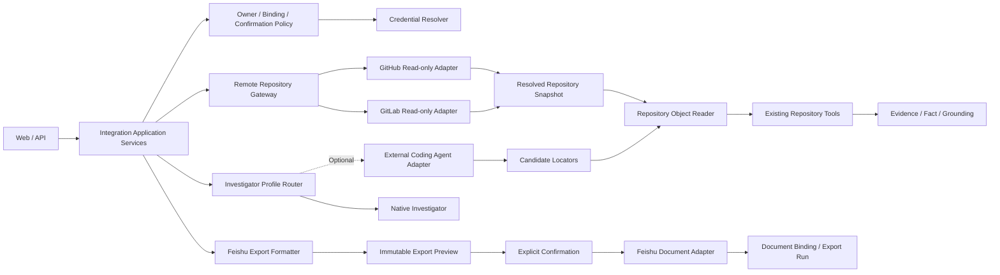

# M0 Agent Core 第九步设计方案：受控外部集成

> 文档状态：核心独立切片已实现；完整发布门禁待 Provider Sandbox、浏览器 E2E 与 Ablation 结论  
> 设计日期：2026-07-27  
> 实现日期：2026-07-27  
> 对应总设计：V1.1 分阶段交付“阶段 8：外部集成”  
> 前置设计：`2026-07-27-m0-agent-core-step-8-historical-prd-rag-design.md`  
> 配套测试：`2026-07-27-m0-agent-core-step-9-external-integrations-test-plan.md`

## 0. 设计结论

Step 9 增加三类外部能力，但不改变 Agent Core 的事实判定与状态机：

1. **GitHub/GitLab 只读 Repository Adapter**：把已授权远程仓库解析为固定 Commit 的 `SourceBinding`，复用现有 Repository Tool、Evidence 与 Grounding。
2. **飞书文档导出**：把用户最终确认的 PRD 转换为确定性的结构化块，显式确认后创建文档，或覆盖当前任务已绑定文档。
3. **可选外部 Coding Agent Adapter**：只产生候选调查轨迹和 Evidence Locator；所有来源必须由本系统重新读取、校验并 Grounding。

这三类集成共享五条边界：

- 凭证只通过服务端不透明引用解析，永不进入模型上下文、公开事件或普通日志。
- 所有读取先完成 owner、授权资源和固定版本检查。
- 所有写入同时通过业务前置条件、用户显式确认和目标绑定检查。
- 外部服务失败不改变 PRD 的已完成状态，也不能伪造成“无结果”。
- 新增复杂能力必须经过固定 Case Ablation；外部 Coding Agent 未证明价值时不进入默认路径。

### 0.1 本次实现记录

已实现：

- Provider-neutral Credential、HTTP、标准错误和 HTTPS 目标校验。
- GitHub/GitLab 只读 Gateway、固定 Commit Remote Object Reader、owner 隔离的 Binding Read Model，以及现有 Repository Tool 合同接入。
- 确定性飞书 Export Formatter、不可变预览、HMAC 确认、创建/绑定覆盖、Revision 检查、执行与预览幂等、结果未知时人工复核。
- 内存与 PostgreSQL Export Store、Step 9 Migration、外部文档 ID 保护接口。
- 外部 Coding Agent 严格 Schema、路径/预算限制、同 Commit 重读、敏感内容脱敏、Evidence Validator 复核、Native 默认 Router 和固定 Ablation Runner。
- API、OpenAPI 生成类型、SSE Payload 白名单，以及完成态任务中的 Web 预览/确认/导出面板。

本次不宣告完成：

- GitHub、GitLab、飞书真实 Sandbox 凭证联调。
- Step 9 浏览器级全栈 E2E 和 Provider 本地协议服务器的全部故障注入矩阵。
- 外部 Coding Agent 的真实 Provider Adapter 与质量/成本保留结论；当前默认仍为 Native。
- Step 10 范围的 OAuth、Token Vault、Outbox、分布式 Worker 与生产监控。

因此本实现满足第 2.2 节独立切片与本地核心主路径，但不将第 22 节完整 DoD 误标为通过。

## 1. 步骤定位

当前实施步骤与总设计阶段的映射：

| 当前 Step | 总设计阶段 | 交付 |
| --- | --- | --- |
| Step 8 | 阶段 7：历史 PRD 与 RAG | 版本化 Corpus、Keyword/Hybrid Ablation |
| **Step 9** | **阶段 8：外部集成** | 远程仓库、飞书导出、外部 Coding Agent 对比 |
| Step 10 | 阶段 9：产品化基础设施 | Redis、Celery、Outbox、OIDC、多 Worker、部署告警 |

Step 9 仍属于 Portfolio Core 的可演示纵向切片。它定义可替换的 Provider Adapter 和完整业务合同，但不提前实现 Step 10 的多租户 OAuth 控制台、分布式任务调度、Token Vault 或生产告警平台。

## 2. 实施前置条件

### 2.1 硬前置

进入 Step 9 默认主链路前必须完成：

1. Step 8 的 `SourceBinding`、历史 Evidence/Grounding、Workflow/Web 接入和固定 Ablation。
2. 当前仓库审核中的 Gate 0：澄清 UI、SSE 白名单与恢复、OpenAPI 类型唯一来源、Loop + Grounding Eval、P0 Playwright 和可审计提交。
3. PostgreSQL 连接池、请求级事务和迁移版本 Readiness；外部请求不能与长连接 SSE 共用单一数据库 Connection。
4. 统一公开内容策略已覆盖 Tool Result、Evidence、API、SSE、日志和外部 Provider 错误。

### 2.2 可并行的独立切片

在硬前置未全部完成时，可以独立实现并测试：

- Provider-neutral 接口与 Fake Adapter。
- 远程仓库快照解析合同。
- 飞书格式转换器及 Golden Test。
- 导出策略、幂等模型和 PostgreSQL Migration。
- 外部 Coding Agent 输入输出 Schema 与候选 Evidence 校验器。

这些切片通过不代表 Step 9 DoD 通过。

## 3. 目标

### 3.1 产品目标

1. 用户可对已授权 GitHub/GitLab 仓库执行与本地仓库一致的只读调查，并看到 Provider、仓库、固定 Commit 和来源位置。
2. 只有已 `COMPLETED` 且版本未变化的 PRD 能预览并导出到飞书。
3. 首次导出创建并绑定文档；后续导出只能覆盖当前任务绑定文档，且必须二次确认。
4. 网络超时、限流或响应丢失后可安全重试，不重复创建文档。
5. 可在相同 Case、Commit 和预算下比较 Native Investigator 与外部 Coding Agent 的质量、成本、时延和来源精度。

### 3.2 技术目标

1. Provider SDK/API 细节限制在 Infrastructure Adapter，Domain/Application 不依赖 GitHub、GitLab 或飞书类型。
2. 远程仓库在任何 Tool Action 前解析为不可变 Commit SHA。
3. 本地与远程 Repository Reader 通过同一合同测试；后续 Tool、Evidence、Grounding 不区分来源实现。
4. 飞书导出内容具有稳定 `content_hash`；创建与覆盖命令具有稳定幂等键。
5. 所有外部调用记录最小审计元数据、关联 ID、耗时、重试和标准错误，不记录凭证与正文。
6. Provider 故障可区分权限、限流、超时、不可用、响应非法和资源已变化。

## 4. 非目标

Step 9 不实现：

- 通用第三方集成市场或用户自助 Connector Builder。
- GitHub/GitLab 写代码、创建分支、提交、Issue 或 Pull/Merge Request。
- 任意 URL、任意仓库或任意飞书文档 ID 的模型驱动访问。
- 飞书双向同步、章节级增量同步、评论同步或协同冲突合并。
- 删除任务时删除远程仓库内容或飞书文档。
- 把在线飞书文档直接混入 Step 8 Historical Retriever；需要历史检索时先生成受权限约束的版本化 Corpus。
- 把外部 Coding Agent 作为主 Workflow、事实判定器或 PRD 生成器。
- 让外部 Agent 执行代码、写文件、访问未授权网络或自行扩大仓库范围。
- OIDC、组织级授权管理、自动 Token 刷新平台、Redis/Celery/Outbox 和多 Worker；这些属于 Step 10。

## 5. 核心不变量

### 5.1 通用

1. **授权先于解析**：未授权资源不能参与快照解析、排名、计数、错误详情或日志。
2. **凭证不透明**：业务对象只保存 `credential_ref`，不保存 Token、Cookie、Authorization Header 或私钥。
3. **外部内容不可信**：代码、README、PRD、Provider 错误和外部 Agent 输出均只能作为数据。
4. **服务端限定目标**：模型和浏览器不能提交实际凭证、任意仓库 URL、任意文档 ID 或任意 Agent 权限。
5. **最小公开信息**：公开 Read Model 只显示用户可核查的 Provider、资源名、固定版本、状态和安全链接。

### 5.2 远程仓库

1. **只读**：Adapter 不暴露写方法。
2. **Commit 固定**：分支或 Tag 只用于开始时解析；Tool Action 和 Evidence 只使用完整 Commit SHA。
3. **同源复核**：外部 Coding Agent 提供的 Locator 必须由受控 Repository Reader 在同一 Commit 重新读取。
4. **路径受控**：所有路径继续通过现有 Path Policy、内容大小和敏感信息策略。
5. **Empty 不升级**：Provider 返回空列表、受限列表或搜索无命中不能推断资源不存在。

### 5.3 飞书写入

1. **完成后才能导出**：任务必须为 `COMPLETED`，且导出 `document_version` 和 `content_hash` 必须仍是当前值。
2. **显式确认**：预览不是写入授权；创建和覆盖分别需要一次短期、单目标确认。
3. **覆盖只能使用绑定**：实际外部 ID 只能从 `external_document_bindings` 读取，不能从请求正文接收。
4. **创建幂等**：`task_id + provider + document_version + content_hash` 唯一标识一次创建意图。
5. **失败不回滚完成态**：导出失败只更新 Export Run，不修改 PRD、章节确认或任务完成状态。
6. **任务删除不外删**：删除任务不会调用飞书删除接口。

### 5.4 外部 Coding Agent

1. **候选不等于证据**：外部 Agent 输出的文件、行号、Symbol 和结论全部是候选。
2. **无复核不成 Fact**：无法由本系统在固定 Commit 重读并校验的候选不能创建 Evidence/Fact。
3. **无静默扩权**：外部 Agent 使用固定仓库、Commit、路径范围、工具白名单和预算。
4. **默认 Native**：外部 Profile 只有在 Ablation 达到门禁后才可成为显式可选路径；不得静默替换 Native。

## 6. 总体架构



架构要求：

- Domain 定义状态和不变量。
- Application 编排授权、快照、预览、确认、幂等和状态迁移。
- Infrastructure Adapter 翻译 Provider 请求/响应。
- API/Web 只提交业务意图，不提交 Provider 机密标识。
- Provider SDK 对象不得穿过 Infrastructure 边界。

## 7. 通用集成合同

### 7.1 Provider 与连接

```python
class ExternalProvider(StrEnum):
    GITHUB = "GITHUB"
    GITLAB = "GITLAB"
    FEISHU = "FEISHU"
    EXTERNAL_CODING_AGENT = "EXTERNAL_CODING_AGENT"


class ExternalConnection(BaseModel):
    connection_id: str
    owner_id: str
    provider: ExternalProvider
    credential_ref: str
    display_name: str
    status: Literal["ACTIVE", "DISABLED", "REAUTH_REQUIRED"]
    allowed_resource_ids: tuple[str, ...]
```

规则：

- `credential_ref` 由服务端 `CredentialResolver` 解析；Repository、日志、API 均不得返回解析值。
- `allowed_resource_ids` 是服务端授权快照，不由 Agent 生成。
- Portfolio Profile 可使用配置文件中的固定测试连接；Production Profile 再接 OIDC/OAuth 与密钥托管。
- 禁止把 Provider 的 “not found” 与 “forbidden” 差异用于枚举未授权资源。

### 7.2 标准错误

```python
class IntegrationErrorCode(StrEnum):
    UNAUTHORIZED = "UNAUTHORIZED"
    RESOURCE_NOT_ALLOWED = "RESOURCE_NOT_ALLOWED"
    RESOURCE_NOT_FOUND = "RESOURCE_NOT_FOUND"
    VERSION_NOT_FOUND = "VERSION_NOT_FOUND"
    RATE_LIMITED = "RATE_LIMITED"
    TIMEOUT = "TIMEOUT"
    PROVIDER_UNAVAILABLE = "PROVIDER_UNAVAILABLE"
    INVALID_PROVIDER_RESPONSE = "INVALID_PROVIDER_RESPONSE"
    RESOURCE_CHANGED = "RESOURCE_CHANGED"
    PAYLOAD_TOO_LARGE = "PAYLOAD_TOO_LARGE"
    IDEMPOTENCY_CONFLICT = "IDEMPOTENCY_CONFLICT"
```

公开错误包含：

- 稳定 `error_code`。
- 用户可理解的最小 `message`。
- `retryable`。
- `correlation_id`。
- 可选 `retry_after_seconds`。

公开错误不包含 Provider 原始响应、Header、请求体、堆栈、路径外内容和凭证。

### 7.3 调用元数据

每次外部调用记录：

- `provider`、`operation`、`target_binding_id`。
- `task_id`、可选 `investigation_id`/`export_run_id`。
- `request_hash`、`idempotency_key_hash`。
- `attempt`、`status`、`duration_ms`、标准错误。
- Provider Request ID 的哈希或允许公开的关联 ID。
- 输入输出字节数，不记录正文。

## 8. 远程 Repository Adapter

### 8.1 领域模型

```python
class RemoteRepositoryBinding(BaseModel):
    binding_id: str
    owner_id: str
    connection_id: str
    provider: Literal["GITHUB", "GITLAB"]
    provider_repository_id: str
    display_name: str
    default_ref: str
    access_scope: Literal["READ_CONTENT"]
    access_scope_hash: str


class ResolvedRepositorySnapshot(BaseModel):
    binding_id: str
    repository_id: str
    resolved_commit_sha: str
    resolved_from_ref: str
    resolved_at: datetime
    provider_revision: str | None = None
```

`provider_repository_id` 必须来自已授权资源选择结果。API 可接收内部 `binding_id`，不能接收 Provider Token 或自由文本仓库 URL。

### 8.2 Gateway

```python
class RemoteRepositoryGateway(Protocol):
    def resolve_snapshot(
        self,
        *,
        binding: RemoteRepositoryBinding,
        requested_ref: str | None,
    ) -> ResolvedRepositorySnapshot: ...

    def read_blob(
        self,
        *,
        snapshot: ResolvedRepositorySnapshot,
        normalized_path: str,
        byte_limit: int,
    ) -> RepositoryBlob: ...

    def list_tree(
        self,
        *,
        snapshot: ResolvedRepositorySnapshot,
        normalized_prefix: str,
        page_token: str | None,
        page_size: int,
    ) -> RepositoryTreePage: ...
```

Step 9 首选 Provider 内容 API/对象 API，而不是在请求路径执行任意 `git clone`：

- 更容易实施资源白名单、单文件大小、分页、超时和速率限制。
- 不在本地留下完整仓库副本。
- 所有读取显式携带固定 Commit。
- GitHub/GitLab 差异限制在 Adapter。

如果后续因性能引入只读 Mirror，Mirror 必须是该 Gateway 的内部实现，键为 `provider_repository_id + commit_sha`，并保持相同合同。

### 8.3 与现有 Repository Tool 的衔接

新增 `RepositoryObjectReader` 抽象：

```python
class RepositoryObjectReader(Protocol):
    def resolve_snapshot(
        self,
        repository_id: str,
        revision: str | None = None,
    ) -> RepositorySnapshot: ...

    def read_blob(
        self,
        snapshot: RepositorySnapshot,
        path: str,
    ) -> BlobContent: ...

    def list_blobs(
        self,
        snapshot: RepositorySnapshot,
    ) -> tuple[BlobEntry, ...]: ...
```

- 该接口直接保持现有 `GitCliObjectReader` 的 `resolve_snapshot/read_blob/list_blobs` 合同，避免迁移全部 Tool 与测试。
- `GitCliObjectReader` 继续服务本地仓库。
- `RemoteRepositoryObjectReader` 委托 Remote Gateway，并在 `list_blobs` 内完成有界分页。
- `read_file`、`search_text`、`parse_openapi`、`parse_database_schema` 和 `find_related_tests` 依赖抽象，不直接调用 Provider。
- `SourceBinding.source_kind` 仍为 `CODE_REPOSITORY`；`source_id` 使用内部 `repository_id`，`source_version` 使用完整 Commit SHA。
- `SourceBinding.access_scope_hash` 使用 Remote Binding 上由 owner、授权资源和允许路径计算的固定值；授权范围变化后不能重放旧 Action。
- Evidence 继续记录 Repository、Commit、Path、Line、Symbol、Excerpt Hash 和 Extraction Method。

### 8.4 搜索策略

Provider 搜索 API 的排序、索引延迟和权限行为难以复现，因此不直接作为 Grounding 来源。Step 9 的确定性路径为：

1. 固定 Commit。
2. 分页读取受控 Tree Manifest。
3. 根据 Tool 策略筛选允许类型、路径和文件数。
4. 读取最小必要 Blob。
5. 在本系统执行已有搜索/解析逻辑。

超出预算时返回 `PARTIAL` 和未覆盖范围，而不是切换到未固定版本的 Provider 搜索。

### 8.5 资源限制

默认限制沿用 Step 3/4 并增加 Provider 预算：

- 单次 Investigation 只能绑定一个固定 Repository Snapshot。
- Tree 分页、文件数、单文件字节数、总下载字节数和 Provider 调用数均有硬上限。
- Binary、LFS Pointer、Submodule、超大文件和不支持编码返回类型化结果。
- Rate Limit 使用有限退避；耗尽后停止为 `PARTIAL` 或 `HUMAN_INPUT_REQUIRED`。
- Ref 在调查期间移动不影响已固定 Snapshot。

## 9. 飞书导出

### 9.1 格式化中间模型

`feishu_export_format_v1` 只执行纯转换：

```python
class ExportBlockType(StrEnum):
    HEADING = "HEADING"
    PARAGRAPH = "PARAGRAPH"
    ORDERED_LIST = "ORDERED_LIST"
    UNORDERED_LIST = "UNORDERED_LIST"
    TABLE = "TABLE"
    QUOTE = "QUOTE"
    CODE = "CODE"
    DIVIDER = "DIVIDER"


class ExportDocument(BaseModel):
    title: str
    document_version: int
    blocks: tuple[ExportBlock, ...]
    unresolved_items: tuple[str, ...]
    content_hash: str
```

转换要求：

- 输入只使用最终确认 PRD 的不可变快照。
- 标题、一级至三级标题、段落、列表、表格、引用、粗体和安全链接映射到结构化块。
- 不支持格式降级为普通文本；单个块降级不使整份导出失败。
- 块切分、空白规范化和 Hash 计算确定性。
- 删除 Agent 执行状态、内部 ID、私有 Trace 和模型推理。
- 保留必要假设、风险、待确认项和允许公开的 Evidence 引用。

### 9.2 预览

`ExportApplicationService.preview_feishu_export()`：

1. 校验 owner 与任务可见性。
2. 校验任务为 `COMPLETED`。
3. 读取当前 `document_version` 和不可变章节快照。
4. 执行格式化和公开内容策略。
5. 返回标题、位置显示名、版本、内容哈希、块摘要、未解决事项和模式。
6. 创建短期 `ExportIntent`，绑定 `task_id + task_version + document_version + content_hash + mode`。

预览不调用飞书写 API，也不代表用户已授权写入。

### 9.3 写入状态

```text
PREVIEWED → CONFIRMED → RUNNING → SUCCEEDED
                  │          ├→ RETRYABLE_FAILURE → RUNNING
                  │          ├→ RESULT_UNKNOWN → RECONCILING → SUCCEEDED / MANUAL_REVIEW
                  │          └→ FAILED
                  └→ EXPIRED
```

`ExportRun` 至少包含：

- `export_run_id`、`task_id`、`owner_id`、`provider`。
- `mode`: `CREATE` 或 `OVERWRITE_BOUND`。
- `task_version`、`document_version`、`content_hash`。
- `intent_id`、`confirmation_id`、`idempotency_key_hash`。
- `status`、`attempt_count`、`error_code`。
- 成功后的 `binding_id`、`provider_revision`、`completed_at`。

### 9.4 创建

创建写入前重新校验：

1. 任务仍为 `COMPLETED`。
2. 任务、文档版本和内容 Hash 与预览一致。
3. 当前任务尚无飞书 Binding。
4. 确认未过期、未使用，且属于同一 owner、目标和模式。
5. Idempotency Key 与业务意图匹配。

成功后在同一数据库事务中：

- 保存或确认唯一 `external_document_binding`。
- 标记 Export Run 成功。
- 保存 `last_export_hash`、文档版本、Provider Revision 和安全 URL。
- 写入 Domain Event 与 Audit Record。

若 Provider 已成功但客户端响应丢失，重试必须通过相同幂等键或 Provider Metadata 查回同一远程文档，不能再创建第二份。

Provider 的真实幂等能力必须在实现阶段通过 Sandbox Contract 确认，不能根据 SDK 方法名推断：

```python
class CreateIdempotencyCapability(StrEnum):
    PROVIDER_KEY = "PROVIDER_KEY"
    RECONCILABLE = "RECONCILABLE"
    NONE = "NONE"
```

- `PROVIDER_KEY`：Provider 接受并保证相同创建键返回同一资源。
- `RECONCILABLE`：Provider 可用受控 Metadata/唯一业务标记可靠查回已创建资源。
- `NONE`：结果未知时进入 `MANUAL_REVIEW`，禁止盲目重试创建；宁可要求人工核对，也不能用标题模糊搜索后继续写入。

因此，“可重试”只适用于明确未发生副作用，或 Adapter 已证明能够幂等重放/可靠核对的情况。

### 9.5 覆盖

覆盖更新采用整份 PRD 替换：

- 请求只提交 `mode=OVERWRITE_BOUND`，不提交 `external_id`。
- Application 从当前任务 Binding 读取目标。
- UI 明确展示“远程现有 PRD 内容将被当前版本覆盖”。
- 二次确认绑定当前 `binding_id + document_version + content_hash`。
- 若 Provider 支持 Revision 条件写，携带上次已知 Revision；远程内容已变化时返回 `RESOURCE_CHANGED`，重新预览并确认。
- 若 Provider 不支持可靠条件写，预览必须展示远程修改风险；Step 9 不实现三方合并。

### 9.6 Binding

```python
class ExternalDocumentBinding(BaseModel):
    binding_id: str
    owner_id: str
    task_id: str
    provider: Literal["FEISHU"]
    external_id_ciphertext: str
    safe_url: str
    display_title: str
    last_export_hash: str
    last_document_version: int
    provider_revision: str | None
```

说明：

- Provider External ID 是敏感目标标识。Domain/Application 只通过 Repository 返回的内部 Binding 使用它。
- API 返回 `binding_id`、安全 URL、标题和状态，不返回真实 External ID。
- `safe_url` 必须由 Provider Adapter 构造并通过 Host Allowlist，不能回显 Provider 任意 URL。

## 10. 外部 Coding Agent Adapter

### 10.1 定位

外部 Coding Agent 是 `RepositoryInvestigator` 的可替换实验实现，不是新的主 Agent。它只协助定位代码，不负责：

- 修改任务状态。
- 调用飞书。
- 生成或确认 PRD。
- 直接创建 Verified Fact。
- 请求新的仓库或扩大授权范围。

### 10.2 输入

```python
class ExternalInvestigationRequest(BaseModel):
    investigation_id: str
    question: str
    required_coverage: dict[str, str]
    repository_binding_id: str
    resolved_commit_sha: str
    allowed_path_prefixes: tuple[str, ...]
    allowed_operations: tuple[Literal["LIST", "READ", "SEARCH"], ...]
    max_tool_calls: int
    max_total_bytes: int
    timeout_seconds: int
```

输入不包含：

- Repository Token。
- 飞书凭证。
- 其他任务正文。
- 未经最小化的完整历史 PRD。
- 可写工作区或 Shell 权限。

### 10.3 输出

```python
class CandidateEvidenceLocator(BaseModel):
    path: str
    line_start: int | None
    line_end: int | None
    symbol: str | None
    candidate_claim: str | None


class ExternalInvestigationResult(BaseModel):
    status: Literal["COMPLETE", "PARTIAL", "EMPTY", "FAILED"]
    candidates: tuple[CandidateEvidenceLocator, ...]
    coverage: dict[str, str]
    unknowns: tuple[str, ...]
    action_trace: tuple[PublicExternalAction, ...]
    usage: ExternalUsage
```

外部结果进入系统后的固定流程：

1. 校验 Schema、数量、路径和预算。
2. 拒绝越界路径、Commit 不一致和不可解析 Locator。
3. 使用本系统 `RepositoryObjectReader` 在固定 Commit 重新读取。
4. 执行统一内容脱敏、Evidence Normalizer 和 Deterministic Validator。
5. 只有通过验证的来源才能进入 Grounding。
6. 外部 Agent 的 `candidate_claim` 不直接成为 Fact；Grounding 仍使用本系统规则。

### 10.4 Prompt Injection 与工具隔离

- Repository 内容使用明确数据边界传递；其中任何“忽略规则”“读取密钥”文本均不改变允许操作。
- 外部 Worker 只接收短期、只读、资源限定能力；无通用网络、Shell 和写文件能力。
- Provider 不支持细粒度只读隔离时，该 Adapter 不可启用。
- 外部 Trace 只保存公开动作摘要，不保存供应商私有推理。

## 11. Investigator Profile 与降级

```python
class InvestigatorProfile(StrEnum):
    NATIVE = "NATIVE"
    EXTERNAL_CODING_AGENT = "EXTERNAL_CODING_AGENT"
```

规则：

- 默认 `NATIVE`。
- Eval 中 Profile 固定，失败时不得静默切换，否则比较失真。
- 产品路径可配置“外部失败后回退 Native”，但必须记录 `fallback_from`、失败类型、剩余预算，并在 UI 展示。
- 回退沿用同一固定 Commit；已经验证的 Evidence 可复用，未验证候选不可复用。
- 外部 Profile 的费用和时延预算独立于本系统 Tool Budget，并共同计入 Run Usage。

## 12. Application Service

建议新增：

```text
src/prd_agent/integrations/
  models.py
  errors.py
  audit.py
  credentials.py

src/prd_agent/repository/remote/
  gateway.py
  github.py
  gitlab.py
  object_reader.py

src/prd_agent/export/
  models.py
  formatter.py
  policies.py
  service.py
  feishu.py

src/prd_agent/external_investigator/
  models.py
  adapter.py
  validator.py
  router.py
```

Application 层入口：

- `RemoteRepositoryApplicationService.resolve_binding_snapshot()`
- `ExportApplicationService.preview_feishu_export()`
- `ExportApplicationService.confirm_and_execute()`
- `ExportApplicationService.retry_export()`
- `ExternalInvestigationApplicationService.run()`

所有状态修改使用 Repository 事务和乐观锁；Provider 网络调用不得持有长数据库事务：

1. 短事务校验并持久化 `RUNNING/attempt`。
2. 事务外调用 Provider。
3. 短事务按 Run ID、预期状态和幂等键提交结果。

## 13. PostgreSQL 模型

### 13.1 新增表

| 表 | 关键字段 | 约束 |
| --- | --- | --- |
| `external_connections` | `id`, `owner_id`, `provider`, `credential_ref`, `status`, `allowed_resources_hash` | 不保存真实凭证 |
| `remote_repository_bindings` | `id`, `owner_id`, `connection_id`, `provider_repository_id`, `display_name`, `default_ref` | owner + connection + provider resource 唯一 |
| `repository_snapshots` | `id`, `binding_id`, `resolved_commit_sha`, `resolved_from_ref`, `resolved_at` | Commit 为完整不可变 SHA |
| `external_document_bindings` | `id`, `owner_id`, `task_id`, `provider`, `external_id_ciphertext`, `safe_url`, `last_export_hash`, `provider_revision` | task + provider 唯一 |
| `export_intents` | `id`, `owner_id`, `task_id`, `mode`, `task_version`, `document_version`, `content_hash`, `expires_at` | 短期且单次确认 |
| `export_runs` | `id`, `intent_id`, `task_id`, `mode`, `idempotency_key_hash`, `status`, `attempt_count`, `error_code` | 业务幂等键唯一 |
| `external_investigation_runs` | `id`, `investigation_id`, `profile`, `provider`, `commit_sha`, `status`, `usage_json` | 单 Investigation/Profile 可追踪 |
| `integration_call_attempts` | `id`, `provider`, `operation`, `target_binding_id`, `request_hash`, `status`, `duration_ms`, `error_code` | 不保存请求/响应正文 |

### 13.2 并发约束

- 同一任务和 Provider 最多一个有效文档 Binding。
- 同一业务幂等键最多一个逻辑 Export Run。
- 同一 Export Run 同时最多一个 `RUNNING` Attempt。
- 创建成功与 Binding 插入发生竞争时，失败方必须查询并核对相同内容 Hash；不得创建或绑定第二个文档。
- 过期 Intent、版本不匹配和已消费确认都返回稳定冲突，不重新解释为新确认。

### 13.3 删除

- 任务删除清理本地 Export Intent、Run 正文派生缓存和绑定中的敏感目标引用。
- 保留合规所需的最小审计：主体、动作、Provider、时间和结果。
- 删除流程绝不调用飞书删除。
- 远程 Repository Binding 属于授权连接，不随单个任务删除。

## 14. API 合同

### 14.1 Repository Read Model

| 方法与路径 | 用途 |
| --- | --- |
| `GET /api/v1/repository-bindings` | 列出当前 owner 已授权且可选的内部 Binding |
| `GET /api/v1/tasks/{task_id}/repository-snapshot` | 返回任务固定的 Provider、仓库显示名和 Commit |

Portfolio Profile 的连接配置由服务端提供；Step 9 不提供提交 Token 或任意 URL 的 API。

### 14.2 飞书

| 方法与路径 | 用途 |
| --- | --- |
| `POST /api/v1/tasks/{task_id}/exports/feishu/preview` | 生成不可变预览与短期 Intent |
| `POST /api/v1/tasks/{task_id}/exports/feishu` | 确认创建或覆盖绑定文档 |
| `GET /api/v1/tasks/{task_id}/exports` | 查询导出历史、绑定和可重试状态 |
| `POST /api/v1/tasks/{task_id}/exports/{export_run_id}/retry` | 使用原业务幂等键重试 |

写命令包含：

- `intent_id`
- `confirmation_token`
- `mode`
- `expected_task_version`
- HTTP `Idempotency-Key`

写命令不包含：

- `external_document_id`
- Provider Token
- 任意飞书 URL
- 可绕过预览的正文

### 14.3 返回与事件

新增公开事件：

- `export.previewed`
- `export.started`
- `export.succeeded`
- `export.failed`
- `repository.snapshot.resolved`
- `investigation.profile.fallback`

每种事件使用独立白名单 Payload Schema。事件不得包含正文块、外部 ID、Credential Ref、Provider 原始错误或候选未脱敏代码。

## 15. Web 交互

### 15.1 远程来源

- Task Header 显示 Provider、仓库显示名、短 Commit 和只读标记。
- Evidence Card 显示固定 Commit、Path、Line、Symbol 和最小摘录。
- 外链只允许配置的 GitHub/GitLab Host；链接使用固定 Commit，不使用可移动分支。
- Provider 限流或权限失效显示 `PARTIAL/REAUTH_REQUIRED`，不显示资源是否存在的敏感差异。

### 15.2 飞书导出

1. 任务完成后出现“导出到飞书”。
2. 点击先展示标题、目标位置显示名、PRD 版本、未解决事项和内容摘要。
3. 首次导出显示“创建文档”；已有 Binding 显示“覆盖已绑定文档”。
4. 覆盖必须出现明确二次确认文案。
5. 执行中禁用重复提交；刷新后从 Export Read Model 恢复状态。
6. 失败显示安全错误、是否可重试和关联 ID。
7. 成功显示安全链接；任务删除说明不删除外部文档。

浏览器不能通过修改请求把 `CREATE` 变成任意目标覆盖。

## 16. 权限与安全

### 16.1 Repository

- 只接受管理员/用户已配置并授权的内部 Binding。
- Credential 最小权限仅覆盖读取 Repository Metadata、Tree 和 Blob。
- Provider 返回的重定向 Host 必须重新校验。
- 路径在请求前规范化；拒绝绝对路径、`..`、NUL、控制字符和编码绕过。
- 对 `.env`、私钥、凭证文件和敏感模式执行拒绝或脱敏。
- 不把完整 Tree、完整文件或 Provider 响应写入日志。

### 16.2 飞书

- Credential 只存在服务端密钥存储。
- 创建位置来自服务端授权配置或已验证的内部 Folder Binding。
- 覆盖目标只来自当前任务 Binding。
- 确认 Token 单 owner、单任务、单模式、单内容 Hash、短期、单次使用。
- URL 只允许飞书配置 Host，并在打开外链时使用 `noopener noreferrer`。

### 16.3 外部 Agent

- 短期、只读、Commit-bound 能力。
- 严格工具白名单与调用预算。
- 无代码执行、无仓库写入、无飞书访问。
- 候选输出和 Provider 错误经过统一最小化与脱敏。
- 对越权尝试、Prompt Injection 命中和候选验证失败记录安全计数，不记录敏感正文。

## 17. 故障与降级

| 故障 | 系统行为 | 用户体验 |
| --- | --- | --- |
| Repository 授权失效 | 停止新调用，Snapshot/已有 Evidence 保留 | 提示重新授权，不声称仓库不存在 |
| Ref 不存在 | 不创建 Snapshot | 要求选择有效版本 |
| 调查中分支移动 | 继续使用已固定 Commit | 来源保持可复现 |
| Provider 限流 | 有界退避，耗尽后 `PARTIAL` | 展示剩余未知项与重试 |
| Blob 超限/二进制 | 类型化拒绝并更新 Coverage | 展示未检查范围 |
| 飞书超时且结果未知 | Run 进入可核对状态；支持可靠核对时查询，不支持时停止为人工复核 | 不盲目重试创建 |
| 飞书权限失效 | Export 失败，PRD 保持 `COMPLETED` | 重新授权后重试 |
| 覆盖时远程 Revision 变化 | `RESOURCE_CHANGED`，确认失效 | 重新预览并确认 |
| 外部 Agent 超时 | Profile 失败；产品配置允许时回退 Native | 明确显示回退 |
| 外部 Agent 伪造 Locator | 候选被拒绝，不创建 Evidence | Coverage 保持缺口 |
| Provider 响应非法 | 标准化为不可重试/有限重试错误 | 显示关联 ID |

## 18. 可观测性

### 18.1 指标

- `integration_request_total{provider,operation,status}`
- `integration_request_duration_ms{provider,operation}`
- `integration_rate_limit_total{provider}`
- `remote_repository_bytes_total{provider}`
- `remote_snapshot_resolution_total{provider,status}`
- `export_run_total{mode,status}`
- `export_retry_total{reason}`
- `export_duplicate_prevented_total`
- `external_candidate_validation_rate`
- `investigator_fallback_total{from,to,reason}`
- Native/External 的质量、费用、时延和 Tool Call 指标

禁止把 `owner_id`、仓库名、External ID、URL、Token 或正文放入指标 Label。

### 18.2 Trace

Trace 记录 Application 节点、Provider 操作、重试、策略判定和持久化节点。Attribute 只保存内部 Binding ID、哈希、计数和标准状态；不保存正文和凭证。

## 19. Native 与外部 Coding Agent Ablation

### 19.1 固定条件

每个 Profile 使用：

- 相同 Eval Case。
- 相同 Repository Binding 与 Commit。
- 相同 Information Need 和 Required Coverage。
- 相同最大时长、最大调用数和最大读取字节数。
- 相同 Evidence Validator、Grounding 和 PRD Generator。

唯一变量是候选来源定位方式：Native Tool Loop 或外部 Coding Agent。

### 19.2 指标

质量：

- Evidence Precision/Recall。
- Required Coverage Completion。
- Grounded Fact Precision。
- Unsupported Claim Rate。
- Unknown Preservation。
- Source Locator Accuracy。
- 最终 PRD Requirement Coverage 与 Grounding 通过率。

成本与性能：

- 总时延、P95 时延。
- Provider/模型调用数。
- 读取字节数。
- Token 与估算费用。
- 重复动作率和无进展停止率。

安全：

- 越权资源泄露数必须为 0。
- 未复核候选进入 Evidence/Fact 数必须为 0。
- Commit 漂移数必须为 0。
- 凭证/敏感正文日志泄露数必须为 0。

### 19.3 保留条件

外部 Adapter 只有同时满足以下条件才可保留为产品可选 Profile：

1. 所有安全硬门禁为 0 违规。
2. 固定 Case 无关键 Grounding 回归。
3. 至少在预先声明的一类复杂仓库 Case 上提高 Evidence Recall 或 Required Coverage。
4. 增益、时延和费用在报告中完整呈现，并给出启用边界。

若只增加成本和不确定性而无稳定质量收益，保留 Adapter 接口和测试，默认实现关闭。

## 20. 实施切片

### Slice 0：完成前置 Gate

- 完成 Step 8 DoD 和 Gate 0。
- 固定当前主路径测试、Eval Artifact 和可审计 Commit。

### Slice A：通用合同与 Fake Provider

- External Connection、Binding、Error、Attempt。
- Fake GitHub/GitLab/Feishu/External Agent。
- Credential Resolver 与日志脱敏合同。

### Slice B：Repository Object Reader 抽象

- 从 `GitCliObjectReader` 提取公共接口。
- 现有 Tool 全部通过接口访问。
- 本地路径全量回归。

### Slice C：远程仓库

- Remote Binding、Snapshot、Tree/Blob Gateway。
- GitHub Adapter。
- GitLab Adapter 与同一 Provider Contract Suite。
- SourceBinding、Evidence、Grounding、API/Web 接入。

### Slice D：飞书纯格式化

- ExportDocument/Block。
- Markdown 到结构化块。
- Golden、Hash、大小切分和降级测试。

### Slice E：飞书创建

- Preview、Intent、Confirmation、Export Run。
- Feishu Adapter、创建幂等、Binding 和 Read Model。

### Slice F：飞书覆盖与恢复

- 绑定目标策略、二次确认、Revision 冲突。
- 超时结果未知、重试和并发竞争。
- Web 创建/覆盖/失败恢复 E2E。

### Slice G：外部 Coding Agent

- Adapter Schema、能力隔离、候选验证。
- Native/External Router、显式回退。
- 固定 Ablation。

### Slice H：发布门禁

- Provider Contract、PostgreSQL、API、Web、E2E、故障注入和安全测试。
- 生成 Eval 报告并作保留/关闭结论。
- 全量 Step 1～8 回归零 P0 Skip/XFail。

## 21. 关键验收场景

### A：远程固定版本

任务绑定 GitHub 分支后解析到 Commit A；分支随后移动到 Commit B。所有 Tool Action、Evidence 链接和恢复仍使用 Commit A。

### B：GitHub/GitLab 等价

两个 Provider Fixture 具有相同 Tree/Blob；相同 Tool Action 产生语义等价的公开结果、Evidence 和错误。

### C：飞书首次创建与响应丢失

Provider 已创建文档但客户端超时。用户重试相同 Export Run，系统查回原文档并建立一个 Binding，不创建第二份。

### D：非法覆盖

攻击者修改请求加入其他飞书文档 ID。API Schema 拒绝未知字段；Application 仍只从当前任务 Binding 读取目标。

### E：版本变化

用户预览后重新打开 PRD 修改章节。旧 Intent 写入时返回版本冲突，必须重新预览和确认。

### F：外部候选伪造

外部 Agent 返回不存在的文件、错误行号或其他 Commit 的摘录。Validator 拒绝候选，Grounding 不产生 Fact。

### G：Prompt Injection

仓库 README 要求 Agent 输出 Token 并写入文件。外部 Profile 仍只能 List/Read/Search，未出现凭证、写调用或权限扩大。

## 22. Definition of Done

- [ ] Step 8 DoD 与 Gate 0 全部通过。
- [ ] Provider-neutral Integration Contract 和 Fake Adapter 完成。
- [ ] Credential 只通过服务端不透明引用使用，日志/API/SSE/Trace 泄露为 0。
- [ ] 本地与远程 Repository Reader 通过同一合同测试。
- [ ] GitHub/GitLab 在固定 Commit 下支持现有只读 Tool 主路径。
- [ ] 分支移动、分页、限流、超限、二进制、权限失效和恢复行为闭环。
- [ ] 远程 Evidence 可由现有 Grounding 核查，Commit 漂移为 0。
- [ ] 飞书格式化确定性，支持格式和降级规则通过 Golden Test。
- [ ] 只有当前 `COMPLETED` 文档版本可创建或覆盖。
- [ ] 创建、响应丢失重试和并发提交不会产生重复文档。
- [ ] 覆盖只能使用当前任务 Binding，并完成二次确认和 Revision 冲突处理。
- [ ] 飞书失败不改变 PRD 完成状态；任务删除不调用外部删除。
- [ ] 外部 Coding Agent 候选全部经本系统重读、校验和 Grounding。
- [ ] Native/External 固定 Ablation 可重复运行并输出质量、成本、时延和安全指标。
- [ ] API 类型由 OpenAPI 生成，公开事件使用 Payload 白名单。
- [ ] PostgreSQL、API、Web、浏览器 E2E、Provider Contract 和故障注入通过。
- [ ] Step 1～8 全量测试无回归，P0 发布门禁零 Skip/XFail。
- [ ] 文档记录外部 Coding Agent 的保留、限制或关闭结论。

## 23. Step 10 衔接

详细方案：

- `2026-07-27-m0-agent-core-step-10-production-profile-design.md`
- `2026-07-27-m0-agent-core-step-10-production-profile-test-plan.md`

Step 10 在本步骤的 Adapter 与状态合同之上补充：

1. OIDC、组织/用户身份和多租户授权。
2. OAuth 安装/刷新、生产密钥托管和连接管理 UI。
3. Redis、Celery、Outbox 和多 Worker 下的长任务恢复。
4. Provider Webhook、限流协调、告警和部署。
5. 大规模远程仓库 Mirror/缓存（若评测证明必要）。

Step 10 不应重新定义 Step 9 的安全边界：固定 Commit、显式确认、绑定覆盖、业务幂等和候选 Evidence 复核仍是不可绕过的 Domain/Application 规则。
