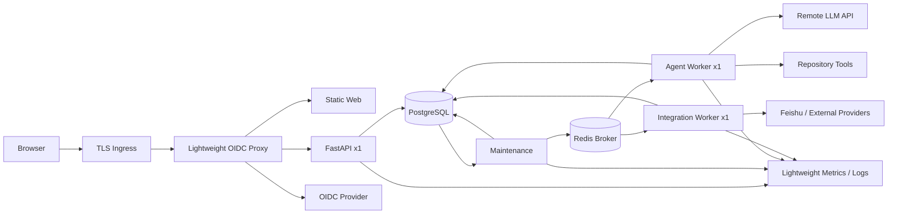
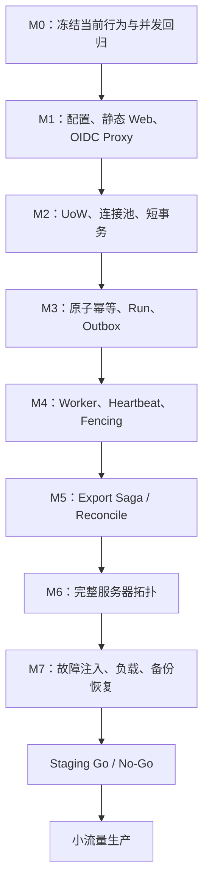

# PRD Agent 服务器部署前修复与实施设计

> 生效状态：**启用（ACTIVE）**
> 实施状态：整改进行中；P0未完成前禁止公网部署
> 设计日期：2026-07-27
> 当前部署档位：单机 2 vCPU / 2GB RAM，中小规模排队型服务
> 输入：当前完整工作区代码审查、Step 10 Production Profile 设计与测试计划
> 上位设计：`2026-07-27-m0-agent-core-step-10-production-profile-design.md`
> 配套测试：`2026-07-27-m0-agent-core-step-10-production-profile-test-plan.md`
> LLM API 详细设计：`2026-07-28-deepseek-api-loop-design.md`
> LLM API 自测：`2026-07-28-deepseek-api-loop-test-plan.md`
> 最新上位设计：`2026-07-28-feishu-github-rag-queue-architecture-design.md`
> P0闭环实施设计：`2026-07-29-p0-server-deployment-closure-design.md`

> 2026-07-28 更新：本文仍用于追踪原有部署缺陷，但其中“PostgreSQL保存完整
> PRD正文/历史Corpus”和“仅靠Celery队列控制多用户”的假设已被最新上位设计
> 替代。飞书负责Published PRD正文，GitHub负责代码，PostgreSQL负责Control
> Plane、Run Admission和轻量RAG目录。

## 0. 结论

当前代码可以继续用于本地或受控演示，但不能把现有同步 API 直接作为多用户生产服务部署。

部署前必须先完成以下最小闭环：

1. 静态 Web、OIDC 认证代理与 API 形成可实际工作的生产认证链路，未知环境配置安全失败。
2. 用真实远程 LLM API 替换默认规则模型，由 Agent Worker 驱动有界的“模型决策—工具执行—结果回填”循环。
3. API 只执行鉴权、校验和短事务，不在 HTTP 请求内执行调查、模型或外部写入。
4. 所有 PostgreSQL Store 使用请求或任务级连接池与明确事务边界。
5. HTTP 命令、Run 重试、Worker 节点和飞书写入均具备数据库原子幂等。
6. Worker 在执行期间续租，并将 fencing token 带入每次结果和副作用提交。
7. 飞书导出采用持久化 Attempt/Saga，能够处理成功、失败和结果未知。
8. 服务器拓扑包含 Web、API、Worker、Publisher、Scheduler、TLS、备份和最小监控。
9. 多用户创建 Run 时必须原子获得全局和每用户 Queue Slot，并采用用户轮转调度。
10. 历史 PRD 改为目录召回后读取飞书原文，不再持续扩张 PostgreSQL 全文副本。

P0 完成后才能进入 Staging；P1 完成并通过真实并发、故障注入和恢复演练后，才能开放生产流量。

### 0.1 实施进度（2026-07-28）

已完成：

- 严格环境枚举；只有 `local` 可使用 Local Principal。
- staging/production CORS 只接受显式 HTTPS Origin。
- Workflow、Evidence、Investigation、Export 和 Run Control 统一请求级连接作用域。
- StartTask 同幂等键使用跨 API PostgreSQL advisory lock。
- Run retry 使用持久化命令幂等记录。
- 飞书 confirmation 原子 claim、可重试释放和结果未知保护。
- 非预期调查/grounding 异常持久化失败状态与 checkpoint。
- Worker handler 获得 fencing-aware execution context，并自动 heartbeat。
- Quarantined Recovery 不再触发无限恢复消息。
- 新增 `20260728_server_deployment_remediation` Expand Migration。
- 已接入 DeepSeek Chat Completions、结构化 Workflow、模型驱动 Tool Loop、有限重试、Token/轮次预算和 Secret 文件配置。
- 本地真实 PostgreSQL 全量验证通过：265 个 Python 测试；DeepSeek Live Smoke 4 个测试通过；真实 API 全链路通过。

仍阻断服务器部署：

- P0-0（剩余部分）：生产已切换真实 LLM API Loop，但当前仍由同步 API 执行；尚未迁移到持久化 Agent Worker/Model Attempt。
- P0-3：API 长命令尚未完全迁移为 Outbox 驱动的异步 Workflow。
- P0-1：静态 Web、轻量 OIDC 认证代理、API 与认证 SSE 尚未完成部署集成。
- P0-7：生产清单仍缺 Web、真实 Agent/Integration Worker、TLS Ingress 和观测组件。
- P0-8：尚未完成 CI 多实例竞态验证和 2核2GB 单机 24 小时长稳。

### 0.2 当前环境下的剩余修复优先级

| 顺序 | 剩余切片 | 2核2GB下的实现方式 | 完成标志 |
| --- | --- | --- | --- |
| R1 | LLM API Agent Loop | 单Agent Worker串行循环；每轮一次远程模型调用、至多一次工具调用 | 生产路径不再使用规则模型，循环状态可恢复且预算有界 |
| R2 | 异步 Workflow | API只写业务事实与Outbox；单Agent Worker串行执行 | API不再执行模型、调查或长Provider调用 |
| R3 | 生产认证 | 静态Web + TLS Ingress + 轻量OIDC认证代理 | 普通API和SSE均通过同源认证 |
| R4 | 轻量后台进程 | 单Integration Worker；Publisher与Scheduler合并Maintenance | 常驻后台进程数和内存符合预算 |
| R5 | 单机部署清单 | PostgreSQL/Redis同机、内部网络、容器limit、异机备份 | 空服务器可重复部署和回滚 |
| R6 | 发布验证 | CI验证多实例竞态；2核2GB验证负载、故障和24小时长稳 | Go/No-Go清单全部通过 |
| R7 | 飞书RAG目录 | 目录Top20、飞书Top3～5、原文片段Top5～8；事件增量更新 | 飞书Revision变化在新鲜度SLO内可检索 |
| R8 | 多用户Run Admission | 30个启用用户、每用户2个Open Run、全局30个Runnable Slot | 单用户不能垄断，Redis清空后队列可恢复 |

当前不再优先建设多API常驻、多Worker并行、Next.js BFF或自动扩缩容。

## 1. 优先级定义

| 级别 | 含义 | 发布规则 |
| --- | --- | --- |
| P0 | 会导致越权、重复副作用、任务永久卡死、认证失效或部署后不可执行 | 阻断任何公网部署 |
| P1 | 会导致高并发退化、恢复困难、不可观测或数据保护不足 | 阻断生产开放，只允许 Staging |
| P2 | 容量、成本、体验和长期运维优化 | 可在小流量生产后迭代 |

## 2. 当前实现与目标之间的主要缺口

| 领域 | 当前状态 | 服务器影响 |
| --- | --- | --- |
| LLM 与 Agent Loop | production 已装配 DeepSeek Client、结构化 Workflow 和 ModelActionSelector；工具结果会回填下一轮；调用由进程内信号量限制为1 | 功能闭环已通，但模型仍在 API 请求内同步执行，缺少跨进程恢复和持久化 Attempt |
| 认证 | API 已严格校验环境并支持 OIDC Bearer；Web 仍没有生产认证入口 | 需要认证代理把安全会话转换为 API Bearer，并代理 SSE |
| API 执行 | Workflow、调查、模型和部分外部调用仍在 HTTP 请求内同步执行 | 请求超时、连接池耗尽、API 重启造成中间状态 |
| 数据库 | Workflow、Evidence、Investigation、Export 与 Run Control 已统一请求级连接作用域 | 仍需在 2GB 环境验证池预算、等待上限和无长事务 |
| 幂等 | StartTask、Run retry 和 Export 已增加原子互斥或持久化幂等 | 仍需把异步 Workflow 命令全部接入同一命令事务 |
| 导出 | confirmation 已原子 claim，可重试失败释放、结果未知禁止自动重放 | 仍需接入 Integration Worker 和人工核对路径 |
| Worker | handler 已获得 fencing context 和自动 heartbeat | 尚未装配真实异步 Workflow handler |
| 部署 | Compose 缺少 Web、Worker、Ingress、监控和远程备份 | 当前清单不能组成可用产品闭环 |
| 恢复 | Outbox、Reconciler 已有骨架，但同步 Workflow 尚未接入 | API 与 Worker 两条执行路径语义分裂 |

## 3. 目标部署架构



### 3.1 固定部署档位：单机 2 核 2GB

首版生产目标固定为一台 2 vCPU、2GB RAM 服务器，面向中小规模内部或受控用户。该档位不追求高可用和水平副本，重点保证：

- 一个公网 TLS 入口。
- 一个 API 进程。
- 一个 Agent Worker，`concurrency=1`。
- 一个 Integration Worker，`concurrency=1`，同时消费 read/write 队列但 write 保持独立限速。
- 一个轻量 Maintenance 进程，合并 Publisher 与 Scheduler 周期循环。
- PostgreSQL、Redis 与应用可同机运行，但数据库必须有异机备份。
- 所有后台工作排队，禁止通过增加线程并发挤占 2GB 内存。

保留 Outbox、幂等、lease 和 fencing，不因为单机部署删除分布式一致性边界。它们同时解决进程重启、消息重复和未来扩容问题。

推荐拓扑：

```text
TLS Ingress
├── 静态 Web
└── FastAPI × 1

Background
├── Agent Worker × 1，concurrency=1
├── Integration Worker × 1，concurrency=1
└── Maintenance × 1

State
├── PostgreSQL × 1
└── Redis × 1
```

其中 Web 优先构建为静态资源，由 Ingress 直接提供。OIDC 会话可由轻量认证代理处理，认证代理把 Access Token 转发给只在内部网络开放的 FastAPI；这样 SSE 也能复用同源安全 Cookie，而不需要常驻 Next.js BFF Node 进程。

### 3.2 资源预算

| 组件 | 内存预算 | CPU/并发 |
| --- | ---: | --- |
| OS、容器、Ingress、认证代理 | 220MB | 短请求 |
| PostgreSQL | 400MB | `max_connections <= 24` |
| Redis | 128MB | `maxmemory=128mb` |
| FastAPI | 260MB | 1 进程，数据库池 2～4 |
| Agent Worker | 420MB | concurrency=1 |
| Integration Worker | 300MB | concurrency=1 |
| Maintenance | 120MB | 单批小于 50 |
| 文件缓存与安全余量 | 200MB | 防止 OOM |
| 合计 | 约 2GB | 峰值必须由容器 limit 约束 |

运行约束：

- PostgreSQL `shared_buffers` 建议 128MB，`work_mem` 4MB，连接上限 24。
- API 连接池建议 `min=1/max=4`。
- 每个 Worker 数据库池 `min=1/max=2`。
- Redis 设置 128MB 上限，生产 Broker 使用 AOF 和 `noeviction`。
- Agent 同时只执行一个生成任务；Integration 同时只执行一个外部调用。
- LLM 只通过远程 API 调用；2核2GB服务器不加载或推理本地大模型。
- 单次模型请求设置输入字节、输出 token 和超时上限；整个 Run 设置调用次数与总 token 预算。
- 仓库读取设置单任务临时磁盘、文件数和内容大小上限。
- 禁止在该规格上运行 Eval、批量历史回填或大规模仓库索引；这些任务应离线运行。

### 3.3 容量边界

2 核 2GB 首版容量目标：

- 10～30 个注册用户。
- 5～10 个同时在线用户。
- 1 个正在生成的 PRD Run。
- 1 个并行外部集成操作。
- 普通查询 API p95 小于 800ms。
- 命令接收 API p95 小于 1s。
- 后台任务允许排队，不承诺生成完成时间固定。

当出现以下任一条件时应升级到 4 核 8GB 或拆分托管数据库：

- Agent Queue 连续 15 分钟存在 5 个以上待执行 Run。
- PostgreSQL 内存或连接持续超过 80%。
- 系统发生 OOM、持续 Swap 或 API p95 超过 1.5s。
- 同时在线用户稳定超过 10 人。
- 需要 2 个以上并行生成任务。

### 3.4 单机故障边界

该档位接受：

- 应用发布和服务器重启期间短暂停机。
- 单机故障时依赖备份恢复，不提供自动故障切换。
- Redis 丢失后从 PostgreSQL Outbox 和 Run 状态恢复。

该档位仍不接受：

- PostgreSQL 和 Redis 暴露公网端口。
- Secret 写入镜像或 Git。
- 无异机备份。
- Worker 重启后重复飞书写入。
- API 请求内同步执行模型或长 Provider 调用。

## 4. 关键设计决策

### 4.0 远程 LLM API 驱动有界 Agent Loop

当前代码已有 `InvestigationRunner` 的 `while` 循环和 `WorkflowModel` 抽象，但生产默认装配没有远程模型实现：

- `HeuristicWorkflowModel` 是离线固定规则，不发起网络请求。
- `RepositoryStructureSelector` 每轮固定选择 `repo_tree`，不是模型决策。
- `JsonWorkflowModelAdapter` 只把通用 ModelAdapter 转成结构化 Workflow 接口；仓库中没有可用的生产 HTTP ModelAdapter。

目标流程必须由 Agent Worker 驱动，HTTP API 只创建 Run：

```text
读取 Run / Investigation / Checkpoint
→ 计算当前覆盖缺口、预算和允许的工具 Schema
→ 调用一次远程 LLM API，要求返回结构化 Action
→ 校验 JSON Schema、工具白名单、参数、权限、重复动作和预算
→ 最多执行一个工具
→ 持久化 Model Attempt、Tool Attempt、Evidence、Coverage 和 Checkpoint
→ 判断完成、取消、无进展、迭代或 Token 上限
→ 未结束则进入下一轮
```

循环属于应用代码，不依赖模型在一次请求中自行无限递归，也不由浏览器反复调用业务 API。每轮至多一次模型决策和一次工具执行，任一步骤完成后都要落库，因此 Worker 重启可以从最后一个已提交 Checkpoint 恢复。

新增生产模型边界：

```python
class ModelApiClient(Protocol):
    def complete(
        self,
        *,
        system_prompt: str,
        user_prompt: str,
        response_schema: dict,
        timeout_seconds: float,
        idempotency_key: str,
    ) -> ModelApiResponse: ...
```

首版实现 OpenAI-compatible HTTP API，并通过 `JsonWorkflowModelAdapter` 同时注入 Workflow 节点和 `ModelActionSelector`。保留 `HeuristicWorkflowModel`、`ScriptedActionSelector` 仅供 local/test/eval 使用；staging/production 若没有真实模型配置必须启动失败。

生产配置至少包括：

```text
PRD_AGENT_LLM_PROVIDER=openai_compatible
PRD_AGENT_LLM_BASE_URL=https://provider.example/v1
PRD_AGENT_LLM_MODEL=<deployment-model-id>
PRD_AGENT_LLM_API_KEY_FILE=/run/secrets/llm_api_key
PRD_AGENT_LLM_TIMEOUT_SECONDS=90
PRD_AGENT_LLM_MAX_ITERATIONS=8
PRD_AGENT_LLM_MAX_OUTPUT_TOKENS=4096
PRD_AGENT_LLM_RUN_TOKEN_BUDGET=<configured-budget>
```

安全与可靠性要求：

- API Key 只从 Secret 文件或 Secret Manager 读取，不进入数据库、日志、事件、Prompt 或镜像。
- `BASE_URL` 使用配置 allowlist 和 HTTPS；禁止模型通过输入修改目标地址。
- 模型输出永远视为不可信数据，必须经过 Pydantic/JSON Schema 和工具策略校验。
- 工具只接受服务端注册的稳定 ID；模型不能提交 shell、URL、凭证或任意文件路径来绕过工具边界。
- 429、明确未处理的 5xx 和连接失败采用有界指数退避；超时或结果未知不能无条件重复产生外部副作用。
- 每次 Model Attempt 使用稳定幂等键和输入 hash；恢复时复用已完成响应，不重复消耗模型调用。
- 记录模型 ID、Prompt 版本、输入/输出 hash、Token 使用、延迟和标准错误码，不记录完整代码、Secret 或私有推理。
- 达到迭代、Token、时间、工具调用、无进展或取消上限时，循环必须形成明确终态。

### 4.1 API 只接受命令，不执行长任务

所有可能调用模型、Git、远程 Provider 或执行长调查的命令改为：

```text
鉴权
→ 校验 owner / tenant / expected version
→ 原子写入业务意图、Run、Event、Outbox
→ 提交
→ 返回 202 + task_id + run_id
```

API 不等待 Worker 完成。用户通过 Task Detail 和 SSE 获得进度。

这会移除当前 Workflow 中为执行外部步骤而提前 `commit()` 的模式。每个 Worker 节点只允许：

```text
短事务读取和声明 Attempt
→ 事务外执行模型/Provider
→ 短事务用 fencing token 提交结果
```

### 4.2 统一 Unit of Work

引入一个请求/Worker Step 级 Unit of Work：

```python
class UnitOfWork(Protocol):
    workflow: WorkflowRepository
    evidence: EvidenceStore
    investigation: InvestigationStore
    exports: ExportStore
    production: ProductionControlStore

    def commit(self) -> None: ...
    def rollback(self) -> None: ...
```

规则：

- 同一 UoW 中的 Store 共用一个短生命周期连接。
- API middleware、Publisher batch、Worker node 分别创建自己的 UoW。
- Store 方法不自行长期持有连接。
- 禁止在开启数据库事务时等待模型、Provider、SSE 或文件扫描。
- 数据库设置 `statement_timeout`、`lock_timeout` 和 `idle_in_transaction_session_timeout`。

### 4.3 统一幂等记录

新增通用命令幂等表，或扩展现有记录：

```text
command_idempotency
  tenant_id
  owner_id
  operation
  idempotency_key_hash
  request_hash
  status: RESERVED | SUCCEEDED | FAILED_RETRYABLE | RESULT_UNKNOWN
  resource_type
  resource_id
  response_json
  expires_at
```

唯一约束：

```text
(tenant_id, owner_id, operation, idempotency_key_hash)
```

处理规则：

1. 在业务事务开始时原子插入 `RESERVED`。
2. 已存在且 request hash 相同：返回原资源或原响应。
3. 已存在但 request hash 不同：返回 `IDEMPOTENCY_CONFLICT`。
4. 同一事务写入 Task/Run/Event/Outbox 和成功结果。
5. 客户端在响应丢失后必须复用同一 key。

该机制同时覆盖 StartTask、confirm、reopen、stop、retry 和 export execute。

### 4.4 Worker lease、heartbeat 与 fencing

`RunExecutor` 不再只把 `run_id` 传给 handler，而是传入执行上下文：

```python
class RunExecutionContext:
    run_id: str
    lease_owner: str
    fencing_token: int
    cancellation_token: CancellationToken
    heartbeat: Callable[[], LeaseStatus]
```

执行要求：

- Heartbeat 周期不超过 lease TTL 的三分之一。
- 心跳失败后停止发起新的模型、Tool 或 Provider 调用。
- 每个节点结果提交必须匹配当前 fencing token。
- 外部副作用调用前创建持久化 Attempt。
- 失去 lease 后返回的外部成功结果不能直接写入主状态，只能进入 Reconcile。
- Celery Retry 复用同一业务 Run，不创建新 Run。

### 4.5 飞书导出使用 Saga/Attempt

导出状态改为：

```text
PREVIEWED
→ CLAIMED
→ CALLING_PROVIDER
→ SUCCEEDED
→ FAILED_RETRYABLE
→ RESULT_UNKNOWN
→ MANUAL_REVIEW
```

流程：

1. 原子 claim confirmation，保证一个 intent 只有一个活动执行。
2. 持久化 `export_attempt`、内容 hash、Provider 幂等键和预期 revision。
3. 事务外调用飞书。
4. 成功后短事务写 Binding、Run、Event，并最终消费 confirmation。
5. 明确未执行的临时失败可释放 claim，并沿用同一 intent 重试。
6. 请求已发送但结果未知时不得自动创建第二份，进入 Reconcile/Manual Review。

数据库至少增加：

```text
export_intents.claimed_by
export_intents.claim_expires_at
export_attempts
export_attempts.provider_idempotency_key
export_attempts.result_status
export_attempts.provider_request_hash
```

### 4.6 静态 Web 使用同源 OIDC 认证代理

2核2GB不常驻 Next.js BFF。Web 构建为静态资源，由 TLS Ingress 提供；轻量 OIDC 认证代理负责 Authorization Code + PKCE 和浏览器会话：

- 浏览器只持有 Secure、HttpOnly、SameSite Cookie。
- `/api/*`、`/backend/*` 和 SSE 路径必须先经过认证代理。
- 认证代理向内部 FastAPI 附加短期 `Authorization: Bearer`。
- Ingress 删除浏览器自行提交的 Authorization 和身份转发 Header，防止伪造。
- FastAPI 仍独立验证 Token 签名、Issuer、Audience、时间和 Scope。
- FastAPI 仅监听容器内部网络，不直接暴露公网端口。
- SSE 使用同源 Cookie 经过认证代理，浏览器不需要在 EventSource 中设置 Header。
- 写请求校验 Origin；会话 Cookie 使用 SameSite，登录事务继续校验 state、nonce 和 PKCE。
- Access Token 不进入 URL、localStorage、静态文件或浏览器日志。

认证代理不可把邮箱、用户名或任意自定义 Header直接当作授权身份；API 的 owner/tenant 只能来自验证后的 Access Token 和内部 Identity Directory。

## 5. P0：部署阻断项

### P0-0 接入真实 LLM API Agent Loop

改动：

- 实现 OpenAI-compatible `ModelApiClient`，支持超时、结构化输出、Token 计量和受控重试。
- 为 staging/production 增加必需的模型 URL、模型 ID 和 Secret 文件校验。
- 生产默认装配用 `JsonWorkflowModelAdapter` 替换 `HeuristicWorkflowModel`。
- 调查路径用 `ModelActionSelector` 替换 `RepositoryStructureSelector`。
- 将 Tool Schema、Coverage、预算和上轮工具结果作为每轮模型输入。
- 持久化 Model Attempt 和每轮 Checkpoint，使进程重启不重复已完成步骤。
- 保留规则模型和脚本 Selector 作为测试依赖，禁止生产降级。

主要文件：

- `src/prd_agent/workflow/model.py`
- `src/prd_agent/investigation/planner.py`
- `src/prd_agent/investigation/runner.py`
- `src/prd_agent/api/app.py`
- `src/prd_agent/production/config.py`
- `src/prd_agent/production/model_api.py`
- `infra/production/*`

验收：

- Mock Model Server 证明一次 Run 存在至少两轮“模型—工具—模型”交互，第二轮能看到第一轮工具摘要。
- 非法 JSON、未知工具、越权参数和重复动作均不能执行。
- 429、连接中断、超时、Worker kill 和恢复不会突破配置预算或重复已提交轮次。
- 达到8轮、Token预算、无进展或取消条件时形成稳定终态。
- staging/production 缺少模型配置时启动失败，且不会回退到规则模型。
- 2核2GB长稳期间 Agent Worker concurrency 固定为1，模型调用不会导致本地 OOM。

### P0-1 严格环境配置与认证闭环

改动：

- `PRD_AGENT_ENVIRONMENT` 只接受 `local | test | staging | production`。
- 只有 `local` 允许 `LocalPrincipalResolver`。
- staging/production 缺少 OIDC、数据库、Secret、CORS allowlist 时启动失败。
- 禁止生产 `*` CORS、Debug、HTTP Cookie 和默认密钥。
- 静态构建 Web，不启动常驻 Next.js BFF。
- 部署轻量 OIDC 认证代理，配置登录、回调、登出、会话轮换和 Cookie。
- Ingress 将 API、SSE 和静态 Web 放在同一安全 Origin。
- API 只接受代理转发且自身验证通过的 Bearer Token。
- 写请求增加 Origin/CSRF 边界测试。

主要文件：

- `src/prd_agent/api/app.py`
- `src/prd_agent/production/config.py`
- `src/prd_agent/production/identity.py`
- `web/lib/api/client.ts`
- `web/next.config.ts`
- `infra/production/*`

验收：

- 未知环境名启动失败。
- 未认证请求不能执行任何业务查询。
- Alice、Bob 和跨 tenant 用户不能读取或推断彼此资源。
- 浏览器登录后普通 API 与 SSE 均可工作。
- 直接访问 API 容器端口不可达。
- 伪造 Authorization/身份转发 Header 无法绕过 API Token 校验。

### P0-2 所有 Store 迁移到连接池和短事务

改动：

- 删除 Evidence、Investigation、Export 的 `from_dsn()` 长连接装配。
- 通过 UoW/Store Factory 注入请求或任务级 connection。
- 读取结束也必须提交只读事务或 rollback 后归还连接。
- SSE 每次 Poll 独立获取连接。

主要文件：

- `src/prd_agent/api/app.py`
- `src/prd_agent/production/database.py`
- `src/prd_agent/storage/postgres_*.py`

验收：

- CI 中以 2 API 实例、100 并发读写验证无共享事务污染。
- Provider 阻塞时数据库不存在长事务或被持有的业务行锁。
- 连接池耗尽时有界等待并返回稳定 503。
- 2核2GB部署中 API 池不超过4、Worker池不超过2，总连接不超过24。

### P0-3 将同步 Workflow 改为 Outbox 驱动

改动：

- HTTP 命令只写 Run、Event、Outbox。
- Worker 装配真实 Workflow handler。
- 删除 Workflow Service 中间提交和请求内外部执行。
- 为 Worker 增加可执行 CLI/容器入口。

主要文件：

- `src/prd_agent/workflow/service.py`
- `src/prd_agent/production/dispatch.py`
- `src/prd_agent/production/queueing.py`
- `pyproject.toml`
- `infra/production/docker-compose.yml`

验收：

- API 在 Worker 停止时仍能持久化并返回已接收命令。
- API 响应前崩溃后，相同幂等键返回同一 Run。
- API 滚动重启不终止运行中的任务。

### P0-4 原子命令幂等与单活动 Run

改动：

- StartTask 不再使用“先查后插”。
- retry/stop 实际使用 `Idempotency-Key`。
- 数据库约束同一 Task 最多一个活动 Run。
- 同一 expected version 的竞争命令只有一个成功。

验收：

- 同一 key 并发 20 次只创建一个 Task/Run。
- 不同请求体复用 key 返回 409。
- 响应丢失后重试返回第一次结果。
- 10 个 retry 竞争只创建一个逻辑恢复 Run。

### P0-5 飞书导出原子 claim 与结果核对

改动：

- confirmation claim 使用条件更新和返回值。
- 不再对所有失败无条件消费 confirmation。
- 保存 provider attempt；区分“明确失败”和“结果未知”。
- 创建与覆盖使用稳定 Provider 幂等键。

验收：

- 同 intent、不同 HTTP key 并发执行只产生一次外部写入。
- 429/5xx 明确失败后可以安全重试。
- Provider 成功但响应丢失时不创建第二份文档。
- overwrite revision 冲突不覆盖新版本。

### P0-6 Worker heartbeat、fencing 与取消

改动：

- 执行上下文携带 fencing token。
- 后台 heartbeat 生命周期与 handler 绑定。
- 节点结果、Attempt 和最终状态更新都检查 token。
- 取消事实写 PostgreSQL；Redis 只加速通知。

验收：

- Worker A 暂停至 lease 过期，B 接管后，A 无法提交。
- A 的外部调用晚返回时进入核对，不覆盖 B。
- Worker kill、redelivery 和 Redis 清空均不会重复已提交节点。

### P0-7 补齐可运行部署拓扑

Compose 或部署平台必须包含：

- 静态 `web`
- `api`，1 个进程
- `worker-agent`
- `worker-integration`，同时消费 read/write 队列，concurrency=1
- `maintenance`，合并 outbox publisher 与 scheduler/reconciler
- `postgres`
- `redis`
- TLS Ingress 与轻量 OIDC 认证代理

同时补充：

- 每个服务的 liveness/readiness。
- CPU、内存、进程数和临时磁盘限制。
- 优雅停止时间。
- 独立数据库角色。
- 非 root、只读根文件系统和最小网络访问。
- Secret 挂载和日志脱敏。

验收：

- 从空服务器执行迁移后可完整登录、创建任务、恢复、停止和导出。
- 单个 API/Worker/Publisher 重启不丢业务事实。
- PostgreSQL、Redis 端口不可从公网访问。
- 所有容器在 2GB 内存限制下持续运行，无 OOM 和持续 Swap。

### P0-8 发布级并发和故障测试

P0 最小集合。多实例竞争在 CI/测试环境验证，不要求 2 核 2GB 生产机常驻多副本：

- 真实 PostgreSQL/Redis，不允许使用 InMemory Store 替代并发断言。
- CI 中运行2 API、2 Maintenance和2 Worker验证领取、幂等与fencing竞争。
- 相同 idempotency key 并发。
- Task version、单活动 Run 和 export claim 竞争。
- Publisher 发布前后 kill。
- Worker 提交前后 kill。
- lease 过期接管和旧 token 回写。
- Provider 成功后丢响应。
- Redis 清空和 API 滚动重启。
- Alice/Bob/跨 tenant 越权矩阵。

## 6. P1：生产开放前完成

### P1-1 限流、背压与容量保护

- Ingress 按 IP 做粗粒度限流。
- API 按 tenant/user/operation 做业务限流。
- 全局最多1个活动 Agent Run、1个活动 Integration 操作。
- 每用户最多1个活动 Run、2个 SSE 连接和1个导出操作。
- 模型、Git、飞书分别设置并发、超时、重试和熔断。
- Agent Queue 超过10个待执行 Run，或最老等待超过15分钟时拒绝新的高成本任务并返回 `Retry-After`。
- 数据库连接总上限24，API池最大4，单Worker池最大2。
- 单仓库调查设置文件数、单文件、总读取字节数和临时磁盘预算。

### P1-2 SSE 完整恢复

- 支持 `Last-Event-ID` 或 `after_sequence`。
- 客户端检测 sequence gap 后重新拉取快照。
- EventSource 失败后允许恢复，不永久降级。
- 事件游标过期返回稳定错误。
- SSE 心跳不写业务事件，也不长期持有数据库连接。

### P1-3 持久化 Webhook replay protection

- 用 `provider_webhook_deliveries` 原子插入去重。
- 多实例和重启后仍拒绝同一 delivery。
- 校验签名、时间窗、Payload 大小和 Binding。
- Webhook 只能唤醒已知操作，不能直接创建任意资源。

### P1-4 可观测性与审计

至少提供：

- API 5xx、401/403、409 和延迟。
- 连接池使用率与等待时间。
- Outbox 最老年龄、失败和 Quarantine。
- Queue depth、redelivery 和执行延迟。
- lease 过期、接管和 fencing reject。
- Run stuck、恢复循环和导出 Result Unknown。
- Provider 401/429/5xx。
- PostgreSQL 锁、磁盘、备份年龄。

日志只记录内部 ID、Correlation ID、状态和标准错误，不记录 Token、Cookie、正文、完整 Prompt、代码或飞书 External ID。

### P1-5 迁移、备份和恢复

- 迁移采用 Expand → Migrate → Contract。
- 应用 Readiness 验证支持的 Schema 版本。
- PostgreSQL 启用加密备份和 PITR。
- 每次正式发布前验证最新备份可读。
- 在隔离环境演练恢复、Redis 重建和 Run 恢复。
- 恢复后默认冻结外部写入，完成 Result Unknown 核对后再开放。

### P1-6 镜像和供应链

- 生成锁定依赖与可复现镜像。
- 运行依赖漏洞和镜像扫描。
- 生成 SBOM。
- 镜像使用固定 digest，而不是浮动 tag。
- CI 禁止把 Secret 写入镜像层和构建日志。

## 7. P2：小流量生产后的增强

- 按 Provider 和模型成本动态调度。
- Event、Outbox、Audit 和 Checkpoint 分区及保留策略。
- 更细粒度的运营后台和人工核对队列。
- 定期 Chaos、长稳和容量回归。
- 达到第3.3节扩容阈值后，先拆分托管 PostgreSQL，再升级应用节点；当前档位不做自动扩缩容。

## 8. 推荐实施顺序



### M0：回归基线

- 将当前工作树形成可复现 commit。
- 固定现有 207 个 Python 测试和 6 个 Web 测试。
- 为本次发现的竞态先增加失败测试。

### M1～M2：安全边界和数据库边界

优先完成认证代理、静态 Web、UoW 和短事务，因为后续所有异步执行都依赖正确 Principal 和连接生命周期。

### M3～M5：执行可靠性

再完成命令幂等、Outbox、Worker 执行和 Export Saga。每个里程碑必须以真实 PostgreSQL 并发测试结束。

### M6～M7：部署和门禁

最后补齐服务器清单、监控、限流、故障注入、备份恢复和发布 Runbook。

## 9. 数据库迁移建议

第一批 Expand Migration：

- 增加 `command_idempotency`。
- 给 Run 增加活动状态唯一约束或等价锁定策略。
- 增加 `run_attempts`、节点输入版本和 fencing token。
- 扩展 `export_intents` claim 字段并增加 `export_attempts`。
- 确认所有业务资源具备 `tenant_id + owner_id` 索引。
- 给 webhook delivery、Outbox 和恢复扫描补齐索引。

第二批回填：

- 为已有 owner 数据填充本地 tenant。
- 为可恢复 Run 补齐版本和 Attempt 元数据。
- 对已有飞书 Binding 生成安全的内部状态，不自动重放外部写入。

Contract Migration 只能在旧 API/Worker 全部下线且回填校验完成后执行。

## 10. 上线策略

### 10.1 Staging

1. 从空库执行全部迁移。
2. 按 2 核 2GB 单机拓扑部署 1 API、1 Agent Worker、1 Integration Worker 和 1 Maintenance。
3. 使用 Fake OIDC/Provider 跑完整并发与故障矩阵。
4. 接入受限真实 OIDC、Git 和飞书 Sandbox。
5. 执行 24 小时长稳、备份恢复和滚动升级。

### 10.2 Production

1. 默认关闭新任务和外部写入，只开放健康检查和管理员验证。
2. 验证 Schema、Secret、OIDC、数据库、Broker、日志和告警。
3. 先开放内部用户和只读能力。
4. 再开放 PRD Workflow。
5. 最后开放飞书写入。
6. 观察一个完整稳定窗口后逐步扩大用户。

### 10.3 回滚

- 应用回滚不执行破坏性 Schema 回滚。
- 关闭新任务时不停止已持有安全租约的 Worker。
- 外部写入出现异常时单独关闭 `integration.write` queue。
- Outbox 和 Result Unknown 保留，回滚后由兼容 Worker 核对。
- 任何不能证明是否已成功的飞书写入都进入人工复核。

## 11. Go / No-Go 门禁

满足以下条件才允许生产开放：

- [ ] staging/production 不可能降级到 LocalPrincipal。
- [ ] staging/production 使用真实远程 LLM API，不能降级到 `HeuristicWorkflowModel` 或固定 Selector。
- [ ] Agent Loop 每轮模型、工具、结果和 Checkpoint 可审计、可恢复且受预算约束。
- [ ] 静态 Web、OIDC认证代理、普通 API、写接口和 SSE 认证闭环通过。
- [ ] 所有 PostgreSQL Store 使用短事务和连接池。
- [ ] API 不执行模型、调查或 Provider 长调用。
- [ ] Start、retry 和 export 并发幂等测试通过。
- [ ] 同一 Task 只有一个活动 Run。
- [ ] Worker heartbeat、fencing、kill 和接管测试通过。
- [ ] 飞书成功后丢响应不会创建第二份文档。
- [ ] Redis 清空不改变业务事实。
- [ ] 跨用户和跨 tenant 访问测试全部拒绝。
- [ ] 服务器包含静态Web、API、Agent Worker、Integration Worker、Maintenance、PostgreSQL、Redis和Ingress。
- [ ] TLS、Secret、CORS、CSRF 和安全 Header 已验证。
- [ ] 单机容器内存上限合计符合2GB预算，无持续 Swap。
- [ ] Agent与Integration全局并发均限制为1，超量请求进入有界队列。
- [ ] 关键 Dashboard、告警和 Runbook 可用。
- [ ] PostgreSQL 备份恢复和 Redis 重建演练通过。
- [ ] 真实并发、负载和长稳达到已定义阈值。

任一 P0 项未通过，发布结论必须为 No-Go。

## 12. 建议的首批实现提交

为降低回归风险，实施拆成以下可独立验证的小提交。每个提交都必须保持已有主路径可运行。

### 12.0 LLM API 与 Agent Loop

0.1 增加 `ModelApiClient` 合同、响应模型和 Mock Server 合同测试。
0.2 实现 OpenAI-compatible HTTP Client、超时、受控重试和 Token 计量。
0.3 增加生产模型配置、Secret 文件读取、HTTPS/allowlist 与 fail-closed 校验。
0.4 将远程 Client 装配到 `JsonWorkflowModelAdapter`，并覆盖 Workflow 结构化输出修复。
0.5 将调查默认 Selector 切换为 `ModelActionSelector`，把工具 Schema 和上轮结果加入模型上下文。
0.6 增加持久化 Model Attempt、输入 hash、调用状态和轮次 Checkpoint。
0.7 增加非法输出、未知工具、429/5xx、超时、kill/recovery 和预算终止测试。
0.8 在 2核2GB Staging 验证单 Worker、多轮调用、内存上限和日志脱敏。

### 12.1 配置与认证

1. 增加环境枚举和未知环境启动失败测试。
2. staging/production 缺少必需配置时 fail closed。
3. 增加生产 CORS、Cookie、Debug 和默认 Secret 校验。
4. 增加 `/me` Principal 合同和跨 owner/tenant 权限回归。
5. 增加 Web 静态构建配置，移除生产 Next.js Server 依赖。
6. 增加轻量 OIDC 认证代理配置及安全 Cookie。
7. 增加 Ingress 同源路由和不可信身份 Header 清理。
8. 把普通 API 与 SSE 切换到经过认证代理的同源路径。
9. 增加 Origin/CSRF、登录回调和伪造 Header E2E。

### 12.2 数据库边界

10. 为 PostgreSQL 会话增加 timeout 和2GB档位 pool 配置。
11. 引入请求/任务级 UoW 接口，不迁移现有 Store。
12. 迁移 Evidence Store 到 UoW。
13. 迁移 Investigation Store 到 UoW。
14. 迁移 Export Store 到 UoW。
15. 删除默认装配中的长期数据库连接。
16. 增加连接池耗尽、rollback 和跨请求隔离测试。

### 12.3 幂等、Run 与 Outbox

17. 增加 `command_idempotency` Expand Migration。
18. 实现原子 reserve、replay 和 request-hash conflict。
19. 将 StartTask 接入统一幂等。
20. 将 stop/retry 接入统一幂等。
21. 增加单活动 Run 数据库约束。
22. 增加“业务事实 + Event + Outbox”同事务写入。
23. 将一个无外部副作用的 Workflow 命令切换到异步路径。
24. 逐个迁移剩余长命令，并移除 Workflow 中间提交。

### 12.4 Worker 与恢复

25. 增加 Agent Worker CLI 和 Celery task 注册，固定 concurrency=1。
26. 增加合并 Read/Write 队列的 Integration Worker，固定 concurrency=1。
27. 将 handler 参数升级为带 fencing token 的执行上下文。
28. 增加 lease heartbeat 生命周期。
29. 给节点结果提交增加 fencing 条件。
30. 给 cancellation 增加数据库事实检查。
31. 增加 worker kill、lease 接管和旧 token 拒绝测试。
32. 修复 Quarantine 后的恢复消息去重和恢复循环。
33. 合并 Publisher 与 Scheduler 为低内存 Maintenance 进程。

### 12.5 飞书导出

34. 增加 export claim 和 attempt Expand Migration。
35. 实现 confirmation 原子 claim。
36. 区分明确失败、可重试和 Result Unknown。
37. 为 Provider 写入生成稳定幂等键。
38. 增加 Reconcile/Manual Review 状态与查询。
39. 增加双请求竞争和成功后丢响应测试。

### 12.6 部署与门禁

40. 增加静态 Web 构建产物和轻量运行镜像。
41. 增加 API、Agent Worker、Integration Worker 与 Maintenance 服务。
42. 增加 TLS Ingress、OIDC认证代理、healthcheck 和优雅停止。
43. 增加2GB资源限制、独立数据库角色和网络限制。
44. 增加结构化日志、低基数核心指标和初始告警。
45. 增加异机备份、恢复和 Redis 重建 Runbook。
46. 在 CI 启动 2 API、2 Maintenance、2 Worker 的真实依赖竞态测试。
47. 增加2核2GB Staging负载、故障注入和24小时长稳门禁。

每个提交都必须保留本地 Portfolio Profile 回归，避免一次性重写整个 Workflow。

## 13. 本轮明确不做

- 不新增 PRD 产品能力、页面浏览、附件或多 Agent。
- 不支持跨用户共享、组织协作和管理员读取正文。
- 不追求外部 Provider 的 exactly-once，只保证重复执行安全和结果可核对。
- 不在首版实现跨区域 Active-Active。
- 不在2核2GB首版实现应用高可用、自动扩缩容或常驻多副本。
- 不在本轮替换 PostgreSQL、Redis、Celery 或现有 Domain 状态机。
- 不把部署问题通过扩大数据库连接池或增加 API timeout 暂时掩盖。
