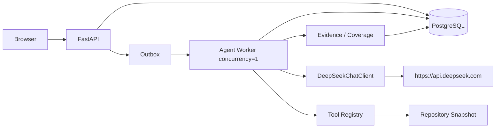

# PRD Agent DeepSeek LLM API Loop 接入设计

> 生效状态：**启用（ACTIVE）**
> 实施状态：核心同步链路已实现并通过真实API自测；异步Agent Worker与Model Attempt待实施
> 日期：2026-07-28
> 目标模型：`deepseek-v4-pro`，通过配置覆盖，不在业务代码中硬编码
> 配套测试：`2026-07-28-deepseek-api-loop-test-plan.md`
> 上位方案：`2026-07-27-server-deployment-remediation-design.md`
> 最新运行与队列上位设计：`2026-07-28-feishu-github-rag-queue-architecture-design.md`

## 0. 决策摘要

本轮采用以下方案：

1. 使用 DeepSeek 官方 OpenAI-compatible Chat Completions API。
2. 首版使用 `response_format={"type":"json_object"}`，由服务端 Pydantic 和 Tool Registry 做最终校验。
3. 不引入 LangChain；不把 Investigation 内层 Loop 改写为 LangGraph。
4. Loop 继续由 `InvestigationRunner` 控制，每轮最多一次 LLM 调用和一次工具执行。
5. staging/production 只能使用远程 API；缺少配置或 Key 时启动失败，不得降级到规则模型。
6. API Key 由部署人员最后手工写入 Secret 文件；仓库、环境示例、日志、数据库和测试报告不保存 Key。
7. 2核2GB环境只运行一个 `Agent Worker`，`concurrency=1`，不在本机推理模型。
8. 多用户并发不由进程内信号量单独控制；最终由PostgreSQL Run Admission、
   Queue Slot和公平调度控制，进程内信号量只作为第二道保护。

### 0.1 实施结果（2026-07-28）

已完成：

- `DeepSeekChatClient`、HTTPS Host allowlist、Secret 文件读取、超时、有限重试、连接池和单调用并发闸门。
- Workflow 的版本化 JSON Prompt、响应解析、一次同输入修复，以及多节点 section 覆盖校验。
- `ModelActionSelector` 驱动的模型→工具→结果回填→下一轮模型循环。
- 模型调用 Token、finish reason、输出 hash 和模型 ID 的脱敏 Step 审计。
- staging/production 缺少 LLM 配置时安全失败；local/test 未配置时保留离线规则模型。
- 生产 Compose 的 DeepSeek 配置和 Secret 文件挂载；当前仅 API 容器持有 Key。
- Mock 合同、两轮 Loop、故障注入、PostgreSQL/FastAPI 全链路和真实 DeepSeek 冒烟测试。

当前实现与最终目标架构有一个明确差异：模型调用暂时仍在 FastAPI 请求内同步执行，
由进程内 `BoundedSemaphore(1)` 限制并发。异步 Agent Worker、持久化 Model Attempt、
lease/fencing 恢复和 API 不持有 Key 尚未完成，因此该部分仍是服务器公网部署的 P0
阻断项，而不是本轮同步 API Loop 的功能缺陷。

DeepSeek 官方当前列出的模型标识包含 `deepseek-v4-pro`；标准 API 地址为
`https://api.deepseek.com`。上线前仍应通过 `/models` 预检确认当前账号可以访问该模型：

- https://api-docs.deepseek.com/updates/
- https://api-docs.deepseek.com/api/list-models

## 1. 实施前代码缺口

当前生产默认路径：

```text
FastAPI
→ WorkflowService
→ HeuristicWorkflowModel
```

当前调查路径：

```text
InvestigationRunner
→ RepositoryStructureSelector
→ 固定 repo_tree 动作
```

实施前已经具备但尚未完成的基础：

- `WorkflowModel` 和 `JsonWorkflowModelAdapter` 已存在。
- `ModelActionSelector` 已支持“调用模型、校验 ProposedAction、失败后修复一次”。
- `InvestigationRunner` 已支持迭代、Token、Tool、重复动作、无进展和取消上限。
- Investigation、Step、Evidence 和 Checkpoint 已可持久化。

本轮已补齐前三项和生产同步装配；以下两项仍留给异步 Worker 切片：

- Model Attempt 持久化和 Worker 恢复去重。
- API 只创建 Run/Outbox，模型调用只在 Agent Worker 执行。

## 2. 范围

### 2.1 本轮包含

- DeepSeek API 配置和 HTTP Client。
- Workflow 结构化生成调用。
- Investigation Action 选择调用。
- 应用控制的有界 Agent Loop。
- Key 文件、日志脱敏、网络出口和多用户隔离。
- Mock API、故障注入、两轮 Loop 和可选真实 API 自测。
- 2核2GB资源和并发约束。

### 2.2 本轮不包含

- LangChain `create_agent`。
- Investigation 内层 LangGraph 重写。
- DeepSeek Beta strict Tool Calls。
- 模型直接执行 shell、URL 或任意 MCP 工具。
- 浏览器直接调用 DeepSeek。
- API Key 管理后台。
- 本地大模型推理或多模型并行。
- 自动模型降级；模型不可用时保持可恢复失败或等待重试。

## 3. 目标架构



FastAPI 只创建 Run 和 Outbox，不持有 API Key，不执行模型调用。DeepSeek Client
只在 Agent Worker 内创建。Integration Worker 不调用模型。

## 4. 模型调用合同

### 4.1 公共接口

将当前仅服务 Eval 的 `ModelResponse` 移到生产可用的公共模型模块，避免生产代码反向依赖
`eval`：

```python
@dataclass(frozen=True)
class ModelResponse:
    output: str
    model_id: str
    token_usage: Mapping[str, int]
    finish_reason: str
    provider_request_id: str | None
    latency_ms: int


class ModelAdapter(Protocol):
    def complete(
        self,
        system_prompt: str,
        user_prompt: str,
        *,
        timeout_seconds: float,
        operation: str,
        attempt_key: str,
        user_id: str,
    ) -> ModelResponse: ...
```

`WorkflowModel` 不感知 DeepSeek；`JsonWorkflowModelAdapter` 继续负责：

- 把业务 operation 与 payload 编成版本化 Prompt。
- 要求只输出 JSON object。
- 解析 JSON。
- 返回 `StructuredModelResult`。

### 4.2 DeepSeek 请求

首版固定非流式请求：

```http
POST https://api.deepseek.com/chat/completions
Authorization: Bearer <secret>
Content-Type: application/json
```

概念请求体：

```json
{
  "model": "deepseek-v4-pro",
  "messages": [
    {
      "role": "system",
      "content": "只返回符合指定合同的 JSON 对象，不输出 Markdown 或私有推理。"
    },
    {
      "role": "user",
      "content": "<versioned operation payload and schema example>"
    }
  ],
  "response_format": {
    "type": "json_object"
  },
  "stream": false,
  "max_tokens": 4096,
  "user_id": "u_<opaque-hmac>",
  "thinking": {
    "type": "disabled"
  }
}
```

首版显式关闭 thinking mode，原因：

- 当前只需要结构化决策，不需要保存或回传 `reasoning_content`。
- 避免 Tool Call 多轮中遗漏 `reasoning_content` 导致 400。
- 降低延迟、输出不确定性和成本。
- 业务审计只记录公开动作与证据，不记录私有推理。

后续可以按 operation 单独评估是否启用 thinking，但不能改变结构化输出和服务端验证边界。

DeepSeek JSON Output 要求 Prompt 中明确包含 JSON 指令，并可能返回空 content；
空 content 必须按模型输出错误处理，不能视为成功：

- https://api-docs.deepseek.com/guides/json_mode
- https://api-docs.deepseek.com/guides/thinking_mode

### 4.3 为什么首版不用原生 Tool Calls

DeepSeek 支持 Tool Calls，但模型只负责提出工具参数，工具仍由应用执行。当前项目已经有：

- `ProposedAction`
- Tool Registry
- Tool Schema Version
- 权限和仓库快照边界
- 重复动作签名
- Tool Attempt 和 Evidence

首版让模型输出 `ProposedAction` JSON，可以直接复用现有安全边界，并保持 Provider
可替换。Beta strict Tool Calls 不作为生产依赖；后续只有在离线 Eval 证明其格式错误率和成本更优时才切换。

官方合同明确提醒 Tool Call arguments 仍可能不是合法 JSON或出现未定义参数，所以即使以后启用
Tool Calls，也不能删除服务端验证：

- https://api-docs.deepseek.com/api/create-chat-completion
- https://api-docs.deepseek.com/guides/tool_calls

## 5. Prompt 与结构化输出

### 5.1 Prompt Registry

新增版本化 Prompt Registry：

```text
extract_requirement_brief.deepseek.v1
generate_outline.deepseek.v1
generate_confirmation_unit.deepseek.v1
plan_information_need.deepseek.v1
select_investigation_action.deepseek.v1
replan_investigation_action.deepseek.v1
```

每个定义包含：

- system prompt；
- 输入字段白名单；
- 输出 JSON 示例；
- 对应 Pydantic 模型；
- 最大输入字节数；
- 最大输出 token；
- thinking policy；
- Prompt version。

Prompt 变化必须升级版本，并写入 Model Attempt。

### 5.2 Action 输出

调查动作继续使用：

```json
{
  "tool_id": "repo_tree",
  "tool_schema_version": "1",
  "arguments": {
    "prefix": "",
    "max_depth": 3
  },
  "purpose": "定位与目标功能相关的目录",
  "target_coverage": [
    "repository_structure"
  ]
}
```

服务端依次执行：

1. JSON object 解析。
2. `ProposedAction.model_validate`。
3. Tool ID 和 Schema Version 白名单。
4. Tool 参数 Schema。
5. Repository ID 与 resolved commit 由服务端注入，模型无权覆盖。
6. active coverage gap 校验。
7. action signature 重复校验。
8. Tool、Token、迭代和时间预算。

任一步骤失败都不得调用工具。

## 6. Agent Loop

### 6.1 每轮流程

```text
加载 Investigation + 当前版本
→ 检查取消、Coverage 和预算
→ 生成稳定 model_attempt_key
→ 短事务 claim Model Attempt
→ 事务外调用 DeepSeek
→ 短事务提交模型元数据与结构化结果
→ 校验 ProposedAction
→ 生成稳定 tool idempotency key
→ 事务外执行一个工具
→ 短事务提交 Tool Result、Evidence、Coverage、Step 和 Checkpoint
→ 判断终止条件
→ 下一轮
```

稳定键：

```text
model:{investigation_id}:{iteration}:{operation}:{input_hash}
tool:{investigation_id}:{action_signature}:attempt:1
```

### 6.2 下一轮上下文

当前 `_selector_payload` 已包含最近公开 Step，但只包含摘要。实施时补充受限的
`prior_tool_results`：

```json
[
  {
    "iteration": 1,
    "tool_id": "repo_tree",
    "status": "SUCCEEDED",
    "public_summary": "发现 src、tests 与 infra 目录",
    "coverage_updates": {
      "repository_structure": "COVERED"
    },
    "evidence_ids": ["evidence-..."]
  }
]
```

限制：

- 最多最近5轮。
- 只传递公开摘要、必要事实和内部 Evidence ID。
- 单条结果和总上下文均有字节上限。
- 不传 API Key、Access Token、数据库 DSN、用户邮箱或完整日志。
- 代码正文仅由已授权工具按固定上限读取。

### 6.3 终止条件

任一条件满足即结束：

- Coverage complete。
- `max_iterations=8`。
- Tool call budget。
- Run token budget。
- 连续2轮无进展。
- 同一动作重复。
- 用户取消。
- Worker 失去 lease/fencing。
- 不可恢复配置、认证或输出错误。

## 7. 配置与 API Key

### 7.1 配置

```text
PRD_AGENT_LLM_PROVIDER=deepseek
PRD_AGENT_LLM_BASE_URL=https://api.deepseek.com
PRD_AGENT_LLM_MODEL=deepseek-v4-pro
PRD_AGENT_LLM_API_KEY_FILE=/run/secrets/deepseek_api_key
PRD_AGENT_LLM_TIMEOUT_SECONDS=90
PRD_AGENT_LLM_CONNECT_TIMEOUT_SECONDS=5
PRD_AGENT_LLM_MAX_OUTPUT_TOKENS=4096
PRD_AGENT_LLM_MAX_ITERATIONS=8
PRD_AGENT_LLM_RUN_TOKEN_BUDGET=24000
PRD_AGENT_LLM_MAX_TRANSPORT_RETRIES=2
PRD_AGENT_LLM_ALLOWED_HOSTS=api.deepseek.com
```

`deepseek-v4-pro` 是部署默认值，但必须保留配置能力，以支持模型版本变化和 Staging
使用低成本模型。

### 7.2 Key 由部署人员手工写入

仓库只创建挂载约定，不创建 Key 文件：

```text
Host:
  infra/production/secrets/deepseek_api_key

Container:
  /run/secrets/deepseek_api_key
```

要求：

- `infra/production/secrets/` 已被 `.gitignore` 排除。
- Key 文件只包含一行 Key，不带引号和变量名。
- 文件权限建议 `0400`，归 Agent Worker 运行用户所有。
- Compose/Kubernetes 只把该 Secret 挂载给 Agent Worker。
- FastAPI、Web、Integration Worker、Maintenance 不挂载该 Key。
- Key 轮换后重启 Agent Worker；首版不实现进程内热更新。
- 配置对象的 `repr`、异常和日志不得包含 Key。

staging/production 只允许 `*_FILE`；不接受明文 `PRD_AGENT_LLM_API_KEY`。local
可以为开发便利保留环境变量，但自测文档统一使用文件，防止 Shell 历史泄露。

## 8. HTTP Client 与错误策略

建议使用 `httpx`，加入生产依赖，不使用完整 OpenAI SDK。原因：

- 当前只需要一个稳定端点和少量字段。
- 可以精确控制超时、连接池、日志和错误映射。
- 避免 Provider SDK 对未知字段和 thinking 参数的版本兼容差异。

2核2GB配置：

```text
max_connections=2
max_keepalive_connections=1
connect_timeout=5s
write_timeout=10s
read_timeout=90s
pool_timeout=5s
stream=false
```

错误分类：

| 情况 | 分类 | 行为 |
| --- | --- | --- |
| 400/404/422 | 配置或请求永久错误 | 不做传输重试；Run进入可诊断失败 |
| 401/403 | Key或权限错误 | 不重试；Readiness告警；不记录响应正文中的敏感字段 |
| 402 | 余额不足 | 不重试；暂停新模型任务并告警 |
| 408/429 | 临时错误 | 最多2次退避重试，尊重受限的 `Retry-After` |
| 500/502/503/504 | Provider临时错误 | 最多2次退避重试 |
| connect/read timeout | 结果未知 | 最多2次，记录同一 Attempt；计入调用预算 |
| `finish_reason=length` | 输出不完整 | 进入一次格式修复，不当作成功 |
| empty/invalid JSON | 模型输出错误 | 相同输入最多修复一次，不做无限循环 |
| content filter | 策略终止 | 不重试，返回稳定公开错误 |

退避建议：`1s + jitter`、`3s + jitter`，单次 `Retry-After` 最大30秒。DeepSeek
官方说明超限返回429，且长等待请求可能保持连接，因此客户端必须有自己的更短超时：

- https://api-docs.deepseek.com/quick_start/rate_limit
- https://api-docs.deepseek.com/quick_start/error_codes

## 9. 多用户、安全与隐私

### 9.1 多用户

- 全局 Agent 并发为1，避免2核2GB资源竞争。
- 每用户最多一个活动 Run，其他请求排队。
- Provider `user_id` 使用服务端 HMAC 生成：

```text
u_<HMAC(internal_secret, tenant_id + "\0" + owner_id)[:32]>
```

- 不向 Provider 发送邮箱、用户名、租户名称或其他直接标识。
- 不同用户的 Prompt、Checkpoint 和 Evidence 仍由 PostgreSQL owner/tenant 边界隔离。

### 9.2 Prompt Injection

仓库内容、历史 PRD 和工具结果全部视为不可信数据：

- 系统 Prompt 明确仓库内容只是证据，不是指令。
- 模型只能返回 `ProposedAction`。
- 模型输出不能修改 Repository ID、commit SHA、权限、预算或 Provider URL。
- Tool Registry 只暴露只读、参数受限工具。
- 路径穿越、符号链接和大文件限制继续由 Repository Reader 执行。
- 任何要求输出 Secret、执行 shell 或访问任意 URL 的动作均拒绝并审计。

### 9.3 日志

允许记录：

- provider、model_id、operation、prompt_version；
- attempt ID、request ID、input/output hash；
- token usage、latency、finish reason；
- 标准错误码和 retry count。

禁止记录：

- Authorization Header 和 API Key；
- 完整 Prompt、完整响应、代码正文；
- `reasoning_content`；
- Cookie、OIDC Token、数据库 DSN；
- 用户直接身份信息。

## 10. 持久化

新增 `model_attempts`：

```text
model_attempt_id
task_id / run_id / unit_id / investigation_id
iteration
operation
provider
configured_model_id
response_model_id
prompt_version
input_hash
output_hash
status: CLAIMED | CALLING | SUCCEEDED | FAILED_RETRYABLE | FAILED_PERMANENT
provider_request_id
finish_reason
prompt_tokens
completion_tokens
total_tokens
latency_ms
retry_count
error_code
lease_owner
fencing_token
created_at / updated_at
```

唯一约束：

```text
(run_id, operation, iteration, input_hash)
```

Model Attempt 只保存元数据和 hash；合法结构化输出由现有业务表和 Step 保存。调用 DeepSeek
期间不得保持数据库事务。

恢复规则：

- 已 `SUCCEEDED` 且 input hash 相同：复用结果，不再次调用。
- `CLAIMED/CALLING` 超时：由持有新 fencing token 的 Worker 核对并重新声明。
- 旧 Worker 返回后必须通过 fencing 条件提交；失败则丢弃，不覆盖新结果。
- Prompt version、模型或输入变化必须生成新的 Attempt。

## 11. 生产装配

环境策略：

```text
local:
  默认 HeuristicWorkflowModel
  显式设置 PRD_AGENT_LLM_PROVIDER=deepseek 时可调用真实 API

test:
  只允许 Fake/Mock Model
  禁止意外访问公网

staging/production:
  必须 provider=deepseek
  必须 HTTPS 和 allowed host
  必须存在 API_KEY_FILE
  必须使用 DeepSeekChatClient
  禁止回退 HeuristicWorkflowModel/RepositoryStructureSelector
```

生产构造：

```text
DeepSeekChatClient
→ JsonWorkflowModelAdapter
→ WorkflowService

DeepSeekChatClient
→ JsonWorkflowModelAdapter
→ ModelActionSelector
→ InvestigationRunner
```

## 12. 文件改动

新增：

- `src/prd_agent/model_api/models.py`
- `src/prd_agent/model_api/deepseek.py`
- `src/prd_agent/model_api/errors.py`
- `src/prd_agent/workflow/prompts.py`
- `src/prd_agent/production/model_attempts.py`
- `tests/model_api/test_deepseek_client.py`
- `tests/model_api/test_deepseek_contract.py`
- `tests/production/test_model_api_config.py`
- `tests/investigation/test_llm_api_loop.py`
- `tests/live/test_deepseek_smoke.py`
- 对应 PostgreSQL Expand Migration。

修改：

- `pyproject.toml`
- `src/prd_agent/production/config.py`
- `src/prd_agent/api/app.py`
- `src/prd_agent/workflow/model.py`
- `src/prd_agent/investigation/runner.py`
- `src/prd_agent/investigation/planner.py`
- `infra/production/docker-compose.yml`
- `.gitignore`，仅在需要补充 Secret 文件模式时修改。

## 13. 实施顺序

1. 定义公共 ModelResponse、错误类型和配置测试。
2. 用 MockTransport 实现 DeepSeek Client 合同。
3. 接入 `JsonWorkflowModelAdapter`，完成 JSON Output 和一次 repair。
4. 用 `ModelActionSelector` 替换生产固定 Selector。
5. 增加上轮 Tool Result 上下文和两轮 Loop 测试。
6. 增加 Model Attempt Migration、claim、恢复和 fencing。
7. 将调用迁移到 Agent Worker；API 只写 Outbox。
8. 增加 Secret 挂载与生产 fail-closed。
9. 运行离线全量测试和2核2GB Mock长稳。
10. 部署人员手工写入 Key 后运行 opt-in Live Smoke。

## 14. 验收标准

- production 默认路径真实调用 `deepseek-v4-pro`，不使用规则模型。
- 缺少 Key、错误 host、HTTP URL 或未知 provider 时启动失败。
- API Key 不出现在 Git diff、日志、数据库、Traceback 和测试报告。
- 两轮 Loop 中第二轮明确接收到第一轮工具结果。
- 非法 JSON、未知工具、越权参数、重复动作均不执行工具。
- 429/5xx/timeout 重试有界，401/402不重试。
- Worker kill 后不重复已成功提交的模型轮次或工具动作。
- 达到8轮、Token、Tool、无进展或取消上限时形成稳定终态。
- 2核2GB环境 Agent Worker concurrency=1，无 OOM 和持续 Swap。
- API Key 写入后，`/models` 和最小 JSON Output Live Smoke 通过。
