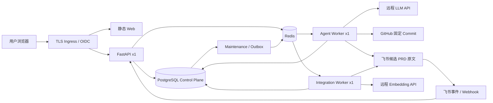
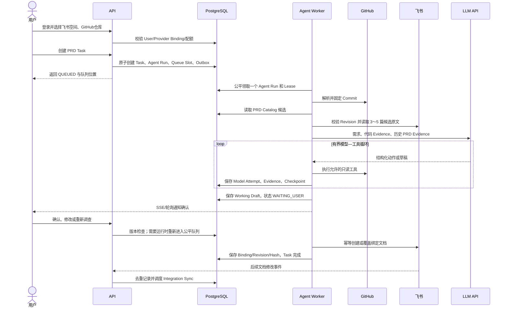
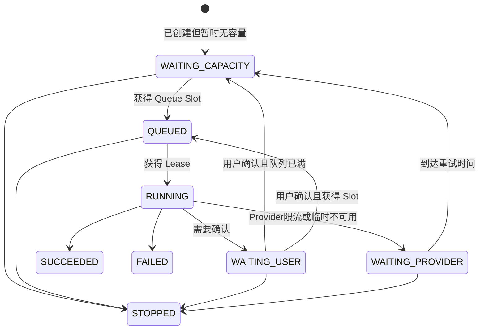

# PRD Agent 飞书/GitHub/RAG/受控多用户架构设计

> 生效状态：**启用（ACTIVE）**
> 实施状态：目标架构已确认；P0代码迁移与部署验收待完成
> 日期：2026-07-28
> 部署档位：单机 2 vCPU / 2GB RAM / 40GB SSD
> 内容权威源：飞书 PRD、GitHub 代码
> 计算方式：远程 LLM API，默认配置模型 `deepseek-v4-pro`
> Issue 系统：GitHub Issues
> 关联决策：`docs/adr/0001-external-systems-own-content.md`、`0002-remote-llm-only-in-production.md`、`0003-bounded-fair-queue-for-small-server.md`

## 0. 结论

本次更新把产品从“PostgreSQL 内保存完整历史 PRD，再生成后导出飞书”
调整为“飞书与 GitHub 提供原始内容，PostgreSQL 负责编排、检索目录和审计”。

最终约束如下：

1. 飞书保存 Published PRD 正文并承担协作、评论和修订历史。
2. GitHub 保存代码；每次 Agent Run 在开始调查时固定到一个不可变 Commit。
3. PostgreSQL 是 Control Plane 和检索目录，不是全部 PRD 正文的长期副本。
4. Redis 只承担可丢弃的 Broker、唤醒信号和短期缓存；Redis 清空后可由
   PostgreSQL 恢复。
5. 生产环境只调用远程 LLM API，不部署本地推理或本地 Embedding 模型。
6. Agent Loop 由应用代码控制，不引入 LangChain；当前规模也不需要用
   LangGraph 重写内层工具循环。
7. 2核2GB环境只允许一个 Agent Worker 同时执行，一个 Integration Worker
   同时同步或写飞书。
8. 多用户访问先经过 PostgreSQL 原子 Run Admission、用户配额和公平调度，
   不能仅依赖进程信号量或 Redis 队列长度。
9. RAG 先用轻量目录定位 3～5 篇候选 PRD，再从飞书读取候选原文，进行
   内存分块和二次排序。
10. RAG 默认事件驱动增量更新，定时校验兜底；排序显式考虑飞书最后修改时间，
    但不能让已废弃文档仅因最近被编辑而上升。

## 1. 产品边界与事实归属

| 信息 | 权威源 | PostgreSQL 保存内容 | Redis 保存内容 |
| --- | --- | --- | --- |
| Published PRD 正文 | 飞书 | Binding、Revision、Hash、Locator、短摘要 | 最近读取片段缓存 |
| PRD 协作与修订历史 | 飞书 | 同步游标、最新已见 Revision、审计 | 无 |
| 代码与分支 | GitHub | Repository Binding、固定 Commit、Evidence Locator | 可选短期读取缓存 |
| 用户、租户与权限 | PostgreSQL | 完整业务状态 | 无 |
| PRD Task 与 Agent Run | PostgreSQL | 完整业务状态、Checkpoint、预算 | 唤醒消息 |
| Working Draft | PostgreSQL，限期 | 活跃任务恢复所需版本 | 无 |
| RAG 目录 | PostgreSQL | 元数据、摘要、关键词、Embedding、Section Locator | 查询/片段缓存 |
| LLM 调用 | 远程 Provider | Model Attempt 元数据和必要恢复结果 | 无 |
| Issue 与研发流转 | GitHub Issues | 可选 Issue Binding | 无 |

“PostgreSQL 是业务事实来源”仅适用于本系统的编排状态；不能再被解释为
“PostgreSQL 拥有飞书正文或 GitHub 代码”。

## 2. 目标运行架构



常驻进程固定为：

- 1 个 API；
- 1 个 Agent Worker，`concurrency=1`；
- 1 个 Integration Worker，`concurrency=1`；
- 1 个合并后的 Maintenance 进程，负责 Outbox 发布、恢复扫描、同步调度和
  保留期清理；
- PostgreSQL、Redis、静态 Web 与 TLS/OIDC 入口。

首版不运行第二个 API、第二个 Agent Worker、本地模型、独立向量数据库或
独立全文搜索集群。

## 3. 完整产品流程



### 3.1 首次使用

1. OIDC 登录后只允许映射到 `ACTIVE` User。
2. 系统管理员启用用户；2核2GB档位最多启用 30 个用户。
3. 用户绑定一个或多个授权 GitHub Repository 和飞书空间/文档范围。
4. Provider Binding 必须包含最小授权范围和 `access_scope_hash`。
5. 未完成绑定时可以创建本地测试任务，但不能进入生产 Agent Run。

### 3.2 创建与排队

创建 Task 的同一数据库事务必须完成：

1. 验证 User 状态和小时/日用量；
2. 锁定该用户与全局 Admission 计数；
3. 检查每用户 Open Run、Runnable Run 和全局队列上限；
4. 创建 PRD Task、Agent Run、Queue Slot；
5. 写入 Outbox；
6. 提交后立即返回，不在 HTTP 请求中调用模型、GitHub 或飞书。

### 3.3 调查与生成

Agent Worker 只按 `run_id` 恢复：

1. 获得 Lease 和 Fencing Token；
2. 解析 Repository Snapshot；
3. 执行 RAG 定位并获取飞书原文；
4. 调用远程 LLM；
5. 执行允许列表中的只读工具；
6. 保存 Evidence、Model Attempt、预算和 Checkpoint；
7. 达到确认点时释放执行 Lease，进入 `WAITING_USER`；
8. 达到完成点时创建飞书写入 Intent，由 Integration Worker 执行。

### 3.4 用户确认

`WAITING_USER` 不占 Agent Worker，也不占全局 Runnable Queue Slot，但仍计入
每用户 2 个 Open Run 上限。用户提交确认后：

- 有容量时原子创建新 Queue Slot 并进入 `QUEUED`；
- 无容量时进入 `WAITING_CAPACITY`，由 Maintenance 按公平顺序补位；
- 重复确认通过命令幂等记录返回同一结果；
- 旧 Task Version 的确认返回冲突，不覆盖新版本。

### 3.5 发布与后续更新

1. 只有已确认的当前 Working Draft 能创建 Feishu Export Intent。
2. 首次发布创建或绑定飞书文档，后续只覆盖同一 Provider Binding。
3. 写入成功后保存 Provider Revision、内容 Hash 和修改时间。
4. 超时且无法判定结果时进入 `RESULT_UNKNOWN`，禁止自动重复创建。
5. 飞书中的后续人工编辑通过事件驱动 Integration Sync 更新 PRD Catalog。

## 4. 受控多用户队列

### 4.1 2核2GB默认限额

| 配置 | 默认值 | 作用 |
| --- | ---: | --- |
| `MAX_ACTIVE_USERS` | 30 | 可启用账户上限 |
| `MAX_OPEN_RUNS_PER_USER` | 2 | 包含排队、执行、等待用户和等待 Provider |
| `MAX_RUNNABLE_RUNS_PER_USER` | 1 | 防止单用户连续占满队列 |
| `MAX_GLOBAL_RUNNABLE_QUEUE` | 30 | 数据库中已获 Queue Slot 的上限 |
| `AGENT_WORKER_CONCURRENCY` | 1 | 同时运行的模型/工具 Loop |
| `INTEGRATION_WORKER_CONCURRENCY` | 1 | 同时进行的飞书/GitHub同步或写入 |
| `NEW_RUNS_PER_USER_PER_DAY` | 20 | 防止误操作和成本失控 |
| `RAG_QUERIES_PER_USER_PER_HOUR` | 60 | 限制交互式查询 |
| `MAX_MODEL_ATTEMPTS_PER_RUN` | 12 | Loop 硬预算 |
| `MAX_TOOL_CALLS_PER_RUN` | 20 | 工具硬预算 |

这些是首版保守默认值。`MAX_GLOBAL_RUNNABLE_QUEUE` 可以配置到 50，但在
观测到 P95 排队时间、数据库负载和 LLM 成本前不提高 Worker 并发。

### 4.2 公平调度

调度采用“用户轮转 + 用户内 FIFO”：

1. 只扫描具有有效 Queue Slot、状态为 `QUEUED` 或 `WAITING_CAPACITY` 的 Run。
2. 每个用户取最早一个 Run。
3. 按该用户上次获得执行机会的时间排序。
4. 使用 `FOR UPDATE SKIP LOCKED` 领取一条。
5. 成功领取后更新用户调度游标、Run Lease 和 Fencing Token。

该策略比全局 FIFO 多一个很小的索引与事务成本，但能防止一个用户连续提交
30 条任务导致其他用户长期饥饿。

### 4.3 状态机



Queue Slot 在 `RUNNING`、`WAITING_PROVIDER`、终态或转入 `WAITING_USER` 时按
策略释放。`WAITING_PROVIDER` 使用独立的延时重试记录，不长期占用 Runnable
容量。

### 4.4 故障语义

- Redis 消息丢失：Maintenance 根据 PostgreSQL 中已获得 Slot 但无有效
  Outbox/Lease 的 Run 重建唤醒消息。
- Worker 进程退出：Lease 到期后使用新 Fencing Token 恢复。
- 重复 Celery 消息：Inbox 和 Run Lease 使第二次消费无副作用。
- PostgreSQL 不可用：拒绝新写入，不能先调用外部 Provider 再补记录。
- LLM 限流：按 `Retry-After` 或指数退避进入 `WAITING_PROVIDER`。
- 用户取消与结果提交竞争：只有持有当前 Fencing Token 的事务可以提交结果。

## 5. RAG：目录定位后读取飞书原文

### 5.1 为什么不长期保存全部正文

仅从容量看，1万篇、平均50KB的 PRD 当前正文约为500MB，并不会立即压满
40GB SSD；真正的问题是：

- 保存每次历史版本后增长会持续放大；
- 飞书与数据库形成两份可编辑正文，出现权威冲突；
- 权限撤销、删除和修订同步更难证明一致；
- PostgreSQL 备份、恢复和索引膨胀不必要地增加；
- 大量正文并不需要在每次查询中参与精排。

因此本设计不是因为“数据库绝对放不下”，而是为了降低双写一致性、权限和
长期运维成本。

### 5.2 两阶段检索


目录召回使用：

- 标题、产品标签、状态、短摘要和关键词的 PostgreSQL 全文检索；
- 文档级 Embedding，相似度由 pgvector 或可替换的远程检索实现提供；
- Section Locator 和可选 Section Embedding；
- 飞书 `modified_time`、Revision、新旧状态和业务优先级。

原文阶段只读取 Top 3～5 文档。单文档超过大小上限时优先按 Section Locator
读取；Provider 不支持局部读取时读取全文后在进程内分块，单次总原文预算和
模型上下文预算仍必须受限。

### 5.3 排序公式

默认通用查询：

```text
score =
    0.45 * semantic_score
  + 0.25 * keyword_score
  + 0.15 * recency_score
  + 0.10 * business_priority_score
  + 0.05 * source_quality_score
```

其中：

```text
recency_score = exp(-ln(2) * age_days / half_life_days)
```

- 通用查询 `half_life_days=180`；
- 包含“当前、最新、现行”等意图时，修改时间权重提高到 25%～35%，
  半衰期改为 60～90 天；
- 包含“历史、当时、最初版本”等意图时，修改时间权重设为 0；
- `modified_time` 必须来自飞书，不使用本地 `synced_at`；
- `ARCHIVED` 和 `DEPRECATED` 先由状态降权或过滤，不能因最近补充废弃说明
  而获得高排名；
- 权限过滤必须在召回前完成，不能先检索再隐藏结果。

目录默认取 Top 20，文档级选择 Top 3～5，原文二次排序最多向 Agent Loop
提供 5～8 个片段。所有分数、权重、Index Version、Revision 和结果顺序写入
Retrieval Run，便于离线评测。

### 5.4 更新频率

默认采用事件驱动增量更新：

1. 飞书文档变更事件进入 Provider Webhook Inbox。
2. 同一文档 1～3 分钟 Debounce，只保留最新 Revision。
3. Integration Worker 更新元数据、摘要、Locator 和 Embedding。
4. 新 Index Version 构建完成后原子切换。
5. 删除相应 Redis 片段缓存。

兜底策略：

| 类型 | 目标 |
| --- | --- |
| 活跃文档新鲜度 | 5分钟内 |
| 普通文档新鲜度 | 30分钟内 |
| Revision 对账 | 每30～60分钟 |
| 全量一致性扫描 | 每日一次，低峰执行 |
| 冷文档 | 命中时按需检查 Revision |
| 查询前快速校验 | Index 记录超过5～15分钟时比较 Provider Revision |

单 Integration Worker 每批处理 10～50 个变更文档。同一文档只允许一个未完成
Integration Sync；连续编辑折叠到最新 Revision，避免重复生成摘要和 Embedding。

### 5.5 缓存

Redis 可以缓存最近读取的文档片段：

- TTL 1～24 小时，按访问热度决定；
- Key 包含 Tenant、Document、Revision 和 Section Locator Hash；
- 飞书 Revision 变化立即失效；
- 缓存值不参与权威判断；
- Redis 清空只降低性能，不改变检索结果可恢复性。

## 6. SQL 作用重构

### 6.1 保留

以下表继续承担 Control Plane：

- `tenants`、`users`、`user_identities`；
- `prd_tasks`、`agent_runs`、`production_run_control`；
- `task_messages`、`requirement_brief_versions`、`outline_versions`、
  `outline_nodes`、`confirmation_units`；
- `workflow_checkpoints`、`domain_events`；
- `information_needs`、`investigations`、`investigation_steps`、
  `tool_calls`、`source_evidence`、`verified_facts`、`grounding_results`；
- `external_connections`、`remote_repository_bindings`、
  `repository_snapshots`；
- `export_intents`、`export_runs`、`integration_call_attempts`；
- `outbox_messages`、`inbox_receipts`、`command_idempotency`、
  `provider_webhook_deliveries`、`audit_events`。

Evidence、Tool Result 和 Checkpoint 中的大文本也需要保留期，不应无限累积。

### 6.2 转换

| 当前结构 | 目标结构 | 处理 |
| --- | --- | --- |
| `external_document_bindings` | Feishu Provider Binding | 增加 Revision、modified time、sync status、document hash |
| `historical_prd_documents` | `prd_catalog_entries` | 保留身份、权限、标题、标签、状态和摘要 |
| `historical_prd_versions` | `prd_source_revisions` | 去掉长期 `markdown`，保留 Revision/Hash/时间 |
| `historical_prd_chunks` | `prd_section_locators` | 去掉长期完整 `content`，保留定位、Hash、短 Preview |
| `historical_corpora` | `prd_retrieval_index_versions` | 从离线 Corpus 改为可原子切换的在线 Index Version |
| `historical_corpus_*` | Index membership | Expand 阶段兼容读，迁移后退役 |
| `retrieval_hits` | 文档或 Section Hit | 支持各子分数、modified time 和 Provider Revision |
| `prd_document_versions` | Working Draft Version | 仅为活跃流程和短期恢复保留 |
| `prd_section_versions` | Working Draft Section | 仅为活跃流程和短期恢复保留 |

### 6.3 新增表草案

DDL 仅表示目标合同；实施时使用 Expand → Backfill → Dual-read → Contract：

```sql
CREATE TABLE prd_catalog_entries (
    catalog_entry_id TEXT PRIMARY KEY,
    tenant_id TEXT NOT NULL REFERENCES tenants(tenant_id),
    owner_id TEXT NOT NULL REFERENCES users(user_id),
    connection_id TEXT NOT NULL REFERENCES external_connections(connection_id),
    provider_document_id_ciphertext TEXT NOT NULL,
    safe_url TEXT NOT NULL,
    title TEXT NOT NULL,
    summary TEXT NOT NULL DEFAULT '',
    keywords TEXT[] NOT NULL DEFAULT '{}',
    product_tags TEXT[] NOT NULL DEFAULT '{}',
    access_scope_hash TEXT NOT NULL,
    lifecycle_status TEXT NOT NULL,
    provider_revision TEXT NOT NULL,
    provider_modified_at TIMESTAMPTZ NOT NULL,
    content_hash TEXT,
    sync_status TEXT NOT NULL,
    active_index_version TEXT,
    created_at TIMESTAMPTZ NOT NULL,
    updated_at TIMESTAMPTZ NOT NULL,
    UNIQUE (tenant_id, connection_id, provider_document_id_ciphertext)
);

CREATE TABLE prd_source_revisions (
    source_revision_id TEXT PRIMARY KEY,
    catalog_entry_id TEXT NOT NULL REFERENCES prd_catalog_entries(catalog_entry_id),
    provider_revision TEXT NOT NULL,
    provider_modified_at TIMESTAMPTZ NOT NULL,
    content_hash TEXT NOT NULL,
    observed_at TIMESTAMPTZ NOT NULL,
    metadata_json JSONB NOT NULL DEFAULT '{}'::jsonb,
    UNIQUE (catalog_entry_id, provider_revision)
);

CREATE TABLE prd_section_locators (
    locator_id TEXT PRIMARY KEY,
    source_revision_id TEXT NOT NULL REFERENCES prd_source_revisions(source_revision_id),
    section_path TEXT[] NOT NULL DEFAULT '{}',
    provider_block_start TEXT,
    provider_block_end TEXT,
    ordinal INTEGER NOT NULL,
    content_hash TEXT NOT NULL,
    preview TEXT NOT NULL CHECK (length(preview) <= 320),
    token_count INTEGER NOT NULL,
    UNIQUE (source_revision_id, ordinal)
);

CREATE TABLE prd_retrieval_index_versions (
    index_version_id TEXT PRIMARY KEY,
    tenant_id TEXT NOT NULL REFERENCES tenants(tenant_id),
    status TEXT NOT NULL,
    embedding_model_id TEXT,
    ranking_profile_version TEXT NOT NULL,
    created_at TIMESTAMPTZ NOT NULL,
    activated_at TIMESTAMPTZ
);

CREATE TABLE prd_document_embeddings (
    index_version_id TEXT NOT NULL
        REFERENCES prd_retrieval_index_versions(index_version_id),
    catalog_entry_id TEXT NOT NULL REFERENCES prd_catalog_entries(catalog_entry_id),
    embedding VECTOR,
    embedding_hash TEXT NOT NULL,
    PRIMARY KEY (index_version_id, catalog_entry_id)
);

CREATE TABLE integration_syncs (
    sync_id TEXT PRIMARY KEY,
    tenant_id TEXT NOT NULL REFERENCES tenants(tenant_id),
    catalog_entry_id TEXT NOT NULL REFERENCES prd_catalog_entries(catalog_entry_id),
    requested_revision TEXT NOT NULL,
    status TEXT NOT NULL,
    available_at TIMESTAMPTZ NOT NULL,
    attempt_count INTEGER NOT NULL DEFAULT 0,
    lease_owner TEXT,
    lease_expires_at TIMESTAMPTZ,
    created_at TIMESTAMPTZ NOT NULL,
    updated_at TIMESTAMPTZ NOT NULL
);

CREATE UNIQUE INDEX uq_integration_sync_pending_document
    ON integration_syncs(catalog_entry_id)
    WHERE status IN ('PENDING', 'RUNNING', 'RETRY_SCHEDULED');

CREATE TABLE queue_slots (
    slot_id TEXT PRIMARY KEY,
    tenant_id TEXT NOT NULL REFERENCES tenants(tenant_id),
    owner_id TEXT NOT NULL REFERENCES users(user_id),
    run_id TEXT NOT NULL UNIQUE REFERENCES production_run_control(run_id),
    state TEXT NOT NULL,
    admitted_at TIMESTAMPTZ NOT NULL,
    released_at TIMESTAMPTZ
);

CREATE TABLE user_usage_windows (
    tenant_id TEXT NOT NULL REFERENCES tenants(tenant_id),
    owner_id TEXT NOT NULL REFERENCES users(user_id),
    window_kind TEXT NOT NULL,
    window_start TIMESTAMPTZ NOT NULL,
    amount INTEGER NOT NULL,
    PRIMARY KEY (tenant_id, owner_id, window_kind, window_start)
);

CREATE TABLE model_attempts (
    model_attempt_id TEXT PRIMARY KEY,
    run_id TEXT NOT NULL REFERENCES production_run_control(run_id),
    step_key TEXT NOT NULL,
    attempt INTEGER NOT NULL,
    provider TEXT NOT NULL,
    model_id TEXT NOT NULL,
    request_hash TEXT NOT NULL,
    response_hash TEXT,
    status TEXT NOT NULL,
    input_tokens INTEGER,
    output_tokens INTEGER,
    finish_reason TEXT,
    error_code TEXT,
    available_at TIMESTAMPTZ,
    created_at TIMESTAMPTZ NOT NULL,
    completed_at TIMESTAMPTZ,
    UNIQUE (run_id, step_key, attempt)
);
```

`VECTOR` 的实际维度必须从选定 Embedding Provider 固定，不在通用设计里猜测。
如果首版暂不启用 pgvector，`embedding` 可以由外部检索 Adapter 管理，但
PostgreSQL 仍保存模型 ID、Hash 和 Index Version。

### 6.4 保留期

| 数据 | 默认保留 |
| --- | --- |
| PRD Catalog、当前 Revision、Binding | Binding 有效期间 |
| 历史 PRD Source Revision 元数据 | 180天或最近20个 Revision |
| Working Draft 正文 | Task 完成后30天 |
| Section Preview | 当前 Revision；最多320字符 |
| Retrieval Run/Hit | 90天 |
| Model Attempt 元数据 | 90天 |
| Provider 原始响应 | 默认不保存 |
| Tool/Evidence 大文本 | Task 完成后90天，保留 Hash/Locator |
| Audit Event | 365天 |
| Redis 文档片段 | 1～24小时 |

删除或权限撤销后，正文缓存立即失效；目录记录转为不可检索状态，审计仅保留
不含正文的最小元数据。

## 7. LLM API 与 Loop

### 7.1 是否需要 LangChain 或 LangGraph

当前不需要：

- 已有 `WorkflowModel`、`DeepSeekChatClient`、`ModelActionSelector` 和
  `InvestigationRunner`；
- Loop 规则明确，只有模型决策、允许工具、结果回填、停止与预算；
- 引入 LangChain 会增加内存、依赖、回调和错误语义，不会解决持久化与公平队列；
- LangGraph 可用于更大规模的跨阶段可视化编排，但当前 Checkpoint 和状态机已经
  存在，重写风险高于收益。

保留现有应用控制 Loop：

```text
恢复 Checkpoint
→ 建立受限 Context
→ 调用 LLM API
→ 校验结构化动作
→ 执行一个允许工具
→ 保存 Model Attempt / Evidence / Checkpoint
→ 判断停止、确认、重试或下一轮
```

### 7.2 生产模型策略

- 模型 ID 由 `PRD_AGENT_LLM_MODEL` 配置，当前值为 `deepseek-v4-pro`；
- 启动时调用 Provider 模型列表或最小请求验证账号可访问；
- API Key 由部署人员写入 Secret 文件；
- 生产缺失配置时 Readiness 失败；
- Provider 不可用时进入可恢复状态，不切换本地模型；
- 本地确定性模型仅服务于单测、离线 Eval 和开发演示。

### 7.3 Model Attempt

每次远程调用在发送前先持久化 `PENDING` Model Attempt，稳定幂等键为：

```text
run_id + graph_version + step_key + prompt_version + context_hash + attempt
```

调用完成后保存状态、模型 ID、Token、Finish Reason、响应 Hash 和必要的结构化
结果。Worker 崩溃后：

- Provider 明确未接收：安全重试；
- 已收到确定失败：按策略重试；
- 结果未知：使用同一幂等语义核对；Provider 不支持时转人工或受控重试，
  不能假定 exactly-once。

## 8. 2核2GB/40GB容量预算

### 8.1 内存目标

| 进程 | 目标上限 |
| --- | ---: |
| PostgreSQL | 450～550MB |
| Redis | 128MB，`maxmemory-policy allkeys-lru` 仅用于缓存；Broker另设保留 |
| FastAPI | 220～300MB |
| Agent Worker | 300～400MB |
| Integration Worker | 220～300MB |
| Maintenance | 100～150MB |
| Ingress/静态 Web/OIDC | 150～220MB |
| OS 与突发余量 | 至少300MB |

需要通过容器 Limit 和实际 RSS 验证，不能只相加配置值。若总量接近2GB，优先
合并 Maintenance、降低 PostgreSQL连接与缓存，不增加 Swap 依赖。

### 8.2 PostgreSQL与连接

- API 池最大 4；
- Agent Worker 最大 2；
- Integration Worker 最大 2；
- Maintenance 最大 1；
- 总应用连接目标不超过 9；
- 长 LLM/飞书/GitHub HTTP 调用期间不持有数据库事务；
- `statement_timeout`、`lock_timeout` 和连接等待超时必须显式设置。

### 8.3 磁盘目标

| 用途 | 预算 |
| --- | ---: |
| PostgreSQL 数据和索引 | 8～12GB |
| WAL 峰值 | 4GB |
| Redis AOF/RDB | 1GB以内 |
| 容器镜像 | 5～7GB |
| 日志 | 2GB，轮转 |
| 临时缓存 | 3GB以内 |
| OS与安全余量 | 至少10GB |

数据库备份必须发送到另一台机器或对象存储；同一块40GB SSD上的副本不算灾备。

## 9. GitHub Issues 与研发流程

使用以下标签驱动实现：

- `needs-triage`
- `needs-info`
- `ready-for-agent`
- `ready-for-human`
- `wontfix`

实施 Issue 按独立纵向切片拆分，每个 Issue 必须包含：

- 用户可见结果；
- 数据迁移范围；
- 幂等、并发和故障语义；
- 单元、PostgreSQL集成、Provider Fake 和端到端验收；
- 回滚与兼容窗口。

## 10. 实施顺序

### P0：部署前

1. 实现 `queue_slots`、用量窗口和公平 Run Admission。
2. 把模型调用从 FastAPI 移到 Agent Worker，并持久化 Model Attempt。
3. 补齐 `WAITING_CAPACITY`、`WAITING_PROVIDER` 和恢复调度。
4. 把飞书写入与同步放入 Integration Worker。
5. 建立 PRD Catalog、Source Revision 和 Section Locator。
6. 接收飞书变更事件，完成去重、Debounce 和 Revision 对账。
7. 实现目录 Top 20 → 飞书 Top 3～5 → 片段 Top 5～8 的 RAG 链路。
8. 完成静态 Web、OIDC、TLS、限流、备份与最小观测部署。

### P1：小流量后

1. 增加文档/Section Embedding 与排名 Ablation。
2. 增加自动权重选择和 Query Intent 分类。
3. 增加 PRD Catalog 管理、同步状态和人工重建界面。
4. 将旧 Historical Corpus 数据 Backfill 到新目录，关闭旧写入。
5. 根据数据保留期清理 Working Draft 和旧正文副本。

### P2：规模增长后

只有当监控证明单机瓶颈后才考虑：

- PostgreSQL/Redis 独立主机；
- 多 Agent Worker；
- 专用向量检索；
- 多 API 副本；
- 更复杂的 LangGraph 外层编排；
- 多模型路由。

## 11. 迁移策略

禁止直接删除现有历史表或正文列：

1. **Expand**：新增目录、Revision、Locator、Queue Slot 和 Model Attempt 表。
2. **Backfill**：从现有 Historical Corpus 生成目录和 Locator；来源可核对时绑定
   飞书 Revision。
3. **Dual-read**：新链路优先，未迁移数据临时回退旧 Corpus，并记录命中率。
4. **Cutover**：停止把新飞书正文永久写入旧 `markdown/content` 列。
5. **Retention**：等待30～90天兼容窗口和备份验证。
6. **Contract**：删除旧正文和 Corpus membership 依赖，保留必要审计 Hash。

回滚只切换 Read Path 和 Active Index Version，不回滚已确认的飞书正文。

## 12. 验收标准

### 12.1 功能

- 用户可完成登录、绑定、创建、排队、调查、确认、发布和再次检索完整流程。
- 发布后飞书是唯一 Published PRD 正文；数据库删除 Working Draft 后仍能通过
  Binding 访问原文。
- GitHub Evidence 全部指向固定 Commit。
- RAG 命中展示飞书标题、修改时间、Revision、Section 和安全链接。

### 12.2 多用户与可靠性

- 30个启用用户中，10个用户并发提交时，全局只有1个 Agent Run 执行。
- 单用户提交大量任务不能让其他用户永久饥饿。
- 超过每用户/全局限额返回明确的可重试错误和建议时间。
- Redis 清空、Worker Kill、重复消息、LLM 429/5xx、飞书超时后均能从
  PostgreSQL恢复，不重复发布。
- 等待用户确认24小时不占 Worker。

### 12.3 RAG

- ACL 在检索前生效，跨用户/租户正文泄露为0。
- 修改时间改变会按 Ranking Profile 改变排序；历史意图不受最近修改时间误导。
- 活跃文档更新在5分钟目标内可检索，普通文档30分钟内可检索。
- 目录过期时只刷新变化文档，不触发全库重建。
- 飞书不可用时明确显示来源暂不可读，不用旧缓存伪装最新原文。

### 12.4 资源

- 2核2GB环境24小时长稳，无持续 Swap 和 OOM。
- Agent Worker `concurrency=1`，Integration Worker `concurrency=1`。
- PostgreSQL应用连接不超过预算，P95 API短命令不被长模型调用阻塞。
- 40GB磁盘在日志轮转、WAL上限和保留期下保持至少25%空闲。

## 13. 当前代码与目标差距

当前代码已有可复用基础：

- `src/prd_agent/model_api/deepseek.py`：远程模型 Adapter；
- `src/prd_agent/investigation/runner.py`：有界 Loop；
- `src/prd_agent/production/dispatch.py` 与 `postgres_dispatch.py`：Outbox、
  Lease、Fencing、Inbox；
- `src/prd_agent/production/queueing.py`：Redis/Celery JSON Broker；
- `src/prd_agent/repository/remote/github.py`：GitHub固定 Commit读取；
- `src/prd_agent/export/feishu.py`：飞书创建、覆盖和读取；
- `src/prd_agent/historical/*`：分块、关键词检索、Retrieval Trace 与 Grounding。

主要缺口：

1. `historical_prd_versions.markdown` 和 `historical_prd_chunks.content` 仍将完整正文
   长期写入 PostgreSQL。
2. `HistoricalPrdRetriever` 面向固定离线 Corpus，而不是飞书在线目录与按需原文。
3. `external_document_bindings` 主要服务导出，缺少完整 PRD Source Revision 和
   同步状态。
4. `production_run_control` 没有 Queue Slot、用户配额、公平调度和
   `WAITING_CAPACITY/WAITING_PROVIDER`。
5. Celery Broker 已有，但真实 Agent/Integration Worker 装配仍未闭环。
6. 模型调用已可用，但当前生产同步路径仍可能在 API 请求中运行。
7. `integration_call_attempts` 可复用，但缺少按文档合并的 Integration Sync。
8. 当前 Schema 需要在实施前通过真实空库迁移测试，避免重复列、重复表定义等
   合并期问题进入生产。

其中已有一个明确 P0：`infra/local/schema.sql` 两次声明
`repository_snapshots`，第一套字段用于本地 Evidence Snapshot
（`repository_id`、`allowed_prefix`），第二套字段用于远程 Provider Binding
（`binding_id`、`resolved_from_ref`）。`CREATE TABLE IF NOT EXISTS` 会使第二个
定义静默失效。GitHub 生产切换前必须通过 Expand Migration 将其拆为
`code_evidence_snapshots` 与 `remote_repository_snapshots`，或迁移成一个兼容
两类 Locator 的统一模型；不能继续复用同一表名。

本设计完成的是目标合同与迁移顺序；只有 P0 代码切片和第12节验收全部通过后，
才能宣告服务器部署就绪。
