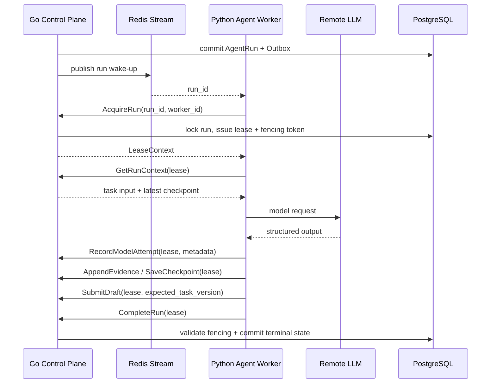

# Go 迁移 Step 2：Agent Execution Seam 设计方案

> 状态：IMPLEMENTED（核心垂直切片；生产切流门禁待完成）
> 日期：2026-07-28
> 前置 Step：Go Control Plane 基础垂直切片
> 目标：将 Python Agent 从公共后端中抽离为无状态、无数据库写权限的 Agent Worker
> 数据访问：`pgxpool` + 显式 SQL；不引入 GORM

## 1. Step 2 定义

Step 2 不再扩展 Python FastAPI，也不实现 Provider Gateway。它只建立一条可恢复的 Agent 执行边界：

```text
Go Outbox
  → Redis Stream wake-up
  → Python Agent Worker
  → AgentExecutionService gRPC
  → Go Lease / Checkpoint / Evidence / Draft
  → Go Run 状态机
```

Go 继续拥有所有业务事实和运行权限；Python 只拥有 Agent 决策、模型调用、RAG 策略、工具选择和内容生成。

完成 Step 2 后，Python Worker 应能够在不连接 PostgreSQL、不暴露公网 HTTP、不持有用户 JWT 或 Provider Credential 的条件下，完成一次最小 Agent Run：

```text
消费 run wake-up
  → AcquireRun
  → 获取 AgentRunInput / checkpoint
  → 执行一次 Agent Loop
  → 上报 ModelAttempt
  → 保存 checkpoint
  → 提交 Draft Patch
  → CompleteRun 或 FailRun
```

## 2. 当前基线与问题

### 2.1 已有实现

当前仓库已有：

- `backend-go/internal/runcontrol`：Task/Run、Admission、Lease、Heartbeat、Fencing；
- `backend-go/internal/agentexec/service.go`：Go-owned 的应用服务 seam；
- `contracts/proto/agent/v1/agent_execution.proto`：Agent Execution 初版协议；
- `contracts/proto/agent/v1/capability_gateway.proto`：Capability Gateway 协议草案；
- PostgreSQL Outbox + Redis Stream wake-up；
- `backend-go/cmd/maintenance`：容量提升和 Outbox 发布。

### 2.2 当前缺口

1. Protobuf 尚未生成 Go/Python bindings。
2. Go 应用服务尚未接入真实 gRPC server。
3. Python 仍依赖 FastAPI、请求生命周期和旧的直接存储路径。
4. Checkpoint、Model Attempt、Evidence、Draft Patch 尚未形成 Go-owned 持久化接口。
5. Worker 崩溃、租约过期、重复提交和 stale fencing token 尚未有跨语言测试。

## 3. 目标架构



### 3.1 进程职责

| 进程 | 允许做什么 | 禁止做什么 |
| --- | --- | --- |
| Go API | 创建 Task、查询状态、用户命令 | 调用 LLM 或复制 Agent Prompt |
| Go Agent RPC | 发放租约、校验 fencing、持久化 Agent 结果 | 解释模型语义、生成 PRD 内容 |
| Go Maintenance | 发布 Outbox、提升队列、恢复过期 Run | 执行 Agent Loop |
| Python Worker | 读取 Run 输入、调用模型、生成结果 | 直接写 PostgreSQL、Feishu、GitHub |
| Redis Stream | 唤醒 Worker | 作为 Run 事实源 |
| PostgreSQL | 保存控制面事实、结果元数据和版本 | 保存完整长期 Published PRD 正文 |

### 3.2 数据所有权

Go 独占写入：

- `go_agent_runs`；
- `go_queue_slots`；
- `go_run_checkpoints`；
- `go_model_attempts`；
- `go_evidence`；
- `go_working_draft_versions`；
- `go_outbox_messages`；
- `go_command_idempotency`。

Python 只保留进程内 Agent State，并通过 gRPC 提交脱敏、版本化结果。

## 4. AgentExecutionService 接口

Protobuf 是唯一跨语言来源。生成代码放入构建目录，不手工编辑生成文件：

```text
contracts/proto/agent/v1/agent_execution.proto
  → Go generated client/server
  → Python generated client
```

### 4.1 RPC 语义

| RPC | 调用者 | Go 行为 | 幂等/失败语义 |
| --- | --- | --- | --- |
| `AcquireRun` | Python | 锁定可运行 Run，签发 Lease 和 fencing token | 活跃租约返回 `LEASE_HELD`；过期租约可接管 |
| `GetRunContext` | Python | 校验 Lease，返回任务输入和最新 checkpoint | stale lease 拒绝；不返回 Provider Secret |
| `Heartbeat` | Python | 延长当前 Lease | 仅当前 lease/fencing 可续租 |
| `RecordModelAttempt` | Python | 保存模型调用 metadata | `attempt_key` 幂等；不保存 API Key/完整 Prompt |
| `AppendEvidence` | Python | 校验并追加结构化 Evidence | 重复 evidence 去重；来源权限由 Go 校验 |
| `SaveCheckpoint` | Python | 按 sequence 保存最新 Agent State | sequence 必须递增；旧 sequence 拒绝 |
| `SubmitDraft` | Python | 进行 Task 乐观锁校验并保存 Draft Patch | 版本冲突返回 `TASK_VERSION_CONFLICT` |
| `CompleteRun` | Python | Lease 校验后进入 `SUCCEEDED` | 只允许当前 Run 终态化 |
| `FailRun` | Python | Lease 校验后进入 `FAILED` 或排入恢复 | 失败原因分类；不可由 Worker 自行重试状态 |

### 4.2 请求元数据

每次 RPC 必须携带：

```text
contract_version
request_id
correlation_id
run_id
lease_id
fencing_token
```

`tenant_id` 和 `owner_id` 不由 Python 请求体提供。Go 从 Run 记录中注入并校验，避免 Worker 伪造租户上下文。

### 4.3 统一错误码

```text
UNAUTHENTICATED
PERMISSION_DENIED
CONTRACT_VERSION_UNSUPPORTED
RUN_NOT_FOUND
RUN_NOT_ACQUIRABLE
LEASE_HELD
LEASE_LOST
FENCING_TOKEN_REJECTED
CHECKPOINT_SEQUENCE_CONFLICT
TASK_VERSION_CONFLICT
IDEMPOTENCY_CONFLICT
PAYLOAD_TOO_LARGE
INVALID_STATE_TRANSITION
TEMPORARY_UNAVAILABLE
```

错误码由 Go 产生，Python 只根据错误码决定继续、重试、放弃或等待，不解析数据库错误文本。

## 5. Go 端设计

### 5.1 分层结构

```text
backend-go/internal/agentexec/
  service.go              # 应用级 Agent Execution seam
  grpc_server.go          # generated gRPC adapter
  errors.go               # domain → gRPC status mapping
  validator.go            # contract / payload / lease validation

backend-go/internal/storage/
  agent_execution.go      # pgx explicit SQL repository
  postgres.go             # connection and transaction boundary

backend-go/db/migrations/
  0003_agent_execution.sql
```

gRPC adapter 只做协议转换，不在 Handler 中写 SQL。所有状态修改必须经过 `agentexec.Service`，再进入 storage interface。

### 5.2 Lease 校验

每个修改操作必须在同一个 SQL 事务中满足：

```text
run_id          = request.run_id
status          = RUNNING
lease_id        = request.lease_id
worker_id       = authenticated worker identity
fencing_token   = request.fencing_token
lease_expires_at > database_now
```

校验失败直接返回 `LEASE_LOST` 或 `FENCING_TOKEN_REJECTED`，不执行任何业务写入。

### 5.3 Checkpoint 规则

```text
run_id + sequence        PRIMARY KEY
sequence                 只能递增
checkpoint_blob          BYTEA
content_hash             SHA-256
created_at               TIMESTAMPTZ
```

`GetRunContext` 只返回最新 checkpoint。Checkpoint Blob 是 Python Agent 的 opaque payload，Go 不解释内部字段。

### 5.4 Model Attempt 规则

Go 只保存审计与计量 metadata：

```text
attempt_id
run_id
attempt_key
operation
prompt_version
provider
request_hash
status
token_usage_json
response_metadata_json
error_category
created_at
```

禁止保存：API Key、Authorization header、完整 JWT、未脱敏 Provider 返回内容和默认情况下的完整 Prompt。

### 5.5 Evidence 与 Draft Patch

- Evidence 必须有 `source_type`、`source_id`、`locator`、`excerpt_hash`。
- Go 校验 payload 大小、字段完整性、Run 所属关系和重复键。
- Draft Patch 必须携带 `expected_task_version`。
- Go 只保存 Working Draft 的版本化 patch 或结构化内容，不把它当作 Published PRD。
- Feishu 发布仍属于后续 Provider Gateway Step，不在 Step 2 执行。

## 6. Python Agent Runtime 设计

### 6.1 新入口

建议新增：

```text
agent-python/
  agent/
    runtime.py
    transport/grpc_client.py
    workflow/
    investigation/
    model/
    grounding/
    quality/
```

迁移期间可暂时从 `src/prd_agent` 复用 Agent 逻辑，但新入口不得 import：

```text
fastapi
starlette Request
OIDC principal
PostgreSQL connection
Feishu/GitHub credential store
public API router
```

### 6.2 Worker Loop

```text
1. 从 Redis Stream 取得 run_id
2. 调用 AcquireRun
3. 启动 heartbeat goroutine/task
4. 调用 GetRunContext
5. 从 checkpoint 恢复 Agent State
6. 执行有限 Model → Tool → Result Loop
7. 上报 ModelAttempt / Evidence / Checkpoint
8. 提交 Draft Patch
9. CompleteRun 或 FailRun
10. 停止 heartbeat，确认消息处理结果
```

Heartbeat 失败时立即停止新的模型调用和结果提交；Worker 不得在 Lease 失效后继续写入。

### 6.3 Worker 重启

- Redis 消息丢失不影响事实：Maintenance 会扫描未完成 Run 并重新发布 Outbox wake-up。
- Worker 崩溃后旧 Lease 过期。
- 新 Worker 获取更高 fencing token。
- 旧 Worker 的迟到写入全部被 Go 拒绝。
- 新 Worker 从最新 checkpoint 恢复，不从头覆盖 Task。

## 7. 迁移步骤：垂直切片

遵循 RED → GREEN → REFACTOR，每次只完成一条可观察行为。

### Slice 2.1：Acquire / Heartbeat / Complete

1. 为 gRPC request/response 建立 generated binding smoke test。
2. 写一个 Worker 可以 acquire、heartbeat、complete 的端到端内存测试。
3. 接入 Go gRPC adapter。
4. 将 Python fake client 替换为真实 client。

### Slice 2.2：GetRunContext / Checkpoint

1. 先测试首次运行返回空 checkpoint。
2. 保存 sequence=1 checkpoint。
3. 重启 worker 后读取最新 checkpoint。
4. 拒绝旧 sequence 和错误 lease。

### Slice 2.3：ModelAttempt / Evidence

1. 测试同一 attempt_key replay 不产生重复记录。
2. 测试 Evidence 重复去重和 payload 限制。
3. 测试敏感字段不会进入持久化 payload。
4. 接入 Python Model Adapter metadata 上报。

### Slice 2.4：SubmitDraft / Task Version

1. 测试正确 expected version 可以保存 Draft Patch。
2. 测试旧 version 返回冲突且不产生新版本。
3. 测试 stale fencing 在 version 正确时仍然失败。
4. 接入 Python Draft Generator。

### Slice 2.5：Failure / Recovery

1. 测试模型 timeout 映射为 `FailRun(retryable=true)`。
2. 测试不可恢复错误进入 `FAILED`。
3. 测试 heartbeat 失败会停止后续提交。
4. 测试 worker 崩溃后新 worker 可接管并恢复 checkpoint。

## 8. 不在 Step 2 实现的内容

- Go 全量 Public API/SSE 兼容；
- Feishu/GitHub Provider Gateway；
- OIDC 用户权限的完整多租户 ACL；
- 复杂 RAG 检索和历史 PRD Catalog；
- Export Intent 和 Feishu 写入；
- 删除旧 Python FastAPI；
- 直接把 `go_*` 表切换为现有生产表；
- Celery 到 Redis Stream 的全量清理。

## 9. 回滚方案

1. Feature flag：`AGENT_EXECUTION_BACKEND=legacy|go`。
2. Worker 只切换消费组，不修改用户 API 数据。
3. Go RPC 不可用时 Run 保留在 PostgreSQL，进入可恢复的等待状态。
4. 禁止 Go/Python 同时写同一 Agent Run。
5. 回滚前停止 Go Worker，再等待所有 lease 过期，最后恢复 legacy worker。

## 10. Step 2 验收标准

- Python Worker 无 PostgreSQL、Feishu、GitHub 写权限。
- Python Worker 不提供公网 HTTP。
- Worker 可通过 gRPC 获取 Lease、Heartbeat、Context、Checkpoint 并提交终态。
- stale lease 和旧 fencing token 无法写入任何 Go-owned 数据。
- Model Attempt、Evidence、Checkpoint、Draft Patch 可幂等恢复。
- Worker 崩溃后新 Worker 可从 checkpoint 接管。
- `go test ./...`、`go test -race ./internal/...`、Python Agent 单测和跨语言 contract test 全部通过。
- 不引入 GORM；PostgreSQL 仍通过 `pgxpool` 和显式 SQL 访问。
