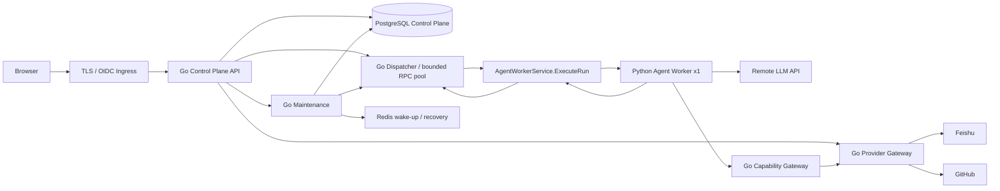

# Go 后端与 Python Agent 边界切分及迁移设计

> 状态：PROPOSED
> 日期：2026-07-28
> 目标：将当前 Python 单体后端转化为 Go Control Plane + Python Agent Runtime
> 适用领域：PRD Task、Agent Run、Working Draft、Published PRD、Repository Snapshot、Evidence、Run Admission、Integration Sync、Model Attempt
> 约束：不改变 V1.1 的产品语义；先建立 Seam，再迁移 Implementation

## 当前实现状态（2026-07-28）

已落地到仓库的第一批代码位于 `backend-go/` 和 `contracts/`：

- Gin API、健康检查、租户/用户隔离的 Task/Run 基础命令；
- `pgxpool` + 显式 SQL + 有序 SQL migration，未引入 GORM；
- Idempotency、Queue Slot、WAITING_CAPACITY 提升；
- Lease、Heartbeat、Fencing Token 和过期 Worker 拒绝；
- PostgreSQL Outbox Claim、Redis Stream 唤醒、失败退避；
- Go-owned `go_task_events` 事件投影、任务创建事件和 owner-scoped SSE 游标读取；
- Agent Execution Protobuf 初版。

### 直接 Agent RPC 决策（2026-07-28）

后续 Go 改造采用 Go 主动调用 Python Agent 的私有 gRPC，不再让 Python 从 Redis Stream 作为主链路拉取 Run。Go 内部使用有界 goroutine/RPC worker pool 管理 Python Worker 连接、并发、超时、熔断和 drain；Redis 只作为可丢弃 wake-up/recovery 信号，PostgreSQL 仍是待派发 Run 的事实源。

当前已实现的 Python → Go `AgentExecutionService` 保留为 Step 2 兼容路径。最终目标是新增 Python `AgentWorkerService.ExecuteRun` server-streaming RPC，由 Go Dispatcher 接收 Attempt、Evidence、Checkpoint、Draft 和终态事件并写入 Go-owned Store。详细设计见：[Go-Python 直接 Agent RPC 线程池设计](2026-07-28-go-python-direct-agent-rpc-pool-design.md)。

这不是“已经完成生产切换”的声明。生产切换前仍必须完成 OIDC/JWKS、旧表投影与数据校验、Agent gRPC 生成代码/客户端、Capability Gateway、API/SSE 全量兼容和灰度回滚演练。Compose 中的 `go-control-plane` profile 因此保持为显式验证入口，不能与旧 Python 写路径并行写同一事实表。

Step 2 的具体设计与 TDD 单测门禁见：

- [Agent Execution Seam 设计方案](2026-07-28-go-migration-step-2-agent-execution-seam-design.md)
- [Agent Execution Seam 单测方案](2026-07-28-go-migration-step-2-agent-execution-seam-unit-test-plan.md)

### Step 2 实现情况（2026-07-28）

Step 2 的 Agent Execution Seam 已完成一个可运行的垂直切片：

- 新增 `backend-go/db/migrations/0003_agent_execution.sql`，由 Go 负责 Checkpoint、Model Attempt、Evidence 和 Working Draft Version 的持久化；
- `runcontrol.AgentExecutionStore` 和 `agentexec.Service` 已提供 Context、Checkpoint、Attempt、Evidence、Draft、Complete/Fail 公共接口；
- 新增真实 `AgentExecutionService` gRPC adapter 和 `backend-go/cmd/agent-rpc`；
- Protobuf 已补充 contract version、request/correlation id、worker identity、Draft 幂等键和 checkpoint sequence；
- Go bindings 位于 `contracts/gen/go/agent/v1`，Python bindings 与 Runtime 位于 `agent-python/agent`；
- Python Worker 已能在无 PostgreSQL 连接的情况下完成 Acquire → Context → Attempt → Evidence → Checkpoint → Draft → Complete 流程；
- Lease supervisor 会在 Agent Loop 运行期间发送 Heartbeat，Lease 丢失后停止后续写入；
- 已覆盖 stale fencing、Lease Held、Checkpoint sequence、Attempt 幂等、Evidence 去重、敏感 metadata、Task version 冲突、gRPC 编解码和 Python Worker 顺序测试。

已验证：

```text
Go:    go test ./...
       go test -race ./internal/...
       go vet ./...
Python: pytest agent-python/tests -q  (5 passed)
Proto: buf lint / buf generate
```

当前仍未达到最终生产切流条件：

1. Agent RPC 尚未启用 mTLS 或等价的 Worker 身份认证；目前依赖内网部署和请求中的 Worker ID，生产前必须补充认证拦截器。
2. Capability Gateway 目前只有契约，尚未实现 GitHub/Feishu 读取和 Export Intent。
3. 现有 `src/prd_agent` 仍包含旧 Python API/Workflow 路径，尚未全部迁移到 `agent-python`。
4. Go Public API 的 Reply、Confirm、Export 全量兼容、SSE 的长连接轮询/断开处理和旧表数据投影仍属于后续阶段；当前 SSE 已完成首批事件投影、`after_sequence`/`Last-Event-ID` 补发和心跳响应。

剩余 Go 框架的设计与本地验证入口已单独整理：

- [剩余 Go 框架设计方案](2026-07-28-go-migration-remaining-framework-design.md)
- [剩余 Go 框架本地验证方案](2026-07-28-go-migration-remaining-framework-local-validation-plan.md)

这两份文档将剩余工作拆为 Direct Agent RPC Pool、Public API/SSE、Identity/RPC Security、Capability/Provider、Maintenance/Recovery 和 Data Projection/Cutover 六个模块，并规定先用 Fake OIDC/Fake Provider/Fake Agent Worker 完成本地 Gate 0–8，再进入 staging 灰度。当前状态为“Step 2 核心垂直切片已实现，Public API/SSE 事件投影首批已实现，Direct Agent RPC Core 已实现，其余生产框架待实现”，不能视为生产切流完成。

## 1. 结论

目标架构不是“Go 网关 + Python 单体”，而是两个职责清晰的 Module：

```text
Go Control Plane
  ├── Public HTTP API / SSE
  ├── Identity / Tenant / Authorization
  ├── Task / Run / Confirmation 状态机
  ├── PostgreSQL Control Plane
  ├── Run Admission / Queue Slot / Fair Scheduler
  ├── Outbox / Inbox / Idempotency
  ├── Lease / Heartbeat / Fencing
  ├── Feishu / GitHub Provider Gateway
  ├── PRD Catalog / Source Revision / Locator
  └── Integration Worker / Reconciliation

Python Agent Runtime
  ├── Workflow Decision Loop
  ├── Prompt / Structured Output
  ├── Remote LLM Adapter
  ├── Investigation Planner / Runner
  ├── RAG Ranking / Grounding Strategy
  ├── Tool Selection
  ├── Evidence Interpretation
  ├── PRD Draft Generation / Quality Evaluation
  └── Agent Checkpoint Payload
```

核心原则：

1. Go 是唯一公开后端入口和 Control Plane 所有者。
2. Python 不提供公网 HTTP API，不直接接受用户身份，不直接改变 Task/Run 状态。
3. Python 只决定“如何完成 Agent Run”；Go 决定“谁可以运行、什么时候运行、结果是否可以提交”。
4. Feishu/GitHub 的认证、权限、同步、写入和重试由 Go Provider Gateway 负责。
5. DeepSeek API Key 只注入 Python Agent Worker；Go 永远不持有 LLM Secret。
6. 两边不共享 ORM、领域实体和数据库写权限，只共享版本化 Interface。

## 2. 为什么采用这个切分

### 2.1 Go 的职责具有平台属性

这些职责与具体 Agent 模型无关，适合由 Go 提供稳定、并发安全、可审计的实现：

- 身份和租户隔离；
- Task/Run 状态机；
- Queue Slot 和公平调度；
- HTTP、SSE、幂等和限流；
- PostgreSQL 事务；
- Lease/Fencing 和恢复；
- Provider 凭证和外部副作用；
- 审计、指标、部署和运维。

### 2.2 Python 的职责具有 Agent 属性

这些职责会随着模型、Prompt、RAG 策略和工具策略快速变化，应该集中在 Python：

- Prompt 版本；
- LLM 请求与结构化输出；
- 有界 Model → Tool → Result Loop；
- Investigation 覆盖策略；
- Evidence 解释和 Grounding；
- RAG 候选排序；
- PRD 草稿内容生成；
- 内容质量检查。

### 2.3 该切分对求职的价值

它能同时展示 Go 后端平台能力和 Python AI 工程能力，但前提是两边都承担真实职责。Go 不能只是转发层，Python 也不能继续拥有用户、队列和数据库状态。

## 3. 目标运行架构



### 3.1 进程职责

| 进程 | 语言 | 是否公开 | 主要职责 |
| --- | --- | --- | --- |
| Control Plane API | Go | 是 | 用户 API、SSE、身份、Task/Run 命令 |
| Agent Worker | Python | 否 | Agent Loop、LLM、RAG 策略、内容生成 |
| Provider Gateway | Go | 否 | Feishu/GitHub 读写、授权和重试 |
| Integration Worker | Go | 否 | Integration Sync、Export Intent、Webhook reconciliation |
| Maintenance | Go | 否 | Outbox、恢复扫描、调度、过期清理 |
| Web | TypeScript | 是 | 用户界面 |
| PostgreSQL | 外部组件 | 否 | Control Plane 事实源 |
| Redis | 外部组件 | 否 | 可丢弃消息唤醒和短期缓存 |

首版仍限制为一个 Python Agent Worker 和一个 Go Integration Worker，符合 2 vCPU / 2GB 部署档位。

## 4. 责任归属矩阵

### 4.1 Go 独占模块

| Domain / Module | Go 负责内容 | Python 不得做什么 |
| --- | --- | --- |
| Identity | OIDC、User、Tenant、Principal 映射 | 不解析用户 JWT，不自行决定用户身份 |
| Authorization | tenant、owner、Provider Binding、ACL | 不从请求参数相信 tenant/owner |
| Task | 创建、读取、版本、删除、公开状态 | 不直接创建 Task |
| Agent Run | 状态机、重试、取消、等待、终态 | 不直接修改 Run 状态 |
| Run Admission | Queue Slot、额度、公平调度 | 不用进程信号量代替 Queue Slot |
| Idempotency | 命令幂等、请求 hash、结果 replay | 不生成业务级最终幂等结果 |
| Lease/Fencing | Lease、Heartbeat、Fencing Token | 不自行发放或递增 fencing token |
| Control Plane Storage | PostgreSQL 写入、迁移、索引、审计 | 不直接写 Go-owned 表 |
| Feishu/GitHub | OAuth、Credential、Provider API、Webhook | 不直接保存 Provider token |
| PRD Catalog | Source Revision、Locator、ACL、索引版本 | 不自行导入完整 Published PRD |
| Export | Export Intent、Saga、结果未知、reconciliation | 不直接写 Feishu |
| Public API | HTTP、SSE、错误码、限流、CORS | 不暴露 Python HTTP 端点给用户 |

### 4.2 Python 独占模块

| Agent Module | Python 负责内容 | Go 不得做什么 |
| --- | --- | --- |
| Workflow Decision Loop | 节点推进、模型决策、确认点判断 | 不复制 Prompt 和模型策略 |
| Model Adapter | DeepSeek 请求、结构化响应、解析修复 | 不在 Go 中实现 Agent Prompt |
| Investigation | 问题拆解、覆盖策略、有限工具循环 | 不把 Agent 推理逻辑散落到 Go Handler |
| RAG Strategy | 候选排序、上下文选择、证据组合 | 不在 Go 中复制模型相关排序策略 |
| Tool Selection | 决定调用哪个工具、传递哪些参数 | 不直接执行 Python 的内部 Loop |
| Grounding | Evidence 解释、冲突判断、引用选择 | 不把模型语义判断硬编码到 Go |
| Draft Generation | Requirement Brief、Outline、Section、PRD Draft | 不在 Go 中生成业务内容 |
| Quality Evaluation | 内容质量、覆盖度、缺口和建议 | 不由 Go 复刻内容质量规则 |
| Agent Checkpoint Payload | Agent 内部恢复状态的序列化/反序列化 | 不让 Go 理解所有 Python 内部字段 |

### 4.3 共享但只能通过 Interface 使用的对象

| 对象 | 所有权 | Python 使用方式 |
| --- | --- | --- |
| Agent Run | Go | 通过 Agent Execution Interface 读取/报告 |
| Model Attempt | Go | Python 上报 metadata，Go 持久化 |
| Evidence | Go | Python 提交结构化 Evidence，Go 校验和存储 |
| Working Draft | Go | Python 提交 draft patch，Go 做版本检查和保存 |
| Repository Snapshot | Go | Python 请求只读 Snapshot/Locator |
| PRD Source Revision | Go | Python 请求经过 ACL 的 Retrieval Context |
| Provider Binding | Go | Python 只能引用 binding_id，不能接触 credential |
| Queue Slot | Go | Python 只能读取当前 Lease，不可申请或释放 |

## 5. Python 当前模块的迁移归属

### 5.1 迁移到 Go Backend

以下 Python Module 应逐步迁移为 Go Module：

```text
src/prd_agent/api/                  -> backend-go/internal/httpapi
src/prd_agent/production/identity.py -> backend-go/internal/identity
src/prd_agent/production/database.py -> backend-go/internal/storage
src/prd_agent/production/dispatch.py -> backend-go/internal/runcontrol
src/prd_agent/production/postgres_dispatch.py -> backend-go/internal/runcontrol
src/prd_agent/production/queueing.py -> backend-go/internal/transport
src/prd_agent/production/publisher.py -> backend-go/internal/maintenance
src/prd_agent/production/scheduler.py -> backend-go/internal/maintenance
src/prd_agent/production/audit.py -> backend-go/internal/audit
src/prd_agent/production/integrations.py -> backend-go/internal/integration
src/prd_agent/production/redis_signals.py -> backend-go/internal/transport
src/prd_agent/export/ -> backend-go/internal/provider/feishu
src/prd_agent/repository/remote/ -> backend-go/internal/provider/github
src/prd_agent/integrations/ -> backend-go/internal/provider
src/prd_agent/storage/postgres*.py -> backend-go/internal/storage
src/prd_agent/policies/idempotency.py -> backend-go/internal/idempotency
src/prd_agent/policies/run_policy.py -> backend-go/internal/runcontrol
```

迁移后的 Go Module 必须拥有更深的 Interface：调用者只需要提交 Command 或查询 Projection，不需要了解事务、锁、Outbox、重试和 Provider 细节。这样能提高 Leverage 和 Locality。

### 5.2 保留并收缩为 Python Agent Runtime

```text
src/prd_agent/workflow/ -> agent-python/agent/workflow
src/prd_agent/investigation/ -> agent-python/agent/investigation
src/prd_agent/model_api/ -> agent-python/agent/model
src/prd_agent/grounding/ -> agent-python/agent/grounding
src/prd_agent/evidence/ -> agent-python/agent/evidence
src/prd_agent/quality/ -> agent-python/agent/quality
src/prd_agent/tools/ -> agent-python/agent/tools
src/prd_agent/rendering/ -> agent-python/agent/rendering
src/prd_agent/eval/ -> agent-python/eval
```

其中 `tools/repository` 不再直接访问本地路径或 Provider Credential，而是生成 Capability Request，由 Go Capability Gateway 执行实际读取。

### 5.3 需要拆分的 Module

#### `application/`

- Go：用户命令、Task/Run 应用流程、权限和持久化。
- Python：Agent 内部的 Workflow 和 Investigation 流程。
- 禁止继续保留一个同时拥有用户事务和模型调用的 `WorkflowService`。

#### `export/`

- Go：Export Intent、Feishu 写入、Saga、reconciliation。
- Python：生成最终 Markdown/结构化 Draft，不执行写入。

#### `repository/`

- Go：GitHub Binding、OAuth、固定 Commit、Snapshot、权限和远程读取。
- Python：提出需要什么 evidence、路径或符号，不直接管理 Repository Binding。

#### `historical/`

- Go：Feishu Catalog、Source Revision、Locator、同步状态。
- Python：Retrieval Strategy、候选排序、上下文拼装。
- 旧本地 Markdown Corpus 只保留为 eval fixture，不进入生产服务。

## 6. 跨语言 Interface 设计

### 6.1 通信选择

采用“PostgreSQL Outbox + Go Dispatcher/RPC Pool + 内部 gRPC”的组合：

- PostgreSQL：业务事实、顺序、幂等和恢复事实。
- Go Dispatcher/RPC Pool：从 PostgreSQL 领取 Run，直接调用 Python Agent，限制并发和连接生命周期。
- Redis Stream：仅唤醒 Go Dispatcher 或加速 recovery，不作为 Python Agent 的主消费队列，也不作为事实源。
- gRPC：Go 与 Python 之间的强类型执行接口；Step 2 的 Python → Go AgentExecution RPC 在迁移期作为兼容回调。
- Protobuf：唯一跨语言契约来源。

不采用 Celery 作为长期跨语言协议，因为 Celery Task 合同和 Python Worker 紧耦合，不利于 Go 作为后端所有者。

目录建议：

```text
contracts/
└── proto/agent/v1/
    ├── task_control.proto
    ├── agent_execution.proto
    ├── agent_worker.proto
    ├── capability_gateway.proto
    └── provider_projection.proto
```

### 6.2 Agent Execution Interface

Go 提供内部 `AgentExecutionService`：

```text
AcquireRun(run_id, worker_id)
  -> LeaseContext

GetRunContext(run_id, lease_token)
  -> AgentRunInput

Heartbeat(run_id, lease_token)
  -> LeaseContext

RecordModelAttempt(attempt_metadata, lease_token)
  -> AttemptReceipt

AppendEvidence(evidence_batch, lease_token)
  -> EvidenceReceipt

SaveCheckpoint(checkpoint, lease_token)
  -> CheckpointReceipt

SubmitDraft(draft_patch, expected_task_version, lease_token)
  -> DraftReceipt

CompleteRun(result, lease_token)
  -> RunProjection

FailRun(error_category, retryability, lease_token)
  -> RunProjection
```

Step 2 兼容路径中，Python 只可以通过该 Interface 操作 Agent Run。每个写操作必须携带：

- `tenant_id`：由 Go 注入，Python 不可修改；
- `run_id`；
- `lease_id`；
- `fencing_token`；
- `event_sequence`；
- `correlation_id`；
- `contract_version`。

### 6.3 Direct Agent Worker Interface

最终执行方向为 Go → Python：

```text
Go Dispatcher
  → AgentRPCPool.ExecuteRun
  → Python AgentWorkerService.ExecuteRun(stream AgentEvent)
  → Go event applier
  → Go-owned Store
```

`AgentWorkerService` 只执行 Python Agent Loop，不获得 PostgreSQL、Provider 或用户 OIDC 凭证。Go 负责在事件进入 Store 前校验 `dispatch_id`、`run_id`、`lease_id`、`fencing_token`、`event_sequence` 和 payload 限制。RPC 采用 at-least-once 语义，事件和 dispatch 必须幂等。

Go Agent RPC pool 的最小职责：

- 复用到 Worker endpoint 的 gRPC connection；
- 固定 pool size 和每 Worker 最大 inflight；
- 连接健康、backoff、熔断、半开和 drain；
- ExecuteRun deadline、CancelRun、stream 断开和 `UNKNOWN` dispatch；
- pool 饱和时不创建无限 goroutine，也不绕过 PostgreSQL Admission。

### 6.4 Capability Gateway Interface

Python Agent 不直接调用 Feishu/GitHub HTTP API，而是请求 Go 执行经过授权的 Capability：

```text
ReadRepositoryTree(binding_id, revision, prefix)
ReadRepositoryFile(binding_id, revision, path)
SearchRepository(binding_id, revision, query)
FindRepositorySymbol(binding_id, revision, symbol)
SearchPrdCatalog(query, access_scope)
FetchPrdSections(locator_ids, source_revision)
CreateExportIntent(task_id, draft_version)
```

Go Gateway 必须校验：

- 当前 Run 是否属于该 tenant/user；
- Provider Binding 是否有效；
- revision 是否 immutable；
- path/prefix 是否在允许范围；
- 该 Capability 是否被当前 Agent Run 允许；
- 返回内容是否经过脱敏和大小限制。

Python 的 Tool Registry 只负责生成 Capability Request 和消费结果，不拥有网络凭证。

### 6.5 事件合同

所有异步事件使用统一 Envelope：

```json
{
  "contract_version": 1,
  "event_id": "evt-...",
  "event_type": "agent.run.requested",
  "tenant_id": "tenant-...",
  "run_id": "run-...",
  "aggregate_version": 12,
  "correlation_id": "corr-...",
  "occurred_at": "2026-07-28T00:00:00Z",
  "payload": {}
}
```

要求：

- `event_id` 全局幂等；
- `aggregate_version` 单调递增；
- 消费者必须 Inbox 去重；
- 未知 contract version 进入 quarantine，不得猜测执行；
- 事件 payload 不包含 API Key、OAuth Token、完整 JWT 或未脱敏 Provider 内容。

## 7. 数据所有权与数据库策略

### 7.1 Go-owned 表

Go 独占写入：

- tenants、users、user_identities；
- prd_tasks、agent_runs、workflow_checkpoints；
- queue_slots、scheduler_cursors、production_run_control；
- command_idempotency、outbox_messages、inbox_receipts；
- provider_bindings、repository_snapshots；
- prd_catalog_entries、prd_source_revisions、prd_section_locators；
- integration_syncs、export_intents、provider_webhook_deliveries；
- audit_events、model_attempts 元数据。

### 7.2 Python 不直接写数据库

Python 的 Agent State 通过 Go 保存为：

- 受版本控制的 `checkpoint_blob`；
- 结构化 Agent Result；
- 脱敏的 Model Attempt metadata；
- Evidence、Draft Patch 和 Quality Result。

Python 可以在测试环境使用 SQLite/Memory Adapter，但生产 Worker 不携带 PostgreSQL 写连接。

### 7.3 内容权威不改变

- Published PRD 正文仍由 Feishu 所有。
- GitHub 代码仍由 GitHub 所有。
- PostgreSQL 只保存 Control Plane、目录、摘要、revision、locator、audit 和有限期 Working Draft。

这保持 ADR-0001，不因语言拆分引入新的内容副本。

## 8. 迁移阶段

## Phase 0：冻结契约和边界

### 工作内容

1. 建立 `contracts/proto` 和事件 Envelope。
2. 为当前 Python API/Worker 编写契约测试。
3. 输出 Python Module ownership 清单。
4. 在 CI 中禁止 Python 生产代码新增公共 HTTP Route、Provider Credential 读取和直接数据库写入。
5. 记录 Go Service 的错误码、状态机和版本策略。

### 产出

- Protobuf contract；
- JSON event examples；
- contract compatibility test；
- Python Agent Runtime 的最小入口；
- Go Backend scaffold。

### 验收

- 不改变现有运行行为。
- Go 和 Python 都能解析同一组 fixture。
- 旧 Python 服务仍可运行。

## Phase 1：建立 Go Control Plane 骨架

### 工作内容

1. 创建 `backend-go/`，包含 `cmd/api`、`cmd/maintenance`、`internal/httpapi`、`internal/runcontrol`、`internal/storage`。
2. 实现健康检查、配置加载、结构化日志、PostgreSQL 连接池。
3. 实现只读 Task/Run 查询，不替换 Python 写路径。
4. 实现 Go OpenAPI 文档和错误响应格式。
5. 加入 OIDC 验证和 tenant context。

### 验收

- Go API 能读取 Python 创建的 Task/Run Projection。
- 认证、租户隔离、错误码和分页合同通过集成测试。
- Python 行为完全不改变。

## Phase 2：迁移 Control Plane 写入和 Run Admission

### 工作内容

1. Go 接管 Task 创建、Reply、Confirm、Retry、Cancel 命令。
2. Go 接管 Run Admission、Queue Slot、Fair Scheduler、Outbox、Inbox。
3. Go 接管 Lease、Heartbeat、Fencing 和 Recovery。
4. Go Dispatcher 通过 Agent RPC Pool 调用 Python `AgentWorkerService`；Python 不再从 Redis 主动拉取 Run。
5. 关闭 Python `PostgresProductionControlStore` 的生产写权限。

### 兼容策略

- 初期 Python API 和 Go API 使用同一个 PostgreSQL Control Plane，但只允许一个写入方。
- 使用 feature flag 控制命令入口：`CONTROL_PLANE_BACKEND=python|go`。
- Go 接管一个命令后，Python API 对该命令只返回 `410 MIGRATED_ENDPOINT` 或内部转发到 Go。

### 验收

- 多用户并发不超卖 Queue Slot。
- Redis 清空后 Run 仍能恢复。
- Python Worker 失联时 Go API 仍能创建、排队和查询任务。
- stale fencing token 不能写入 Control Plane。

## Phase 3：迁移 Agent Execution Seam

### 工作内容

1. Python `WorkflowService` 改为 `AgentRuntime`，只接受 `AgentRunInput`。
2. 删除 Python 对 `Request`、OIDC Principal、FastAPI State 的依赖。
3. Python 将 `Model Attempt`、Evidence、Checkpoint、Draft、Quality Result 作为 AgentEvent stream 返回，Go 校验后写入 Go-owned Store；Step 2 的 Python → Go gRPC callback 仅作为兼容路径。
4. Python Worker 只保留：
   - 当前 Agent Run 的内存状态；
   - LLM Client；
   - Tool Selection；
   - Agent 结果生成。
5. 对每个 `AgentRuntime` 调用实现 contract version 和 fencing 校验。

### 验收

- Python Agent 可以脱离 FastAPI 进程单独启动。
- Python Agent 在没有 PostgreSQL 写权限时能完成测试流程。
- Worker 重启后从 Go 返回的 checkpoint 恢复。
- API 请求生命周期与 Agent 生命周期完全解耦。

## Phase 4：迁移 Provider Gateway

### 工作内容

1. Go 实现 GitHub Provider Gateway：OAuth、Binding、固定 Commit、只读 Repository Capability。
2. Go 实现 Feishu Provider Gateway：Credential、Catalog、Source Revision、Section Locator、Export Intent。
3. Python `tools/repository` 改为 Capability Adapter，不再使用本地路径和远程 token。
4. Python `historical/retrieval` 改为调用 PRD Catalog/Section Gateway。
5. Python `export` 改为只提交 Draft 或 Export Intent。
6. 迁移 Webhook、Integration Sync、结果未知 reconciliation 到 Go Maintenance。

### 验收

- Python 进程环境中没有 GitHub/Feishu Secret。
- Provider ACL 在 Go Gateway 内统一执行。
- Feishu revision 变化可以被 Go Sync 记录。
- 远端成功但响应丢失时不会重复创建文档。

## Phase 5：Go 接管 Public API 和前端连接

### 工作内容

1. 将前端 API Client 的 base URL 指向 Go API。
2. 保持 OpenAPI response schema 与现有前端兼容。
3. 将 SSE、Last-Event-ID、sequence gap 和 reconnect 迁移到 Go。
4. Python FastAPI 只作为 local development adapter，生产 Compose 删除该服务。
5. Go API 接管 `/health/ready`、`/metrics` 和公开错误响应。

### 验收

- 前端不感知 Python 是否存在。
- 所有用户命令只进入 Go。
- API P95 不包含 LLM 执行时间。
- SSE 断线可恢复，事件顺序不丢失。

## Phase 6：删除 Python Backend 旧路径

### 删除或归档

- Python `api/` 生产入口；
- Python `production/identity.py`、`database.py`、`dispatch.py`、`publisher.py`、`scheduler.py`；
- Python Provider Credential 和 OAuth 实现；
- Python 直接 PostgreSQL Control Plane Store；
- Python Celery Task 注册和 Python 专属队列协议；
- 生产 Compose 中的 FastAPI 服务。

### 保留

- Python Agent Runtime；
- Python Model Adapter；
- Python Agent 的 Memory/Test Adapter；
- Python Eval 和离线 Prompt 回归工具；
- 兼容迁移脚本和协议 fixture。

### 删除条件

只有在 Go API、Go Maintenance、Python Agent Worker 连续通过 Staging 故障演练后，才能删除旧路径。

## 9. 目录结构建议

```text
PRD-Agent/
├── backend-go/
│   ├── cmd/
│   │   ├── api/
│   │   ├── maintenance/
│   │   └── worker-gateway/
│   ├── internal/
│   │   ├── httpapi/
│   │   ├── identity/
│   │   ├── runcontrol/
│   │   ├── storage/
│   │   ├── provider/
│   │   ├── integration/
│   │   ├── transport/
│   │   └── audit/
│   └── go.mod
├── agent-python/
│   ├── agent/
│   │   ├── workflow/
│   │   ├── investigation/
│   │   ├── model/
│   │   ├── grounding/
│   │   ├── tools/
│   │   ├── quality/
│   │   └── transport/
│   ├── eval/
│   ├── tests/
│   └── pyproject.toml
├── contracts/
│   ├── proto/agent/v1/
│   └── fixtures/
├── web/
├── infra/
└── docs/
```

迁移期间可以先保留当前 `src/prd_agent`，但每次迁移完成一个 Module 就禁止新代码继续依赖旧路径。最终删除旧 Python Backend Module，避免两套实现长期并存。

## 10. 测试策略

### 10.1 Go 单元和集成测试

- Task/Run 状态机；
- tenant/owner ACL；
- Idempotency；
- Queue Slot 超卖和公平调度；
- Lease/Heartbeat/Fencing；
- Outbox/Inbox 重复投递；
- Provider Binding 权限；
- Feishu/GitHub 结果未知和 reconciliation；
- SSE sequence gap 和 Last-Event-ID；
- PostgreSQL migration 和事务竞争。

### 10.2 Python Agent 测试

- Prompt contract；
- Structured output parsing；
- Model Attempt metadata 上报；
- Investigation bounded loop；
- Tool selection；
- RAG ranking；
- Evidence grounding；
- Draft generation；
- Quality gate；
- checkpoint 序列化与恢复。

### 10.3 跨语言 Contract 测试

每个 protobuf message 需要：

- Go encode → Python decode；
- Python encode → Go decode；
- unknown field forward compatibility；
- unsupported version quarantine；
- error code mapping；
- fencing token rejection；
- event sequence replay。

### 10.4 端到端测试

```text
Browser
  -> Go API
  -> PostgreSQL Run/Outbox
  -> Go Dispatcher / bounded Agent RPC Pool
  -> Python AgentWorkerService stream
  -> Go Capability Gateway
  -> Feishu/GitHub Fake Provider
  -> Go API SSE
```

必须覆盖 Worker 崩溃、Go API 重启、Redis 清空、模型 timeout、Provider 成功但响应丢失、重复命令和跨租户访问。

## 11. 最小提交序列

### 契约

1. `chore: add go backend and python agent ownership map`
2. `feat: add versioned agent protobuf contracts`
3. `test: add cross-language contract fixtures`

### Go Control Plane

4. `feat: scaffold go control plane health and config`
5. `feat: add go postgres control plane repositories`
6. `feat: add go identity and tenant authorization`
7. `feat: add go task and run query projections`
8. `feat: add go task commands and idempotency`
9. `feat: add go queue admission and fair scheduler`
10. `feat: add go lease fencing and recovery`

### Python Agent

11. `refactor: extract agent runtime from python api service`
12. `feat: add python agent execution client`
13. `refactor: report checkpoints and model attempts through go`
14. `refactor: replace direct repository tools with capability requests`
15. `refactor: remove python request and principal dependencies`

### Provider 与迁移

16. `feat: add go github capability gateway`
17. `feat: add go feishu catalog and export gateway`
18. `refactor: move integration sync and reconciliation to go`
19. `refactor: move frontend api and sse to go control plane`
20. `chore: remove python production api and celery path`
21. `test: add staging recovery and cross-language e2e gates`

每个提交都必须保持：

- Python Agent 本地测试可运行；
- Go `go test ./...` 可运行；
- Contract fixture 可双向解析；
- 至少一条端到端路径可运行；
- 旧路径仍可回滚，直到对应 Phase 完成。

## 12. 迁移期间的禁止事项

- Go 和 Python 同时写同一张 Control Plane 表。
- Python 通过环境变量获得 Go 的数据库管理员账号。
- Go 复制 Python Prompt 或模型策略。
- Python 直接调用 Feishu/GitHub 并绕过 Go ACL。
- 用 Redis 队列长度代替 PostgreSQL Run Admission。
- 用共享 JSON dict 代替版本化 Protobuf Contract。
- 在 Go API 中同步等待 Python Agent 完成。
- 迁移期间继续扩展旧 Python `api/` 和 `production/` Module。

## 13. 风险与回滚

| 风险 | 处理方式 |
| --- | --- |
| 两套状态机不一致 | Go 先只读，再单命令切换；状态合同由 fixture 锁定 |
| gRPC 不可用 | Run 保留在 PostgreSQL，进入 `WAITING_CAPACITY` 或 dispatch `UNKNOWN`，不丢任务 |
| Python Worker 重启 | Go Lease/Fencing + checkpoint 恢复 |
| Provider Gateway 迁移回归 | 先用 Fake Provider 双读，再关闭 Python Adapter |
| 数据库双写冲突 | 每个 Phase 明确唯一写入方，CI 检查旧写入口 |
| 小服务器资源不足 | Go API/Worker concurrency 固定，Python Agent x1，禁止盲目扩容 |
| 跨语言调试困难 | correlation_id、run_id、event_id 全链路日志关联 |
| 迁移周期过长 | 每个 Phase 都能独立交付和回滚，不等待全量重写 |

## 14. 最终验收标准

1. 公网只有 Go API 和 Web，Python Agent 无公网入口。
2. 所有用户身份、租户、Task、Run、Queue Slot 和 Provider 权限由 Go 控制。
3. Python Agent 无 PostgreSQL Control Plane 写权限、无 Feishu/GitHub Credential。
4. Python 只执行 Agent Loop、模型调用、RAG/grounding 和 PRD 内容生成。
5. Go 与 Python 仅通过版本化 Protobuf/事件合同通信。
6. Go API 响应时间不受 LLM 执行时间直接影响。
7. Redis 丢失、Worker 重启、模型 timeout、Provider 结果未知都可恢复。
8. Feishu/GitHub 内容所有权仍符合 ADR-0001。
9. 生产环境仍符合远程 LLM-only 和小服务器公平队列 ADR。
10. 简历可以明确描述：

    > Designed and implemented a Go control plane for multi-tenant task orchestration, fair queue admission, idempotent external integrations, and lease/fencing recovery, with a Python agent runtime for LLM workflows, RAG, grounding, and bounded tool execution.
