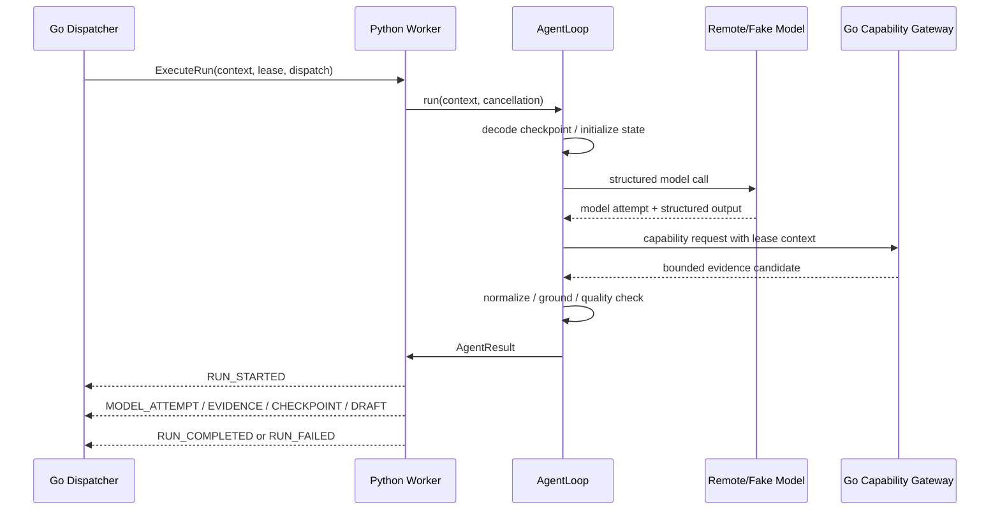

# Python Agent Runtime 补全设计方案

> 状态：CORE IMPLEMENTED / PRODUCTION GATES PENDING
> 日期：2026-07-28
> 适用范围：`agent-python/`、`contracts/proto/agent/v1/` 以及旧 `src/prd_agent/` 中应迁移到 Agent Runtime 的代码
> 对应设计：`2026-07-28-go-python-agent-boundary-migration-design.md`、`2026-07-28-go-python-direct-agent-rpc-pool-design.md`

## 实现进度（2026-07-28）

本轮已实现：

- `agent.bootstrap:build_agent_loop` 默认 Worker Bootstrap；
- local/test Deterministic Agent Loop，生产环境禁止静默降级；
- DeepSeek Remote Model Adapter、HTTPS/host/Secret file/timeout/retry/token budget 配置；
- bounded Investigation Plan，可先查询 Repository 或历史 PRD，再生成 Working Draft；
- Python `CapabilityGatewayClient`，覆盖 Repository Search/File、PRD Catalog/Section 和内容大小限制；
- `CheckpointCodec` 的 schema、hash、run/workflow/sequence 一致性校验；
- cooperative `CancellationToken`、Worker capacity、结果 payload 限制和错误分类；
- 多 Model Attempt、Evidence、Checkpoint、Draft 和终态事件流；
- `occurred_at`、contract version、correlation id、task version、Repository capability context 协议字段；
- Draft Quality 和敏感 marker 门禁；
- 独立 Worker 默认 factory、生产 LLM Compose 配置和只读容器限制；
- Python Agent 定向测试及 Go/Proto 合同回归；
- 独立 Compose 下 PostgreSQL → Go API → Go Dispatcher → Python Worker 的真实 TCP/容器 E2E；
- 删除 Python Pull/Callback Runtime、AgentExecutionClient 和 Go `agent-rpc` 可执行兼容路径。

本轮仍未完成的生产门禁：

- 旧 `src/prd_agent` 中完整 Confirmation Unit、Outline、Grounding 和高级 Quality 行为的 fixture 等价迁移；
- Go Capability Gateway 的真实 GitHub/Feishu Provider Implementation；
- Go ↔ Python mTLS/workload identity；
- 对正在阻塞的同步 HTTP Model 请求进行立即 transport cancel；
- Worker crash、RPC timeout、Go restart 等 staging 故障演练。

## 1. 结论

当前 `agent-python/` 已能独立承担核心 Python Agent Runtime 职责，并已通过 direct RPC 容器链路验证。

现状是：

```text
agent-python/
  已有：跨语言 bindings、AgentWorkerService、Deterministic/Remote Agent Loop、
       LLM、Investigation、Capability、Evidence、Quality、Checkpoint 和 Worker CLI
  已删除：Python → Go Pull/Callback 客户端及兼容 Runtime

src/prd_agent/
  仍拥有：大部分实际 Workflow / Investigation / Model / Tool / Evidence / Draft 逻辑
  同时还混有：旧 API、PostgreSQL、Provider、用户事务和公开入口
```

因此当前可以通过 Worker 协议单测，但不能启动一个配置完整、可以真正处理 `Agent Run` 的独立 Python Worker。

本方案的目标是把 Python 收敛为一个无公开 HTTP、无 PostgreSQL 写权限、无用户身份所有权的 Agent Runtime：

```text
Go Dispatcher
  → AgentWorkerService.ExecuteRun
  → Python AgentRuntime
      → Workflow Decision Loop
      → Remote LLM Adapter
      → Investigation / RAG Strategy
      → Capability Gateway Client
      → Evidence / Grounding / Quality
      → AgentResult
  → streamed Agent Events
  → Go-owned Control Plane
```

## 2. 设计约束与不可重新讨论的决策

以下决策来自现有设计和 ADR，不在本方案中重新选择：

1. Go 是唯一的 Control Plane 所有者，负责 Task、Agent Run、Lease、Fencing、Queue Slot、事件事实、PostgreSQL 和 Provider Gateway。
2. Python 只负责 Agent Run 内的模型和工具决策，不直接修改 Task/Run 状态。
3. PostgreSQL 是事实源；Redis 只能作为 Go Dispatcher 的 wake-up/recovery 信号。
4. 生产只使用远程 LLM；本地 Deterministic/Fake Model 只能作为测试和开发 Adapter。
5. Feishu/GitHub Credential、OIDC Token、数据库 DSN 不进入 Python Worker。
6. Python 与 Go 之间唯一共享的业务 Interface 是版本化 Protobuf；不共享 ORM、数据库实体或 Python 领域对象。
7. Agent RPC 采用 at-least-once 语义；所有结果事件必须可校验、可重放、可去重。

## 3. 当前代码盘点

### 3.1 已实现内容

| Module | 当前代码 | 状态 |
| --- | --- | --- |
| Worker Protocol | `agent-python/agent/v1/agent_worker_pb2*.py` | 已生成 |
| Execution Protocol | `agent-python/agent/v1/agent_execution_pb2*.py` | 已生成 |
| Go → Python Adapter | `agent-python/agent/worker_server.py` | 已有事件流、Worker ID、容量、取消、Health |
| Worker Bootstrap | `agent-python/agent/worker_main.py` | 已有 CLI 和 `module:attribute` loop factory 入口 |
| Agent Context | `agent-python/agent/context.py` | 纯 Lease/RunContext 领域输入，无 RPC client |
| Agent Result | `agent-python/agent/result.py` | Worker 输出的 Attempt/Evidence/Checkpoint/Draft 结果 |
| Worker 测试 | `agent-python/tests/` | 已覆盖内存调用顺序和事件流，不是完整跨进程 E2E |
| Proto Contract | `contracts/proto/agent/v1/` | Worker、Execution、Capability 三组协议已有初版 |

### 3.2 必须迁移或补齐的现有 Python 实现

以下代码仍在旧 `src/prd_agent/`，需要迁入新的 Python Agent Module；迁移时只搬 Agent 逻辑，不搬 Control Plane 所有权：

| 旧路径 | 目标路径 | 迁移内容 |
| --- | --- | --- |
| `src/prd_agent/workflow/` | `agent-python/agent/workflow/` | Requirement Brief、Outline、Confirmation Unit、Draft 生成和节点推进 |
| `src/prd_agent/investigation/` | `agent-python/agent/investigation/` | Information Need、Coverage、Action Selection、Runner、预算和停止策略 |
| `src/prd_agent/model_api/` | `agent-python/agent/model/` | DeepSeek Client、结构化输出、重试和错误分类 |
| `src/prd_agent/grounding/` | `agent-python/agent/grounding/` | Claim、Evidence 组合、冲突和引用选择 |
| `src/prd_agent/evidence/` | `agent-python/agent/evidence/` | Evidence Normalizer、Fact Builder、Conflict Detector、敏感内容处理 |
| `src/prd_agent/quality/` | `agent-python/agent/quality/` | Draft Quality 检查和结果模型 |
| `src/prd_agent/tools/` | `agent-python/agent/tools/` | Tool Schema、Action Selection、Capability Adapter；删除本地路径和 Credential 读取 |
| `src/prd_agent/rendering/` | `agent-python/agent/rendering/` | Working Draft Markdown 和 Evidence Appendix 生成 |
| `src/prd_agent/production/config.py` | `agent-python/agent/config.py` | 仅迁移 LLM、运行预算和安全配置；不迁移 API/DB/Provider 配置 |

以下内容禁止迁移到 Python：

- `src/prd_agent/api/` 的公开 HTTP、OIDC Principal 和请求生命周期；
- `src/prd_agent/storage/` 的 PostgreSQL 实现；
- Task/Run 状态转换、Queue Slot、Idempotency、Lease/Fencing；
- Feishu/GitHub Credential、Provider 写入和 Export Intent；
- 用户级权限判断和公开错误码。

## 4. 缺口与设计冲突

### 4.1 P0：没有可运行的真实 Agent Loop

`AgentWorkerServer` 接收一个通用 callable，`worker_main.py` 只负责通过 `PRD_AGENT_AGENT_LOOP_FACTORY` 动态加载它。但 `agent-python/` 当前没有默认 loop factory，也没有把旧 `WorkflowService`、`InvestigationRunner` 和 `ModelRuntime` 组合成 `AgentResult` 的入口。

影响：

- Container 可以启动 Worker 进程，但没有真实 Agent Loop 时会退出；
- Go → Python 的完整执行只能用测试 callable 模拟；
- 生产 Compose 中的 `PRD_AGENT_AGENT_LOOP_FACTORY` 没有可验证实现。

设计要求：新增 `agent.runtime.factory.build_agent_loop()`，将配置、Workflow、Investigation、Model、Capability 和输出事件组合成一个稳定的 AgentLoop Adapter。

### 4.2 P0：Agent Runtime 仍依赖旧单体路径

设计要求 Python 可以脱离 FastAPI、PostgreSQL 和旧 Python API 独立运行；当前真正的业务实现仍被 `src/prd_agent` 的 repository、database、application 和 API bootstrap 组织。

影响：

- Python 代码无法证明没有 Control Plane 写权限；
- `agent-python/Dockerfile` 只复制 `agent-python/agent`，不会包含旧路径中的实际 Workflow 实现；
- 迁移后容易把 Go-owned 状态机和 Python Agent 逻辑继续混在一起。

设计要求：先把 Agent 逻辑迁移到 `agent-python/agent`，再以独立 `AgentRuntime` 入口组装；旧 `src/prd_agent` 只在兼容测试和迁移期间保留。

### 4.3 P0：没有 Capability Gateway Client

`capability_gateway.proto` 和 Python generated bindings 已存在，但 `agent-python/agent` 没有对应 Client、请求元数据、超时、错误分类、结果限制和 Tool Adapter。

这与设计冲突：Python 当前旧 Tool 实现可以直接依赖本地 Repository reader，而目标架构要求 Python 只提出 Capability Request，由 Go 执行 ACL、固定 revision 和 Provider 读取。

必须补齐：

- `CapabilityGatewayClient`；
- `RepositoryToolAdapter`、`PrdCatalogToolAdapter`；
- Capability lease 和 `run_id` / `dispatch_id` 关联；
- result size、path、locator、excerpt 的上限；
- `PERMISSION_DENIED`、`REVISION_NOT_FOUND`、`RATE_LIMITED`、`TIMEOUT`、`UNKNOWN` 错误分类；
- 不允许把 Provider credential 或未经脱敏的远端错误带回 Agent Loop。

### 4.4 P0：LLM Adapter 和生产配置没有迁入 Worker

`src/prd_agent/model_api/deepseek.py` 和 `src/prd_agent/production/config.py` 已有实现，但 `agent-python/pyproject.toml` 当前只有 `grpcio` 和 `protobuf`，Worker Image 没有 LLM、Pydantic、HTTP Transport 和配置校验模块。

必须补齐：

- `agent-python/agent/model/deepseek.py`；
- `agent-python/agent/config.py`，只读取 `*_FILE` 的生产 Secret；
- HTTPS、allowed host、connect timeout、request timeout、最大输出、最大迭代、run token budget、transport retry；
- Model Attempt 元数据：`model_id`、`prompt_version`、`request_hash`、`token_usage`、`finish_reason`、`error_category`；
- Provider 错误、结构化输出错误和不可重试错误的统一映射。

本地没有 LLM 配置时必须显式注入 Fake Model；不能在 staging/production 静默退回 Heuristic Model。

### 4.5 P1：Checkpoint 只有 opaque bytes，没有恢复协议

当前 Worker 可以把 `checkpoint` 和 `checkpoint_sequence` 传递给 loop，但没有 checkpoint schema、版本、大小限制、校验和、兼容迁移或恢复测试。

必须定义：

```text
CheckpointEnvelope {
  schema_version
  workflow_version
  run_id
  task_version
  sequence
  payload
  payload_hash
}
```

Python 只负责序列化/反序列化自己的 Agent 状态；Go 只保存和比较 opaque payload，不解析 Python 内部字段。旧 schema 必须有显式 migration 或进入 `CHECKPOINT_INCOMPATIBLE`，不能静默从头运行。

### 4.6 P1：取消只传递 Event，没有真正停止 Model/Tool

`AgentWorkerServer` 会设置 `cancel_event`，但旧的 Workflow、LLM Client 和 Tool Handler 尚未统一接受取消令牌。

必须定义 `CancellationToken` Seam：

```python
class CancellationToken(Protocol):
    def is_cancelled(self) -> bool: ...
    def raise_if_cancelled(self) -> None: ...
```

每个模型请求、Capability 请求和长循环迭代前后都检查 token。取消后只能产生 `RUN_FAILED(CANCELLED)`，不得发送 `MODEL_ATTEMPT`、`DRAFT_SUBMITTED` 或 `RUN_COMPLETED`。

### 4.7 P1：Worker Protocol 与设计要求不完全一致

当前 `agent_worker.proto` 存在以下缺口：

- `ExecuteRunResponse` 没有 `occurred_at`；
- 事件没有独立的 `contract_version` / `correlation_id` 回传字段；
- Capability 请求没有统一 `RequestMeta`，只有 `CapabilityLease`；
- Python Worker 端没有统一 payload 字段限制和事件白名单校验；
- `Health` 只能报告进程和并发，不报告 LLM/Capability readiness。

补充协议时必须保持字段向后兼容，建议新增字段而不是重排已有字段：

```text
ExecuteRunResponse.occurred_at       = 16
ExecuteRunResponse.contract_version = 17
ExecuteRunResponse.correlation_id   = 18
Capability request.meta              = new field
HealthResponse.model_ready           = new field
HealthResponse.capability_ready      = new field
```

最终事件由 Python 生成，但 Go 仍是事件事实的校验和持久化所有者。

### 4.8 P1：RPC 安全和数据最小化未完成

当前 Python 使用 `grpc.insecure_channel` / `add_insecure_port`，Worker ID 主要来自请求字段，尚无 mTLS、认证 metadata、服务端 interceptor 或 peer identity 校验。

必须补齐：

- mTLS 或等价 workload identity；
- Python 端校验 Go Dispatcher 身份；
- Worker identity 以认证 metadata 为准，请求体字段只做一致性检查；
- 最大 task message、checkpoint、draft patch、evidence excerpt 和 event 数量；
- 日志禁止输出完整 PRD、JWT、OAuth Token、API Key 和未经脱敏的模型响应；
- `request_id`、`correlation_id`、`dispatch_id` 可检索但不包含敏感正文。

### 4.9 P1：生命周期、健康检查和观测不完整

当前 Worker 没有优雅 drain、活动 Run 统计之外的运行指标、结构化事件日志和 ready/not-ready 状态切换。

必须支持：

- SIGTERM 后停止接受新 Run；
- 已有 Run 在 drain deadline 内完成或取消；
- `Health`、`Readiness`、`active_runs`、`max_inflight`、`last_error_category`；
- execution latency、LLM latency、Capability latency、token usage、event count、cancel count、unknown count；
- 所有指标按 worker_id、workflow_version、provider 维度聚合，但禁止使用 task message 作为 label。

### 4.10 P2：测试覆盖集中在适配器，缺少真实 Runtime 测试

当前 `agent-python/tests/` 只有 8 个测试，主要验证兼容 Runtime、Worker Server 事件顺序和 direct servicer 调用。

缺少：

- Fake Model → Workflow → Investigation → Capability → AgentResult 的完整流程；
- checkpoint resume / schema migration；
- cancel 在 LLM、Tool、Evidence、Draft 各阶段的行为；
- Capability ACL、revision、size limit 和错误映射；
- model retry、budget exhaustion、malformed JSON repair；
- event payload limit、敏感信息脱敏和未知事件；
- Worker 真实进程启动和 Go TCP gRPC E2E；
- Worker crash、stream interruption、drain、reconnect 和 at-least-once replay。

## 5. 目标 Python Agent Runtime Module 结构

```text
agent-python/
├── agent/
│   ├── bootstrap.py                 # 组合配置和 Adapter，构造 AgentLoop
│   ├── config.py                    # Worker/LLM/limit/security 配置
│   ├── runtime/
│   │   ├── context.py               # AgentRunInput 的领域视图
│   │   ├── loop.py                  # AgentLoop Interface
│   │   ├── result.py                # AgentResult 和内部事件
│   │   ├── cancellation.py          # CancellationToken
│   │   └── checkpoint.py            # Envelope、codec、migration
│   ├── workflow/                    # PRD Workflow Decision Loop
│   ├── investigation/               # bounded investigation loop
│   ├── model/
│   │   ├── adapter.py               # StructuredModel Interface
│   │   ├── deepseek.py              # Remote LLM Adapter
│   │   └── fake.py                  # 测试 Adapter
│   ├── capability/
│   │   ├── client.py                # Go Capability Gateway Client
│   │   ├── errors.py                # 统一错误分类
│   │   └── adapters.py              # Tool → Capability 映射
│   ├── tools/                       # Action schema、registry、sanitizer
│   ├── evidence/                    # normalizer、fact、conflict、grounding input
│   ├── grounding/                   # claim/evidence 选择
│   ├── quality/                     # draft quality evaluation
│   ├── rendering/                   # draft markdown / appendix
│   ├── transport/
│   │   ├── worker_server.py         # gRPC server adapter
│   │   ├── auth.py                  # internal RPC identity
│   │   ├── events.py                # AgentResult → protobuf event
│   │   └── health.py                # readiness/liveness
│   └── legacy/
│       └── execution_client.py      # 迁移期 Python → Go 兼容路径
├── tests/
│   ├── unit/
│   ├── contract/
│   ├── integration/
│   └── e2e/
└── pyproject.toml
```

### 5.1 核心 Interface

```python
class AgentLoop(Protocol):
    def run(
        self,
        context: RunContext,
        cancellation: CancellationToken,
    ) -> AgentResult:
        """Run only Agent-owned logic; no durable Control Plane writes."""


class StructuredModel(Protocol):
    def complete(
        self,
        operation: str,
        payload: Mapping[str, object],
        *,
        cancellation: CancellationToken,
        repair: bool = False,
    ) -> StructuredModelResult:
        ...


class CapabilityGateway(Protocol):
    def search_repository(...): ...
    def read_repository_file(...): ...
    def search_prd_catalog(...): ...
    def fetch_prd_sections(...): ...


class CheckpointCodec(Protocol):
    def encode(self, state: AgentState) -> CheckpointEnvelope: ...
    def decode(self, envelope: CheckpointEnvelope) -> AgentState: ...
```

这些 Interface 是 Python Agent 的 Seam：Workflow、模型和 Capability 都可以用 Fake Adapter 测试；`AgentWorkerServer` 不需要知道 Prompt、Repository 或 Quality 的实现细节。

## 6. Agent Run 内部流程



关键不变量：

1. Python 的 Tool 结果是候选 Evidence，不是 Go-owned Evidence 事实；Go 收到事件后仍需做 lease、sequence、payload 和幂等校验。
2. Python 不执行 Feishu Export；只生成 Draft Patch 或请求 Export Intent 的意图，最终由 Go 决定是否允许执行。
3. 任意模型、Capability 或 checkpoint 错误都必须映射到明确的 `error_category` 和 `retryable`，不能用通用异常直接标记成功。
4. Agent Loop 在每个迭代边界检查预算、取消和 checkpoint；不得无界调用模型或工具。

## 7. 分阶段实现方案

### Step 1：冻结旧路径并建立独立 Bootstrap

目标：让 Python Worker 能在没有 FastAPI、PostgreSQL 和旧 API 的情况下启动。

实现：

- 新增 `agent/config.py`、`agent/bootstrap.py`、`agent/runtime/loop.py`；
- 将 `ModelRuntime` 中的 LLM 配置和 Adapter 迁移到 `agent/model/`；
- 创建 `build_agent_loop()`，先用 Fake Model + 现有 Workflow 组装最小完整 Loop；
- `worker_main.py` 默认加载 `agent.bootstrap:build_agent_loop`，仅允许显式配置覆盖；
- Dockerfile 只复制新 Agent Runtime 依赖和代码。

验收：Worker 在无数据库、无 Go API 情况下可以处理一个 Fake Run 并返回完整事件流。

### Step 2：迁移 Workflow / Investigation / Model

目标：把 Agent-owned Implementation 从 `src/prd_agent` 移到 `agent-python/agent`。

实现顺序：

1. `model` 和结构化输出校验；
2. `workflow` 的 Requirement Brief、Outline、Confirmation Unit、Draft；
3. `investigation` 的 Coverage、Budget、Action Selector、Runner；
4. `grounding`、`quality`、`rendering`；
5. `evidence` 的纯计算部分。

迁移规则：

- 删除对 FastAPI `Request`、Principal 和 Database Session 的引用；
- 用 `RunContext`、`AgentState` 和 Adapter 替代旧 repository 依赖；
- 纯计算逻辑直接迁移，持久化调用改为 `AgentResult` / checkpoint 输出；
- 每迁移一个 Module，旧路径和新路径各跑同一组 fixture 对比测试。

### Step 3：实现 Capability Gateway Client

目标：让 Python 所有 Repository/PRD 数据读取都经过 Go Gateway。

实现：

- 为 Capability RPC 增加 request metadata 和超时；
- `CapabilityGatewayClient` 绑定当前 `run_id`、`dispatch_id`、lease 和 correlation；
- 重写 Repository Tool Handler，返回统一 `ToolResult`；
- 在 Python 端做 schema、limit、redaction 和 evidence locator 校验；
- 移除生产环境中本地路径 reader、GitHub token 和 Feishu token。

验收：Fake Gateway 可驱动完整 Investigation；Python 进程环境中不存在 Provider Secret。

### Step 4：补齐 Checkpoint、取消和事件 Adapter

目标：让长任务、重启、取消和 at-least-once 语义可恢复。

实现：

- Checkpoint Envelope、schema migration 和 hash；
- `CancellationToken` 贯穿 Model、Capability、Workflow、Investigation；
- `AgentResult` 到 Protobuf 的单一 Event Builder；
- 事件 payload 大小、事件类型和 sequence 的 Python 侧校验；
- stream 中断前后的内部状态只能通过 checkpoint 恢复，不写入 Python Durable Store。

### Step 5：安全、健康与部署

目标：满足独立 Worker 的生产运行条件。

实现：

- mTLS/workload identity interceptor；
- Worker drain、SIGTERM、readiness、liveness；
- 结构化日志和指标；
- `agent-python/pyproject.toml` 补齐最小运行依赖和 extras；
- Compose 注入真实 loop factory、LLM `*_FILE` 配置、limits 和 healthcheck；
- 生产镜像不得包含旧 API、PostgreSQL client 或 Provider SDK（除非作为 Capability Client 必须依赖）。

### Step 6：删除兼容 Pull 路径

状态：本地 direct RPC E2E 与数据投影已通过，代码级兼容路径已删除；staging 故障演练仍作为生产发布门禁。

实现：

- 已删除 `agent/transport/grpc_client.py`；
- 已删除 Python `AgentRuntime.run_once()`、LeaseSupervisor 和对应测试；
- 已删除 Go `cmd/agent-rpc`、`internal/agentexec` 和部署入口；
- `go_rpc_pool` 已成为唯一默认执行模式。

## 8. 测试设计

### 8.1 Unit

- `config.py`：生产必须使用 `*_FILE`、host allowlist、预算上下限；
- `AgentLoop`：成功、结构化输出修复、预算耗尽、不可重试模型错误；
- `CheckpointCodec`：round-trip、旧版本迁移、hash mismatch、超限；
- `CancellationToken`：模型调用中、Capability 调用中、迭代边界取消；
- Tool Adapter：schema、path、revision、limit、脱敏；
- Event Builder：事件顺序、字段映射、敏感 metadata、未知事件拒绝。

### 8.2 Contract

- Go/Python protobuf round-trip；
- 新增事件字段与旧 bindings 的向后兼容；
- Capability request metadata 和错误码映射；
- Worker Health/Readiness 状态。

### 8.3 Integration

使用 Fake Model、Fake Capability Gateway 和 Fake Clock：

1. `ExecuteRun` → Workflow → Investigation → Capability → Draft；
2. checkpoint 保存后重启并恢复；
3. Model 429/timeout/invalid JSON；
4. Capability 403/404/429/timeout；
5. cancel 不产生成功终态；
6. draft patch、evidence 和 attempt 的 event payload 完整。

### 8.4 Process E2E

使用真实 Python Worker 进程和 Go `bufconn`/TCP client：

```text
Go Dispatcher
  → Python Worker process
  → Fake Model + Fake Capability Gateway
  → streamed events
  → Go in-memory DispatchStore
```

必须覆盖：Worker 启动、Health、ExecuteRun、CancelRun、stream interruption、drain、reconnect 和 Worker crash。

### 8.5 安全和资源门禁

- Python 镜像内无数据库 DSN、OIDC Token、GitHub/Feishu Secret；
- 日志扫描不包含 JWT、API Key、完整模型响应和用户正文；
- 单 Run 的模型迭代、Token、Tool 次数、Evidence 数量、Checkpoint 大小均有上限；
- 一个 Worker 的并发不超过 `max_inflight`；
- 取消和超时后没有后台线程继续运行。

## 9. 完成标准

### 必须完成

- `agent-python` 有真实可启动的默认 Agent Loop；
- Workflow、Investigation、Model、Capability、Evidence、Grounding、Quality 和 Rendering 已迁入独立 Python Runtime；
- Python 无 PostgreSQL 和 Provider 写权限；
- Python 通过 Capability Gateway 获取 Repository/PRD 内容；
- checkpoint、取消、预算和错误分类可恢复；
- Worker 真实进程可被 Go Dispatcher 调用并完成 Fake Run；
- Direct RPC E2E 和故障测试通过；
- LLM 生产配置和 Secret 读取符合远程 LLM ADR。

### 可以后置

- 多 Worker 动态注册；
- 多模型 Provider；
- 高级质量评分；
- Agent 内部指标的长期存储；
- 删除旧 `src/prd_agent` 全部兼容代码。

## 10. 与现有文档的关系

本方案补充以下文档中“真实 Agent Loop、Python Runtime 迁移和 direct RPC E2E”部分：

- `2026-07-28-go-python-agent-boundary-migration-design.md`：定义职责边界和迁移方向；
- `2026-07-28-go-python-direct-agent-rpc-pool-design.md`：定义 Go Dispatcher、Worker RPC 和事件语义；
- `2026-07-28-go-migration-remaining-framework-local-validation-plan.md`：定义跨进程和基础设施验证门禁；
- `2026-07-28-deepseek-api-loop-design.md`：定义远程 LLM Adapter 和生产配置。

本方案的补充结论是：在这些 Go 侧门禁之前，必须先让 `agent-python/` 成为可独立运行的 Agent Runtime；仅有 `AgentWorkerServer` 协议适配器不能代表 Python Agent 迁移完成。
