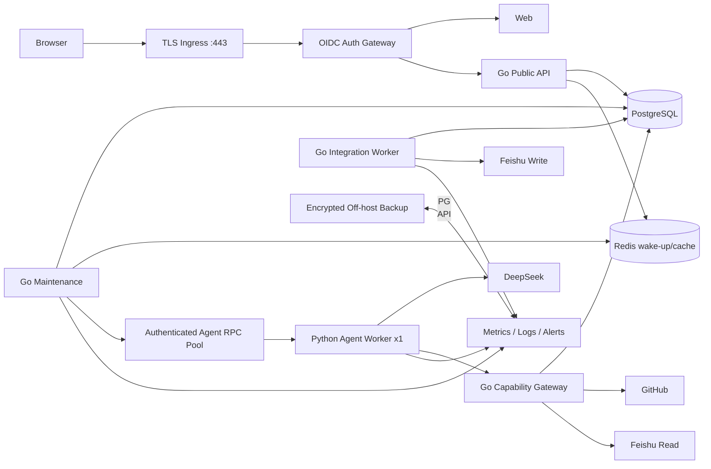
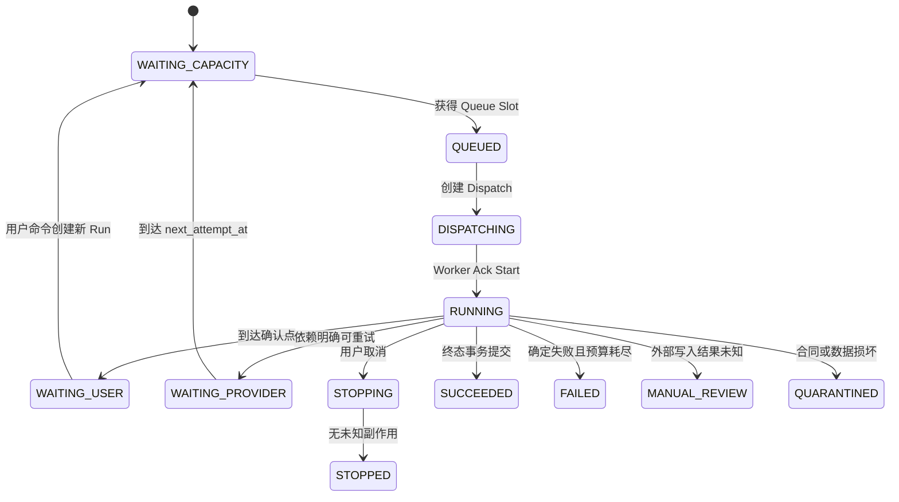
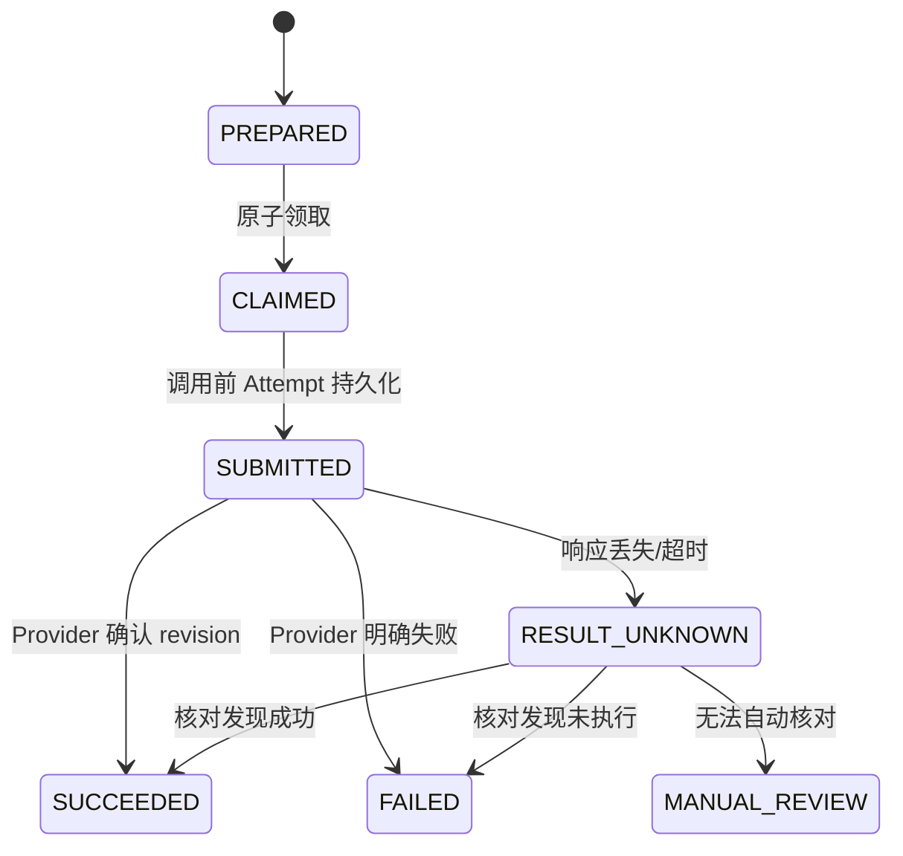

# PRD Agent P0 服务器部署闭环与容错兜底设计

> 状态：IN PROGRESS
> 日期：2026-07-29
> 目标部署档位：单机 2 vCPU / 2GB RAM / 40GB SSD
> 当前基线：`2ed5129`（Go Control Plane + Python Agent Direct RPC Core）
> 发布规则：本文全部 P0 完成并通过 Gate 0～9 后，才允许进入公网 Staging
> 上位设计：
> - `2026-07-28-feishu-github-rag-queue-architecture-design.md`
> - `2026-07-28-go-python-agent-boundary-migration-design.md`
> - `2026-07-28-go-python-direct-agent-rpc-pool-design.md`
> - `2026-07-27-m0-agent-core-step-10-production-profile-design.md`
> 配套测试：
> - `2026-07-27-m0-agent-core-step-10-production-profile-test-plan.md`
> - `2026-07-28-go-migration-remaining-framework-local-validation-plan.md`

> 当前阶段范围说明：少量用户稳定使用与 Agent 落地以
> `2026-07-29-agent-landing-p0-solution-design.md` 为实施基线。本文保留为企业身份、
> 通用 Provider、多租户、完整切流和长期生产加固目标；两者冲突时，当前 P0 以
> Agent Landing 方案为准，且不得违反 ADR-0001～0003。

## 实施状态（2026-07-29）

本轮已经完成并验证：

- 修复 Go 容器硬编码 `GOARCH=amd64` 导致 arm64 服务器镜像内运行 x86_64
  Maintenance 二进制的问题，并加入构建契约回归；
- 将 Admission、Dispatch、Cancel、Unknown Recovery 和 Outbox 拆为独立循环，
  增加 panic 隔离和有界 drain；
- Go Dispatcher 改为逐事件校验、持久化后再读取下一帧，流中断不再丢弃已提交进度；
- `UNKNOWN` Dispatch 恢复次数限制为 3，旧 Dispatch 在新恢复结果产生前保留，
  超预算进入 `QUARANTINED`，Run 进入有界失败终态；
- Python gRPC Server 为 Cancel 和 Health 固定保留控制线程；
- Staging/Production 对数据库、OIDC、Dev Principal、Secret 文件和数值配置安全关闭；
- `/api/v1/me` 纳入认证中间件；
- 本地和生产 Compose 增加 restart、资源/PID/日志限制及可实现的健康检查，
  Go API 不再直接暴露生产宿主机端口。

仍未完成、因此整体仍为 **NO-GO**：

- Agent RPC V2 双向 `EVENT_ACK`、内部 mTLS/Workload Identity；
- 完整 Go Product State/API 与现有 Web 合同；
- Capability Gateway、GitHub/Feishu Provider、Integration/Export Saga；
- 同源 OIDC Session/CSRF、Tenant Membership 与审计；
- Python → Go 数据投影、Shadow Read、切流和回滚工具；
- TLS Ingress、异机备份、指标告警、故障注入与 24 小时长稳 Gate。

## 0. 执行结论

当前仓库已经具备 Go Control Plane、PostgreSQL Run Admission、Lease/Fencing、
Direct Agent RPC、Python Remote LLM Runtime 和基础 SSE 投影，但还不是一个可部署
的完整产品。P0 闭环必须同时解决以下八个问题：

1. 修复 `go-maintenance` 实际发生的 `SIGSEGV`，并使任何后台进程退出后可自动恢复；
2. 把 Agent 事件从“流结束后批量保存”改为“逐事件确认后继续”，使 Attempt、
   Checkpoint、Evidence、Draft 和终态真正可恢复；
3. 补齐 Go Public API、Task/Confirmation 状态机和 Web 合同；
4. 实现 Go Capability Gateway、GitHub/Feishu Provider 和 Integration Worker；
5. 完成同源 Web/OIDC/SSE、Tenant Membership 和内部 RPC 身份认证；
6. 完成旧 Python Control Plane 到 Go-owned Schema 的投影、校验、切流和回滚；
7. 形成可在空服务器重复部署的生产清单，包括 TLS、Secret、备份、监控和资源限制；
8. 通过并发、故障注入、恢复、回滚和 24 小时长稳门禁。

P0 的目标不是“所有依赖永不失败”，而是：

- 任何失败都落到一个明确、持久、可解释的状态；
- 任何重试都受幂等键、Lease/Fencing 和预算约束；
- 任何结果未知的外部写入都不盲目重放；
- 任何身份、数据库、Schema 或高风险审计故障都安全关闭；
- Redis、浏览器连接、API/Worker 进程可以丢失而不丢业务事实；
- 降级不切换模型语义，不绕过 Grounding、Confirmation 或 Tenant 授权。

## 1. 范围与非目标

### 1.1 P0 范围

- 单台 Linux 服务器的完整部署与回滚；
- 一个 Go Public API；
- 一个 Go Maintenance；
- 一个 Go Integration Worker；
- 一个 Python Agent Worker，最大同时执行一个 Agent Run；
- PostgreSQL 作为唯一业务事实源；
- Redis 只用于唤醒、取消通知和短期缓存；
- 一个同源 Web + OIDC 登录入口；
- GitHub Repository Capability；
- Feishu PRD Catalog/Section 和 Export Capability；
- DeepSeek Remote LLM；
- 最小指标、结构化日志、告警、异机备份与恢复 Runbook。

### 1.2 非目标

- Kubernetes、自动扩缩容和多机高可用；
- 多 Python Worker 并行执行；
- 本地模型或模型自动降级；
- PostgreSQL/Redis 集群；
- 多 Provider 抽象的全面产品化；
- 全量历史 PRD 正文长期复制到 PostgreSQL；
- 在切流阶段同时运行两个事实写入者；
- 自动解决 `RESULT_UNKNOWN` 的所有 Provider 边缘情况。

## 2. 不可破坏的系统不变量

以下不变量优先于可用性和自动重试：

1. **单一事实源**：Go-owned PostgreSQL 是 Task、Run、Confirmation、Queue、
   Dispatch、Attempt、Binding、Export 和 Audit 的唯一事实源。
2. **单一写入者**：同一事实表在任意切流时刻只有一个 Active Writer。
3. **外部内容归属**：飞书拥有 Published PRD 正文，GitHub 拥有代码；数据库只保存
   控制面、版本观察、定位器、摘要、Evidence 和有保留期的 Working Draft。
4. **身份不可由请求声明**：Tenant、Owner、Role 和 Worker Identity 只能来自已验证
   的身份与内部映射，不能相信 Body/Header 中的自由值。
5. **提交必须持有当前 Fencing Token**：失去 Lease 的 Worker 不能提交 Attempt、
   Checkpoint、Evidence、Draft、终态或 Provider Intent。
6. **用户命令原子化**：
   `authorize → idempotency → version/state check → business write → event → outbox`
   在一个 PostgreSQL 事务中提交。
7. **外部调用不持有业务事务**：LLM、GitHub、飞书、OIDC、Webhook 和 RPC 等待期间
   不持有数据库行锁或长事务。
8. **结果未知不等于失败**：无法判断 Provider 是否执行时进入 `RESULT_UNKNOWN`，
   禁止自动重复创建或覆盖。
9. **生产不改变模型语义**：DeepSeek 不可用时等待或失败，不回退 Deterministic/
   Heuristic Model。
10. **Redis 可销毁**：清空 Redis 只能造成延迟，不能丢失 Run、取消、Outbox 或终态。
11. **公开事件白名单**：内部错误、Token、路径、完整正文和 External ID 不得自动
    进入 SSE、日志、Trace 或 Metrics。
12. **高风险操作审计失败关闭**：连接授权、导出、人工核对、权限变更和数据切流在
    Audit 不能提交时不执行外部副作用。

## 3. 目标部署架构



### 3.1 公开网络边界

- 服务器只公开 `80` 和 `443`；`80` 仅跳转 HTTPS；
- PostgreSQL、Redis、Go API、Maintenance、Integration 和 Python Agent 只在内部网络；
- `/` 路由到 Web，`/api/` 和 `/events/` 路由到 Go API；
- Web、普通 API 和 SSE 使用同一安全会话；
- 禁止直接暴露 Go API 的宿主机端口；
- Ingress 设置请求体、Header、连接数、SSE idle timeout 和上传大小上限。

### 3.2 进程职责

| 进程 | 职责 | 不允许 |
| --- | --- | --- |
| TLS/OIDC Gateway | TLS、OIDC Code+PKCE、Session、CSRF、同源代理 | 业务状态写入 |
| Web | 用户交互、命令幂等键生命周期、SSE Gap 恢复 | 保存 Provider Secret |
| Go API | 鉴权、短事务命令、Query、SSE | 模型调用、Provider 写入、长任务 |
| Go Maintenance | Admission、Dispatcher、Outbox、Recovery、Cleanup | 用户 HTTP |
| Go Integration | Sync、Export Saga、Webhook、Provider Reconciliation | Agent Prompt |
| Python Agent | LLM、Investigation、Grounding、Draft、Quality、Checkpoint | PostgreSQL、用户身份、Provider Secret |
| PostgreSQL | 业务事实、恢复、审计、目录和 Outbox | Published PRD 正文所有权 |
| Redis | 唤醒、取消提示、短缓存 | 容量、顺序、终态事实 |

## 4. 统一故障分类和动作

所有 Adapter 必须把错误映射为以下类别，禁止把原始 Provider 异常直接跨边界传播：

| 类别 | 含义 | 自动动作 | 最终兜底 |
| --- | --- | --- | --- |
| `VALIDATION` | 请求、版本、状态或合同不合法 | 不重试 | 返回稳定 4xx |
| `UNAUTHENTICATED` | 用户/服务身份无效 | 不重试 | 401，安全审计 |
| `FORBIDDEN` | Tenant/Binding/Scope 不允许 | 不重试 | 404/403，不泄露存在性 |
| `CAPACITY` | Queue、Pool、连接或速率饱和 | 有界等待或拒绝 | `WAITING_CAPACITY` + Retry-After |
| `TRANSIENT` | 明确未执行的网络/依赖临时失败 | 指数退避 + 抖动 | 达上限转等待/失败 |
| `DEFINITIVE_FAILURE` | Provider 明确返回失败 | 按策略有限重试 | `FAILED` 或 `REAUTH_REQUIRED` |
| `RESULT_UNKNOWN` | 请求可能已执行但响应未知 | 不盲目重放 | Reconcile，随后人工复核 |
| `LEASE_LOST` | Fencing/Lease 已失效 | 立即停止本地提交 | 丢弃结果，等待当前 Worker |
| `CANCELLED` | 用户停止或系统 drain | 停止新步骤 | `STOPPED` 或等待 Provider 核对 |
| `INCOMPATIBLE` | Schema/Checkpoint/Contract 不兼容 | 不自动从头执行 | `QUARANTINED` + 迁移/人工处理 |
| `CORRUPT` | Hash、Sequence、Payload 损坏 | 隔离数据 | `QUARANTINED` + P0 告警 |
| `FATAL_CONFIG` | Secret、环境、Schema 或安全配置错误 | 进程拒绝 Ready/启动 | 运维修复，不降级 |

### 4.1 统一退避

- 第 1～5 次：`2s, 5s, 15s, 60s, 5m`，加入 ±20% 抖动；
- Read Provider 最多自动重试 5 次；
- LLM Transport 每个 Model Attempt 最多 2 次，整个 Run 最多 3 个逻辑 Attempt；
- Dispatch `UNKNOWN` 最多自动恢复 3 次；
- Export 外部写入一旦 `RESULT_UNKNOWN`，自动创建重试次数为 0，只允许核对；
- 达到预算后进入 `FAILED_RETRYABLE`、`WAITING_PROVIDER`、`MANUAL_REVIEW`
  或 `QUARANTINED`，不得无限循环；
- 所有 `next_attempt_at`、`attempt_count`、`last_error_category` 持久化到 PostgreSQL。

## 5. P0-A：Maintenance 稳定性与进程兜底

### 5.1 立即止血

1. 为当前 `SIGSEGV` 建立固定回归：
   - 使用崩溃前相同的 Run/Dispatch/Outbox 数据；
   - 连续执行至少 10,000 个 Maintenance Cycle；
   - 保留 Go 版本、镜像 digest、core dump、完整 stack 和数据库快照；
   - 在 race、`checkptr=2` 和普通 Release Image 下复现。
2. 定位前禁止把 Maintenance Image 标记为生产候选。
3. Compose 为 API、Maintenance、Integration、Agent 和 Auth Gateway 配置
   `restart: unless-stopped`、启动退避和健康检查。
4. Maintenance 重启后只从 PostgreSQL 扫描恢复，不依赖进程内队列。

### 5.2 循环隔离

Maintenance 内部拆为五个独立、有界循环：

```text
admission promoter
dispatch supervisor
outbox publisher
unknown/recovery scanner
retention/cleanup
```

要求：

- 每个循环拥有独立 ticker、timeout、panic boundary 和指标；
- 一个循环失败只记录错误并退避，不阻止其他循环；
- `SIGSEGV` 等进程级故障由容器 Supervisor 重启；
- Dispatcher 不得阻塞 Cancel、Outbox 和 Recovery 循环；
- 每轮领取数量有上限，禁止一次查询产生无界 goroutine；
- SIGTERM 先停止新领取，再 drain 活动 RPC，最后释放连接；
- 超过 drain deadline 的 Run 只停止本进程，依靠 Lease expiry 接管。

### 5.3 启动恢复

Maintenance 启动顺序：

1. 验证 Schema 版本；
2. 获取单机 Maintenance Leader Lease；
3. 扫描过期 Outbox Claim；
4. 扫描 `RUNNING/STOPPING` 且 Lease 过期的 Run；
5. 扫描 `STARTED/RUNNING/UNKNOWN` Dispatch；
6. 重建 Redis 唤醒；
7. 才开始领取新 Run。

若任一步 PostgreSQL 写入失败，Maintenance 保持 Not Ready，不执行外部副作用。

## 6. P0-B：Direct Agent RPC、逐事件提交和取消

### 6.1 当前问题

当前 `agentpool.Reservation.Execute()` 将整个 stream 收集到内存，只有收到 EOF 后
Dispatcher 才应用事件。这会导致 Worker 在模型调用后崩溃时，已经产生的 Attempt、
Checkpoint 和 Evidence 全部丢失，并可能重复计费或重复工具调用。

### 6.2 V2 双向确认协议

新增向后兼容的 `AgentWorkerServiceV2.ExecuteRun(stream RunFrame)`，V1 只用于迁移期。

Go → Python Frame：

```text
START_RUN
EVENT_ACK(event_id, committed_sequence)
CANCEL_RUN
LEASE_LOST
DRAIN
```

Python → Go Frame：

```text
RUN_STARTED
MODEL_ATTEMPT_PLANNED
MODEL_ATTEMPT_FINISHED
CAPABILITY_PLANNED
EVIDENCE_APPENDED
CHECKPOINT_SAVED
DRAFT_SUBMITTED
RUN_COMPLETED
RUN_FAILED
```

协议规则：

1. 每个事件包含 `contract_version`、`dispatch_id`、`run_id`、`event_id`、
   `event_sequence`、`correlation_id`、`occurred_at`；
2. Python 发出事件后，必须等待 Go `EVENT_ACK` 才能越过对应持久化边界；
3. Go 在一个事务中完成 Inbox 去重、Lease/Fencing 校验、业务写入、公开事件和 Ack
   Sequence 更新；
4. 重复事件返回已有 Ack，不重复业务写入；
5. Sequence Gap、Hash 不同的同 ID 事件进入 `CORRUPT/QUARANTINED`；
6. Go 只有事务提交后才发送 Ack；
7. Python 重连后从 Go 返回的 `last_committed_sequence` 继续；
8. V1/V2 不允许同时处理同一个 Run。

### 6.3 Model Attempt

模型调用前：

1. Python 生成稳定 `attempt_key`、`request_hash`、Prompt/Model/Workflow Version；
2. 发出 `MODEL_ATTEMPT_PLANNED`；
3. Go 保存 `STARTED` 并 Ack；
4. Python 才调用 DeepSeek。

模型调用后：

- 成功：发送输出 Hash、Token Usage、Finish Reason、Provider Request ID，不发送隐藏推理；
- 明确失败：发送稳定 Error Category；
- 响应未知：发送 `RESULT_UNKNOWN`；
- Go Ack 后 Python 才进入下一步。

LLM 无业务外部写入，但有成本副作用。`RESULT_UNKNOWN` 可在剩余预算内最多受控重试一次，
必须使用新的 Provider Attempt ID、相同逻辑 Operation，并在 UI/审计中可见。

### 6.4 Capability 调用

- Read-only GitHub/Feishu Capability 在 `CAPABILITY_PLANNED` Ack 后调用；
- 请求固定 Binding、Revision、Path/Locator、Limit 和 Content Budget；
- 同 `capability_key` 的成功结果可从 Go Evidence/Tool Result 复用；
- Provider timeout 且读取结果未知时可安全重试，因为请求无写副作用；
- Export 不走 Agent Read Capability，必须进入 Integration Saga。

### 6.5 取消

取消采用“数据库事实 + 快速信号 + Fencing”三层机制：

1. API 先原子写 `cancellation_requested_at`、Task Event 和 Outbox；
2. 独立 Cancel Supervisor 立即通过 RPC 通知 Worker；
3. Redis Cancel 仅做加速，丢失后 Worker/Dispatcher 每 2 秒查数据库兜底；
4. Python gRPC Server 为 Execute 和 Control RPC 预留独立线程/async task，
   `max_inflight=1` 时仍能接收 Cancel；
5. Model/Capability/Loop 在调用前后检查 Cancellation Token；
6. 不可中断的 Provider Read 返回后不得继续下一节点；
7. 超过 hard cancel deadline，Go 关闭 stream、停止续租；后续 Worker 结果被 Fencing 拒绝；
8. 已发出的 Export 写入不能伪装成 STOPPED，进入 `RESULT_UNKNOWN` 核对。

### 6.6 Worker crash 和 stream 中断

```text
stream 中断
→ Dispatch = UNKNOWN
→ 不立即新建 Dispatch
→ 等待 Lease 过期或确认旧 Worker 已停止
→ 读取 last_committed_sequence + checkpoint
→ 使用更高 Fencing Token 创建下一 Dispatch Attempt
→ 复用已提交 Attempt/Evidence/Capability Result
```

恢复三次仍无法前进时进入 `QUARANTINED`，释放执行容量，保留人工 Retry/Fail 操作。

## 7. P0-C：Go Public API、状态机和 Web 合同

### 7.1 必须补齐的 API

```text
GET  /api/v1/health/live
GET  /api/v1/health/ready
GET  /api/v1/me
GET  /api/v1/tasks
POST /api/v1/tasks/from-message
GET  /api/v1/tasks/{task_id}
GET  /api/v1/tasks/{task_id}/runs
POST /api/v1/tasks/{task_id}/runs/{run_id}/stop
POST /api/v1/tasks/{task_id}/runs/{run_id}/retry
POST /api/v1/tasks/{task_id}/messages
POST /api/v1/tasks/{task_id}/outline/confirm
POST /api/v1/tasks/{task_id}/units/{unit_id}/confirm
POST /api/v1/tasks/{task_id}/revisions/approve
POST /api/v1/tasks/{task_id}/finalize
POST /api/v1/tasks/{task_id}/reopen
POST /api/v1/tasks/{task_id}/exports/feishu/preview
POST /api/v1/tasks/{task_id}/exports/feishu
GET  /api/v1/tasks/{task_id}/exports
GET  /api/v1/tasks/{task_id}/events
```

### 7.2 Go-owned 状态

新增或迁移：

- Requirement Brief；
- Outline Version / Outline Node；
- Confirmation Unit / Dependency；
- Section Version / Working Draft Version；
- Grounding Result / Claim-Fact Link；
- Quality Issue / Revision Plan；
- Finalization；
- Provider Connection / Binding；
- PRD Catalog / Source Revision / Section Locator；
- Export Intent / Export Attempt / Reconciliation；
- Tenant / User / Membership / Role；
- Audit Event / Security Event。

### 7.3 Run 状态机



规则：

- `WAITING_USER/WAITING_PROVIDER/MANUAL_REVIEW/QUARANTINED` 不占 Worker Slot；
- Queue Slot 是否保留由明确策略决定，不能依赖 Redis；
- 一个 Task 同时最多一个 Active Run；
- Task Version 只由成功业务命令或 Draft Commit 递增；
- Run 失败不能自动把 Task 标为完成；
- Published PRD 只有飞书确认成功后成立。

### 7.4 最小 Go-owned Schema

表名可以在实现前统一前缀，但以下事实和唯一约束不能省略：

| 表 | 核心事实/约束 |
| --- | --- |
| `control_tasks` | Tenant/Owner、状态、Version；所有查询包含 Tenant/Owner |
| `agent_runs` | Task、状态、预算、取消、重试时间；同 Task 只有一个 Active Run |
| `queue_slots` | Run 唯一；Global/Owner Admission 在同一事务判断和写入 |
| `command_idempotency` | Tenant/Owner/Operation/Key 唯一；保存 Request Hash 和响应定位 |
| `task_events` | `(task_id, sequence)` 唯一且连续；公开 Payload 单独生成 |
| `outbox_messages` | Message ID 唯一；Claim Lease、Attempt、Quarantine |
| `inbox_receipts` | Consumer/Message ID 唯一；防止重复消费 |
| `agent_dispatches` | `(run_id, attempt_no)` 唯一；含 UNKNOWN 和恢复预算 |
| `agent_event_inbox` | `(dispatch_id, event_id)` 与 `(dispatch_id, sequence)` 唯一；保存 Payload Hash/Ack |
| `model_attempts` | `(run_id, attempt_key)` 唯一；Planned/Finished/Unknown |
| `run_checkpoints` | `(run_id, sequence)` 唯一；Schema/Workflow Version、Payload Hash |
| `evidence` | Run/Source/Revision/Locator/Excerpt Hash 去重 |
| `working_draft_versions` | Task/Version 唯一；有保留期，不能冒充 Published PRD |
| `requirement_briefs` | Task/Version 唯一 |
| `outline_versions/nodes` | Task/Version、父子关系和 Sequence 约束 |
| `confirmation_units` | Outline/Sequence、状态、依赖；确认事实不可覆盖 |
| `section_versions` | Unit/Version、内容 Hash、Evidence 引用 |
| `grounding_results` | Unit/Draft Version、Claim/Fact/Evidence 关系 |
| `quality_results` | Document Version、Issue、Severity、Resolution |
| `finalizations` | Task/Document Version 唯一；满足全部确认和质量门禁 |
| `users/tenants/memberships` | Subject 映射和有效状态；邮箱不是授权主键 |
| `provider_connections` | Owner/Tenant、Provider、credential_ref、状态 |
| `provider_bindings` | 内部资源到外部资源的 Tenant-scoped 绑定 |
| `prd_catalog/source_revisions/locators` | 飞书目录、Revision 观察和原文定位 |
| `export_intents/export_attempts` | Preview 固定值、Saga 状态、Result Unknown/Reconcile |
| `audit_events` | Actor、Action、Target、Result、Correlation；不含正文/Secret |
| `migration_checkpoints` | Phase、Cursor、Source/Target Count、Hash、Canary Scope |

关键数据库约束：

- Active Run、活动 Queue Slot、Export Active Attempt 使用 partial unique index；
- Task Version、Lease/Fencing 和 Provider Revision 使用条件更新，更新 0 行即冲突；
- Event Sequence 在锁定 Task/Event Cursor 后分配；
- Agent Event Inbox 去重、事实写入、Task Event 和 Ack Sequence 在同一事务；
- Outbox Claim、Dispatch Claim、Export Claim 使用 `FOR UPDATE SKIP LOCKED` 和租约；
- 所有外键均保留 Tenant 一致性校验，不能只依赖应用层；
- Working Draft、Checkpoint、Evidence Excerpt 和 Audit 分别配置保留期；
- Schema Migration 记录应用支持的最小/最大版本，Readiness 不用普通业务查询替代。

### 7.5 API 错误和幂等

所有错误：

```json
{
  "error_code": "STABLE_CODE",
  "message": "safe user-facing message",
  "retryable": false,
  "correlation_id": "corr_xxx",
  "retry_after_seconds": null
}
```

- 所有写命令要求 `Idempotency-Key`；
- 所有改变 Task 的命令要求 `expected_task_version`；
- Web 为一次用户操作生成 Key，并保存到收到确定响应或用户明确放弃；
- 网络断开后使用同一 Key 重试；
- 同 Key 不同 Payload 返回 409；
- Idempotency 记录必须包含响应 Projection 或稳定 Resource ID。

### 7.6 SSE

- 鉴权后再建立连接；
- 支持 `Last-Event-ID` 和 `after_sequence`；
- 使用短 DB Poll，不长期持有事务；
- Redis 可用于 wake-up，失效时自动退化为 DB Poll；
- Sequence Gap 时客户端停止应用增量，重新获取 Task Snapshot；
- Cursor 过期返回 `EVENT_CURSOR_EXPIRED`；
- 每 15 秒心跳，不写业务事件表；
- 公开 Payload 逐事件白名单；
- API 滚动重启后客户端自动恢复。

## 8. P0-D：Capability、Provider 和外部写入 Saga

### 8.1 Capability Gateway

Go 实现：

```text
ReadRepositoryTree
ReadRepositoryFile
SearchRepository
SearchPrdCatalog
FetchPrdSections
CreateExportIntent
```

每次请求必须同时验证：

- 已认证 Worker Identity；
- 当前 Run Lease/Fencing；
- Tenant/Owner 与 Run 一致；
- Binding 属于 Tenant/Owner；
- Repository Revision 为不可变 Commit；
- PRD Source Revision 未失效且访问仍允许；
- Path/Prefix/Locator 在 Allowlist；
- 请求与响应大小、数量、超时在预算内。

### 8.2 Provider 错误隔离

- GitHub/Feishu Credential 只存在 Secret Store 或挂载 Secret；
- PostgreSQL 只保存 `credential_ref`；
- Python 永远拿不到 Token、App Secret 或任意 Provider URL；
- Provider Host 固定 Allowlist，禁止用户输入任意 URL/内网地址；
- 429 使用 Provider `Retry-After`，否则统一退避；
- 401/`invalid_grant` 进入 `REAUTH_REQUIRED`；
- 403/404 不自动改 Binding；
- Provider 原始响应先脱敏，再进入日志或稳定错误。

### 8.3 Feishu Export Saga



要求：

1. Preview 固定 Task Version、Draft Version、Mode、目标 Binding 和内容 Hash；
2. Execute 校验 Preview 未过期且目标 Revision 未变化；
3. 调用前保存 Provider Attempt 和 Idempotency Key；
4. Provider 支持幂等键时必须使用；
5. Create 响应丢失后先按幂等键、Binding 或安全元数据查询，禁止直接再 Create；
6. Overwrite 必须使用期望 Provider Revision，变化时返回 `RESOURCE_CHANGED`；
7. `RESULT_UNKNOWN` 在 UI 显示“正在核对”，禁止用户再次创建；
8. 自动核对失败进入人工复核，人工动作必须二次确认和审计；
9. 停止/删除本地 Task 不删除飞书文档。

### 8.4 PRD Catalog/RAG

- Webhook 事件增量更新，定时 revision sweep 兜底；
- Catalog 只保存授权元数据、Revision、Locator、摘要和 Embedding；
- 检索后必须重新校验 Access 与 Source Revision；
- 飞书不可用时：
  - 已有可信 Evidence 可继续；
  - 必需历史证据缺失则进入 `WAITING_PROVIDER`；
  - 不允许模型凭常识填充当前业务事实；
- Index 版本异常时回退到上一个已验证 Active Index，但原文仍从飞书读取；
- 回退动作记录指标和审计。

## 9. P0-E：OIDC、Tenant、内部身份和安全关闭

### 9.1 同源认证

采用 TLS/OIDC Gateway：

- Authorization Code + PKCE；
- 校验 state、nonce、issuer、audience、签名、expiry、nbf 和算法 Allowlist；
- 使用 `Secure`、`HttpOnly`、`SameSite=Lax` 的短期 Session Cookie；
- 写请求要求 CSRF Token；
- SSE 复用同源 Cookie；
- Logout 撤销 Session；
- `return_to` 只允许站内路径。

### 9.2 Go Principal

- Auth Gateway 通过受认证内部通道向 Go 传递 Subject/Session ID；
- Go 查询内部 User 和 Tenant Membership；
- 不相信用户提供的 `tenant_id`、`owner_id`、邮箱或 Role；
- 禁用用户后活动 Session 不能继续写；
- `/me` 和全部业务接口使用同一 Principal Middleware；
- 跨 Owner/Tenant 资源统一返回不可枚举错误。

### 9.3 Agent RPC 身份

- Go ↔ Python、Python ↔ Capability 使用 mTLS 或等价 Workload Identity；
- Worker ID 以证书/SPIFFE-like Identity 或签名 metadata 为准；
- Request Body Worker ID 只做一致性校验；
- 证书轮换支持 N/N+1 信任窗口；
- 无有效内部身份时，在任何数据库或 Provider 查询前拒绝。

### 9.4 配置安全失败

所有进程严格接受：

```text
local | test | staging | production
```

production/staging 必须拒绝：

- 缺少 Database DSN/Secret；
- Memory Store；
- Dev Principal；
- HTTP Provider/LLM URL；
- 任意 CORS；
- Debug；
- 明文 gRPC；
- 缺少 OIDC、CSRF、Session Secret；
- Schema 低于或高于支持范围；
- 本地/规则模型；
- Secret 文件权限过宽或为空。

Readiness 失败不应杀死 Liveness；但进程不得接收业务流量。

## 10. P0-F：数据投影、切流与回滚

### 10.1 原则

- 不做 Go/Python 对同一事实表的双写；
- 使用 Expand → Backfill → Shadow Read → Single Writer Cutover → Contract；
- 每一步可暂停、可重复、可审计；
- 回滚应用，不回滚已经确认的外部事实；
- 切流以 Tenant 或固定 Canary Scope 为最小单位。

### 10.2 阶段

#### Phase 1：Expand

- 新增 Go-owned 表、索引、约束和 Projection Cursor；
- 旧 Python 仍是 Writer；
- 新字段均可空或有安全默认；
- Readiness 验证支持的 Schema 范围。

#### Phase 2：Backfill

- 按主键范围批量读取旧表；
- 写入 Go 表使用 Upsert 和稳定 Source Hash；
- 持久化 `backfill_cursor`、批次计数、失败原因；
- 中断后从游标继续；
- 每个 Tenant 输出 source/target count、Hash 和孤儿记录。

#### Phase 3：Shadow Read

- 用户响应仍来自旧路径；
- Go Projection 在后台读取同一 Task；
- 比较字段、枚举、Task Version、Event Sequence、Owner/Tenant、Idempotency；
- 正文只比较 Hash，不进入日志；
- 任一 P0 mismatch 阻止切流。

#### Phase 4：Drain

- 停止创建新的旧 Python Run；
- 等待活动 Run 到 WAITING_USER/终态，或显式迁移；
- 记录不可迁移 Checkpoint；
- 确认无两个 Writer。

#### Phase 5：Single Writer Cutover

- 单个 Canary Tenant 切换 Go Command Writer；
- Web/API/SSE 同时指向 Go；
- 旧 Python 只读；
- 观察错误率、Mismatch、Queue、Unknown 和 Provider Attempt；
- 达阈值自动停止扩大范围。

#### Phase 6：Rollback

触发条件：

- 5xx/409 非预期显著升高；
- Tenant/Owner mismatch；
- Event Gap；
- Idempotency replay mismatch；
- `UNKNOWN/QUARANTINED` 超阈值；
- 数据 Hash 不一致；
- Maintenance/Integration 反复崩溃。

动作：

1. 停止新 Go 命令；
2. Drain Go Dispatcher；
3. 保留 Go 已提交事实和飞书结果；
4. 运行反向 Projection 或 Compatibility Read；
5. 将未开始的新命令切回旧入口；
6. 不自动重放未知 Export；
7. 完成一致性检查后再恢复旧 Writer。

如果旧路径无法理解 Go 已产生的新状态，则不能自动回滚 Writer，只能进入
`SAFE_HALT`，由兼容工具完成投影后恢复。

#### Phase 7：Contract

- 只有 N-1 实例全部退出、回滚窗口结束、备份验证成功后执行；
- 删除旧字段/表前生成最终归档和 Hash；
- Contract Migration 必须是单独发布动作。

## 11. P0-G：生产清单、资源、备份和观测

### 11.1 完整服务

```text
ingress
auth-gateway
web
go-migrate
go-api
go-maintenance
go-integration
python-agent
postgres
redis
backup-agent
```

### 11.2 容器基线

- 固定 Image Digest，不使用浮动 Tag；
- 非 root、只读根文件系统、`no-new-privileges`、drop all capabilities；
- Secret 通过只读文件挂载，不进入环境转储和构建上下文；
- 明确 healthcheck、startup、readiness、restart policy；
- 日志轮转和最大磁盘占用；
- 内部网络分段；
- 只有 Ingress 暴露端口；
- 临时目录 `noexec,nosuid`；
- 镜像扫描、SBOM 和依赖锁定。

### 11.3 2GB 内存预算

| 组件 | Memory Limit |
| --- | ---: |
| PostgreSQL | 512 MB |
| Redis | 128 MB |
| Go API | 128 MB |
| Go Maintenance | 128 MB |
| Go Integration | 96 MB |
| Python Agent | 384 MB |
| Web/Auth/Ingress | 256 MB |
| Backup/OS/余量 | 416 MB |

要求：

- Python Agent 并发固定为 1；
- PostgreSQL 总连接上限按所有进程预算计算，默认不超过 20；
- Redis 设置 maxmemory 和 noeviction，但业务不依赖持久化；
- 达内存/连接上限时使用 Backpressure，不创建无界线程/goroutine；
- 80% 内存、80% 磁盘、连接池等待、Queue 增长触发告警；
- 磁盘达到 90% 时停止新 Run 和大正文写入，保留读、取消和运维操作。

### 11.4 备份与恢复

- PostgreSQL 每日加密 Base Backup；
- WAL 至少每 5 分钟上传异机存储；
- 目标 RPO ≤ 15 分钟，RTO ≤ 4 小时；
- 备份保留：7 个日备、4 个周备、3 个月备；
- 每月在隔离环境恢复一次；
- 恢复验证 Schema、行计数、Hash、Tenant 隔离、活动 Run 和 Export Unknown；
- Redis 不做业务恢复，重建后由 PostgreSQL 恢复唤醒；
- Secret 独立备份和轮换，不与数据库备份打包；
- 备份失败超过 24 小时阻止生产发布。

### 11.5 最小观测

必须提供：

- API latency/status；
- DB pool used/wait/timeout；
- Queue depth、Waiting Capacity、Oldest Run Age；
- Dispatch running/unknown/quarantined；
- Lease lost/heartbeat failure；
- LLM latency/token/error；
- Capability latency/status；
- Export result_unknown/manual_review；
- SSE connection/gap/reconnect；
- Process restart、OOM、disk、backup age。

Label 禁止包含 Tenant、Owner、邮箱、仓库名、URL、正文、Token 或 External ID。

P0 告警：

- Maintenance/Integration/Agent 进程退出；
- Schema Not Ready；
- DB 不可用；
- `RESULT_UNKNOWN`；
- `QUARANTINED/CORRUPT`；
- Tenant 授权拒绝异常增长；
- Queue Oldest Age 超过 SLO；
- 磁盘 > 90%；
- 最近备份 > 24 小时；
- Secret/正文 Marker 泄漏。

### 11.6 Probe 与依赖降级

| 服务 | Liveness | Readiness 必需 | 非必需依赖失败 |
| --- | --- | --- | --- |
| Ingress | 进程/监听正常 | TLS 证书和路由加载成功 | 后端失败返回安全 503 |
| Auth Gateway | 事件循环正常 | Session Secret、OIDC/JWKS 可用或缓存仍有效 | 新登录关闭；有效短期会话按缓存策略继续 |
| Web | 静态/Node 进程正常 | 关键资源可读 | API 失败显示维护态 |
| Go API | HTTP 事件循环正常 | PostgreSQL、Schema、Identity/Audit 配置 | Redis/Agent/Provider 失败进入对应降级模式 |
| Maintenance | 主循环 watchdog 正常 | PostgreSQL、Schema、Leader Lease | Redis/Agent 失败继续扫描并告警 |
| Integration | 主循环 watchdog 正常 | PostgreSQL、Schema、Provider Secret Ref | Provider 网络失败进入 NO_EXPORT/WAITING_PROVIDER |
| Python Agent | gRPC/控制线程正常 | LLM 配置、RPC Identity、Capability Channel | DeepSeek 临时失败报告 NO_AGENT，不退出进程 |
| PostgreSQL | 数据库进程正常 | 读写、目标 Schema、磁盘安全水位 | 备份陈旧告警并阻止发布 |
| Redis | PING | PING | 完全不可用时由 PostgreSQL 扫描兜底 |

禁止把外部 Provider 短时不可用等同于 API Liveness 失败，避免所有组件一起重启形成
故障风暴；但相关 Worker 不得继续领取无法完成的新工作。

## 12. 完整容错与人工兜底矩阵

| 故障 | 自动处理 | 用户可见状态 | 人工兜底 | 数据保证 |
| --- | --- | --- | --- | --- |
| Ingress 退出 | Supervisor 重启 | 短暂不可访问 | 回滚上一镜像 | 内部事实不变 |
| OIDC 不可用 | 拒绝新登录；不伪造身份 | 登录服务暂不可用 | 检查 Provider/证书 | 不创建匿名业务 |
| API 退出 | Supervisor 重启；客户端同 Key 重试 | 操作重试提示 | 回滚 API | 命令原子幂等 |
| PostgreSQL 不可用 | 所有写失败关闭；Worker 停止提交 | 服务维护中 | 恢复 DB/PITR | 不执行未记录副作用 |
| Redis 清空/不可用 | DB Poll/Outbox 扫描 | 进度可能延迟 | 重建 Redis | 业务事实不丢 |
| Maintenance 退出 | Supervisor 重启；启动恢复扫描 | Run 暂停排队 | 查看 core/回滚镜像 | Lease 后可接管 |
| Python Worker 退出 | Dispatch UNKNOWN；Lease expiry 恢复 | 正在恢复 | 重启/隔离 Run | 只从 Ack 边界恢复 |
| Agent RPC 中断 | 不立即重放；等待 Recovery | 正在恢复 | Quarantine/Retry | Fencing 拒绝旧结果 |
| Cancel 信号丢失 | DB Poll 检查 cancellation | STOPPING | Hard fence | 不提交取消后的新结果 |
| DeepSeek 429/5xx | 有界退避 | 等待模型服务 | 人工 Retry/Fail | 不切换模型 |
| DeepSeek 响应未知 | 最多受控重试一次 | 模型调用恢复中 | 人工终止 | 业务事实未伪造 |
| GitHub 读取失败 | 固定 Revision 重试 | 等待代码源 | 更新授权/Retry | 不生成无证据事实 |
| 飞书读取失败 | Retry/WAITING_PROVIDER | 等待飞书 | 更新授权/Retry | 不用缓存冒充最新原文 |
| Feishu Create 响应丢失 | RESULT_UNKNOWN + Reconcile | 正在核对导出 | 人工确认 Binding | 不盲目重复创建 |
| Feishu Revision 变化 | 拒绝覆盖 | 文档已变化 | 用户重新 Preview | 不覆盖人工修改 |
| Provider Token 失效 | REAUTH_REQUIRED | 需要重新授权 | 用户重连 | 不无限 Refresh |
| SSE 断线 | Last-Event-ID 重连 | 自动恢复 | Snapshot Reload | Event 可重放 |
| SSE Gap/Cursor 过期 | 停止增量并拉快照 | 自动刷新 | 手动刷新 | 不错误应用缺口 |
| Outbox Publish 后进程退出 | 重发 | 无感 | Quarantine 异常消息 | Inbox 幂等 |
| Schema 不兼容 | Not Ready | 维护中 | 回滚/执行迁移 | 不以错误 Schema 写入 |
| Checkpoint 不兼容 | QUARANTINED | 需要人工处理 | 迁移或从业务边界新 Run | 不静默从头执行 |
| Event Payload 损坏 | CORRUPT/QUARANTINED | 任务暂停 | 数据修复 Runbook | 不跳过 Sequence |
| 磁盘 80% | 告警和清理可删缓存 | 无感 | 扩容/清理 | 不删业务事实 |
| 磁盘 90% | 停止新 Run/大写入 | 容量维护 | 扩容/恢复 | 保留读和取消 |
| 备份失败 | 告警并阻止发布 | 无直接影响 | 修复备份 | 不声称具备 DR |
| Audit Store 失败 | 高风险写失败关闭 | 操作暂不可用 | 恢复 Audit | 外部副作用为 0 |
| Secret 丢失/权限错误 | 进程 Not Ready | 相关功能不可用 | 恢复/轮换 Secret | 不回退明文配置 |
| 新版本错误率超阈值 | 停止扩大 Canary | 服务降级/暂停 | 应用回滚 | Expand Schema 保持兼容 |

## 13. 运行模式

| 模式 | 触发 | 允许 | 禁止 |
| --- | --- | --- | --- |
| `NORMAL` | 所有核心依赖 Ready | 全功能 | 无 |
| `NO_AGENT` | Worker/LLM 不可用 | 读、命令入队、取消 | 执行新 Run |
| `NO_PROVIDER` | GitHub/Feishu Read 不可用 | 无关 Task、已有可信 Evidence | 需要缺失 Evidence 的生成 |
| `NO_EXPORT` | Feishu Write 不可用 | PRD 生成确认 | 新 Export 执行 |
| `DRAINING` | 发布/关机 | 读、已有 Run 收尾 | 新 Dispatch |
| `READ_ONLY` | 运维切流或磁盘保护 | 安全查询、导出状态查询 | 用户写命令 |
| `MANUAL_REVIEW` | Provider 结果未知 | 核对和审计操作 | 自动重放外部写入 |
| `SAFE_HALT` | DB/Schema/Identity/Audit/Corruption | Liveness、运维诊断 | 全部业务写和外部副作用 |

模式切换必须由明确依赖状态或运维命令触发、持久化并产生审计，不能由单个请求
临时决定。

## 14. 实施切片

### Slice 0：冻结与止血

- 停止把 Go profile 视为生产候选；
- 固定 SIGSEGV 数据和镜像回归；
- 加入 restart/healthcheck；
- 增加 UNKNOWN/Quarantine 重试上限。

### Slice 1：Maintenance 修复

- 修复 SIGSEGV；
- 拆分非阻塞循环；
- 启动恢复、drain、leader lease；
- 10,000 cycle + crash restart 测试。

### Slice 2：Agent RPC V2

- 双向 Frame/Ack；
- 逐事件事务提交；
- Attempt Planned；
- checkpoint resume、cancel、lease lost；
- V1/V2 feature flag 和兼容测试。

### Slice 3：Go Product State/API

- 迁移完整 Task/Confirmation/Quality/Finalize/Reopen；
- 补齐全部 API；
- OpenAPI Snapshot 和 Web types；
- 命令幂等、Version、公开事件白名单。

### Slice 4：Capability/Provider

- Capability Server；
- GitHub fixed-revision reads；
- Feishu Catalog/Section；
- ACL、size/timeout/error contract；
- Fake Provider 故障矩阵。

### Slice 5：Integration/Export

- Connection/Binding；
- Export Intent/Attempt/Saga；
- Result Unknown Reconcile；
- Webhook 去重和 Revision Sync；
- 人工复核 UI/Runbook。

### Slice 6：Identity/Web/SSE

- TLS/OIDC Gateway；
- Tenant Membership；
- CSRF/Session；
- mTLS/workload identity；
- 同源 SSE 和 Gap recovery。

### Slice 7：Data Cutover

- Expand/Backfill；
- Shadow Compare；
- Drain；
- Canary Single Writer；
- 回滚演练；
- Contract 延后。

### Slice 8：Production Manifest/DR

- 完整 Compose；
- 资源/网络/Secret；
- 指标/告警/日志轮转；
- 异机备份/PITR；
- 空服务器部署和隔离恢复。

### Slice 9：发布门禁

- P0 CI 零 Skip；
- Browser E2E；
- 故障注入；
- 2 vCPU/2GB 24 小时长稳；
- Go/No-Go 审批。

## 15. 验收 Gate

### Gate 0：静态与供应链

- Go test/race/vet；
- Python test/typecheck/lint；
- Web test/typecheck/build；
- Buf lint/generate/diff；
- 无高危未豁免依赖；
- 镜像非 root、SBOM、Digest 固定。

### Gate 1：配置与启动

- production 缺任一必需 Secret 时拒绝启动；
- 未知 Environment 拒绝；
- Memory Store/Dev Principal/明文 RPC 拒绝；
- Schema 不兼容 Not Ready；
- 日志不包含 Secret。

### Gate 2：数据库与命令

- 空库完整迁移；
- N-1 Expand；
- Task/Event/Outbox 原子；
- 并发 Version/Idempotency；
- Queue Admission 公平且 Redis 可清空。

### Gate 3：Agent 执行

- Event Ack 后才继续；
- Worker crash 从最后 Ack 恢复；
- stale fencing 写入 0 行；
- Attempt/Evidence/Checkpoint/Draft 不重复；
- Cancel 在模型、Capability 和节点间生效。

### Gate 4：API/Web/SSE

- 全 API 合同兼容；
- 登录、创建、澄清、确认、修订、完成、重开；
- SSE 断线、Gap、Cursor Expired；
- 相同命令响应丢失后同 Key 重试。

### Gate 5：Provider

- GitHub Revision/ACL；
- Feishu Catalog/Section access revalidation；
- 401/403/404/429/500/timeout；
- Create success-then-response-lost 只有一个远程文档；
- Result Unknown 人工复核。

### Gate 6：安全

- OIDC state/nonce/PKCE/signature/issuer/audience；
- Tenant/Owner 隔离；
- mTLS Worker Identity；
- CSRF/CORS/SSRF；
- Prompt Injection 不突破 Capability；
- 日志/SSE/DB/Queue Secret Marker 为 0。

### Gate 7：故障恢复

- Kill API/Maintenance/Integration/Agent；
- Redis flush；
- DB 短暂中断；
- RPC stream 中断；
- Provider timeout；
- Outbox publish/mark 边界 Kill；
- 所有最终状态与矩阵一致。

### Gate 8：切流与回滚

- Backfill count/hash 零 mismatch；
- Shadow Read 零 P0 mismatch；
- Canary Writer 单一；
- 活动 Run drain；
- 回滚不丢已提交事实、不重复 Export。

### Gate 9：部署与长稳

- 空服务器一键部署；
- 只公开 80/443；
- 2 vCPU/2GB 无 OOM；
- 24 小时 Run/Provider/SSE 混合负载；
- Queue、连接、内存、磁盘稳定；
- 最近备份成功且隔离恢复通过。

## 16. Go/No-Go 标准

### Go

- 全部 P0 Gate 通过，标准 CI 零 Skip/XFail；
- Maintenance 不再崩溃，长稳期间进程异常退出为 0；
- 任何 Worker/Redis/API 重启均不丢业务事实；
- `RESULT_UNKNOWN` 不产生重复飞书文档；
- Tenant/Owner/Worker 越权测试全部拒绝；
- 数据切流 Hash 零 mismatch；
- 备份 RPO ≤ 15 分钟、恢复 RTO ≤ 4 小时；
- 资源使用在预算内；
- 每条 P0 告警有已演练 Runbook。

### No-Go

任一情况直接阻止发布：

- 未解释的进程崩溃、panic、SIGSEGV 或 OOM；
- 生产仍允许 Memory Store、Dev Principal、明文内部 RPC或规则模型；
- Web 与 Go API 合同不一致；
- Provider Result Unknown 会自动重复写入；
- Event 仍在 stream EOF 后批量提交；
- P0 测试存在 Skip/XFail；
- Tenant/Owner mismatch、Event Gap、Idempotency mismatch；
- 最近 24 小时无有效备份；
- 回滚依赖删除或覆盖已确认外部事实；
- 任何 Secret/正文进入公开日志、Metrics、SSE 或 Broker。

## 17. 发布后的 P1

只有 P0 稳定后再处理：

- 多 API 实例；
- 多 Python Worker；
- 更完整的 OpenTelemetry；
- 自动证书/Secret 轮换；
- 更长数据保留和归档；
- 供应商级 SLO Dashboard；
- 多模型 Provider；
- 自动化容量扩缩；
- PostgreSQL 高可用。

这些 P1 不得被用来推迟 P0 的单机正确性、幂等、恢复、安全和回滚闭环。
