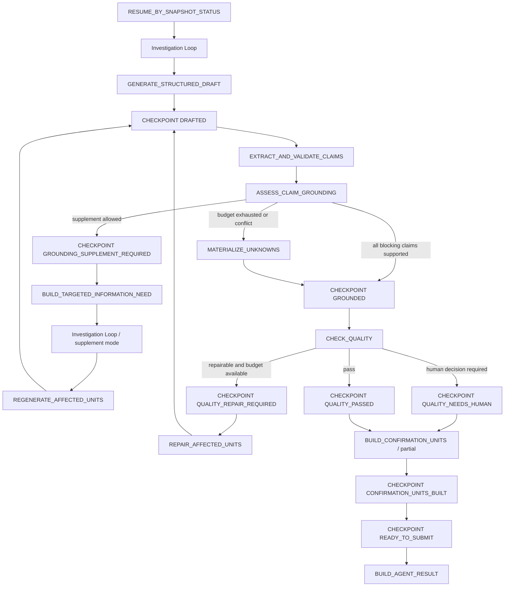
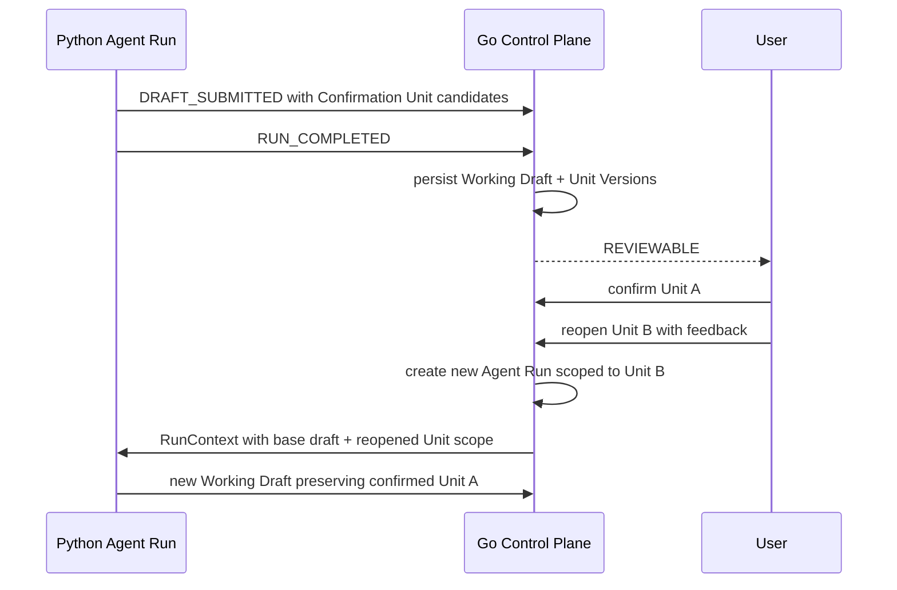

# LangGraph 剩余高级 Loop 实现方案

> 状态：PROPOSED
>
> 日期：2026-07-30
>
> 前置设计：[LangGraph 受控 Agent Loop 设计方案](./2026-07-30-langgraph-controlled-agent-loop-design.md)
>
> 目标版本：`agent-runtime.v3` / `agent-loop-snapshot.v2`

## 1. 结论

现有 `LangGraphAgentLoop` 已完成受控 Investigation Loop、运行中事件 ACK、
四个 checkpoint snapshot 边界以及按 snapshot `status` 恢复。剩余工作不应
继续堆叠在单个 `runtime.py` 中，而应实现三个相互约束的 Loop：

1. **Claim Grounding / Targeted Supplement Loop**：检查 Working Draft 中的
   当前实现事实，只对关键缺口进行一次定向补查。
2. **Quality Repair Loop**：只修复结构、表达和可追踪性问题；任何内容变化
   都必须重新进入 Grounding。
3. **Confirmation Unit Revision Loop**：当前 Agent Run 只生成可独立确认的
   Confirmation Unit；用户确认和重新打开由 Go Control Plane 持久化，
   重新打开后创建新的 Agent Run。

目标主图：



高级 Loop 不改变以下所有权：

- Go 继续拥有 PRD Task、Agent Run、Lease/Fencing、Queue Slot、Working Draft
  版本、Confirmation Unit 决策、发布和 PostgreSQL。
- Python 只拥有单次 Agent Run 内的 Draft、Claim、Grounding、Quality 和
  Confirmation Unit 候选计算。
- Python 不直连 PostgreSQL，不持有 GitHub、Feishu 或模型供应商之外的
  Control Plane Credential。
- 用户等待不会占用 Python Worker；用户重新打开 Confirmation Unit 时由 Go
  创建新的 Agent Run。

## 2. 范围

### 2.1 本设计实现

| 能力 | 当前状态 | 本设计目标 |
| --- | --- | --- |
| 结构化 Working Draft | 只有 Markdown | Section、Claim、Unknown、Unit 全部结构化 |
| Claim Grounding | 未实现 | 确定性引用校验 + 有界模型支持性判断 |
| Targeted Supplement | 未实现 | 最多一次，只调查阻塞 Claim |
| Quality Check | 只有基础 Markdown Policy | 确定性检查 + 有界模型检查 |
| Quality Repair | 未实现 | 最多一次，受 invariant guard 约束 |
| 多 Confirmation Unit | 未实现 | Go 持久化逐 Unit 决策，重开创建新 Run |
| 高级状态恢复 | 只到 `READY_TO_SUBMIT` | 所有高级阶段均有权威 snapshot status |
| Eval 和灰度 | 未实现 | shadow/enforce 两阶段发布 |

### 2.2 明确不实现

- Python 直连 `langgraph-checkpoint-postgres`；
- 跨用户等待的 LangGraph `interrupt()`；
- 并行 Grounding、并行 Tool Call 或多 Agent；
- 自动修改已经确认且未重新打开的 Confirmation Unit；
- 无预算的自我反思、补查或修复；
- 将推理过程、完整模型响应或 Credential 写入 checkpoint；
- 用 PostgreSQL 替代 Feishu Published PRD 或 GitHub Repository Snapshot。

原生 Remote Checkpointer 和短生命周期工具审批 interrupt 仍是后续基础设施
能力，不是完成本设计三个业务 Loop 的前置条件。

## 3. 设计原则

### 3.1 所有 Loop 共用一个 Agent Run 预算

Investigation、Supplement、Grounding 和 Quality 不得各自重新获得完整预算。

```text
run_token_usage
  = investigation_tokens
  + draft_tokens
  + grounding_tokens
  + supplement_tokens
  + quality_tokens
  + repair_tokens

run_tool_calls
  = initial_investigation_calls
  + supplement_calls
```

任一子图只能消费剩余预算。模型输出不能修改预算。

### 3.2 Snapshot status 决定重启入口

`snapshot.status` 是重启后的唯一入口选择依据。`phase` 只用于进程内调试，
不能改变恢复节点。

未知 status、schema 不兼容、计数回退、集合缩小、无法由匹配 Draft receipt
解释的 Task Version 漂移或 Repository Revision 漂移必须产生：

```text
RUN_FAILED(CHECKPOINT_INCOMPATIBLE, retryable=false)
```

不能静默从头执行。

### 3.3 写入外部状态前必须具备稳定幂等身份

| 对象 | 稳定身份 |
| --- | --- |
| Model Attempt | `{run_id}:{operation}:{generation_or_round}` |
| Proposed Action | action signature |
| Evidence | source/revision/locator/excerpt hash |
| Checkpoint | run ID + monotonic sequence + content hash |
| Draft | run ID + draft generation |
| Confirmation Unit Version | draft ID + unit key + content hash |
| Confirmation Decision | unit version ID + idempotency key |

### 3.4 任何修复都不能绕过 Grounding

Quality Repair 修改正文后必须回到：

```text
DRAFTED -> EXTRACT_AND_VALIDATE_CLAIMS -> ASSESS_CLAIM_GROUNDING
```

不得从 `REPAIR_DRAFT` 直接进入 `CHECK_QUALITY`。

### 3.5 大状态先外置，再保存 checkpoint

`DRAFTED`、Grounding 和 Repair 不能依赖只存在于 Python 内存中的正文，也
不能把多代 Draft 全文塞进 checkpoint。v3 增加一个 Go-owned、短期保留的
技术性 Run Artifact Store：

```text
RUN_ARTIFACT_SAVED(DRAFT_BUNDLE, artifact_key, content_hash, content)
  -> Go durable ACK
  -> CHECKPOINT_SAVED(DRAFTED, artifact_key + content_hash)
```

规则：

- Artifact 类型至少包括 `DRAFT_BUNDLE`、`GROUNDING_REPORT`、
  `QUALITY_REPORT` 和 `UNIT_PATCH`；
- Artifact 使用稳定 key：
  `{run_id}:{artifact_type}:{generation_or_round}`；
- 同一个 key 只能重放完全相同的 content hash；
- snapshot 只保存 artifact key、hash、generation 和最小路由状态；
- Dispatcher 重派时将 snapshot 引用的 artifact 随 AgentRunInput 返回；
- Artifact 只服务活动恢复和有界审计 retention，不成为 Published PRD；
- 孤立 artifact 可以由 TTL 清理；
- 正常 checkpoint 目标继续小于 64KB。

当前 v2 `READY_TO_SUBMIT` snapshot 内嵌 exact markdown 是过渡兼容行为。v3
启用 Run Artifact 后，`READY_TO_SUBMIT` 也只保存 artifact reference 和
Draft hash。

建议表结构：

```text
go_run_artifacts
  run_id
  artifact_key
  artifact_type
  generation
  request_hash
  content
  content_hash
  created_at
  expires_at
  PRIMARY KEY(run_id, artifact_key)
```

`request_hash` 用于确认孤立 artifact 属于本次相同模型输入。相同 key 但
request hash 或 content hash 不同必须拒绝。

### 3.6 重启输入必须补齐 Evidence 和 Artifact

当前 `AgentRunInput` 只包含 checkpoint blob，无法在高级 Loop 重启后重新读取
完整 Evidence 或 Draft Artifact。v3 扩展：

```protobuf
message RunArtifact {
  string artifact_key = 1;
  string artifact_type = 2;
  int64 generation = 3;
  string request_hash = 4;
  string content_hash = 5;
  bytes content = 6;
}

message AgentRunInput {
  // existing fields...
  repeated EvidenceItem resume_evidence = 12;
  repeated RunArtifact resume_artifacts = 13;
  RevisionScope revision_scope = 14;
  SubmittedDraftReceipt resume_draft = 15;
}
```

```protobuf
message RevisionScope {
  string base_draft_id = 1;
  string base_draft_hash = 2;
  repeated string reopened_unit_keys = 3;
  repeated string immutable_unit_keys = 4;
  string user_feedback = 5;
}

message SubmittedDraftReceipt {
  string draft_key = 1;
  string content_hash = 2;
  int64 task_version = 3;
}
```

Go 在 Dispatcher 构造 ExecuteRun 请求时：

- 返回当前 Run 已持久化的 Evidence，受 `max_evidence_items` 和总字节限制；
- 返回当前 Run 未过期的 Artifact，受类型白名单和总字节限制；
- Python 根据 snapshot 中的 ref/hash 选择所需对象；
- snapshot 引用不存在或 hash 不匹配时返回 `CHECKPOINT_INCOMPATIBLE`；
- 不允许 Python 使用另一个 Run 的 Evidence 或 Artifact。
- 如果 Draft 已 ACK、Run terminal event 尚未 ACK，Go 返回匹配的
  `resume_draft`，Python/Worker 不再重复生成内容，只完成 terminal event。

## 4. 结构化领域模型

### 4.1 DraftBundle

模型不再只返回 Markdown，而是返回结构化 DraftBundle：

```python
@dataclass(frozen=True)
class DraftBundle:
    schema_version: str
    generation: int
    units: tuple["DraftUnit", ...]
    claims: tuple["Claim", ...]
    unknowns: tuple["Unknown", ...]
    markdown: str
```

```python
@dataclass(frozen=True)
class DraftUnit:
    unit_key: str
    title: str
    markdown: str
    order: int
    depends_on: tuple[str, ...]
```

规则：

- `unit_key` 由 Python 根据规范化标题和预定义 PRD section type 生成，模型
  不能直接决定持久化 ID。
- `generation` 只允许单调递增。
- 总 Markdown 必须等于各 Unit 按 order 的确定性渲染结果。
- Targeted Supplement 或 Quality Repair 只允许返回 Unit Patch，不允许返回
  无边界的完整替换。

### 4.2 Claim

```python
class ClaimType(StrEnum):
    USER_REQUIREMENT = "USER_REQUIREMENT"
    CURRENT_STATE = "CURRENT_STATE"
    CONSTRAINT = "CONSTRAINT"
    PROPOSED_BEHAVIOR = "PROPOSED_BEHAVIOR"
    ACCEPTANCE_CRITERION = "ACCEPTANCE_CRITERION"
    ASSUMPTION = "ASSUMPTION"


class ClaimCriticality(StrEnum):
    BLOCKING = "BLOCKING"
    IMPORTANT = "IMPORTANT"
    INFORMATIONAL = "INFORMATIONAL"


@dataclass(frozen=True)
class Claim:
    claim_id: str
    unit_key: str
    claim_type: ClaimType
    criticality: ClaimCriticality
    statement: str
    evidence_refs: tuple[str, ...]
    requirement_refs: tuple[str, ...]
    trace_to_claim_ids: tuple[str, ...]
    supersedes_claim_id: str | None
```

`claim_id` 由以下内容计算：

```text
sha256(run_id, draft_generation, unit_key, claim_type, normalized_statement)
```

Grounding Requiredness：

| Claim type | 必须 Repository/PRD Evidence | 无 Evidence 时 |
| --- | --- | --- |
| `CURRENT_STATE` | 是 | Supplement 或 Unknown |
| `CONSTRAINT` | 是，除非来源是明确用户约束 | Supplement、Conflict 或 Unknown |
| `USER_REQUIREMENT` | 否；使用独立 requirement ref | 缺少 requirement ref 时拒绝 |
| `PROPOSED_BEHAVIOR` | 否 | 必须明确为目标态 |
| `ACCEPTANCE_CRITERION` | 否 | 必须追踪到 Requirement/Proposed Behavior |
| `ASSUMPTION` | 否 | 必须显式出现在待确认项 |

用户请求不是 Repository/PRD Evidence，不能伪装成 EvidenceItem。
`requirement_refs` 使用 Python 根据 `(task_id, task_version, message_hash)` 生成的
引用；Acceptance Criterion 通过 `trace_to_claim_ids` 追踪 Requirement 或
Proposed Behavior。

### 4.3 Unknown

```python
@dataclass(frozen=True)
class Unknown:
    unknown_id: str
    unit_key: str
    statement: str
    reason_code: str
    related_claim_ids: tuple[str, ...]
    required_user_input: str | None
```

Unknown 只能被以下事实消除：

- 新 ACK Evidence 改变相关 Claim 的 GroundingFinding；
- 新 Agent Run 带来明确用户反馈；
- 原 Claim 被合法删除，且删除范围属于 reopened Unit。

### 4.4 GroundingFinding

```python
class GroundingStatus(StrEnum):
    SUPPORTED = "SUPPORTED"
    PARTIAL = "PARTIAL"
    UNSUPPORTED = "UNSUPPORTED"
    CONFLICTING = "CONFLICTING"
    NOT_REQUIRED = "NOT_REQUIRED"


@dataclass(frozen=True)
class GroundingFinding:
    claim_id: str
    status: GroundingStatus
    evidence_refs: tuple[str, ...]
    reason_code: str
    supplement_query_hint: str | None
```

`reason_code` 是有限枚举，不保存隐藏推理：

- `EVIDENCE_DIRECTLY_SUPPORTS`
- `EVIDENCE_PARTIALLY_SUPPORTS`
- `EVIDENCE_MISSING`
- `EVIDENCE_CONTRADICTS`
- `SOURCE_REVISION_MISMATCH`
- `CLAIM_TYPE_NOT_GROUNDING_REQUIRED`

### 4.5 SupplementRequest

```python
@dataclass(frozen=True)
class SupplementRequest:
    supplement_id: str
    claim_ids: tuple[str, ...]
    target_unit_keys: tuple[str, ...]
    coverage: dict[str, str]
    query_hints: tuple[str, ...]
```

一个 SupplementRequest 只能包含同一主题的阻塞 Claim。默认整个 Agent Run
最多一个 SupplementRequest，不按 Claim 重置预算。

### 4.6 QualityIssue

```python
class QualityDisposition(StrEnum):
    REPAIRABLE = "REPAIRABLE"
    REQUIRES_GROUNDING = "REQUIRES_GROUNDING"
    NEEDS_HUMAN_DECISION = "NEEDS_HUMAN_DECISION"
    FATAL = "FATAL"


@dataclass(frozen=True)
class QualityIssue:
    issue_id: str
    unit_key: str | None
    code: str
    disposition: QualityDisposition
    message: str
```

Quality code 使用白名单：

- `MISSING_REQUIRED_SECTION`
- `DUPLICATE_SECTION`
- `BROKEN_TRACEABILITY`
- `INCONSISTENT_TERMINOLOGY`
- `AMBIGUOUS_ACCEPTANCE_CRITERION`
- `UNRESOLVED_CONFLICT`
- `UNMARKED_UNKNOWN`
- `UNSUPPORTED_CURRENT_STATE`
- `SENSITIVE_CONTENT`
- `DRAFT_TOO_LARGE`

### 4.7 ConfirmationUnitCandidate

```python
@dataclass(frozen=True)
class ConfirmationUnitCandidate:
    unit_key: str
    title: str
    markdown: str
    content_hash: str
    claim_ids: tuple[str, ...]
    unknown_ids: tuple[str, ...]
    depends_on: tuple[str, ...]
    confirmation_status: str
```

Python 只输出 Candidate。Go 将其转换为持久化 Confirmation Unit Version。

## 5. AgentState 扩展

在现有 `AgentState` 上增加：

```python
class AgentState(TypedDict, total=False):
    # 当前已有字段略
    status: str
    checkpoint_sequence: int

    draft_generation: int
    draft_bundle: dict[str, Any] | None
    draft_artifact_key: str | None
    draft_artifact_hash: str | None
    draft_hash: str | None

    claim_ids: list[str]
    claims: list[dict[str, Any]]
    grounding_findings: list[dict[str, Any]]
    grounding_artifact_key: str | None
    grounding_artifact_hash: str | None
    unsupported_claim_ids: list[str]
    conflicting_claim_ids: list[str]

    investigation_mode: str
    supplement_count: int
    active_supplement: dict[str, Any] | None
    supplemented_claim_ids: list[str]

    quality_repair_count: int
    quality_issues: list[dict[str, Any]]
    quality_artifact_key: str | None
    quality_artifact_hash: str | None
    repair_target_unit_keys: list[str]

    confirmation_units: list[dict[str, Any]]
    immutable_unit_keys: list[str]
    reopened_unit_keys: list[str]
    base_draft_id: str | None

    result_outcome: str | None
```

Reducer 约束：

- `claim_ids`、`supplemented_claim_ids`、Evidence refs 和 completed action
  signatures 只能追加去重。
- `draft_generation`、`supplement_count`、`quality_repair_count`、Token、Tool、
  Iteration 和 checkpoint sequence 只能单调递增。
- `immutable_unit_keys` 在同一 Agent Run 内只能增加，不能减少。
- 修改 Unit 后必须生成新 content hash；未在 repair target 中的 Unit hash
  必须保持不变。
- Snapshot 不保存完整 Evidence excerpt，只保存 Evidence ref、locator hash 和
  最小公共摘要。
- `draft_bundle` 只存在于进程内 state；snapshot serializer 必须将其替换为
  `draft_artifact_key + draft_artifact_hash`。
- 完整 Grounding/Quality Report 使用相同外置规则；snapshot 只保留 report
  artifact ref、outcome、阻塞 ID 和路由所需的计数。

## 6. Snapshot status

`agent-loop-snapshot.v2` 增加以下 durable status：

| Status | 重启入口 | 允许的下一步 |
| --- | --- | --- |
| `INITIALIZED` | `ASSESS_GAP` | 初始调查 |
| `ACTION_VALIDATED` | `EXECUTE_CAPABILITY` | 执行 pending action |
| `OBSERVED` | `ASSESS_GAP` | 继续当前调查模式 |
| `INVESTIGATION_FINISHED` | `GENERATE_STRUCTURED_DRAFT` | 初始 Draft |
| `SUPPLEMENT_INVESTIGATION_FINISHED` | `REGENERATE_AFFECTED_UNITS` | 定向改写 |
| `DRAFTED` | `EXTRACT_AND_VALIDATE_CLAIMS` | Claim pipeline |
| `GROUNDING_SUPPLEMENT_REQUIRED` | `BUILD_TARGETED_INFORMATION_NEED` | 补查 |
| `GROUNDING_PARTIAL` | `MATERIALIZE_UNKNOWNS` | 降级但继续 |
| `GROUNDED` | `CHECK_QUALITY` | Quality pipeline |
| `QUALITY_REPAIR_REQUIRED` | `REPAIR_AFFECTED_UNITS` | 有界修复 |
| `QUALITY_NEEDS_HUMAN` | `BUILD_CONFIRMATION_UNITS` | Partial Draft |
| `QUALITY_PASSED` | `BUILD_CONFIRMATION_UNITS` | Confirmable Draft |
| `CONFIRMATION_UNITS_BUILT` | `BUILD_READY_SNAPSHOT` | 终态快照 |
| `READY_TO_SUBMIT` | `BUILD_AGENT_RESULT` | 重放相同 Draft |

Snapshot status 表示“最后一个已经被 Go ACK 的安全恢复边界”，不是当前正在
执行的函数名。

### 6.1 v1 到 v2 的兼容

- v1 `INVESTIGATION_FINISHED` 映射到 v2 同名状态，按初始调查完成处理。
- v1 `READY_TO_SUBMIT` 保持可读取并只重放相同 Draft。
- v2 新状态不能交给只认识 v1 的 Worker。
- 灰度期间 Dispatcher 必须按 `workflow_version` 路由到兼容 Worker。
- 回滚高级 Loop 前必须先 drain 所有 `agent-runtime.v3` Run；不能只切换环境
  变量后让旧 Worker 猜测 v2 checkpoint。

### 6.2 Draft ACK 后的版本恢复

`READY_TO_SUBMIT` snapshot 记录的是提交前 `base_task_version`。Draft 提交成功
会使 Go Task Version 增加，因此不能简单要求：

```text
snapshot.task_version == current_task_version
```

恢复校验规则：

1. 没有 `resume_draft` 时，current task version 必须等于
   `base_task_version`；
2. 有 `resume_draft` 时，其 draft key/content hash 必须与
   `READY_TO_SUBMIT` snapshot 完全一致；
3. `resume_draft.task_version` 必须等于 current task version；
4. 全部匹配后直接进入 `BUILD_AGENT_RESULT/RUN_COMPLETED`，不重新调用模型、
   Capability 或创建新的 Draft Version；
5. key/hash/version 任一不匹配都返回 `CHECKPOINT_INCOMPATIBLE` 或
   `TASK_VERSION_CONFLICT`，不得猜测。

## 7. Claim Grounding / Targeted Supplement Loop

### 7.1 节点

#### `GENERATE_STRUCTURED_DRAFT`

输入：

- Task message；
- Coverage；
- 已 ACK Evidence refs；
- Unknown/Conflict；
- 当前 Confirmation Unit scope。

输出：

- DraftBundle；
- Claims；
- Draft generation；
- Token usage。

模型调用使用稳定 attempt key：

```text
{run_id}:generate_structured_draft:{draft_generation}
```

输出经过 schema、大小、Unit key、Evidence ref 和 Markdown 渲染一致性校验后，
先保存 `DRAFT_BUNDLE` Run Artifact 并等待 ACK，再保存只引用该 artifact 的
`DRAFTED` checkpoint。

模型节点统一使用以下提交顺序：

```text
MODEL_ATTEMPT(PLANNED) ACK
  -> remote model
  -> parse + policy validate
  -> RUN_ARTIFACT_SAVED(validated structured output) ACK
  -> MODEL_ATTEMPT(SUCCEEDED) ACK
  -> CHECKPOINT_SAVED ACK
```

如果 Artifact 已 ACK 而后续事件未 ACK，重启节点先按稳定 key/request hash
查找 Artifact，命中后跳过远程模型调用，并重放相同 SUCCEEDED/checkpoint。
这避免“模型已完成但 checkpoint 未保存”时再次付费或得到不同结果。

#### `EXTRACT_AND_VALIDATE_CLAIMS`

第一阶段要求模型在 DraftBundle 中同时返回 Claim；该节点执行确定性校验：

- Claim 必须属于现有 Unit；
- Evidence ref 必须已经由本 Agent Run ACK；
- CURRENT_STATE Claim 不允许空 evidence refs 后仍标记 supported；
- Acceptance Criterion 必须关联 Requirement 或 Proposed Behavior；
- ASSUMPTION 必须出现在对应 Unit 的待确认内容中；
- Claim ID 必须由 Python 重算，不能信任模型 ID。

如果模型遗漏明显的当前态陈述，可进行一次独立
`extract_missing_claims` Model Attempt，但它计入总 Token 和格式修复预算。

#### `ASSESS_CLAIM_GROUNDING`

分两层执行：

1. 确定性层检查 Evidence identity、source revision、locator 和 excerpt hash。
2. 对仍需要语义判断的 Claim 进行一次批量模型分类。

模型只输出 Claim ID、Grounding status、Evidence refs 和 reason code，不允许
重写 Draft。

路由：

```python
def grounding_outcome(state, budget):
    blocking = blocking_grounding_failures(state)
    if not blocking:
        return "GROUNDED"
    if (
        has_supplementable_missing_claim(blocking)
        and state["supplement_count"] < budget.max_supplements
        and remaining_tool_budget(state) > 0
        and remaining_token_budget(state) > 0
    ):
        return "GROUNDING_SUPPLEMENT_REQUIRED"
    return "GROUNDING_PARTIAL"
```

CONFLICTING 不自动补查多轮；默认直接进入 `GROUNDING_PARTIAL`，将冲突暴露给
用户。只有“缺少证据”允许 Targeted Supplement。

#### `BUILD_TARGETED_INFORMATION_NEED`

该节点确定性地将阻塞 Claim 转为一个 SupplementRequest：

- 只包含 `UNSUPPORTED/PARTIAL` 且可检索的 Claim；
- `target_unit_keys` 只包含受影响 Unit；
- Coverage key 使用 `claim:{claim_id}`；
- Query hint 不能包含 Credential、Lease 或 binding；
- `supplement_count += 1`；
- `investigation_mode = "SUPPLEMENT"`。

随后复用现有 Investigation Loop。

#### `REGENERATE_AFFECTED_UNITS`

输入只包含：

- active SupplementRequest；
- 新 Evidence refs；
- 受影响 Unit；
- 未受影响 Unit 的 key/hash；
- 不可变 Unknown 和用户约束。

模型返回：

```json
{
  "unit_patches": [
    {
      "unit_key": "current-state",
      "markdown": "...",
      "claims": []
    }
  ]
}
```

Invariant guard：

- Patch 只能修改 `target_unit_keys`；
- 未受影响 Unit 的 content hash 不变；
- 新 Evidence ref 必须来自本次或此前已 ACK Evidence；
- 已确认且未重新打开的 Unit 不可修改；
- 删除 Unknown 必须有新 Evidence 支持；
- Draft generation 加一。

成功后保存新的 `DRAFTED` checkpoint，并重新执行完整 Claim/Grounding pipeline。

### 7.2 终止规则

Grounding Loop 必须在以下任一条件终止：

- 所有 BLOCKING Claim 为 `SUPPORTED/NOT_REQUIRED`；
- `supplement_count == max_supplements`；
- Tool、Token 或总 Iteration 预算耗尽；
- Capability permission denied；
- 发现 Evidence conflict；
- Supplement 无新增 Evidence；
- 新 Evidence 没有改变任何 Grounding Finding。

无法 Ground 的 Claim 不删除，转换为明确 Unknown：

```text
Unknown: 当前仓库证据不足以确认 <claim summary>。
需要用户确认或补充可访问的来源。
```

结果仍可产生 `PARTIAL_EVIDENCE` Working Draft，不将 Evidence 不完整错误地
映射为 Run Failed。

## 8. Quality Repair Loop

### 8.1 Quality 检查分层

#### 第一层：确定性检查

- Draft schema 和 Markdown 渲染一致；
- 最大字节数、标题和敏感标记；
- Unit key 唯一、顺序稳定、依赖无环；
- 必需 PRD Unit 存在；
- Claim、Unknown、Evidence ref 可追踪；
- 所有 CURRENT_STATE Claim 已有 GroundingFinding；
- 所有 Grounding failure 已被 Unknown/Conflict 显式呈现；
- Acceptance Criterion 可验证且不包含模糊占位语。

#### 第二层：模型检查

只检查：

- 术语一致性；
- Requirement 与 Acceptance Criterion 是否一致；
- Unit 之间是否存在明显矛盾；
- 是否存在需要用户决策的产品歧义。

模型不获得工具调用权限，也不能直接返回修改后 Draft。

### 8.2 路由

```python
def quality_outcome(state, budget):
    if has_fatal_issue(state):
        return "FAIL"
    if has_human_decision_issue(state):
        return "QUALITY_NEEDS_HUMAN"
    if has_grounding_issue(state):
        return "GROUNDING_PARTIAL"
    if has_repairable_issue(state):
        if state["quality_repair_count"] < budget.max_quality_repairs:
            return "QUALITY_REPAIR_REQUIRED"
        return "QUALITY_NEEDS_HUMAN"
    return "QUALITY_PASSED"
```

### 8.3 `REPAIR_AFFECTED_UNITS`

Repair 输入：

- 允许修改的 Unit；
- QualityIssue 列表；
- immutable Evidence refs；
- immutable Unknown/Conflict；
- 用户原始 Requirement；
- 当前 Draft hash。

Repair 输出只能是 Unit Patch。

Repair Policy 禁止：

- 新增 CURRENT_STATE Claim 且不提供已存在 Evidence ref；
- 删除或改变 Evidence locator/hash；
- 将 Unknown、PARTIAL 或 CONFLICTING 改成已确认事实；
- 修改未在 repair target 中的 Unit；
- 修改已确认且未重新打开的 Unit；
- 修改 Repository binding/revision；
- 直接产生 `QUALITY_PASSED`。

`quality_repair_count += 1` 后生成新 Draft generation，保存 `DRAFTED`
checkpoint，并重新 Grounding。

默认：

```text
max_quality_repairs = 1
```

第二次仍有 repairable issue 时不再循环，产生
`QUALITY_NEEDS_HUMAN + PARTIAL_EVIDENCE`。

## 9. Confirmation Unit Revision Loop

### 9.1 边界

Confirmation Unit 的“生成”属于 Python；“确认、重新打开和等待用户”属于 Go。



不得让 LangGraph 在一个活跃 Worker 中等待用户。

### 9.2 Draft Patch 合同

`DRAFT_SUBMITTED.draft_patch` 的 JSON schema 扩展为：

```json
{
  "schema_version": "working-draft.v2",
  "task_id": "task-1",
  "run_id": "run-1",
  "markdown": "# PRD ...",
  "result_outcome": "DRAFT_READY",
  "coverage": {},
  "evidence_refs": [],
  "unknowns": [],
  "confirmation_units": [
    {
      "unit_key": "scope",
      "title": "范围",
      "order": 10,
      "markdown": "## 范围...",
      "content_hash": "sha256:...",
      "claim_ids": ["claim-..."],
      "unknown_ids": [],
      "depends_on": []
    }
  ]
}
```

第一阶段可继续使用现有 bytes 字段，不需要修改 Worker protobuf；Go 必须按
`schema_version` 校验 JSON，不能把 Unit 当成无结构 bytes 直接信任。

### 9.3 Go 持久化

建议新增三张表：

```text
go_confirmation_units
  unit_id
  task_id
  unit_key
  created_at
  UNIQUE(task_id, unit_key)

go_confirmation_unit_versions
  unit_version_id
  unit_id
  draft_id
  content_hash
  title
  ordinal
  payload
  created_at
  UNIQUE(draft_id, unit_id)

go_confirmation_decisions
  decision_id
  unit_version_id
  tenant_id
  owner_id
  decision          # CONFIRMED | REOPENED
  feedback
  idempotency_key
  expected_task_version
  created_at
  UNIQUE(tenant_id, owner_id, idempotency_key)
```

Confirmation Unit identity 和内容版本分离：

- `unit_id` 表示同一语义范围；
- `unit_version_id` 表示某个 Working Draft 中的具体内容；
- 用户确认的是 Unit Version，不是永远确认一个 `unit_key`；
- Unit 内容变化后必须产生新 Unit Version 和新的确认状态。

### 9.4 Go API

新增：

```text
GET  /tasks/{task_id}/confirmation-units
POST /tasks/{task_id}/confirmation-units/{unit_version_id}/confirm
POST /tasks/{task_id}/confirmation-units/{unit_version_id}/reopen
```

Confirm/Reopen 请求必须包含：

- idempotency key；
- expected task version；
- Unit Version ID；
- reopen 时的用户 feedback。

所有当前 Unit Version 均已确认后，Task 才进入可发布状态。Publish Preview
继续绑定具体 Working Draft version 和 content hash。

### 9.5 Reopen Agent Run 输入

重新打开 Unit 时，Go 创建新 Agent Run，并向 Python 提供：

```text
base_draft_id
base_draft_hash
reopened_unit_keys
immutable_unit_keys
user_feedback
```

这需要在 `AgentRunInput` 中增加版本化 revision scope，建议使用一个结构化
message，而不是多个松散字符串。

Python 规则：

- 只修改 reopened Unit；
- confirmed immutable Unit 必须保持 content hash；
- 若修改需要影响 confirmed dependency，输出
  `NEEDS_HUMAN_DECISION`，要求用户先重新打开依赖 Unit；
- 新 Working Draft 创建新的 Unit Version；
- 不覆盖旧 Working Draft。

## 10. Runtime Event 和 ACK 顺序

高级 Loop 继续复用现有三个运行时事件：

- `MODEL_ATTEMPT`
- `EVIDENCE_APPENDED`
- `CHECKPOINT_SAVED`

并新增一个恢复工件事件：

- `RUN_ARTIFACT_SAVED`

不需要为 GroundingFinding 或 QualityIssue 分别新增事件类型。经过校验的
Grounding/Quality Report 与 DraftBundle 统一保存为 Run Artifact；checkpoint
只保存 artifact 引用、结果枚举、阻塞 ID 和路由所需计数。

建议扩展协议：

```protobuf
message RunArtifactEvent {
  string artifact_key = 1;
  string artifact_type = 2;
  int64 generation = 3;
  string request_hash = 4;
  string content_hash = 5;
  bytes content = 6;
}
```

`ExecuteRunResponse` 增加：

```protobuf
RunArtifactEvent run_artifact = 19;
```

`event_type` 使用 `RUN_ARTIFACT_SAVED`。Go `eventApplier` 调用
`SaveRunArtifact`，成功提交事务后才发送 durable ACK。

Worker 对 `RUN_ARTIFACT_SAVED` 使用与 checkpoint 相同的 ACK 背压。Go Store
按 `(run_id, artifact_key, content_hash)` 幂等保存；相同 key 不同 hash
返回冲突。

典型顺序：

```text
MODEL_ATTEMPT(generate draft, PLANNED)
RUN_ARTIFACT_SAVED(DRAFT_BUNDLE)
MODEL_ATTEMPT(generate draft, SUCCEEDED)
CHECKPOINT_SAVED(DRAFTED)
MODEL_ATTEMPT(ground claims, PLANNED)
MODEL_ATTEMPT(ground claims, SUCCEEDED)
CHECKPOINT_SAVED(GROUNDING_SUPPLEMENT_REQUIRED)
MODEL_ATTEMPT(select supplement action, PLANNED)
MODEL_ATTEMPT(select supplement action, SUCCEEDED)
CHECKPOINT_SAVED(ACTION_VALIDATED)
EVIDENCE_APPENDED
CHECKPOINT_SAVED(OBSERVED)
CHECKPOINT_SAVED(SUPPLEMENT_INVESTIGATION_FINISHED)
MODEL_ATTEMPT(regenerate units, PLANNED)
MODEL_ATTEMPT(regenerate units, SUCCEEDED)
CHECKPOINT_SAVED(DRAFTED)
...
CHECKPOINT_SAVED(READY_TO_SUBMIT)
DRAFT_SUBMITTED
RUN_COMPLETED
```

每个 `CHECKPOINT_SAVED` 得到 Go durable ACK 后才允许进入下一节点。
同理，引用 artifact 的 checkpoint 不得早于对应 `RUN_ARTIFACT_SAVED` ACK。

## 11. 配置与预算

在 `LlmSettings` 增加：

| 配置 | 默认值 | 硬上限 |
| --- | ---: | ---: |
| `PRD_AGENT_LLM_MAX_SUPPLEMENTS` | 1 | 2 |
| `PRD_AGENT_LLM_MAX_QUALITY_REPAIRS` | 1 | 2 |
| `PRD_AGENT_LLM_MAX_CLAIMS` | 100 | 500 |
| `PRD_AGENT_LLM_MAX_CONFIRMATION_UNITS` | 12 | 50 |
| `PRD_AGENT_LLM_MAX_GROUNDING_BATCH_CLAIMS` | 40 | 100 |

Agent/Go 传输配置：

| 配置 | 默认值 | 硬上限 |
| --- | ---: | ---: |
| `PRD_AGENT_AGENT_MAX_RUN_ARTIFACT_BYTES` | 1MB | 8MB |
| `PRD_AGENT_AGENT_MAX_RESUME_BUNDLE_BYTES` | 4MB | 16MB |
| `PRD_AGENT_RUN_ARTIFACT_RETENTION_HOURS` | 72 | 720 |

单个 gRPC message 和 Worker Server 的收发上限必须与 Artifact 上限一致，不能
只提高数据库字段限制。

新增功能模式：

```text
PRD_AGENT_ADVANCED_LOOP_MODE=off|shadow|enforce
```

- `off`：保持当前 Investigation Loop 行为。
- `shadow`：计算 Grounding/Quality 指标，但不执行 Supplement/Repair，也不
  改变提交结果。
- `enforce`：启用完整高级 Loop。

Confirmation Unit Go API 使用独立发布开关，必须等数据库迁移和前端支持完成
后再启用。

## 12. 模块拆分

目标 Python 结构：

```text
agent-python/agent/
├── graph/
│   ├── main.py
│   ├── routing.py
│   ├── snapshot.py
│   ├── state.py
│   └── runtime.py
├── draft/
│   ├── models.py
│   ├── parser.py
│   ├── renderer.py
│   └── policies.py
├── grounding/
│   ├── models.py
│   ├── policies.py
│   ├── prompts.py
│   └── nodes.py
├── quality/
│   ├── models.py
│   ├── policies.py
│   ├── prompts.py
│   └── nodes.py
├── confirmation/
│   ├── models.py
│   └── builder.py
├── investigation/
│   └── ...
└── runtime/
    ├── event_sink.py
    └── idempotency.py
```

`LangGraphAgentLoop.__call__` 只负责依赖装配、图调用和 AgentResult 构造。节点
实现、模型解析和 Policy 不继续内嵌在闭包中。

目标 Go 结构：

```text
backend-go/
├── db/migrations/
│   ├── 0010_run_artifacts.sql
│   └── 0011_confirmation_units.sql
├── internal/runcontrol/
│   ├── artifacts.go
│   ├── confirmation.go
│   └── model.go
├── internal/storage/
│   ├── artifacts.go
│   └── confirmation.go
└── internal/httpapi/
    └── confirmation_routes.go
```

## 13. 分阶段实现

### Phase A：结构化 Draft 和 Claim

实现：

- DraftBundle、DraftUnit、Claim、Unknown 模型；
- 结构化模型输出解析；
- 确定性 Markdown renderer；
- Run Artifact 协议、Go Store 和 Worker ACK；
- AgentRunInput resume Evidence/Artifact bundle；
- `DRAFTED` snapshot；
- v1/v2 snapshot migration。

验收：

- Markdown 与 Unit 渲染完全一致；
- Claim ID 由 Python 生成；
- 非法 Evidence ref 被拒绝；
- artifact ACK 早于引用它的 checkpoint；
- Artifact 已存在时跳过重复远程模型调用；
- 从 `DRAFTED` 重启不重复生成 Draft。

### Phase B：Grounding

实现：

- Evidence identity validator；
- batched Grounding classifier；
- Grounding policy；
- `GROUNDED` 和 `GROUNDING_PARTIAL` snapshot。

验收：

- 无 Evidence 的 CURRENT_STATE Claim 不可标记 supported；
- Conflict 不被自动改写成事实；
- Grounding Model Attempt 可幂等重放；
- Partial Draft 显式包含 Unknown/Conflict。

### Phase C：Targeted Supplement

实现：

- SupplementRequest；
- supplement mode Investigation；
- affected Unit Patch；
- `SUPPLEMENT_INVESTIGATION_FINISHED` 恢复。

验收：

- 最多一个 Supplement；
- 只修改目标 Unit；
- 无新增 Evidence 时确定性停止；
- `OBSERVED` 后重启不重复 Capability。

### Phase D：Quality Repair

实现：

- 确定性 Quality Policy；
- 模型 Quality classifier；
- Repair Patch 和 invariant guard；
- `QUALITY_*` snapshot。

验收：

- 最多一次 Repair；
- Repair 后强制重新 Ground；
- Evidence、Unknown、Conflict 不可被 Repair 删除；
- 第二次失败进入 NEEDS_HUMAN，不继续循环。

### Phase E：Confirmation Unit

实现：

- ConfirmationUnitCandidate builder；
- Working Draft v2 JSON；
- Go migrations、Store、HTTP API；
- Reopen Agent Run input；
- confirmed Unit immutable guard。

验收：

- Unit 可独立确认；
- 同一 idempotency key 重放得到同一结果；
- stale task version 被拒绝；
- 重开一个 Unit 只修改该 Unit；
- 全部当前 Unit Version 确认后才可发布。

### Phase F：Shadow、Eval 和 Enforce

实现：

- advanced loop feature mode；
- 指标；
- 固定 Eval cases；
- staging crash injection；
- workflow-version Worker 路由。

验收：

- Unsupported CURRENT_STATE Claim 数不高于当前版本；
- 平均 Tool/Token 不超过配置预算；
- 无已 ACK Capability 被重复物理执行；
- v3 Run 可 drain，v2 回滚路径完成演练。

## 14. 测试方案

### 14.1 单元测试

| Area | 必测场景 |
| --- | --- |
| Draft | schema、稳定渲染、ID、大小、非法 Unit Patch |
| Claim | type、criticality、Evidence ref、traceability |
| Grounding | supported、partial、missing、conflicting、revision mismatch |
| Supplement | 可补查、预算耗尽、无进展、只修改目标 Unit |
| Quality | pass、repairable、grounding issue、human、fatal |
| Repair guard | 删除 Unknown、修改 Evidence、越界 Unit、confirmed Unit |
| Confirmation | stable unit identity、new version、dependency、immutability |
| Snapshot | 每个 v2 status、v1 migration、未知 status、计数回退 |
| Artifact | 幂等重放、hash 冲突、孤立 artifact、缺失引用、大小上限 |

### 14.2 Graph 测试

最少覆盖：

1. Grounded Draft 一次通过；
2. 缺失 Claim → Supplement → 新 Evidence → Grounded；
3. Supplement 无结果 → Unknown → Partial；
4. Conflict → 不补查 → Needs Human；
5. Quality pass；
6. Quality repair → 重新 Ground → pass；
7. Quality repair 二次失败 → Needs Human；
8. Repair 试图删除 Unknown → Policy 拒绝；
9. confirmed Unit 被模型修改 → Policy 拒绝；
10. 任一子 Loop 消耗总 Token 后，其余 Loop 无法重置预算。

### 14.3 Crash/Recovery

在以下 ACK 边界后注入 Worker crash：

- `DRAFTED`；
- Draft Artifact 已 ACK、`DRAFTED` checkpoint 未 ACK；
- `GROUNDING_SUPPLEMENT_REQUIRED`；
- Supplement `ACTION_VALIDATED`；
- Supplement `OBSERVED`；
- `SUPPLEMENT_INVESTIGATION_FINISHED`；
- `GROUNDED`；
- `QUALITY_REPAIR_REQUIRED`；
- `QUALITY_PASSED`；
- `CONFIRMATION_UNITS_BUILT`；
- `READY_TO_SUBMIT`；
- `DRAFT_SUBMITTED` 已 ACK、Task Version 已递增、`RUN_COMPLETED` 未 ACK；

每个 case 验证：

- 只按 snapshot status 选择入口；
- Model Attempt key 不变；
- 已 ACK Capability 不重复；
- 未受影响 Unit hash 不变；
- Draft key/content 不变；
- Draft 已 ACK 时使用 resume receipt 完成 Run，不因 Task Version +1 误判；
- Artifact key/hash 不变且不会重复产生不同内容；
- sequence 和预算计数不回退。

### 14.4 Go 合同测试

- Working Draft v1/v2 均可读取；
- Run Artifact 幂等保存、租约校验、TTL 清理；
- v2 Confirmation Unit JSON 校验；
- SubmitDraft 与 Unit Version 同事务提交；
- Confirm/Reopen 幂等；
- stale task version；
- tenant/owner 隔离；
- confirmed version 内容变化后需要重新确认；
- Publish Preview 绑定全部已确认的同一 Draft；
- Reopen 创建新 Agent Run 并释放用户等待状态。

### 14.5 Eval

固定 Eval case 至少包含：

- 当前实现事实充分；
- 当前实现事实缺失；
- Repository 与历史 PRD 冲突；
- 多 Unit 只有一个需要补查；
- Acceptance Criterion 模糊；
- Quality Repair 不得改变事实；
- 已确认 Unit + 单 Unit 重开。

指标：

- Grounded BLOCKING Claim 比例；
- Unsupported CURRENT_STATE Claim 数；
- Supplement 命中率；
- Repair 成功率；
- Repair 后 Grounding 回归数；
- Partial/Unknown 比例；
- 平均 Model Attempt、Tool、Token；
- Confirmation Unit 平均数量；
- 单 Unit reopen 变更扩散率；
- 恢复后重复物理 Capability 数。

## 15. 观测

新增低基数指标：

```text
agent_grounding_claims_total{
  workflow_version,
  claim_type,
  grounding_status
}

agent_grounding_supplements_total{
  workflow_version,
  outcome
}

agent_quality_issues_total{
  workflow_version,
  disposition,
  code
}

agent_quality_repairs_total{
  workflow_version,
  outcome
}

agent_confirmation_units_total{
  workflow_version,
  result_outcome
}
```

禁止将 Claim 文本、Evidence excerpt、Repository path、Task message、用户 ID 或
模型原始输出放入 metrics label。

公共进度事件最多暴露：

- `GROUNDING`
- `SUPPLEMENTING`
- `QUALITY_CHECK`
- `QUALITY_REPAIR`
- `BUILDING_CONFIRMATION_UNITS`
- Claim/Issue/Unit 数量；
- Stop Reason。

不暴露隐藏推理。

## 16. 失败语义

| Failure | 行为 |
| --- | --- |
| Draft schema 非法 | 一次格式修复；仍失败则 Run Failed |
| Claim ref 非法 | 不进入 Grounding；Run Failed |
| Grounding 模型失败 | 遵循 Model transport retry；耗尽则 retryable failure |
| Missing Evidence | 有预算则 Supplement，否则 Unknown/Partial |
| Conflicting Evidence | Needs Human，不自动循环 |
| Supplement permission denied | Partial 或 Failed，按 Claim criticality |
| Supplement 无进展 | Unknown/Partial |
| Repair 越界 | 拒绝 Patch；Needs Human |
| Repair 预算耗尽 | Needs Human/Partial |
| Confirmation dependency locked | 要求先 reopen 依赖 Unit |
| Snapshot incompatible | 非 retryable failure，不从头运行 |
| Checkpoint ACK timeout | 立即停止，等待 Dispatcher 重派 |
| Cancellation | 下一安全点退出，不发送后续业务事件 |

## 17. ADR 一致性

### ADR 0001：外部系统拥有内容

本设计不改变 Feishu 和 GitHub 的内容所有权。Working Draft、Claim 和
Confirmation Unit Version 只作为活动恢复及审阅数据保留，并应有明确 retention
策略。Run Artifact 是同样受限的活动恢复数据，不是新的内容权威。Published
PRD 仍以 Feishu 为准。

### ADR 0002：生产只使用远程模型

Grounding 和 Quality 的模型判断都通过现有远程 Model Adapter，并记录
Model Attempt、Token 和错误。生产不增加本地模型 fallback。

### ADR 0003：小服务器使用有界公平队列

高级 Loop 仍是单 Agent Run、单 Worker execution slot。Supplement 和 Repair
共享 Run Budget，不增加并行节点，不在用户等待期间占用 Worker。

## 18. 完成定义

只有满足以下条件，剩余 Loop 才算完成：

- Draft 使用稳定的结构化 schema；
- 大型 Draft state 先以 Go-owned Run Artifact 持久化，checkpoint 只保存引用；
- 每个 CURRENT_STATE Claim 都有 GroundingFinding；
- 缺失 Evidence 最多触发一次 Targeted Supplement；
- Supplement 和 Repair 共享 Agent Run 总预算；
- Quality Repair 最多一次，并且 Repair 后重新 Ground；
- Unsupported/Conflicting Claim 不会被静默删除；
- 每个高级阶段都有版本化 snapshot status；
- 重启只按 snapshot status 进入恢复节点；
- Confirmation Unit 由 Go 持久化并可独立确认/重开；
- confirmed 且未重开的 Unit 不可被后续 Agent Run 修改；
- 用户等待不占用 Python Worker；
- Python 不直连 PostgreSQL；
- staging shadow 指标通过后才启用 enforce；
- v3 灰度、drain 和回滚演练完成。

## 19. 本地实现与验证记录（2026-07-30）

本方案的本地 enforce 路径已经落地：

- Python Runtime 已实现 Artifact-backed Draft、Grounding/Supplement、
  Quality Repair 和 Confirmation Unit LangGraph 节点；
- checkpoint 使用 `agent-loop-snapshot.v2`，恢复入口只读取 envelope
  `status`；大型 Draft 通过 `draft_artifact_key` 和
  `draft_artifact_hash` 恢复；
- Go Agent Execution 协议增加 Run Artifact ACK、恢复 Evidence/Artifact、
  RevisionScope 和 Base Draft；
- PostgreSQL 增加 `go_run_artifacts`、Confirmation Unit identity/version/
  decision 与 Run Revision Scope 表；
- Go API 已增加 Confirmation Unit list、confirm 和 reopen；confirm/reopen
  校验 idempotency key 与 expected task version；
- reopen 创建独立 Agent Run，已确认且未重开的 Unit 通过内容 hash guard
  保持不变，相同内容的确认状态被带入新 Draft；
- Publish Preview 对 v2 Draft 增加“当前 Unit Version 全部已确认”前置条件；
- `PRD_AGENT_ADVANCED_LOOP_MODE` 支持 `off`、`shadow`、`enforce`，本地
  Compose 使用 enforce 和离线结构化模型完成完整链路验证。

本地验证覆盖：

1. 初始 Run 生成 `working-draft.v2`；
2. Draft、Grounding、Quality、Confirmation Unit Artifact 均由 Go ACK
   后再推进 checkpoint；
3. 所有 Unit 独立确认后 Task 进入 `REVIEWABLE`；
4. 重开单个 Unit 创建 scoped revision Run；
5. immutable Unit 内容 hash 和确认状态保持不变，reopened Unit 产生新内容并
   回到 `PENDING`；
6. 初始 Run 和 revision Run 均以 `READY_TO_SUBMIT` 快照完成。
