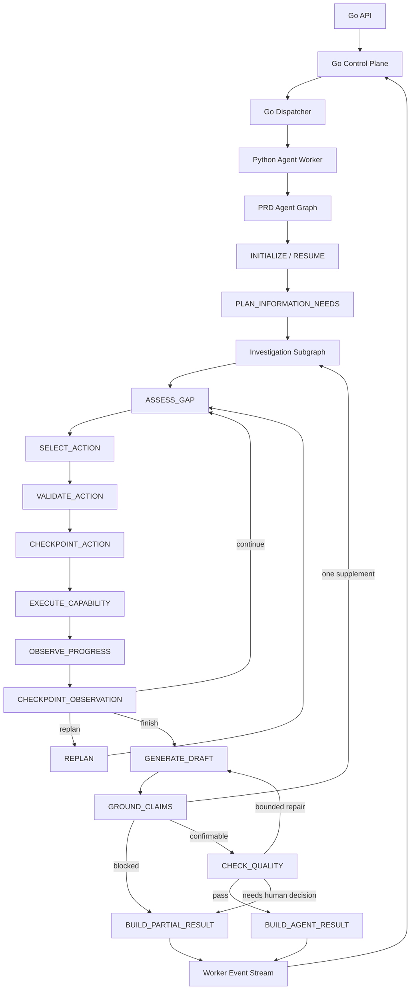
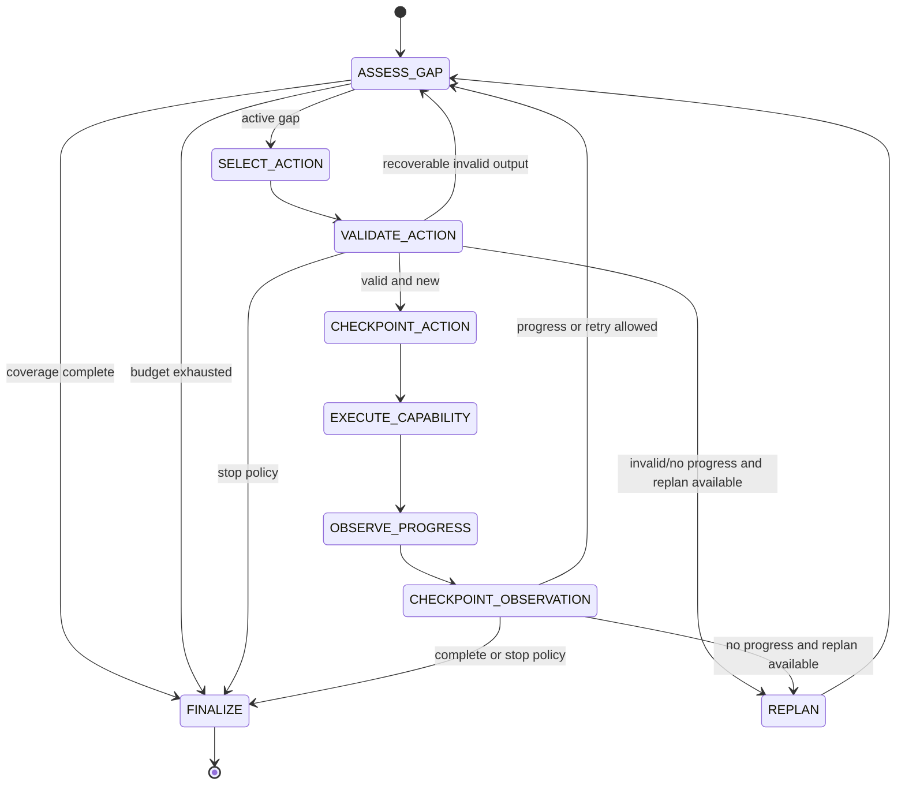

# LangGraph 受控 Agent Loop 设计方案

> 状态：TRACER BULLET IMPLEMENTED / ADVANCED LOOPS PENDING
> 日期：2026-07-30
> 适用范围：`agent-python/`、`contracts/proto/agent/v1/`、`backend-go/internal/dispatcher/`
> 关联设计：`2026-07-28-python-agent-runtime-completion-design.md`、`2026-07-28-go-python-agent-boundary-migration-design.md`、`2026-07-28-deepseek-api-loop-design.md`

## 实现进度（2026-07-30）

已完成首个 Tracer Bullet：

- `agent-python` 增加 LangGraph 1.2 运行依赖；
- 生产 Bootstrap 默认构造 `LangGraphAgentLoop`；
- `PRD_AGENT_AGENT_LOOP_MODE=legacy` 可短期回退旧两段式 loop；
- 一个 Information Need 支持多轮单 Action / 单 Capability 调查；
- Coverage、Iteration、Tool、Token、No Progress 和重复 Action 门禁；
- Validated Action、Observation、Investigation Finished 与 Ready To Submit
  四个版本化 checkpoint snapshot 边界；
- snapshot 顶层 `status` 是重启恢复的唯一节点路由依据；
- Model Attempt、Evidence 和 Checkpoint 在 loop 运行中提交并等待 Worker ACK；
- 从 `ACTION_VALIDATED` 恢复时不重复模型选择，从 `OBSERVED` 恢复时不重复
  Capability，从 `READY_TO_SUBMIT` 恢复时不重复模型与 Capability；
- Go Dispatcher 接受同一 Agent Run 的单调多 checkpoint 事件；
- Python Agent、完整 Python 仓库和完整 Go 单测通过。

后续阶段仍包括：

- Claim Grounding 与 targeted supplement 子图；
- Quality Repair 子图；
- 多 Confirmation Unit；
- 原生 LangGraph Remote Checkpointer / pending writes；
- 短生命周期工具审批 interrupt；
- staging eval 与故障演练。

剩余 Loop 的具体模型、状态、持久化和分阶段实现见
[LangGraph 剩余高级 Loop 实现方案](./2026-07-30-langgraph-advanced-loops-implementation-design.md)。

## 1. 结论

本方案将 LangGraph 引入 `agent-python`，用它实现一个可循环、可恢复、受预算和策略约束的 Agent Run 执行图。

LangGraph 不替代 Go Control Plane，也不接管 PRD Task 的业务状态机：

- Go 继续拥有 PRD Task、Agent Run、Run Admission、Queue Slot、Lease/Fencing、用户确认、事件事实和 PostgreSQL；
- Python 只拥有单次 Agent Run 内的模型决策、调查策略、Capability 调用、Evidence 整理、Grounding、Quality 和 Working Draft 计算；
- LangGraph 负责 Python 内部的节点推进、条件路由和循环；
- 每个有外部副作用的节点都通过已有 Go 事件流提交，并等待 ACK 后才继续；
- 每轮 Investigation 完成后保存 checkpoint，Worker 或 RPC 中断后从最后一个已确认的迭代边界恢复；
- 模型只能提出下一步 Action，不能决定预算、权限、完成条件或最终状态。

目标运行形态：

```text
Go Dispatcher
  -> AgentWorkerService.ExecuteRun
  -> Python LangGraphAgentLoop
       -> initialize/resume
       -> plan Information Need
       -> Investigation Subgraph
            -> assess gap
            -> select one action
            -> validate action
            -> checkpoint validated action
            -> execute one capability
            -> observe progress
            -> checkpoint observation
            -> continue/replan/finish
       -> generate Working Draft
       -> ground claims
       -> targeted supplement loop (最多一次)
       -> quality check
       -> submit AgentResult
  -> streamed events with ACK
  -> Go-owned durable state
```

## 2. 问题定义

### 2.1 实现前生产 Agent 是两段式调用

当前 `agent-python/agent/bootstrap.py` 中的 `RemoteAgentLoop` 只有以下路径：

1. 第一次模型调用直接生成 Markdown，或一次性给出 Repository/PRD 查询计划；
2. 批量执行所有查询；
3. 第二次模型调用生成 Working Draft；
4. 整个 callable 返回后统一提交 Model Attempt、Evidence、Checkpoint 和 Draft。

这条路径有三个限制：

- 模型不能根据上一轮工具观察动态选择下一步；
- Coverage、重复动作、无进展和重规划没有成为生产 Runtime 的一等状态；
- checkpoint 只在整个 loop 结束时产生，循环中间崩溃会丢失全部未提交进展。

### 2.2 旧实现已经有可复用的领域规则

`src/prd_agent/investigation/` 已经实现：

- Information Need；
- Coverage Item 和 Coverage Template；
- Investigation Budget；
- 单轮 Action Selection；
- Tool Action 校验和 action signature；
- iteration/tool/token/replan/no-progress 上限；
- Coverage Complete、No Progress、Budget Exhausted 等 Stop Reason；
- Evidence、Fact、Unknown 和 Conflict 聚合。

本方案迁移这些纯 Agent 逻辑，不迁移旧 Python API、数据库 Repository 或 WorkflowService。

### 2.3 LangGraph 的作用

LangGraph 在本项目中只解决四个问题：

1. 把循环从一个大 `while` 函数拆成可测试节点；
2. 用显式条件边表达继续、重规划、补充调查和结束；
3. 在节点边界生成可恢复状态；
4. 让 Investigation 成为可复用子图，而不是只能从一个固定 Workflow 调用。

LangGraph 不负责：

- 判断调用方是否有权限；
- 分配 Worker 或 Queue Slot；
- 续租和 Fencing；
- 直接写 PostgreSQL；
- 发布 Feishu；
- 决定 PRD Task 是否完成；
- 代替现有 Protobuf 合同。

## 3. 设计原则

### 3.1 外层确定性，内层受控动态

外层 PRD 生命周期由 Go 确定，内部调查过程允许模型动态选择工具。

```text
确定性：
  Task/Run 状态、预算、权限、完成条件、用户确认、最终提交

动态：
  下一项 Coverage Gap 的调查方式、搜索词、读取路径、是否提出重规划建议
```

### 3.2 一轮最多一次模型动作和一次 Capability 调用

一轮定义为：

```text
ASSESS_GAP
  -> SELECT_ACTION (最多一次模型调用，可有一次格式修复)
  -> VALIDATE_ACTION
  -> EXECUTE_CAPABILITY (最多一次)
  -> OBSERVE
  -> CHECKPOINT
```

禁止模型在一次返回中提交一个无界 Tool Call 列表。

### 3.3 路由只读取持久化状态

所有条件边必须由纯 Policy 决定：

- `CoveragePolicy`
- `BudgetPolicy`
- `ProgressPolicy`
- `ActionPolicy`
- `GroundingPolicy`
- `QualityPolicy`

模型输出只能进入 `pending_action` 或生成候选内容，不能直接设置 `route`、`status` 或 `stop_reason`。

### 3.4 所有副作用必须幂等

模型、Capability、Evidence、Checkpoint 和 Draft 使用稳定幂等键：

```text
Model Attempt:
  {run_id}:{operation}:{unit_id}:{iteration}:{repair_index}

Capability Action:
  {run_id}:{investigation_id}:{action_signature}:attempt:1

Checkpoint:
  {run_id}:{checkpoint_sequence}

Draft:
  {run_id}:draft:{draft_generation}
```

节点重放时，必须读取已有结果或安全地重复提交相同内容，不能产生不同的外部副作用。

### 3.5 Checkpoint 默认只保存游标和引用

Checkpoint 禁止保存：

- 完整 Evidence excerpt；
- 完整 Repository 文件；
- 完整历史 PRD；
- Credential；
- 隐藏推理；
- 大型模型原始响应；
- 中间调查阶段的 Working Draft 全文。

只保存 ID、hash、locator、Coverage 摘要、预算计数和当前游标。

`READY_TO_SUBMIT` 是唯一例外：在独立 Draft Artifact Store 尚未落地前，
terminal snapshot 保存经过质量校验的 exact candidate markdown 和 hash，使
Worker 重启后可以零模型调用、零 Capability 调用地重建同一
`DRAFT_SUBMITTED` 事件。该快照仍受 `max_checkpoint_bytes` 限制；后续接入
Artifact Store 后改为只保存稳定 draft reference 和 hash。

## 4. 总体架构



## 5. 图与子图

### 5.1 PRD Agent 主图

主图只组织 Agent-owned 的阶段：

| Node | 输入 | 输出 | 副作用 |
| --- | --- | --- | --- |
| `INITIALIZE` | RunContext、checkpoint | 初始或恢复后的 AgentState | 无 |
| `PLAN_INFORMATION_NEEDS` | Task message、Repository binding | Information Need IDs、Coverage 模板 | Model Attempt |
| `RUN_INVESTIGATION` | 当前 Information Need | Investigation Result | 由子图产生 |
| `GENERATE_DRAFT` | Requirement、Evidence IDs、Unknowns | Candidate Working Draft、Claims | Model Attempt |
| `GROUND_CLAIMS` | Claims、Evidence refs | Grounding summary、补充 Need | 无外部写 |
| `CHECK_QUALITY` | Draft hash、outline/requirement | Quality result | 无外部写 |
| `BUILD_AGENT_RESULT` | 完整状态 | Draft patch、terminal checkpoint | 无 |

主图不包含用户确认节点。Working Draft 提交后，本次 Agent Run 结束；后续确认或重新打开由 Go 创建新的 Agent Run。

### 5.2 Investigation 子图



### 5.3 Targeted Supplement Loop

Grounding 发现关键 CURRENT_STATE Claim 没有支持时，不直接让模型重写：

1. `GROUND_CLAIMS` 生成一个只包含缺失 Claim 的 Information Need；
2. `supplement_count += 1`；
3. 再次进入 Investigation 子图；
4. 新 Evidence 合并后重新生成受影响内容；
5. 再次 Grounding；
6. `max_supplements` 默认为 1，耗尽后返回 Partial/Unknown，不继续循环。

### 5.4 Quality Repair Loop

Quality Repair 只修复格式和文档一致性，不补造事实：

```text
CHECK_QUALITY
  -> PASS: BUILD_AGENT_RESULT
  -> REPAIRABLE: GENERATE_DRAFT
  -> NEEDS_HUMAN_DECISION: BUILD_PARTIAL_RESULT
```

默认 `max_quality_repairs = 1`。

Quality Repair 不允许：

- 删除未解决的 Unknown；
- 将 PARTIAL Coverage 改为 COVERED；
- 修改 Evidence locator；
- 将推断描述成当前实现事实。

## 6. AgentState

### 6.1 状态模型

建议新增 `agent-python/agent/graph/state.py`：

```python
from typing import Any, Literal, TypedDict


class AgentState(TypedDict, total=False):
    schema_version: str
    workflow_version: str

    run_id: str
    task_id: str
    task_version: int
    owner_id: str
    phase: str

    repository_binding_id: str
    repository_revision: str

    requirement: dict[str, Any]
    information_need_ids: list[str]
    current_need_index: int

    investigation_id: str
    unit_id: str | None
    iteration: int
    tool_call_count: int
    token_usage: int
    replan_count: int
    no_progress_rounds: int
    supplement_count: int
    quality_repair_count: int

    coverage: dict[str, str]
    completed_action_signatures: list[str]
    evidence_ids: list[str]
    fact_ids: list[str]
    unknown_ids: list[str]
    conflict_ids: list[str]

    pending_action: dict[str, Any] | None
    last_action_signature: str | None
    last_observation: dict[str, Any] | None
    stop_reason: str | None

    draft_key: str | None
    draft_hash: str | None
    draft_generation: int
    claim_ids: list[str]
    grounding_status: str | None
    quality_status: str | None

    checkpoint_sequence: int
    result_outcome: Literal[
        "DRAFT_READY",
        "PARTIAL_EVIDENCE",
        "EMPTY_EVIDENCE",
    ] | None
```

### 6.2 Reducer 规则

以下字段只能追加去重，禁止节点覆盖：

- `evidence_ids`
- `fact_ids`
- `unknown_ids`
- `conflict_ids`
- `completed_action_signatures`

以下字段只允许单调递增：

- `iteration`
- `tool_call_count`
- `token_usage`
- `replan_count`
- `no_progress_rounds`
- `supplement_count`
- `quality_repair_count`
- `draft_generation`
- `checkpoint_sequence`

恢复时发现计数回退、Repository revision 改变或 ID 集合缩小时，返回 `CHECKPOINT_INCOMPATIBLE`。

### 6.3 状态大小

目标：

- 正常 checkpoint 小于 64KB；
- 硬上限继续使用当前 256KB；
- `last_observation` 只保留 status、locator/hash 和公共摘要；
- Evidence excerpt 在 Go-owned Evidence Store 中保存，图中只保存 ID。

## 7. 节点合同

### 7.1 `ASSESS_GAP`

职责：

- 检查 CancellationToken；
- 先检查 Coverage Complete；
- 再按固定优先级检查 Token、Tool、Iteration、No Progress、Replan Budget；
- 选择最高优先级 Coverage Gap；
- 不调用模型。

Stop Reason 优先级：

```text
USER_STOPPED
> PERMISSION_DENIED
> COVERAGE_COMPLETE
> TOKEN_BUDGET_EXHAUSTED
> TOOL_BUDGET_EXHAUSTED
> MAX_ITERATIONS_REACHED
> NO_PROGRESS
> UNRECOVERABLE_ERROR
```

### 7.2 `SELECT_ACTION`

职责：

- 只为一个 active Coverage Gap 请求一个 Proposed Action；
- 先通过 RuntimeEventSink 提交 `MODEL_ATTEMPT(PLANNED)`；
- 等待 Go ACK 后调用模型；
- 记录成功或失败的 Model Attempt；
- 最多允许一次 same-input 格式修复；
- 累加 token usage。

模型输出：

```json
{
  "tool_id": "search_repository",
  "tool_schema_version": "1",
  "arguments": {
    "query": "order created_at filter"
  },
  "purpose": "定位订单时间筛选相关接口和校验",
  "target_coverage": ["api_contract"]
}
```

### 7.3 `VALIDATE_ACTION`

职责：

- Tool ID 和 schema version 白名单；
- 参数 schema 和大小；
- Capability 是否在当前 Lease/Repository revision 范围；
- `target_coverage` 是否仍为 active gap；
- 计算 action signature；
- 拒绝已完成或正在执行的重复 signature；
- 禁止模型提供 repository binding、revision、lease 或 owner。

该节点不执行任何外部调用。

### 7.4 `CHECKPOINT_ACTION`

职责：

- 在模型输出、Model Attempt 和 Action Policy 校验完成后保存 `phase=ACTION_VALIDATED`；
- checkpoint 包含通过校验的 `pending_action` 和稳定 action signature；
- 恢复后跳过已经完成的模型调用和校验，从 `EXECUTE_CAPABILITY` 继续；
- checkpoint ACK 前不得执行 Capability。

### 7.5 `EXECUTE_CAPABILITY`

职责：

- 检查 CancellationToken；
- 使用 RunContext 中固定的 binding、revision、dispatch 和 lease；
- 一轮最多执行一次 Capability；
- 使用稳定 idempotency key；
- 限制命中数、excerpt 大小和总 payload；
- 将候选结果规范化为 Evidence Event；
- 等待 Go ACK 后再返回节点结果。

节点不得直接访问：

- 本地 Git worktree；
- GitHub/Feishu Credential；
- PostgreSQL；
- Go-owned Task 或 Run 表。

### 7.6 `OBSERVE_PROGRESS`

职责：

- 更新 Coverage；
- 合并 Evidence/Fact/Unknown/Conflict IDs；
- 比较前后 progress fingerprint；
- 有进展时清零 `no_progress_rounds`；
- 无进展时加一；
- 记录 action signature；
- 清空 `pending_action`；
- 只返回状态变化，不做外部调用。

### 7.7 `CHECKPOINT_OBSERVATION`

职责：

- `checkpoint_sequence += 1`；
- 用 `CheckpointCodec` 编码 AgentState；
- 通过 RuntimeEventSink 发送 `CHECKPOINT_SAVED`；
- 等待 Go 持久化 ACK；
- ACK 前不得进入下一轮。

除调查轮次外，`DRAFTED`、`GROUNDED` 和 `READY_TO_SUBMIT` 也各自保存 checkpoint。所有 checkpoint 都复用相同的编码器和 ACK 语义。

### 7.8 `GENERATE_DRAFT`

职责：

- 只读取 Requirement、Coverage 摘要和已持久化 Evidence refs；
- 无支持的 CURRENT_STATE Claim 必须输出 Unknown 或明确标注待确认；
- 输出结构化 sections、claims 和 Markdown；
- Draft Quality Policy 校验通过后才能进入 Grounding；
- 不直接提交 Draft。

### 7.9 `BUILD_AGENT_RESULT`

职责：

- 生成 terminal checkpoint；
- 构造唯一 Draft Patch；
- Working Draft 内部结果区分 `DRAFT_READY`、`PARTIAL_EVIDENCE`、`EMPTY_EVIDENCE`；
- 将最终提交交给 Worker Server；
- 不将 Python 内部节点名作为 Go Task 状态。

P0 的 `RUN_COMPLETED.result_type` 仍发送 `SUCCEEDED`。Partial/Empty 表示 Evidence 完整度，不是新的 Agent Run 状态；它们进入 Draft Patch 和公共摘要。只有不可恢复错误才产生 `RUN_FAILED`。如果未来需要让 Go 对这些结果做不同业务投影，必须先扩展并验证 Control Plane 合同。

## 8. 路由规则

### 8.1 调查前路由

```python
def route_before_action(state: AgentState) -> str:
    if coverage_policy.complete(state["coverage"]):
        return "finish"
    if state["token_usage"] >= budget.token_budget:
        return "finish"
    if state["tool_call_count"] >= budget.max_tool_calls:
        return "finish"
    if state["iteration"] >= budget.max_iterations:
        return "finish"
    if state["no_progress_rounds"] >= budget.no_progress_limit:
        return "replan" if can_replan(state) else "finish"
    return "select"
```

### 8.2 观察后路由

```python
def route_after_observation(state: AgentState) -> str:
    if coverage_policy.complete(state["coverage"]):
        return "finish"
    if state["no_progress_rounds"] >= budget.no_progress_limit:
        return "replan" if can_replan(state) else "finish"
    return "continue"
```

### 8.3 Grounding 路由

```python
def route_after_grounding(state: AgentState) -> str:
    if state["grounding_status"] == "CONFIRMABLE":
        return "quality"
    if state["supplement_count"] < budget.max_supplements:
        return "supplement"
    return "partial"
```

## 9. Runtime Event Sink

### 9.1 实现前缺口

`AgentWorkerServer._invoke_loop_with_plans()` 原先只允许 Agent Loop 在返回前发出一个 `_PlannedAttempt`。

LangGraph loop 需要在运行中发出：

- `MODEL_ATTEMPT`
- `EVIDENCE_APPENDED`
- `CHECKPOINT_SAVED`
- 可选的公共进度事件

### 9.2 新接口

建议在 `RunContext` 中注入：

```python
class RuntimeEventSink(Protocol):
    def model_attempt(self, attempt) -> None: ...
    def evidence(self, items) -> None: ...
    def checkpoint(self, sequence: int, payload: bytes) -> None: ...
```

每个方法语义：

1. Agent 线程将 `_RuntimeSignal` 放入 Queue；
2. Agent 线程阻塞；
3. Worker Server 从 Queue 读取并发送对应 gRPC stream event；
4. Go Dispatcher 校验、持久化并发送 ACK；
5. Worker Server 释放 signal；
6. Agent 节点继续。

泛化后的内部结构：

```python
@dataclass
class _RuntimeSignal:
    event_type: str
    payload: object
    released: threading.Event
```

第一阶段不要求修改现有 Protobuf 字段；已有三个事件类型足够承载逐轮提交。

### 9.3 AgentResult 收缩

迁移期保留 `AgentResult.attempts/evidence/checkpoint` 兼容字段。

稳定后：

- 中间 Model Attempt、Evidence、Checkpoint 全部通过 RuntimeEventSink 提交；
- AgentResult 只返回 terminal checkpoint、Draft Patch 和内部 result outcome；
- Worker Server 禁止重复发送已经由 Sink ACK 的事件。

## 10. Checkpoint 与恢复

### 10.1 不使用 Python 直连 PostgresSaver

`agent-python` 不获得 PostgreSQL DSN，也不直接使用 `langgraph-checkpoint-postgres`。

原因：

- Go 是 Control Plane 唯一所有者；
- Python 直写会绕过 Lease、Fencing、事件顺序和 ACK；
- 会形成 LangGraph checkpoint 表和 `go_run_checkpoints` 两套恢复事实；
- Python Worker 将不再能以最小权限独立部署。

### 10.2 第一阶段：项目自有 checkpoint

第一阶段使用：

- LangGraph 管理节点和条件边；
- `CheckpointCodec` 编码 JSON-safe AgentState；
- `RuntimeEventSink.checkpoint()` 至少在 Validated Action 和 Observation 两个边界持久化；
- 新 `ExecuteRun` 从 `RunContext.checkpoint` 解码状态；
- 快照包含 `snapshot_schema_version`、顶层 `status` 和完整可恢复 `snapshot`；
- 重启只由快照顶层 `status` 选择恢复入口，内层 `phase` 不参与路由。

只支持顺序图，不启用同一 super-step 的并行节点。

### 10.3 恢复入口

```text
status = INITIALIZED
  -> PLAN_INFORMATION_NEEDS

status = ACTION_VALIDATED
  -> EXECUTE_CAPABILITY

status = OBSERVED
  -> ASSESS_GAP

status = INVESTIGATION_FINISHED
  -> GENERATE_DRAFT

status = DRAFTED
  -> GROUND_CLAIMS

status = GROUNDED
  -> CHECK_QUALITY

status = READY_TO_SUBMIT
  -> BUILD_AGENT_RESULT
```

新版本快照中，顶层 `status` 是唯一恢复事实。即使 snapshot 内残留的
`phase` 与之不同，也必须覆盖为顶层 `status`；未知 status 直接返回
`CHECKPOINT_INCOMPATIBLE`，不得猜测节点或静默从头执行。

对于外部副作用：

- Model Attempt 依赖稳定 attempt key 去重；
- Capability 依赖 action signature/idempotency key 去重；
- Evidence 依赖 source/revision/locator/excerpt hash 去重；
- Checkpoint 依赖 `(run_id, sequence, content_hash)` 去重；
- Draft 依赖 draft key 去重。

### 10.4 第二阶段：Remote LangGraph Checkpointer

只有在需要原生 `interrupt()`、time travel 或 pending writes 时，才设计远程 `BaseCheckpointSaver`。

该阶段需要扩展 Go 接口以支持：

- thread/checkpoint/parent checkpoint identity；
- metadata；
- pending writes；
- get tuple；
- checkpoint history；
- 原子 put + fencing。

在接口完成前，不引入 Python 直连 PostgreSQL 作为过渡方案。

## 11. 人工确认

P0 不使用 LangGraph `interrupt()` 跨越用户等待。

原因：

- 当前 PRD Task 的用户确认由 Go 业务状态机所有；
- Waiting User 应释放 Worker 执行容量；
- 用户操作可能产生新的 Agent Run 和新的 Lease；
- 当前 checkpoint 以 `run_id` 为恢复边界，而不是长期对话 thread。

P0 行为：

```text
Python 生成 Working Draft
  -> DRAFT_SUBMITTED
  -> RUN_COMPLETED(PARTIAL/SUCCEEDED)
  -> Go 将 PRD Task 投影为等待用户确认
  -> 用户确认/重开
  -> Go 创建下一次 Agent Run
```

后续若需要工具级审批，可在不改变 PRD Task 业务确认权属的前提下，为单个 Agent Run 增加短生命周期 interrupt。

## 12. Budget

复用当前配置：

| Budget | 默认值 | 硬上限 | 说明 |
| --- | ---: | ---: | --- |
| `max_iterations` | 8 | 50 | 每轮最多一个 Model Action |
| `run_token_budget` | 24,000 | 10,000,000 | Agent Run 总 Token |
| `max_transport_retries` | 2 | 5 | Transport 层，不计为新决策轮 |
| `max_evidence_items` | 100 | 1,000 | 整个 Agent Run |
| `max_checkpoint_bytes` | 256KB | 4MB | 目标保持小于 64KB |

新增配置：

| Config | 默认值 | 建议上限 |
| --- | ---: | ---: |
| `PRD_AGENT_LLM_MAX_TOOL_CALLS` | 8 | 50 |
| `PRD_AGENT_LLM_NO_PROGRESS_LIMIT` | 2 | 5 |
| `PRD_AGENT_LLM_MAX_REPLANS` | 1 | 3 |
| `PRD_AGENT_LLM_MAX_SUPPLEMENTS` | 1 | 2 |
| `PRD_AGENT_LLM_MAX_QUALITY_REPAIRS` | 1 | 2 |

所有配置在 Bootstrap 时验证，不能由模型覆盖。

## 13. Module 结构

```text
agent-python/agent/
├── graph/
│   ├── __init__.py
│   ├── state.py
│   ├── main.py
│   ├── routing.py
│   └── runtime.py
├── investigation/
│   ├── models.py
│   ├── policies.py
│   ├── nodes.py
│   ├── graph.py
│   └── prompts.py
├── grounding/
│   ├── models.py
│   ├── policies.py
│   └── nodes.py
├── runtime/
│   ├── event_sink.py
│   └── idempotency.py
├── bootstrap.py
├── checkpoint.py
├── context.py
├── result.py
└── worker_server.py
```

依赖调整：

```toml
dependencies = [
  "langgraph>=1,<2",
  ...
]
```

实际部署必须通过 lock/镜像 digest 固定经过测试的具体版本，不能仅依赖宽范围解析结果。

## 14. 迁移步骤

### Phase 0：Characterization

- 将旧 Investigation Runner 的 fixture 复制为新 Runtime 的黑盒契约；
- 固定 Coverage、Stop Reason、重复 Action、Budget、Cancel 行为；
- 为当前 RemoteAgentLoop 保留兼容测试。

验收：

- 旧新 Policy 对相同 fixture 得到相同 Stop Reason 和 Coverage；
- 不修改生产 Bootstrap。

### Phase 1：纯 LangGraph Investigation

- 增加 LangGraph 依赖；
- 新增 AgentState；
- 迁移 Investigation models/policies；
- 使用 Fake Model + Fake Capability 构建子图；
- graph 不接真实 Worker，不做外部持久化。

验收：

- 至少两轮不同工具后 Coverage Complete；
- 重复空结果在 no-progress limit 停止；
- iteration/token/tool budget 确定性停止；
- 每轮最多一次 Capability。

### Phase 2：Runtime Event Sink

- `_PlannedAttempt` 泛化为 `_RuntimeSignal`；
- RunContext 注入 RuntimeEventSink；
- Model Attempt、Evidence、Checkpoint 可在 loop 返回前提交并等待 ACK；
- 保持现有 Protobuf 字段兼容。

验收：

- 事件顺序严格单调；
- ACK 超时停止 graph；
- Go 拒绝 checkpoint 后 Python 不进入下一轮；
- 取消后不再发出后续业务事件。

### Phase 3：接入真实 Capability 和 Model

- `LangGraphAgentLoop` 替换 `RemoteAgentLoop` 内部两段式流程；
- Bootstrap 工厂入口保持不变；
- DeepSeek Model Adapter 和 CapabilityGatewayClient 作为节点依赖注入；
- 增加结构化输出修复和稳定 attempt key。

验收：

- 真实 Repository binding/revision 固定；
- 第二轮模型能看到第一轮公共观察；
- Tool 参数无法覆盖 binding/revision/lease；
- 生产仍没有 Python 数据库连接。

### Phase 4：Grounding 和 Quality Loop

- 加入 Claim、Grounding 和 targeted supplement；
- 加入最多一次 Quality Repair；
- 输出 Partial/Unknown 而不是无界补充。

验收：

- 无 Evidence 的 CURRENT_STATE Claim 不可进入成功 Draft；
- Supplement 超限后确定性返回 Partial；
- Quality Repair 不改变 Evidence/Unknown 状态。

### Phase 5：Crash/Recovery 与灰度

- 每轮 checkpoint；
- 在 `SELECT_ACTION`、Capability 完成后、Checkpoint ACK 后注入 crash；
- 重启 Worker 并从 Go latest checkpoint 恢复；
- 先在 staging 只对指定 workflow version 启用；
- 保留旧 RemoteAgentLoop feature flag 作为短期回退。

验收：

- 已 ACK 的 Model Attempt、Evidence 和 Capability 不重复物理执行；
- 未 ACK 节点可以安全重放；
- 新旧 loop 在固定 eval cases 上对比；
- 无 Run 超过 budget。

## 15. 测试方案

### 15.1 单元测试

| Area | 必测场景 |
| --- | --- |
| Routing | complete、各类 budget、no progress、replan |
| Action Policy | unknown tool、bad schema、inactive gap、duplicate signature |
| Coverage | succeeded/partial/empty/conflict |
| State | append-only、单调计数、checkpoint size |
| Grounding | unsupported current-state claim、single supplement |
| Quality | pass、repair、human decision |

### 15.2 Graph 测试

- 1 轮完成；
- 3 轮逐步覆盖；
- 空结果 → replan → 新 Action → 完成；
- 重复 Action → no progress → Empty；
- Token 在 SELECT_ACTION 后耗尽，Capability 不执行；
- Capability permission denied 立即停止；
- Cancellation 在每个节点前后生效；
- Supplement 回到 Investigation 子图且最多一次；
- Quality Repair 回到 Draft 且最多一次。

### 15.3 恢复测试

Crash point：

1. Model Attempt PLANNED 已 ACK，模型调用前；
2. 模型成功但 Attempt 未 ACK；
3. Capability 成功但 Evidence 未 ACK；
4. Evidence 已 ACK，checkpoint 未 ACK；
5. checkpoint 已 ACK，进入下一轮前；
6. Draft 已生成但未提交；
7. Draft 已提交，Run terminal event 未 ACK。

每个 case 验证：

- 恢复入口正确；
- 外部副作用不重复或可幂等重放；
- sequence 不回退；
- task/repository/workflow version 不漂移。

### 15.4 Go/Python 合同测试

- 多个中间 `CHECKPOINT_SAVED`；
- 中间 `EVIDENCE_APPENDED`；
- event ACK 超时；
- stale Lease；
- fencing token 变化；
- Worker crash 后 Dispatcher 重派；
- checkpoint hash/sequence 冲突；
- terminal event 后拒绝额外事件。

### 15.5 Eval

至少比较：

- Direct Prompt；
- 当前两段式 RemoteAgentLoop；
- LangGraph Controlled Loop。

指标：

- Coverage 完成率；
- Grounded Claim 比例；
- Unsupported CURRENT_STATE Claim 数；
- 平均 Model Attempt；
- 平均 Capability 调用；
- Token；
- No Progress 停止率；
- 恢复后重复物理调用数；
- P50/P95 Agent Run 时长。

## 16. 观测

每个节点记录结构化指标：

```text
agent_graph_node_duration_seconds{
  workflow_version,
  node,
  outcome
}

agent_investigation_iterations_total{
  workflow_version,
  stop_reason
}

agent_capability_calls_total{
  capability,
  outcome
}

agent_checkpoint_bytes{
  workflow_version
}
```

禁止 label：

- task message；
- Evidence excerpt；
- user ID；
- Repository 路径；
-模型原始输出。

公共进度只暴露：

- 当前阶段；
- Coverage 摘要；
- 轮数；
- Tool 公共名称；
- Stop Reason；
- 不含 Chain of Thought。

## 17. 安全与失败语义

| Failure | Graph 行为 | Go 结果 |
| --- | --- | --- |
| Model transport retryable | Adapter 内有界重试；耗尽后停止 | `RUN_FAILED(retryable=true)` |
| Model invalid output | 一次格式修复；仍失败则停止 | `RUN_FAILED(retryable=false)` |
| Capability permission | 不重试、不重规划 | Partial 或 Failed，按 Requiredness |
| Capability timeout | 有界重试或 Partial | 明确 error category |
| Empty result | no-progress +1 | 可能 replan；最终 Run 仍可成功提交带 Unknown 的 Draft |
| Duplicate Action | 不执行物理调用 | no-progress +1 |
| Checkpoint ACK timeout | 立即停止 | Worker stream failure/recovery |
| Cancellation | 下一安全点退出 | `RUN_FAILED(CANCELLED)` |
| Checkpoint incompatible | 不从头静默运行 | `RUN_FAILED(CHECKPOINT_INCOMPATIBLE)` |

## 18. 首个 Tracer Bullet

第一期只实现一个最小闭环：

> 一个 Agent Run、一个 Information Need、最多三轮；每轮一个模型动作、一个 Repository Capability；Validated Action 和 Observation 分别保存 checkpoint；Coverage Complete 或预算耗尽后生成一个 Working Draft。

范围内：

- `repository_structure`
- `api_contract`
- `validation_logic`
- `tests`
- Fake + Capability Gateway
- 每轮 checkpoint
- crash/resume

范围外：

- 多 Confirmation Unit；
- 历史 PRD 子图；
- LangGraph 原生 interrupt；
- 并行节点；
- Remote BaseCheckpointSaver；
- 多 Agent；
- Feishu Publish。

Tracer Bullet 验收：

1. 模型根据第一轮 observation 选择第二轮不同 Action；
2. 三轮上限不可绕过；
3. 每轮只执行一次 Capability；
4. 第二轮后 crash，恢复不重做已经 ACK 的第一、二轮；
5. checkpoint 小于 64KB；
6. Go 仍是所有持久化和终态事实的唯一所有者；
7. 旧两段式 loop 可通过 feature flag 回退。

## 19. 完成定义

只有同时满足以下条件，才认为 LangGraph Loop 已进入生产：

- 生产 Bootstrap 默认构造 `LangGraphAgentLoop`；
- 至少一个真实 Information Need 通过循环完成；
- 所有循环都有硬预算；
- 每轮最多一次 Model Action 和一次 Capability；
- 每轮 checkpoint 得到 Go ACK 后才继续；
- crash/resume 不重复已确认副作用；
- CURRENT_STATE Claim 通过 Grounding；
- Python 无 PostgreSQL、GitHub 或 Feishu Credential；
- Go Lease/Fencing/Queue/Task 状态机没有被 LangGraph 绕过；
- staging eval 优于或不劣于当前两段式 loop；
- feature flag 回退路径完成一次演练。
