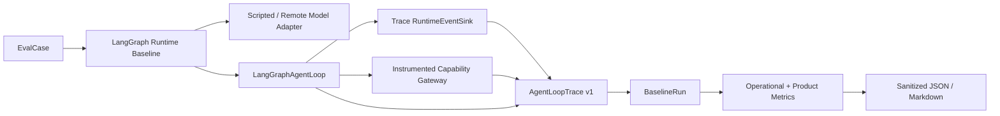

# Agent Loop Phase 0：Characterization 与 Eval 基线实现方案

> 状态：IMPLEMENTED / LOCALLY VERIFIED
> 日期：2026-07-31
> 所属计划：[`Agent Loop 语义深化实施计划`](./2026-07-31-agent-loop-semantic-deepening-implementation-plan.md)
> 对应测试方案：[`Phase 0 单元测试方案`](./2026-07-31-agent-loop-phase-0-characterization-eval-unit-test-plan.md)
> 适用范围：`agent-python/agent/`、`src/prd_agent/eval/`、`eval/`
> 生产行为：不改变；本阶段只建立观测、Characterization 和可重复对比基线

---

## 0. 结论

Phase 0 不修复 Agent Loop，而是把当前 `agent-runtime.v1/v2` 的真实行为转换为
稳定、可比较、可脱敏的 Eval Trace。完成后，后续每个 Phase 都必须用相同数据集和
Trace Schema 比较，回答三个问题：

1. 产品质量是否改善；
2. 模型、Capability、Token 和时延成本是否可接受；
3. 已 ACK 副作用是否能在恢复后保持 exactly-once effect。

本阶段交付四个 Module：

- **Agent Loop Trace Adapter**：把当前 LangGraph Loop 的事件、checkpoint 和结果转成中立 Trace；
- **LangGraph Runtime Baseline**：让现有 Eval Runner 可运行真实 `agent-python` Loop；
- **Operational Metrics**：补充 Need、Coverage、Evidence、Grounding、Budget 和 Recovery 指标；
- **Sanitized Report**：默认不把完整 Draft、Evidence、Prompt 或异常写进报告。

本阶段明确保留并记录当前已知问题，不把 characterization 断言误当作正确产品语义。

---

## 1. 当前实现基线

### 1.1 现有 Eval

`src/prd_agent/eval/` 已具备：

- 10 个固定 Eval Case 和不可变 Repository commit；
- Direct Prompt、Minimal Workflow、Single Retrieval、Bounded Investigation；
- `BaselineRunner`、内存/PostgreSQL Run Store；
- Required Section、Requirement、Boundary、Unknown 和 Acceptance Criteria 指标；
- Coverage、Tool、Duplicate、Replan 和 No-progress 的部分运行元数据；
- Markdown/JSON 报告。

### 1.2 当前缺口

| 缺口 | 结果 |
| --- | --- |
| Eval 没有运行生产 `LangGraphAgentLoop` | 不能证明生产 Loop 的真实质量和成本 |
| 旧 Eval 与 `agent-python` 使用不同状态和模型 | 旧 Bounded Investigation 指标不能代表新 Loop |
| `BaselineRun.metadata` 是松散字典 | 指标缺失或拼写错误无法 fail fast |
| Report run details 会携带完整 `output` | 容易把 Draft 正文写进仓库报告 |
| 没有统一事件 Trace | 无法比较事件顺序、physical/replay 和 checkpoint 恢复 |
| 当前测试直接断言 `COVERED/GROUNDED` | 结构通过可能掩盖错误的产品语义 |
| `NOT_REQUIRED` 与目标术语 `NONE` 并存 | Requiredness 指标需要明确归一化 |

---

## 2. 目标与非目标

### 2.1 目标

- 用当前生产 Loop 跑固定数据集；
- 统一输出版本化 Agent Loop Trace；
- 对模型、Capability、Evidence、Coverage、Grounding、Checkpoint 和结果计量；
- 增加已知错误行为的 Sentinel Characterization；
- 报告明确区分 `deterministic/scripted` 与 `remote-model`；
- 报告默认脱敏，只保留 hash、枚举、计数、时延和公开摘要；
- 后续 Phase 无需更换 Eval Runner 或报告协议。

### 2.2 非目标

- 不实现新的 Information Need Planner；
- 不修复 Coverage 或 Grounding；
- 不实现共享 Run Execution Ledger；
- 不修改 production Bootstrap 的默认模式；
- 不新增 PostgreSQL 业务表；
- 不调用真实 DeepSeek 作为单元测试前置条件；
- 不把 scripted selector 的结果表述为模型质量。

---

## 3. 总体结构



依赖方向：

- `agent-python` 不导入 `prd_agent.eval`；
- `agent-python` 只输出普通字典或标准库 dataclass Trace；
- `src/prd_agent/eval` 负责解析 Trace、计算 Ground Truth 指标和生成报告；
- 本地执行通过 `PYTHONPATH=src:agent-python` 同时加载两个 package；
- 生产 Worker 不装载 Eval Runner。

---

## 4. Agent Loop Trace Schema

### 4.1 顶层模型

新增 `src/prd_agent/eval/agent_trace.py`：

```python
@dataclass(frozen=True)
class AgentLoopTrace:
    schema_version: str
    eval_run_id: str
    case_id: str
    workflow_version: str
    execution_mode: str
    deterministic_only: bool
    status: str
    started_at: datetime
    duration_ms: int
    input_hash: str
    output_hash: str | None
    result_outcome: str | None
    stop_reason: str | None
    model_attempts: tuple[ModelAttemptTrace, ...]
    capability_calls: tuple[CapabilityCallTrace, ...]
    coverage_transitions: tuple[CoverageTransitionTrace, ...]
    grounding_findings: tuple[GroundingFindingTrace, ...]
    checkpoints: tuple[CheckpointTrace, ...]
    counters: TraceCounters
    failure: FailureTrace | None
```

`schema_version` 固定为 `agent-loop-trace.v1`。解析时未知字段允许忽略以便扩展，
缺少身份、状态或计数字段必须失败。

### 4.2 Model Attempt Trace

保存：

- attempt key、operation、prompt version、provider；
- request/output hash；
- `PLANNED/SUCCEEDED/FAILED`；
- input/output/total token；
- latency；
- error category；
- `physical_call`、`durable_replay`。

不保存 system/user Prompt、模型原始输出或 hidden reasoning。

### 4.3 Capability Call Trace

保存：

- sequence、公开 capability name；
- action signature；
- target Coverage；
- status；
- Evidence count；
- duration；
- `physical_call`、`durable_replay`；
- error category。

不保存 query、Repository path、完整 locator 或 excerpt。Characterization Adapter 可以在
内存中使用这些值执行，但 Trace 只保留 hash 或低基数分类。

### 4.4 Coverage Transition Trace

```python
@dataclass(frozen=True)
class CoverageTransitionTrace:
    iteration: int
    coverage_key: str
    before: str
    after: str
    evidence_delta: int
    fact_delta: int | None
    unknown_delta: int | None
    conflict_delta: int | None
    trigger: str
```

当前 v1 没有 Fact/Unknown/Conflict 层时，对应 delta 使用 `None`，不能伪造为 `0`。
这使报告可以明确标记“Coverage 仅由 Evidence count 推进”。

### 4.5 Grounding Trace

当前没有结构化 Claim 时，`grounding_findings=()` 且指标为 `not_applicable`。如果
Advanced Loop 产生 finding，只保存 claim ID、type、criticality、status、reason code、
Fact/Evidence ref 数量，不保存 statement。

### 4.6 Checkpoint Trace

保存 sequence、snapshot schema、status、payload bytes、content hash、ACK 状态和恢复入口。
不保存 checkpoint blob。`payload_bytes` 用于大小 Gate，不用于重建正文。

---

## 5. Trace Adapter

### 5.1 文件

新增：

```text
agent-python/agent/eval_adapter.py
agent-python/agent/testing/scripted_model.py
agent-python/agent/testing/instrumented_gateway.py
```

Eval Adapter 组合：

- `BufferedRuntimeEventSink` 的 Trace 版本；
- 记录调用次数的 Model Adapter；
- 记录 physical/replay 的 Capability Gateway；
- `CheckpointCodec` 解码器；
- `AgentResult.draft_patch` 的安全摘要器。

### 5.2 不修改生产接口

Phase 0 不给 `RuntimeEventSink` 增加仅供 Eval 使用的方法。Trace 来自已有：

- `model_attempt()`；
- `evidence()`；
- `artifact()`；
- `checkpoint()`；
- instrumented model/gateway；
- terminal `AgentResult`。

未来 Ledger 提供 physical/replay receipt 后，Adapter 切换到正式字段；Trace Schema 不变。

### 5.3 Event Folding

Adapter 按事件顺序 fold：

1. `PLANNED` 创建 Attempt；
2. 同 attempt key 的 `SUCCEEDED/FAILED` 关闭 Attempt；
3. Evidence 关联最近一次 Capability；
4. checkpoint 解码 Coverage，比较前一 checkpoint 形成 transition；
5. Artifact 只记录类型、generation、hash 和 bytes；
6. terminal Draft 只记录 schema、outcome、stop reason、output hash 和 markdown bytes。

非法事件序列必须让该 Eval Run `failed`，不能静默补齐。

---

## 6. LangGraph Runtime Baseline

### 6.1 文件

新增：

```text
src/prd_agent/eval/langgraph_runtime.py
eval/configs/langgraph_v1_characterization.json
eval/fixtures/langgraph_v1_actions.json
```

调整：

```text
src/prd_agent/eval/cli.py
src/prd_agent/eval/models.py
src/prd_agent/eval/runner.py
```

### 6.2 Baseline 接口

`LangGraphRuntimeBaseline` 继续满足现有 baseline duck type：

```python
input_hash(case, config) -> str
run_id(case, config, trial_no) -> str
run_case(case, config, model, trial_no) -> BaselineRun
```

`BaselineRun.metadata` 增加：

```json
{
  "trace_schema_version": "agent-loop-trace.v1",
  "trace": {},
  "measurement_mode": "scripted_characterization",
  "deterministic_only": true
}
```

为避免 metadata 继续无限松散，新增 `AgentEvalMetadata` dataclass，写入
`BaselineRun` 前转换为 JSON-safe dict。

### 6.3 Scripted Characterization

Phase 0 默认使用 scripted model/action fixture，目的仅为重复触发当前节点和边：

- `case-001`：模型直接返回 Markdown，记录“缺少正式 NONE Plan”；
- required cases：按 fixture 产生一个或多个 repository action；
- empty/no-progress case：重复 Action；
- budget case：在迭代或工具预算前停止；
- advanced sentinel：CURRENT_STATE Claim + 相关/不支持 Evidence；
- shadow sentinel：触发 Supplement/Repair 候选并统计额外调用。

Scripted fixture 是执行脚本，不是 Ground Truth；产品指标仍来自 `eval/cases`。

### 6.4 CLI

`config_id` 以 `langgraph-runtime-` 开头时选择 `LangGraphRuntimeBaseline`。缺少
`agent-python` import 时返回明确安装/`PYTHONPATH` 错误，不回退到旧 Baseline。

建议命令：

```bash
PYTHONPATH=src:agent-python venv/bin/python -m prd_agent.eval run-baseline \
  --manifest eval/cases/manifest.json \
  --config eval/configs/langgraph_v1_characterization.json \
  --output-dir eval/reports
```

---

## 7. 指标

### 7.1 已有指标继续保留

- requirement coverage；
- boundary recall；
- required section coverage；
- unknown preservation；
- acceptance criteria executability；
- coverage completion；
- tool call、duplicate action、replan、no-progress。

### 7.2 新运行指标

| 指标 | Phase 0 定义 |
| --- | --- |
| `model_attempt_count` | terminal Attempt 数，不含 PLANNED 重复事件 |
| `model_token_total` | 所有 terminal Attempt total token 之和 |
| `capability_physical_call_count` | Instrumented Gateway 实际调用数 |
| `evidence_yield` | 新 Evidence 数 / physical call |
| `checkpoint_count` | durable checkpoint 数 |
| `checkpoint_max_bytes` | 最大 checkpoint payload bytes |
| `coverage_transition_count` | Coverage 状态变化次数 |
| `coverage_without_fact_rate` | `fact_delta is None` 的 COVERED transition 比例 |
| `grounding_reference_only_support_rate` | reason 为 ref-valid-only 的 Supported 比例 |
| `replan_effective_change_rate` | Replan 后 Action Signature 变化比例 |
| `shadow_extra_remote_call_count` | shadow 相对 off 的额外 model/capability physical call |
| `duplicate_physical_call_after_resume` | 恢复后相同 identity 的重复物理调用数 |

`coverage_without_fact_rate` 是迁移诊断指标，不表示 Ground Truth 事实错误率。

### 7.3 Requiredness 归一化

Eval Dataset 的 `NOT_REQUIRED` 在指标层映射为目标术语 `NONE`；原始 Case 不在 Phase 0
修改，避免数据集 version 无意变化。Trace 对当前 v1 使用：

- `LEGACY_DIRECT_GENERATION`；
- `LEGACY_FIXED_INVESTIGATION`。

不得伪装成正式 Need Planner 输出。Requiredness Precision/Recall 在 Phase 3 前为
`not_applicable`，只报告 case 分布和 legacy route。

---

## 8. Sentinel Characterization

新增五个最小 Sentinel，不与 10 个产品 Eval Case 混为同一分数：

| Sentinel | 当前预期 | 后续替换目标 |
| --- | --- | --- |
| `coverage_from_any_hit` | 任意 hit 可使 Coverage=COVERED | 只有 Knowledge verdict 推进 |
| `grounding_from_ref_presence` | ref 存在可 Supported | 必须验证 Fact 和语义支持 |
| `replan_counter_without_strategy` | count 增加但无策略变化 | Replan 产生新 signature 或停止 |
| `shadow_can_execute_work` | 可能有额外调用 | shadow 额外远程调用为 0 |
| `resume_partial_invariants` | 部分漂移未被 validator 拒绝 | 全部 fail closed |

Characterization 测试命名使用 `test_current_*`，并在 docstring 写明
`known limitation; replace in Phase N`。后续修复时必须先新增目标测试，再删除或反转
当前断言，防止测试套件同时要求错误与正确行为。

---

## 9. Sanitized Report

### 9.1 默认输出

报告只包含：

- dataset/config/workflow/prompt/model version；
- case ID、trial、status、hash；
- 指标摘要和低基数 trace counters；
- error category；
- deterministic/remote 标识。

默认删除：

- `BaselineRun.output` 正文；
- Prompt 和模型原始输出；
- Evidence excerpt；
- Repository path/locator；
- owner/tenant ID；
-完整异常消息。

### 9.2 本地诊断

需要查看完整本地输出时使用显式 `--include-sensitive-local-details`，CLI 必须：

- 只允许输出到被 `.gitignore` 覆盖的目录；
- 在文件头标记 `SENSITIVE_LOCAL_ONLY`；
- 不支持与 `--dsn` 的生产数据组合；
- 默认关闭。

Phase 0 首版可以不实现该开关；失败诊断通过内存测试对象完成。

---

## 10. 文件变更清单

新增：

```text
agent-python/agent/eval_adapter.py
agent-python/agent/testing/__init__.py
agent-python/agent/testing/scripted_model.py
agent-python/agent/testing/instrumented_gateway.py
agent-python/tests/characterization/test_current_need_behavior.py
agent-python/tests/characterization/test_current_coverage_behavior.py
agent-python/tests/characterization/test_current_grounding_behavior.py
agent-python/tests/characterization/test_current_resume_behavior.py
agent-python/tests/characterization/test_current_shadow_behavior.py
src/prd_agent/eval/agent_trace.py
src/prd_agent/eval/langgraph_runtime.py
eval/configs/langgraph_v1_characterization.json
eval/fixtures/langgraph_v1_actions.json
tests/eval/test_agent_trace.py
tests/eval/test_langgraph_runtime.py
tests/eval/test_agent_operational_metrics.py
tests/eval/test_report_redaction.py
```

修改：

```text
src/prd_agent/eval/cli.py
src/prd_agent/eval/models.py
src/prd_agent/eval/metrics.py
src/prd_agent/eval/report.py
eval/README.md
README.md
```

不修改：

```text
agent-python/agent/graph/runtime.py
agent-python/agent/graph/advanced.py
backend-go/
contracts/
infra/production/
```

如果为获得 Trace 必须修改生产 Graph，说明 Adapter 设计失败，应先重新评审。

---

## 11. 实施步骤与提交顺序

### Step 0.1：定义 Trace Schema

- 创建不可变 dataclass 和严格解析；
- 明确 JSON version、枚举、计数非负和隐私字段白名单；
- 为每个子 Trace 增加 `as_dict/from_dict`。

提交：`feat(eval): define versioned agent loop traces`

### Step 0.2：实现 Eval Adapter

- 实现 Trace Sink、Model/Gateway instrumentation 和 checkpoint fold；
- 只使用已有 Runtime 接口；
- 输出 AgentLoopTrace，不生成报告。

提交：`feat(agent): expose a deterministic eval trace adapter`

### Step 0.3：接入 Baseline Runner

- 新增 `LangGraphRuntimeBaseline`；
- 添加 config/fixture 和 CLI routing；
- 保持 Direct/Single/Bounded Baseline 不变。

提交：`feat(eval): run the production langgraph loop in fixed cases`

### Step 0.4：增加 Operational Metrics

- 从 Trace 计算模型、Capability、Coverage、Grounding 和 Recovery 指标；
- 明确 measured/not_applicable；
- 不将 diagnostic proxy 命名为 Ground Truth accuracy。

提交：`feat(eval): measure agent loop operations and recovery`

### Step 0.5：报告脱敏

- 报告 run details 改为白名单；
- Failure 只保留 category；
- 增加 deterministic/scripted 标记；
- 加回归测试确保敏感 marker 不出现。

提交：`fix(eval): redact draft and source content from reports`

### Step 0.6：Characterization 与基线记录

- 添加五类 Sentinel；
- 跑全量测试和固定 Eval；
- 在 README 记录命令、测量模式和报告限制；
- 只提交脱敏报告或指标摘要。

提交：`test: characterize current langgraph loop semantics`

---

## 12. 验证命令

```bash
PYTHONPATH=agent-python venv/bin/python -m pytest -q agent-python/tests
PYTHONPATH=src venv/bin/python -m pytest -q tests/eval
PYTHONPATH=src:agent-python venv/bin/python -m pytest -q \
  agent-python/tests/characterization tests/eval

PYTHONPATH=src:agent-python venv/bin/python -m prd_agent.eval run-baseline \
  --manifest eval/cases/manifest.json \
  --config eval/configs/langgraph_v1_characterization.json \
  --output-dir eval/reports
```

运行完成后检查：

```bash
rg -n -i 'authorization:|bearer |api_key|access_token|private_key' eval/reports
git diff --check
```

敏感扫描命中任何完整正文或 Secret marker 时 Phase 0 失败。

---

## 13. 完成 Gate

- [x] 真实 `LangGraphAgentLoop` 可通过现有 Eval Runner 运行 10 个固定 Case；
- [x] 每个 Run 产生 `agent-loop-trace.v1`；
- [x] Trace 能重建 Model Attempt、Capability、Coverage 和 checkpoint 顺序；
- [x] 五个当前限制都有明确 Sentinel Characterization；
- [x] scripted/deterministic 与 remote-model 指标不会混淆；
- [x] Requiredness 在 Phase 3 前明确为 legacy/not-applicable；
- [x] 报告默认不包含 Draft、Prompt、Evidence excerpt、路径或完整异常；
- [x] 已有 Direct/Minimal/Single/Bounded Eval 不回归；
- [x] Agent Python 和 Eval 单元测试全部通过；
- [x] 生成一份可重复的脱敏 v1 基线报告；
- [x] 本阶段没有改变生产 Graph、Go Control Plane 或合同语义。
