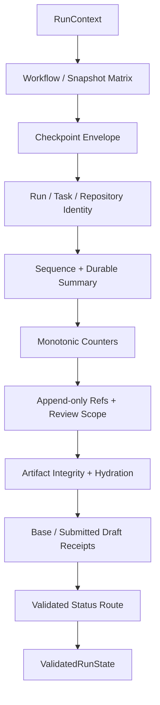

# Agent Loop Phase 1：Workflow Version 与 Resume Validation 设计方案

> 状态：IMPLEMENTED / LOCALLY VERIFIED
> 日期：2026-07-31
> 上位设计：[`Agent Loop 语义深化总体设计`](../specs/2026-07-31-agent-loop-semantic-deepening-design.md)
> 上位计划：[`Agent Loop 语义深化实施计划`](./2026-07-31-agent-loop-semantic-deepening-implementation-plan.md)
> 前置阶段：[`Phase 0 Characterization 与 Eval 基线`](./2026-07-31-agent-loop-phase-0-characterization-eval-design.md)
> 适用范围：`backend-go/`、`contracts/proto/agent/v1/`、`agent-python/agent/`
> 目标版本：`agent-runtime.v4`、`agent-loop-snapshot.v3`

---

## 0. 结论

Phase 1 在引入新的 Need、Knowledge、Ledger 或 Unit 语义前，先建立两个不可绕过的边界：

1. **Workflow Version Boundary**：每个 Agent Run 在创建时由服务端策略选择一个不可变
   `workflow_version`；Dispatcher 只把它交给明确声明兼容该版本的 Worker。
2. **Resume Validation Boundary**：Python 在进入 LangGraph 前一次性验证并 hydrate 所有
   checkpoint、Repository Snapshot、Evidence、Artifact、Revision Scope 和 Draft receipt；
   Graph 只接收 `ValidatedRunState`，不再边运行边猜测恢复状态。

版本兼容采用双轨而不是原地升级：

- 已有 `agent-runtime.v1 + agent-loop-snapshot.v1/v2` 继续走 legacy adapter；
- 新建 `agent-runtime.v4` Run 只写 `agent-loop-snapshot.v3`；
- 一个 Run 的 workflow version 永不修改；
- v1 checkpoint 不转换成 v3，v4 checkpoint 不能被 v1 Worker 接收；
- Phase 1 中 v4 的产品行为暂时与 v1 等价，只改变版本、恢复和 ACK 语义。

这使后续 Phase 2～6 可以只在 v4 上增加语义，同时保留可回滚的 v1 路径。

---

## 1. 当前实现基线

### 1.1 已具备

- `AgentRunInput.workflow_version` 已存在于 protobuf；
- Python `CheckpointCodec` 已提供 envelope version、payload hash 和 256 KiB 上限；
- 内层 `LoopSnapshot` 已区分 `agent-loop-snapshot.v1/v2`；
- checkpoint envelope 已校验 Run、workflow、sequence 和 payload hash；
- Go 已按 Run 保存 Model Attempt、Evidence、Artifact、Checkpoint 和 Working Draft；
- `READY_TO_SUBMIT` checkpoint 可以在恢复后做到零模型、零 Capability 调用；
- Worker 已把 `CheckpointError` 映射为不可重试的 `CHECKPOINT_INCOMPATIBLE`；
- Dispatcher 已在 dispatch request hash 中包含 workflow version 和 checkpoint。

### 1.2 已确认缺口

| 当前行为 | 风险 |
| --- | --- |
| `go_agent_runs` 不保存 workflow version | Run 重启后无法证明使用原语义 |
| Memory/PostgreSQL `GetRunContext` 硬编码 `agent-runtime.v1` | 数据库真实身份被运行时代码覆盖 |
| Pool 仅按空闲度 Reserve Worker | v4 Run 可能进入只支持 v1 的 Worker |
| Worker Health 不声明支持版本 | Dispatcher 无法做兼容路由 |
| Snapshot 是宽松 `dict` | 未知字段、错类型和状态不变量容易漏检 |
| Snapshot 不绑定 Repository binding/revision | checkpoint 可在不同 commit 上恢复 |
| Artifact 只在使用时查找 | 缺失、hash 漂移或重复 key 不能统一失败 |
| Evidence/Artifact 查询带 LIMIT | 截断可能被误当成完整 durable state |
| `resume_draft` 同时表示 revision base 和本 Run 已提交 Draft | 无法可靠判断恢复目的 |
| READY checkpoint 在 Draft Patch 形成前写入 | checkpoint 缺少可验证的 submission intent |
| Draft 已 ACK 后恢复仍重发 `DRAFT_SUBMITTED` | 依赖 Store 幂等，而非显式 terminal-only 恢复 |
| Repository revision 漂移当前可被接受 | Phase 0 Sentinel 已证明该限制存在 |

---

## 2. 目标与非目标

### 2.1 目标

- workflow version 持久化、不可变、服务端选择；
- Worker 明确声明支持的 workflow/snapshot version；
- Dispatcher 在获取 Lease 前选择兼容 Worker；
- 新增严格、版本化、可 hash 的 Snapshot v3；
- 所有恢复校验集中在 `ResumeValidator`；
- Repository Snapshot、计数、append-only refs、Artifact、Revision Scope 和 Draft receipt
  全部 fail closed；
- READY checkpoint 恢复支持 `SUBMIT_REQUIRED` 和 `TERMINAL_ACK_ONLY`；
- legacy v1 Run 不回归；
- Phase 0 Trace 能观察 workflow、snapshot 和恢复结果。

### 2.2 非目标

- 不实现 Run Execution Ledger；
- 不允许自动重放未知的 Model Attempt outcome；
- 不引入 Information Need、Verified Fact 或新 Grounding 规则；
- 不修改 Capability 权限和 Repository 读取语义；
- 不把 checkpoint blob 存入新的数据库；
- 不让 Python 直接查询 PostgreSQL；
- 不让普通 API 用户指定 workflow version；
- 不删除 snapshot v1/v2 reader；
- 不把 v1 Run 原地迁移为 v4。

---

## 3. 不可破坏的不变量

1. `AgentRun.workflow_version` 创建后不可更新。
2. 一个 workflow version 只允许写它声明的 snapshot schema。
3. Dispatcher 必须在 Acquire Lease 前确认 Worker 兼容。
4. 未知 workflow、snapshot schema 或 status 必须 fail closed。
5. outer checkpoint sequence、inner sequence、Go latest sequence 必须一致。
6. Snapshot 中的 Run、Task、workflow 和 Repository identity 必须与 Go context 一致。
7. 计数只能非负且不能超过 Go durable summary 已确认的相应计数。
8. Snapshot 引用的 Evidence/Artifact 必须存在；Go 返回的额外 durable item 不能被
   丢弃或静默消费，必须分类为 `DURABLE_STATE_AHEAD_OF_CHECKPOINT`。除有独立
   SubmissionIntent 的 Draft receipt 外，Phase 1 对这种窗口 fail closed，Phase 2 Ledger
   再提供安全重放。
9. Artifact key 在一个 Run 内唯一，内容 hash 必须重新计算验证。
10. `immutable_unit_keys` 与 `reopened_unit_keys` 必须唯一、互斥且恢复前后完全一致。
11. Draft receipt 必须同时匹配 key、patch hash 和 task version。
12. Draft 已 ACK 的恢复路径不得调用模型、Capability 或再次提交 Draft。

---

## 4. 总体结构

```mermaid
flowchart LR
    POLICY["Server Workflow Policy"] --> CREATE["Create Agent Run"]
    CREATE --> DB["go_agent_runs.workflow_version"]
    DB --> QUEUE["Queued Run"]
    HEALTH["Worker Health Capabilities"] --> POOL["Version-aware Agent Pool"]
    QUEUE --> POOL
    POOL -->|"compatible only"| CONTEXT["GetRunContext"]
    CONTEXT --> VALIDATE["ResumeValidator"]
    VALIDATE --> LEGACY["Legacy v1/v2 Adapter"]
    VALIDATE --> V3["Snapshot v3 Hydration"]
    LEGACY --> STATE["ValidatedRunState"]
    V3 --> STATE
    STATE --> GRAPH["LangGraphAgentLoop"]
    GRAPH --> RESULT["Submit Required / Terminal ACK Only"]
```



所有权保持：

- Go Control Plane 决定 Run version 并提供 durable resume view；
- Python Resume Module 校验和 hydrate，但不修改 durable facts；
- LangGraph 只消费已验证状态；
- Worker Server 根据 `AgentResult.submission_disposition` 生成正确事件序列。

---

## 5. Workflow Version Boundary

### 5.1 版本集合

Go 和 Python 使用相同公开常量：

```text
agent-runtime.v1   legacy production behavior
agent-runtime.v4   semantic-deepening target line
```

Phase 1 不创建 v2/v3 workflow line，避免把总体设计阶段号误当 runtime version。
`v4` 是后续 Phase 2～6 共同演进的目标线，兼容性由 snapshot/artifact schema 单独控制。

### 5.2 创建策略

新增服务端配置：

```text
PRD_AGENT_DEFAULT_WORKFLOW_VERSION=agent-runtime.v1
PRD_AGENT_ALLOWED_WORKFLOW_VERSIONS=agent-runtime.v1,agent-runtime.v4
```

规则：

- HTTP Create/Retry/Reopen command 不增加用户可写 version 字段；
- Store 创建 Run 时从注入的 `WorkflowVersionPolicy` 取值；
- 用户 command idempotency hash 只包含用户可见输入；同一 key 重放先返回原 Run，
  不因当前默认 version 已变化而冲突；
- Run creation audit/dispatch request hash 必须包含实际选中的 version；
- Retry/Reopen 创建的是新 Run，可以按当前服务端策略选择版本；
- 已存在 Run 永远沿用自身 version。

建议接口：

```go
type WorkflowVersionPolicy interface {
    Select(NewRunKind, Task) (WorkflowVersion, error)
    Allows(WorkflowVersion) bool
}
```

初始实现可以是固定配置策略；canary 百分比或 owner allowlist 留到 Phase 7，不进入 API。

### 5.3 PostgreSQL Migration 0012

新增 `backend-go/db/migrations/0012_agent_workflow_version.sql`：

```sql
ALTER TABLE go_agent_runs
    ADD COLUMN workflow_version TEXT;

UPDATE go_agent_runs
   SET workflow_version = 'agent-runtime.v1'
 WHERE workflow_version IS NULL;

ALTER TABLE go_agent_runs
    ALTER COLUMN workflow_version SET NOT NULL;

ALTER TABLE go_agent_runs
    ADD CONSTRAINT ck_go_agent_runs_workflow_version
    CHECK (workflow_version ~ '^agent-runtime[.]v[1-9][0-9]*$');
```

不保留数据库 DEFAULT：所有新建 Run 的 INSERT 必须显式提供 version，遗漏路径应直接失败。
Migration 只回填历史行，不更新任何已有 checkpoint。

### 5.4 Go Model 与 Store

`runcontrol.AgentRun` 增加：

```go
WorkflowVersion WorkflowVersion `json:"workflow_version"`
```

修改所有 Run 创建路径：

- Start Task；
- Retry Task；
- Reopen Confirmation Unit；
- Memory Store 对应路径。

修改所有 scan/RETURNING/SELECT。为避免继续复制 13～14 个列，Phase 1 应抽取统一
`agentRunColumns` 与 `scanAgentRun`，但不借机重构其他 Store。

`GetRunContext` 必须使用 `run.WorkflowVersion`，删除两个硬编码
`"agent-runtime.v1"`。

### 5.5 Worker 能力声明

对 `HealthResponse` 做 additive protobuf 扩展：

```proto
repeated string supported_workflow_versions = 7;
repeated string supported_snapshot_schema_versions = 8;
```

Worker Bootstrap 显式配置：

```text
supported_workflow_versions = [agent-runtime.v1, agent-runtime.v4]
supported_snapshot_schema_versions = [agent-loop-snapshot.v1,
                                      agent-loop-snapshot.v2,
                                      agent-loop-snapshot.v3]
```

规则：

- 旧 Worker 未返回字段时只视为兼容 `agent-runtime.v1`；
- Worker 收到自身未声明 version 时，在 `RUN_STARTED` 前以 gRPC
  `FAILED_PRECONDITION` 拒绝；
- Health 只发布真实 reader/writer 能力，不通过环境变量伪装未实现版本。

Pool 中新建的 gRPC slot 初始为 `CAPABILITY_UNKNOWN`，在 bounded Health probe 成功前不可
Reserve。Health 返回空 capability 字段的旧 Worker 只映射为 v1；连接失败不能映射为
v1。能力缓存带短 TTL，过期后 slot 暂停接收新 Run，避免 endpoint 重启为低版本 Worker
后仍沿用陈旧能力。

### 5.6 Version-aware Agent Pool

`agentpool.ClientSlot` 增加不可变 capability set，Pool 新增：

```go
ReserveForWorkflow(workflowVersion string) (*Reservation, error)
```

选择顺序：兼容性过滤 → capacity token → 当前 round-robin。不能先 Reserve 任意 Worker
再依赖 Python 拒绝。

错误区分：

- `ErrPoolSaturated`：存在兼容 Worker，但当前没有 capacity；
- `ErrNoCompatibleWorker`：没有任何 Worker 声明兼容；
- `ErrNoWorker`：Pool 为空。

Dispatcher 遇到 `ErrNoCompatibleWorker` 时不 Acquire Lease、不创建 Dispatch、不改变 Run
version；Run 保持 QUEUED，并增加 `Report.Incompatible` 和结构化告警。这样滚动发布期间
不会把 v4 Run 错发给 v1 Worker，也不会把暂时缺少 Worker 误判为业务失败。

---

## 6. Protobuf Resume Contract

### 6.1 消除 `resume_draft` 歧义

现有 field 15 保留为 legacy alias，不复用 tag。新增：

```proto
message ResumeStateSummary {
  string checkpoint_content_hash = 1;
  int64 terminal_model_attempt_count = 2;
  int64 evidence_count = 3;
  repeated string evidence_refs = 4;
  int64 artifact_count = 5;
  repeated RunArtifactIdentity artifacts = 6;
}

message RunArtifactIdentity {
  string artifact_key = 1;
  string artifact_type = 2;
  int64 generation = 3;
  string request_hash = 4;
  string content_hash = 5;
}

message AgentRunInput {
  // fields 1..15 unchanged
  SubmittedDraftReceipt base_draft = 16;
  SubmittedDraftReceipt submitted_draft = 17;
  ResumeStateSummary resume_summary = 18;
}
```

语义：

- `base_draft`：revision scope 指向的上一个 Run Draft；
- `submitted_draft`：当前 Run 已由 Go ACK 的 Draft；
- `resume_draft`：只供 v1 Worker 兼容读取；
- v4 context 禁止只填 legacy alias。

### 6.2 Durable Summary

Go 在同一个 `GetRunContext` transaction 中构造 summary。它不是第二份状态，而是让
Python 验证 checkpoint 声称的 refs 是否真的已 durable ACK。

- count 查询不能静默 `LIMIT`；
- 如果超过 Agent 输入上限，Go 返回显式 `RESUME_CONTEXT_LIMIT_EXCEEDED`，不能截断；
- `checkpoint_content_hash` 来自最新 Go checkpoint row；
- evidence ref 算法与 Python `_evidence_reference` 固定为版本化公共函数；
- Artifact identity 必须和返回的 content 一一对应。

### 6.3 Hash 规范化

当前合同同时存在 raw 64 hex 和 `sha256:<hex>`。Phase 1 新增 `HashDigest` value object：

- reader 接受 legacy raw SHA-256 和 tagged SHA-256；
- 内存比较前统一为 `sha256:<lowercase hex>`；
- Snapshot v3 只写 tagged 格式；
- 不批量改写历史数据库 hash；
- 未知算法、大小写异常、非 64 hex 全部拒绝。

---

## 7. Snapshot v3

### 7.1 外层 Envelope

`CheckpointCodec` 的 `agent-checkpoint.v1` envelope 保持不变。它继续负责：

- workflow version；
- Run ID；
- task version；
- checkpoint sequence；
- payload hash；
- 最大字节数。

Snapshot v3 是 payload 内的严格结构：

```text
agent-checkpoint.v1
  payload:
    snapshot_schema_version: agent-loop-snapshot.v3
    status: <LoopCheckpointStatus>
    snapshot: <AgentLoopSnapshotV3>
```

### 7.2 Typed Model

新增 `agent-python/agent/resume/models.py`：

```python
@dataclass(frozen=True)
class SnapshotIdentity:
    run_id: str
    task_id: str
    workflow_version: str
    base_task_version: int
    repository_binding_id: str | None
    repository_revision: str | None

@dataclass(frozen=True)
class ProgressSnapshot:
    model_attempt_count: int
    iteration: int
    tool_call_count: int
    token_usage: int
    replan_count: int
    no_progress_rounds: int
    supplement_count: int
    repair_count: int
    draft_generation: int

@dataclass(frozen=True)
class ArtifactRef:
    artifact_key: str
    artifact_type: str
    generation: int
    request_hash: HashDigest
    content_hash: HashDigest

@dataclass(frozen=True)
class SubmissionIntent:
    draft_key: str
    draft_patch_hash: HashDigest
    markdown_hash: HashDigest
    expected_task_version: int

@dataclass(frozen=True)
class AgentLoopSnapshotV3:
    identity: SnapshotIdentity
    status: LoopCheckpointStatus
    checkpoint_sequence: int
    progress: ProgressSnapshot
    coverage: Mapping[str, str]
    completed_action_signatures: tuple[str, ...]
    evidence_refs: tuple[str, ...]
    required_artifacts: tuple[ArtifactRef, ...]
    immutable_unit_keys: tuple[str, ...]
    reopened_unit_keys: tuple[str, ...]
    cursor: GraphCursorV3
    submission: SubmissionIntent | None
```

`GraphCursorV3` 只包含恢复当前 status 所需字段，例如 validated pending action、active gap、
stop reason 和当前 artifact keys；不允许任意额外字典进入 v3。正文通过 Artifact hydration，
不在 cursor 中复制。

### 7.3 Schema/Workflow Matrix

| Workflow | 可读 Snapshot | 可写 Snapshot | 处理方式 |
| --- | --- | --- | --- |
| `agent-runtime.v1` | v1、v2 | v2 | legacy adapter |
| `agent-runtime.v4` | v3 | v3 | strict ResumeValidator |
| 未知 | 无 | 无 | `CHECKPOINT_INCOMPATIBLE` |

不允许 `v4 + v2` 或 `v1 + v3`。这比仅按 snapshot version 猜 workflow 更安全。

---

## 8. Resume Validation Module

### 8.1 文件与接口

新增：

```text
agent-python/agent/resume/__init__.py
agent-python/agent/resume/models.py
agent-python/agent/resume/hashes.py
agent-python/agent/resume/artifacts.py
agent-python/agent/resume/validator.py
```

接口：

```python
@dataclass(frozen=True)
class ValidatedRunContext:
    run_id: str
    tenant_id: str
    owner_id: str
    task_id: str
    task_message: str
    workflow_version: str
    base_task_version: int
    lease: Lease | None
    repository_binding_id: str | None
    repository_revision: str | None
    revision_scope: RevisionScopeView | None

@dataclass(frozen=True)
class ValidatedRunState:
    context: ValidatedRunContext
    status: LoopCheckpointStatus
    state: AgentState
    evidence: EvidenceIndex
    artifacts: ArtifactIndex
    base_draft: DraftReceiptView | None
    submitted_draft: DraftReceiptView | None
    submission_disposition: SubmissionDisposition

class ResumeValidator:
    def hydrate(self, context: RunContext) -> ValidatedRunState: ...
```

接线方式采用 facade，避免让 gRPC Worker Server 理解 Graph 内部状态：

```python
@dataclass(frozen=True)
class ValidatedAgentRuntime:
    validator: ResumeValidator
    loop: LangGraphAgentLoop

    def __call__(self, context: RunContext, cancel_event=None) -> AgentResult:
        validated = self.validator.hydrate(context)
        return self.loop(validated, cancel_event)
```

`bootstrap.build_agent_loop()` 返回 facade；Worker Server 的 RPC/ACK 职责不变。
`LangGraphAgentLoop.__call__` 改为只接收 `ValidatedRunState`，因此任何测试或调用方都不能
绕过 validator 直接传入未验证 checkpoint。

`SubmissionDisposition`：

```text
NOT_READY
SUBMIT_REQUIRED
TERMINAL_ACK_ONLY
```

### 8.2 校验顺序



固定顺序便于返回稳定 reason code，不能在 Artifact hydration 后才发现 identity 漂移。

### 8.3 Fresh Run

无 checkpoint 时：

- `checkpoint_sequence` 必须为 0；
- same-run submitted draft、same-run Artifact、Evidence 和 attempt summary 必须为空；
- revision Run 可以携带 `base_draft + revision_scope`；
- Repository binding 和 revision 必须成对为空或成对存在；
- 输出严格初始化的 v4 state，不从调用方传入的字典继承字段。

### 8.4 EvidenceIndex

索引 key 使用版本化 evidence ref。校验：

- ref 唯一；
- source type/id、locator、excerpt hash 非空；
- `excerpt_hash` 与现有 Evidence 合同一致；
- snapshot refs 必须是 durable refs 的子集；
- durable summary count 必须等于收到的唯一 Evidence 数；
- 额外 durable Evidence 证明发生了“事件 ACK 后、checkpoint ACK 前”崩溃；Phase 1 返回
  `DURABLE_STATE_AHEAD_OF_CHECKPOINT`，不能重做 Capability 或猜测它属于哪个 Action。

Phase 1 不判断 Evidence 是否支持 Claim。

### 8.5 ArtifactIndex

构造索引时一次性验证全部返回 Artifact：

- key 唯一且属于当前 Run namespace；
- type、generation、request hash、content hash 完整；
- generation 非负；
- 对 content 重新计算 SHA-256；
- summary identity 与 content item 完全一致；
- snapshot `required_artifacts` 全部存在；
- snapshot 未引用的 same-run Artifact 触发 `DURABLE_STATE_AHEAD_OF_CHECKPOINT`；
- 只解析恢复 status 必需的 typed Artifact；其他合法 artifact 延迟解析。

缺失、重复、hash 漂移或 schema 不兼容统一失败，不回退到重新调用模型。

### 8.6 计数和集合

`ProgressSnapshot` 所有字段非负，并满足：

```text
tool_call_count <= iteration + supplement_count
replan_count <= iteration
supplement_count <= tool_call_count
draft_generation >= supplement_count
```

与 durable summary 的关系：

```text
snapshot model_attempt_count <= durable terminal model attempts
len(snapshot evidence_refs) <= durable evidence_count
len(snapshot required_artifacts) <= durable artifact_count
```

任一 durable 计数大于 snapshot floor 时，先形成显式 `durable_ahead` 诊断，再拒绝自动
恢复；不能把 `<=` 理解为自动接受重放。唯一例外是 READY SubmissionIntent 对应的
same-run submitted Draft，因为它具有可验证的 stable key/hash/version。

集合规则：

- `completed_action_signatures`、`evidence_refs`、Artifact key 各自唯一；
- durable view 不能缺少 snapshot item；superset 必须显式 fail closed，不能缩回 snapshot；
- `immutable_unit_keys` 与 `reopened_unit_keys` 不使用 superset 语义，必须与本 Run
  `RevisionScope` 完全相等；
- 所有集合序列化前 canonical sort，运行时可恢复原业务顺序的字段单独保存。

### 8.7 Status Route

Resume Validator 是唯一 status router：

| Status | 必需恢复数据 | 下一入口 |
| --- | --- | --- |
| `INITIALIZED` | identity/progress | assess |
| `ACTION_VALIDATED` | pending action + signature | execute |
| `OBSERVED` | observations/evidence refs | assess |
| `INVESTIGATION_FINISHED` | stop reason | draft |
| `DRAFTED` | Draft Bundle Artifact | ground |
| `GROUNDING_SUPPLEMENT_REQUIRED` | Grounding Report + target claim | supplement |
| `GROUNDED` / `GROUNDING_PARTIAL` | Grounding Report | quality |
| `QUALITY_REPAIR_REQUIRED` | Quality Report + issues | repair |
| `QUALITY_PASSED` / `QUALITY_NEEDS_HUMAN` | Quality Report | confirmation |
| `CONFIRMATION_UNITS_BUILT` | Confirmation Units Artifact | ready |
| `READY_TO_SUBMIT` | SubmissionIntent | submit or terminal-only |

未知 status 不得映射到最近节点。

---

## 9. Draft ACK 恢复

### 9.1 READY checkpoint 顺序

v4 调整 READY 顺序：

1. 构造最终 Draft Patch；
2. 计算稳定 `draft_key`、patch hash、markdown hash；
3. 写入带 `SubmissionIntent` 的 `READY_TO_SUBMIT` Snapshot v3；
4. 等待 checkpoint ACK；
5. 返回 `SUBMIT_REQUIRED` AgentResult；
6. Worker 发出 `DRAFT_SUBMITTED`；
7. Go 保存 Draft 并 ACK；
8. Worker 发出 `RUN_COMPLETED`。

任何时候都不能先提交 Draft 再补 READY checkpoint。

### 9.2 恢复判定

READY 恢复时：

| same-run `submitted_draft` | 判定 |
| --- | --- |
| 不存在 | hydrate patch，`SUBMIT_REQUIRED` |
| key/hash/version 全匹配 | `TERMINAL_ACK_ONLY` |
| 任一字段冲突 | `CHECKPOINT_INCOMPATIBLE` |

版本要求：

```text
SubmissionIntent.expected_task_version == SnapshotIdentity.base_task_version
submitted_draft.task_version == base_task_version + 1
```

### 9.3 Worker Result

`AgentResult` 新增：

```python
submission_disposition: SubmissionDisposition = SUBMIT_REQUIRED
```

Worker 行为：

- `SUBMIT_REQUIRED`：保持现有 Draft event + terminal event；
- `TERMINAL_ACK_ONLY`：不要求 draft payload，不发 Draft event，只发 terminal event；
- 非 READY 状态返回 terminal-only 属于 `INVALID_AGENT_RESULT`。

Go 已有 terminal Run reconciliation 保持不变。

---

## 10. Error Taxonomy

所有恢复失败抛出 `ResumeValidationError(CheckpointError)`，只携带低基数 reason code：

```text
WORKFLOW_VERSION_UNSUPPORTED
SNAPSHOT_SCHEMA_UNSUPPORTED
SNAPSHOT_STATUS_UNSUPPORTED
CHECKPOINT_SEQUENCE_MISMATCH
CHECKPOINT_HASH_MISMATCH
RUN_IDENTITY_MISMATCH
TASK_IDENTITY_MISMATCH
TASK_VERSION_MISMATCH
REPOSITORY_SNAPSHOT_MISMATCH
COUNTER_REGRESSION
APPEND_ONLY_SET_SHRUNK
DURABLE_STATE_AHEAD_OF_CHECKPOINT
REVISION_SCOPE_MISMATCH
EVIDENCE_INDEX_INVALID
ARTIFACT_MISSING
ARTIFACT_HASH_MISMATCH
ARTIFACT_SCHEMA_UNSUPPORTED
DRAFT_RECEIPT_MISMATCH
RESUME_CONTEXT_LIMIT_EXCEEDED
```

Worker 对外仍统一：

```text
error_category = CHECKPOINT_INCOMPATIBLE
retryable = false
```

reason code 进入脱敏 Trace/日志，不返回原始 Artifact、路径、Draft 或异常正文。

---

## 11. Compatibility 与 Rollout

### 11.1 Legacy Adapter

`LegacyResumeAdapter` 封装当前 v1/v2 行为，避免 strict validator 里散布兼容分支：

- 只接受 `agent-runtime.v1`；
- 读取 snapshot v1/v2；
- 保持当前 inline Draft/Artifact fallback；
- 不产生 Snapshot v3；
- Phase 7 删除 v1 producer 前持续运行回归测试。

### 11.2 部署顺序

1. 部署 additive proto 与 Migration 0012；默认 version 仍为 v1；
2. 部署 Go read/write version，但 Dispatcher 仍只选择 v1；
3. 部署能读取 v1/v2/v3、写 v2/v3 的新 Worker；
4. Health/Pool 开启兼容路由；
5. 用内部配置创建 behavior-equivalent v4 canary Run；
6. 完成 Crash Matrix 后允许后续 Phase 在 v4 上演进。

### 11.3 回滚

- 把默认创建版本切回 v1；
- 保留至少一个 v4-compatible Worker，直到所有 v4 Run terminal；
- 不修改已有 v4 Run version，不把 v3 checkpoint 降级；
- Migration 0012 和 additive proto 不回滚；
- 如果 v4 Worker 全部不可用，v4 Run 保持 QUEUED 并告警，不发送给 v1 Worker。

---

## 12. 文件变更清单

### 12.1 新增

```text
backend-go/db/migrations/0012_agent_workflow_version.sql
backend-go/internal/runcontrol/workflow_version.go
backend-go/internal/runcontrol/workflow_version_test.go
backend-go/internal/storage/workflow_version_integration_test.go
backend-go/internal/dispatcher/workflow_routing_test.go
agent-python/agent/resume/__init__.py
agent-python/agent/resume/models.py
agent-python/agent/resume/hashes.py
agent-python/agent/resume/artifacts.py
agent-python/agent/resume/validator.py
agent-python/tests/test_resume_validator.py
agent-python/tests/test_resume_crash_matrix.py
```

### 12.2 修改

```text
backend-go/internal/runcontrol/model.go
backend-go/internal/runcontrol/store.go
backend-go/internal/runcontrol/memory_store.go
backend-go/internal/storage/postgres.go
backend-go/internal/storage/agent_execution.go
backend-go/internal/storage/confirmation.go
backend-go/internal/storage/dispatches.go
backend-go/internal/agentpool/pool.go
backend-go/internal/dispatcher/dispatcher.go
backend-go/cmd/api/main.go
backend-go/cmd/maintenance/main.go
contracts/proto/agent/v1/agent_execution.proto
contracts/proto/agent/v1/agent_worker.proto
contracts/gen/go/agent/v1/*
agent-python/agent/v1/*
agent-python/agent/context.py
agent-python/agent/result.py
agent-python/agent/checkpoint.py
agent-python/agent/graph/snapshot.py
agent-python/agent/graph/state.py
agent-python/agent/graph/runtime.py
agent-python/agent/worker_server.py
agent-python/agent/bootstrap.py
```

### 12.3 不修改

```text
agent-python/agent/investigation/
agent-python/agent/grounding/
agent-python/agent/quality/
backend-go/internal/capability/
infra/production/ingress/
```

---

## 13. 实现顺序

### Step 1.1：持久化 Workflow Version

- 定义 Go `WorkflowVersion` value object 和 policy；
- Migration 0012；
- 更新所有 Run INSERT/scan；
- Memory/PostgreSQL 合同测试。

提交：`feat: persist immutable agent workflow versions`

### Step 1.2：声明 Worker 能力并路由

- additive Health proto；
- Worker version guard；
- Pool `ReserveForWorkflow`；
- Dispatcher 在 Lease 前按 version Reserve。

提交：`feat: route agent runs to compatible workers`

### Step 1.3：定义 Snapshot v3 与 Resume Contract

- additive `base_draft/submitted_draft/resume_summary`；
- HashDigest、typed v3 model；
- schema/workflow matrix；
- canonical serialization。

提交：`feat: define agent loop snapshot v3`

### Step 1.4：实现 ResumeValidator

- Evidence/Artifact index；
- identity、counter、set、scope、receipt 校验；
- legacy adapter；
- `ValidatedRunState` 接入 Graph。

提交：`feat: validate and hydrate resumable agent state`

### Step 1.5：实现 Draft ACK terminal-only 恢复

- READY 前构造 SubmissionIntent；
- `AgentResult.submission_disposition`；
- Worker terminal-only event path；
- Go same-run submitted receipt 分离。

提交：`feat: complete acknowledged drafts without replay`

### Step 1.6：Crash Matrix、Eval 与文档

- 覆盖全部 status；
- 覆盖 Draft ACK/terminal ACK 窗口；
- Phase 0 Trace 增加 resume disposition/reason；
- 更新运行手册与回滚步骤。

提交：`test: verify workflow routing and resume crash matrix`

---

## 14. 测试矩阵

### 14.1 Go Unit/Integration

- 历史 Run migration 后为 v1；
- 新 Run 使用 policy 版本且不可更新；
- idempotency replay 不重新选版本；
- Retry/Reopen 新 Run 使用当前 policy；
- GetRunContext 返回数据库 version；
- v1 Worker 不接收 v4 Run；
- v4 Worker 可同时接收 v1/v4；
- 无兼容 Worker 时不 Acquire Lease、不创建 Dispatch；
- PostgreSQL/Memory Store 行为一致；
- summary count 不静默截断。

### 14.2 Python Validator

- fresh v4 context；
- v1/v2 legacy recovery；
- v4/v3 strict recovery；
- workflow/schema/status 未知；
- Run/Task/task version 漂移；
- Repository binding/revision 各自漂移；
- outer/inner/Go sequence 不一致；
- 计数负数、关系非法、durable count 回退；
- append-only refs 缩小、重复和 durable-ahead superset；
- Artifact 缺失、重复 key、hash 漂移、错误 schema；
- Revision Scope 重复、交叉或变化；
- base draft/submitted draft 混用；
- Draft key/hash/version 冲突；
- raw/tagged SHA-256 兼容与非法 hash。

### 14.3 Crash Matrix

每个当前 status 至少一次“checkpoint ACK 后、下一副作用前”重启：

```text
INITIALIZED
ACTION_VALIDATED
OBSERVED
INVESTIGATION_FINISHED
DRAFTED
GROUNDING_SUPPLEMENT_REQUIRED
GROUNDED
GROUNDING_PARTIAL
QUALITY_REPAIR_REQUIRED
QUALITY_PASSED
QUALITY_NEEDS_HUMAN
CONFIRMATION_UNITS_BUILT
READY_TO_SUBMIT
```

额外窗口：

- Model PLANNED ACK 后、provider response 前：继续由现有 recovery quarantine，Phase 2 解决；
- Capability/Artifact ACK 后、checkpoint 前：返回
  `DURABLE_STATE_AHEAD_OF_CHECKPOINT`，零重复物理调用；Phase 2 Ledger 接管安全 replay；
- Draft ACK 后、RUN_COMPLETED 前：`TERMINAL_ACK_ONLY`；
- RUN_COMPLETED ACK 后、Dispatcher completion 更新前：Go terminal reconciliation。

### 14.4 Eval Assertions

Phase 0 Trace 新增或验证：

- persisted workflow version；
- snapshot schema；
- resume entry status；
- submission disposition；
- incompatibility reason code；
- resume 后 model/capability physical call delta；
- Draft ACK recovery duplicate submit count=0。

---

## 15. 可观测性

新增低基数指标：

```text
agent_run_created_total{workflow_version}
agent_dispatch_incompatible_total{workflow_version}
agent_resume_total{workflow_version,snapshot_schema,status,outcome}
agent_resume_incompatible_total{reason_code}
agent_resume_terminal_only_total{workflow_version}
agent_resume_duplicate_draft_submit_total{workflow_version}
```

日志只保存 Run/Task/dispatch ID、version、schema、status、reason code 和 hash；不得保存
checkpoint blob、Artifact content、Evidence excerpt 或 Draft。

告警：

- 任意 `agent_resume_duplicate_draft_submit_total > 0`；
- v4 `ErrNoCompatibleWorker` 持续超过一个 lease TTL；
- `CHECKPOINT_HASH_MISMATCH` 或 `ARTIFACT_HASH_MISMATCH` 任意出现；
- migration 后仍产生空 workflow version。

---

## 16. 验证命令

```bash
PYTHONPATH=agent-python venv/bin/python -m pytest -q \
  agent-python/tests/test_resume_validator.py \
  agent-python/tests/test_resume_crash_matrix.py \
  agent-python/tests/test_langgraph_loop.py \
  agent-python/tests/test_langgraph_worker.py

env GOCACHE=/private/tmp/prd-agent-go-cache \
  GOMODCACHE=/private/tmp/prd-agent-go-mod-cache \
  go test ./backend-go/internal/runcontrol \
          ./backend-go/internal/agentpool \
          ./backend-go/internal/dispatcher

PRD_AGENT_TEST_DATABASE_DSN="$PRD_AGENT_DATABASE_DSN" \
  env GOCACHE=/private/tmp/prd-agent-go-cache \
      GOMODCACHE=/private/tmp/prd-agent-go-mod-cache \
      go test ./backend-go/internal/storage -run WorkflowVersion

PYTHONPATH=src:agent-python venv/bin/python -m pytest -q tests/eval
```

Proto 修改后必须运行仓库既有生成流程，并检查生成文件与 proto 一致；禁止手改 generated
descriptor。

---

## 17. 完成 Gate

- [x] 历史和现有 v1 Run 可继续恢复；
- [x] 新 Run workflow version 持久化且不可变；
- [x] 普通用户不能选择 workflow version；
- [x] v4 Run 不会被分配给只支持 v1 的 Worker；
- [x] v4 只读写 Snapshot v3；
- [x] Repository revision 漂移产生 `CHECKPOINT_INCOMPATIBLE`；
- [x] 计数回退和 append-only 集合缩小产生 `CHECKPOINT_INCOMPATIBLE`；
- [x] Artifact 缺失、重复或 hash 漂移产生 `CHECKPOINT_INCOMPATIBLE`；
- [x] Revision Scope 和 Draft receipt 冲突 fail closed；
- [x] 所有 checkpoint status 的 Crash Matrix 通过；
- [x] Draft 已 ACK 恢复为零模型、零 Capability、零 Draft submit；
- [x] Phase 0 Agent/Eval 回归全部通过；
- [ ] v4 canary 可以通过关闭服务端创建策略回滚到 v1；
- [x] 未修改 Need、Grounding、Quality 或 Capability 产品语义。

### 17.1 实现与验证记录（2026-08-01）

已实现 Workflow Version 持久化与配置策略、Migration 0012、Worker capability
声明、lease 前兼容路由、additive resume contract、Snapshot v3、集中式
`ResumeValidator`、Draft receipt 分离及 `TERMINAL_ACK_ONLY`。v1/v2 snapshot reader
继续保留，Need、Grounding、Quality 与 Capability 产品规则未改变。

本地验证结果：

- Go 全量：`go test ./...` 通过；
- Python Agent 全量：85 passed；
- Eval：63 passed；
- 根测试（排除重复 Eval）：247 passed，15 skipped；
- `go vet ./...` 与 `git diff --check` 通过。

尚需部署环境完成 PostgreSQL Migration 0012 集成验证、v4 canary 与指标/告警接入；
这些属于 rollout gate，不影响本阶段本地实现和单元测试结论。
