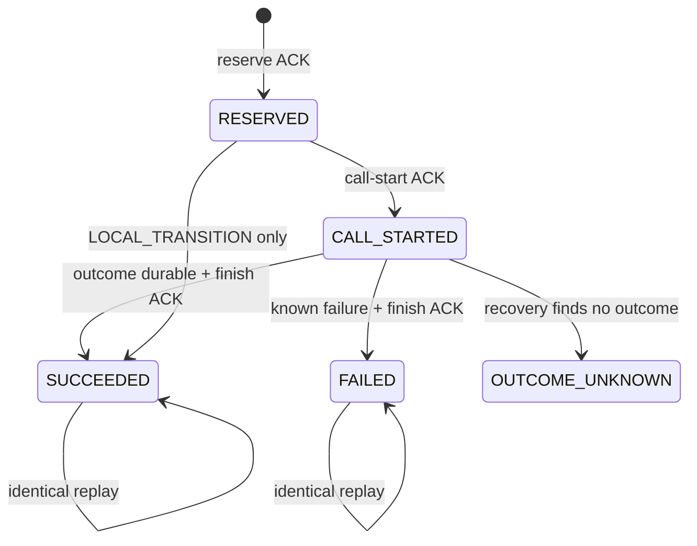

# Agent Loop Phase 2：Run Execution Ledger 设计与实施 Plan

> 状态：IMPLEMENTED / LOCALLY VERIFIED
> 日期：2026-08-01
> 上位设计：[`Agent Loop 语义深化总体设计`](../specs/2026-07-31-agent-loop-semantic-deepening-design.md)
> 上位计划：[`Agent Loop 语义深化实施计划`](./2026-07-31-agent-loop-semantic-deepening-implementation-plan.md)
> 前置阶段：[`Phase 1 Workflow Version 与 Resume Validation`](./2026-07-31-agent-loop-phase-1-workflow-version-resume-design.md)
> 适用范围：`backend-go/`、`contracts/proto/agent/v1/`、`agent-python/agent/`
> 目标版本：`agent-runtime.v4`、`agent-loop-snapshot.v3`、`run-ledger.v1`

---

## 0. 结论

Phase 2 引入一个不可绕过的 `RunExecutionLedger`，统一模型、Capability、Artifact、
Evidence 和 Checkpoint 的预算、幂等身份与 durable ACK 顺序。

核心决策：

1. 新增独立的 `execution_ledger_version=run-ledger.v1`，不让已有 v4 Run 在重启后静默
   切换副作用语义。
2. Run Budget 由 Go 服务端策略选择并在 Run 创建时持久化；Python 只能消费，不能扩大。
3. 每次远程调用都使用稳定 `operation_key + request_hash`，状态机固定为
   `RESERVED → CALL_STARTED → SUCCEEDED/FAILED`。
4. 模型或 Capability 的经过校验的输出必须先保存为确定性 Outcome Artifact 并获得 ACK，
   再完成 Ledger entry，最后才能保存引用该结果的 Checkpoint。
5. `RESERVED` 表示尚未开始物理调用，可以安全继续；`CALL_STARTED` 且没有 Outcome
   Artifact 表示结果未知，禁止自动重放。
6. `CALL_STARTED` 且 Outcome Artifact 已 durable 时，可以完成缺失的 Evidence/Ledger/
   Checkpoint，不重复物理调用。
7. Phase 1 的 `DURABLE_STATE_AHEAD_OF_CHECKPOINT` 在 Phase 2 中只对能被 Ledger entry
   唯一归属的 durable item 开放恢复；孤立 item 仍然 fail closed。
8. `shadow` 只运行确定性、内存内比较，不允许获得远程调用 reservation。
9. v1 与未启用 Ledger 的既有 v4 Run 保持原兼容路径；新 Ledger Run 只能路由到明确声明
   支持 `run-ledger.v1` 的 Worker。

Phase 2 不引入 Information Need、Verified Fact、新 Grounding 或 Confirmation Unit 语义。

### 本地实施结果（2026-08-01）

- 已落地 Migration 0013、Memory/PostgreSQL Ledger Store、不可变 Run Budget 与
  `execution_ledger_version`；
- 已扩展 protobuf、Worker Health、Pool/Dispatcher 双版本路由和 durable-ACK Ledger event；
- 已实现 Python Budget/Identity/Outcome/Reconciliation/RunExecutionLedger，并迁移 Model、
  Capability、Supplement、Repair 与本地 iteration/replan/supplement/repair transition；
- Snapshot v3 和 ResumeValidator 已支持 Ledger ownership reconciliation；
- Dispatcher 对 Ledger Run 不再使用 Model Attempt 粗粒度 quarantine；
- `shadow` 已改为纯内存评估，回归测试确认 Model/Capability physical delta 为 0；
- Go 全量测试、`go vet ./...`、Agent Python 94 项、Eval 63 项及根目录非 Eval
  247 项测试均通过；15 项环境相关测试按原条件跳过；
- 本地未启动真实 PostgreSQL 实例，Migration 0013 与 PostgreSQL 事务实现已通过编译、
  Store 单测和全量 Go 回归，仍需在集成环境执行数据库迁移/并发事务 Gate。

---

## 1. 当前实现基线

### 1.1 已具备

- Run 已持久化不可变 `workflow_version`；
- Worker Health 和 Agent Pool 已支持 workflow/snapshot capability 路由；
- Snapshot v3 已绑定 Run、Task、Repository、进度、Artifact 和 Draft submission intent；
- `ResumeValidator` 已集中校验 checkpoint 和 durable context；
- Worker 的事件队列在每个事件后等待 Go durable ACK；
- Go 已提供幂等 Model Attempt、Evidence、Artifact、Checkpoint 和 Draft Store；
- `(run_id, attempt_key)` 与 `(run_id, artifact_key)` 已具备唯一约束；
- Draft ACK 后已经支持 `TERMINAL_ACK_ONLY`；
- Phase 0 Trace 已区分 physical call 与 durable replay。

### 1.2 已确认缺口

| 当前行为 | 风险 |
| --- | --- |
| Graph 节点直接调用模型与 Capability | 预算、幂等、事件顺序分散 |
| `PLANNED` 后没有“物理调用已开始”边界 | 崩溃后无法区分可安全执行与 outcome unknown |
| 模型校验在调用方完成 | durable Artifact 可能不是经过 Schema 校验的结果 |
| Capability 只保存 Evidence | Evidence ACK 后、checkpoint 前无法归属到具体调用 |
| Model Attempt 与 Capability 没有统一 durable entry | Resume 无法使用同一恢复算法 |
| `token_usage`、iteration、tool call 等计数由 State 自报 | 预算可能因恢复或子 Loop 分叉而不一致 |
| Advanced Loop 存在 `tool_call_count < 8` | Supplement 使用独立硬编码预算 |
| Repair/Supplement 各自维护次数 | 不能形成一个 Run 的 ConsumedBudget |
| shadow 会构造可调用模型/Capability 的回调 | 未来修改容易引入额外远程副作用 |
| Dispatcher 对任意 Model Attempt 都保守 quarantine | 已有完整 Outcome Artifact 时仍不能安全恢复 |
| Run Budget 来自 Worker 当前环境 | Worker 重启或配置变化会改变同一 Run 的上限 |

---

## 2. 目标与非目标

### 2.1 目标

- Run 创建时持久化不可变 Budget 与 Ledger version；
- 所有模型/Capability 调用在物理调用前完成 durable reservation；
- 所有调用具有稳定 operation key、request hash 和 Outcome Artifact key；
- 模型、Capability、Initial、Supplement、Repair 和后续 Replan 共用一份预算；
- 在物理调用前确定性拒绝超预算调用；
- Outcome Artifact ACK 后的恢复不重复物理调用；
- outcome unknown 明确失败，不依赖猜测或自动重试；
- Artifact/Evidence/Ledger/Checkpoint 顺序由一个深 Module 编排；
- Phase 1 ResumeValidator 可以 reconcile 有 Ledger 归属的 durable-ahead 窗口；
- shadow 额外模型调用数和 Capability 调用数恒为 0；
- v1 和 pre-ledger v4 不回归；
- Trace 能观察 budget、reservation、physical/replay 和 unknown outcome。

### 2.2 非目标

- 不实现 Information Need Plan；
- 不引入 Fact/Unknown/Conflict Knowledge Artifact；
- 不改变现有 Coverage 和 Grounding 判定；
- 不允许重试结果未知的远程调用；
- 不保存原始 Prompt、隐藏推理或未经校验的完整模型响应；
- 不允许 Python 直接访问 PostgreSQL；
- 不并行执行模型或 Capability；
- 不修改 Capability 权限与 Repository revision 语义；
- 不把 Ledger 作为 Published PRD 或 Repository 内容权威；
- 不删除旧 `go_model_attempts` 和现有 v1 producer。

---

## 3. 不可破坏的不变量

1. `execution_ledger_version` 与 Run Budget 创建后不可修改。
2. 普通用户不能在 Create/Retry/Reopen 请求中指定 Ledger version 或 Budget。
3. Ledger Run 只能分配给明确声明兼容该 workflow、snapshot 和 Ledger version 的 Worker。
4. operation key 不包含 request hash；相同 key 的 request hash 变化必须冲突。
5. `RESERVED` 只有在 Go ACK 后才允许进入下一步。
6. 物理调用前必须持久化 `CALL_STARTED` 并等待 ACK。
7. `CALL_STARTED` 且无 matching Outcome Artifact 时禁止自动物理重放。
8. Outcome Artifact 必须经过 Schema 校验、使用确定性 key，并在 Ledger `SUCCEEDED`
   前 durable ACK。
9. Capability Evidence 必须来自已 ACK 的 Capability Outcome Artifact；不能先保存孤立 Evidence。
10. Ledger `SUCCEEDED` 只能引用已存在且 hash 一致的 Artifact/Evidence。
11. 引用 Ledger outcome 的 Checkpoint 必须在 Ledger terminal ACK 后保存。
12. Budget reservation 在调用前扣减可用额度；unknown outcome 不返还 reservation。
13. 实际 Token 超出估算时记录 overage，之后不允许继续消费相关预算。
14. Snapshot budget、Go durable budget 和 Ledger entries 必须能相互重算；不一致 fail closed。
15. replay 不增加 physical call、model attempt、tool call 或 token consumption。
16. shadow 不能创建远程类型的 Ledger reservation。
17. v1/pre-ledger v4 不能读取或伪造 `run-ledger.v1` 状态。
18. lease fencing 继续保护所有 Ledger mutation。

---

## 4. 总体结构

```mermaid
flowchart LR
    POLICY["Go Run Policy"] --> RUN["Agent Run + Budget + Ledger Version"]
    RUN --> ROUTE["Version-aware Dispatcher"]
    ROUTE --> RESUME["ResumeValidator + Ledger Reconciler"]
    RESUME --> LEDGER["RunExecutionLedger"]
    LEDGER --> MODEL["Model Adapter"]
    LEDGER --> CAP["Capability Adapter"]
    MODEL --> OUTCOME["Validated Outcome Artifact"]
    CAP --> OUTCOME
    OUTCOME --> DURABLE["Go Durable Store ACK"]
    DURABLE --> FINISH["Ledger Entry FINISHED"]
    FINISH --> CHECKPOINT["Snapshot v3 Checkpoint"]
    CHECKPOINT --> GRAPH["LangGraph next node"]
```



所有权：

- Go 决定 Ledger version、Run Budget 并原子执行 durable 状态迁移；
- Python Ledger 计算稳定身份、执行预算策略和编排事件顺序；
- Adapter 只执行一次物理调用，不理解 checkpoint；
- Graph 只表达业务状态迁移，不直接写事件或调用外部系统；
- Worker Server 继续负责事件流、ACK、取消和 gRPC 合同。

---

## 5. Ledger Version Boundary

### 5.1 版本集合

```text
execution_ledger_version = null             v1/pre-ledger compatibility
execution_ledger_version = run-ledger.v1    Phase 2 durable ledger
```

规则：

- 只有 `agent-runtime.v4` 新 Run 可以选择 `run-ledger.v1`；
- v1 Run 的 Ledger version 必须为空；
- Phase 1 已创建的 v4 Run 保持为空，不原地升级；
- Retry/Reopen 创建新 Run，可以由当前服务端策略选择 `run-ledger.v1`；
- 同一 Run 不允许从空值切到 v1，也不允许降级；
- workflow、snapshot、ledger 三个 capability 必须同时匹配后才能 Acquire Lease。

### 5.2 Worker capability

`HealthResponse` additive 增加：

```proto
repeated string supported_execution_ledger_versions = 9;
```

兼容规则：

- 旧 Worker 字段为空，只能接收 Ledger version 为空的 Run；
- 新 Worker 可以同时支持 legacy 与 `run-ledger.v1`；
- Health 失败时 slot 维持 capability unknown，不接收新 Run；
- Pool 新增 `ReserveForRun(workflow_version, ledger_version)`；
- `ErrNoCompatibleWorker` 继续表示 Run 保持 QUEUED、不 Acquire Lease。

---

## 6. Run Budget

### 6.1 模型

```python
@dataclass(frozen=True)
class RunBudget:
    max_model_attempts: int
    max_tool_calls: int
    max_iterations: int
    max_replans: int
    max_supplements: int
    max_quality_repairs: int
    max_input_tokens: int
    max_output_tokens: int
    max_elapsed_ms: int

@dataclass(frozen=True)
class ConsumedBudget:
    model_attempts: int = 0
    tool_calls: int = 0
    iterations: int = 0
    replans: int = 0
    supplements: int = 0
    quality_repairs: int = 0
    input_tokens: int = 0
    output_tokens: int = 0
    elapsed_ms: int = 0
```

所有值为非负整数。Run Budget 至少允许一次模型调用或明确配置为 0；各子预算不能超过
服务端绝对上限。

### 6.2 持久化与选择

- Go 新增 `RunBudgetPolicy`，由服务端配置选择；
- v4 Ledger Run 在 Run 创建事务中同时创建 budget state；
- Budget policy 使用 canonical JSON 和 tagged SHA-256 hash；
- Start idempotency replay 返回原 budget，不重新选择；
- Retry/Reopen 新 Run 使用当前 policy；
- Python 从 `AgentRunInput.run_budget` 获取上限，不以 Worker 当前环境覆盖；
- Worker 配置中的 provider per-call 上限仍可更严格，但不能扩大 Run Budget。

### 6.3 Reservation 语义

```text
remaining = limit - consumed - active_reservations
```

- Model/CAPABILITY 在物理调用前 reservation；
- reservation 包含估算 input/output token 和一个调用名额；
- `CALL_STARTED` 后无论结果是否已知，调用名额都不返还；
- `SUCCEEDED/FAILED` 将 reservation 转为 actual consumption；
- actual token 大于 estimate 时记录 overage；
- overage 后相关 remaining 取 0，不能继续调用；
- LOCAL_TRANSITION 可以原子消费 iteration/replan/supplement/repair，无物理调用状态；
- elapsed budget 使用 Go budget row 的 `started_at`，不信任 Worker 自报绝对时间。

### 6.4 Stop Reason

新增低基数 Stop Reason：

```text
MODEL_ATTEMPT_BUDGET_EXHAUSTED
TOOL_CALL_BUDGET_EXHAUSTED
ITERATION_BUDGET_EXHAUSTED
REPLAN_BUDGET_EXHAUSTED
SUPPLEMENT_BUDGET_EXHAUSTED
QUALITY_REPAIR_BUDGET_EXHAUSTED
INPUT_TOKEN_BUDGET_EXHAUSTED
OUTPUT_TOKEN_BUDGET_EXHAUSTED
ELAPSED_TIME_BUDGET_EXHAUSTED
BUDGET_OVERAGE_RECORDED
```

预算不足是确定性停止，不产生远程调用。是否形成 Partial/Needs Human 沿用当前产品规则。

---

## 7. Durable Ledger Data Model

### 7.1 Migration 0013

新增：

```text
backend-go/db/migrations/0013_run_execution_ledger.sql
```

修改 `go_agent_runs`：

```sql
ALTER TABLE go_agent_runs
    ADD COLUMN execution_ledger_version TEXT;

ALTER TABLE go_agent_runs
    ADD CONSTRAINT ck_go_agent_runs_execution_ledger_version
    CHECK (
        execution_ledger_version IS NULL OR
        execution_ledger_version = 'run-ledger.v1'
    );
```

新增预算表：

```sql
CREATE TABLE go_run_budget_state (
    run_id TEXT PRIMARY KEY REFERENCES go_agent_runs(run_id),
    policy_hash TEXT NOT NULL,
    policy_json JSONB NOT NULL,
    reserved_json JSONB NOT NULL,
    consumed_json JSONB NOT NULL,
    overage_json JSONB NOT NULL,
    started_at TIMESTAMPTZ NOT NULL,
    updated_at TIMESTAMPTZ NOT NULL
);
```

新增 Ledger 表：

```sql
CREATE TABLE go_run_ledger_entries (
    entry_id TEXT PRIMARY KEY,
    run_id TEXT NOT NULL REFERENCES go_agent_runs(run_id),
    operation_key TEXT NOT NULL,
    entry_kind TEXT NOT NULL,
    operation TEXT NOT NULL,
    request_hash TEXT NOT NULL,
    status TEXT NOT NULL,
    reservation_json JSONB NOT NULL,
    consumption_json JSONB NOT NULL,
    output_artifact_key TEXT,
    output_artifact_hash TEXT,
    evidence_refs TEXT[] NOT NULL DEFAULT '{}',
    error_category TEXT,
    retryable BOOLEAN NOT NULL DEFAULT FALSE,
    created_at TIMESTAMPTZ NOT NULL,
    call_started_at TIMESTAMPTZ,
    completed_at TIMESTAMPTZ,
    updated_at TIMESTAMPTZ NOT NULL,
    UNIQUE (run_id, operation_key),
    CHECK (entry_kind IN ('MODEL','CAPABILITY','LOCAL_TRANSITION')),
    CHECK (status IN ('RESERVED','CALL_STARTED','SUCCEEDED','FAILED','OUTCOME_UNKNOWN'))
);
```

不对历史 Run 回填 Ledger entry。`go_model_attempts` 保留为 API/Eval projection。

### 7.2 状态机



禁止：

- `CALL_STARTED → RESERVED`；
- `OUTCOME_UNKNOWN → CALL_STARTED`；
- terminal status 修改 request hash 或 output ref；
- 同一 operation key 使用不同 entry kind/operation；
- FAILED entry 原地重试。重试必须使用由 policy 生成的新 operation key 并重新消费预算。

### 7.3 Go 原子操作

`AgentExecutionStore` 新增：

```go
ReserveLedgerEntry(ctx, lease, entry, budget) (LedgerEntry, error)
MarkLedgerCallStarted(ctx, lease, operationKey, requestHash) (LedgerEntry, error)
FinishLedgerEntry(ctx, lease, result) (LedgerEntry, error)
ConsumeLocalLedgerEntry(ctx, lease, entry) (LedgerEntry, error)
```

事务规则：

- Reserve 锁 Run、Budget row，校验 lease、version、policy hash 和 remaining；
- 同 key/hash Reserve 返回原 entry；同 key/不同 hash 返回 `ErrInvalidIdempotency`；
- CallStarted 只允许从 RESERVED 进入；相同请求幂等返回；
- Finish 锁 entry、budget、referenced artifact/evidence；引用缺失或 hash 不一致时拒绝；
- Finish 更新 Budget、Ledger 及 Model Attempt projection 后一次提交；
- LOCAL_TRANSITION 在一个事务中创建 SUCCEEDED entry 并消费本地预算；
- 所有 mutation 继续检查 fencing token 和 lease expiry。

---

## 8. Protobuf Contract

### 8.1 Run Context

对 `AgentRunInput` additive 扩展：

```proto
string execution_ledger_version = 19;
RunBudget run_budget = 20;
ConsumedBudget consumed_budget = 21;
repeated RunLedgerEntry ledger_entries = 22;
```

Ledger entry 必须包含：

```proto
message RunLedgerEntry {
  string entry_id = 1;
  string operation_key = 2;
  string entry_kind = 3;
  string operation = 4;
  string request_hash = 5;
  string status = 6;
  BudgetDelta reservation = 7;
  BudgetDelta consumption = 8;
  string output_artifact_key = 9;
  string output_artifact_hash = 10;
  repeated string evidence_refs = 11;
  string error_category = 12;
  bool retryable = 13;
}
```

规则：

- `ledger_entries` 不使用 LIMIT；数量由持久化 Run Budget 自然限制；
- 超过合同最大条目数时返回 `RESUME_CONTEXT_LIMIT_EXCEEDED`；
- v4 + Ledger Run 缺 budget 或 ledger summary 时 fail closed；
- legacy Run 禁止携带伪造 Ledger version。

### 8.2 Worker Event

`ExecuteRunResponse` additive 增加：

```proto
RunLedgerEvent ledger_event = 20;
```

事件类型：

```text
LEDGER_RESERVED
LEDGER_CALL_STARTED
LEDGER_FINISHED
```

Go 必须先应用 event 并提交事务，随后才发送现有 AcknowledgeEvent。Worker 不需要直接读取
数据库 receipt；它使用初始 durable Ledger view 与当前执行内已 ACK 的本地 index。

### 8.3 Model Attempt 兼容投影

- v1 继续发送现有 `MODEL_ATTEMPT`；
- Ledger v1 Worker 对模型发送 Ledger event；
- Go 在 Reserve/Finish 事务中维护 `go_model_attempts` projection；
- 公共 API 和 Phase 0 Eval 不需要立即迁移；
- 同一执行禁止同时发送等价的 Ledger Model event 和旧 Model Attempt event。

---

## 9. Stable Identity 与 Outcome Artifact

### 9.1 Operation Key

Operation key 由逻辑位置生成，不包含 request hash：

```text
model:plan_or_generate_working_draft:iteration:1
model:generate_working_draft:generation:1
model:repair_working_draft:repair:1
capability:search_repository:action:<action_signature>
capability:fetch_prd_sections:action:<action_signature>:page:1
transition:iteration:1
transition:supplement:1
```

序列化前必须验证：

- operation/key 为低基数前缀 + 有界稳定 ID；
- 不包含 Prompt、查询正文、路径、Evidence excerpt 或用户反馈；
- 同一 Graph 逻辑位置重复计算结果完全一致。

### 9.2 Request Hash

使用 canonical JSON 和 `sha256:<lowercase hex>`：

- Model：workflow、operation、prompt version、provider/model ID、system instruction hash、
  canonical user payload；
- Capability：tool ID/schema、canonical arguments、Repository binding/revision、scope；
- LOCAL_TRANSITION：transition type、logical sequence、前置 status。

Secrets、authorization header 和 provider token 永不进入 hash payload。

### 9.3 Outcome Artifact

远程调用使用确定性 key：

```text
<run_id>:ledger:<operation_key_hash>:outcome
```

Artifact type：

```text
MODEL_VALIDATED_OUTPUT
CAPABILITY_VALIDATED_OUTPUT
```

模型 Artifact 只保存通过 operation-specific Schema 校验的 canonical object、output hash 和
必要的公开 metadata；不保存 Prompt、隐藏推理或未经校验的原始响应。

Capability Artifact 保存经过 normalize 的 typed result。对 Evidence 型调用，Artifact 可包含
活动恢复所需的 EvidenceItem；仍受现有大小、保留期和敏感内容规则约束。

Outcome Artifact 的 request hash 必须等于 Ledger entry request hash。Ledger Finish 再次校验
artifact key、type、request hash 和 content hash。

---

## 10. Python RunExecutionLedger

### 10.1 文件与接口

新增：

```text
agent-python/agent/runtime/ledger.py
agent-python/agent/runtime/budget.py
agent-python/agent/runtime/idempotency.py
agent-python/agent/runtime/outcomes.py
agent-python/agent/runtime/reconcile.py
```

建议接口：

```python
@dataclass(frozen=True)
class LedgerCallSpec(Generic[T]):
    entry_kind: LedgerEntryKind
    operation: str
    operation_key: str
    request_hash: HashDigest
    reservation: BudgetDelta
    outcome_schema: str

@dataclass(frozen=True)
class LedgerOutcome(Generic[T]):
    value: T
    artifact: ArtifactRef
    replayed: bool
    consumption: BudgetDelta

class RunExecutionLedger:
    def execute_model(self, spec, invoke, validate) -> LedgerOutcome: ...
    def execute_capability(self, spec, invoke, normalize) -> LedgerOutcome: ...
    def consume_transition(self, spec) -> None: ...
    def save_checkpoint(self, state, status) -> int: ...
    def remaining(self) -> RemainingBudget: ...
    def stop_reason(self) -> StopReason | None: ...
```

`invoke` 是唯一允许执行物理调用的回调；Graph、AdvancedLoop 和 Policy 不直接持有可调用
的 Model/Capability Adapter。

### 10.2 模型执行顺序

```text
compute operation_key/request_hash
  -> check/reuse durable entry
  -> LEDGER_RESERVED ACK
  -> LEDGER_CALL_STARTED ACK
  -> physical model call
  -> operation-specific schema validation
  -> MODEL_VALIDATED_OUTPUT artifact ACK
  -> LEDGER_FINISHED(SUCCEEDED, actual usage) ACK
  -> return typed outcome
```

已存在 entry：

- SUCCEEDED：hydrate Artifact，重新做 schema/hash 校验，`replayed=True`；
- FAILED：返回稳定失败，不调用 provider；
- RESERVED：发送 CALL_STARTED 后允许物理调用；
- CALL_STARTED + matching Artifact：完成缺失 Ledger Finish，不物理调用；
- CALL_STARTED + 无 Artifact：抛 `LedgerOutcomeUnknown`；
- OUTCOME_UNKNOWN：抛同一错误，禁止自动恢复。

### 10.3 Capability 执行顺序

```text
LEDGER_RESERVED ACK
  -> LEDGER_CALL_STARTED ACK
  -> physical capability call
  -> normalize typed result/evidence
  -> CAPABILITY_VALIDATED_OUTPUT artifact ACK
  -> EVIDENCE_APPENDED ACK (when applicable)
  -> LEDGER_FINISHED(SUCCEEDED, evidence refs) ACK
  -> return typed outcome
```

恢复时如果 Artifact 已存在但 Evidence 缺失，Ledger 从 Artifact 重放 durable append；Evidence
Store 的唯一约束保证该 append 幂等。之后完成 Ledger，不重复 Capability。

### 10.4 Artifact 与 Checkpoint API

- Graph 不再直接调用 `sink.artifact/checkpoint`；
- Ledger 保存 Artifact 后更新本地 durable index；
- `save_checkpoint` 验证 state 引用的 Ledger/Artifact/Evidence 都已 ACK；
- Snapshot v3 写入 `execution_ledger_version`、terminal operation keys 和 Budget 摘要；
- State 中旧 `token_usage/tool_call_count/...` 保留为只读 compatibility alias，由 Ledger
  生成，Graph 不再手工自增。

---

## 11. Resume 与 Reconciliation

### 11.1 ValidatedRunState 扩展

```python
@dataclass(frozen=True)
class ValidatedRunState:
    ...
    budget: ValidatedBudgetState
    ledger: LedgerIndex
    reconciliation: ReconciliationPlan
```

`ResumeValidator` 在 Graph 前固定执行：

1. workflow/snapshot/ledger version matrix；
2. budget policy hash、consumed、reserved 和 overage；
3. Ledger entry key/hash/status/state transition；
4. Outcome Artifact 与 entry ownership；
5. Evidence refs 与 Capability Artifact；
6. Snapshot terminal operation set；
7. durable-ahead reconciliation plan；
8. outcome unknown 判定。

### 11.2 Phase 1 durable-ahead 规则调整

只有以下情况允许 reconcile：

- Artifact key 是某个 CALL_STARTED Ledger entry 的确定性 Outcome key；
- Artifact request/content hash 与 entry 和 summary 一致；
- extra Evidence 全部包含在该 Capability Outcome Artifact 中；
- 没有两个 entry 竞争同一 Artifact/Evidence ref；
- Snapshot status 允许在当前边界完成缺失 Ledger/Checkpoint。

其他多余 Artifact、Evidence、Model Attempt 或 Ledger entry 继续返回
`DURABLE_STATE_AHEAD_OF_CHECKPOINT`。

### 11.3 Recovery Action

```text
NO_ACTION
CONTINUE_RESERVED_CALL
REPLAY_DURABLE_OUTCOME
APPEND_MISSING_EVIDENCE
FINISH_LEDGER_ENTRY
SAVE_CHECKPOINT_ONLY
OUTCOME_UNKNOWN_FAIL_CLOSED
```

ReconciliationPlan 只描述确定性动作，不包含直接数据库操作；实际动作仍通过 Worker event
和 Go ACK 完成。

---

## 12. Graph 与 Advanced Loop 改造

### 12.1 LangGraphAgentLoop

- `_call_model` 替换为 `ledger.execute_model`；
- `_execute_action` 替换为 `ledger.execute_capability`；
- attempt key、request hash、PLANNED/SUCCEEDED event 不再由节点拼接；
- `pre_action_stop` 使用 `ledger.remaining()`；
- iteration/replan 通过 `consume_transition`；
- `_emit_checkpoint` 替换为 `ledger.save_checkpoint`；
- 节点只处理 typed outcome 和业务状态。

### 12.2 AdvancedLoopRunner

- 删除 `max_supplements/max_repairs` 的独立预算所有权；
- 删除 `tool_call_count < 8`；
- Supplement 和 Repair 使用同一个 Ledger 与 Run Budget；
- `_save_bundle/_save_json_artifact` 改为 Ledger artifact API；
- `draft_generation/supplement_count/repair_count` 从 Ledger transition projection 获取；
- 仍保持现有 Grounding/Quality 产品规则不变。

### 12.3 Shadow

引入：

```text
SideEffectMode.OFF
SideEffectMode.SHADOW
SideEffectMode.ENFORCE
```

- SHADOW Ledger 拒绝 MODEL/CAPABILITY reservation；
- shadow 只能读取主路径已存在的 typed outcome，运行确定性 policy/diff；
- 缺少输入时记录 `SHADOW_INPUT_UNAVAILABLE` 并跳过；
- shadow 不写 durable Artifact/Evidence/Checkpoint；
- Eval 对 shadow 前后 physical call delta 强制为 0。

---

## 13. Dispatcher 与 Recovery

### 13.1 Event Applier

新增事件处理：

```text
LEDGER_RESERVED     -> ReserveLedgerEntry
LEDGER_CALL_STARTED -> MarkLedgerCallStarted
LEDGER_FINISHED     -> FinishLedgerEntry / ConsumeLocalLedgerEntry
```

每次 Store 成功提交后才 ACK Worker。若 Store 返回 key/hash/status 冲突，Dispatch 标为
UNKNOWN，Run fail closed，不继续读取下一事件。

### 13.2 Unknown Dispatch Recovery

替换当前“存在任意 Model Attempt 即 quarantine”的粗粒度规则：

- legacy v1/pre-ledger v4 保持现有保守规则；
- Ledger Run 读取 Ledger entry：
  - terminal entries 和完整 Artifact 可自动恢复；
  - RESERVED 可重新派发给兼容 Worker；
  - CALL_STARTED 无 Outcome Artifact → `OUTCOME_UNKNOWN`，Run FAILED/人工重试；
  - CALL_STARTED 有 Artifact → 重新派发，由 Ledger reconcile；
- recovery attempt budget 继续限制 Dispatcher 自身重派次数。

---

## 14. Error Taxonomy

新增低基数错误：

```text
LEDGER_VERSION_UNSUPPORTED
LEDGER_REQUIRED
LEDGER_ENTRY_INVALID
LEDGER_OPERATION_CONFLICT
LEDGER_STATE_TRANSITION_INVALID
LEDGER_OUTCOME_ARTIFACT_MISSING
LEDGER_OUTCOME_ARTIFACT_MISMATCH
LEDGER_EVIDENCE_OWNERSHIP_INVALID
LEDGER_OUTCOME_UNKNOWN
BUDGET_POLICY_MISMATCH
BUDGET_STATE_INVALID
BUDGET_EXHAUSTED
BUDGET_OVERAGE
SHADOW_SIDE_EFFECT_FORBIDDEN
```

映射：

- Resume/identity/hash/state 错误 → `CHECKPOINT_INCOMPATIBLE`, retryable=false；
- `LEDGER_OUTCOME_UNKNOWN` → 同 Run retryable=false，允许用户创建新 Run；
- Budget exhausted → 正常受控 stop，不作为基础设施错误；
- Go fencing/lease 错误保持现有分类；
- 日志只记录 Run/dispatch/operation key、version、status、reason 和 hash。

---

## 15. 文件变更清单

### 15.1 新增

```text
backend-go/db/migrations/0013_run_execution_ledger.sql
backend-go/internal/runcontrol/ledger.go
backend-go/internal/runcontrol/budget.go
backend-go/internal/runcontrol/ledger_test.go
backend-go/internal/storage/ledger.go
backend-go/internal/storage/ledger_integration_test.go
backend-go/internal/dispatcher/ledger_events_test.go
backend-go/internal/dispatcher/ledger_recovery_test.go

agent-python/agent/runtime/ledger.py
agent-python/agent/runtime/budget.py
agent-python/agent/runtime/idempotency.py
agent-python/agent/runtime/outcomes.py
agent-python/agent/runtime/reconcile.py
agent-python/tests/test_run_budget.py
agent-python/tests/test_execution_ledger.py
agent-python/tests/test_ledger_model_execution.py
agent-python/tests/test_ledger_capability_execution.py
agent-python/tests/test_ledger_crash_matrix.py
agent-python/tests/test_shadow_side_effects.py
```

### 15.2 修改

```text
backend-go/internal/runcontrol/model.go
backend-go/internal/runcontrol/store.go
backend-go/internal/runcontrol/memory_store.go
backend-go/internal/storage/postgres.go
backend-go/internal/storage/agent_execution.go
backend-go/internal/dispatcher/dispatcher.go
backend-go/internal/agentpool/pool.go
backend-go/internal/config/config.go
backend-go/cmd/api/main.go
backend-go/cmd/maintenance/main.go

contracts/proto/agent/v1/agent_execution.proto
contracts/proto/agent/v1/agent_worker.proto
contracts/gen/go/agent/v1/*
agent-python/agent/v1/*

agent-python/agent/context.py
agent-python/agent/runtime/event_sink.py
agent-python/agent/resume/models.py
agent-python/agent/resume/validator.py
agent-python/agent/graph/state.py
agent-python/agent/graph/snapshot.py
agent-python/agent/graph/runtime.py
agent-python/agent/graph/advanced.py
agent-python/agent/investigation/policies.py
agent-python/agent/worker_server.py
agent-python/agent/bootstrap.py
agent-python/agent/eval_adapter.py
src/prd_agent/eval/agent_trace.py
src/prd_agent/eval/metrics.py
```

### 15.3 不修改产品语义

```text
agent-python/agent/information_need/   # Phase 3
agent-python/agent/grounding/          # 规则不变
agent-python/agent/quality/            # 规则不变
backend-go/internal/capability/        # 权限/读取语义不变
infra/production/ingress/              # 保持用户现有改动
```

---

## 16. 按实现顺序的 Plan

### Step 2.1：固定副作用与预算基线

- 为当前 Model、Capability、Supplement、Repair 和 shadow 记录 characterization；
- 固定 stable operation key/request hash 测试向量；
- 固定每个 ACK 边界的现有事件序列；
- 新增 Ledger version 和 Budget policy value object，不接生产路径。

提交：`test: characterize agent side-effect and budget boundaries`

### Step 2.2：持久化 Ledger Version 与 Run Budget

- Migration 0013；
- Run 创建/Retry/Reopen 写 immutable ledger version 和 budget row；
- Memory/PostgreSQL 合同一致；
- 幂等 replay 不重新选择 budget；
- 普通 API 不暴露 budget/version。

提交：`feat: persist immutable agent run budgets`

### Step 2.3：实现 Go Ledger Store

- 定义 Ledger/Budget Go model；
- 实现 Reserve、CallStarted、Finish、ConsumeLocal；
- 原子预算检查、状态迁移、Artifact/Evidence 验证；
- 更新 Model Attempt compatibility projection；
- 单测与 PostgreSQL integration。

提交：`feat: add durable run execution ledger store`

### Step 2.4：扩展 protobuf 与版本路由

- additive RunBudget/Ledger input 和 Ledger event；
- Worker Health 声明 Ledger capability；
- Pool 按 workflow + ledger version 路由；
- Dispatcher 在 Lease 前过滤；
- 重新生成 Go/Python bindings。

提交：`feat: route agent runs by execution ledger version`

### Step 2.5：实现 Python Budget、Identity 与 Ledger Core

- RunBudget/Consumed/Remaining/BudgetDelta；
- stable operation key、canonical request hash；
- LedgerIndex、state machine、Outcome Artifact codec；
- Buffered sink 下的纯单元测试；
- 暂不替换 Graph 调用。

提交：`feat: add shared agent run execution ledger`

### Step 2.6：集中模型调用

- `_call_model` 迁移到 `execute_model`；
- PLANNED/CALL_STARTED/Artifact/Finish 顺序；
- operation-specific validation 后才写 Artifact；
- SUCCEEDED replay 与 outcome unknown；
- 删除节点自行拼接 attempt key 和调用后预算判断。

提交：`feat: execute model calls through the run ledger`

### Step 2.7：集中 Capability 与本地 transition

- Capability adapter 迁移到 `execute_capability`；
- Outcome Artifact 先于 Evidence；
- Initial/Supplement 共用 tool budget；
- iteration/replan/supplement/repair 使用 local transition entry；
- 删除 `< 8` 和分散计数。

提交：`feat: execute capabilities through the run ledger`

### Step 2.8：Checkpoint 与 Resume Reconciliation

- Snapshot v3 增加 Ledger/Budget 摘要；
- ResumeValidator hydrate LedgerIndex；
- 实现 Artifact/Evidence durable-ahead ownership；
- 实现 RESERVED、durable outcome、unknown outcome 恢复；
- Dispatcher 使用 Ledger 状态替换粗粒度 Model Attempt quarantine。

提交：`feat: reconcile durable ledger outcomes on resume`

### Step 2.9：Advanced/Shadow 收口

- AdvancedLoopRunner 使用共享 Ledger；
- 删除 Supplement/Repair 独立预算；
- shadow 禁止远程 reservation；
- Eval 断言 shadow physical delta=0。

提交：`fix: make agent shadow execution side-effect free`

### Step 2.10：Crash Matrix、Eval 与 Rollout 文档

- 覆盖每个 Ledger 状态和 ACK 窗口；
- 覆盖 budget boundary/overage；
- Trace 增加 ledger status、budget、physical/replay/unknown；
- 更新运行手册、告警、回滚与 canary 步骤；
- 全量 Phase 0/1 回归。

提交：`test: verify execution ledger crash and budget boundaries`

---

## 17. 单元测试与 Crash Matrix

### 17.1 Budget Unit Tests

- 每个 limit 的 0、边界值、超限；
- consumed + reserved 重算 remaining；
- reservation 完成后转换 actual；
- actual token 小于/等于/大于 estimate；
- overage 后禁止下一次调用；
- unknown outcome 不返还 reservation；
- replay 不增加 consumption；
- elapsed deadline 在调用前停止；
- Initial/Supplement/Repair/Replan 共用同一计数；
- policy canonical hash 稳定；
- negative、overflow、未知字段拒绝。

### 17.2 Identity Unit Tests

- 同输入 operation key/request hash 稳定；
- request hash 变化但 operation key 不变时冲突；
- Repository revision、prompt version、tool schema 改变 request hash；
- secret/header 不进入 hash；
- Unicode/canonical JSON 跨 Python/Go 测试向量一致；
- Artifact key 由 operation key 唯一推导。

### 17.3 Go Store Contract

- Reserve 原子扣减预算；
- 同 key/hash 幂等；同 key/不同 hash 冲突；
- 非法状态迁移拒绝；
- lease/fencing 失效拒绝；
- Finish 引用缺失 Artifact/Evidence 拒绝；
- Artifact hash/request hash 漂移拒绝；
- Model Attempt projection 与 Ledger 一致；
- Memory/PostgreSQL 行为一致；
- Start/Retry/Reopen budget/version 选择一致；
- 并发 reservation 不能突破预算。

### 17.4 Python Ledger

- fresh reserve → call → artifact → finish；
- SUCCEEDED durable replay 零物理调用；
- FAILED durable replay 零物理调用；
- RESERVED 允许一次物理调用；
- CALL_STARTED + Artifact 完成 Ledger、零物理调用；
- CALL_STARTED 无 Artifact 返回 outcome unknown；
- Capability Artifact 恢复缺失 Evidence；
- Outcome schema/hash/key 不一致 fail closed；
- checkpoint 不能引用未完成 Ledger entry；
- cancellation 不能越过 ACK 边界继续调用。

### 17.5 Crash Matrix

| 崩溃位置 | Durable 状态 | 恢复行为 | 物理重放 |
| --- | --- | --- | ---: |
| Reserve 前 | 无 entry | 正常 reserve | 允许 |
| Reserve ACK 后、CallStarted 前 | RESERVED | 继续 CallStarted | 允许 |
| CallStarted ACK 后、provider 调用前 | CALL_STARTED | outcome unknown | 禁止 |
| provider response 后、Artifact ACK 前 | CALL_STARTED | outcome unknown | 禁止 |
| Artifact ACK 后、Evidence 前 | CALL_STARTED + Artifact | 重放 durable Evidence | 0 |
| Evidence ACK 后、Ledger Finish 前 | CALL_STARTED + Artifact + Evidence | Finish Ledger | 0 |
| Ledger Finish ACK 后、Checkpoint 前 | SUCCEEDED | replay outcome + save checkpoint | 0 |
| Checkpoint ACK 后 | SUCCEEDED + checkpoint | 从下一节点继续 | 0 |
| FAILED Finish ACK 后 | FAILED | replay stable failure | 0 |
| Budget overage ACK 后 | terminal budget state | 受控停止 | 0 |

CallStarted ACK 后即使物理调用尚未真正发出，也按 outcome unknown 处理。这是为了避免在网络
发送边界无法证明的情况下重复付费或产生重复外部副作用。

### 17.6 Shadow Tests

- shadow 使用主路径已有 typed outcome；
- 缺输入时 skip，不调用模型/Capability；
- shadow 不能创建 MODEL/CAPABILITY Ledger entry；
- shadow 不写 Artifact/Evidence/Checkpoint；
- off/shadow/enforce 的主路径输出不因 shadow 调用次数变化；
- Eval `model_physical_call_delta=0`、`capability_physical_call_delta=0`。

---

## 18. Eval 与可观测性

Trace 新增：

```text
execution_ledger_version
ledger_entry_count
ledger_replay_count
ledger_outcome_unknown_count
budget_policy_hash
budget_consumed
budget_remaining
budget_overage
model_physical_call_count
capability_physical_call_count
shadow_physical_call_delta
```

指标：

```text
agent_ledger_entry_total{kind,status}
agent_ledger_replay_total{kind}
agent_ledger_outcome_unknown_total{kind,operation}
agent_budget_exhausted_total{dimension}
agent_budget_overage_total{dimension}
agent_shadow_side_effect_violation_total{kind}
agent_ledger_incompatible_total{ledger_version}
```

告警：

- 任意 shadow side-effect violation；
- 任意同 operation key/request hash conflict；
- Outcome Artifact hash mismatch；
- outcome unknown 比率持续上升；
- v4 Ledger Run 长时间无兼容 Worker；
- budget state 与 Snapshot 重算不一致。

---

## 19. Compatibility、部署与回滚

### 19.1 部署顺序

1. 部署 additive proto 和 Migration 0013；默认仍创建 v1/pre-ledger Run；
2. 部署 Go Ledger Store、Budget policy 和兼容 projection；
3. 部署能读取 legacy 与 `run-ledger.v1` 的 Worker；
4. 开启 workflow + ledger version 联合路由；
5. 验证旧 v1/pre-ledger v4 Run 仍走原路径；
6. 内部配置创建少量 `agent-runtime.v4 + run-ledger.v1` canary；
7. 通过 Crash Matrix 和 physical-call Eval 后，允许 Phase 3 在 Ledger Run 上开发。

### 19.2 回滚

- 关闭新 Run 的 Ledger policy，继续创建 v1/pre-ledger Run；
- 不修改已有 Ledger Run 的 version 或 budget；
- 保留至少一个 Ledger-capable Worker，直到所有 Ledger Run terminal；
- Migration 0013 和 additive proto 不回滚；
- pre-ledger Worker 不接收 Ledger Run；
- 如果 Ledger Worker 全部不可用，Ledger Run 保持 QUEUED 并告警。

---

## 20. 验证命令

```bash
PYTHONPATH=agent-python venv/bin/python -m pytest -q \
  agent-python/tests/test_run_budget.py \
  agent-python/tests/test_execution_ledger.py \
  agent-python/tests/test_ledger_model_execution.py \
  agent-python/tests/test_ledger_capability_execution.py \
  agent-python/tests/test_ledger_crash_matrix.py \
  agent-python/tests/test_shadow_side_effects.py \
  agent-python/tests/test_resume_validator.py

env GOCACHE=/private/tmp/prd-agent-go-cache \
    GOMODCACHE=/private/tmp/prd-agent-go-mod-cache \
    go test ./backend-go/internal/runcontrol \
            ./backend-go/internal/agentpool \
            ./backend-go/internal/dispatcher

PRD_AGENT_TEST_DATABASE_DSN="$PRD_AGENT_DATABASE_DSN" \
  env GOCACHE=/private/tmp/prd-agent-go-cache \
      GOMODCACHE=/private/tmp/prd-agent-go-mod-cache \
      go test ./backend-go/internal/storage -run 'Ledger|Budget'

PYTHONPATH=src:agent-python venv/bin/python -m pytest -q tests/eval

cd backend-go && \
  env GOCACHE=/private/tmp/prd-agent-go-cache \
      GOMODCACHE=/private/tmp/prd-agent-go-mod-cache \
      go test ./... && go vet ./...
```

Proto 修改必须使用现有生成流程；禁止手改 generated descriptor。

---

## 21. 完成 Gate

- [ ] 新 Ledger Run 的 version 和 Budget 创建后不可变；
- [ ] 普通用户不能指定 Ledger version/Budget；
- [ ] 旧 Worker 不接收 `run-ledger.v1` Run；
- [ ] 所有模型/Capability 调用都经过 RunExecutionLedger；
- [ ] 所有远程调用在预算 reservation ACK 前为 0 physical calls；
- [ ] 相同 operation key 不同 request hash fail closed；
- [ ] Outcome Artifact ACK 早于 Ledger SUCCEEDED；
- [ ] Ledger SUCCEEDED ACK 早于引用它的 Checkpoint；
- [ ] RESERVED 恢复可继续且最多一次物理调用；
- [ ] CALL_STARTED 无 Artifact 恢复为 outcome unknown，不自动重放；
- [ ] Outcome Artifact 已 ACK 的恢复为零物理调用；
- [ ] Capability Artifact 可以幂等补齐缺失 Evidence；
- [ ] Initial/Supplement/Repair/Replan 共用同一 Budget；
- [ ] 删除 Supplement `< 8` 和其他节点硬编码预算；
- [ ] budget overage 后没有后续远程调用；
- [ ] shadow 增加的模型/Capability physical calls 均为 0；
- [ ] pre-ledger v4 和 v1 回归通过；
- [ ] PostgreSQL/Memory Store Ledger contract 一致；
- [ ] Crash Matrix 全部通过；
- [ ] 未修改 Need、Grounding、Quality、Capability 产品语义；
- [ ] canary、告警与回滚流程完成验证。
