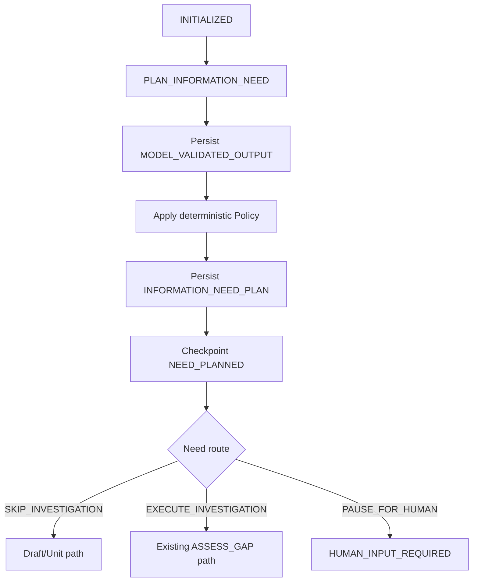

# Agent Loop Phase 3：Information Need Planning 设计与实施 Plan

> 状态：IMPLEMENTED / LOCALLY VERIFIED
> 日期：2026-08-01
> 前置阶段：Phase 2 Run Execution Ledger 已完成本地验证
> 对应总设计：[`2026-07-31-agent-loop-semantic-deepening-design.md`](../specs/2026-07-31-agent-loop-semantic-deepening-design.md)
> 对应总计划：[`2026-07-31-agent-loop-semantic-deepening-implementation-plan.md`](2026-07-31-agent-loop-semantic-deepening-implementation-plan.md)
> 目标版本：仅 `agent-runtime.v4`；`agent-runtime.v1` 保持只读兼容

---

## 0. 结论

Phase 3 先解决一个问题：**在 Agent 选择工具或生成正文前，形成一份可校验、可持久化、可恢复的调查决策。**

实现上新增一个较深的 `InformationNeedPlanningModule`。Graph 只需要提交规划上下文，并消费以下三种路由结果：

1. `SKIP_INVESTIGATION`：`NONE`，或按确定性策略跳过的 `OPTIONAL`；
2. `EXECUTE_INVESTIGATION`：需要进入现有 Investigation Loop；
3. `PAUSE_FOR_HUMAN`：`REQUIRED` 来源不可用，不能安全继续。

Module 的实现内部吸收：严格模型输出、requiredness 收紧、Coverage 模板、OPTIONAL 价值/预算判断、稳定 identity、Ledger 调用、Artifact 编解码和恢复校验。删除该 Module 时，这些复杂度会重新泄漏到 Graph、Resume 和测试中，因此该 Module 能提供足够的 Depth、Leverage 和 Locality。

本阶段不引入新的长期内容权威、不实现 Fact/Grounding、不重写 Investigation。Phase 4～7 仍按依赖顺序推进。

---

## 1. 当前问题

当前 `agent-python/agent/graph/runtime.py` 从固定 `required_coverage` 直接进入 `assess_gap`，第一次模型调用同时承担“决定是否调查”“选择 Action”“生成 Markdown”三项职责，造成以下错误路径：

- 纯新增需求也可能调用 Capability；
- 修改接口、字段、状态或权限时，模型可直接返回 Markdown 绕过必需调查；
- `OPTIONAL` 没有可审计的执行/跳过理由；
- 固定 `repository_evidence` 不能表达具体 Coverage；
- 恢复时没有独立 Need identity，无法证明相同输入没有重新规划；
- Graph 调用方必须知道 Planner schema、Requiredness 规则、Artifact 顺序和路由规则，Interface 过宽且浅。

Phase 2 已提供共享 Ledger、稳定 operation key、预算和 durable-ahead reconciliation。Phase 3 必须复用这些能力，不再增加第二套副作用或预算机制。

---

## 2. 目标与非目标

### 2.1 目标

- 每个 v4 Run 在首次调查或生成正文前拥有一个 `INFORMATION_NEED_PLAN`；
- Requiredness 明确为 `NONE / OPTIONAL / REQUIRED`；
- Planner 只能建议，确定性 Policy 可收紧、默认不可放宽；
- Coverage 和 Source Type 来自受控模板，模型不能发明任意值；
- `NONE` 保证零 Capability Call；
- `REQUIRED` 在 Coverage 满足前不能直接输出确定性 `CURRENT_STATE`；
- 同一 planning context 恢复时零物理 Planner Model Call；
- Need 预算是 Run Budget 的子配额，不能扩大总预算；
- v1 snapshot 和 producer 行为不被原地升级。

### 2.2 非目标

- 不实现 Evidence → Verified Fact → Grounding；这是 Phase 4；
- 不解决 Duplicate Action、真正 Replan 或 Supplement 统一；这是 Phase 5；
- 不按 Confirmation Unit 拆分生成；这是 Phase 6；
- 不将 v4 设为默认、不执行 production canary；这是 Phase 7；
- 不在 Python Worker 直连 PostgreSQL；
- 不把 GitHub 仓库正文或飞书 PRD 正文复制为新的永久权威；
- 不迁移 `src/prd_agent` 的 Store、应用状态机或数据库依赖。

---

## 3. 不变量

### 3.1 Requiredness 偏序

```text
NONE < OPTIONAL < REQUIRED
```

```text
effective_requiredness = max(model_suggestion, deterministic_lower_bound)
```

- Planner 不能把 Policy 判定的 `REQUIRED` 降为 `OPTIONAL/NONE`；
- 未知类型且存在“修改当前系统”的信号时，默认收紧为 `REQUIRED`；
- 只有用户显式授权的 assumption 才能进入专门的降级分支；
- 降级必须保存 `assumption_id`、作用域和 policy reason，不能只保存自然语言。

### 3.2 持久化顺序

```text
Ledger reserve
  -> MODEL call started
  -> MODEL_VALIDATED_OUTPUT Artifact
  -> Ledger succeeded
  -> deterministic policy
  -> INFORMATION_NEED_PLAN Artifact
  -> NEED_PLANNED checkpoint
  -> route
```

禁止在 `INFORMATION_NEED_PLAN` durable 前保存 `NEED_PLANNED`；禁止在 `NEED_PLANNED` 前调用 Capability。

### 3.3 内容所有权

- Plan 只保存决策、hash、Coverage、预算和 source identity；
- 不保存完整仓库树或完整历史 PRD；
- Source availability 只基于 `Provider Binding`、`Repository Snapshot/PRD Source Revision` 和权限状态；
- 真正取回来源内容仍通过 Capability Adapter，并在 Phase 4 做来源校验。

### 3.4 预算

- `NeedBudgetAllocation <= RunBudget.remaining()`；
- Planner Model Attempt 计入共享 Ledger；
- Need 的工具、iteration、replan 配额是 Run Budget 的子配额，不新建独立计数权威；
- `OPTIONAL` 预算不足时必须跳过并记录原因；
- `REQUIRED` 预算不足时 fail closed，不能通过生成 Markdown 假装完成。

---

## 4. 模块形态

### 4.1 外部 Interface

```python
@dataclass(frozen=True)
class NeedPlanningContext:
    run_id: str
    task_id: str
    task_message: str
    task_version: int
    workflow_version: str
    repository_binding_id: str
    repository_revision: str
    revision_scope: RevisionScopeView | None
    source_availability: SourceAvailability


@dataclass(frozen=True)
class PlannedNeedDecision:
    plan: InformationNeedPlan
    route: NeedRoute
    reason_code: str
    replayed: bool


class InformationNeedPlanningModule:
    def plan(self, context: NeedPlanningContext) -> PlannedNeedDecision: ...
    def hydrate(self, context: NeedPlanningContext) -> PlannedNeedDecision: ...
```

Graph 不感知 prompt、模型 draft schema、Policy 模板、Artifact JSON 形状或 Ledger crash window。`plan()` 用于新规划，`hydrate()` 用于 checkpoint 恢复与 durable-ahead reconciliation；二者返回同一结果类型。

### 4.2 内部实现

```text
information_need/
  __init__.py
  models.py       # versioned domain model and strict parsing
  policies.py     # requiredness, coverage, optional route, budget allocation
  prompts.py      # prompt version and canonical request construction
  artifact.py     # canonical JSON, identity/hash, encode/decode/validate
  planner.py      # deep Module implementation; the only external seam
```

内部可复用：

- `src/prd_agent/investigation/models.py` 的 Requiredness/Need 纯模型思想；
- `src/prd_agent/investigation/planner.py` 的 strict output 与 context hash；
- `src/prd_agent/investigation/policies.py` 的 Coverage 模板名称；
- `src/prd_agent/application/default_investigation.py` 的默认调查意图。

禁止复用：旧 Store、随机 UUID、旧应用状态机、Evidence 非空即 Coverage 完成的 Policy。

### 4.3 Adapter 与 Seam

- 模型变化已经由现有 Model Adapter + `RunExecutionLedger` 承担，不新增第二个模型 Seam；
- Artifact 生产通过现有 `RuntimeEventSink`，恢复通过 `RunContext.resume_artifacts`；
- 生产远程模型与测试 deterministic model 是已有的两个 Adapter，符合 ADR-0002；
- 不为只有一个实现的 RequirednessPolicy 创建公开 Interface；它保持 Module 内部纯实现。

---

## 5. 数据模型

### 5.1 枚举

```python
class Requiredness(StrEnum):
    NONE = "NONE"
    OPTIONAL = "OPTIONAL"
    REQUIRED = "REQUIRED"


class NeedKind(StrEnum):
    NEW_BEHAVIOR = "NEW_BEHAVIOR"
    FIELD_OR_FORMAT_CHANGE = "FIELD_OR_FORMAT_CHANGE"
    STATE_OR_RULE_CHANGE = "STATE_OR_RULE_CHANGE"
    PERMISSION_CHANGE = "PERMISSION_CHANGE"
    CODE_LOCATION_ONLY = "CODE_LOCATION_ONLY"
    HISTORICAL_PRD_CONTEXT = "HISTORICAL_PRD_CONTEXT"
    CROSS_MODULE_CHANGE = "CROSS_MODULE_CHANGE"
    UNKNOWN = "UNKNOWN"


class SourceType(StrEnum):
    CODE = "CODE"
    HISTORICAL_PRD = "HISTORICAL_PRD"
    USER_CONTEXT = "USER_CONTEXT"


class NeedRoute(StrEnum):
    SKIP_INVESTIGATION = "SKIP_INVESTIGATION"
    EXECUTE_INVESTIGATION = "EXECUTE_INVESTIGATION"
    PAUSE_FOR_HUMAN = "PAUSE_FOR_HUMAN"
```

### 5.2 Plan v1

```python
@dataclass(frozen=True)
class CoverageRequirement:
    key: str
    source_type: SourceType
    description: str
    blocking: bool


@dataclass(frozen=True)
class NeedBudgetAllocation:
    max_model_attempts: int
    max_tool_calls: int
    max_iterations: int
    max_replans: int


@dataclass(frozen=True)
class InformationNeedPlan:
    schema_version: Literal["information-need-plan.v1"]
    plan_id: str
    context_hash: str
    question: str
    need_kind: NeedKind
    suggested_requiredness: Requiredness
    effective_requiredness: Requiredness
    requiredness_reason_code: str
    source_types: tuple[SourceType, ...]
    required_coverage: tuple[CoverageRequirement, ...]
    route: NeedRoute
    route_reason_code: str
    fallback: str
    budget_allocation: NeedBudgetAllocation
    planner_version: str
    policy_version: str
    assumption_refs: tuple[str, ...]
```

约束：

- `NONE` 的 `source_types`、`required_coverage` 必须为空，route 必须为 `SKIP_INVESTIGATION`；
- `REQUIRED` 至少有一个 blocking Coverage；
- `EXECUTE_INVESTIGATION` 至少有一个 Source Type；
- Coverage key 必须来自 Policy 白名单；
- Plan 中不保存模型原始响应；模型输出由 `MODEL_VALIDATED_OUTPUT` Artifact 单独保存；
- `first_action_hint` 暂不进入 v1 Plan，避免 Phase 3 提前侵入 Phase 5 Action/Replan 设计。

### 5.3 稳定 identity

Canonical planning input 至少包含：

```text
task_id
task_version
sha256(task_message)
workflow_version
repository_binding_id
repository_revision
revision_scope(base hash, reopened keys, immutable keys, feedback hash)
planner_version
policy_version
```

- `context_hash = sha256(canonical_json(input))`；
- `plan_id = "need-" + context_hash_hex[:24]`；
- Planner operation key：`model:plan_information_need:plan1`；
- Plan Artifact key：`<run_id>:information_need:plan:1`；
- Artifact request hash 同时绑定 context、planner version 和 policy version。

相同 operation key 配不同 request hash 必须拒绝，不能覆盖。

---

## 6. 确定性 Policy

### 6.1 Policy 输入和职责

Planner 只输出 `question`、`need_kind`、`suggested_requiredness` 和建议 Source Type。Policy 负责：

1. 从 task/revision scope 提取受控 Change Signal；
2. 计算 requiredness 下限；
3. 验证 Need Kind 与 Source Type；
4. 从模板生成 Coverage；
5. 分配预算；
6. 决定 OPTIONAL route；
7. 生成稳定 reason code。

不能只依赖自然语言关键词。第一版采用“typed signal + 有界 deterministic classifier”：Revision Scope、repository binding、明确的字段/状态/权限/兼容性描述产生结构化 Signal；关键词只能补充，不能单独把高风险修改降级为 NONE。

### 6.2 Requiredness 下限

| Change Signal | 下限 | Source | Blocking Coverage 示例 |
| --- | --- | --- | --- |
| 纯新增且不依赖现状 | `NONE` | 无 | 无 |
| 字段、接口、格式、兼容性变化 | `REQUIRED` | `CODE` | `api_contract`、`validation_logic`、`storage_schema`、`tests` |
| 状态、流转、业务规则变化 | `REQUIRED` | `CODE` | `validation_logic`、`downstream_usage`、`tests` |
| 权限、租户、可见性变化 | `REQUIRED` | `CODE` | `authorization_rule`、`downstream_usage`、`tests` |
| 只需定位已有实现 | `OPTIONAL` | `CODE` | `repository_structure` |
| 历史背景、术语参考 | `OPTIONAL` | `HISTORICAL_PRD` | `historical_rule_found`、`staleness_assessed` |
| 明确要求沿用历史规则 | `REQUIRED` | `HISTORICAL_PRD` | `source_version_identified`、`code_conflict_checked`、`decision_conflict_checked` |
| 无法分类但涉及现有系统 | `REQUIRED` | `CODE` | `repository_structure`、`current_behavior` |

### 6.3 OPTIONAL 决策

执行优先级固定，第一条命中即结束：

1. Source 不可用 → `SKIP_INVESTIGATION / OPTIONAL_SKIPPED_SOURCE_UNAVAILABLE`；
2. 剩余 Run Budget 小于最小调用成本 → `SKIP_INVESTIGATION / OPTIONAL_SKIPPED_BUDGET`；
3. 没有 blocking Coverage 且只提供背景增益 → `SKIP_INVESTIGATION / OPTIONAL_SKIPPED_LOW_VALUE`；
4. Source 可用且能显著降低当前不确定性 → `EXECUTE_INVESTIGATION / OPTIONAL_EXECUTED_VALUE`。

第一版不让模型自行估价。Policy 使用 Need Kind、是否修改现状、Source availability 和剩余预算计算，确保重放一致。

### 6.4 REQUIRED 来源不可用

- 缺 Repository Binding、revision 或权限 → `PAUSE_FOR_HUMAN`；
- reason code 使用 `REQUIRED_SOURCE_UNAVAILABLE` 或 `REQUIRED_PERMISSION_DENIED`；
- 不进入 Capability，不生成确定性 `CURRENT_STATE`；
- 后续可由用户补充绑定/权限或提供带 identity 的 assumption 后启动新 Run；
- 不在同一 operation key 上改变 planning context。

---

## 7. Graph 与状态迁移

### 7.1 新流程



### 7.2 Snapshot 增量

`LoopCheckpointStatus` 新增：

```python
NEED_PLANNED = "NEED_PLANNED"
HUMAN_INPUT_REQUIRED = "HUMAN_INPUT_REQUIRED"
```

v3 snapshot state 新增：

```text
information_need_plan_id
information_need_artifact_key
information_need_artifact_hash
information_need_context_hash
information_need_policy_version
effective_requiredness
need_route
need_route_reason_code
```

`required_artifacts` 收集前缀扩展为 `information_need`。`NEED_PLANNED` 的 snapshot 校验必须要求 Artifact identity 和 route 齐全。

### 7.3 恢复路由

| Checkpoint | 恢复动作 | 允许物理 Planner Call |
| --- | --- | ---: |
| `INITIALIZED`，无 Ledger/Artifact | 正常 plan | 1 |
| Ledger `SUCCEEDED`，只有 model outcome | 重放 outcome，重新执行纯 Policy，保存 Plan | 0 |
| Plan Artifact durable，无 checkpoint | 校验 Artifact，保存 `NEED_PLANNED` | 0 |
| `NEED_PLANNED` | hydrate Plan 后直接 route | 0 |
| Plan hash/context 不匹配 | fail closed | 0 |
| legacy v1 checkpoint | 原 v1 route | 0（不新增 Planner） |

---

## 8. 与现有 Investigation 的连接

Phase 3 只做最小连接，不改写 Investigation 内部语义：

- Plan 的 Coverage 模板初始化 `state.coverage`；
- `EXECUTE_INVESTIGATION` 才能进入现有 `assess`；
- `SKIP_INVESTIGATION` 直接进入现有 draft/advanced path；
- Requiredness 为 `REQUIRED` 时，`select_action` 的严格输出只允许 Action；Markdown 视为 schema 错误；
- 可做一次 same-input 格式修复，仍失败则稳定停止，不能降级为自由文本；
- `OPTIONAL` 执行后仍受其子配额和 Run Budget 双重约束；
- Coverage 的“是否真正满足”暂沿用现状并明确标记为 Phase 4 技术债；Phase 3 Gate 只证明必需调查未被绕过，不宣称 Evidence 已支持 Claim。

为避免浅 Module 泄漏，Graph 只读取 `decision.route` 和 `plan.required_coverage`，不重新实现 Requiredness 判断。

---

## 9. Artifact 与故障恢复

### 9.1 Artifact 类型

| Artifact type | Schema | 生产者 | 用途 |
| --- | --- | --- | --- |
| `MODEL_VALIDATED_OUTPUT` | `information-need-draft.v1` | Ledger | 保存严格 Planner 输出并支持物理调用去重 |
| `INFORMATION_NEED_PLAN` | `information-need-plan.v1` | Planning Module | 保存 Policy 后的最终决策 |

Plan Artifact 使用 canonical JSON，字段排序稳定；decode 时同时校验 schema、content hash、request hash、context hash、枚举和值域。

### 9.2 Crash matrix

| Crash 点 | durable 状态 | 恢复策略 | 重复远程调用 |
| --- | --- | --- | ---: |
| reserve 后、call 前 | `RESERVED` | 按 Ledger 既有规则处理 | 由 Ledger 规则决定，不在 Phase 3 旁路 |
| call started 后、outcome 前 | `CALL_STARTED` | outcome unknown，fail closed | 0 |
| outcome durable、Ledger finish 前 | outcome Artifact | durable-ahead finish | 0 |
| Ledger finish 后、Plan 前 | validated outcome | 重放 outcome + pure Policy | 0 |
| Plan 后、checkpoint 前 | Plan Artifact | hydrate + checkpoint | 0 |
| checkpoint 后、route 前 | `NEED_PLANNED` | hydrate + route | 0 |

### 9.3 错误分类

```text
NEED_PLAN_SCHEMA_INVALID
NEED_CONTEXT_MISMATCH
NEED_ARTIFACT_HASH_MISMATCH
NEED_POLICY_VERSION_MISMATCH
REQUIREDNESS_DOWNGRADE_REJECTED
REQUIRED_SOURCE_UNAVAILABLE
REQUIRED_PERMISSION_DENIED
REQUIRED_NEED_UNSATISFIED
OPTIONAL_SKIPPED_SOURCE_UNAVAILABLE
OPTIONAL_SKIPPED_BUDGET
OPTIONAL_SKIPPED_LOW_VALUE
PLANNER_OUTPUT_INVALID
```

reason code 进入低基数指标；task message、模型原文和 source locator 不进入 metric label。

---

## 10. 文件级实现方案

### 10.1 新增

```text
agent-python/agent/information_need/__init__.py
agent-python/agent/information_need/models.py
agent-python/agent/information_need/policies.py
agent-python/agent/information_need/prompts.py
agent-python/agent/information_need/artifact.py
agent-python/agent/information_need/planner.py

agent-python/tests/information_need/test_models.py
agent-python/tests/information_need/test_policies.py
agent-python/tests/information_need/test_artifact.py
agent-python/tests/information_need/test_planner.py
agent-python/tests/information_need/test_graph_routing.py
agent-python/tests/information_need/test_resume_crash_matrix.py
```

### 10.2 修改

```text
agent-python/agent/graph/runtime.py
agent-python/agent/graph/snapshot.py
agent-python/agent/graph/state.py
agent-python/agent/bootstrap.py
agent-python/agent/resume/validator.py
agent-python/agent/context.py              # 仅在现有字段不足时增加只读 source availability view
agent-python/agent/eval_adapter.py

src/prd_agent/eval/models.py
src/prd_agent/eval/metrics.py
src/prd_agent/eval/report.py
eval/cases/*.json                         # 只规范标签，不修改案例语义
```

### 10.3 不需要修改

- Phase 3 不新增 PostgreSQL migration；
- 不新增 Go Store 或 gRPC RPC；
- 使用现有 `RunArtifact`、Ledger、Snapshot 和 Worker 事件流；
- 若实现发现 Source availability 无法由现有 RunContext 表达，再以 expand-only 方式单独设计合同变更，不能把它夹在 Graph 提交中。

---

## 11. 单元测试与集成测试方案

### 11.1 Domain/Policy

- `NONE` 不允许 Source/Coverage；
- `REQUIRED` 必须有 blocking Coverage；
- 非白名单 Coverage 拒绝；
- requiredness 偏序的 3×3 全组合；
- 字段/API、状态、权限、持久化信号均收紧到 `REQUIRED/CODE`；
- Planner 建议 `NONE` 但 Policy 下限 `REQUIRED` 时最终为 `REQUIRED`；
- 显式 assumption 缺 identity 时不能降级；
- OPTIONAL 的 source/budget/value 四条分支固定 reason code；
- NeedBudgetAllocation 永不超过 remaining Run Budget。

### 11.2 Identity/Artifact

- dict 顺序不同，canonical hash 相同；
- task version、message、revision、policy version 任一变化，context hash 不同；
- plan ID 和 Artifact key 可重复生成；
- schema/content/request/context hash 任一不匹配均 fail closed；
- Artifact 不包含完整 source content 或凭据。

### 11.3 Planner/Ledger

- 新规划只有一次 Ledger Model operation；
- model outcome replay 时 provider 调用为 0；
- Planner 输出未知字段、未知 enum、空问题时严格失败；
- same-input format repair 最多一次且计入预算；
- operation key 配不同 request hash 被拒绝；
- shadow mode 不增加远程 Planner Call；shadow 只使用已存在 outcome 或 deterministic fixture。

### 11.4 Graph

- 纯新增 → `NONE` → 0 Capability Call；
- API 字段修改 → `REQUIRED/CODE` → 进入 `assess`；
- 历史术语参考 → `OPTIONAL/HISTORICAL_PRD`，按 Policy 执行或跳过；
- REQUIRED 来源不可用 → `HUMAN_INPUT_REQUIRED`；
- REQUIRED 时模型直接 Markdown → 不进入 finish；
- `NEED_PLANNED` checkpoint 后才允许 Capability；
- v1 checkpoint 路由和 characterization 保持不变。

### 11.5 恢复

- 覆盖第 9.2 节全部 crash window；
- Plan durable/checkpoint missing 时补 checkpoint；
- checkpoint 引用缺失 Artifact 时拒绝恢复；
- context/policy version 漂移时不静默重算；
- 恢复后的 Planner 物理调用计数为 0。

### 11.6 Eval

Eval 标签归一化：现有 `NOT_REQUIRED` 只在读取层映射为 `NONE`，原 fixture 可保留兼容 reader。

报告至少增加：

- Requiredness confusion matrix；
- `NONE` precision/recall；
- `REQUIRED` precision/recall；
- 必需调查绕过率；
- `NONE` Capability Call Rate；
- OPTIONAL execute/skip reason 分布；
- Planner model attempts、tokens、P50/P95。

本阶段先报告数据，不在代码中拍脑袋写默认阈值。Phase 7 根据固定案例基线确定 enforce threshold。

---

## 12. 按实现顺序的 Plan

### Step 3.1：固定 Need 行为与 Eval 标签

修改：characterization tests、Eval label reader、report schema。

- 固定当前 direct Markdown 绕过与 fixed Coverage 行为；
- 增加 `NONE/OPTIONAL/REQUIRED` 兼容标签解析；
- 先产出空的 confusion matrix 框架。

验证：现有 v1 指标数值不变，新字段可读取旧报告。

建议提交：`test: characterize information need routing`

### Step 3.2：定义 versioned Domain Model

新增 `models.py`、`artifact.py` 和纯测试。

- 实现严格 enum/dataclass/validator；
- 实现 canonical identity 与 Plan Artifact codec；
- 不连接 Graph 或模型。

验证：schema、hash、identity、内容上限和未知字段测试通过。

建议提交：`feat: define versioned information need plans`

### Step 3.3：实现 Requiredness 与 OPTIONAL Policy

新增 `policies.py`。

- typed Change Signal；
- requiredness lattice；
- Coverage 模板；
- assumption 审计；
- budget allocation 和 OPTIONAL route。

验证：Policy table、偏序、预算性质测试通过。

建议提交：`feat: add deterministic information need policy`

### Step 3.4：通过 Ledger 执行 Planner

新增 `prompts.py`、`planner.py`。

- 固定 prompt/schema/version；
- operation key 与 request hash；
- strict validate；
- outcome replay；
- Policy 后保存 Plan Artifact。

验证：新调用、重放、durable-ahead、格式错误和预算测试通过。

建议提交：`feat: plan information needs through the run ledger`

### Step 3.5：接入 Graph 并持久化 NEED_PLANNED

修改 `runtime.py`、`state.py`、`snapshot.py`。

- 新增 plan/checkpoint/route 节点；
- 初始化 typed Coverage；
- NONE/OPTIONAL/REQUIRED 三路路由；
- REQUIRED 禁止 Markdown 绕过。

验证：Graph routing 测试与 v1 characterization 全部通过。

建议提交：`feat: route agent runs from durable need plans`

### Step 3.6：补齐 Resume reconciliation

修改 Resume validator 和 crash matrix tests。

- Plan identity 进入 snapshot required artifacts；
- outcome-ahead、plan-ahead、checkpoint-ahead 恢复；
- hash/context/policy mismatch fail closed。

验证：所有恢复分支 Planner 物理调用为 0。

建议提交：`feat: resume durable information need decisions`

### Step 3.7：Eval 与 Shadow Gate

修改 Eval adapter/metrics/report/config。

- confusion matrix；
- bypass、NONE tool rate、OPTIONAL reasons；
- v4 shadow 复用已有 outcome，零额外远程调用。

验证：固定 10 个 case 报告可重复、无敏感正文泄漏。

建议提交：`eval: measure information need decisions`

### Step 3.8：Phase 3 验收与文档更新

- 运行全量 Python/Go/Eval 快速 Gate；
- 有 PostgreSQL DSN 时运行集成 Gate；
- 更新本文状态、总计划 checkbox、验证记录；
- 不启用 production v4 默认路由。

建议提交：`docs: record phase 3 information need verification`

---

## 13. 验证命令

```bash
venv/bin/python -m pytest -q agent-python/tests/information_need
venv/bin/python -m pytest -q agent-python/tests/characterization
venv/bin/python -m pytest -q agent-python/tests
venv/bin/python -m pytest -q tests/eval
venv/bin/python -m pytest -q tests
cd backend-go && go test ./...
```

Eval：

```bash
PYTHONPATH=src venv/bin/python -m prd_agent.eval run-baseline \
  --manifest eval/cases/manifest.json \
  --config eval/configs/langgraph_v1_characterization.json \
  --output-dir eval/reports
```

若新增 v4 Phase 3 config，先以 deterministic/shadow 运行；真实远程 staging 结果只提交脱敏指标和 hash。

---

## 14. Phase 3 Gate 与回滚

### 14.1 完成定义

- [x] 所有新 v4 Run 均有合法 Plan 或明确 legacy marker；
- [x] `NONE` case 的 Capability Call 为 0；
- [x] `REQUIRED` 不能在调查前通过 Markdown 结束；
- [x] Planner 建议不能放宽确定性下限；
- [x] `OPTIONAL` 每次执行/跳过都有稳定 reason code；
- [x] Plan 先于 `NEED_PLANNED` checkpoint；
- [x] 所有恢复 crash window 不重复物理 Planner Call；
- [x] Eval 报告包含 requiredness confusion matrix；
- [x] v1 characterization 全部通过；
- [x] 无新增 Python 直连 PostgreSQL、无新内容权威；
- [x] shadow 不增加远程副作用。

### 14.2 回滚

- 关闭 v4 Phase 3 producer，保留 Plan reader；
- 新 v4 Run 暂停 admission 或路由回已验证版本；
- 已存在 `NEED_PLANNED` Run 由同版本 Worker drain，不降级为 v1；
- 不删除 Plan Artifact 或修改其 schema；
- 回滚不重置 Ledger、不重新消费已成功的远程调用。

---

## 15. 后续 Phase 4～7 设计路线

Phase 3 完成后仍按以下顺序实施，禁止跨 Gate 并行改变生产语义：

| 后续阶段 | 进入条件 | 核心设计输出 | 退出 Gate |
| --- | --- | --- | --- |
| Phase 4 Evidence Knowledge + Grounding | Phase 3 Plan/Need identity 稳定 | `KNOWLEDGE_BUNDLE`、Verified Fact、Unknown、Conflict、Claim Grounding | Evidence 非空不再自动支持 Claim；blocking CURRENT_STATE 都有 verdict |
| Phase 5 Unified Investigation | Phase 4 Coverage 由 Knowledge verdict 驱动 | `INITIAL/REPLAN/SUPPLEMENT` 共用一个 Investigation Module | Replan 改变 Action Signature；Supplement 不再旁路主 Loop |
| Phase 6 Reviewable Unit + Quality | Phase 5 调查结果可按 scope 重放 | 当前 Confirmation Unit 的生成、修订、quality、全文一致性检查 | 一个 Run 只修改当前 Unit；immutable Unit hash 不变 |
| Phase 7 Eval/Shadow/Enforce | Phase 3～6 各自 Gate 完成 | v4 ablation、canary、drain、rollback、legacy cleanup | 质量/成本/恢复指标达标，完成 canary 与回滚演练 |

### 15.1 下一份设计文档：Phase 4

Phase 4 设计必须先回答：

1. Evidence identity/revision/locator/hash 如何校验；
2. deterministic parser 与模型 Fact classifier 的职责分工；
3. `VERIFIED / INFERRED / UNKNOWN / CONFLICTING` 如何转换为 Coverage；
4. Claim type/scope 如何与 Fact type/scope 匹配；
5. Knowledge/Grounding Artifact 如何复用 Ledger 和 Resume；
6. 如何删除“Evidence ref presence 即支持”的旧 producer。

Phase 4 不应回头修改 Phase 3 的 Requiredness 语义，只消费稳定的 Plan、Source Type 和 Coverage Requirement。

### 15.2 依赖原则

```text
Need 决定“是否查、查什么”
  -> Knowledge 决定“来源说明了什么”
  -> Investigation 决定“下一步怎么查”
  -> Reviewable Unit 决定“本次写什么”
  -> Eval/Rollout 决定“何时默认启用”
```

后续设计不得把后一阶段职责反向塞回前一阶段：Need Planner 不判断 Claim 是否有事实支持；Knowledge Module 不决定用户确认范围；Unit Module 不自行重试 Capability。

---

## 16. 本地实现与验证记录

实现日期：2026-08-01。

已实现：

- versioned `InformationNeedPlan`、strict Planner draft 和 canonical Artifact；
- Requiredness lattice、Coverage 模板、OPTIONAL route 与子预算；
- Planner 经 `RunExecutionLedger` 执行，Plan durable 后保存 `NEED_PLANNED`；
- Graph 的 NONE/OPTIONAL/REQUIRED/来源不可用路由；
- REQUIRED 调查前 Markdown bypass 拒绝；
- Plan-ahead 与 `NEED_PLANNED` Resume，零重复 Planner 物理调用；
- v4 Resume 以 Ledger MODEL terminal entry 补充 legacy model-attempt summary；
- Eval label `NOT_REQUIRED -> NONE` 兼容、混淆矩阵、Precision/Recall、NONE Tool Call 和 REQUIRED bypass 指标。

本地验证：

```text
agent-python/tests: 107 passed
tests/eval: 65 passed
tests excluding eval: 247 passed, 15 skipped
backend-go go test ./...: passed
backend-go go vet ./...: passed
```

未执行：真实 PostgreSQL DSN 集成测试、远程模型 staging、production canary。它们仍属于外部环境 Gate，不影响本阶段本地实现状态。
