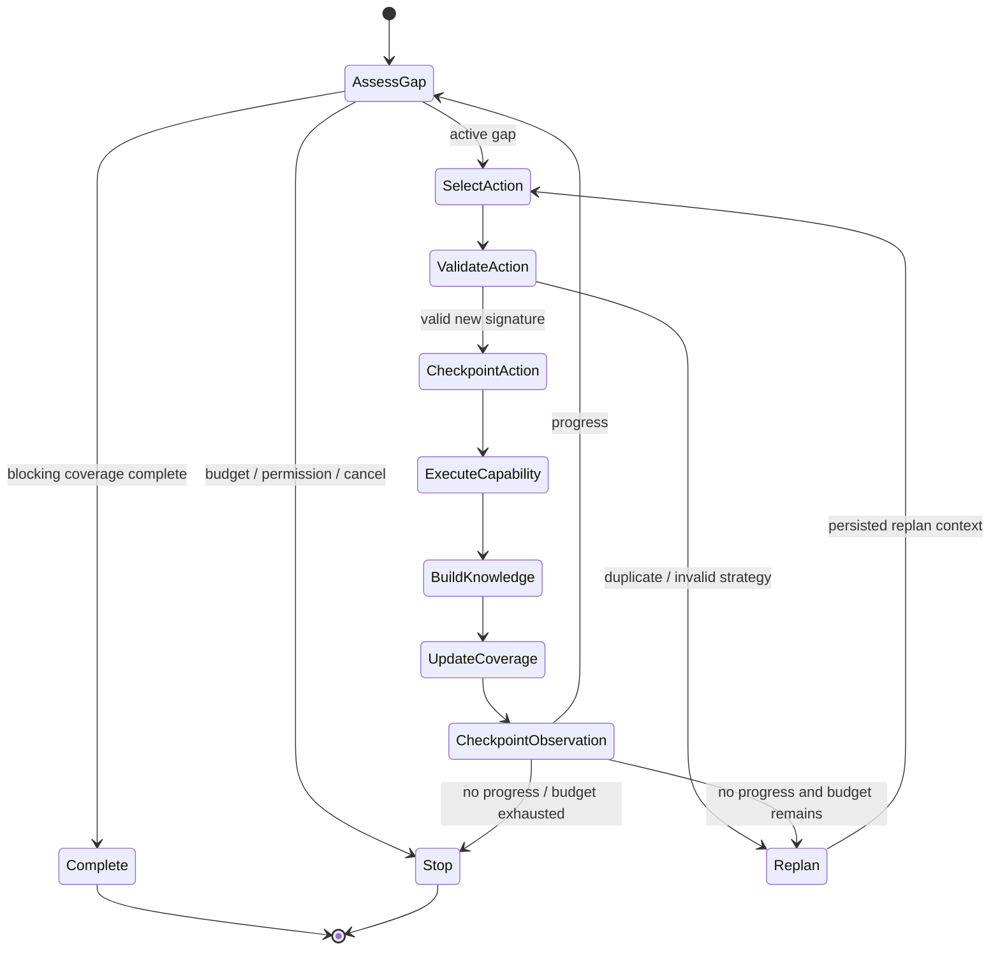
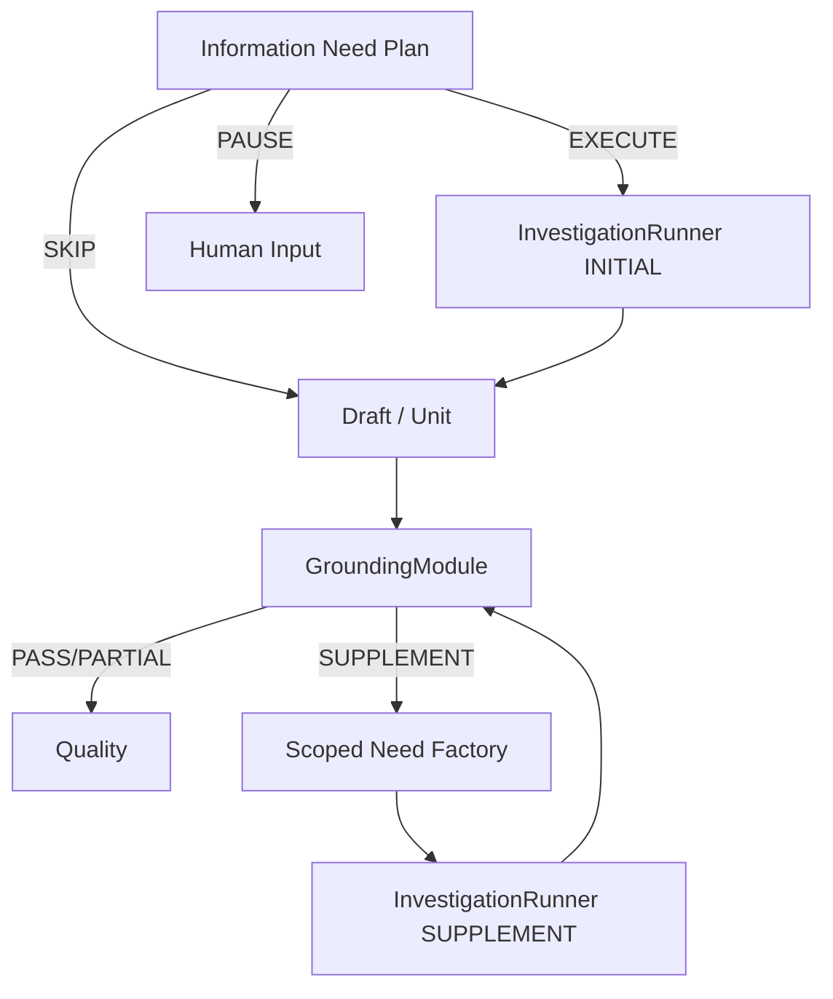

# Agent Loop Phase 5：Unified Investigation、Replan 与 Supplement 设计及实施 Plan

> 状态：IMPLEMENTED / LOCALLY VERIFIED
> 日期：2026-08-01
> 前置阶段：Phase 4 Evidence Knowledge + Grounding Gate 通过后实施
> 后续阶段：Phase 6 Reviewable Unit + Quality 复用本阶段 Investigation Interface
> 对应 Phase 4：[`2026-08-01-agent-loop-phase-4-evidence-knowledge-grounding-design.md`](2026-08-01-agent-loop-phase-4-evidence-knowledge-grounding-design.md)
> 对应总设计：[`2026-07-31-agent-loop-semantic-deepening-design.md`](../specs/2026-07-31-agent-loop-semantic-deepening-design.md)
> 对应总计划：[`2026-07-31-agent-loop-semantic-deepening-implementation-plan.md`](2026-07-31-agent-loop-semantic-deepening-implementation-plan.md)
> 目标版本：仅 `agent-runtime.v4`；`agent-runtime.v1` 保持只读兼容

> 本地验证：Initial/Replan/Supplement、Action/Observed resume、共享 Ledger/预算与 Knowledge delta 已覆盖；Agent Python 120 passed；根目录 312 passed / 15 skipped；Go `go test ./...` 与 `go vet ./...` 通过。未执行真实 PostgreSQL、外部来源 staging 或 production canary。

---

## 0. 结论

Phase 5 将 Initial、Replan 和 Targeted Supplement 收敛到一个较深的
`InvestigationModule`：相同的 Action Policy、Capability Adapter、Run Ledger、Knowledge
Builder、Coverage、progress fingerprint、checkpoint 和 Stop Reason 只实现一次。

统一后的每轮流程固定为：

```text
ASSESS_GAP
  -> SELECT_ACTION
  -> VALIDATE_ACTION
  -> CHECKPOINT_ACTION
  -> EXECUTE_CAPABILITY
  -> BUILD_KNOWLEDGE
  -> UPDATE_COVERAGE
  -> CHECKPOINT_OBSERVATION
  -> CONTINUE / REPLAN / COMPLETE / PARTIAL / HUMAN_INPUT
```

本阶段不是把 `runtime.py` 的闭包机械移动到新目录。实现必须同时满足：

1. Replan 输入包含 prior action、公开结果、无进展原因与剩余预算；
2. Replan 必须产生新的 Action Signature，否则停止；
3. Supplement 先生成 scoped Need Plan，再调用同一 Investigation Interface；
4. Initial 与 Supplement 共用 Run Budget、去重、Knowledge 和恢复规则；
5. 顶层 Graph 只路由，不解释调查内部状态。

---

## 1. 当前问题

### 1.1 重复 Implementation

当前初始调查位于 `agent-python/agent/graph/runtime.py` 的节点闭包；高级 Grounding 补采
位于 `graph/advanced.py`，并通过 `_execute_supplement()` 直接选择 Capability。二者没有
共享完整语义：

| 能力 | Initial | 当前 Supplement |
| --- | --- | --- |
| Information Need / Coverage | 部分使用 | 不使用 scoped Plan |
| Action validation | 使用 | 硬编码 Action |
| duplicate signature | 使用 | 未共享完整 history |
| Replan | 只增计数 | 无 |
| Knowledge/Fact | Phase 4 前缺失 | Phase 4 前缺失 |
| shared budget | 部分通过 Ledger | supplement 另有计数入口 |
| checkpoint/resume | `ACTION_VALIDATED/OBSERVED` | 借高级 Graph 状态 |

### 1.2 假 Replan

当前 Duplicate Action 路径会增加 `replan_count` 和 `no_progress_rounds`，随后回到同一个
选择节点；模型输入没有结构化的 prior strategy/failure，无法证明查询策略发生变化。
“计数 +1”不是 Replan。

### 1.3 边界泄漏

Graph 当前知道并操作：

- active Coverage gap；
- Action model payload/schema；
- duplicate signature；
- Capability 选择和参数；
- Evidence refs/observations；
- Coverage/no-progress；
- checkpoint 状态与 finish reason。

这些变化通常一起发生，应被封装为一个深 Module。Graph 只需要提交 request 并消费
`InvestigationResult`。

### 1.4 不采用的方向

- 不为 Initial/Replan/Supplement 建三个 Runner 子类；模式不是三个独立变化轴；
- 不把 Replan 实现为给 query 加随机后缀；
- 不允许 Supplement 直接调用 Capability 或直接修改 Draft Claim refs；
- 不让模型选择 Stop Reason、权限范围、预算或 Coverage 完成；
- 不引入并行 Tool Call、多 Agent 或第二套 checkpoint store；
- 不在 Phase 4 Gate 前切换 progress 语义。

---

## 2. 目标、非目标与完成定义

### 2.1 目标

- 一个 `InvestigationRunner.run()` 支持 `INITIAL/REPLAN/SUPPLEMENT`；
- 一个 Investigation State 与 Round State 覆盖所有模式；
- 每轮最多一次 Action 模型决策和一次 Capability 调用；
- Replan 明确改变 Action Signature，并记录 strategy transition；
- Grounding SupplementScope 被转换为可审计 scoped InformationNeedPlan；
- 所有模式共享 Run Execution Ledger 与 Phase 3 Need 子预算；
- 所有模式通过 Phase 4 `EvidenceKnowledgeModule` 更新 Coverage；
- Permission、budget、no-progress、cancel 和 human-input 使用统一 Stop Reason；
- 任一 durable checkpoint 恢复不重复已 ACK 副作用；
- 删除高级路径直接 Capability 调用和 runtime 调查闭包。

### 2.2 非目标

- 不改变 Phase 3 Requiredness Policy；
- 不改变 Phase 4 Fact/Grounding 规则；
- 不按 Unit 生成/Repair；这是 Phase 6；
- 不切换生产默认 workflow；这是 Phase 7；
- 不通过 Replan 绕过权限、revision 或 blocking Coverage；
- 不保证任何 Need 一定能完成；Unknown/PARTIAL/HUMAN_INPUT 是合法结果。

### 2.3 完成定义

- `replan_count > 0` 的 trace 必须出现新 Action Signature，或紧接确定性 stop；
- Initial 与 Supplement 使用相同 Action validator、Ledger、Capability、Knowledge、Coverage
  和 checkpoint；
- Supplement 无新 Fact 时形成 NO_PROGRESS/Unknown，而不是批量附加 ref；
- `OBSERVED` 恢复零 Capability/Knowledge classifier 重复物理调用；
- Graph 顶层只路由 Need、Investigation、Draft、Grounding、Quality；
- 删除旧 investigation node closures、`AdvancedLoopRunner.supplement` Callable 和
  `_execute_supplement()` producer。

---

## 3. 不变量

### 3.1 模式共享语义

`INITIAL/REPLAN/SUPPLEMENT` 只改变 request context 与选择策略，不改变以下不变量：

- 相同 Action schema 与 validator；
- 相同 Source Authority allowlist；
- 相同 Run Ledger 与剩余预算；
- 相同 Evidence Knowledge Builder；
- 相同 Coverage projection；
- 相同 progress/no-progress 算法；
- 相同 durable checkpoint 顺序；
- 相同 Stop Reason policy。

### 3.2 每轮副作用上限

```text
one round <= one action-selection Model Attempt
one validated action <= one physical Capability Call
one observation <= bounded Knowledge classifier attempts
```

模型不能在一个响应中返回多个并行 Action；批量读取只能作为单个 Capability 的受限
参数，并受最大 items/bytes 限制。

### 3.3 Replan 是策略转换

Replan 必须同时满足：

1. 明确的 `NoProgressReason`；
2. 输入 prior Action/PublicOutcome/remaining budget；
3. 输出通过相同 Action validation；
4. 新 Action Signature 不在 completed/attempted signatures 中；
5. 新 Action 仍指向 active blocking Coverage；
6. 若无法产生新 signature，停止为 `NO_PROGRESS` 或 `REPLAN_EXHAUSTED`。

改变 purpose、自然语言解释或循环计数不算变化。query、strategy、source type、target
locator 或 tool schema 的受控改变可形成新 signature，但不能扩大权限。

### 3.4 Supplement 有界

- 只处理 Grounding Report 中 unsupported/conflicting blocking Claim；
- 一次 Grounding cycle 最多创建一个 Supplement Need；
- Supplement Coverage 是父 Plan Coverage 的有界子集，不能新增无关 gap；
- Source Types 是父 Plan 与当前 authority 的交集；
- budget 为 Run remaining 与 supplement cap 的最小值；
- Supplement 结束后返回 Grounding 重新评估，不能直接宣告 Claim supported。

### 3.5 Progress 由 Knowledge 决定

`progress_fingerprint` 来自 Phase 4，至少包含：

- Supported Fact IDs；
- Unknown IDs；
- open/resolved Conflict IDs；
- Coverage status；
- 与上述对象关联的 valid Evidence refs。

仅新增 related-but-unsupported Evidence、重复 Evidence、重复 Unknown 或循环计数不算进展。

---

## 4. 模块 Interface 与目标结构

### 4.1 外部 Interface

```python
class InvestigationMode(StrEnum):
    INITIAL = "INITIAL"
    REPLAN = "REPLAN"
    SUPPLEMENT = "SUPPLEMENT"


@dataclass(frozen=True)
class InvestigationRequest:
    mode: InvestigationMode
    need_plan: InformationNeedPlan
    source_authorities: tuple[SourceAuthority, ...]
    prior_knowledge: KnowledgeBundle | None
    supplement_scope: SupplementScope | None
    resume_cursor: InvestigationCursor | None


@dataclass(frozen=True)
class InvestigationResult:
    status: InvestigationStatus
    stop_reason: StopReason
    need_plan_id: str
    knowledge: KnowledgeBundle
    coverage: tuple[CoverageState, ...]
    action_history: tuple[ActionRecord, ...]
    progress_fingerprint: str
    result_artifact: ArtifactIdentity


class InvestigationRunner:
    def run(self, request: InvestigationRequest) -> InvestigationResult: ...
```

Graph 不调用 `assess_gap/select_action/validate/execute/observe` 等内部节点，也不读写
`pending_action` 字典。Runner 内部可以使用独立 LangGraph，但其 state、nodes 和路由均为
Module 实现细节。

### 4.2 目标目录

```text
agent-python/agent/investigation/
  __init__.py
  models.py       # request/result/state/action/stop domain model
  identity.py     # action and result signatures
  policies.py     # gap/action/permission/budget/progress/stop
  prompts.py      # initial and replan bounded prompts
  artifacts.py   # state/result canonical persistence
  nodes.py        # internal round nodes
  graph.py        # internal state graph only
  runner.py       # only public orchestration seam
```

`CapabilityGateway`、`RunExecutionLedger`、`EvidenceKnowledgeModule` 是注入的既有 seam；
不为每个内部 Policy 创建公开 Protocol。删除 Runner 后，调查状态、Ledger 顺序、恢复和
三种模式会重新泄漏到两个顶层 Graph，说明该 Module 具有足够 Depth。

### 4.3 模式语义

- `INITIAL`：从 Phase 3 Plan 的首个 blocking/active Coverage 开始；
- `REPLAN`：从已持久化的 prior round 与 NoProgressReason 继续；通常由 Runner 内部路由
  进入，也允许 resume cursor 明确指向该模式；
- `SUPPLEMENT`：使用 derived scoped Need Plan 与已有 Knowledge，完成后返回 Grounding。

顶层调用一般只显式提交 `INITIAL` 或 `SUPPLEMENT`；`REPLAN` 是可持久化的内部继续
原因，而不是另建一条外部业务流程。

---

## 5. 数据模型

### 5.1 Investigation state v2

```python
@dataclass(frozen=True)
class InvestigationState:
    schema_version: Literal["investigation-state.v2"]
    run_id: str
    task_id: str
    mode: InvestigationMode
    need_plan_id: str
    need_context_hash: str
    active_gap: str | None
    round_index: int
    action_history: tuple[ActionRecord, ...]
    knowledge_bundle_id: str | None
    progress_fingerprint: str | None
    no_progress_rounds: int
    replan_count: int
    budget_scope: BudgetScope
    stop_reason: StopReason | None
```

state 内只保存 Artifact identity/hash、公开 observation summary 与 append-only ID；完整
Knowledge 从 Artifact hydrate，不在 checkpoint 重复嵌入大正文。

### 5.2 Action 与 Strategy

```python
class ActionStrategy(StrEnum):
    EXACT_SYMBOL = "EXACT_SYMBOL"
    FILE_SCOPE = "FILE_SCOPE"
    CALLER_SEARCH = "CALLER_SEARCH"
    API_SCHEMA_PARSE = "API_SCHEMA_PARSE"
    DATABASE_SCHEMA_PARSE = "DATABASE_SCHEMA_PARSE"
    RELATED_TEST_SEARCH = "RELATED_TEST_SEARCH"
    HISTORICAL_LOCATOR = "HISTORICAL_LOCATOR"
    HISTORICAL_TERM = "HISTORICAL_TERM"


@dataclass(frozen=True)
class ProposedAction:
    tool_id: str
    tool_schema_version: str
    strategy: ActionStrategy
    arguments: dict[str, object]
    target_coverage: tuple[str, ...]
    source_authority_ids: tuple[str, ...]
    purpose: str
```

Action Signature：

```text
H(tool id, schema version, strategy, canonical arguments,
  sorted target coverage, sorted source authority ids)
```

`purpose` 不参与 signature；改写解释不能逃过 duplicate 检查。`attempted_signatures` 在
Action checkpoint durable 后 append；`completed_signatures` 在 observation durable 后
append。两者均参与 duplicate policy。

### 5.3 ActionRecord 与公开结果

```python
@dataclass(frozen=True)
class PublicCapabilityOutcome:
    outcome_kind: str
    evidence_count: int
    valid_evidence_count: int
    new_fact_ids: tuple[str, ...]
    new_unknown_ids: tuple[str, ...]
    new_conflict_ids: tuple[str, ...]
    coverage_changes: tuple[str, ...]
    reason_code: str


@dataclass(frozen=True)
class ActionRecord:
    round_index: int
    mode: InvestigationMode
    signature: str
    action: ProposedAction
    public_outcome: PublicCapabilityOutcome | None
    progress_before: str | None
    progress_after: str | None
```

Replan Prompt 只收到 PublicCapabilityOutcome 和最小公开摘要，不收到隐藏 reasoning、凭据、
未授权正文或无界 excerpt。

### 5.4 Stop Reason

统一枚举至少包含：

```text
COVERAGE_COMPLETE
PARTIAL_COVERAGE
NO_PROGRESS
REPLAN_EXHAUSTED
MAX_ITERATIONS_REACHED
MODEL_BUDGET_EXHAUSTED
TOOL_BUDGET_EXHAUSTED
TOKEN_BUDGET_EXHAUSTED
SUPPLEMENT_BUDGET_EXHAUSTED
PERMISSION_DENIED
HUMAN_INPUT_REQUIRED
USER_STOPPED
SOURCE_STALE
CAPABILITY_FAILED
```

Stop Reason 由 deterministic Policy 决定。模型可以返回 `cannot_propose_action` reason，
但最终映射与终态由 Runner 控制。

### 5.5 InvestigationResult status

```text
COMPLETE           # blocking Coverage 全部 COVERED
PARTIAL            # 有 Knowledge，但仍有 Unknown/Conflict/未完成 Coverage
EMPTY              # 无可用 Fact，保留 Unknown
HUMAN_INPUT_REQUIRED
CANCELLED
FAILED             # 非业务性、不可恢复的运行错误
```

`NO_PROGRESS` 通常映射 `PARTIAL/EMPTY`，不是系统 `FAILED`。

---

## 6. 每轮状态机



### 6.1 ASSESS_GAP

确定性执行：

1. cancellation/fencing；
2. permission/source authority；
3. shared Run Budget 与 Need sub-budget；
4. Coverage complete；
5. no-progress/replan limit；
6. 按 `CONFLICTING -> MISSING -> PARTIAL` 和 Plan 顺序选择 active gap。

### 6.2 SELECT_ACTION

Initial Prompt 包含：Need question、active Coverage、Source Types、authority IDs、已有
Knowledge public summary、允许工具 schema 与剩余预算。

Replan Prompt 额外包含：

- prior Action Signature、strategy 与 canonical public arguments；
- PublicCapabilityOutcome；
- `NoProgressReason`；
- attempted signatures；
- 仍可用的 strategy/source/tool；
- remaining iteration/replan/tool/token budget。

输出必须是单个严格 Action；模型不能返回 Markdown 结束 REQUIRED Need。

### 6.3 VALIDATE_ACTION

确定性校验：

- tool/schema 在 allowlist；
- arguments 符合 tool schema、长度和数量上限；
- target Coverage 存在且 active；
- source authority 在 Run allowlist 与 Need Source Types 中；
- Action Signature 未尝试；
- REPLAN 的 signature 必须不同；
- 预算可以在调用前预留；
- permission denied 不通过换 source 绕过。

invalid model output 可在模型 attempt policy 内做有限格式 retry；重复/无策略变化进入
Replan 或 Stop，不进行 Capability。

### 6.4 CHECKPOINT_ACTION 与 EXECUTE_CAPABILITY

在物理 Capability 前保存 `ACTION_VALIDATED`：

- pending Action 完整 canonical 内容；
- Action Signature；
- mode/round/active gap；
- attempted signature 摘要；
- Need/Knowledge identity；
- budget reservation Ledger entry。

恢复时：若 Ledger 已成功则 replay durable outcome；若只 reserved/planned，按 Phase 2
reconciliation 规则处理。不得因模式不同采用另一个执行路径。

### 6.5 BUILD_KNOWLEDGE 与 UPDATE_COVERAGE

调用 Phase 4 `EvidenceKnowledgeModule.build()`，传入 prior Knowledge；Runner 不解析
Evidence 或 Fact。先 ACK `KNOWLEDGE_BUNDLE`，再读取 `progress_fingerprint` 和 Coverage
updates：

- fingerprint 变化且有语义对象变化：progress；
- 仅 unsupported-related Evidence：no progress；
- 相同 fingerprint：no progress；
- open Conflict 是新 Knowledge，但 blocking Coverage 不 complete；
- EMPTY/blocked 形成 Unknown，仍可触发一次策略变化 Replan。

### 6.6 CHECKPOINT_OBSERVATION

`OBSERVED` snapshot 保存：

- Knowledge Artifact identity/hash；
- Coverage 和 progress fingerprint；
- completed Action record/signature；
- no-progress/replan counters；
- consumed budget 与 terminal Ledger keys；
- 下一步 route reason。

checkpoint ACK 后才允许下一轮、Replan 或返回结果。

---

## 7. Replan 设计

### 7.1 NoProgressReason

受控原因：

```text
EMPTY_RESULT
ONLY_RELATED_EVIDENCE
PARSE_UNSUPPORTED
DUPLICATE_ACTION
SOURCE_CONFLICT
SOURCE_STALE
ACCESS_BLOCKED
TOOL_RETRYABLE_FAILURE
```

`ACCESS_BLOCKED` 一般直接 `PERMISSION_DENIED/HUMAN_INPUT_REQUIRED`；只有同一授权范围内
存在另一个允许来源时才可 Replan。

### 7.2 Strategy transition policy

允许示例：

- broad term search → exact symbol；
- symbol → callers/related tests；
- text search → OpenAPI/schema parser；
- historical term → pinned Section Locator；
- conflicting generic docs → fixed source revision specific locator。

拒绝示例：

- 仅改 purpose；
- query 添加空格、标点或随机 nonce；
- target Coverage 不变且 canonical arguments 相同；
- 切换到未授权 source；
- 删除 blocking gap；
- 重复已尝试 signature。

### 7.3 Replan budget

- `replan_count` 是共享 Run Budget 的 consumption；
- 进入 Replan transition 时预留/消费一次，不在模型返回重复 Action 后无限循环；
- Need allocation 与 Run remaining 的较小值为上限；
- `max_replans=0` 时首次 no-progress 直接 stop；
- Replan 模型 attempt 仍计入 model/token budget；
- budget exhaustion 在调用前 stop。

### 7.4 Replan identity 与 Ledger

```text
operation_key = model:select_investigation_action:
                {mode}:{need_plan_id}:{round_index}:{prior_signature_prefix}
request_hash = H(need context, active gap, public history,
                 remaining budget, prompt/policy version)
```

相同 checkpoint 恢复命中同一 operation key；如果 prior history 或 budget 不一致，resume
validator fail closed，不创建近似重复 attempt。

---

## 8. Targeted Supplement 设计

### 8.1 从 Grounding 到 scoped Need

Phase 4 输出 `SupplementScope` 后，由纯 `SupplementNeedFactory` 构造：

```python
@dataclass(frozen=True)
class ScopedInformationNeedPlan:
    schema_version: Literal["information-need-plan.v1"]
    plan_id: str
    parent_plan_id: str
    grounding_report_id: str
    claim_ids: tuple[str, ...]
    question: str
    effective_requiredness: Literal["REQUIRED"]
    source_types: tuple[SourceType, ...]
    required_coverage: tuple[CoverageRequirement, ...]
    budget_allocation: NeedBudgetAllocation
```

identity：

```text
plan_id = H(parent plan id, grounding report fingerprint,
            sorted blocking claim ids, sorted coverage keys, policy version)
```

Factory 只能收窄父 Plan：

- Claim 必须来自 Grounding Report；
- Coverage 必须映射到 unsupported/conflicting blocking finding；
- Source Type 必须在父 Plan/authority allowlist；
- requiredness 固定 REQUIRED，不能由模型放宽；
- budget 不超过 Run remaining 与 `max_supplements=1`。

### 8.2 执行与返回

```text
GroundingReport(SUPPLEMENT_REQUIRED)
  -> Scoped Need Artifact ACK
  -> InvestigationRunner(mode=SUPPLEMENT, prior Knowledge)
  -> InvestigationResult Artifact/checkpoint ACK
  -> GroundingModule.assess(updated Knowledge)
```

Supplement 不修改 Draft Claim refs。只有第二次 Grounding 通过的 Fact/Evidence 才进入
`GroundingFinding`。若没有新 Fact：

- 记录 Unknown/no-progress；
- stop 为 `NO_PROGRESS`、`PARTIAL_COVERAGE` 或 `HUMAN_INPUT_REQUIRED`；
- 不创建第二个 supplement cycle；
- Draft 按 Phase 4 disposition 转 Unknown/Assumption/Risk 或请求人工确认。

### 8.3 共享预算与去重

- Initial action history 被传入 Supplement；相同 signature 不再调用；
- Tool/model/token/supplement 均消费同一 Run Ledger；
- Supplement Need budget 是子视图，不是新计数权威；
- Initial 已用完工具预算时，Supplement 在调用前 stop；
- durable Initial Evidence/Knowledge 可直接复用，不重复取回。

---

## 9. Artifact、Checkpoint 与 Resume

### 9.1 Artifact

新增/明确：

| Artifact | 内容 |
| --- | --- |
| `INVESTIGATION_RESULT` | mode、Need、Coverage、Knowledge ref、action history、stop |
| `INFORMATION_NEED_PLAN` | Initial 或 scoped Supplement Plan |
| `KNOWLEDGE_BUNDLE` | Phase 4 事实层 |
| `MODEL_VALIDATED_OUTPUT` | Action selection/replan 的严格输出 |

`InvestigationResult` identity 绑定 Need Plan、final Knowledge、action history、budget
consumption、runner/policy version；不保存隐藏 reasoning。

### 9.2 Resume entry

| checkpoint | Runner 恢复动作 |
| --- | --- |
| `NEED_PLANNED` | 初始化/恢复 Investigation state，执行 AssessGap |
| `ACTION_VALIDATED` | hydrate pending Action，Capability replay/reconcile |
| `OBSERVED` | hydrate Knowledge/ActionRecord，不重调 Capability，进入 AssessGap |
| `INVESTIGATION_FINISHED` | hydrate `InvestigationResult`，直接返回顶层 Graph |
| `GROUNDING_SUPPLEMENT_REQUIRED` | hydrate Report + scoped Need；未创建则确定性创建并 ACK |

snapshot v3 required artifacts 增加 `investigation` identity；append-only signature、Fact、
Unknown、Conflict 集合不得缩小，计数不得回退。

### 9.3 Crash matrix

- Action model Artifact ACK 后、Action checkpoint 前；
- Action checkpoint ACK 后、Capability 前；
- Capability durable outcome 后、Evidence ACK 前；
- Evidence ACK 后、Knowledge Artifact 前；
- Knowledge Artifact ACK 后、Observed checkpoint 前；
- Observed ACK 后、Replan model 前；
- Replan output ACK 后、新 Action checkpoint 前；
- scoped Need ACK 后、Supplement first action 前；
- Supplement result ACK 后、第二次 Grounding 前。

每个窗口都要求 stable operation key、零重复已 ACK 物理调用、预算不重复消费。

---

## 10. 顶层 Graph 重构

### 10.1 目标路由



顶层 Graph 不出现 `select_action/validate_action/execute_capability/observe_progress/replan`
节点；这些是 Investigation Module 私有状态机。

### 10.2 删除顺序

1. 抽取 Runner，先保持 Initial 行为等价；
2. 将 progress source 切换为 Phase 4 Knowledge；
3. 启用真正 Replan 与统一 Stop Reason；
4. 将 Supplement 切到 scoped Need + Runner；
5. 顶层 Graph 切换为新 Interface；
6. 删除旧 runtime closures；
7. 删除 `AdvancedLoopRunner.supplement` Callable、`_execute_supplement()` 与 ref fan-out；
8. 保留 legacy workflow reader，不保留两个 v4 producer。

删除测试：移除新 Investigation Module 后，如果 Initial 与 Supplement 的预算、恢复、
Action/Knowledge 规则必须复制回两个 Graph，则模块边界成立；若只是转发一层，应继续
收拢实现而非增加 facade。

---

## 11. 实现顺序

### 11.1 Step 5.0：Characterization 与 Phase 4 Gate

前置检查：

- Phase 4 non-empty Evidence 不自动 Coverage；
- progress fingerprint 已稳定；
- Grounding 只输出 SupplementScope，不执行 Capability；
- Knowledge/Observed crash matrix 通过。

新增 characterization：Initial 两轮、重复 Action、当前假 Replan、Supplement 直接调用、
共享预算与 resume 行为。

Gate：未满足 Phase 4 时停止，不在旧 Evidence-count 语义上抽取 Runner。

### 11.2 Step 5.1：定义 domain 与抽取 Initial Runner

新增 `models.py/identity.py/artifacts.py/runner.py`，将现有节点闭包移动为私有 Graph：

- 定义 strict request/result/state/action records；
- 保持 Initial 行为和 checkpoint 名称；
- 通过依赖注入使用 Ledger/Gateway/Knowledge Module；
- 顶层先由 adapter 调用 Runner；
- 不在这一步改变 Replan 策略。

Gate：Initial characterization、Ledger 与 crash tests 行为等价。

### 11.3 Step 5.2：Knowledge-driven progress 与统一 Stop Reason

- 删除 Evidence count、observations list 对 Coverage/no-progress 的控制；
- 以 Phase 4 progress fingerprint 更新 no-progress；
- 加入完整 Stop Reason mapping；
- permission/cancel/budget 全部在调用前处理；
- 保存 `INVESTIGATION_RESULT` Artifact。

Gate：related-only Evidence 不算 progress；业务性 PARTIAL 不标系统 FAILED。

### 11.4 Step 5.3：Strategy-changing Replan

- 增加 ActionStrategy、ActionRecord 与 PublicCapabilityOutcome；
- 分离 Initial/Replan Prompt；
- Replan 输入 prior history/no-progress/remaining budget；
- attempted/completed signatures 去重；
- 无新 signature 立即 `REPLAN_EXHAUSTED/NO_PROGRESS`；
- 增加 strategy transition trace/eval。

Gate：所有 `replan_count > 0` case 有 signature 变化或确定性 stop。

### 11.5 Step 5.4：Supplement scoped Need

- 实现纯 `SupplementNeedFactory` 与 Artifact；
- Grounding route 调用 `InvestigationRunner(SUPPLEMENT)`；
- 传入 prior Knowledge/action history/shared Ledger；
- 限制一次 Supplement；
- 第二次 Grounding 决定最终 disposition。

Gate：高级路径无直接 Capability；Supplement 无新 Fact 不支持 Claim。

### 11.6 Step 5.5：Resume/crash 与顶层 Graph 清理

- 补齐所有模式/窗口 crash matrix；
- v4 snapshot 强校验 Investigation Artifact 与 append-only history；
- 删除旧 nodes、Callable 和 producer；
- 保留 v1 reader；
- 更新架构文档与 trace schema。

Gate：`OBSERVED` 恢复零重复 Capability，scoped Need 恢复零重复规划。

### 11.7 Step 5.6：Eval 与 Phase 6 交接

- 对比 v1、v4 Knowledge-only、v4 Unified Investigation；
- 统计 Action Signature Change Rate、Replan Success Rate、Supplement Fact Yield、
  no-progress rounds、Tool/token cost、P95 latency；
- 固定 Phase 6 只消费 `InvestigationResult/KnowledgeBundle` 的公开边界。

---

## 12. 单元、集成与恢复测试方案

### 12.1 Policy 与 Action

- Coverage 优先级 `CONFLICTING -> MISSING -> PARTIAL`；
- COMPLETE 时零 Action model/capability；
- action 未指向 active gap → 拒绝；
- tool/schema/query/source authority 非法 → 拒绝；
- purpose 改变但 signature 相同 → duplicate；
- argument 顺序改变但 canonical 内容相同 → duplicate；
- strategy/arguments 有效改变 → 新 signature；
- permission denied 不切到未授权 source；
- budget exhausted 在调用前 stop。

### 12.2 Initial

- 两个 blocking Coverage 通过两轮分别完成；
- 第一轮 EMPTY，第二轮策略变化得到 Fact；
- non-empty related Evidence 不完成 gap；
- Conflict 进入下一轮/partial，不误 complete；
- max iterations/tool/token budget 正确停止；
- Need `NONE` 不进入 Runner。

### 12.3 Replan

- EMPTY → Replan Prompt 包含 prior public outcome；
- 重复 signature → 无第二次物理 Capability；
- Replan 返回相同 signature → `REPLAN_EXHAUSTED`；
- 仅改 purpose/标点/参数顺序 → 仍判重复；
- exact symbol → related test strategy 形成新 signature；
- max_replans=0 → 首次 no-progress stop；
- Replan model attempt 与 counter 各消费一次共享预算；
- trace 中 `replan_count > 0` 必有 signature change 或 stop event。

### 12.4 Supplement

- unsupported blocking Claim → deterministic scoped Need；
- informational Claim 不触发 Supplement；
- scoped Coverage/Source 不得超出父 Plan；
- Initial 与 Supplement 重复 Action → replay/duplicate，不物理调用；
- Supplement 新 Fact → 第二次 Grounding 可支持；
- Supplement 只有 related Evidence → no progress，Claim 仍 unsupported；
- Supplement EMPTY → Unknown；
- Tool budget 已耗尽 → 零调用并 partial/human input；
- 第二次 Grounding 仍失败 → 不创建第二次 Supplement。

### 12.5 Resume 与 Ledger

- `ACTION_VALIDATED` resume 执行或 replay 同一 Action；
- `OBSERVED` resume 不重复 Capability/Knowledge classifier；
- Replan output durable 后恢复不重复模型调用；
- scoped Need durable 后恢复不重复 factory/model；
- Initial/Supplement consumption 合计不超过 Run Budget；
- attempted/completed signature 集合缩小 → fail closed；
- Knowledge/Need/Action request hash 不匹配 → fail closed；
- USER_STOPPED 在任意 loop boundary 返回 CANCELLED，释放 Worker。

### 12.6 Eval Gate

- Replan Signature Change Rate = 100%，或记录明确 stop；
- Duplicate Action physical call count = 0；
- Supplement Fact Yield 可观测，related-only 不计 yield；
- Initial/Supplement shared budget violation = 0；
- resume duplicate physical call = 0；
- Coverage Completion 不以降低 Critical Unknown Recall 为代价；
- Tool/token/P95 增量在配置阈值内。

---

## 13. 最小提交序列

1. `test: characterize initial replan and supplement execution`
2. `refactor: define controlled investigation module interface`
3. `refactor: extract initial investigation graph`
4. `fix: drive investigation progress from knowledge fingerprints`
5. `feat: unify investigation stop reasons`
6. `feat: implement strategy-changing replans`
7. `refactor: run targeted supplements through investigation`
8. `test: cover initial replan supplement and recovery`
9. `refactor: remove direct graph capability producers`
10. `eval: measure replan and supplement effectiveness`

每个提交保持单一语义变化。抽取、行为切换和旧 producer 删除不得混成不可审阅的大提交。

---

## 14. 风险与缓解

| 风险 | 缓解 |
| --- | --- |
| 抽取 Runner 时改变已有恢复语义 | 先 characterization，第一步行为等价，再切 progress/replan |
| Replan 通过微小 query 变化逃避去重 | canonical arguments + explicit strategy + attempted signatures |
| Supplement 扩大调查范围 | derived Plan 只能收窄 parent Coverage/Source/Claim |
| budget 在子 Loop 重置 | 只传 shared Ledger 和 budget view，不建新 counter owner |
| 状态/Artifact 过大 | checkpoint 保存 identity/public summary，Knowledge 外置 Artifact |
| no-progress 过早停止 | Unknown/Conflict 纳入语义 fingerprint；unsupported-only Evidence 排除 |
| 权限失败被 Replan 绕过 | authority allowlist deterministic validation；permission 默认 human input |
| 内部 LangGraph 形成第二 Control Plane | PostgreSQL/Ledger/Artifact 仍为事实源；Graph 仅执行游标 |
| Phase 6 直接依赖内部 state | 只公开 `InvestigationResult/KnowledgeBundle`，内部 nodes 不导出 |

---

## 15. Phase 6 交接合同

Phase 6 只能消费：

- final `InvestigationResult.status/stop_reason`；
- `KnowledgeBundle` Artifact identity；
- Supported Fact/Unknown/Conflict 的只读视图；
- final Coverage；
- source-safe Grounding refs；
- shared Ledger remaining budget。

Phase 6 不得直接调用 Capability、重开 Replan、解释 Action history 或修改 Knowledge。
若 Unit Grounding 需要补采，必须通过 `SupplementScope -> scoped Need ->
InvestigationRunner(SUPPLEMENT)` 返回同一接口。
