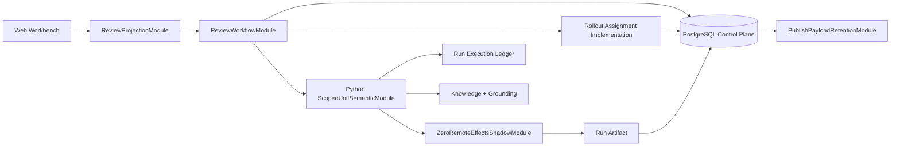

# Agent Loop Phase 9–11 统一设计：Operational Closure、Rollout 与 Legacy Retirement

> 状态：PHASE 9 CODE MECHANISMS IMPLEMENTED / READINESS FAIL-CLOSED ON HARD GATES
> 日期：2026-08-02
> 前置阶段：[Phase 8 Review Workflow 编排闭环](./2026-08-01-agent-loop-phase-8-orchestration-completion-design.md)
> 上位设计：[Agent Loop 语义深化总体设计](../specs/2026-07-31-agent-loop-semantic-deepening-design.md)
> 后续闭环：[Readiness、环境晋级与 Legacy Retirement](./2026-08-02-agent-loop-final-closure-and-retirement-design.md)
> 目标版本：`agent-runtime.v4` / `agent-loop-snapshot.v3`
> 覆盖范围：Phase 9 本地闭环、Phase 10 环境晋级、Phase 11 legacy 退场
> 文档权威：Phase 9–11 的阶段含义、顺序和 Gate 以本文为准；Phase 7/8 文档保留历史设计与
> 已实现证据，冲突处由本文替代。

---

## 0. 执行结论

剩余工作不能直接从“本地测试通过”跳到 production canary。2026-08-02 的实现与验证已闭合
Phase 9A～9C 的主要生产 Seam，并完成 9D 的 durable assignment authority 与 bounded publish
retention：

1. PostgreSQL v4 E2E 已覆盖 Outline、并发幂等确认、Confirmation Unit、Full Review、Publish
   与 retention purge；
2. 生产 `ReviewableUnitRuntime` 已注入 `ScopedUnitSemanticModule`，执行 typed claim extraction、
   Grounding、可选 bounded Supplement，并输出 claim/grounding Artifact；
3. 新 Run assignment 已由数据库 active rollout policy 决定，进程配置只负责首次 bootstrap；
4. Go 已提供统一 `ReviewProjection` 与 Full Review endpoint，Web 可以操作 v4 Outline、Unit、
   Full Review 和 Publish Gate；
5. `0018_rollout_authority.sql` 与 `0019_publish_payload_retention.sql` 已在 clean PostgreSQL 上验证。

随后补充的 migration 0020、`rolloutctl` 和 evaluation context 已闭合 durable
pause/rollback/operator command，以及 authoritative trace 到 hash-bound Shadow Artifact 的真实
Worker 主链；Memory/PostgreSQL Ledger 对 SHADOW remote reservation 都 fail-closed。Phase 9
readiness renderer 已实现，但当前会准确输出 `MISSING_GATE_DECISION` 与
`STAGE_NOT_LOCALLY_VERIFIED`，因此尚不能生成 `STAGING READY` 结论。Phase 10 的
remote/staging/production 证据与 Phase 11 的 legacy 删除必须在对应环境和观察窗口中产生，本地
测试不能替代。

因此剩余实现固定拆成三个阶段：

```text
Phase 9 Operational Closure
  9A PostgreSQL Proof
  -> 9B Production Semantic Execution
  -> 9C Review Projection + Web
  -> 9D Authoritative Rollout Control
  -> 9E Zero-Remote Shadow Integration
  -> 9F Staging Readiness Record

Phase 10 Environment Graduation
  10A Remote Eval
  -> 10B Staging Shadow
  -> 10C Staging Enforce + Rollback Rehearsal
  -> 10D Production Canary
  -> 10E Production Default v4

Phase 11 Legacy Retirement
  11A v1 Execution Drain
  -> 11B Producer Removal
  -> 11C Reader Observation
  -> 11D Reader + Expired Compatibility Removal
```

Phase 9 是代码与本地/数据库证据阶段；Phase 10 是可回滚的环境动作；Phase 11 才执行不可逆
清理。Phase 9 任一 Gate 未通过，不得开始 Phase 10；Phase 10 未完成稳定观察，不得开始
Phase 11。每次 rollout 只改变后续新 Agent Run，已有 Run 保持其 immutable workflow
assignment。

---

## 1. 当前实现基线与残余证据

### 1.1 已完成的本地能力

- Go `ReviewWorkflow` 已支持 Outline lock、逐 Unit Run、Full Review 和 v4 publish document；
- Memory/PostgreSQL 已有 Review Workflow Implementation；
- `0016_review_workflow_orchestration.sql` 和 `0017_rollout_readiness.sql` 已创建；
- Go `WorkflowRolloutControl` 已有 GateDecision、Stage、LegacyInventory 和 Drain Interface；
- Python `ReviewableUnitExecutionModule` 已有 explicit `RequirementBrief`、`LockedOutline`、
  `UnitExecutionRequest` 和 generation metadata；
- Python 已有 deterministic Shadow evaluator 和 `NoRemoteEffectsAdapter`；
- 本地 Go、Go Vet、Agent Python、root Python、Web test/typecheck Gate 已通过。

### 1.2 PostgreSQL 证据缺口（核心路径已闭合）

设计评审时 PostgreSQL integration tests 只覆盖初始 Agent Run、等待队列提升和 legacy publish
lifecycle，当时没有覆盖：

- 从 `PLAN_OUTLINE` output 到 v4 Publish Preview 的完整流程；
- Outline/Unit 双确认并发；
- RunOutput ACK 丢失后的 materialization replay；
- Full Review hash set drift；
- GateDecision -> stage transition -> assignment；
- Drain inventory 的真实 SQL 统计；
- 从带真实 legacy row 的 `0015` 升级到 `0016/0017` 的 data migration path。

实现后，v4 E2E、并发幂等、replay、rollout authority、retention 与 0001→0020 clean install
已由真实 PostgreSQL 验证；`PostgresStore.Health()` 也已检查 current schema。仍缺带 legacy row
的 0015 upgrade fixture，因此该子 Gate 不能标记为完成。

### 1.3 Python production Seam 缺口（已闭合）

设计评审时 `ReviewableUnitExecutionModule` 的 Interface 已比原 runtime 更深，但生产
`ReviewableUnitRuntime` 构造它时只注入 generator/reviser，没有注入
`grounding_evaluator`。这导致：

```text
REVISE_UNIT
  -> replacement patch
  -> deterministic quality over empty/prior findings
  -> requires_regrounding=true
  -> RunOutput
```

而 PRD 7.12/7.13 要求的路径是：

```text
Information Need
  -> Investigation
  -> Knowledge
  -> candidate / patch
  -> Claim extraction
  -> Grounding
  -> Quality
  -> bounded repair
  -> re-extract / re-Ground / re-Quality
```

当前生产 Implementation 已注入 `ScopedUnitSemanticModule`，并用 typed claim、Grounding report
和 bounded Supplement Adapter 闭合该 Seam；Grounding 不可用时 fail-closed。

### 1.4 Rollout 控制缺口（本地机制已闭合）

设计评审时 `go_rollout_stage_state` 是 durable record，但 `CreateTaskWithRun` 仍读取
`PostgresStore.rolloutPolicy` 的进程内配置。两者没有形成 authoritative Seam：

```text
rollout stage transition ──X──> next Run assignment
startup env policy        ─────> next Run assignment
```

当前 active DB policy 已在创建 Task/Run 的同一 transaction 内决定 assignment，reader/inventory
也改为 window-scoped。migration 0020 与独立 `rolloutctl` Adapter 提供 inspect、pause、resume、
rollback、drain 和 readiness；dry-run/apply 共享 validation Implementation，命令具备 expected
version、idempotency、actor 与 evidence hash。原有 GateDecision/transition Interface 继续负责
stage 前进授权。

### 1.5 Shadow 缺口（本地主链已闭合）

Go assignment 现在把 evaluation mode、authoritative/shadow workflow、candidate policy 和
assignment hash 传给 Python Worker。Worker 在 authoritative output ACK 后生成
`SHADOW_EVALUATION` Artifact；Go 校验 trace hash、assignment/policy hash 与全零 effect counters。
Memory/PostgreSQL Ledger 均拒绝 SHADOW 的 MODEL/CAPABILITY reservation。staging 的真实观察
窗口仍属于 Phase 10，不由本地证明替代。

### 1.6 Review projection 缺口（已闭合）

Go `ReviewProjection` 现在统一 v1/v4 shape，并提供 Review/Full Review endpoint；Web 只消费
projection 与 available actions，不再自行复制 workflow version 状态机。

### 1.7 ADR-0001 retention 缺口（已闭合）

v4 Publish Intent 为安全重试暂存 immutable publish payload；当前 `PublishPayloadRetention`
Module 已在 terminal 后按 24 小时 TTL claim/purge，正文删除后继续保留 hash、状态和审计 metadata，
满足 ADR-0001 的 owner 约束。

### 1.8 当前代码验证矩阵（2026-08-02）

状态含义：

- `VERIFIED`：当前生产/本地路径已有 Implementation，且本轮实际执行对应 Gate；
- `PARTIAL`：已有部分 Implementation 或单体测试，但主链、Interface contract 或环境证据缺失；
- `MISSING`：当前代码没有对应 Module/Adapter；
- `ENVIRONMENT`：代码只能提供机制，必须由 staging/production 观察证明。

| 能力 | 当前状态 | 当前代码证据 | 验证结论 |
| --- | --- | --- | --- |
| Memory v4 Review Workflow | `VERIFIED` | `runcontrol/review_workflow_test.go` 覆盖 Outline、Unit、Full Review、v4 publish | 本地状态机可运行 |
| migration 0001→0020 | `VERIFIED` | 隔离 PostgreSQL 应用 20 个 migration，新表存在 | clean schema 可安装 |
| migration 0015→0017 | `PARTIAL` | 隔离 PostgreSQL 先应用 0001–0015，再应用 0016/0017 成功 | schema upgrade 成功；缺少带 legacy row 的数据 fixture |
| PostgreSQL v4 Review Workflow | `VERIFIED` | `TestPostgresV4ReviewWorkflowFromOutlineToPublish` 覆盖完整状态流、并发幂等确认、replay 与 retention | 真实 PostgreSQL hard Gate 通过 |
| Python scoped Unit execution | `VERIFIED` | production runtime 注入 `ScopedUnitSemanticModule`，输出 typed claim/grounding Artifact | Grounding fail-closed；bounded Supplement 可接入 |
| Go `ReviewWorkflow` Depth | `PARTIAL` | Interface 只有 read Outline、confirm Outline、list Unit | materialization、decision、Full Review、publish 仍跨文件泄漏 |
| Go v4 HTTP | `VERIFIED` | `ReviewProjection`、Review/Full Review read 与 Outline/Unit mutation endpoint | v1/v4 使用同一 projection shape |
| Web v4 Review Workflow | `VERIFIED` | agent workbench 消费 Go projection 并支持 Outline/Unit/Full Review/Publish | Web 不再复制 v4 状态机 |
| Rollout readiness persistence | `VERIFIED` | DB assignment authority、幂等 pause/rollback、dry-run/apply、drain/readiness | 当前 readiness 仍由 hard Gate 正确阻塞 |
| Shadow | `VERIFIED` | assignment→Worker context→trace→Artifact 主链；Memory/PostgreSQL Ledger deny | 本地 zero-remote-effects contract 通过；staging 观察待 Phase 10 |
| Publish payload retention | `VERIFIED` | Memory/PostgreSQL `PublishPayloadRetention` claim/purge 与 maintenance job | terminal 后 24h TTL，保留 hash/audit metadata |
| Phase 10 environment evidence | `ENVIRONMENT` | rollout/eval 原语仅本地存在 | 未执行 remote Eval、staging、canary |
| Phase 11 legacy retirement | `ENVIRONMENT` | inventory 原语部分存在 | 未 drain、未删除 producer/reader |

Deletion test 结论：当前 Go `ReviewWorkflow` 如果删除，只会失去三个 read/confirm 方法；
RunOutput materialization、Confirmation decision、Full Review 和 publish 的复杂度仍留在 Memory
Store 与 PostgreSQL Adapter 中。因此当前 Module 仍 shallow，Phase 9 需要通过统一 transition
Interface 提升 Depth、Leverage 和 Locality。

`WorkflowRolloutControl` 现在已经切断进程配置对新 Task/Run assignment 的持续控制：数据库
active policy 是唯一 authority，进程配置只在空表时 bootstrap。Phase 9D 尚未完成的部分不是
assignment；pause/rollback/operator command 与 readiness renderer 也已 durable。当前未满足的是
readiness 所依赖的 GateDecision/stage evidence，而不是代码路径。

### 1.9 最终本地 Gate 结果（2026-08-02）

| Gate | 结果 | 说明 |
| --- | --- | --- |
| Agent Python | `158 passed` | 全部通过 |
| root Python（无 DSN） | `316 passed, 15 skipped` | 环境依赖测试按开关 skip；1 个 Starlette deprecation warning |
| root Python（隔离 PostgreSQL） | `327 passed, 4 skipped` | PostgreSQL production tests 接入真实数据库；剩余 skip 为外部环境测试 |
| Go test | `PASS` | `go test ./...` 全包通过 |
| Go vet | `PASS` | `go vet ./...` 通过 |
| Web test | `6 passed / 4 files` | Vitest 通过 |
| Web typecheck | `PASS` | `tsc --noEmit` 通过 |
| Go PostgreSQL integration | `5 passed` | 含 v4 E2E、Shadow deny、pause/rollback authority 与 retention |
| migration clean install | `PASS` | 独立 DB 0001→0020，共 20 个版本 |
| migration upgrade | `PARTIAL PASS` | 独立 DB 0015→0017 schema upgrade；未注入 legacy data |
| protobuf lint/generate | `NOT RUN` | 当前环境没有 `buf` executable |
| remote LLM/staging/production | `NOT RUN` | 属于 Phase 10 环境 Gate |

### 1.10 本地部署验证

使用 `infra/local/docker-compose.go.yml` 启动 PostgreSQL、Redis、Go API、Python Agent、
maintenance 与 Web 六个进程。健康检查和一条真实 v4 任务链均通过：

```text
Task -> PLAN_OUTLINE -> Confirm Outline -> Confirmation Unit -> Confirm Unit
     -> Full Review PASSED -> Publish Preview -> Publish Intent PENDING
```

部署链同时发现并修复两个只会在真实 PostgreSQL 精度/约束下出现的问题：Ledger 的
`evidence_refs` nil slice 写入以及 Publish token 的纳秒/微秒时间精度漂移。Publish Intent 保持
`PENDING`，因为本地验证没有伪造真实飞书成功响应。

部署镜像包含 `/app/prd-agent-go-rolloutctl`。部署后 `inspect` 返回 durable policy
`local-v4.1`；pause dry-run 产生 projected version 2，但再次 inspect 仍为 version 1；readiness
连续生成两次得到相同 `record_hash`，并保持
`MISSING_GATE_DECISION`/`STAGE_NOT_LOCALLY_VERIFIED` blocker。

本轮没有把普通 test suite 的 skip 计为通过。未配置 DSN 时，Go PostgreSQL tests 明确输出
`SKIP`；随后复用本机健康 PostgreSQL 容器创建了两个隔离数据库完成上述数据库验证，未修改
正在运行的 `prd_agent` 主数据库。

---

## 2. 目标、非目标与完成定义

### 2.1 目标

- PostgreSQL Adapter 与 Memory Adapter 通过同一 Review Workflow contract suite；
- v4 production Unit execution 强制执行 Need、Investigation、Knowledge、Grounding、Quality 和
  Repair 闭环；
- Review projection 用一个稳定 Interface 隐藏 v1/v4 读取差异；
- durable rollout policy 是新 Agent Run assignment 的唯一 authority；
- Shadow 从 authoritative trace 产生 hash-bound Artifact，额外远程与领域写入为 0；
- staging/canary/pause/rollback/drain 每一步都有 durable command、GateDecision 和 evidence
  hash；
- v1 producer 和 reader 只在 inventory 与观察窗口 Gate 通过后删除；
- publish recovery payload 在 terminal retention window 后清除，只保留 identity/hash/audit；
- Published PRD canonical owner 始终是 Feishu，符合 ADR-0001；
- production 语义分类只使用 remote model Adapter，符合 ADR-0002；
- 单 Worker和 PostgreSQL Queue Slot 权威保持不变，符合 ADR-0003。

### 2.2 非目标

- 不在 Phase 9 调用真实 production provider；
- 不用 Shadow 再执行一次远程 v4 Agent Loop；
- 不让 Python 直接读取 rollout 表或连接 PostgreSQL；
- 不让 Web 自行推断 dependency-ready Unit 或 Publish Gate；
- 不原地修改已有 Agent Run 的 workflow version；
- 不在 producer removal 时同步删除兼容 reader、旧 protobuf 字段或历史 audit；
- 不长期保留完整 Published PRD body 或完整远程模型响应；
- 不因样本不足而降低 hard Gate。

### 2.3 总完成定义

剩余实现只有同时满足以下条件才完成：

1. 真实 PostgreSQL 全链路、并发、replay 和 migration tests 通过且零 skip；
2. v4 production fixture 中每个 blocking CURRENT_STATE Claim 都有 GroundingFinding；
3. Repair 后 claim/grounding/quality generation 严格单调增加；
4. Web 可完成 Outline confirm、Unit confirm/reopen、Full Review 查看和 Publish Preview；
5. rollout command 能在同一事务快照下决定新 Run assignment；
6. Shadow Artifact 绑定 authoritative trace/policy hash，额外 effect counters 全为 0；
7. staging shadow、staging enforce、rollback rehearsal 和 production canary 有脱敏证据；
8. 默认 v4 后 v1 active Run/dispatch/outbox/ledger 全部 drain；
9. legacy producer 删除后兼容 reader 保留至少一个发布周期；
10. reader observation window hit 为 0 后才删除 reader，并保留 protobuf field reservation。

---

## 3. 目标 Module 与 Interface

### 3.1 Python `ScopedUnitSemanticModule`

将当前 generator、Grounding、Quality 和 Repair 的 orchestration 收入一个 deep Module。外部
Interface 只接收完整 request 和 runtime ports：

```python
class ScopedUnitSemanticModule:
    def run(
        self,
        request: UnitExecutionRequest,
        runtime: UnitRuntimePorts,
    ) -> UnitRunResult: ...
```

`UnitRuntimePorts` 只包含真实变化的 Adapter：

```python
@dataclass(frozen=True)
class UnitRuntimePorts:
    ledger: RunExecutionLedger
    model: StructuredModelAdapter
    investigation: InvestigationAdapter
    artifacts: ArtifactAdapter
```

Implementation 内部拥有：

- Need Plan 与 source policy；
- Investigation request 和 shared budget；
- Knowledge Bundle build/restore；
- candidate/patch generation；
- Claim extraction；
- Grounding；
- deterministic Quality 和可选 Ledger-managed classifier；
- bounded repair；
- re-extract、re-Ground、re-Quality；
- resume cursor 与 Artifact generation；
- RunOutput 编码。

`ReviewableUnitRuntime` 退化为 transport Adapter：decode Go scope、构造 explicit request、调用
Module、encode result。它不再理解 `requires_regrounding`、Quality code 或内部 operation 顺序。

### 3.2 Go `ReviewWorkflowModule`

深化当前浅 Interface，把已经散落在 RunOutput materialization、confirmation、Full Review 和
publish 文件中的 workflow transition 收回同一 Module：

```go
type ReviewWorkflow interface {
    AcceptRunOutput(ctx context.Context, command AcceptRunOutputCommand) (ReviewTransition, error)
    ConfirmOutline(ctx context.Context, command ConfirmOutlineCommand) (ReviewTransition, error)
    DecideUnit(ctx context.Context, command DecideUnitCommand) (ReviewTransition, error)
    ResolveFullReview(ctx context.Context, command ResolveFullReviewCommand) (ReviewTransition, error)
    BuildPublishDocument(ctx context.Context, command BuildPublishDocumentCommand) (PublishDocument, error)
}
```

HTTP、Dispatcher 和 Publish worker 不调用 `materializeOutlineTx`、`createReviewRunTx` 或 v4 SQL
helper。Memory/PostgreSQL 作为两个 Adapter 通过同一 contract suite，提升 Interface 的 Leverage；
事务、幂等、next Run、Outbox 和 publish hash 保持在 Implementation 内，提升 Depth 与 Locality。

### 3.3 Go `ReviewProjectionModule`

统一 v1/v4 用户可见读取：

```go
type ReviewProjection interface {
    Get(ctx context.Context, query ReviewProjectionQuery) (ReviewView, error)
}

type ReviewView struct {
    WorkflowVersion WorkflowVersion
    Task             ReviewTaskView
    Outline          *OutlineView
    Units            []ConfirmationUnitView
    FullReview       *FullReviewView
    PublishReadiness PublishReadinessView
    AvailableActions []ReviewAction
}
```

两个 Adapter 证明此 Seam 有价值：

- `V1WorkingDraftReviewAdapter`；
- `V4LockedOutlineReviewAdapter`。

HTTP 和 Web 只消费 `ReviewView`。dependency、current Unit、stale Full Review 和 publish
readiness 都由 Go Implementation 计算，Web 不复制状态机。

### 3.4 Go `WorkflowRolloutControlModule`

深化现有 Interface，使 durable policy 同时拥有 control record 和新 Run assignment：

```go
type WorkflowRolloutControl interface {
    ResolveNewRun(ctx context.Context, request AssignmentRequest) (RolloutAssignment, error)
    RecordGateDecision(ctx context.Context, command RecordGateDecisionCommand) (GateDecisionRecord, error)
    ApplyCommand(ctx context.Context, command RolloutCommand) (RolloutState, error)
    Inspect(ctx context.Context, query RolloutInspectionQuery) (RolloutInspection, error)
    BeginDrain(ctx context.Context, command BeginDrainCommand) (DrainRecord, error)
    RefreshDrain(ctx context.Context, command RefreshDrainCommand) (DrainRecord, error)
}
```

外部 Interface 不暴露 SQL 表、basis-point hash 算法或 stage row version。PostgreSQL
Implementation 在创建 Run 的同一事务中读取 immutable policy snapshot 并写 assignment。

### 3.5 `ZeroRemoteEffectsShadowModule`

Shadow 只消费 authoritative trace，不产生第二 Agent Run：

```python
class ZeroRemoteEffectsShadowModule:
    def evaluate(
        self,
        trace: AuthoritativeTrace,
        policy: ShadowPolicy,
        ports: ShadowPorts,
    ) -> ShadowEvaluationArtifact: ...
```

`ShadowPorts` 必须使用 `NoRemoteEffectsAdapter`，Ledger 的 `SHADOW` mode 拒绝 MODEL 和
CAPABILITY reservation。唯一允许的写入是当前 Run 下的 `shadow-evaluation.v1` Artifact。

### 3.6 `PublishPayloadRetentionModule`

```go
type PublishPayloadRetention interface {
    ClaimExpiredPayloads(ctx context.Context, now time.Time, limit int) ([]PublishPayloadLease, error)
    PurgePayload(ctx context.Context, lease PublishPayloadLease, now time.Time) error
}
```

只处理 terminal publish intent；保留 publish ID、source version、content hash、provider revision、
result/audit 和 purge timestamp，清除正文 bytes。Memory 与 PostgreSQL Adapter 使用同一 retention
fixture。删除正文是显式、可审计的 maintenance action，不修改 Feishu canonical content。

### 3.7 Module 关系



Locality 原则：workflow transition 留在 Go Review Workflow，语义生成留在 Python Unit
Module，rollout authority 留在 Go/PostgreSQL，页面只渲染 projection。

---

## 4. Phase 9A：PostgreSQL Proof 与 Adapter Contract

### 4.1 实施内容

新增测试结构：

```text
backend-go/internal/runcontrol/review_contract_test.go
backend-go/internal/storage/review_workflow_integration_test.go
backend-go/internal/storage/rollout_readiness_integration_test.go
backend-go/internal/storage/migration_0016_0017_integration_test.go
backend-go/internal/storage/testdb_test.go
```

将 Review Workflow contract 写成 test helper，分别套在 Memory/PostgreSQL Adapter 上。contract
不得断言 SQL 调用次数，只断言领域 transition、Task version、Run/Outbox 数量和 immutable
hash。

### 4.2 数据库隔离

- 每个 test 创建唯一 schema；
- `search_path` 固定到该 schema；
- 从 migration 0001 开始的 clean install 和从 0015 开始的 upgrade 各跑一次；
- test cleanup 只删除自身显式 schema；
- 并发 case 至少使用两个独立 connection；
- `PRD_AGENT_TEST_DATABASE_DSN` 缺失时普通本地 suite 可 skip，但 `postgres-gate` target 必须把
  skip 视为失败。

### 4.3 必测事务

- `PLAN_OUTLINE -> ConfirmOutline -> GENERATE_UNIT -> ConfirmUnit -> FULL_REVIEW -> Publish`；
- 同 key/same hash replay 返回同 materialization；
- 同 key/different hash 返回 idempotency conflict；
- 双 Outline confirm 只创建一个 next Run；
- 双 Unit confirm 只创建一个 next Run/Full Review Run；
- transaction 任一 durable write 失败时 Task/Run/Outbox 全部 rollback；
- stale Task version、scope hash、base hash、Full Review hash set 全部 fail closed；
- v1 publish fixture 与 migration 前一致；
- GateDecision/stage/inventory/drain SQL 与 Memory Adapter 同结果。

### 4.4 Schema 修正

- `PostgresStore.Health()` 增加 0016/0017 required relation/column 检查；
- migration test 固定 legacy row 可读、nullable expand constraint 合法；
- inventory hash 排除 `ObservedAt` 等非领域计数，确保相同 inventory 内容 hash 稳定；
- reader hit 改为按显式 observation window 查询，不累计全部历史 hit；
- snapshot inventory 只统计 retention 内仍可恢复的 v1 snapshot，不把全部历史 checkpoint 永久计为
  blocking；
- migration 失败不得写 `go_schema_migrations` 版本记录。
- 增加 publish payload retained/purged state，使 terminal payload 可清理且 legacy intent 继续可读。

### 4.5 Gate 9A

- PostgreSQL clean install/upgrade 全通过；
- Review contract Memory/PostgreSQL 一致；
- 并发和 rollback case 通过；
- `postgres-gate` 零 skip；
- migration、test 和生产 SQL 不依赖测试执行顺序。

当前进度：clean install、0015→0017 schema-only upgrade 和现有 3 个 PostgreSQL integration
tests 已通过；其余 shared contract、v4 E2E、并发、replay、rollback 和 legacy-row upgrade
fixture 仍未实现，因此 Gate 9A 仍为未通过。

最小提交：

1. `test: share review workflow adapter contracts`
2. `test: prove postgres v4 review workflow`
3. `test: verify phase 8 migration upgrade path`
4. `fix: bind readiness health and inventory windows`
5. `feat: bound retained publish payloads`

---

## 5. Phase 9B：Production Semantic Execution 闭环

### 5.1 Expand 输入合同

在现有 `UnitScope` expand-only 基础上，为 v4 Run 提供显式 execution envelope：

```text
Requirement Brief
Locked Outline identity + payload + hash
Current Unit identity + required content
Confirmed dependency context
Base Unit content/hash (REVISE only)
Allowed source kinds
Resume Artifact identities/generations
Full Review exact Unit hash set
```

短期可继续通过现有 JSON envelope 传输，但 schema 必须命名、版本化并做 Go/Python shared
fixture。随后在 protobuf 的未占用字段中 expand typed message；不复用或重编号旧字段。

### 5.2 深化 Python Module

新增或调整：

```text
agent-python/agent/unit/semantic.py
agent-python/agent/unit/execution.py
agent-python/agent/unit/runtime.py
agent-python/agent/unit/artifacts.py
agent-python/agent/unit/claims.py
agent-python/agent/quality/classifier.py
agent-python/agent/quality/repair.py
```

固定执行顺序：

```text
validate frozen scope
  -> restore or plan Information Need
  -> run/restore Investigation
  -> build/restore Knowledge Bundle
  -> generate candidate or patch
  -> extract Claims
  -> Ground against Verified Facts
  -> deterministic Quality
  -> optional remote classifier through Ledger
  -> at most N repair
  -> extract new Claims
  -> re-Ground
  -> re-Quality
  -> persist Artifacts
  -> build RunOutput
```

`grounding_evaluator is None` 在 production v4 不再代表“稍后处理”，而是稳定配置错误
`UNIT_SEMANTIC_ADAPTER_UNAVAILABLE`。Deterministic Adapter 只允许 test/dev profile。

### 5.3 Full Review

- Full Review 读取 locked Outline 和 exact confirmed Unit set；
- 检查 PRD 7.13 的 Source Grounding 与 Document Quality 类别；
- 可以生成至多一个 scoped Supplement Need，但仍复用共享 Ledger/Investigation；
- Supplement 只能增加 Knowledge，不能修改 confirmed Unit；
- 输出 issues、affected Unit keys、source gap、suggested revision；
- Go 仍决定用户 reopen 哪些 Unit，Python 不自动修改。

### 5.4 Artifact 顺序

```text
NEED_PLAN ACK
  -> INVESTIGATION/CAPABILITY ACK
  -> KNOWLEDGE_BUNDLE ACK
  -> CLAIM_SET ACK
  -> GROUNDING_REPORT ACK
  -> QUALITY_REPORT ACK
  -> optional repaired generations ACK
  -> RUN_OUTPUT ACK
```

每个 generation 绑定 request/scope/knowledge hash。恢复命中已 ACK Artifact 时不得重复 remote
model 或 Capability 调用。

### 5.5 Gate 9B

- production factory 为 v4 注入真实 semantic Module；
- `GENERATE_UNIT` 和 `REVISE_UNIT` 都有 Grounding Artifact；
- Repair 后 claim/grounding/quality generation 单调增加；
- CURRENT_STATE Claim 不因 ref presence 变成 Supported；
- Full Review 不写 Confirmation Unit Version；
- crash matrix 中已 ACK remote call 物理重复数为 0；
- deterministic/test Adapter 不可在 production config 启动。

最小提交：

1. `feat: define scoped unit execution envelope`
2. `feat: run unit semantics through knowledge grounding and quality`
3. `feat: reground repaired confirmation units`
4. `feat: execute source-aware full review`
5. `test: cover unit semantic resume and repair generations`

---

## 6. Phase 9C：Review Projection、HTTP 与 Web

### 6.1 Go read Interface

增加统一读取：

```text
GET /api/v1/tasks/:taskID/review
GET /api/v1/tasks/:taskID/full-review
```

保留已有 Outline/Confirmation Unit endpoint，作为兼容和窄查询入口。`/review` 返回当前
workflow version、Task version、Outline、Units、Full Review、publish readiness 和
available actions。

所有 mutation 保持：

- `Idempotency-Key`；
- `expected_task_version`；
- stable error code；
- tenant/owner scope；
- mutation 成功后返回新的 `ReviewView` 或明确 transition + refresh token。

### 6.2 Web 迁移

调整：

```text
web/lib/api/agent-types.ts
web/lib/api/client.ts
web/components/agent-task-workbench.tsx
web/components/review-workflow.tsx
web/components/full-review-panel.tsx
```

页面行为：

- Outline 使用 `outline_version_id` 确认，不用 legacy numeric-only contract；
- 只对 current reviewable Unit 展示 confirm/reopen；
- reopen 要求 reason，dependent closure 由后端返回；
- Full Review issues 按 affected Unit 聚合；
- stale version 返回后自动 refresh，保留用户未提交反馈；
- `Publish Preview` 只在 `publish_readiness.ready=true` 时显示；
- v1 Task 仍通过同一 `ReviewView` 展示 legacy Draft，不在页面散布版本判断。

### 6.3 Gate 9C

- Go handler tests 覆盖身份、idempotency、version conflict 和 error mapping；
- Web tests 覆盖 Outline confirm、Unit confirm/reopen、Full Review blocked/passed；
- v1/v4 fixture 通过同一 workbench；
- Web 不自行计算 dependency-ready 或 Full Review hash freshness；
- 页面不展示 prompt、hidden reasoning、secret 或未授权 Evidence excerpt。
- terminal publish payload 超过 retention window 后正文已清除，hash/audit/Feishu binding 仍可读。

最小提交：

1. `feat: expose unified review projection`
2. `feat: expose full review read model`
3. `feat: render v4 review workflow in agent workbench`
4. `test: cover optimistic review actions in web`
5. `ops: purge expired terminal publish payloads`

---

## 7. Phase 9D：Authoritative Rollout Control

### 7.1 Migration 0018（建议）

```text
go_rollout_policies
  policy_version PK
  policy_payload
  policy_hash
  created_at

go_rollout_commands
  command_id PK
  command_kind
  request_hash
  expected_state_version
  result_state_version
  evidence_hash
  actor_ref
  created_at

go_rollout_stage_state
  + active_policy_version FK
  + paused
  + pause_reason_code
  + rollback_policy_version FK nullable

go_legacy_reader_observations
  + workflow_version
  + release_version
```

Policy payload 至少固定：default workflow、canary basis points、allowlist hash、shadow flag、
candidate/baseline、evaluation mode、effective time。Secret 或明文用户列表不进入 payload。

### 7.2 Assignment authority

`CreateTaskWithRun`、Retry、Reopen 和 next Unit Run 遵循：

- initial Task：在创建事务内读取 active policy snapshot，计算并持久化 assignment；
- next Unit/Full Review Run：继承 Task/previous Run assignment；
- retry：继承原 Run assignment；
- rollback：只影响命令之后的新 Task；
- unknown/missing policy：fail closed 到明确的 safe policy，不读取随机进程状态；
- env policy 只允许首次 bootstrap `LOCAL_ONLY`，之后不得覆盖 durable state。

### 7.3 Command 工具

新增独立、非 daemon 的 operator Adapter：

```text
backend-go/cmd/rolloutctl/main.go

rolloutctl inspect
rolloutctl record-gate --manifest ... --report ...
rolloutctl transition --to ... --expected-version ...
rolloutctl pause --reason-code ...
rolloutctl rollback --policy-version ...
rolloutctl drain begin --workflow agent-runtime.v1
rolloutctl drain refresh --drain-id ...
rolloutctl readiness render --output ...
```

命令默认 dry-run；mutating command 必须提供 expected state version、idempotency key、actor ref
和 evidence hash。stdout 只输出 machine-readable summary，不输出 Secret 或报告正文。

### 7.4 State machine

前进路径保持：

```text
LOCAL_ONLY -> LOCALLY_VERIFIED -> STAGING_SHADOW -> STAGING_ENFORCE
  -> PRODUCTION_CANARY -> PRODUCTION_DEFAULT -> LEGACY_DRAIN -> LEGACY_RETIRED
```

另增加：

- `PAUSE`：保持当前 stage，停止 cohort 扩大；
- `ROLLBACK_NEW_ASSIGNMENTS`：激活上一 safe policy，只影响新 Run；
- `RESUME`：需要新的 GateDecision/evidence；
- `ABORT_DRAIN`：保持 reader/producer，不删除事实；
- `LEGACY_RETIRED`：强制要求 completed DrainRecord、当前 release 的 zero reader window 和
  removal inventory hash；
- 不允许把已有 v4 Run 改成 v1。

### 7.5 Gate 9D

- stage/policy 与 assignment 在同一 PostgreSQL authority 下；
- 每个新 Run 可追溯到 policy version/hash/reason；
- pause/rollback command 幂等且 expected version 冲突；
- process restart 后 assignment 不漂移；
- reader inventory 按当前观察窗口统计；
- operator command 的 dry-run 与 apply 共享同一 validation Implementation。

最小提交：

1. `feat: persist immutable rollout policies and commands`
2. `feat: resolve new run assignments from durable rollout state`
3. `ops: add rollout inspect pause rollback and drain commands`
4. `test: prove assignment stability across rollout transitions`

---

## 8. Phase 9E：Zero-Remote-Effects Shadow 接链

### 8.1 合同 expand

Go `AgentRunInput` 增加只读 evaluation context：

```text
evaluation_mode
authoritative_workflow_version
shadow_workflow_version
candidate_policy_version
assignment_hash
```

它来自 durable assignment，不从 Python 环境变量推断。

`GetRunContext` 必须在同一 authoritative read 中加载该 context；Memory/PostgreSQL 两个 Ledger
Adapter 都必须根据 persisted assignment 拒绝 SHADOW 的 MODEL/CAPABILITY reservation，不能只
在 Python 调用约定中禁止。

### 8.2 执行顺序

```text
authoritative run produces trace/artifact
  -> trace hash ACK
  -> deterministic Shadow evaluates public trace fields
  -> NoRemoteEffectsAdapter protects model/capability ports
  -> Ledger denies remote reservation in SHADOW
  -> shadow-evaluation.v1 Artifact ACK
  -> Go validates assignment/trace/policy hashes
  -> low-cardinality metrics + readiness evidence
```

Shadow 不创建第二 Run、Queue Slot、Working Draft、Confirmation Unit、Full Review 或 Publish
Intent。Shadow failure 不修改 authoritative output，但 hard effect violation 会暂停后续 shadow
assignment 并使 Gate 失败。

### 8.3 Gate 9E

- 真实 Worker path 产生 `shadow-evaluation.v1`；
- artifact replay hash 稳定；
- extra model/capability/draft/unit/publish counters 全为 0；
- Shadow 只读取公开 trace/artifact，不读取 hidden reasoning；
- policy/trace/assignment 任一 hash drift 时 Artifact 被拒绝；
- crash after Artifact ACK 不重复 evaluation write。
- Memory/PostgreSQL Ledger denial contract 结果一致。

最小提交：

1. `feat: pass durable evaluation context to agent workers`
2. `feat: evaluate authoritative traces with zero remote effects`
3. `feat: persist hash bound shadow artifacts`
4. `test: cover shadow crash replay and effect denial`

---

## 9. Phase 9F：Staging Readiness Record

### 9.1 Readiness schema

生成但不提交敏感正文：

```json
{
  "schema_version": "agent-runtime-readiness.v1",
  "candidate": "agent-runtime.v4",
  "baseline": "agent-runtime.v1",
  "commit": "<git-sha>",
  "migration_set_hash": "<sha256>",
  "contract_report_hash": "<sha256>",
  "postgres_report_hash": "<sha256>",
  "eval_manifest_hash": "<sha256>",
  "shadow_policy_hash": "<sha256>",
  "gate_decision_id": "<id>",
  "blocking_gate_codes": [],
  "generated_at": "<timestamp>"
}
```

仓库只提交 schema、模板、runbook 和脱敏示例；真实环境记录进入受控 artifact location，Go 只
持久化 identity/hash/decision。

### 9.2 Gate 9F

- Phase 9A～9E 全通过；
- readiness record 能由命令重建且 hash 稳定；
- rollback、drain、Feishu result-unknown reconciliation runbook 完整；
- 文档状态最多更新为 `STAGING READY`，不能宣称 production ready。

最小提交：

1. `ops: generate agent runtime readiness records`
2. `docs: add staging rollout rollback and drain runbook`
3. `docs: record phase 9 local and postgres evidence`

---

## 10. Phase 10：Environment Graduation

Phase 10 的代码必须已在 Phase 9 完成。这里执行可回滚的环境动作、观察和 Gate，不能以单元
测试替代；本阶段不删除 legacy producer/reader。

### 10.1 Phase 10A：Remote Eval

- 固定 candidate/baseline、dataset、model config、prompt/artifact schema hash；
- 每个 case 至少 3 次，报告均值、方差、P50/P95 和失败轨迹；
- blocking case 单独 Gate，不被平均分掩盖；
- 同时报质量、Tool/Token、latency、RSS、queue wait、duplicate physical call；
- 远程 provider failure 分类为环境失败，不调低质量阈值。

Gate：通过 hash-bound GateDecision 后才能进入 staging shadow。

### 10.2 Phase 10B：Staging Shadow

- v1 authoritative 或指定 baseline Run 产生 trace；
- deterministic v4 policy Shadow，零额外远程调用；
- 观察窗口满足配置的最小时长和最小 completed sample；
- 任一 extra effect、hash drift、Artifact reject 立即 pause；
- Shadow 指标只证明策略差异和副作用，不宣称模型质量提升。

### 10.3 Phase 10C：Staging Enforce 与回滚演练

- 只对 allowlist tenant/owner/Task enforce v4；
- 使用真实 remote model、authorized Capability 和 Feishu staging target；
- 完成 Outline -> Unit -> Full Review -> Publish/reconcile E2E；
- 演练 `pause -> rollback new assignments -> drain/stop existing v4 -> resume`；
- 验证 rollback 后新 Run 为 v1，已有 v4 Run 仍由 v4 Worker 完成或停止。

Gate：业务 E2E、恢复、预算、质量、rollback 和 drain rehearsal 全通过。

### 10.4 Phase 10D：Production Canary

推荐默认 cohort 序列：

```text
100 bps -> 500 bps -> 2000 bps -> 5000 bps -> 10000 bps
```

每档都必须满足 manifest 配置的最小时长、最小 completed sample 和全部 hard Gate。规模不足时
延长观察，不跳档、不降低阈值。任一档失败执行 `PAUSE` 或
`ROLLBACK_NEW_ASSIGNMENTS`，不会原地改写 active Run。

### 10.5 Phase 10E：Production Default v4

- active policy 默认 v4；
- 停止创建 v1 producer Run；
- 保持 v1 Worker、producer 和 reader 可用，进入稳定观察窗口；
- 验证 pause/rollback new assignments 仍能恢复 safe policy；
- 只有 production default 观察窗口全部 Gate 通过，才能进入 Phase 11。

### 10.6 Gate 10

- production 默认 v4 观察窗口全部 Gate 通过；
- 每次 cohort 扩大都有对应 GateDecision；
- rollback 演练在 production canary 前完成；
- stage 与实际 assignment policy 一致；
- ADR、runbook 和脱敏 evidence 完整；
- 未删除任何 legacy producer/reader。

---

## 11. Phase 11：Legacy Retirement

### 11.1 Phase 11A：v1 Execution Drain

- inventory 统计 active/waiting/stopping Run、dispatch、unpublished outbox、non-terminal
  ledger 和 recovery snapshot；
- producer drain 不把 reader hit 算入 active execution zero Gate；
- 全零后完成 v1 execution drain，保留 rollback window 和 reader。

### 11.2 Phase 11B：Legacy Producer Removal

按 symbol inventory 删除：

- v1 whole-draft generation producer；
- v1 advanced-loop producer-only branches；
- 创建新 v1 snapshot/RunOutput 的 factory/config；
- producer-only tests 和 rollout flags。

保留：

- v1 Working Draft/Publish reader；
- v1/v2 snapshot resume reader（仅 drain/retention 需要）；
- historical audit/hash；
- protobuf fields 和 enum values。

删除提交前必须绑定 zero inventory、rollback window 和 code inventory hash。

### 11.3 Phase 11C：Reader Observation

- producer 删除后至少保留一个完整发布周期；
- `go_legacy_reader_observations` 按 release/window 记录 hit；
- current window hit 为 0，且 retention 内无需恢复的 v1 snapshot；

### 11.4 Phase 11D：Reader 与过期兼容 Removal

- 删除 Web/HTTP/publish/snapshot compatibility reader；
- protobuf 旧 field number/name 标记 `reserved`，不重用；
- 保留 migration history，不回写旧 migration；
- 正文 retention 清理遵循 ADR-0001。

### 11.5 Gate 11

- v1 execution inventory 为 0；
- producer removal 后无 v1 producer symbol；
- 一个发布周期 reader hit 为 0；
- reader removal 后兼容错误是显式 unsupported，不是错误路由到 v4；
- `LEGACY_RETIRED` 强制绑定 completed DrainRecord、zero reader window 和 removal inventory hash；
- ADR、runbook、incident/rollback 记录和最终 evidence hash 完整。

---

## 12. 测试矩阵

| 范围 | Memory | PostgreSQL | Worker | HTTP | Web | Staging | Production |
| --- | --- | --- | --- | --- | --- | --- | --- |
| Review state machine | 必须 | 必须 | - | 必须 | 必须 | E2E | canary |
| Unit semantics | fixture | artifact contract | 必须 | projection | render | remote E2E | metrics |
| concurrency/replay | 必须 | 必须 | crash matrix | conflict | refresh | rehearsal | alert |
| rollout assignment | 必须 | 必须 | context | operator | read-only | enforce | canary |
| Shadow effects | counters | artifact | 必须 | - | summary | window | window |
| legacy drain | inventory | 必须 | resume | reader hits | reader | rehearsal | final |

关键性质：

- 同 input/hash 的领域输出和 readiness Artifact hash 稳定；
- 每个 transition 最多创建一个 next Run/Outbox；
- 每个 Run assignment immutable；
- Repair 不能删除 Unknown、改变 Evidence 或修改非 current Unit；
- Shadow effect delta 恒为 0；
- reader removal 需要独立 observation window，不复用 execution drain 结论。

---

## 13. 实现顺序与依赖 Plan

| 顺序 | Step | 依赖 | 退出 Gate |
| ---: | --- | --- | --- |
| 1 | 9A PostgreSQL Proof | Phase 8 本地代码 | DB contract/migration 零 skip |
| 2 | 9B Semantic Execution | 9A schema/Artifact contract | production Grounding/Repair 闭环 |
| 3 | 9C Review Projection | 9A workflow + 9B outputs | v1/v4 同一 Web 工作台 |
| 4 | 9D Rollout Control | 9A durable Store | stage 真正驱动 assignment |
| 5 | 9E Shadow Integration | 9B trace + 9D assignment | real path extra effects = 0 |
| 6 | 9F Readiness | 9A～9E | `STAGING READY` record |
| 7 | 10A Remote Eval | 9F | remote GateDecision PASSED |
| 8 | 10B Staging Shadow | 10A | shadow window PASSED |
| 9 | 10C Staging Enforce | 10B | E2E + rollback rehearsal |
| 10 | 10D Production Canary | 10C | all cohort windows PASSED |
| 11 | 10E Production Default | 10D | default observation PASSED |
| 12 | 11A v1 Drain | 10E | v1 execution inventory = 0 |
| 13 | 11B Producer Removal | 11A + rollback window | no producer symbol |
| 14 | 11C Reader Observation | 11B | one release hit = 0 |
| 15 | 11D Reader Removal | 11C | expired compatibility removed |

并行规则：

- 9B 与 9C 的类型/fixture 可在 9A contract 稳定后并行；
- 9D 可与 9B 并行，但 9E 必须等待二者；
- Phase 10/11 环境 Gate 严格串行；
- producer/reader removal 不与 canary 并行。

---

## 14. 验证命令设计

快速本地 Gate：

```bash
PYTHONPATH=agent-python venv/bin/python -m pytest -q agent-python/tests
PYTHONPATH=src:agent-python venv/bin/python -m pytest -q tests
cd backend-go && go test ./...
cd backend-go && go vet ./...
npm --prefix web test -- --run
npm --prefix web run typecheck
git diff --check
```

PostgreSQL hard Gate：

```bash
cd backend-go && \
  PRD_AGENT_TEST_DATABASE_DSN="$PRD_AGENT_DATABASE_DSN" \
  go test ./internal/storage ./internal/runcontrol ./internal/httpapi \
  -count=1 -run 'Postgres|ReviewContract|Migration|Rollout'
```

CI 另增加 `postgres-gate`，先检查 DSN，再运行 tests；DSN 缺失或出现 skip 时 job 失败。

Rollout command 采用 `inspect/dry-run` 后再 `apply`，具体 Secret、环境 URL 和未脱敏报告不写入
仓库。

---

## 15. 风险、控制与回滚

| 风险 | 控制 | 回滚 |
| --- | --- | --- |
| PostgreSQL 实现与 Memory 漂移 | shared Interface contract | 停止 v4 assignment，修复 Adapter |
| production Grounding 未注入 | v4 fail-closed factory Gate | 保持 v1/new assignment paused |
| durable stage 与 env policy 竞争 | DB policy 唯一 authority | rollback active policy |
| Shadow 隐藏远程调用 | NoRemoteEffects + Ledger deny | pause Shadow assignment |
| Web 复制状态机 | ReviewProjection Interface | 关闭 v4 actions，保持只读 |
| canary 样本不足 | min time + min samples | 延长当前档 |
| v1 Run 被错误升级 | immutable assignment | v4/v1 各自 drain/stop |
| producer 过早删除 | zero inventory + rollback window | 不批准 removal commit |
| reader 统计永久非零 | window-scoped observation | 延长观察窗口 |
| 数据库成为 Published PRD owner | bounded retention + Feishu binding | 清理临时正文，保留 hash/audit |

---

## 16. 完成清单

### Phase 9

- [ ] Memory/PostgreSQL Review Workflow contract suite
- [ ] 0015 -> 0016/0017 migration upgrade test
- [x] PostgreSQL v4 E2E、并发、replay 零 skip
- [x] PostgreSQL rollback rehearsal
- [x] production ScopedUnitSemanticModule 接通
- [x] Repair re-extract/re-Ground/re-Quality
- [x] Source-aware Full Review + bounded Supplement
- [x] unified ReviewProjection 和 Full Review endpoint
- [x] Web v4 Outline/Unit/Full Review/Publish workflow
- [x] durable rollout policy 驱动新 Run assignment
- [x] pause/rollback/drain/readiness operator command
- [x] authoritative trace -> shadow Artifact
- [x] Shadow extra effects 全为 0
- [ ] Phase 9 readiness record，状态为 `STAGING READY`

补充完成项：bounded Publish payload retention、maintenance purge、current-schema health check 已完成，
但它们不替代上述未通过 Gate。

### Phase 10

- [ ] remote Eval GateDecision PASSED
- [ ] staging Shadow 观察窗口通过
- [ ] staging selected Task enforce 通过
- [ ] pause/rollback/drain rehearsal 通过
- [ ] production canary 全档通过
- [ ] eligible 新 Run 默认 v4

### Phase 11

- [ ] v1 execution inventory 全零
- [ ] legacy producer 删除
- [ ] 一个发布周期 reader hit 为 0
- [ ] legacy reader/config/snapshot compatibility 删除
- [ ] protobuf old fields/enums reserved
- [ ] 最终 ADR、runbook 和脱敏 evidence 完成
