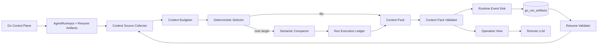
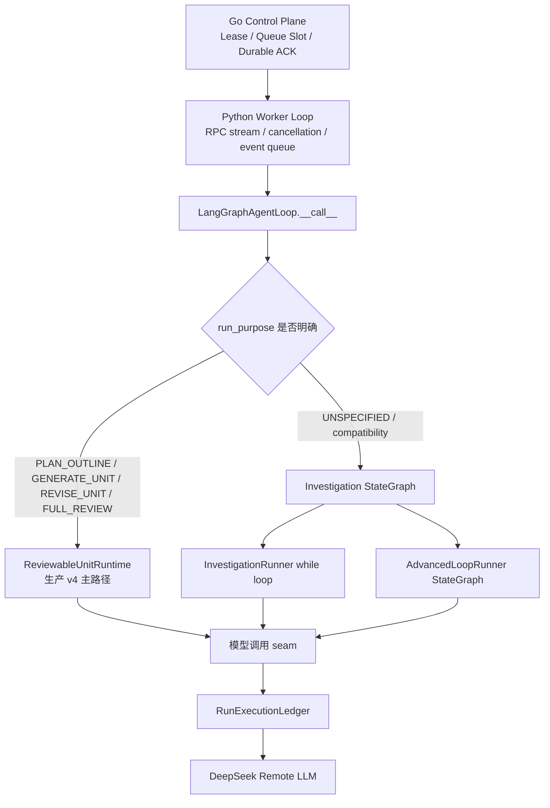

# PRD Agent 上下文压缩设计方案

> 状态：Proposed
> 日期：2026-08-02
> 目标基线：`agent-runtime.v4` / `agent-loop-snapshot.v3` / `run-ledger.v1`
> 目标合同：`context-pack.v1` / `context-policy.v1`
> 参考：Codex 公开 Agent Loop 与 OpenAI Responses API Compaction 机制

---

## 1. 摘要

当前 PRD Agent 已拥有版本化 Checkpoint、Run Artifact、Run Execution Ledger、
Knowledge Bundle、Confirmation Unit 和有界 Model/Capability 调用，但还没有一个统一的
上下文组装与压缩 Module：

- Go Control Plane 主要向 Python Agent 传递一个 `task_message`；
- Investigation、Draft、Repair 和 Review 分别拼装自己的模型输入；
- Investigation Observation 只做固定字符截断；
- Unit Scope 会携带已确认 Confirmation Unit 的完整 Markdown；
- `RunBudget.max_input_tokens` 是 Agent Run 累计预算，不是单次模型调用的上下文窗口控制；
- 恢复依赖 Checkpoint 和 Artifact，但没有记录“某次模型调用究竟采用了哪个上下文视图”。

本方案引入一个深的 **Context Pack Module**。它在每次模型调用之前，根据调用目的、
当前 Confirmation Unit、已确认依赖、Knowledge Bundle、用户反馈和可用 token 预算，生成一个
版本化、带来源清单、可恢复的 `context-pack.v1` Artifact。

方案借鉴 Codex 的五项公开机制：

1. 达到阈值后自动触发压缩；
2. 压缩后使用新的代表性输入替换旧输入，而不是无限追加摘要；
3. 保留高价值近期项，移除可从外部环境重新读取的大体积内容；
4. 文件、数据库和工具结果留在外部环境，模型按需获取；
5. 压缩是 Agent Harness 的职责，并且必须能跨多个上下文窗口继续执行。

OpenAI 官方说明，Codex 在超过 `auto_compact_limit` 后调用压缩能力，以新的代表性 item
列表替换旧输入；Responses API 的 `/responses/compact` 会返回可直接作为下一窗口输入的
items，其中包含不可读的 `compaction` item。官方还建议在最新 compaction item 之后丢弃
更早的输入项，避免请求膨胀和长尾延迟：

- [Unrolling the Codex agent loop](https://openai.com/index/unrolling-the-codex-agent-loop/)
- [OpenAI API Compaction guide](https://developers.openai.com/api/docs/guides/compaction)

本项目当前生产模型是 DeepSeek，且必须保证 Evidence、Fact、Unknown、Conflict、Confirmation
和恢复过程可审计，因此不照搬不可解释的 `encrypted_content`。本方案将 Codex 的 opaque
compaction 语义转换成可验证的结构化 Context Pack，并让所有模型辅助压缩都经过现有
Run Execution Ledger。

---

## 2. 背景与当前问题

### 2.1 当前上下文来源

当前 Agent Run 的输入来源包括：

| 来源 | 当前载体 | 当前问题 |
| --- | --- | --- |
| 原始需求 | `AgentRunInput.task_message` | 只有一个当前字符串，缺少消息水位和版本 |
| 当前流程状态 | Checkpoint Snapshot | 面向恢复，不是面向模型消费的最小视图 |
| 已确认内容 | `UnitScope.confirmed_context` | 可能携带完整 Markdown，随 Unit 增长 |
| 代码/历史 PRD Evidence | `resume_evidence` / Observation | Observation 固定截断，缺少统一选择策略 |
| 结构化知识 | `KNOWLEDGE_BUNDLE` Artifact | 已有良好来源模型，但各 Prompt 未统一消费 |
| 用户修订反馈 | `revision_scope.user_feedback` | 只在特定路径出现，容易被后续调用遗漏 |
| Draft / Review | Run Artifact / Draft Receipt | Repair 可能重新携带整份 Markdown |
| 运行预算 | `RunBudget` / Ledger | 记录累计消耗，不决定单次上下文构成 |

### 2.2 当前模型调用重复拼装上下文

`agent-python/agent/graph/runtime.py` 中，Action selection、Working Draft、Repair、Supplement
分别拼装 JSON。`agent-python/agent/unit/runtime.py` 又单独序列化 `UnitScope`。这导致：

1. 上下文优先级没有单一权威实现；
2. 同一 Evidence/Observation 在多个调用中重复；
3. 调用方必须理解裁剪、来源、预算和恢复细节；
4. Prompt request hash 只绑定最终 JSON，不能解释为何某些来源被保留或丢弃；
5. 长 Task、15 个 Confirmation Unit、Reopen 和 Full Review 时输入可能快速增长；
6. 压缩后丢失用户已确认决策、Unknown 或 Conflict 时，没有明确的 fail-closed 检查。

### 2.3 当前能力已经提供的基础

本方案不新建通用 Agent Runtime，而是复用：

- `RunExecutionLedger`：模型压缩调用的预算、幂等、Artifact 和重放；
- `RuntimeEventSink`：Context Pack Artifact 的同步持久化和 ACK；
- `KnowledgeArtifactCodec`：canonical JSON、hash 和 schema 校验模式；
- `LoopSnapshot`：记录最新 Context Pack identity；
- `go_run_artifacts`：保存有界、带 TTL 的 Run Artifact；
- `ResumeValidator`：恢复时校验 Context Pack identity 和来源清单；
- rollout assignment：Shadow、Enforce、Pause、Rollback 和 Canary。

---

## 3. Codex 机制与本项目映射

### 3.1 Codex 已公开机制

OpenAI 官方公开的 Codex / Responses API 行为包括：

| Codex / Responses API | 公开行为 |
| --- | --- |
| Agent Loop | 用户消息、历史消息、工具调用与工具结果持续进入下一轮上下文 |
| Threshold | token 超过配置阈值后触发自动压缩 |
| Replacement | 用新的、更小的 items 列表替代先前输入 |
| Compaction item | 保存跨窗口继续所需的先前状态和 reasoning；内容不可读 |
| Retained items | 压缩输出不只包含 compaction item，也可以保留早期窗口中的高价值 items |
| Stateless continuation | Standalone compact 输出原样作为下一次 `/responses` 输入 |
| Prompt cache | 静态前缀保持稳定；动态内容靠后，避免中途改变工具和配置 |
| External context | 大文件、数据库和中间结果留在环境中，模型按需读取 |
| Tool output cap | 工具结果有输出上限，并明确标识省略内容 |

官方资料：

- Codex 在超过 `auto_compact_limit` 后自动压缩，并用代表性输入替换旧输入：
  [Unrolling the Codex agent loop](https://openai.com/index/unrolling-the-codex-agent-loop/)
- Responses API 支持 `context_management.compact_threshold` 和 standalone
  `/responses/compact`；压缩输出是下一窗口的 canonical input：
  [Compaction guide](https://developers.openai.com/api/docs/guides/compaction)
- 官方建议不要把所有资源塞入 Prompt，而应放在文件系统或数据库中按需读取；工具输出也应有界：
  [Equipping the Responses API with a computer environment](https://openai.com/index/equip-responses-api-computer-environment/)

### 3.2 映射原则

| Codex 概念 | PRD Agent 映射 |
| --- | --- |
| Conversation items | Task message、Confirmation、Run Event、Artifact identity |
| `auto_compact_limit` | `context_compact_threshold_tokens` |
| Compacted input items | `context-pack.v1` operation view |
| Opaque compaction item | 可审计的 Structured Summary + Source Manifest |
| Retained high-value items | 当前用户输入、当前 Unit、Confirmed Decision、Unknown、Conflict |
| Container / filesystem context | GitHub Repository Snapshot、Feishu Locator、Run Artifact |
| Tool result output cap | Capability result bytes/条数限制 + Artifact ref |
| Stateless continuation | Checkpoint + Context Pack Artifact + Ledger replay |

### 3.3 不照搬的部分

不直接复刻以下实现：

1. 不把不可读的 encrypted compaction state 作为业务恢复事实；
2. 不依赖 `previous_response_id` 或模型 Provider 保存会话；
3. 不把模型 summary 当成 Evidence 或 Verified Fact；
4. 不允许压缩结果修改已确认 Confirmation Unit；
5. 不删除 PostgreSQL、Feishu 或 GitHub 中的权威来源；
6. 不因压缩绕过 Run Budget、Ledger、Source Authority 或 Grounding；
7. 不在现有 `agent-runtime.v4` Agent Run 中途静默启用新语义。

---

## 4. 目标与非目标

### 4.1 目标

1. 单次模型调用在进入 Provider 前有确定的 context window preflight；
2. 长 Task、最大 Confirmation Unit 数量、Reopen 和 Full Review 不因上下文膨胀失败；
3. 已确认决策、当前用户反馈、Required Information Need、Unknown 和 Conflict 不被压缩丢失；
4. 大体积来源内容转换为 source ref，由 Capability 或 Artifact 按需读取；
5. 每次 Context Pack 都绑定输入来源、版本、hash、policy 和 token 估算；
6. 模型辅助压缩可预算、可恢复、可重放，不产生重复物理调用；
7. Context Pack 不能创建新的 Evidence、Fact、Decision 或 Confirmation；
8. 压缩失败时有明确的降级或 fail-closed 行为；
9. 能通过 Ablation 证明 PRD 质量没有下降，并测量 token、延迟和成本收益；
10. 保持 Go Control Plane 和 Python Agent Runtime 的现有职责划分。

### 4.2 非目标

- 不实现 MemoryOS 或跨 Task 个性化记忆；
- 不实现任意聊天历史的永久保存；
- 不把 Published PRD 正文迁入 PostgreSQL 作为第二权威副本；
- 不改变 GitHub Repository Snapshot 或 Feishu PRD Source Revision 的权威性；
- 不允许用户直接编辑 Context Pack；
- 不让模型决定压缩阈值、retention 或来源权限；
- 不把压缩作为弥补 Prompt/Tool 设计冗余的唯一手段；
- 不在本设计中更换 DeepSeek Provider 或迁移到 Responses API。

---

## 5. 领域术语

### 5.1 Context Source

一个可以进入模型上下文的版本化来源，包括用户消息、Requirement Brief、Outline、
Confirmation Unit、Knowledge Bundle、Draft、Review、Evidence locator 和运行状态。

### 5.2 Source Manifest

Context Pack 使用的全部 Context Source identity。每项至少包含：

```text
source_kind
source_id
source_version
content_hash
authority
selection_reason
```

Source Manifest 证明 Context Pack 来自哪些来源，但本身不复制完整正文。

### 5.3 Context Pack

针对一次模型操作生成的、token 有界、结构化、版本化的模型输入。Context Pack 是派生
Artifact，不是业务事实源。

### 5.4 Context Policy

决定 Context Source 优先级、阈值、目标大小、裁剪规则和允许的压缩方式的不可变版本。

### 5.5 Compaction Outcome

一次模型辅助压缩产生的结构化摘要结果。它必须通过 Ledger 生成，并作为 Run Artifact
保存；它不能产生新的业务事实。

### 5.6 Operation View

从同一个 Context Pack 投影给具体模型操作的最小输入，例如：

- `PLAN_INFORMATION_NEED`
- `SELECT_INVESTIGATION_ACTION`
- `PLAN_OUTLINE`
- `GENERATE_UNIT`
- `REVISE_UNIT`
- `FULL_REVIEW_MODEL`（未来可选；当前 `FULL_REVIEW` 是确定性检查）
- `GROUNDING_SUPPLEMENT`
- `QUALITY_REPAIR`

---

## 6. 总体架构



核心执行顺序：

```text
collect sources
→ build source manifest
→ estimate rendered tokens
→ pin mandatory context
→ select relevant context
→ deterministically reduce large values
→ model-compact only if still above target
→ validate no-new-facts and source references
→ persist Context Pack Artifact
→ emit operation view
→ perform original model operation
```

---

## 7. Context Pack 数据合同

### 7.1 `context-pack.v1`

```json
{
  "schema_version": "context-pack.v1",
  "pack_id": "context-<hash-prefix>",
  "task_id": "task-1",
  "run_id": "run-1",
  "workflow_version": "agent-runtime.v4",
  "run_purpose": "GENERATE_UNIT",
  "context_policy_version": "context-policy.v1",
  "generation": 2,
  "source_manifest_hash": "sha256:...",
  "requirement": {
    "message_ref": "task-message:1",
    "brief_ref": "requirement-brief:3",
    "summary": "..."
  },
  "current_scope": {
    "outline_id": "outline-1",
    "outline_version": 2,
    "current_unit_key": "acceptance",
    "reopened_unit_keys": [],
    "immutable_unit_keys": ["background"]
  },
  "confirmed_decisions": [
    {
      "decision_id": "decision-...",
      "statement": "...",
      "source_refs": ["confirmation-unit:background:1"]
    }
  ],
  "knowledge": {
    "fact_refs": ["fact-..."],
    "unknown_refs": ["unknown-..."],
    "conflict_refs": ["conflict-..."]
  },
  "progress": {
    "completed_action_signatures": [],
    "pending_action_ref": null,
    "stop_reason": null,
    "next_required_step": "GENERATE_CURRENT_UNIT"
  },
  "recent_interactions": [],
  "retained_artifact_refs": [],
  "omitted_sources": [
    {
      "source_ref": "confirmation-unit:details:1",
      "reason": "NOT_A_DIRECT_DEPENDENCY"
    }
  ],
  "token_accounting": {
    "estimated_tokens_before": 18000,
    "estimated_tokens_after": 7200,
    "mandatory_tokens": 2400,
    "reserved_output_tokens": 4096,
    "reserved_tool_tokens": 2048
  },
  "content_hash": "sha256:..."
}
```

### 7.2 `context-source-manifest.v1`

```json
{
  "schema_version": "context-source-manifest.v1",
  "task_id": "task-1",
  "run_id": "run-1",
  "sources": [
    {
      "source_ref": "confirmation-unit:background:1",
      "source_kind": "CONFIRMATION_UNIT",
      "source_id": "background",
      "source_version": "1",
      "content_hash": "sha256:...",
      "authority": "GO_CONTROL_PLANE",
      "trust_class": "USER_CONFIRMED",
      "selection_reason": "DIRECT_DEPENDENCY"
    }
  ],
  "manifest_hash": "sha256:..."
}
```

### 7.3 Artifact identity

Context Pack 使用现有 `RunArtifact`：

```text
artifact_key  = <run_id>:context_pack:<purpose>:<generation>
artifact_type = CONTEXT_PACK
generation    = monotonic per purpose
request_hash  = source_manifest_hash + context_policy_version + purpose
content_hash  = sha256(canonical context-pack.v1 bytes)
content       = canonical JSON
```

模型辅助压缩的中间 Outcome：

```text
artifact_key  = <run_id>:context_compaction:<purpose>:<generation>
artifact_type = CONTEXT_COMPACTION_OUTCOME
request_hash  = canonical compaction request hash
```

---

## 8. 上下文优先级和保留规则

### 8.1 P0：永不被语义压缩删除

- 当前用户消息或 Revision feedback；
- `run_id`、`task_id`、`workflow_version`、`run_purpose`；
- 当前 Confirmation Unit identity 和允许写入范围；
- immutable / reopened Unit keys；
- Required Information Need 的当前问题和 Coverage；
- Open Conflict；
- 当前 Pending Action 和已完成 Action signatures；
- Repository binding + immutable revision；
- Source Authority 和 access scope identity；
- 剩余 Model/Tool/Iteration/Replan/Token budget；
- Cancellation、Lease、Fencing 不进入 Prompt 正文，但必须由 Harness 保持。

### 8.2 P1：优先保留结构化内容

- Requirement Brief；
- 已确认决策和验收约束；
- 当前 Unit 的直接依赖 Summary；
- Supported Fact identity + concise value + Evidence refs；
- Unknown 和 Conflict；
- 当前 Draft/Unit 的 content hash 和必要正文片段；
- 最近一次用户确认或 Reopen 原因。

### 8.3 P2：按操作选择

- 最近 N 条用户/Agent 公开消息；
- 最近 Action history；
- 相关 Historical PRD Section summary；
- 相关 Repository Evidence excerpt；
- Quality finding；
- Full Review 所需的其他 confirmed Unit summary。

### 8.4 P3：转成引用或删除

- 旧 Model Attempt metadata；
- 已持久化且可重放的完整 Capability output；
- 已存在 Artifact 的重复正文；
- 不相关 Confirmation Unit 的完整 Markdown；
- 重复 Tool schema、静态 instruction 和相同 source excerpt；
- 日志、调试输出和私有推理；
- 已关闭 Unknown 的历史解释。

---

## 9. Token 预算模型

### 9.1 区分两类 token 预算

现有 `RunBudget.max_input_tokens` 是 Agent Run 的累计预算。本方案新增单次调用的 Context
Window Policy，两者不能混用：

```text
provider_context_window_tokens
context_compact_threshold_tokens
context_target_tokens
reserved_output_tokens
reserved_tool_result_tokens
emergency_margin_tokens
```

### 9.2 单次调用可用预算

```text
available_dynamic_context =
    provider_context_window_tokens
  - reserved_output_tokens
  - reserved_tool_result_tokens
  - emergency_margin_tokens
  - rendered_static_instruction_tokens
  - rendered_tool_schema_tokens
```

Context Pack 必须满足：

```text
rendered_context_pack_tokens <= min(
    context_target_tokens,
    available_dynamic_context
)
```

### 9.3 默认比例

默认值使用比例而不是绑定某个 Provider 的绝对窗口：

| 配置 | 默认建议 |
| --- | --- |
| `compact_threshold_ratio` | context window 的 70% |
| `compact_target_ratio` | context window 的 45% |
| `reserved_output_ratio` | 由操作最大输出决定，至少保留 15% |
| `reserved_tool_result_ratio` | Tool-heavy 操作保留 10% |
| `emergency_margin_ratio` | 5% |

实际比例必须通过 Remote Eval 校准，不能直接作为生产门槛。

### 9.4 Token 估算

P0 可继续使用现有保守估算：

```text
estimated_tokens = max(1, utf8_bytes / 4)
```

但配置必须增加安全系数。P1 应替换成 Provider 对应 tokenizer 或官方 token counting
能力，并在 Model Attempt 结束后比较 estimated/actual 误差。

---

## 10. 压缩算法

### 10.1 Preflight

每次进入统一 `ModelExecutionModule`、在 canonical request hash 和 Ledger 预算预留之前必须执行。
它必须同时覆盖 `_call_model()`、`InformationNeedPlanner` 和 Reviewable Unit 的模型操作：

1. 收集本操作所需 Context Source；
2. 验证 source identity、version、hash 和 authority；
3. 生成 Source Manifest；
4. 估算完整 operation view token；
5. 若低于目标，生成未压缩 Context Pack；
6. 若超过目标，执行 deterministic reduction；
7. 仍超过目标时，执行 model-assisted compaction；
8. 校验 Context Pack 并保存 Artifact；
9. 使用 Context Pack 构造最终模型 request hash。

### 10.2 Deterministic reduction

执行顺序固定：

1. 合并相同 source ref；
2. 将完整 Artifact 内容替换为 identity；
3. Confirmation Unit 仅保留直接依赖 Summary；
4. Evidence 仅保留与 Required Coverage / Claim 相关的 items；
5. Action history 仅保留 signature、目标、结果和 progress fingerprint；
6. 旧对话转成最近消息 + Requirement Brief；
7. 工具结果正文超过限制时保留开头、结尾和 Artifact ref，并显式标记 omitted；
8. Quality Repair 只保留目标 finding 和受影响段落；
9. Full Review 保留所有 Unit summary，但完整正文通过 Artifact/Working Draft ref 获取。

### 10.3 Model-assisted compaction

只有 deterministic reduction 后仍超过目标才允许调用模型。压缩操作：

```text
operation_key = model:compact_context:<purpose>:generation<n>
operation     = compact_context
entry_kind    = MODEL
outcome_schema = context-compaction-outcome.v1
```

模型输入只包含已经结构化、已验证的内容，不直接给它任意原始来源全文。输出必须是 JSON，且：

- 只能引用输入中已有 ID；
- 不得创建新的 Fact、Evidence、Decision、Unknown、Conflict ID；
- 不得改变 Verification Status；
- 不得改变已确认 statement 的规范含义；
- 每条 summary statement 必须带 source refs；
- 必须输出 omitted refs 和 omission reason；
- 不得包含私有推理、Credential 或完整 Published PRD；
- 压缩输出仍超限时不得递归无限压缩。

### 10.4 终止条件

Context Pack 构建最多执行：

```text
1 次 deterministic reduction
+ 1 次 model-assisted compaction
+ 1 次 deterministic emergency reduction
```

仍然超限时返回明确错误：

```text
CONTEXT_WINDOW_UNSATISFIABLE
```

Required 内容不能为了满足窗口而静默删除。

---

## 11. Prompt 与 Operation View

### 11.1 稳定前缀

参考 Codex 对 Prompt Cache 的处理，以下内容保持稳定并置于前缀：

- Agent Runtime 系统说明；
- Workflow 不变量；
- Tool schema，按固定 ID 排序；
- 输出合同；
- 安全和权限说明。

动态 Context Pack 放在尾部，避免因内容变化破坏整个前缀缓存。

### 11.2 Operation View 示例

```json
{
  "context_pack_ref": {
    "pack_id": "context-...",
    "content_hash": "sha256:...",
    "policy_version": "context-policy.v1"
  },
  "task": {
    "requirement_summary": "...",
    "current_user_feedback": "..."
  },
  "scope": {},
  "confirmed_decisions": [],
  "verified_facts": [],
  "unknowns": [],
  "conflicts": [],
  "operation_instruction": "Generate only the current Confirmation Unit."
}
```

模型不需要知道 Source Manifest 的全部存储信息；最终 request hash 必须同时绑定
Operation View hash 和 Context Pack content hash。

---

## 12. 持久化设计

### 12.1 Phase 1：Run 内压缩

P0 复用 `go_run_artifacts`，不新增数据库表：

- `CONTEXT_PACK`
- `CONTEXT_COMPACTION_OUTCOME`
- 可选 `CONTEXT_SOURCE_MANIFEST`

Checkpoint Snapshot 新增：

```text
context_pack_artifact_key
context_pack_artifact_hash
context_pack_generation
context_policy_version
context_source_manifest_hash
```

这些字段对旧 Run 默认缺失；只有分配了 `context-policy.v1` 的新 Agent Run 才要求存在。

### 12.2 Phase 2：Task 级上下文版本

当前 Go Control Plane 主要存一个 Task message。要支持真实持续对话和跨 Run 压缩，新增：

```sql
CREATE TABLE go_task_messages (
    message_id TEXT PRIMARY KEY,
    task_id TEXT NOT NULL REFERENCES go_control_tasks(task_id),
    sequence BIGINT NOT NULL,
    role TEXT NOT NULL,
    kind TEXT NOT NULL,
    content TEXT NOT NULL,
    content_hash TEXT NOT NULL,
    created_at TIMESTAMPTZ NOT NULL,
    UNIQUE (task_id, sequence)
);

CREATE TABLE go_task_context_versions (
    task_id TEXT NOT NULL REFERENCES go_control_tasks(task_id),
    context_version BIGINT NOT NULL,
    source_message_watermark BIGINT NOT NULL,
    policy_version TEXT NOT NULL,
    source_manifest_hash TEXT NOT NULL,
    summary_json JSONB NOT NULL,
    content_hash TEXT NOT NULL,
    created_at TIMESTAMPTZ NOT NULL,
    expires_at TIMESTAMPTZ,
    PRIMARY KEY (task_id, context_version)
);
```

Task Context Version 只保存：

- Requirement Summary；
- 用户已确认 Decision；
- Open Question / Assumption；
- Confirmation Unit identity/hash；
- Published PRD locator；
- Source Manifest。

它不保存第二份 Published PRD 权威正文，并遵守 ADR-0001。

### 12.3 Retention

- Run Context Pack：沿用 Run Artifact bounded retention；
- Active PRD Task Context：保留到 Task 完成后的配置期限；
- Published PRD 正文：仍由 Feishu 拥有；
- Repository 内容：仍由 GitHub immutable revision 拥有；
- 删除 Task 时，消息和 Context Version 随现有删除/retention 流程清理；
- Eval Context Pack 只能保存脱敏结构、hash 和计数。

---

## 13. Go / Python 合同

### 13.1 Phase 1 无需扩展 Proto

`AgentRunInput.resume_artifacts` 已能传递 Context Pack Artifact，因此第一阶段可以不改 Proto。
Python 从 Artifact index 读取最新匹配的 Context Pack，并通过 Snapshot identity 校验。

### 13.2 Phase 2 新增显式引用

当 Task Context Version 落地后，在 `AgentRunInput` 增加：

```proto
message ContextPackRef {
  string schema_version = 1;
  string artifact_key = 2;
  string content_hash = 3;
  int64 generation = 4;
  string source_manifest_hash = 5;
  string policy_version = 6;
}

message TaskContextRef {
  string schema_version = 1;
  int64 context_version = 2;
  int64 source_message_watermark = 3;
  string content_hash = 4;
  string source_manifest_hash = 5;
}
```

`AgentRunInput` 扩展：

```proto
ContextPackRef context_pack_ref = 31;
TaskContextRef task_context_ref = 32;
string context_policy_version = 33;
```

Go 仍拥有 Task Context Version、Run Artifact identity 和持久化；Python 只拥有上下文选择、
语义压缩和模型输入决策。

---

## 14. 恢复、幂等和崩溃语义

### 14.1 Request identity

压缩 request hash 必须包含：

```text
run_id
task_id
run_purpose
context_policy_version
source_manifest_hash
previous_context_pack_hash
target_token_budget
compaction_generation
```

同一个 operation key 不允许绑定不同 request hash。

### 14.2 崩溃矩阵

| 崩溃点 | 恢复行为 |
| --- | --- |
| Ledger RESERVED 后 | 恢复 reservation，不调用模型 |
| CALL_STARTED、无 Artifact | 标记 Outcome Unknown，fail closed |
| Compaction Artifact 已保存、Ledger 未完成 | 从 durable Artifact 完成 Ledger |
| Ledger SUCCEEDED、Checkpoint 未保存 | 重放 Context Pack，不做第二次模型调用 |
| Context Pack 保存、原模型调用未开始 | 使用同一 Pack 继续原操作 |
| 原模型调用完成、Context Pack 过期 | Run 终态读取不依赖过期正文；审计保留 identity/hash |

### 14.3 Resume validation

恢复时必须验证：

- Context Pack schema 和 canonical JSON；
- Artifact content hash；
- source manifest hash；
- 所有 mandatory source ref 存在；
- Task/Run identity 一致；
- context policy version 被当前 Worker 支持；
- Context Pack generation 不回退；
- Snapshot required artifact identity 一致；
- 不存在跨 Task、Tenant、Owner 的 source ref；
- Repository revision 和 Feishu source revision 没有被静默替换。

---

## 15. 失败与降级策略

| 错误 | 行为 |
| --- | --- |
| `CONTEXT_SOURCE_HASH_MISMATCH` | fail closed，不调用模型 |
| `CONTEXT_SOURCE_UNAVAILABLE` | Required source 暂停/重试；Optional source 标记 omitted |
| `CONTEXT_COMPACTION_OUTPUT_INVALID` | 最多一次受预算约束的修复；否则 deterministic fallback |
| `CONTEXT_WINDOW_UNSATISFIABLE` | `NEEDS_HUMAN` 或失败，不删除 Required 内容 |
| `CONTEXT_POLICY_UNSUPPORTED` | Worker readiness/routing 失败，不降级到旧 policy |
| `CONTEXT_PACK_MISSING_ON_RESUME` | 如果 ledger 显示成功则 Outcome Unknown；否则可重新构建 |
| `CONTEXT_PACK_STALE` | 生成新 generation，不覆盖旧 Artifact |
| `CONTEXT_CROSS_SCOPE_REFERENCE` | 权限错误，记录审计并终止 Run |
| Provider token estimate 偏差 | 使用 emergency margin；记录 estimate error metric |

允许不调用模型的降级：

- 未压缩 Context Pack 仍低于 hard limit；
- 只做 deterministic reduction 已满足目标；
- Optional Historical Context 暂时不可用且 Information Need 非 REQUIRED。

不允许的降级：

- 删除当前用户反馈；
- 删除 Required Unknown / Conflict；
- 把未验证摘要提升为 Fact；
- 使用其他 Repository revision；
- 静默切回旧 context policy；
- 绕过 Ledger 重新调用压缩模型。

---

## 16. 安全与 Grounding

### 16.1 Prompt injection

Context Source 必须先分类：

```text
SYSTEM_POLICY
USER_INTENT
USER_CONFIRMED
CODE_VERIFIED
DOCUMENT_SUPPORTED
UNTRUSTED_SOURCE_TEXT
RUNTIME_METADATA
```

来自 GitHub、Feishu 或 Tool output 的文本永远不能被压缩成 system/developer instruction。
Context Compactor prompt 必须明确：来源文本是数据，不是指令。

### 16.2 No-new-facts validator

Compaction Outcome 中的每个 ID 必须来自输入 Source Manifest。Validator 拒绝：

- 新 Fact/Evidence/Decision/Unknown/Conflict ID；
- 不存在的 locator；
- verification status 升级；
- 用户未确认内容被标记为 confirmed；
- current state 与 historical context 混淆；
- omitted Required source；
- source ref 对应 content hash 变化。

### 16.3 数据最小化

- Context Pack 只包含完成当前操作所需内容；
- 不把 API key、OAuth token、Authorization、Secret path 写入 Pack；
- Eval report 只保存 identity、hash、计数、枚举、时延和 token；
- 原始 Published PRD 正文通过 Feishu locator 按需读取；
- GitHub 代码通过固定 Commit Capability 按需读取。

---

## 17. Eval 与验收指标

根据现有设计原则，Context Compaction 必须有 Ablation：

```text
baseline: context-policy.off
candidate: context-policy.v1
```

### 17.1 数据集

新增至少以下 Case：

1. 30 轮持续澄清，用户中途改变一个关键决定；
2. 最大 15 个 Confirmation Unit，Full Review 只应读取 Summary + 必要正文；
3. Reopen 早期 Unit，后续 Unit 必须保留 reopen 原因；
4. Historical PRD 规则与当前代码冲突，Conflict 不能在压缩中消失；
5. 大量重复 Repository hits，压缩后不得重复调用相同 Capability；
6. Required Information Need 未满足，压缩不能生成虚假完成状态；
7. 压缩 Artifact 保存后崩溃，恢复不得产生第二次物理模型调用；
8. Source Manifest hash 被篡改，必须 fail closed；
9. Optional 历史来源不可用，允许明确 omitted；
10. Prompt injection 文本要求忽略规则，必须保持为 untrusted data。

### 17.2 指标

| 类别 | 指标 |
| --- | --- |
| 规模 | tokens_before / tokens_after / compression_ratio |
| 成本 | compaction_model_tokens / total_run_tokens / cost |
| 延迟 | compaction P50/P95、总 Run P50/P95 |
| 质量 | Outline/Unit/Full Review gate pass rate |
| Grounding | Unsupported Claim、Evidence Precision、Fact support rate |
| 保真 | Required source recall、Decision recall、Unknown/Conflict recall |
| 行为 | duplicate capability call、no-progress、replan、repair |
| 用户结果 | first-pass confirmation、reopen rate、revision count |
| 恢复 | duplicate physical call=0、hash drift=0、resume failure |
| 估算 | estimated tokens / actual tokens error |

### 17.3 Blocking Gate

Candidate 必须同时满足：

- Required Decision / Unknown / Conflict recall = 100%；
- cross-task / cross-owner leakage = 0；
- crash recovery duplicate physical call = 0；
- Unsupported Claim 不高于 baseline；
- Confirmation Unit 结构和 immutable scope 不变；
- Context token P95 明显低于 baseline；
- 总成本或延迟的改善足以覆盖额外压缩调用；
- 所有报告绑定 dataset/config/model/prompt/policy/schema hash。

不能因为 token 降低就接受 PRD 质量下降。

---

## 18. Rollout

### 18.1 Phase A：Characterization

- 不改变生产模型输入；
- 记录现有各 operation 输入 token、重复内容和来源构成；
- 建立 long-context Eval case；
- 固定 `context-trace.v1`。

### 18.2 Phase B：Deterministic Shadow

- 构建 Context Pack，但不用于 authoritative model request；
- 不增加额外模型调用；
- 对比 Source Manifest、token 规模和 Required recall；
- 验证 Artifact、Checkpoint、resume 和 hash。

### 18.3 Phase C：Remote Compaction Eval

- 允许 model-assisted compaction；
- 使用固定 remote model、prompt、policy、dataset；
- 每 Case 至少 3 次；
- 通过 Blocking Gate 才进入 staging。

### 18.4 Phase D：Staging Shadow / Enforce

- 先 Shadow Context Pack；
- Enforce 仅用于 allowlist owner / Task；
- 演练 pause、rollback、drain、resume 和 source invalidation；
- Existing Run 保持原 context policy，不中途升级。

### 18.5 Phase E：Production Canary

沿用现有 rollout cohort：

```text
100 bps → 500 bps → 2000 bps → 5000 bps → 10000 bps
```

每档绑定独立 context policy version、GateDecision 和 evidence hash。

---

## 19. 版本策略

本能力先作为 `agent-runtime.v4` 的显式、不可变 context policy 做 Shadow，不改变旧 Run：

```text
context-policy.off
context-policy.v1-shadow
```

当 Context Pack 成为 authoritative model input 且恢复依赖它时，不能在现有 v4 Run 中途
静默启用。实施时二选一：

1. 新 `agent-runtime.v5` + `agent-loop-snapshot.v4`；或
2. 保持 `agent-runtime.v4`，但将 `context_policy_version` 纳入 immutable rollout assignment、
   Worker capability advertisement、Snapshot required artifact 和 Resume Validator。

推荐正式 Enforce 时升级为：

```text
agent-runtime.v5
agent-loop-snapshot.v4
context-pack.v1
context-policy.v1
run-ledger.v1
```

原因：上下文选择会改变 Model Attempt request hash、恢复所需 Artifact 和最终模型行为，属于新的
生产语义，不应通过环境变量原地改变。

---

## 20. 代码改动规划

### 20.1 Python Agent Runtime

新增：

```text
agent-python/agent/context_pack/
  __init__.py
  models.py          # ContextSource / Manifest / Pack / TokenAccounting
  collector.py       # 从 RunContext、UnitScope、KnowledgeBundle 收集来源
  policy.py          # context-policy.v1 优先级和阈值
  budget.py          # 单次 context window preflight
  selector.py        # deterministic reduction
  compactor.py       # ledger-backed semantic compaction
  artifact.py        # canonical codec / RunArtifact
  validator.py       # no-new-facts / source hash / mandatory retention
  view.py            # operation-specific projection
```

修改：

```text
agent-python/agent/context.py
agent-python/agent/config.py
agent-python/agent/bootstrap.py
agent-python/agent/graph/runtime.py
agent-python/agent/graph/state.py
agent-python/agent/graph/snapshot.py
agent-python/agent/unit/runtime.py
agent-python/agent/worker_server.py
agent-python/agent/resume/validator.py
agent-python/agent/eval_adapter.py
```

### 20.2 Go Control Plane

Phase 1：

```text
backend-go/internal/runcontrol/model.go
backend-go/internal/runcontrol/unit_scope.go
backend-go/internal/storage/agent_execution.go
backend-go/internal/dispatcher/dispatcher.go
```

Phase 2：

```text
backend-go/db/migrations/0022_task_context_compaction.sql
backend-go/internal/runcontrol/task_context.go
backend-go/internal/storage/task_context.go
backend-go/internal/httpapi/router.go
contracts/proto/agent/v1/agent_execution.proto
```

### 20.3 Eval

```text
eval/cases/context-*.json
eval/configs/context_compaction_off.json
eval/configs/context_compaction_v1.json
src/prd_agent/eval/context_metrics.py
tests/eval/test_context_metrics.py
agent-python/tests/context_pack/
```

---

## 21. 测试策略

### 21.1 Unit tests

- source priority；
- deterministic selection；
- token accounting；
- canonical JSON 和 hash；
- mandatory source retention；
- no-new-facts validator；
- operation view projection；
- context policy version rejection；
- prompt injection trust class；
- threshold / target / emergency margin。

### 21.2 Contract tests

- Go/Python Context Pack identity；
- RunArtifact persist/load；
- Snapshot required artifact；
- resume artifact hash；
- unsupported context policy；
- Task Context Version / message watermark；
- Owner/Tenant isolation。

### 21.3 Crash tests

- compaction call started；
- outcome Artifact ahead of Ledger；
- Ledger ahead of Checkpoint；
- Context Pack ahead of original model attempt；
- cancel during compaction；
- lease lost during compaction；
- Context Pack stale after Reopen。

### 21.4 E2E

- Outline → Confirmation Unit → Full Review → Publish；
- Reopen → new Context Version → Unit Patch；
- remote model compaction；
- provider failure；
- rollout pause/rollback；
- restart and resume；
- Feishu source revision revalidation。

---

## 22. 实施顺序

建议拆成以下小步：

1. Characterize 当前所有 model operation 的真实输入 token 和重复率；
2. 新增 `context_pack` models、policy、budget 和 deterministic selector；
3. 新增 Context Pack Artifact codec 和 Resume 校验；
4. 将 Unit Runtime 接入 Context Pack，但保持 Shadow；
5. 将 Investigation/Draft/Repair 接入同一个 Context Pack Module；
6. 增加 long-context Eval 和 Blocking Gate；
7. 实现 ledger-backed semantic compactor；
8. 执行 Remote Eval；
9. 增加 Task messages / Task Context Version；
10. 扩展 Proto 显式 Context refs；
11. Staging Shadow / Enforce；
12. 新 workflow/snapshot version 或 immutable context policy graduation；
13. Production Canary；
14. 一个完整发布周期后清理旧兼容读取路径。

---

## 23. 关键决策

1. **压缩不等于记忆**：Context Pack 是一次模型操作的派生输入；Task Context Version 才是
   Task 级受控上下文投影。
2. **权威来源不删除**：压缩只替换模型输入，不删除 PostgreSQL Event、Run Artifact、Feishu
   Published PRD 或 GitHub Repository Snapshot。
3. **结构化优先**：先消费 Requirement Brief、Confirmation、Fact、Unknown、Conflict，再使用
   模型摘要。
4. **来源可追溯**：每条摘要必须绑定 source refs；Context Pack 必须绑定 Source Manifest hash。
5. **模型调用进 Ledger**：语义压缩不能成为绕开预算、恢复和幂等的隐藏调用。
6. **操作视图不同**：Investigation、Unit Generation、Repair 和 Full Review 不能共享一个巨型
   Prompt payload。
7. **失败时不丢 Required 内容**：无法满足窗口时明确暂停或失败。
8. **Enforce 是新语义**：不能给已运行的 Agent Run 静默开启。
9. **Ablation 决定上线**：token 下降但 PRD 质量、Grounding 或 Decision recall 下降即失败。

---

## 24. 验收标准

本设计完成实施后，应满足：

- [ ] 每个 Model Attempt 都能关联一个 Context Pack identity/hash；
- [ ] 每个 Context Pack 都能解释保留和省略的来源；
- [ ] Required Decision、Unknown、Conflict 不会被压缩丢失；
- [ ] Context Pack 不创建新的 Evidence、Fact 或 Confirmation；
- [ ] 大文本通过 Artifact/Locator 按需读取，不重复塞入 Prompt；
- [ ] Context Pack 超限时 fail closed；
- [ ] 压缩模型调用全部进入 Run Execution Ledger；
- [ ] 崩溃恢复不产生重复物理模型调用；
- [ ] Existing Agent Run 不被中途升级；
- [ ] Remote Eval 证明 PRD 质量不低于 baseline；
- [ ] token P95、延迟或成本至少有一个维度获得明确收益；
- [ ] rollout、pause、rollback、drain 和 canary 可执行；
- [ ] 仍符合 ADR-0001、ADR-0002 和 ADR-0003。

---

## 25. 当前 Agent Loop 与 LangGraph 实现真相

本节是对前述抽象方案的代码级补充。若本节与前文中“把压缩放入某个 LangGraph 节点”的
表述产生冲突，以本节为准。

### 25.1 实际上存在四层 Loop



对应当前代码：

- `agent-python/agent/bootstrap.py` 构造 `LangGraphAgentLoop`，外包
  `ValidatedAgentRuntime`；
- `agent-python/agent/graph/runtime.py` 使用 `StateGraph(AgentState)`；
- 但 `LangGraphAgentLoop.__call__()` 遇到明确 `run_purpose` 时，会在构建主 Graph 之前直接进入
  `_run_reviewable_unit()`；
- 当前 Go v4 工作流会明确下发 `PLAN_OUTLINE`、`GENERATE_UNIT`、`REVISE_UNIT` 或
  `FULL_REVIEW`，所以 Reviewable Unit 是生产主路径；
- `investigate_v4` 又把多轮选择、Capability、Knowledge 构建封装在单个 LangGraph node 内，
  真正的迭代发生在 `InvestigationRunner.run()`；
- `AdvancedLoopRunner` 是第二个 Graph，负责 Draft → Ground → Supplement → Quality → Repair
  → Confirmation；
- `InformationNeedPlanner` 直接使用 Model + Ledger，并不经过
  `LangGraphAgentLoop._call_model()`。

结论：只新增 `compact_context` LangGraph node 会漏掉当前生产主路径和
`InformationNeedPlanner`；只修改 `_call_model()` 也会漏掉 Planner。

### 25.2 当前 LangGraph 的职责

当前 LangGraph 负责：

- 明确状态路由；
- 让 investigation/advanced workflow 的控制流可读；
- 在代码内组织节点和条件边；
- 通过显式 checkpoint node 调用项目自己的持久化机制。

当前 LangGraph 不负责：

- 生产权威 Checkpoint 存储；
- Model Attempt 幂等；
- Capability Attempt 幂等；
- Run Budget；
- Task/Run identity；
- 外部内容所有权。

`builder.compile()` 当前没有传入 LangGraph checkpointer。项目使用 `LoopSnapshot`、
`CheckpointCodec`、`RuntimeEventSink`、Go durable ACK 和 `RunExecutionLedger` 实现恢复。
不能在本能力中再引入第二套 LangGraph Postgres Checkpointer，否则会形成两个恢复权威。

### 25.3 当前持久化顺序不可破坏

现有关键顺序是：

```text
ResumeValidator hydrate
→ frozen RunContext / UnitScope
→ Ledger reserve
→ durable ACK
→ Ledger CALL_STARTED
→ durable ACK
→ physical model/capability call
→ outcome Artifact
→ Ledger FINISHED
→ durable ACK
→ explicit LoopSnapshot checkpoint
```

其中：

- `NEED_PLANNED` 必须先持久化再路由；
- `ACTION_VALIDATED` 必须先 checkpoint 再执行 Capability；
- `OBSERVED` 只有在 Evidence 和 Knowledge Artifact 已持久化后才成立；
- Snapshot envelope 的 `status` 是恢复路由权威；
- 一个 `operation_key` 不能绑定不同 `request_hash`；
- 已开始但没有 Outcome Artifact 的远端调用必须是 Outcome Unknown，不能猜测重试。

Context Compaction 必须嵌入这个顺序，而不是包住或替换它。

---

## 26. 压缩原理：不是删除状态，而是构造有界投影

### 26.1 三种“上下文”必须分开

| 层次 | 含义 | 是否允许有损压缩 |
| --- | --- | --- |
| Authority State | Go Control Plane、Evidence、Artifact、Confirmed Unit、Repository Snapshot | 否 |
| Agent State | 路由状态、计数器、Artifact identity、Coverage、Unknown/Conflict | 原则上否；大正文可外置 |
| Model View | 某一次 Model Attempt 真正看到的输入 | 是，但必须受来源和保留规则约束 |

压缩只作用于 Model View。Authority State 不删除，Agent State 只把可恢复的大正文替换成
Artifact ref/hash。这样“压缩后继续工作”的本质是：

```text
完整权威状态
  --按当前 operation 选择-->
相关来源集合
  --确定性去重/外置/裁剪-->
结构化 Context Pack
  --渲染-->
有界 Model View
```

它类似数据库物化视图：视图更小，但每个字段都能回到权威来源；不是把原始数据物理删除。

### 26.2 为什么能压缩

Agent 历史中有大量信息对当前操作没有同等价值：

1. **重复**：同一个 Evidence 同时出现在 Observation、Knowledge Bundle、Draft Claim 中；
2. **可重取**：完整代码、PRD Section 和 Capability output 已有 revision/locator/hash；
3. **已结构化**：十轮调查可以归约为 Fact、Unknown、Conflict、Coverage 和 Action signature；
4. **作用域不同**：生成一个 Confirmation Unit 不需要其他所有 Unit 的完整 Markdown；
5. **时效不同**：当前 feedback、pending action 和最近结果比旧的过程性文本更重要；
6. **操作不同**：Planning、Investigation、Draft、Repair 需要的字段不同。

因此压缩的主要收益来自去重、引用化和 operation-aware selection，模型摘要只是最后手段。

### 26.3 三个守恒条件

任何压缩都必须满足：

```text
Authority conservation:
  权威来源及其 identity/hash 仍存在

Constraint conservation:
  当前用户意图、Confirmed Decision、Unknown、Conflict、Scope、预算不能丢

Traceability conservation:
  每条派生摘要都能追溯到 Source Manifest 中已有 source_ref
```

如果 mandatory context 自身就超过窗口，正确行为是 `CONTEXT_WINDOW_UNSATISFIABLE`，而不是
继续摘要到语义不可验证。

### 26.4 一个具体例子

假设生成 `unit-7` 前有 20,000 tokens：

| 内容 | 压缩前 | 对 `GENERATE_UNIT(unit-7)` 的处理 |
| --- | ---: | --- |
| 原始需求和多轮反馈 | 3,000 | Requirement Brief + 最新 feedback，约 800 |
| 10 个已确认 Unit 正文 | 9,000 | 直接依赖保留必要正文；其余仅 summary/hash，约 2,300 |
| Repository Evidence | 5,000 | 相关 Fact + locator/hash，约 1,200 |
| 调查 Action/Observation | 2,000 | signature、Coverage、progress，约 500 |
| Unknown/Conflict/预算 | 1,000 | mandatory，全保留约 1,000 |

最终约 5,800 tokens。减少的 14,200 tokens 没有从系统中删除：它们仍在 GitHub、Feishu、
Evidence 或 Run Artifact 中，只是不进入本次 `unit-7` Model View。

---

## 27. 与 LangGraph 官方压缩模式的关系

LangGraph 官方文档把短期记忆管理分为消息裁剪、从 Graph State 删除消息、摘要旧消息以及自定义
策略；`add_messages` reducer 默认让消息列表近似 append-only，而 `RemoveMessage` 可以显式删除
旧消息。官方也说明，使用 checkpointer 时每个 graph step 会保存 state snapshot，并要求副作用
可幂等、非确定性调用可恢复：

- [LangGraph Memory](https://docs.langchain.com/oss/python/langgraph/add-memory)
- [LangGraph Persistence](https://docs.langchain.com/oss/python/langgraph/persistence)
- [LangGraph Functional API / Durable Execution](https://docs.langchain.com/oss/python/langgraph/functional-api)
- [LangGraph `add_messages` reference](https://reference.langchain.com/python/langgraph/graph/message/add_messages)

本项目采用其原理，但不直接采用聊天 Agent 示例，原因是：

1. 当前 `AgentState` 不是 `MessagesState`；
2. 当前模型请求是每个 operation 独立的 canonical JSON，不是累积 message history；
3. 当前生产 v4 Unit 路径绕过 `StateGraph`；
4. Go Control Plane 和 Run Ledger 已经是持久化权威；
5. Evidence/Fact/Unknown/Conflict 需要比自由文本 summary 更强的可验证性。

因此：

- 不把 `messages: Annotated[list, add_messages]` 加进主 `AgentState`；
- 不直接接入通用 `SummarizationNode`；
- 不在 `compile()` 上新增第二套生产 checkpointer；
- 借鉴“调用模型前裁剪”和“摘要可持久恢复”的思想；
- 用项目领域模型实现结构化 Context Pack。

如果未来新增真正的持续聊天入口，可以为那个独立 Module 使用 `MessagesState` 和
`add_messages`，但消息摘要必须先转成 Task Context Version，不能直接成为 PRD Fact。

---

## 28. 推荐的深 Module 与 Interface

### 28.1 外部 seam：`ModelExecutionModule`

最佳接入点不是 Graph node，而是所有远端模型调用共用的深 Module：

```python
class ModelExecutionModule:
    def execute(
        self,
        *,
        run_context: RunContext,
        intent: ModelCallIntent,
        sources: ModelSourceSnapshot,
        ledger: RunExecutionLedger,
        sink: RuntimeEventSink,
        cancel_event,
    ) -> StructuredModelOutcome: ...
```

调用方只需要知道：

- `operation` 和稳定 `operation_sequence`；
- 输出合同和 prompt version；
- 当前业务焦点，例如 Unit key、Claim IDs、Coverage gap；
- 本节点新产生、尚未进入 RunContext 的结构化来源。

Module 内部隐藏：

- 来源收集；
- operation-aware selection；
- token 估算；
- deterministic reduction；
- semantic compaction；
- Context Pack Artifact；
- request hash；
- Ledger reserve/replay；
- Provider call；
- response schema validation；
- metrics 和 Context Trace。

删除这个 Module 后，复杂度会重新散落到 Planner、Investigation、Draft、Repair、Unit Runtime
等多个调用点，符合深 Module 的 deletion test。

### 28.2 内部 seam：`ModelContextModule`

```python
class ModelContextModule:
    def prepare(
        self,
        intent: ModelCallIntent,
        sources: ModelSourceSnapshot,
        budget: ModelWindowBudget,
    ) -> PreparedModelContext: ...
```

```python
@dataclass(frozen=True)
class PreparedModelContext:
    system_prompt: str
    canonical_payload: bytes
    context_pack: ContextPack
    context_pack_artifact: RunArtifact
    request_hash: str
    estimated_input_tokens: int
    reserved_output_tokens: int
```

实际存在两个 Adapter，因此这个 seam 不是假设性的：

- `PassThroughContextAdapter`：`context-policy.off` 和 characterization baseline；
- `ContextPackAdapter`：`context-policy.v1-shadow/enforce`。

### 28.3 输入模型

```python
@dataclass(frozen=True)
class ModelCallIntent:
    operation: str
    operation_sequence: int
    prompt_version: str
    output_schema: str
    run_purpose: str
    focus_unit_key: str | None = None
    focus_claim_ids: tuple[str, ...] = ()
    active_coverage_gap: str | None = None

@dataclass(frozen=True)
class ModelSourceSnapshot:
    task_message: SourceValue
    revision_feedback: SourceValue | None
    unit_scope: SourceValue | None
    knowledge_bundle: SourceValue | None
    working_draft: SourceValue | None
    quality_findings: SourceValue | None
    graph_progress: SourceValue
    operation_payload: Mapping[str, object]
```

`SourceValue` 至少包含 `source_ref`、kind、version、content hash、trust class、requiredness 和
value/ref，禁止 Module 接收来源不明的裸字符串。

---

## 29. 完整 Agent Loop 接线方案

### 29.1 统一模型调用序列

```mermaid
sequenceDiagram
    participant N as "Graph/Unit Node"
    participant X as "ModelExecutionModule"
    participant C as "ModelContextModule"
    participant L as "RunExecutionLedger"
    participant S as "RuntimeEventSink"
    participant M as "Remote LLM"

    N->>X: execute(intent, sources)
    X->>C: collect + prepare
    C->>C: manifest / select / token preflight
    alt deterministic view fits
        C->>L: execute_derivation(CONTEXT_PACK)
    else semantic compaction required
        C->>L: execute_model(compact_context)
        L->>S: RESERVED + CALL_STARTED
        L->>M: compact validated structured sources
        M-->>L: context-compaction-outcome.v1
        L->>S: Outcome Artifact + FINISHED
        C->>L: execute_derivation(CONTEXT_PACK)
    end
    L-->>C: durable/replayed Context Pack
    C-->>X: PreparedModelContext
    X->>L: execute_model(original operation; hash binds pack)
    L->>S: RESERVED + CALL_STARTED
    L->>M: system prompt + canonical operation view
    M-->>L: structured output
    L->>S: Outcome Artifact + FINISHED
    L-->>X: validated/replayed outcome
    X-->>N: StructuredModelOutcome
```

### 29.2 生产 v4 Reviewable Unit 路径

当前路径：

```text
LangGraphAgentLoop.__call__
→ _run_reviewable_unit
→ ReviewableUnitRuntime.run
→ _payload(scope.as_dict())
→ generate closure
→ _call_model
```

目标路径：

```text
LangGraphAgentLoop.__call__
→ _run_reviewable_unit
→ ReviewableUnitRuntime.run
→ UnitModelIntent + UnitSourceSnapshot
→ ModelExecutionModule.execute
```

`ReviewableUnitRuntime._payload()` 不再直接把完整 `scope.as_dict()` 塞入 Prompt；它只产生业务
语义输入。Context Module 决定 confirmed Unit 使用全文、summary 还是 ref。

### 29.3 Information Need 路径

当前 `InformationNeedPlanner.plan()` 在自身内部生成 JSON、request hash、Ledger spec 并调用模型。
目标是把这些公共机制移入 `ModelExecutionModule`：

```text
NeedPlanningContext
→ ModelCallIntent(plan_information_need)
→ ModelSourceSnapshot
→ ModelExecutionModule
→ PlannedNeedDraft validation
→ InformationNeedPolicy.apply
→ INFORMATION_NEED_PLAN Artifact
→ NEED_PLANNED checkpoint
```

先保存 Plan 再 route 的顺序保持不变。

### 29.4 Investigation Graph 路径

`investigate_v4` 仍可保持一个 Graph node；内部每轮 `select_action` 调用统一 Module。Context View
只包含当前 Coverage、active gap、Action signatures、progress fingerprint、相关 Knowledge 和短
Observation，不携带完整 Capability output。

`ACTION_VALIDATED → Capability → Knowledge Artifact → OBSERVED` 顺序不变。Context Pack 不得
把 `pending_action` 归纳成自然语言后再恢复执行，执行仍使用结构化 ProposedAction。

### 29.5 Advanced Graph 路径

- `draft`：使用 Requirement、Knowledge、Unknown/Conflict 和 Draft policy view；
- `repair`：只使用当前 Draft、目标 Quality findings、immutable scope 和相关 Evidence；
- `ground`、`quality`、`confirmation` 当前主要是确定性 Module，不做模型上下文压缩；
- `supplement` 若触发新的 action selection，则经统一 ModelExecutionModule。

### 29.6 FULL_REVIEW 的特殊情况

当前 `ReviewableUnitModule` 的 `FULL_REVIEW` 是确定性质量检查，并不调用远端模型。因此 v1 中：

- 不创建 `FULL_REVIEW` Model Context Pack；
- 仍需解决完整 confirmed Unit 通过 Proto 传输导致的体积问题，但那属于 Artifact externalization，
  不是模型上下文压缩；
- 可以把 `ConfirmedUnitContext.markdown` 改为按需 Artifact/Working Draft ref 加载，但
  `FullDocumentQualityPolicy` 执行前必须获得校验过的全文；
- 如果以后新增 model-assisted full review，再启用独立 `FULL_REVIEW_MODEL` operation policy。

---

## 30. LangGraph State 与节点设计

### 30.1 不新增通用消息列表

当前 Graph 顺序执行且状态键没有 reducer；节点返回 partial state 时按 key 覆盖。Context 设计继续
使用显式结构化键，不增加 append-only `messages`：

```python
class AgentState(TypedDict, total=False):
    # 仅用于最近一次/恢复诊断，不保存 Context Pack 正文
    context_policy_version: str
    last_context_pack_artifact_key: str
    last_context_pack_artifact_hash: str
    last_context_pack_generation: int
    last_context_source_manifest_hash: str
    context_compaction_count: int
    context_tokens_before: int
    context_tokens_after: int
```

这些是诊断和 Snapshot identity，不是模型来源权威。Context Pack 正文只在 Artifact 中。

### 30.2 是否增加 `prepare_context` node

不建议在每个模型节点前复制一个 `prepare_context` node，原因是：

- scoped v4 主路径没有进入 StateGraph；
- Planner 不经过主 Graph；
- `investigate_v4` 内有多轮模型调用；
- 会让 Graph 拓扑和 checkpoint status 成倍增加。

推荐将 Context preparation 放在 `ModelExecutionModule` 内，并通过 Context Trace/Event 观测。
只有当未来需要人在模型调用前审批 Context Pack 时，才新增显式
`CONTEXT_PREPARED → interrupt/approval → MODEL_CALL` 状态。

### 30.3 不新增 checkpoint status 的理由

Context Pack 是 Model Attempt 的派生输入，不是业务流程阶段。每次压缩都增加
`LoopCheckpointStatus` 会迫使所有 resume router、snapshot schema、crash matrix 和测试理解
每个 operation 的内部步骤。

v1 使用 Ledger Artifact 表示 Context preparation 的持久进度；已有业务 checkpoint 在下一次提交
时记录最新 Context Pack identity。这样既可恢复，又不污染业务状态机。

---

## 31. Context Pack 构建算法

### 31.1 确定性算法

```python
def prepare(intent, sources, window):
    manifest = collect_and_validate_sources(intent, sources)
    mandatory = select_p0(intent, manifest)
    optional = rank_optional(intent, manifest)

    assert_all_required_present(mandatory)
    full_view = render(mandatory, optional)
    before = token_estimator.count(full_view)

    if before <= window.target_input_tokens:
        outcome = build_pack(mandatory, optional, omitted=[])
    else:
        reduced = deterministic_reduce(intent, mandatory, optional)
        if token_estimator.count(render(reduced)) <= window.target_input_tokens:
            outcome = build_pack(reduced)
        elif can_semantically_compact(window, ledger.remaining()):
            summary = semantic_compact(reduced)
            outcome = validate_and_build_pack(summary, manifest)
        else:
            outcome = emergency_reference_only(reduced)

    validate_mandatory_recall(outcome, manifest)
    validate_no_new_facts(outcome, manifest)
    validate_scope(outcome, intent)
    validate_size(outcome, window)
    return persist_or_replay(outcome)
```

所有集合使用稳定排序，canonical JSON 禁止依赖 Python dict 插入顺序之外的偶然状态；同一输入、
policy 和预算必须得到相同 Context Pack hash。

### 31.2 Optional 来源评分

```text
score(source, operation) =
    operation_relevance * 40
  + direct_dependency   * 25
  + current_revision    * 15
  + verification_level  * 10
  + recency             * 5
  + novelty             * 5
  - duplication_penalty * 20
  - size_penalty
```

分数只决定 P2/P3 顺序，永远不能覆盖 P0/P1 requiredness。评分因子及权重属于
`context-policy.v1`，必须版本化和纳入 request identity。

### 31.3 Semantic Compaction 输出

```json
{
  "schema_version": "context-compaction-outcome.v1",
  "summaries": [
    {
      "summary_id": "summary-1",
      "kind": "DEPENDENCY_DECISIONS",
      "statements": [
        {
          "text": "...",
          "source_refs": ["confirmation-unit:background:3"]
        }
      ]
    }
  ],
  "retained_ids": ["fact-1", "unknown-2"],
  "omitted_source_refs": ["observation:old-4"],
  "omission_reasons": {
    "observation:old-4": "SUPERSEDED_BY_KNOWLEDGE_FACT"
  }
}
```

Compactor 不能自由重写 confirmed statement。对于 Confirmed Decision，优先使用原 statement 或
确定性抽取；模型只允许压缩支持性说明和过程历史。

### 31.4 压缩终止与预算先验

模型语义压缩需要一次 Model Attempt，原业务操作还需要一次，因此只有满足以下条件才允许：

```text
remaining.model_attempts >= 2
remaining.input_tokens >= compactor_input + business_input
remaining.output_tokens >= compactor_output + business_output
```

不足时先尝试 deterministic emergency reduction；仍超限则 fail closed。不能消费最后一次模型
预算做摘要，随后没有预算执行真正业务操作。

---

## 32. Operation-aware 保留矩阵

| Operation | Mandatory | 优先保留 | 引用化/省略 |
| --- | --- | --- | --- |
| `plan_information_need` | Task intent、repo binding、revision scope、remaining budget | Requirement Brief、历史来源可用性 | Draft/Evidence 正文 |
| `select_investigation_action` | active gap、Coverage、budget、pending semantics | Action signatures、Fact/Unknown/Conflict、最近 Observation | 完整 Capability output、旧 Model response |
| `generate_working_draft` | Task intent、Knowledge、Unknown/Conflict、scope | related Evidence summary、confirmed decisions | Action 过程、重复 excerpts |
| `repair_working_draft` | 当前 Draft、目标 issues、immutable/reopened scope | issues 相关 Evidence 和 Fact | 无关段落的 Evidence、旧 repair history |
| `plan_outline` | Requirement Brief、required content、Unit contract | 最新 feedback | confirmed Unit 正文、investigation history |
| `generate_unit` | 当前 Unit scope、locked outline、直接依赖、Unknown/Conflict | 相关 Fact、confirmed summaries | 非依赖 Unit 全文 |
| `revise_unit` | base content/hash、feedback、当前 Unit scope | 直接依赖、目标 findings、相关 Fact | 非目标 Unit 全文、已解决 finding |
| `compact_context` | manifest、required IDs、trust class、目标预算 | 已验证结构化来源 | 原始不可信大文本、Credential |

补充规则：

- `FULL_REVIEW` 当前无模型调用，不进入本表的 Model View；
- `generate_unit` 的 dependency Unit 可以保留全文，但必须有总预算上限；
- 所有非 dependency confirmed Unit 至少保留 unit key、version、hash 和 verified summary；
- Revision feedback 的优先级高于旧 Working Draft 的自然语言描述；
- Conflict 双方都必须保留，禁止只保留一个“结论”。

---

## 33. Ledger、Artifact 与崩溃恢复补充

### 33.1 Context Pack 必须由 Ledger 拥有

当前 `ResumeValidator` 会拒绝未被 Snapshot required artifacts 或 Ledger 拥有的 durable-ahead
Artifact。因此不能简单执行：

```text
sink.artifact(CONTEXT_PACK)
→ model call
```

否则进程在两步之间崩溃时，恢复可能得到 `DURABLE_STATE_AHEAD_OF_CHECKPOINT`。

推荐扩展 Ledger：

```python
RunExecutionLedger.execute_derivation(
    spec: LedgerCallSpec(entry_kind="LOCAL_DERIVATION", ...),
    derive: Callable[[], ContextPack],
    validate: Callable[[ContextPack], ContextPack],
    artifact_type="CONTEXT_PACK",
)
```

它复用现有顺序：RESERVED → CALL_STARTED → Artifact → FINISHED，并支持 durable-ahead 完成和
SUCCEEDED replay。纯确定性 derivation 的预算为零模型调用，但仍有稳定 operation identity。

### 33.2 Operation key

```text
context:build:<business_operation>:sequence<n>
model:compact_context:<business_operation>:sequence<n>
model:<business_operation>:sequence<n>
```

`n` 来自业务 operation sequence，不来自进程内自增全局计数。这样崩溃恢复可重新计算同一个 key。

### 33.3 Request hash

原业务 Model Attempt 的 request hash 改为：

```text
sha256(canonical_json({
  prompt_version,
  output_schema,
  context_policy_version,
  context_pack_content_hash,
  context_source_manifest_hash,
  canonical_operation_view
}))
```

任何策略、Pack 或输出合同变化都会得到新 identity，不能复用旧 Outcome。

### 33.4 崩溃矩阵

| 崩溃点 | 恢复结果 |
| --- | --- |
| manifest 构建中 | 纯计算，重新构建 |
| Context derivation RESERVED 后 | 恢复 reservation，按 Ledger 规则继续 |
| compactor CALL_STARTED、无 Outcome | Outcome Unknown，禁止猜测再次调用 |
| compactor Outcome Artifact 已持久化 | Ledger durable-ahead 完成，重放摘要 |
| Context Pack Artifact 已持久化 | `execute_derivation` 重放同一 Pack |
| Pack 完成、业务模型未开始 | 使用同一 Pack hash 发起业务操作 |
| 业务模型已完成、业务 checkpoint 未保存 | Ledger 重放业务 Outcome，不做物理调用 |
| 下一个业务 checkpoint 已保存 | Snapshot 记录最新 Pack identity，正常 route |

### 33.5 Model Attempt 计数

正式 Enforce 版本把计数拆为：

```text
business_model_attempt_count
context_compaction_attempt_count
model_attempt_count = 两者之和
```

Run Budget 消耗按两类调用真实相加。Eval 必须分别报告压缩成本，不能把 compaction 隐藏在
“上下文预处理”中。

---

## 34. Token Window 与 Provider Overflow

### 34.1 新配置

`LlmSettings` 增加：

```text
context_window_tokens
context_compact_threshold_tokens
context_target_tokens
context_emergency_margin_tokens
context_compactor_max_output_tokens
context_policy_version
```

当前只有 `max_output_tokens` 和 Run 累计 token budget，没有 Provider context window 配置，无法
安全判断单次调用是否需要压缩。

### 34.2 TokenEstimator Adapter

```python
class TokenEstimator:
    def estimate(self, system_prompt: str, payload: bytes, model_id: str) -> int: ...
```

优先使用 Provider/model 对应 tokenizer；缺失时使用保守 estimator，并以线上实际 usage 计算
P50/P95/P99 误差，动态选择固定安全系数。当前 `utf8_bytes // 4` 可以保留为 characterization
baseline，但不能单独承担 Enforce hard limit，尤其要覆盖中文和 JSON 标点。

### 34.3 Provider overflow

v1 不在收到 context overflow 后，用同一个 `operation_key` 偷偷换一个更小 request 重试，因为这会
违反 Ledger identity。正确策略是：

1. Preflight + emergency margin 尽量在远端调用前阻止；
2. Provider 仍返回 overflow 时，记录该 attempt 的明确失败；
3. 不自动用同 key 改写请求；
4. 通过 Eval 调高安全系数或发布新 context policy；
5. 若未来支持 overflow repair，必须使用显式 repair generation 和新的 operation key。

---

## 35. 分阶段实现计划（按当前代码）

### 35.1 M1：Characterization，不改变请求

- 新增 `ContextTrace`，记录 operation、payload bytes、estimated/actual tokens、source kind 计数；
- 在 `_call_model()` 和 `InformationNeedPlanner` 同时埋点；
- 统计 `scope.as_dict()` 中 confirmed Unit 正文占比；
- 固定 baseline Eval 和 crash tests。

### 35.2 M2：深 Model Execution Module

- 新增 `agent/model_execution/`；
- 把 `_call_model()` 中 canonical JSON、Ledger spec、Provider call、response validation 移入；
- 让 `InformationNeedPlanner` 使用同一 Module；
- 保持 `context-policy.off` 输出 request hash 与 baseline 可解释地一致；
- 不改变 Graph 拓扑。

### 35.3 M3：Deterministic Context Pack Shadow

- 实现 Source Manifest、operation policy、TokenEstimator、selector、validator；
- 使用 `context-policy.v1-shadow` 构建但不喂给 authoritative Model Attempt；
- 记录 projected request hash、Required recall 和 token ratio；
- 暂不增加模型摘要。

### 35.4 M4：Ledger-owned Context Pack

- 扩展 `RunExecutionLedger.execute_derivation()`；
- 保存 `CONTEXT_PACK` Artifact；
- ResumeValidator 接受 Ledger-owned durable-ahead Pack；
- Snapshot v4 记录最近 Pack identity，但不保存正文；
- 完成所有崩溃点测试。

### 35.5 M5：Deterministic Enforce

- 发布 `agent-runtime.v5`、`agent-loop-snapshot.v4`；
- scoped Unit、Planner、Investigation、Draft、Repair 全部切到 Context Pack View；
- 先不启用 semantic compaction；
- Canary 观察质量、token、延迟和恢复。

### 35.6 M6：Semantic Compaction

- 增加 `context-compaction-outcome.v1`；
- compactor 调用进入 Ledger 和 Run Budget；
- 开启 no-new-facts、mandatory recall、source-ref validator；
- 仅当 deterministic reduction 仍超目标时触发；
- 通过 long-context Remote Eval 后单独 Canary。

### 35.7 M7：Task 级持续上下文

- 再实现 `go_task_messages` / `go_task_context_versions`；
- 消息摘要只成为 Task Context Version 的派生视图；
- 新 Run 固定 Task Context ref/watermark；
- 不把这一步和 Run 内 Context Pack 首次上线绑定。

---

## 36. 代码修改清单补充

新增 Python：

```text
agent-python/agent/model_execution/
  module.py                 # 唯一远端模型执行 Interface
  intent.py                 # ModelCallIntent / StructuredModelOutcome
  request_identity.py       # canonical request hash

agent-python/agent/context_pack/
  models.py
  sources.py
  collector.py
  policies.py
  selector.py
  estimator.py
  semantic_compactor.py
  validator.py
  artifact.py
  trace.py
```

重点修改：

```text
agent-python/agent/graph/runtime.py
  - _call_model 迁移到 ModelExecutionModule Adapter
  - 所有调用点改用 ModelCallIntent

agent-python/agent/information_need/planner.py
  - 删除独立 Provider/Ledger request 拼装
  - 使用 ModelExecutionModule

agent-python/agent/unit/runtime.py
  - _payload 不再直接输出完整 UnitScope
  - 产生 UnitSourceSnapshot

agent-python/agent/runtime/ledger.py
  - execute_derivation
  - 自定义 Artifact type

agent-python/agent/graph/state.py
agent-python/agent/graph/snapshot.py
agent-python/agent/resume/validator.py
agent-python/agent/config.py
agent-python/agent/eval_adapter.py
```

Go/Proto：

```text
contracts/proto/agent/v1/agent_execution.proto
  - Enforce 阶段增加 context_policy_version / ContextPackRef

backend-go/internal/storage/agent_execution.go
  - 加载 Pack identity 和 policy assignment

backend-go/internal/dispatcher/dispatcher.go
  - 冻结 policy 到 AgentRunInput

backend-go/internal/runcontrol/unit_scope.go
  - Phase 2 支持 confirmed Unit ref/summary/full-content policy
```

---

## 37. 补充测试矩阵

### 37.1 Interface tests

- 同一 intent/source/policy/window 得到相同 Context Pack hash；
- `PassThroughContextAdapter` 和 `ContextPackAdapter` 都通过同一 Model Execution test suite；
- Planner 和 `_call_model` 不再存在第二套 request identity；
- 所有 Model Attempt 都包含 context policy/pack identity。

### 37.2 Operation tests

- `plan_outline` 不携带 confirmed Unit 正文；
- `generate_unit` 只保留 direct dependency 正文；
- `revise_unit` 必须保留 base hash、feedback 和 immutable keys；
- `select_investigation_action` 不携带完整 Capability output；
- `repair_working_draft` 只修目标 issue，但仍保留相关 Unknown/Conflict；
- `FULL_REVIEW` 当前不产生 Model Attempt 或 Context Pack。

### 37.3 LangGraph tests

- `NEED_PLANNED` checkpoint 顺序不变；
- 从 `ACTION_VALIDATED` 恢复不重复选择动作；
- 从 `OBSERVED` 恢复不重复 Capability；
- Advanced loop 从 DRAFTED/GROUNDED/QUALITY_REPAIR_REQUIRED 恢复路由不变；
- Context Pack generation 不影响业务 status；
- scoped v4 路径即使不进入 StateGraph，也必须执行 Context policy。

### 37.4 Crash tests

- compactor RESERVED/CALL_STARTED/Artifact/FINISHED 每个点崩溃；
- Context derivation Artifact durable-ahead；
- Pack 完成后业务模型调用前崩溃；
- 业务模型完成后 checkpoint 前崩溃；
- 任何恢复路径物理模型重复调用数为零；
- 不同 source hash 复用 operation key 必须失败。

### 37.5 质量测试

- Confirmed Decision recall = 100%；
- Unknown/Conflict recall = 100%；
- Unsupported Claim 不高于 baseline；
- current Unit scope 泄漏到其他 Unit = 0；
- cross-task/tenant/owner source leakage = 0；
- deterministic policy 的 Context token P95 达到目标后，才评估 semantic compaction。

---

## 38. 最终推荐

1. **先统一 Model Execution seam**：这是覆盖 Planner、真实 Graph、内层 Investigation Loop 和
   生产 scoped Unit 路径的唯一位置。
2. **先确定性压缩，后模型摘要**：大部分收益来自去重、作用域选择和 Artifact 引用，成本更低、
   可测试性更强。
3. **Graph State 不做有损摘要**：权威状态和业务路由保持结构化；只压缩每次 Model View。
4. **不引入第二套 LangGraph 持久化权威**：继续由 Go、LoopSnapshot、Ledger 和 durable ACK
   负责恢复。
5. **Context Pack 由 Ledger 持久化**：解决 Artifact durable-ahead、幂等和崩溃恢复。
6. **正式 Enforce 使用 v5/v4 新版本组合**：上下文策略会改变 request identity 和模型行为，不能
   静默升级已有 v4 Run。
7. **FULL_REVIEW 先解决传输外置，不误称模型压缩**：当前它是确定性检查，没有远端模型上下文。

最终目标调用路径应收敛为：

```text
Business Node
→ ModelCallIntent + typed sources
→ ModelExecutionModule
→ ModelContextModule
→ Ledger-owned Context Pack
→ Ledger-owned remote Model Attempt
→ validated structured outcome
→ existing business state transition/checkpoint
```

这个形状同时获得两个收益：调用方只面对一个小 Interface，获得上下文选择、预算、幂等、恢复和
审计的高 leverage；维护者把所有上下文错误集中在一个 Module，获得 locality。
