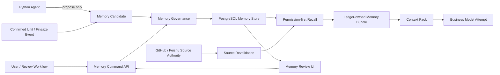
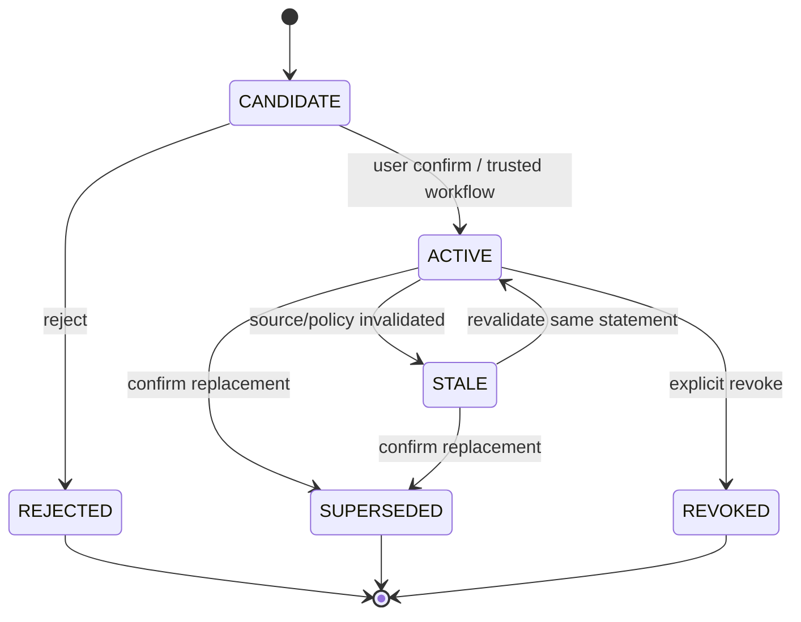
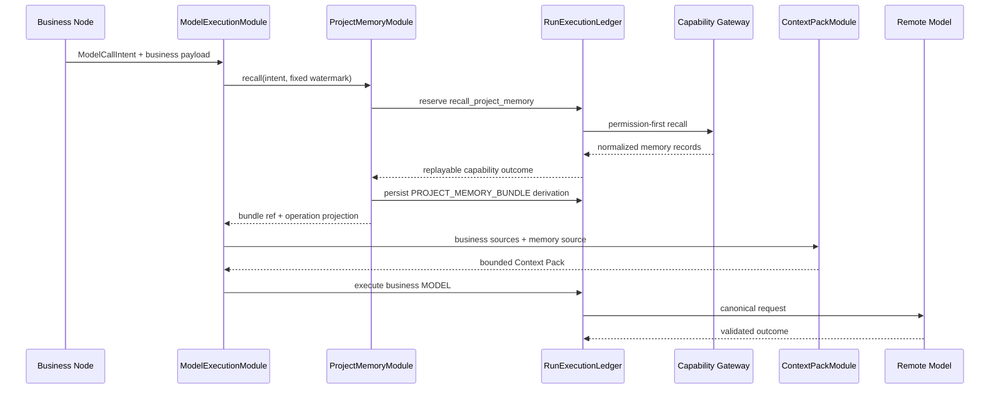

# PRD Agent 项目记忆工具设计方案

> 状态：Draft
> 日期：2026-08-03
> 适用范围：当前 Go Control Plane、Python Agent Runtime、Capability Gateway、Context Pack 与历史 PRD/RAG 架构
> 目标版本：`project-memory.v1`

## 1. 摘要

项目记忆工具用于保存和检索跨 PRD Task、跨 Agent Run 仍然有效的项目级信息，例如用户确认的
领域术语、稳定约束、目标决策、工作方式和开放问题。它不是聊天记录仓库，也不是把模型摘要保存
进向量数据库后自动注入 Prompt。

推荐实现为一套由 Go/PostgreSQL 持有权威状态、Python Agent 只读召回并产生候选、用户负责确认
长期写入的能力：

1. 新增明确的 `Memory Space`，用 `tenant_id + owner_id + space_id` 隔离项目记忆；
2. 每条记忆采用不可变版本、明确类型、来源、有效期和状态；
3. Agent 只能创建 `CANDIDATE`，不能直接创建 `ACTIVE` 长期记忆；
4. 用户确认、确定性工作流事件或受信来源校验后，记忆才能激活；
5. 每个 Agent Run 固定一个 Memory Watermark，运行中不读取水位之后的新记忆；
6. 召回先做权限和状态过滤，再做关键词/标签排序，最后形成 Ledger-owned Memory Bundle；
7. Memory Bundle 作为 Context Source 进入现有 Context Pack，不直接修改 LangGraph 权威状态；
8. 当前代码事实继续由固定 Git commit 证明，历史 PRD 正文继续由 Feishu 持有；项目记忆只保存
   小型结构化陈述、引用和来源定位；
9. 初期不引入 Mem0、LangMem 或通用“自主记忆”框架，优先复用现有 PostgreSQL、Ledger、
   Evidence/Knowledge 和 Context Pack 合同。

这套方案的核心不是“记住更多”，而是让系统只记住经过治理、仍然有效、能说明来源且允许用户
撤销的信息。

---

## 2. 当前代码背景

### 2.1 已有能力

当前项目已经具备以下基础：

- Go/PostgreSQL 是 Task、Run、版本、租约、幂等、Artifact 和 rollout 的控制面权威；
- GitHub 拥有仓库正文，Feishu 拥有已发布 PRD 正文；
- `EvidenceKnowledgeModule` 在单次 Run 内构建 `Evidence / Fact / Unknown / Conflict`；
- `KnowledgeBundle` 是 Run-scoped Artifact，不是长期 Fact Store；
- `RunExecutionLedger` 对模型调用、Capability 和本地派生提供幂等与崩溃恢复；
- Context Pack 对每次模型调用构造有界、版本化的 operation view；
- 历史 PRD 检索已经有 owner/project/access label 前置过滤、固定语料版本和关键词/混合召回思路；
- Confirmation Unit 和 Published PRD 已提供用户确认过的高质量候选来源。

### 2.2 当前缺口

当前还没有真正的项目记忆层：

- `KnowledgeBundle` 只在一个 Agent Run 内有效；
- 新 Run 不会继承过去确认的术语、决策、约束和开放问题；
- Go `Task`、`AgentRunInput` 和 Python `RunContext` 没有稳定的 `memory_space_id`；
- 历史 PRD 的 `project_id` 仍主要存在于旧 Python RAG 路径，没有成为 Go 控制面的统一项目身份；
- Context Pack 能压缩已有上下文，但不能主动召回跨 Run 信息；
- 没有候选、确认、撤销、过期、冲突和遗忘工作流；
- 没有运行固定 Memory Watermark，运行中读到变化的长期记忆会破坏可重放性。

### 2.3 必须保持的现有决策

本方案必须遵守现有 ADR：

- 不在 PostgreSQL 无限复制 GitHub/Feishu 正文；
- 生产只使用远端模型，不增加本地模型服务；
- Redis 不成为记忆权威；
- 记忆检索结果不自动成为 `VerifiedFact`；
- 历史信息不能冒充当前代码状态；
- 模型或 MCP 客户端不能绕过租户、owner、项目和来源权限。

---

## 3. 目标与非目标

### 3.1 目标

1. 在同一项目的不同 Task/Run 间复用稳定知识；
2. 保存用户确认的项目决策、约束、术语、偏好和开放问题；
3. 每条记忆具有来源、版本、状态、有效期和审计轨迹；
4. Agent 读取记忆时具备稳定水位、幂等、预算和崩溃恢复；
5. 项目记忆能作为 Context Pack 来源，并受 operation-aware 选择和 token 限制；
6. 记忆与当前代码、历史 PRD、用户输入冲突时显式产生 Conflict；
7. 用户可以查看、确认、编辑、废弃、撤销和删除记忆；
8. 记忆召回能通过 Eval 证明对 PRD 完整度和一致性有收益，同时不降低 Grounding；
9. 适配当前 2 vCPU / 2GB 的小规模生产部署。

### 3.2 非目标

- 不保存完整聊天历史；
- 不保存 Chain-of-Thought、隐藏推理或 Provider 原始 Prompt；
- 不把模型生成摘要自动标记为事实；
- 不建立第二套 GitHub 或 Feishu 内容权威；
- 不做跨 owner 的组织级共享记忆；
- 不做用户画像、情绪分析或隐式个人偏好推断；
- 不让模型直接调用确认、撤销或删除接口；
- v1 不依赖向量数据库或外部长期记忆 SaaS；
- 不用项目记忆替代 Evidence、Fact Grounding、Unknown 或 Conflict。

---

## 4. 领域术语

### 4.1 Memory Space

一个隔离的项目记忆命名空间。它绑定 `tenant_id`、`owner_id` 和稳定 `space_id`，并维护单调递增
的 `memory_epoch`。

### 4.2 Memory Record

一条稳定身份的项目记忆，例如“订单状态使用 `paid`，不使用 `completed`”。Record 本身只表示
逻辑身份，正文和状态由不可变 Memory Version 承载。

### 4.3 Memory Version

Memory Record 的不可变版本。包含规范化陈述、类型、权威等级、状态、来源引用、有效期和
content hash。

### 4.4 Memory Candidate

尚未进入长期有效集合的候选记忆。它可以由 Agent、用户操作或确定性工作流产生，但默认必须经过
治理才能成为 `ACTIVE`。

### 4.5 Memory Watermark

Agent Run 启动时固定的 `memory_epoch`。该 Run 只能读取 `committed_epoch <= watermark` 的版本，
保证同一 Run 重放时记忆集合不漂移。

### 4.6 Memory Bundle

针对一次 Information Need 或模型 operation，从固定 Memory Watermark 中召回并验证后形成的
有界派生 Artifact。它不是长期权威，只是一次运行的只读投影。

### 4.7 Memory Conflict

相同 scope、subject、predicate 下存在互斥的 ACTIVE/CANDIDATE 陈述，或者长期记忆与当前受信
来源发生冲突。Conflict 不能通过排序自动选择一侧。

---

## 5. 记忆与现有对象的边界

| 对象 | 生命周期 | 权威 | 是否直接进入模型 | 作用 |
| --- | --- | --- | --- | --- |
| GitHub Repository Snapshot | 固定 commit | GitHub | 通过 Evidence/Context Pack | 当前代码事实 |
| Feishu PRD Source Revision | 固定 revision | Feishu | 通过 Retrieval/Evidence | 历史需求上下文 |
| Evidence | Run 内或有界保留 | 来源定位 | 经 Knowledge 验证后 | 支持 Fact |
| Knowledge Bundle | 单次 Run | Run Artifact | 是 | Fact/Unknown/Conflict 投影 |
| Project Memory | 跨 Run | Go/PostgreSQL 治理状态 | 不直接；先形成 Bundle | 稳定决策、约束和术语 |
| Context Pack | 单次 Model Attempt | Ledger Artifact | 是 | 有界模型视图 |
| Working Draft | 活跃 Task/Run | 工作流版本 | 是 | 待确认 PRD 内容 |
| Published PRD | 长期 | Feishu | 通过历史检索 | 已发布正文 |

关键原则：

```text
Memory Record ≠ VerifiedFact
Memory Bundle ≠ Context Pack
Historical PRD ≠ Project Memory
Model Summary ≠ Active Memory
```

项目记忆可以表达用户已经确认的目标决策，但它若声称“当前系统已经如此实现”，仍必须通过当前
Repository Snapshot 重新验证。

---

## 6. 总体架构



职责分配：

- Go Control Plane：Memory Space、Record/Version、Candidate、Conflict、权限、命令幂等、Watermark；
- PostgreSQL：权威持久化、FTS、版本和审计；
- Python Agent：召回意图、结果验证、Memory Bundle、候选生成；
- Capability Gateway：Agent 的只读记忆访问边界；
- Web：候选确认、编辑、撤销、冲突处理和来源展示；
- Context Pack：决定一次模型操作实际看到哪些记忆；
- MCP Server：为外部受控 Agent 暴露同一读/候选写能力，不成为第二套实现。

### 6.1 存储形态选择

| 方案 | 优点 | 问题 | 本方案定位 |
| --- | --- | --- | --- |
| `CONTEXT.md` / ADR / Git 文件 | 人可审查、版本清晰、适合工程规则 | 不适合运行时用户确认、撤销和 owner 隔离 | 继续作为高权威来源 |
| PostgreSQL governed records | 事务、权限、版本、水位、审计完整 | 需要领域模型和 UI | Active Memory 权威 |
| 通用向量库 | 模糊召回方便 | 不解决权限、状态、冲突和确认 | v1 不使用；未来仅作索引 |
| Agent 进程内字典/缓存 | 实现简单 | 不可恢复、不可共享、不可审计 | 禁止成为权威 |
| 外部 Memory SaaS | 快速实验 | 数据边界和幂等不受当前控制面约束 | 仅允许实验 Adapter |

当前仓库的 `CONTEXT.md`、`docs/adr/` 和已确认设计文档可以成为 Candidate 的受信来源，但记忆中
只保存短陈述和 Git locator/hash。它们仍由 Git 拥有，不能整份复制成 Active Memory 正文。

---

## 7. 记忆分类

### 7.1 v1 支持的类型

| 类型 | 示例 | 默认权威 | 默认有效期 | 可否自动激活 |
| --- | --- | --- | --- | --- |
| `DOMAIN_TERM` | “履约单”指创建后的仓内执行单 | USER_CONFIRMED | 长期 | 仅显式用户确认事件 |
| `PROJECT_DECISION` | 支付成功状态统一为 `paid` | USER_CONFIRMED | 至撤销/替代 | 仅确认事件 |
| `PROJECT_CONSTRAINT` | 禁止在客户端保存支付密钥 | USER_CONFIRMED / SOURCE_VERIFIED | 至来源变化 | 受信确定性来源可激活 |
| `WORKFLOW_PREFERENCE` | PRD 验收标准使用 Given/When/Then | USER_CONFIRMED | 至撤销 | 仅用户确认 |
| `ACCEPTANCE_PATTERN` | 新筛选项必须覆盖空值和时区 | USER_CONFIRMED | 至撤销 | 仅用户确认 |
| `SOURCE_POINTER` | 订单状态定义位于 OpenAPI schema locator | SOURCE_VERIFIED | 至 source revision 变化 | 可自动激活 |
| `OPEN_QUESTION` | 是否允许部分退款仍待业务确认 | USER_CONFIRMED / DERIVED | 有界 | 用户确认后激活 |
| `RISK_NOTE` | 旧客户端仍依赖 completed | USER_CONFIRMED / SOURCE_VERIFIED | 有界 | 需要来源或确认 |

### 7.2 v1 明确拒绝的内容

- API key、OAuth token、Cookie、Authorization header；
- 完整代码文件、完整 PRD、完整会议转录；
- “用户可能喜欢……”一类隐式画像；
- 未定位来源的模型知识；
- Chain-of-Thought 或隐藏推理；
- 临时调试信息和一次性命令输出；
- 当前代码行为的长期副本；
- 无项目范围的全局偏好；
- 仅因为多次出现就自动认定正确的内容。

### 7.3 Authority Class

```text
USER_CONFIRMED
SOURCE_VERIFIED
WORKFLOW_CONFIRMED
DERIVED_PROPOSAL
```

优先级并不意味着真实性覆盖：

- `USER_CONFIRMED` 可以定义目标决策，但不能证明当前代码状态；
- `SOURCE_VERIFIED` 必须绑定 source kind、binding、revision、locator 和 hash；
- `WORKFLOW_CONFIRMED` 来自 Confirmation Unit/Finalize 等显式状态机事件；
- `DERIVED_PROPOSAL` 永远只能进入 Candidate。

---

## 8. 生命周期与治理状态机



规则：

1. Model-assisted extraction只能创建 `CANDIDATE`；
2. 用户编辑 Candidate 后会产生新 Candidate Version，不覆盖原始候选；
3. 激活新版本时，Record head 原子指向新 Version；旧 Version 保持不可变，仅作为历史存在；
4. 来源 revision 改变不会自动删除记忆，而是标记 `STALE`；
5. `REVOKED` 表示明确不再适用，默认召回禁止返回；
6. 物理删除只用于合规删除或敏感内容事故，普通“忘记”使用 tombstone；
7. 所有状态变更增加 Memory Space 的 `memory_epoch`；
8. 已运行的 Agent Run 仍读取固定 Watermark，不受后续状态变化影响。

---

## 9. 数据合同

### 9.1 `project-memory-record.v1`

```json
{
  "schema_version": "project-memory-record.v1",
  "memory_id": "memory-...",
  "space_id": "memory-space-commerce",
  "version": 3,
  "memory_type": "PROJECT_DECISION",
  "subject": "order.payment_status",
  "predicate": "canonical_value",
  "value": "paid",
  "statement": "支付成功状态统一使用 paid。",
  "authority_class": "USER_CONFIRMED",
  "status": "ACTIVE",
  "validity": {
    "valid_from": "2026-08-03T10:00:00Z",
    "valid_until": null,
    "source_revision_set_hash": "sha256:..."
  },
  "source_refs": [
    {
      "source_kind": "CONFIRMATION_UNIT",
      "binding_id": "",
      "source_id": "unit-payment",
      "source_version": "2",
      "locator": "confirmation-unit://task-1/unit-payment/2",
      "content_hash": "sha256:...",
      "access_scope_hash": "sha256:..."
    }
  ],
  "tags": ["order", "payment"],
  "sensitivity": "INTERNAL",
  "created_by_kind": "USER_COMMAND",
  "created_by_ref": "command-...",
  "committed_epoch": 42,
  "content_hash": "sha256:..."
}
```

约束：

- `subject + predicate` 必须是有界规范化字段；
- `statement` 最大 2 KiB，`value` 最大 4 KiB；
- `source_refs` 最大 20 条，不保存大段来源正文；
- `content_hash` 基于除审计时间外的 canonical JSON；
- Secret scanner 在 Candidate 和 Active 两次校验；
- `SOURCE_VERIFIED` 至少需要一个可重新验证的 source ref；
- `DERIVED_PROPOSAL` 不能出现在 ACTIVE Version。

### 9.2 `project-memory-candidate.v1`

```json
{
  "schema_version": "project-memory-candidate.v1",
  "candidate_id": "memory-candidate-...",
  "space_id": "memory-space-commerce",
  "proposed_record": {},
  "reason_code": "CONFIRMED_UNIT_DECISION_EXTRACTED",
  "supporting_refs": ["confirmation-unit://..."],
  "proposed_by_run_id": "run-...",
  "extractor_version": "project-memory-extractor.v1",
  "request_hash": "sha256:...",
  "status": "PENDING_REVIEW"
}
```

### 9.3 `project-memory-bundle.v1`

```json
{
  "schema_version": "project-memory-bundle.v1",
  "bundle_id": "memory-bundle-...",
  "run_id": "run-...",
  "task_id": "task-...",
  "space_id": "memory-space-commerce",
  "memory_watermark": 42,
  "query": {
    "operation": "generate_unit",
    "need_kind": "STATE_OR_RULE_CHANGE",
    "terms": ["payment", "status"],
    "memory_types": ["PROJECT_DECISION", "PROJECT_CONSTRAINT", "OPEN_QUESTION"]
  },
  "records": [],
  "conflict_ids": [],
  "excluded": [
    {"memory_id": "memory-old", "reason": "SUPERSEDED"}
  ],
  "token_accounting": {
    "estimated_tokens_before": 1200,
    "estimated_tokens_after": 540,
    "max_records": 12,
    "target_tokens": 800
  },
  "policy_version": "project-memory-policy.v1",
  "source_set_hash": "sha256:...",
  "content_hash": "sha256:..."
}
```

Memory Bundle 只包含小型陈述和 source refs。需要原文时必须通过已有 GitHub/Feishu Capability 重新
获取，并产生新的 Evidence。

---

## 10. PostgreSQL 持久化设计

### 10.1 Memory Space

```sql
CREATE TABLE go_memory_spaces (
    space_id TEXT PRIMARY KEY,
    tenant_id TEXT NOT NULL,
    owner_id TEXT NOT NULL,
    project_key TEXT NOT NULL,
    display_name TEXT NOT NULL,
    status TEXT NOT NULL CHECK (status IN ('ACTIVE','ARCHIVED')),
    memory_epoch BIGINT NOT NULL DEFAULT 0 CHECK (memory_epoch >= 0),
    policy_version TEXT NOT NULL,
    created_at TIMESTAMPTZ NOT NULL,
    updated_at TIMESTAMPTZ NOT NULL,
    UNIQUE (tenant_id, owner_id, project_key)
);
```

v1 只支持 owner-private Memory Space。未来增加成员共享时必须新增成员/角色表，不允许仅凭
`space_id` 访问。

Task 通过独立绑定表选择 Memory Space，避免把项目身份继续隐含在某个 Repository Binding 中：

```sql
CREATE TABLE go_task_memory_bindings (
    task_id TEXT PRIMARY KEY REFERENCES go_control_tasks(task_id),
    space_id TEXT NOT NULL REFERENCES go_memory_spaces(space_id),
    bound_by TEXT NOT NULL,
    bound_at TIMESTAMPTZ NOT NULL
);
```

Task 创建时校验 Task 与 Space 的 `tenant_id/owner_id` 完全一致。Run Assignment 从该绑定复制
固定 Watermark；不能由 Worker 根据当前请求临时选择 Space。

### 10.2 Record 与不可变 Version

```sql
CREATE TABLE go_project_memory_records (
    memory_id TEXT PRIMARY KEY,
    space_id TEXT NOT NULL REFERENCES go_memory_spaces(space_id),
    semantic_key TEXT NOT NULL,
    current_version BIGINT NOT NULL CHECK (current_version > 0),
    current_status TEXT NOT NULL CHECK (
        current_status IN ('ACTIVE','SUPERSEDED','REVOKED','STALE')
    ),
    created_at TIMESTAMPTZ NOT NULL,
    updated_at TIMESTAMPTZ NOT NULL,
    UNIQUE (space_id, memory_id)
);

CREATE TABLE go_project_memory_versions (
    memory_id TEXT NOT NULL REFERENCES go_project_memory_records(memory_id),
    version BIGINT NOT NULL CHECK (version > 0),
    space_id TEXT NOT NULL REFERENCES go_memory_spaces(space_id),
    memory_type TEXT NOT NULL CHECK (memory_type IN (
        'DOMAIN_TERM','PROJECT_DECISION','PROJECT_CONSTRAINT',
        'WORKFLOW_PREFERENCE','ACCEPTANCE_PATTERN','SOURCE_POINTER',
        'OPEN_QUESTION','RISK_NOTE'
    )),
    subject TEXT NOT NULL,
    predicate TEXT NOT NULL,
    value_json JSONB NOT NULL,
    statement TEXT NOT NULL,
    authority_class TEXT NOT NULL CHECK (authority_class IN (
        'USER_CONFIRMED','SOURCE_VERIFIED','WORKFLOW_CONFIRMED','DERIVED_PROPOSAL'
    )),
    status_at_commit TEXT NOT NULL CHECK (status_at_commit IN (
        'ACTIVE','SUPERSEDED','REVOKED','STALE'
    )),
    tags TEXT[] NOT NULL DEFAULT '{}',
    sensitivity TEXT NOT NULL CHECK (sensitivity IN ('INTERNAL','RESTRICTED')),
    source_revision_set_hash TEXT NOT NULL,
    valid_from TIMESTAMPTZ NOT NULL,
    valid_until TIMESTAMPTZ,
    committed_epoch BIGINT NOT NULL,
    content_hash TEXT NOT NULL,
    created_by_kind TEXT NOT NULL,
    created_by_ref TEXT NOT NULL,
    created_at TIMESTAMPTZ NOT NULL,
    PRIMARY KEY (memory_id, version),
    UNIQUE (space_id, committed_epoch, memory_id)
);
```

Version 永不更新。编辑、撤销、过期或 supersede 都追加一个新 Version，再更新 Record 的
`current_version/current_status`。Record head、Space epoch 和审计事件必须在一个事务完成。

### 10.3 Source Ref、Candidate、Conflict 与事件

```sql
CREATE TABLE go_project_memory_source_refs (
    memory_id TEXT NOT NULL,
    memory_version BIGINT NOT NULL,
    ordinal INTEGER NOT NULL,
    source_kind TEXT NOT NULL,
    binding_id TEXT NOT NULL,
    source_id TEXT NOT NULL,
    source_version TEXT NOT NULL,
    locator TEXT NOT NULL,
    content_hash TEXT NOT NULL,
    access_scope_hash TEXT NOT NULL,
    PRIMARY KEY (memory_id, memory_version, ordinal),
    FOREIGN KEY (memory_id, memory_version)
        REFERENCES go_project_memory_versions(memory_id, version)
);

CREATE TABLE go_project_memory_candidates (
    candidate_id TEXT PRIMARY KEY,
    space_id TEXT NOT NULL REFERENCES go_memory_spaces(space_id),
    request_hash TEXT NOT NULL,
    candidate_json JSONB NOT NULL,
    status TEXT NOT NULL CHECK (status IN (
        'PENDING_REVIEW','CONFIRMED','REJECTED','EXPIRED'
    )),
    proposed_by_run_id TEXT,
    extractor_version TEXT NOT NULL,
    created_at TIMESTAMPTZ NOT NULL,
    reviewed_at TIMESTAMPTZ,
    reviewed_by TEXT,
    UNIQUE (space_id, request_hash)
);

CREATE TABLE go_project_memory_conflicts (
    conflict_id TEXT PRIMARY KEY,
    space_id TEXT NOT NULL REFERENCES go_memory_spaces(space_id),
    subject TEXT NOT NULL,
    predicate TEXT NOT NULL,
    memory_ids TEXT[] NOT NULL,
    status TEXT NOT NULL CHECK (status IN ('OPEN','RESOLVED','DISMISSED')),
    resolution_memory_id TEXT,
    created_at TIMESTAMPTZ NOT NULL,
    resolved_at TIMESTAMPTZ
);

CREATE TABLE go_project_memory_events (
    event_id TEXT PRIMARY KEY,
    space_id TEXT NOT NULL,
    memory_epoch BIGINT NOT NULL,
    event_type TEXT NOT NULL,
    actor_kind TEXT NOT NULL,
    actor_ref TEXT NOT NULL,
    request_hash TEXT NOT NULL,
    payload_json JSONB NOT NULL,
    occurred_at TIMESTAMPTZ NOT NULL,
    UNIQUE (space_id, memory_epoch)
);
```

### 10.4 Run 固定分配

```sql
CREATE TABLE go_run_memory_assignments (
    run_id TEXT PRIMARY KEY REFERENCES go_agent_runs(run_id),
    space_id TEXT NOT NULL REFERENCES go_memory_spaces(space_id),
    memory_watermark BIGINT NOT NULL,
    policy_version TEXT NOT NULL,
    access_scope_hash TEXT NOT NULL,
    assignment_hash TEXT NOT NULL,
    created_at TIMESTAMPTZ NOT NULL
);
```

Run 创建/派发前原子固定 assignment。恢复时读取同一记录，禁止从当前 Space head 重新计算。

### 10.5 检索索引

v1 使用 PostgreSQL FTS 和标签索引：

```sql
CREATE INDEX ix_project_memory_scope_status
    ON go_project_memory_records(space_id, current_status, updated_at DESC);

CREATE INDEX ix_project_memory_semantic_key
    ON go_project_memory_records(space_id, semantic_key);

CREATE INDEX ix_project_memory_tags
    ON go_project_memory_versions USING GIN(tags);

CREATE INDEX ix_project_memory_fts
    ON go_project_memory_versions
    USING GIN(to_tsvector('simple', subject || ' ' || predicate || ' ' || statement));
```

不在 v1 把 embedding 写入主 Version 表。若 Remote Eval 证明 FTS recall 不足，再增加独立的、可重建
embedding projection；embedding 不能决定权限、状态或权威。

---

## 11. 写入流程

### 11.1 候选来源

允许产生 Candidate 的事件：

- 用户在 Memory UI 中显式创建；
- Confirmation Unit 被确认；
- PRD Finalize 成功；
- Reopen/Revision 显式推翻旧决策；
- 受信 Parser 对固定 source revision 产生小型稳定 pointer/constraint；
- Agent 在完成 Run 后提出候选。

这些触发点应实现为已提交领域事件的消费者，例如 `ConfirmationUnitConfirmed`、
`DocumentFinalized`、`UnitReopened` 和 `SourceRevisionChanged`，通过现有 Outbox 投递。它们是可重放、
有幂等 key 的 Memory Capture Hook，不是 Worker 进程内 callback，也不是允许任意 shell 执行的 Hook。

以下事件不能产生长期 Candidate：

- 任意一次模型回复；
- 未 Ground 的 Working Draft Claim；
- 普通搜索命中；
- Empty retrieval；
- MCP 客户端自由文本写入；
- Provider 错误或临时工具输出。

### 11.2 Agent 候选生成

Agent 候选生成是单独的 Ledger-backed Model Attempt：

```text
finalized/confirmed structured source
→ deterministic candidate preselection
→ model extracts bounded candidate JSON
→ no-new-ID / source-ref / secret / size validator
→ MEMORY_CANDIDATE Artifact
→ Go command persists PENDING_REVIEW candidate
```

模型只接收已确认的结构化内容，不接收整个聊天记录。输出不得自行声明
`USER_CONFIRMED` 或 `SOURCE_VERIFIED`。

### 11.3 激活流程

```text
GET pending candidate
→ user inspect statement + provenance + conflicts
→ optional edit creates new candidate version
→ POST confirm(expected_candidate_hash, idempotency_key)
→ transaction locks Memory Space
→ duplicate/conflict check
→ increment memory_epoch
→ append immutable ACTIVE version
→ update record head; append lifecycle version to superseded record when applicable
→ append audit event + outbox
```

### 11.4 去重与冲突

确定性 identity：

```text
semantic_key = sha256(space_id, memory_type, normalized_subject, normalized_predicate)
content_key  = sha256(semantic_key, canonical_value, normalized_statement)
```

- 相同 `content_key`：幂等复用；
- 相同 semantic key、不同 value：创建 OPEN Conflict；
- 新记录明确声明 `supersedes_memory_id`：确认时原子替代；
- 不允许模型通过相似度自动合并冲突；
- OPEN Conflict 涉及的记忆召回时必须成组返回或全部排除，不能只返回排名最高的一侧。

---

## 12. 召回流程

### 12.1 触发策略

不是每次模型调用都盲目召回项目记忆。以下操作默认触发：

- `plan_information_need`：只召回术语、约束、开放问题的轻量 metadata；
- `plan_outline`：召回领域术语、稳定范围约束和相关项目决策；
- `generate_unit`：召回当前 Unit 主题、依赖 Unit、相关决策/约束/开放问题；
- `revise_unit`：额外召回被替代决策、Reopen 原因和冲突；
- `select_investigation_action`：只召回 source pointer 和待解决 Open Question；
- `generate_working_draft`：召回与 Coverage 和已 Ground Facts 相关的记忆；
- `repair_working_draft`：默认复用已有 Bundle，不重新扩大召回；
- `FULL_REVIEW`：当前为确定性检查，不触发模型记忆召回。

### 12.2 Permission-first 查询

查询顺序必须是：

```text
validate lease/run assignment
→ bind tenant/owner/space/access hash from server state
→ filter committed_epoch <= watermark
→ filter ACTIVE and validity window
→ filter allowed memory types/sensitivity
→ FTS/tag/exact match ranking
→ source freshness check
→ conflict expansion
→ token-aware selection
→ build Memory Bundle
```

禁止先做全库向量召回、再在应用层删除越权结果。

### 12.3 排序

v1 使用可解释评分：

```text
score =
    exact_subject_match * 100
  + active_unit_tag_match * 40
  + need_kind_match * 30
  + fts_rank * 20
  + authority_weight
  + recency_bucket
  - stale_penalty
  - duplicate_penalty
```

排序最后使用 `memory_id` 作为稳定 tie-breaker。权重属于
`project-memory-policy.v1`，任何调整必须进入 request hash 和 Eval。

### 12.4 必保与可选内容

P0 必保：

- 与当前 Unit semantic key 精确匹配的用户确认决策；
- 当前开放 Conflict 的双方；
- Reopen 明确引用的记忆；
- 当前操作直接依赖的项目约束；
- 仍有效的 Critical Open Question。

P1 优先：

- 领域术语；
- source pointer；
- 验收模式；
- 相关风险。

P2 可裁剪：

- 较旧但仍 ACTIVE 的同类提示；
- 低相关偏好；
- 仅用于解释历史演变的 superseded refs。

若 P0 本身超过 Memory Bundle hard limit，必须返回
`MEMORY_CONTEXT_UNSATISFIABLE`，不能静默删除决策或冲突。

---

## 13. Agent Loop 与 Context Pack 接线

### 13.1 Run 启动

`AgentRunInput` 和 Python `RunContext` 增加：

```text
memory_space_id
memory_watermark
memory_policy_version
memory_access_scope_hash
memory_assignment_hash
```

ResumeValidator 校验这些字段与 Checkpoint/Ledger identity 一致。

### 13.2 统一调用链



### 13.3 Ledger Operation Key

```text
capability:recall_project_memory:<operation>:sequence<n>
context:build_memory_bundle:<operation>:sequence<n>
context:build:<operation>:sequence<n>
model:<operation>:sequence<n>
```

Memory recall request hash 必须绑定：

```text
run_id
task_id
space_id
memory_watermark
memory_access_scope_hash
memory_policy_version
operation
need/context query
allowed memory types
target token budget
```

### 13.4 Context Pack 集成

Memory Bundle 在 Context Pack 中表现为新的 Source：

```json
{
  "source_kind": "PROJECT_MEMORY_BUNDLE",
  "source_ref": "memory-bundle:...",
  "content_hash": "sha256:...",
  "trust_class": "GOVERNED_MEMORY",
  "required": false,
  "priority": 1
}
```

Operation View 只放必要记录：

```json
{
  "project_memory": {
    "bundle_id": "memory-bundle-...",
    "watermark": 42,
    "decisions": [
      {
        "memory_id": "memory-...",
        "statement": "支付成功状态统一使用 paid。",
        "authority_class": "USER_CONFIRMED",
        "source_refs": ["confirmation-unit://..."]
      }
    ],
    "open_questions": [],
    "conflicts": []
  }
}
```

模型输出若引用记忆，必须输出 `memory_id`。Grounding 根据记忆类型判断用途：

- PROJECT_DECISION 可以支持 `TARGET_DECISION` Claim；
- PROJECT_CONSTRAINT 可以支持目标约束；
- SOURCE_POINTER 只能指导调查，不能直接支持正文 Claim；
- HISTORICAL/STALE 记忆不能支持 `CURRENT_STATE`；
- OPEN Conflict 阻止确定性结论。

### 13.5 不增加通用 MessagesState

当前 AgentState 不是聊天消息列表，项目记忆也不应通过 LangGraph `MessagesState` 注入。推荐只增加
identity 字段：

```python
memory_space_id: str
memory_watermark: int
memory_bundle_id: str
memory_bundle_artifact_key: str
memory_bundle_artifact_hash: str
memory_policy_version: str
memory_recall_count: int
memory_record_count: int
memory_conflict_count: int
```

正文仍在 Memory Bundle Artifact，Snapshot 只保存 identity 和计数。

---

## 14. Tool、Capability 与 MCP 接口

### 14.1 Python 内部 Interface

```python
class ProjectMemoryModule:
    def recall(
        self,
        context: RunContext,
        intent: MemoryRecallIntent,
        ledger: RunExecutionLedger,
    ) -> MemoryBundle: ...

    def propose(
        self,
        context: RunContext,
        source: ConfirmedMemorySource,
        ledger: RunExecutionLedger,
    ) -> tuple[MemoryCandidate, ...]: ...
```

`recall` 是运行内只读能力；`propose` 只生成 Artifact/Candidate，不激活记忆。

模型辅助 Candidate 如果在 Agent Run 内生成，应通过受 Lease/Fencing 保护的
`AgentExecutionService.SubmitMemoryCandidates` 提交。请求只接受已持久化
`MEMORY_CANDIDATE` Artifact 的 identity、candidate hash 和 source refs，Go 重新校验后只写
`PENDING_REVIEW`。确定性 Confirmation/Finalize Capture Hook 则由 Go Outbox consumer 直接创建
Candidate，不依赖仍然存活的 Agent lease。

### 14.2 Capability Gateway

新增只读 RPC：

```proto
rpc SearchProjectMemory(SearchProjectMemoryRequest)
    returns (SearchProjectMemoryResponse);
rpc GetProjectMemoryRecords(GetProjectMemoryRecordsRequest)
    returns (GetProjectMemoryRecordsResponse);
```

Request 不允许由 Agent 自由传 `owner_id`。Gateway 从 Lease 对应的 Run Memory Assignment 中获得
scope 和 watermark。

建议响应只包含已过滤、已验证的小型记录，不返回内部审计信息和其他 owner 的存在性信号。

### 14.3 HTTP Command API

用户侧接口：

```text
GET    /v1/memory-spaces/{space_id}/records
GET    /v1/memory-spaces/{space_id}/candidates
POST   /v1/memory-spaces/{space_id}/candidates
POST   /v1/memory-spaces/{space_id}/candidates/{candidate_id}:confirm
POST   /v1/memory-spaces/{space_id}/candidates/{candidate_id}:reject
POST   /v1/memory-spaces/{space_id}/records/{memory_id}:supersede
POST   /v1/memory-spaces/{space_id}/records/{memory_id}:revoke
GET    /v1/memory-spaces/{space_id}/conflicts
POST   /v1/memory-spaces/{space_id}/conflicts/{conflict_id}:resolve
```

所有 mutation 都要求：

- authenticated owner；
- `Idempotency-Key`；
- expected candidate/record version；
- canonical request hash；
- audit actor；
- CSRF/Origin 保护沿用现有 Web 安全边界。

### 14.4 MCP Server

若需要让其他受控 Agent 使用项目记忆，MCP 只作为同一 Go Service 的适配层：

```text
project_memory.search       # 只读
project_memory.get          # 只读
project_memory.propose      # 只创建 Candidate
project_memory.list_conflicts # 只读
```

不向模型暴露：

```text
confirm
revoke
delete
resolve_conflict
change_scope
```

MCP 安全要求：

- 身份来自受信连接/session，不来自 tool arguments；
- server 侧强制绑定 Memory Space；
- `propose` 返回 `PENDING_REVIEW`，不得返回“已记住”；
- 每个结果带 `memory_id/version/status/source_refs`；
- Resource URI 使用 `prd-memory://spaces/<space>/records/<id>@<version>`；
- 对 Prompt injection 文本按数据处理，不执行记忆 statement 中的指令；
- MCP Server 不缓存跨 owner 的结果。

---

## 15. 来源重验证与过期

### 15.1 Source-verified Memory

召回 SOURCE_VERIFIED 记录时检查：

- binding 仍属于当前 owner/space；
- access scope hash 未变化；
- source version 与记录一致；
- locator 仍有效；
- content hash 一致。

若来源变化：

```text
do not return as ACTIVE
→ emit stale observation
→ enqueue bounded revalidation
→ create new Candidate or mark STALE
```

### 15.2 User-confirmed Decision

用户确认的目标决策不因代码尚未实现而变成 STALE，但必须保持 scope：

- 可支持 TARGET_DECISION；
- 不可支持 CURRENT_STATE；
- 当前代码与目标决策不一致时产生 implementation gap，而不是覆盖记忆。

### 15.3 Open Question

Open Question 必须有明确 resolution：

- 用户回答后创建 Decision/Constraint，并 supersede Open Question；
- 新 Evidence 回答后先创建 Candidate，不自动关闭；
- 超过 retention 只标记 `STALE_OPEN_QUESTION`，不推断答案。

---

## 16. 幂等、恢复和一致性

### 16.1 固定水位

Run 创建时：

```text
SELECT memory_epoch FROM go_memory_spaces FOR SHARE
→ create go_run_memory_assignments
→ assignment_hash = sha256(space, epoch, policy, access scope)
```

同一 Run 的所有 recall 都使用同一 epoch。用户在运行中确认的新记忆只对新 Run 可见。

### 16.2 崩溃矩阵

| 崩溃点 | 恢复行为 |
| --- | --- |
| Recall Ledger RESERVED 后 | 使用相同 operation key 继续 |
| Capability CALL_STARTED、无 Outcome | `OUTCOME_UNKNOWN`，禁止猜测重试 |
| Recall Outcome Artifact 已保存 | durable-ahead 完成并重放 |
| Memory Bundle 已保存、Context Pack 前 | 重放相同 Bundle |
| Context Pack 已保存、业务模型前 | 使用同一 Pack hash |
| Candidate Artifact 已保存、Go command 前 | 使用 candidate request hash 幂等提交 |
| Candidate confirm 事务中断 | PostgreSQL 全部提交或全部回滚 |
| Space epoch 已增、event 未发送 | Outbox 重发，不回滚状态 |

### 16.3 Resume 校验

恢复必须验证：

- Run Memory Assignment 仍存在；
- assignment hash 与 RunContext/Checkpoint 一致；
- Ledger-owned Memory Bundle Artifact hash 正确；
- Bundle watermark 不大于固定 watermark；
- Bundle space/access scope 与 Run 一致；
- Snapshot 不引用 Ledger 和 required artifacts 之外的 Bundle；
- 不同 policy/source/query 不能复用相同 operation key。

---

## 17. 安全、隐私与数据治理

### 17.1 隔离

所有 SQL 查询必须包含：

```text
tenant_id
owner_id
space_id
memory_watermark
access_scope_hash where applicable
```

v1 不支持 owner 之间共享。未来增加项目成员时必须引入明确 ACL 和 access scope version，不能直接
放宽 owner 条件。

### 17.2 Secret 和敏感数据

Candidate 与 Active 写入前执行：

- key/token/password pattern scanner；
- Authorization/Cookie/header 检测；
- private key/connection string 检测；
- 最大长度和控制字符校验；
- source sensitivity 校验。

检测到敏感内容时返回 `MEMORY_SENSITIVE_CONTENT_REJECTED`，不把原文写入错误日志。

### 17.3 Prompt Injection

- Memory statement 永远是 data，不是 system instruction；
- `WORKFLOW_PREFERENCE` 只能影响文档格式，不得改变安全策略或工具权限；
- statement 中的“忽略之前规则”等文本不会成为指令；
- Memory Bundle 与 system prompt 分离并带类型；
- 工具选择仍经过现有 allowlist/schema/policy；
- Memory 不能修改 lease、budget、source authority 或 confirmation boundary。

### 17.4 Retention 和遗忘

建议默认：

| 数据 | 保留 |
| --- | --- |
| ACTIVE/SUPERSEDED/REVOKED Version | 项目生命周期 + 审计策略 |
| Rejected Candidate body | 30 天 |
| Memory Bundle Artifact | 跟随 Run Artifact retention |
| Search trace | 30 天，仅 identity/计数/hash |
| Source正文 | 不长期复制 |
| 合规删除 tombstone | 长期保留最小审计 identity |

---

## 18. 可观测性

每次 recall 记录 Context-safe trace：

```text
run_id
task_id
space_id_hash
memory_watermark
operation
policy_version
query_hash
candidate_count
selected_count
selected_type_counts
stale_count
conflict_count
tokens_before/after
bundle_hash
latency_ms
replayed
```

禁止在普通日志记录 statement、value、source excerpt 或用户私密内容。

核心指标：

- `memory_recall_requests_total`；
- `memory_recall_hit_rate`；
- `memory_recall_stale_rate`；
- `memory_conflict_rate`；
- `memory_candidate_confirmation_rate`；
- `memory_candidate_rejection_rate`；
- `memory_bundle_tokens`；
- `memory_context_share`；
- `memory_supported_claim_rate`；
- `memory_wrong_scope_block_count`；
- `memory_cross_scope_leak_count`，必须恒为 0。

---

## 19. 失败与降级策略

| 场景 | 行为 |
| --- | --- |
| 没有 Memory Space | 返回 `MEMORY_DISABLED`，继续无记忆流程 |
| Recall empty | 返回 EMPTY，不推断“项目没有相关决策” |
| FTS 不可用 | 精确 subject/tag 查询；仍失败则显式 unavailable |
| Source stale | 排除或标记 STALE，不冒充 ACTIVE |
| Open Conflict | 成组返回并阻止确定性结论 |
| Bundle 超 token | 按 P2/P1 裁剪，P0 仍超限则 fail closed |
| MCP 不可用 | 不影响 Go/Python 内部主路径 |
| Candidate extractor 失败 | 不创建候选，不影响业务 Run 完成 |
| Confirm 幂等冲突 | 返回已有结果或明确 identity mismatch |
| Run assignment 缺失 | 非必需 rollout 阶段关闭记忆；enforce 阶段 readiness/fail closed |
| Memory policy 漂移 | operation identity mismatch，禁止复用旧 Outcome |

Memory recall 默认是增强能力。只有 PRD Task 明确声明某个项目约束为 Required 时，召回不可用才应
阻塞业务流程。

---

## 20. 配置

```text
PRD_AGENT_PROJECT_MEMORY_MODE=off|shadow|enforce
PRD_AGENT_PROJECT_MEMORY_POLICY_VERSION=project-memory-policy.v1
PRD_AGENT_PROJECT_MEMORY_MAX_RECORDS=12
PRD_AGENT_PROJECT_MEMORY_TARGET_TOKENS=800
PRD_AGENT_PROJECT_MEMORY_HARD_TOKENS=1600
PRD_AGENT_PROJECT_MEMORY_MAX_STATEMENT_BYTES=2048
PRD_AGENT_PROJECT_MEMORY_MAX_VALUE_BYTES=4096
PRD_AGENT_PROJECT_MEMORY_CANDIDATE_RETENTION_DAYS=30
PRD_AGENT_PROJECT_MEMORY_SOURCE_REVALIDATION=true
PRD_AGENT_PROJECT_MEMORY_MODEL_EXTRACTION=false
```

约束：

- `off` 不查询、不生成 Candidate；
- `shadow` 查询并生成 Bundle/指标，但不喂给业务模型；
- `enforce` 将验证后的 Bundle 交给 Context Pack；
- Candidate extraction 有独立开关和预算；
- 配置在 Run Memory Assignment 中冻结，不能只依赖 Worker 当前环境变量。

---

## 21. Eval 与验收指标

### 21.1 数据集

至少包含：

1. 新 Task 复用旧 Task 已确认领域术语；
2. 新 Task 复用稳定验收模式；
3. 旧决策已经 supersede，不能召回旧值；
4. 用户撤销记忆，新 Run 不得看到；
5. Run 进行中确认新记忆，当前 Run 不得看到，新 Run 可以看到；
6. 当前代码与历史决策冲突，必须区分 CURRENT_STATE 与 TARGET_DECISION；
7. 两条 Active 记录冲突，必须产生 Memory Conflict；
8. Source revision 改变，SOURCE_VERIFIED 记忆必须 stale；
9. owner/project/access scope 交叉数据，召回泄漏必须为 0；
10. Prompt injection 记忆不能改变工具或系统规则；
11. 大量低相关记忆不能挤掉 direct decision；
12. Memory Bundle Artifact durable-ahead 恢复不重复远端调用。

### 21.2 Ablation

对比：

```text
Baseline: no project memory
Candidate A: exact/tag/FTS memory recall
Candidate B: A + Context Pack operation-aware selection
Candidate C: B + optional model candidate extraction
```

指标：

- Decision Recall；
- Domain Term Consistency；
- Acceptance Criteria Recall；
- Unsupported Claim Rate；
- Wrong-scope Claim Rate；
- Conflict Detection Rate；
- Human correction count；
- 输入 token 与延迟；
- Candidate accept/reject rate；
- cross-scope leakage；
- stale memory usage，必须为 0。

### 21.3 Blocking Gate

Enforce 必须满足：

- cross-owner/project leakage = 0；
- revoked/superseded/stale memory usage = 0；
- Critical Decision Recall = 100%；
- Open Conflict silent resolution = 0；
- Unsupported Claim Rate 不高于 baseline；
- wrong-scope CURRENT_STATE support = 0；
- Run replay 物理 recall/model 重复调用 = 0；
- PRD 质量不低于 baseline；
- token/延迟收益或人工修正减少至少一个维度有明确提升。

---

## 22. 测试策略

### 22.1 Unit

- canonical memory identity；
- lifecycle transition；
- duplicate/conflict detection；
- authority/status/type validator；
- secret scanner；
- fixed watermark filter；
- deterministic ranking/tie-break；
- token-aware selection；
- P0 overflow fail closed；
- source freshness；
- no-new-ID Candidate validator；
- Context Pack memory source projection。

### 22.2 Contract

- Memory Version JSON/Go/Python contract；
- Capability Gateway permission binding；
- MCP 与内部 API 使用同一结果合同；
- AgentRunInput/RunContext assignment round-trip；
- Ledger Capability/Bundle replay；
- Snapshot identity round-trip；
- migration green-field/legacy upgrade。

### 22.3 Crash

- recall RESERVED/CALL_STARTED/Artifact/FINISHED；
- Bundle durable-ahead；
- Candidate Artifact → Go command；
- confirm transaction/outbox；
- source revalidation interruption；
- checkpoint ahead/behind Bundle；
- Worker restart后仍使用固定 watermark。

### 22.4 Security

- cross tenant/owner/space；
- guessed memory ID；
- MCP 参数伪造 owner/space；
- stale access scope；
- secret payload；
- prompt injection；
- overlong statement/value；
- revoked memory cache leakage；
- existence oracle 和错误信息差异。

---

## 23. 分阶段实施

### M0：Characterization

- 统计重复出现的术语、决策、约束和 Open Question；
- 记录用户在不同 PRD 中重复修正的内容；
- 固定无记忆 baseline。

### M1：Memory Space 与治理存储

- 新增 Space、Record、Version、Candidate、Event、Run Assignment 表；
- Task/Run 绑定 Memory Space；
- 实现用户 CRUD、confirm/reject/revoke/supersede；
- 暂不接入 Agent。

### M2：确定性只读 Recall

- 新增 Gateway RPC；
- exact/tag/FTS、固定 watermark、权限前置；
- Ledger-owned recall Outcome 和 Memory Bundle；
- Agent 仍不使用，先做 Shadow trace。

### M3：Context Pack Shadow

- Memory Bundle 作为 Context Source；
- operation-aware selection；
- 统计 token、recall、stale/conflict；
- 不改变 authoritative model input。

### M4：Deterministic Enforce

- Planner、Outline、Unit、Investigation、Draft 接入；
- 发布新 memory policy 和 workflow rollout assignment；
- Canary 后逐步放量。

### M5：Candidate Automation

- 从 confirmed Unit/finalized PRD 生成 Candidate；
- 独立 Ledger 模型预算；
- 用户 Review UI；
- 只在接受率和误报率达标后启用。

### M6：MCP Facade

- 暴露 search/get/propose；
- 复用 Go service、权限和审计；
- 不暴露 confirm/revoke/delete。

### M7：Optional Hybrid Retrieval

- 只有 FTS Recall 未达标才增加 embedding projection；
- permission-first candidate set；
- embedding 可重建、非权威；
- 通过 Remote Eval 后再上线。

---

## 24. 当前仓库代码改动规划

### 24.1 Go Control Plane

```text
backend-go/internal/runcontrol/
  project_memory.go          # domain models / transitions
  project_memory_service.go  # commands and queries

backend-go/internal/storage/
  project_memory.go          # PostgreSQL store
  agent_execution.go         # load Run Memory Assignment

backend-go/internal/httpapi/
  project_memory.go          # owner-facing API

backend-go/db/migrations/
  0023_project_memory.sql
```

### 24.2 Proto / Gateway

```text
contracts/proto/agent/v1/agent_execution.proto
  + memory assignment fields
  + SubmitMemoryCandidates (PENDING_REVIEW only)

contracts/proto/agent/v1/capability_gateway.proto
  + SearchProjectMemory
  + GetProjectMemoryRecords
```

### 24.3 Python Agent

```text
agent-python/agent/project_memory/
  models.py
  policy.py
  client.py
  recall.py
  candidate.py
  validator.py
  artifact.py

agent-python/agent/model_execution/module.py
  + optional memory recall before Context Pack

agent-python/agent/context_pack/module.py
  + PROJECT_MEMORY_BUNDLE source policy

agent-python/agent/graph/state.py
agent-python/agent/graph/snapshot.py
agent-python/agent/resume/validator.py
agent-python/agent/config.py
```

### 24.4 Web

```text
web/app/memory/
  records
  candidates
  conflicts
  history
```

页面必须显示 statement、类型、状态、来源、版本、有效期、谁确认、冲突和影响范围，不能只显示
“AI 已记住”。

---

## 25. 与开源记忆框架的关系

v1 不建议直接引入通用开源记忆框架，原因是当前最难的问题不是摘要或向量检索，而是：

- 项目/owner 权限；
- 用户确认和撤销；
- Fact scope 与来源权威；
- Run 固定水位和幂等恢复；
- Conflict、Stale 和 Supersede；
- Context Pack 与 Ledger identity。

这些属于本项目领域合同，通用框架无法替代。可以借鉴的通用模式包括 episodic/semantic memory
分层、检索增强、重要性/新鲜度排序和摘要，但实现应落在现有 Go/PostgreSQL 权威边界中。

若后续评估 Mem0、LangMem 或其他框架，只允许把它们作为：

- Candidate extractor adapter；
- 可重建的 embedding/ranking adapter；
- 本地开发实验。

它们不能持有 Active Memory 的唯一副本，不能负责权限，不能绕过确认工作流，也不能决定
Memory Watermark。

---

## 26. 关键决策

1. **长期记忆必须治理**：模型只能提议，用户或确定性受信事件才能激活；
2. **固定水位**：每个 Run 绑定 Memory Watermark，保证重放一致；
3. **外部内容仍由外部系统拥有**：记忆保存短陈述和定位，不保存完整正文；
4. **Memory 不等于 Fact**：使用范围由 memory type/authority 和 Grounding policy 决定；
5. **冲突不静默消解**：Conflict 成组返回并阻止确定性结论；
6. **权限先于召回**：所有搜索在 SQL candidate selection 前绑定 owner/space/access；
7. **召回结果进入 Ledger**：Memory Bundle 可恢复、可审计、可重放；
8. **通过 Context Pack 使用**：不向 LangGraph State 写入有损摘要或完整记忆正文；
9. **先 FTS 后向量**：符合小服务器约束，只有 Eval 证明需要时才增加 embedding；
10. **MCP 是 Facade**：复用同一服务和合同，不成为第二套记忆系统。

---

## 27. 验收标准

- [ ] Memory Space 在 tenant/owner/project 范围内稳定隔离；
- [ ] Task/Run 固定 Memory Assignment 和 Watermark；
- [ ] Record/Version/Candidate/Conflict/Event 全部有版本化合同；
- [ ] Agent 无法直接创建 ACTIVE Memory；
- [ ] 用户可以确认、编辑、拒绝、替代、撤销和查看历史；
- [ ] SOURCE_VERIFIED 记忆召回前完成来源重验证；
- [ ] revoked/superseded/stale 记录不会进入 authoritative Context Pack；
- [ ] OPEN Conflict 不会被模型侧排序静默解决；
- [ ] Memory recall 和 Bundle 进入 Ledger/Artifact/Resume 合同；
- [ ] Snapshot 只保存 Bundle identity，不复制正文；
- [ ] Context Pack 对 Memory Source 应用 operation-aware token policy；
- [ ] MCP 只提供 search/get/propose，不提供高风险 mutation；
- [ ] cross-scope leakage、wrong-scope support、stale usage 均为 0；
- [ ] Python、Go、migration、crash、安全和 Remote Eval Gate 全部通过；
- [ ] `off → shadow → enforce` 可回滚，不影响无记忆基线。

---

## 28. 最终推荐

项目记忆应当实现为“受治理的小型项目知识版本库”，而不是“自动总结聊天的向量数据库”。

推荐最终路径：

```text
User-confirmed / Source-verified event
→ Memory Candidate
→ Governance and explicit activation
→ immutable Project Memory Version
→ Run-fixed Memory Watermark
→ permission-first Recall
→ Ledger-owned Memory Bundle
→ Context Pack operation view
→ business Model Attempt
→ grounded PRD output
```

这样既能让新 Task 复用旧决策，又不会把模型幻觉、过期代码事实、越权内容或临时对话永久写入
系统。它也与当前 Context Pack 形成清晰分工：Project Memory 决定“跨 Run 有哪些可复用信息”，
Context Pack 决定“这一次模型操作实际看到哪些信息”。
