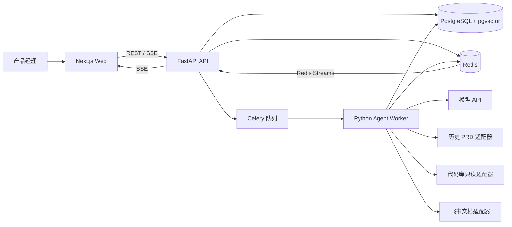

# PRD Agent MVP 总体设计

> 文档状态：**停用（INACTIVE）— 已由 `2026-07-21-prd-agent-v1.1-design.md` 的2026-07-28启用版取代**
> 版本：1.0  
> 日期：2026-07-20  
> 适用范围：PRD Agent V1.0 MVP

> 本文仅保留为历史记录。PostgreSQL完整PRD正文、Redis队列准入、飞书仅导出、
> 多Worker和旧RAG等冲突结论均不得用于当前实施。

## 1. 文档目的

本文档将产品需求转化为可实现、可测试、可演进的系统设计。设计覆盖 Web 工作台、后端业务 API、Agent 固定工作流、异步执行、历史 PRD 检索、代码库只读检索和飞书文档导出。

本文档是详细实施计划的设计依据。实施计划不得绕过本文档中的范围、状态机、人机确认和安全约束。

## 2. 已确认决策

| 决策项 | 结论 | 原因 |
| --- | --- | --- |
| 前端 | Next.js + TypeScript | 适合任务工作台、流式交互和类型安全的 Web 开发 |
| 后端 | FastAPI + Python | 兼顾结构化 API、Agent 编排和 Python AI 生态 |
| 数据库 | PostgreSQL | 保存任务、消息、文档版本和可审计执行状态 |
| 缓存与队列 | Redis | 支持队列、分布式锁、取消信号和短期事件流 |
| 系统形态 | 模块化单体 + 独立 Agent Worker | 保持 MVP 简单，同时隔离长时间 Agent 执行 |
| Agent 模式 | 单 Agent + 固定工作流 + 动态确认单元 | 符合 V1.0 可控性和人机确认要求 |
| 实时通信 | REST + Server-Sent Events（SSE） | 客户端主要接收单向进度和生成事件，无需引入 WebSocket 双向协议 |
| 后端代码组织 | API 与 Worker 共用领域、应用和基础设施包 | 避免业务规则重复，并允许分别扩缩容 |
| 状态事实来源 | PostgreSQL | Redis 丢失不得改变业务事实或导致任务重复执行 |
| 历史 PRD 检索 | PostgreSQL 全文检索 + pgvector 语义检索 | MVP 内复用主数据库并兼顾关键词与语义召回 |
| Agent 执行队列 | Celery + Redis Broker | 支持独立 Worker、重试、路由和任务监控 |
| 数据校验 | Pydantic 结构化模型 | 所有模型与工具输出必须校验后才能写入业务数据 |

## 3. 目标与成功标准

### 3.1 产品目标

1. 产品经理可以从模糊需求开始，通过逐轮澄清得到可确认的 PRD 大纲。
2. Agent 按确认单元逐段生成内容，不跳过用户确认节点。
3. 历史 PRD、授权代码库和产品经理的当前结论可以共同形成可追溯上下文。
4. 用户可以随时切换任务、刷新页面、停止生成或从失败点重试，并保留已完成内容。
5. 最终确认的 PRD 可以创建或覆盖更新当前任务绑定的飞书文档。

### 3.2 技术成功标准

1. 同一任务在任意时刻最多存在一个活动 Agent Run。
2. API 进程重启、Worker 重启或浏览器重连后，任务可从 PostgreSQL 恢复。
3. 重复请求和 SSE 重连不会重复创建消息、执行或飞书文档。
4. 模型输出、工具输出和状态迁移均经过服务端校验。
5. 用户不能访问其他用户的任务、文档、仓库或工具结果。
6. 日志与模型上下文不包含访问令牌、密钥或未脱敏凭证。

## 4. V1.0 范围

### 4.1 本期包含

- 任务列表、新建、切换、删除和状态展示。
- 单任务持续对话、独立草稿、消息失败重发和 Markdown 展示。
- 对话视图与 PRD 文档视图切换。
- 需求摘要、逐轮澄清、需求理解总结。
- PRD 大纲、动态确认单元及用户确认。
- 确认单元逐段生成、修改、重新生成和确认。
- Agent 步骤、工具状态和结果摘要展示。
- 停止、失败重试、工具重试和工具跳过。
- 历史 PRD 只读检索。
- 授权代码库搜索与只读读取。
- 全文完整性与一致性检查。
- 飞书文档创建、绑定和整份覆盖更新。
- 权限、审计、幂等、可观测性和质量回归基础能力。

### 4.2 明确不包含

- 多 Agent 协作或 Agent 自由循环执行。
- 用户创建、安装或配置 Tool、Skill 和插件。
- 文件、图片、附件和语音上传。
- 产品页面浏览、截图分析和原型图生成。
- 产品数据分析、市场信息搜索和机会自动识别。
- 自动修改代码、运行代码、提交代码或发布版本。
- 飞书章节级增量同步和任意文档覆盖。
- 细分“从 0 到 1、数据驱动迭代、Bug 优化”等需求意图模型。
- 面向系统管理员的完整配置后台。

原始产品定义中提到的页面截图和原型图能力，以 V1.0 工具范围中的明确排除项为准，列入后续版本。

## 5. 用户与权限

### 5.1 角色

| 角色 | 权限 |
| --- | --- |
| 产品经理 | 管理自己的任务、对话、PRD、授权数据源及飞书导出 |
| 产品负责人/项目负责人/研发负责人/业务负责人 | V1.0 可作为普通用户使用；跨用户协作与共享不在本期 |
| 系统管理员 | 通过部署配置管理模型、数据源和全局策略；V1.0 不提供完整管理 UI |

### 5.2 身份认证

- 生产环境通过 OIDC 兼容身份提供方登录。
- Next.js 获取用户会话，FastAPI 校验签名后的访问令牌并生成 `UserPrincipal`。
- 本地开发使用仅在开发配置中启用的固定测试身份提供方。
- 所有资源查询必须同时包含资源 ID 和当前用户 ID，不能只按资源 ID 查询。

## 6. 总体架构



### 6.1 架构原则

1. 业务规则集中在领域和应用层，HTTP、队列、模型和外部系统只是适配器。
2. API 不直接执行长时间 Agent 工作流，只负责校验、持久化命令和入队。
3. Worker 每一步执行前从 PostgreSQL 读取最新状态，不依赖进程内会话。
4. 用户可见执行过程来自明确的 `AgentStep`，不暴露模型内部思维链。
5. 工具调用必须经过白名单、权限和参数校验。
6. 所有用户确认都以显式命令和状态迁移保存，不能仅存在于对话文本中。

## 7. 代码库结构

```text
apps/
  web/                         # Next.js 用户界面
  api/                         # FastAPI 进程入口
  worker/                      # Celery Worker 进程入口
packages/
  backend/
    domain/                    # 实体、值对象、状态机和领域错误
    application/               # 用例、命令、查询和工作流编排
    agent/                     # Skills、提示词、结构化输出和质量检查
    integrations/              # 模型、历史 PRD、代码库、飞书适配器
    infrastructure/            # PostgreSQL、Redis、Celery 和日志实现
  contracts/                   # 由 OpenAPI 生成的前端 TypeScript 类型
tests/
  backend/
    unit/
    integration/
    contract/
    evaluation/
  e2e/
docs/
  superpowers/
    specs/
    plans/
```

API 与 Worker 是两个部署入口，但共享 `packages/backend`。前端不手写后端 DTO，通过 OpenAPI 生成客户端类型。

## 8. 核心组件

### 8.1 Next.js Web

- `TaskSidebar`：新建入口、任务状态、倒序列表、删除确认和收起展开。
- `ConversationView`：消息、澄清问题、大纲卡片、确认单元卡片和工具卡片。
- `PrdDocumentView`：按已确认大纲展示当前文档和章节状态。
- `Composer`：任务独立草稿、发送、停止和失败重发。
- `RunProgress`：展示可公开步骤、工具目的、状态和结果摘要。
- `SseClient`：断线重连、事件序号续传和任务状态刷新。

前端只反映服务端状态，不在浏览器自行推导合法状态迁移。

### 8.2 FastAPI API

- `TaskApplicationService`：任务生命周期、标题生成命令和删除编排。
- `ConversationApplicationService`：消息、草稿、幂等和 Agent Run 创建。
- `OutlineApplicationService`：大纲版本、确认、调整和锁定。
- `ConfirmationUnitApplicationService`：生成、确认、修改和顺序控制。
- `RunApplicationService`：入队、停止、重试和单活动 Run 约束。
- `ExportApplicationService`：最终确认、飞书创建和覆盖更新确认。
- `EventApplicationService`：事件持久化、Redis Stream 发布和 SSE 恢复。

### 8.3 Agent Worker

- `WorkflowEngine`：依据持久化状态选择唯一合法的下一步。
- `SkillRegistry`：仅注册 V1.0 内置 Skill。
- `ModelGateway`：统一模型调用、结构化输出、超时、重试和用量记录。
- `ToolExecutor`：权限检查、白名单、幂等、超时和标准化结果。
- `ContextBuilder`：在令牌预算内构造当前单元上下文。
- `QualityGate`：检查大纲覆盖、术语、规则、假设和来源。

### 8.4 基础设施

- PostgreSQL：业务事实、版本、事件游标和审计元数据。
- Redis：Celery Broker、任务锁、取消标记和短期事件流。
- 对象存储：V1.0 不保存用户上传文件；仅为未来扩展保留接口，不作为部署必选项。

## 9. 领域数据模型

### 9.1 核心实体

| 实体 | 关键字段 | 说明 |
| --- | --- | --- |
| `users` | `id`, `external_subject`, `display_name`, `created_at` | OIDC 用户映射 |
| `prd_tasks` | `id`, `owner_id`, `title`, `phase`, `version`, `updated_at`, `deleted_at` | 一项任务对应一份 PRD 和一条主对话 |
| `task_drafts` | `task_id`, `owner_id`, `content`, `updated_at` | 每任务独立未发送草稿 |
| `messages` | `id`, `task_id`, `role`, `kind`, `content`, `client_message_id`, `created_at` | 用户、Agent、系统和工具摘要消息 |
| `requirement_briefs` | `id`, `task_id`, `version`, `payload`, `created_at` | 结构化需求摘要版本 |
| `outline_versions` | `id`, `task_id`, `version`, `status`, `title`, `created_at`, `confirmed_at` | 大纲版本和锁定状态 |
| `outline_nodes` | `id`, `outline_id`, `parent_id`, `number`, `title`, `purpose`, `complexity`, `order_index` | 最多三级目录 |
| `confirmation_units` | `id`, `outline_id`, `sequence`, `status`, `title`, `version` | 每次生成和确认的最小范围 |
| `confirmation_unit_nodes` | `unit_id`, `outline_node_id` | 单元与章节的多对多映射 |
| `prd_documents` | `id`, `task_id`, `current_version`, `status`, `updated_at` | 当前 PRD 聚合根 |
| `prd_section_versions` | `id`, `document_id`, `outline_node_id`, `version`, `content`, `status`, `source_run_id` | 章节版本与确认状态 |
| `agent_runs` | `id`, `task_id`, `trigger_message_id`, `status`, `run_kind`, `context_version`, `started_at`, `ended_at` | 一次可停止、可重试执行 |
| `agent_steps` | `id`, `run_id`, `step_type`, `status`, `public_summary`, `sequence` | 用户可见执行步骤 |
| `tool_calls` | `id`, `run_id`, `unit_id`, `tool_id`, `purpose`, `input_hash`, `status`, `result_summary` | 标准化工具调用 |
| `source_references` | `id`, `task_id`, `tool_call_id`, `source_type`, `locator`, `conclusion`, `retrieved_at` | 文档或代码结论追溯 |
| `external_document_bindings` | `id`, `task_id`, `provider`, `external_id`, `url`, `last_export_hash` | 只能更新当前任务绑定文档 |
| `domain_events` | `id`, `task_id`, `sequence`, `event_type`, `payload`, `created_at` | SSE 断线恢复的事件事实 |
| `audit_records` | `id`, `actor_id`, `task_id`, `action`, `target_type`, `target_id`, `created_at` | 不含敏感正文的审计元数据 |

### 9.2 需求摘要结构

`RequirementBrief.payload` 至少包含：

- `problem`：待解决问题。
- `target_users`：目标用户与角色。
- `scenarios`：核心使用场景。
- `goals`：目标和预期结果。
- `scope_in`、`scope_out`：本期范围与非目标。
- `product_rules`：已知规则。
- `success_metrics`：可验证结果。
- `confirmed_facts`：用户明确确认的事实。
- `tool_verified_facts`：带 `source_reference_id` 的工具事实。
- `authorized_assumptions`：用户授权继续使用的假设。
- `agent_suggestions`：未确认建议。
- `open_questions`：仍可能影响设计的问题。

建议和未授权假设不得进入 `confirmed_facts`。

### 9.3 版本与并发

- `prd_tasks.version` 使用乐观锁，所有状态命令携带期望版本。
- 大纲、需求摘要和 PRD 章节只追加版本，不原地覆盖已确认版本。
- `agent_runs` 使用数据库唯一约束保证每个任务最多一个活动 Run。
- 相同工具、相同确认单元和相同参数的调用使用 `input_hash` 去重。
- 飞书创建使用 `task_id + document_version` 作为幂等键。

## 10. 状态设计

### 10.1 任务阶段

| 状态 | 含义 | 可进入状态 |
| --- | --- | --- |
| `DRAFT` | 首条消息已发送，任务刚创建 | `CLARIFYING`, `DELETING` |
| `CLARIFYING` | 正在理解需求或等待澄清 | `OUTLINE_REVIEW`, `FAILED`, `STOPPED`, `DELETING` |
| `OUTLINE_REVIEW` | 大纲和确认粒度等待确认 | `CLARIFYING`, `GENERATING`, `DELETING` |
| `GENERATING` | 正在逐个生成和确认单元 | `OUTLINE_REVIEW`, `FINAL_REVIEW`, `FAILED`, `STOPPED`, `DELETING` |
| `FINAL_REVIEW` | 全文检查完成，等待最终确认或章节修订 | `GENERATING`, `COMPLETED`, `DELETING` |
| `COMPLETED` | 用户最终确认完成 | `GENERATING`, `DELETING` |
| `FAILED` | 最近一次执行失败，内容被保留 | 失败前阶段、`DELETING` |
| `STOPPED` | 用户停止执行，内容被保留 | 停止前阶段、`DELETING` |
| `DELETING` | 用户不可见，等待取消执行和物理清理 | 终态 |

任务列表对复杂内部状态映射为：`待处理`、`进行中`、`待确认`、`已完成`、`执行失败`、`已停止`。

### 10.2 Agent Run 状态

```text
QUEUED → RUNNING → WAITING_USER → SUCCEEDED
             │          │
             ├──────────┴→ STOPPING → STOPPED
             └──────────────────────→ FAILED
```

- `WAITING_USER` 不是占用 Worker 的运行态；Worker 提交结果后结束当前队列任务。
- 用户确认或回复会创建新的 Run 继续同一业务工作流。
- `STOPPING` 用于无法立即中断的外部工具；工具返回后不得开始下一步骤。

### 10.3 确认单元状态

```text
PENDING → GENERATING → PENDING_CONFIRMATION → CONFIRMED
               │               │
               └→ FAILED       ├→ REVISION_REQUIRED → GENERATING
                               └→ PENDING（修改大纲后重新规划）
```

当前序号单元未确认时，下一序号单元不得进入 `GENERATING`。

### 10.4 工具状态

`PENDING`、`RUNNING`、`SUCCEEDED`、`EMPTY`、`FAILED`、`SKIPPED`、`CANCELLED`。

`EMPTY` 表示没有有效结果，不等同于目标信息不存在；只有 `SUCCEEDED` 结果可作为工具验证事实。

## 11. 核心工作流

### 11.1 新建任务与需求澄清

1. 用户点击“新建 PRD”时只打开本地空白工作区，不创建任务。
2. 用户发送首条非空消息，API 在一个事务中创建任务、消息和首个 Agent Run。
3. Agent 生成简短任务标题并提取需求摘要。
4. 信息不足时，每轮仅提出 1～3 个最高优先级问题。
5. 用户可以回答、要求建议、跳过或授权明确假设。
6. 信息足够或用户授权继续时，Agent 先输出需求理解摘要，再进入大纲生成。

### 11.2 大纲与动态确认单元

1. 大纲规划 Skill 判断小型、中型或大型需求。
2. 生成最多三级大纲、章节目的、复杂度和工具需求。
3. 按章节依赖、长度、规则复杂度和工具需求规划 5～12 个确认单元，原则上不超过 15 个。
4. 向用户展示完整大纲、规模依据、省略章节原因、确认单元和待确认项。
5. 用户调整时创建新大纲版本；用户确认时锁定当前版本。
6. 锁定后 Agent 不得自行增删章节或改变确认粒度。

### 11.3 确认单元生成

1. `ContextBuilder` 读取当前单元、大纲、最新需求摘要和已确认章节摘要。
2. Skill 判断是否需要历史 PRD 或代码工具。
3. `ToolExecutor` 校验工具可用性、授权、参数和重复调用。
4. 成功结果标准化后写入当前任务来源引用；失败时等待用户重试、跳过或停止。
5. 模型生成当前单元结构化结果。
6. `QualityGate` 检查大纲覆盖、前后冲突、术语、假设和来源。
7. 保存章节新版本并等待用户确认。
8. 用户确认后，该内容成为后续单元的稳定上下文。

### 11.4 全文检查与最终确认

1. 所有确认单元完成后检查大纲覆盖、重复、冲突、术语、状态、异常、验收、假设和来源。
2. 发现问题时只输出受影响章节和建议，不直接修改已确认内容。
3. 用户同意修订后，对受影响确认单元重新生成并再次确认。
4. 检查通过且用户最终确认后，任务进入 `COMPLETED`。

### 11.5 飞书导出

1. 仅 `COMPLETED` 任务可发起导出。
2. 导出前展示标题、位置、版本和未解决事项。
3. 未绑定文档时创建新文档并保存绑定。
4. 已绑定文档时只能选择覆盖该文档，并再次确认。
5. 使用当前 PRD 内容哈希防止重试创建重复文档。
6. 导出失败不改变任务完成状态，可从同一幂等键重试。

### 11.6 停止、恢复与删除

- 停止时 API 写入取消标记并将 Run 设为 `STOPPING`；Worker 在模型流、工具返回和每个步骤边界检查取消标记。
- 已保存消息、章节和工具结果继续保留；未完成流式片段不标记为已确认内容。
- 浏览器刷新或任务切换后，通过任务快照和 SSE 游标恢复，不创建新 Run。
- 删除后任务立即对用户不可见，活动 Run 被取消；正文、消息和来源在 Run 终止或 5 分钟保护超时后物理清理，仅保留不含正文的删除审计记录。
- 删除任务不调用飞书删除接口。

## 12. Agent、Skill 与 Tool 设计

### 12.1 固定工作流原则

模型只负责分类、建议和内容生成，不决定是否跳过用户确认、是否越权调用工具或如何迁移业务状态。`WorkflowEngine` 依据状态表选择下一步，并拒绝非法命令。

### 12.2 内置 Skill

| Skill ID | 输入 | 输出 | 可调用工具 | 确认节点 |
| --- | --- | --- | --- | --- |
| `requirement_clarification_v1` | 用户消息、需求摘要、已确认事实 | 更新后的摘要、问题或理解总结 | 无 | 用户回答或授权假设 |
| `prd_outline_planning_v1` | 需求摘要、范围、默认章节库 | 大纲、规模、确认单元、工具计划 | 无 | 用户确认大纲和粒度 |
| `prd_unit_generation_v1` | 当前单元、大纲、稳定上下文、来源 | 当前单元正文、引用、检查结果 | 历史 PRD、代码库 | 用户确认当前单元 |
| `prd_full_review_v1` | 全文、大纲、事实、来源 | 问题清单、受影响章节、修改建议 | 无 | 用户确认是否修订 |
| `feishu_export_format_v1` | 最终确认 PRD | 飞书结构化块、标题、内容哈希 | 无 | 用户确认实际写入 |

### 12.3 Tool 通用接口

读取类工具统一返回：

```json
{
  "status": "SUCCEEDED",
  "query": "需要确认的问题",
  "summary": "用户可理解的结果摘要",
  "sources": [
    {
      "source_type": "document_or_code",
      "name": "来源名称",
      "locator": "文档链接或代码位置",
      "retrieved_at": "ISO-8601 时间"
    }
  ],
  "error": null,
  "retry_recommended": false
}
```

写入类工具统一返回：

```json
{
  "status": "SUCCEEDED",
  "target": "目标对象",
  "operation": "create_or_replace",
  "external_id": "外部对象 ID",
  "url": "外部访问链接",
  "executed_at": "ISO-8601 时间",
  "error": null
}
```

### 12.4 历史 PRD 工具

- 资料由系统管理员通过离线导入命令预置，V1.0 不提供用户上传入口。
- 文档切块保留标题、章节路径、来源链接、更新时间和访问控制标签。
- 先使用关键词和向量混合召回，再按相关性返回最多 5 条。
- 过期或冲突内容标记为需要用户确认，不能覆盖当前任务已确认事实。

### 12.5 代码库工具

- 通过 `CodeRepositoryGateway` 隔离 GitHub、GitLab 或企业 Git 服务差异。
- V1.0 首个生产适配器使用 GitHub App 与 GitHub REST API；仓库和分支必须已由用户授权。其他 Git 提供方只需替换适配器，不改变领域和工作流。
- 工具先搜索文件，再按最大文件数、最大字节数和允许路径读取必要片段。
- 拒绝读取已知密钥文件、凭证文件和环境文件的敏感值。
- 输出只包含实现摘要、文件路径和行定位，不把完整代码写入 PRD。

### 12.6 飞书工具

- 使用飞书开放平台服务端 API，凭证保存在服务端密钥存储。
- 支持一级至三级标题、段落、列表、表格、引用、加粗和链接。
- 不支持的复杂格式降级为普通文本，单个格式转换失败不得导致整份导出失败。
- 覆盖更新只能使用 `external_document_bindings.external_id`，拒绝用户任意输入文档 ID。

## 13. API 与事件契约

### 13.1 REST 资源

| 方法与路径 | 用途 |
| --- | --- |
| `GET /api/v1/tasks` | 按更新时间倒序查询任务 |
| `POST /api/v1/tasks/from-message` | 用首条消息原子创建任务与 Run |
| `GET /api/v1/tasks/{task_id}` | 获取任务恢复快照 |
| `DELETE /api/v1/tasks/{task_id}` | 进入删除流程并取消活动 Run |
| `GET /api/v1/tasks/{task_id}/messages` | 分页读取历史消息 |
| `POST /api/v1/tasks/{task_id}/messages` | 发送后续消息并按状态创建 Run |
| `PUT /api/v1/tasks/{task_id}/draft` | 保存当前任务草稿 |
| `POST /api/v1/tasks/{task_id}/outline/confirm` | 确认当前大纲和确认粒度 |
| `POST /api/v1/tasks/{task_id}/outline/revise` | 提交大纲调整要求 |
| `POST /api/v1/tasks/{task_id}/units/{unit_id}/confirm` | 确认当前单元 |
| `POST /api/v1/tasks/{task_id}/units/{unit_id}/revise` | 修改或重新生成当前单元 |
| `POST /api/v1/tasks/{task_id}/runs/{run_id}/stop` | 请求停止当前 Run |
| `POST /api/v1/tasks/{task_id}/runs/{run_id}/retry` | 从保存状态重试失败 Run |
| `POST /api/v1/tasks/{task_id}/tool-calls/{call_id}/retry` | 重试工具调用 |
| `POST /api/v1/tasks/{task_id}/tool-calls/{call_id}/skip` | 跳过工具并记录影响 |
| `POST /api/v1/tasks/{task_id}/finalize` | 用户最终确认 PRD |
| `POST /api/v1/tasks/{task_id}/exports/feishu/preview` | 获取导出预览和确认信息 |
| `POST /api/v1/tasks/{task_id}/exports/feishu` | 创建或覆盖绑定飞书文档 |
| `GET /api/v1/tasks/{task_id}/events` | SSE 事件流，支持 `Last-Event-ID` |

所有创建、修改、停止、重试和导出接口必须携带 `Idempotency-Key`。状态相关命令携带 `expected_task_version`；版本不匹配返回 `409 Conflict` 和最新任务快照摘要。

### 13.2 SSE 事件

- `task.updated`
- `message.created`
- `run.queued`
- `run.started`
- `run.step.updated`
- `generation.delta`
- `tool_call.updated`
- `outline.ready_for_confirmation`
- `unit.ready_for_confirmation`
- `document.updated`
- `run.stopping`
- `run.completed`
- `run.failed`
- `task.deleted`

每个事件包含 `event_id`、`task_id`、`task_version`、`occurred_at` 和类型化 `payload`。客户端发现事件序号缺口时重新获取任务快照。

## 14. 一致性、幂等与任务隔离

1. API 的业务写入与 `domain_events` 写入使用同一 PostgreSQL 事务。
2. 事务提交后由 Outbox Publisher 投递 Celery 命令和 Redis Stream 事件。
3. Worker 按 `run_id` 幂等消费；重复消息只返回已保存结果。
4. 分布式锁用于降低重复执行概率，数据库唯一约束负责最终正确性。
5. 每次模型调用使用不可变的 `context_version`，结果落库前再次检查任务版本和取消标记。
6. 不同任务的消息、摘要、来源和 PRD 均通过 `task_id + owner_id` 隔离。

## 15. 异常处理

| 异常 | 系统处理 | 用户体验 |
| --- | --- | --- |
| 模型超时或限流 | 对幂等步骤进行有限退避重试，耗尽后保存失败状态 | 展示简化原因和“重新生成” |
| 模型结构不合法 | 同一次调用执行一次结构修复，仍失败则终止步骤 | 已有内容保留，可重试 |
| 工具无结果 | 保存 `EMPTY`，不推断信息不存在 | 仅在影响方案时继续询问 |
| 工具失败 | 保存标准错误和是否建议重试 | 提供重试、跳过、停止 |
| 消息发送失败 | 不清除本地内容；相同 `client_message_id` 可重发 | 消息旁显示失败和重发入口 |
| 网络中断 | 保留草稿；恢复后拉取快照并续接 SSE | 不重复发送已成功消息 |
| Worker 崩溃 | 租约过期后由恢复任务检查 Run 和最后步骤 | 从持久化步骤重试，不丢已确认内容 |
| 飞书写入失败 | 不改变 PRD 完成状态，保持绑定和幂等键 | 提供重新导出，不重复创建文档 |
| 并发命令 | 乐观锁拒绝过期命令 | 返回最新状态并提示刷新 |

错误响应使用稳定的 `error_code`、用户可读 `message`、`retryable` 和 `correlation_id`，不向客户端返回堆栈和凭证信息。

## 16. 安全设计

- 工具凭证只由后端密钥存储注入，不写入模型消息、数据库正文或普通日志。
- 外部文档和代码均视为不可信数据，使用内容边界包裹并明确禁止其充当系统指令。
- Agent 仅能调用当前 Skill 白名单中的工具。
- 写入型工具必须同时通过业务前置条件、用户显式确认和目标绑定检查。
- Repository 层强制所有用户资源查询带 `owner_id`。
- 代码读取执行路径与代码执行路径物理隔离；系统不存在代码执行接口。
- 历史 PRD 检索在召回前过滤用户可访问的数据源。
- 对模型、代码库和飞书接口设置超时、响应大小和速率限制。
- 日志对令牌、Authorization Header、Cookie、密钥模式和外部正文进行过滤。
- 删除任务后，审计记录只保留主体 ID、动作、时间和结果，不保留消息或 PRD 正文。

## 17. 可观测性

### 17.1 指标

- 任务创建数、完成数和删除数。
- 各阶段停留时长和转化率。
- 每份 PRD 的澄清轮数、确认单元数和修订次数。
- 模型延迟、失败率、结构化输出失败率和令牌用量。
- 工具调用量、成功率、空结果率和延迟。
- Worker 队列深度、排队时间和运行时间。
- SSE 活跃连接、断线重连和事件缺口数。
- 飞书创建、更新、失败和幂等命中次数。

### 17.2 追踪与日志

- `correlation_id` 贯穿浏览器请求、API、Run、Step、Tool Call 和外部请求。
- 日志采用结构化 JSON，包含类型、ID、状态和耗时，不记录完整提示词或正文。
- 关键状态迁移产生审计记录，并附旧状态、新状态和操作者。

## 18. 测试与质量策略

### 18.1 测试层次

1. 前端单元测试：组件状态、草稿隔离、按钮约束和事件归并。
2. 领域单元测试：状态迁移、大纲锁定、单活动 Run、确认顺序和导出前置条件。
3. Repository 集成测试：事务、唯一约束、乐观锁、删除和版本追加。
4. Agent 契约测试：每个 Skill 的输入输出 Schema、提示词注入边界和结构修复。
5. Tool 契约测试：统一状态、权限、超时、空结果、来源和幂等。
6. API/SSE/Worker 集成测试：Outbox、队列、事件恢复、取消和崩溃恢复。
7. 浏览器端到端测试：从首条消息、大纲确认、单元确认到最终导出。
8. 质量回归评测：固定需求样本验证覆盖度、事实与假设区分、验收可执行性和来源追溯。
9. 安全测试：跨用户访问、越权工具、提示词注入、重复请求、敏感日志和任意飞书文档覆盖。

### 18.2 关键验收场景

- 未发送首条消息时不创建空任务。
- 切换任务后草稿、消息、PRD 和 Run 状态相互隔离。
- Agent 运行时切换任务，原 Run 继续后台执行。
- 大纲未确认时不能生成正文。
- 当前确认单元未确认时不能生成下一单元。
- 修改大纲产生新版本，并重新确认确认单元规划。
- 停止或失败后保留已生成与已确认内容。
- SSE 重连不重复展示或触发业务命令。
- 历史 PRD 无结果时不输出“历史上不存在”。
- 代码工具不能修改、执行或泄露敏感文件内容。
- 未最终确认或未主动发起时不能写入飞书。
- 更新飞书时只能覆盖当前任务绑定文档。
- 删除任务取消 Run、移除产品内数据，但不删除飞书文档。

## 19. 部署设计

### 19.1 部署单元

- `web`：Next.js 容器。
- `api`：FastAPI 容器，可水平扩容。
- `worker-agent`：处理模型和内容生成队列。
- `worker-integration`：处理代码库、历史 PRD 和飞书调用，可与 Agent Worker 使用不同并发策略。
- `scheduler`：Outbox 发布、Run 恢复和延迟物理删除任务。
- PostgreSQL、Redis 和服务端密钥存储使用托管服务优先。

### 19.2 环境

- `local`：容器化依赖、测试身份、模型与工具 Stub。
- `staging`：独立数据库、受限真实集成、质量评测和端到端测试。
- `production`：高可用数据库、备份、告警、限流和最小权限凭证。

数据库迁移由 Alembic 管理；部署顺序为数据库向后兼容迁移、API/Worker 滚动发布、前端发布、旧字段清理。

## 20. 分阶段交付

### 阶段 1：工程基础与领域骨架

建立 Monorepo、开发环境、数据库迁移、认证边界、核心实体、状态机、OpenAPI 契约和 CI。交付可测试的任务领域模型，不包含模型调用。

### 阶段 2：任务、对话与实时事件

完成任务列表、首条消息创建任务、任务恢复、草稿隔离、删除、REST API、Outbox、SSE 和基础消息界面。交付不含 Agent 智能的完整任务工作台。

### 阶段 3：澄清、大纲与状态机

接入模型网关、结构化输出、需求摘要、澄清 Skill、大纲 Skill、动态确认单元、Worker 和停止/重试。交付从原始需求到已确认大纲的闭环。

### 阶段 4：确认单元与 PRD 闭环

完成逐单元生成、版本、修改、确认、文档视图、质量门禁和全文检查。交付可完成最终确认的 PRD。

### 阶段 5：外部工具与飞书导出

完成历史 PRD 检索、代码库只读检索、工具卡片、来源追溯、飞书预览、创建和覆盖更新。交付端到端外部集成能力。

### 阶段 6：安全、评测与上线

完成权限与注入测试、质量回归数据集、指标、追踪、告警、容量验证、恢复演练和生产发布门禁。

每个阶段都必须产生可独立运行和测试的垂直交付，不允许到最后阶段才进行集成。

## 21. 风险与缓解

| 风险 | 影响 | 缓解措施 |
| --- | --- | --- |
| 模型生成不稳定 | 大纲或正文结构不一致 | 结构化 Schema、有限修复、质量门禁和固定样本回归 |
| 上下文增长 | 延迟、成本和前后冲突 | 稳定摘要、按单元取数、来源裁剪和令牌预算 |
| 外部资料过时 | 将旧规则写入新 PRD | 保留时间与来源、标记冲突、以用户当前确认内容为准 |
| 长任务重复执行 | 重复内容或重复导出 | 唯一活动 Run、幂等键、Outbox 和数据库约束 |
| 停止不及时 | 用户认为系统失控 | 步骤边界检查取消、外部调用超时和 `STOPPING` 反馈 |
| 工具内容提示词注入 | 越权或错误指令 | 内容隔离、工具白名单、参数校验和外部内容不可信策略 |
| 飞书格式差异 | 导出失败或格式丢失 | 中间文档块模型、格式降级和导出契约测试 |
| MVP 范围膨胀 | 延误主闭环 | 坚持排除项，页面截图、多 Agent 和插件延后 |

## 22. 设计完成定义

本设计在满足以下条件时视为可进入实施计划：

- 系统边界、部署形态和代码组织已明确。
- 核心实体、版本策略和状态迁移已明确。
- Agent、Skill、Tool 与工作流职责无重叠歧义。
- 用户确认、停止、重试、删除和飞书写入规则已闭环。
- API、SSE、幂等、并发和恢复策略可被测试。
- 安全、可观测性、部署和阶段交付已覆盖。
- V1.0 非目标已明确，不把后续规划混入 MVP。

## 23. 需求覆盖矩阵

| PRD 能力 | 设计章节 |
| --- | --- |
| 任务列表、新建、切换、删除 | 8.1、11.1、11.6、13.1 |
| 对话、草稿、失败重发、状态展示 | 8.1、13、15 |
| 需求澄清与假设 | 9.2、11.1、12.2 |
| 大纲和动态确认单元 | 9.1、10.3、11.2 |
| 逐单元生成和确认 | 10.3、11.3 |
| 执行过程和工具卡片 | 8.1、9.1、13.2 |
| 停止、失败与恢复 | 10.2、11.6、15 |
| 历史 PRD、代码和来源 | 12.4、12.5、9.1 |
| 全文检查和最终确认 | 11.4、12.2、18 |
| 飞书创建与覆盖更新 | 11.5、12.6、13.1 |
| 权限、安全和审计 | 5、16、17 |
| 输出规范与验收质量 | 12.2、18 |
