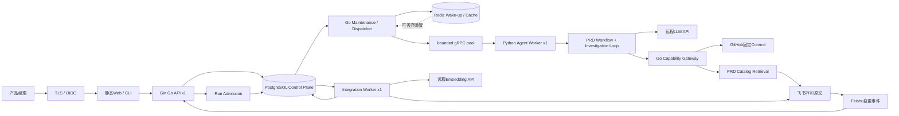

# PRD Agent V1.1 总体设计（2026-07-28 启用版）

> 文档状态：**启用（ACTIVE）**
> 产品版本：V1.1
> 设计修订：Revision 3
> 首次确认：2026-07-20
> 本次生效：2026-07-28
> 适用范围：Portfolio Core、Production Profile 与 2核2GB 单机部署档位

## 0. 生效状态与覆盖规则

本文档是当前启用的总设计。发生冲突时，按下表顺序执行：

| 优先级 | 文档 | 状态 | 作用 |
| ---: | --- | --- | --- |
| 1 | 本文档 | **启用** | 产品、架构、状态、数据与部署总合同 |
| 2 | [Go/Python边界迁移设计](../plans/2026-07-28-go-python-agent-boundary-migration-design.md)、[直接Agent RPC设计](../plans/2026-07-28-go-python-direct-agent-rpc-pool-design.md) | **启用** | Go Control Plane、Python Agent Runtime 和 direct RPC 边界 |
| 3 | [飞书/GitHub/RAG/队列设计](../plans/2026-07-28-feishu-github-rag-queue-architecture-design.md) | **启用** | 飞书/GitHub、RAG、队列、SQL和2核2GB实施细则 |
| 4 | [DeepSeek API Loop设计](../plans/2026-07-28-deepseek-api-loop-design.md) | **启用** | 远程LLM API与有界Loop |
| 5 | [服务器部署整改设计](../plans/2026-07-27-server-deployment-remediation-design.md) | **启用** | 部署缺陷、优先级和发布门禁 |
| 6 | [Step 8](../plans/2026-07-27-m0-agent-core-step-8-historical-prd-rag-design.md)、[Step 9](../plans/2026-07-27-m0-agent-core-step-9-external-integrations-design.md)、[Step 10](../plans/2026-07-27-m0-agent-core-step-10-production-profile-design.md) | **兼容启用** | 保留已实现合同；冲突部分以上位设计为准 |
| 7 | [V1.0总体设计](./2026-07-20-prd-agent-mvp-design.md) | **停用** | 仅保留历史记录，不再作为实施依据 |

以下旧结论已停用：

- PostgreSQL长期保存全部历史PRD正文；
- 飞书只是可选导出目标；
- Redis或Celery队列长度决定多用户准入；
- Production可运行本地模型或在远程模型故障时回退本地模型；
- 2核2GB首版部署多API、多Agent Worker或本地Embedding模型；
- Production必须用LangGraph重写现有内层Agent Loop。

本修订明确启用：

- 飞书拥有Published PRD正文，GitHub拥有代码；
- PostgreSQL拥有Control Plane、Working Draft和轻量RAG目录；
- PostgreSQL Run Admission与公平调度；
- Redis只作可丢弃唤醒、恢复信号和短期缓存；
- 生产只调用远程LLM API；
- 单Agent Worker与单Integration Worker执行档位。

### 0.1 当前实现状态（2026-07-28）

已完成并通过本地验证：

- Gin Go API、PostgreSQL Store/Migration、Run Admission、Lease/Fencing、Outbox 和 Maintenance；
- Go `agentpool` 与 Dispatcher 主动调用 Python `AgentWorkerService`；
- Python Deterministic/DeepSeek Agent Loop、Investigation、Capability Client、Checkpoint、Quality 和取消门禁；
- PostgreSQL → Go API → Go Dispatcher → Python Agent → Draft/Checkpoint 回写的真实容器 E2E；
- 删除 Python Pull/Callback Runtime、Go `agent-rpc` 和 `legacy_worker_pull` 生产路径；
- Python Agent、Go backend、Go contracts、PostgreSQL integration 与 Compose 配置回归通过。

尚未满足的生产门禁：

- Go Capability Gateway 的完整 GitHub/Feishu Provider；
- Go ↔ Python mTLS/workload identity；
- Worker crash、RPC timeout、Go restart、Redis loss 等 staging 故障演练；
- 旧 Python 公共 API/数据表的最终切流和 Contract migration。

## 1. 文档目的

本文档将产品需求转化为可实现、可测试、可演进的系统设计。它覆盖PRD工作台、业务API、有界Agent Loop、受控调查、飞书PRD检索、GitHub代码调查、来源验证、评测和飞书发布。

系统的主业务目标始终是生成经过用户确认、可交付研发与测试的 PRD。历史 PRD 和代码查阅是辅助步骤，只在外部信息会影响大纲、方案、规则、验收或风险判断时触发。

本文档同时区分两种实现配置：

- **Portfolio Core**：用于求职项目的首要实现范围，优先证明 Agent Workflow、Tool Use、Evidence、Grounding、Eval 和失败分析能力。
- **Production Profile**：当前已启用的服务器目标。它增加异步执行、权限、恢复、受控用户容量、外部集成和2核2GB资源约束。

实施计划不得绕过本文档中的状态机、人机确认、调查预算、来源验证和安全约束。

## 2. 已确认决策

| 决策项 | Portfolio Core | Production Profile | 原因 |
| --- | --- | --- | --- |
| 前端 | CLI 或最小 Next.js 页面 | Next.js + TypeScript | 先验证 Agent 核心，再完善任务工作台 |
| 后端 | Go API 或测试内存 Adapter | Gin Go Control Plane + Python Agent Runtime | Go负责公共API和状态，Python只负责模型与工具决策 |
| 模型调用 | 远程API或离线测试Adapter | 仅远程LLM API | 生产不运行或回退本地模型 |
| Agent 编排 | 自定义显式状态机 | 自定义状态机 + 持久化Checkpoint | 不引入LangChain；LangGraph只作为未来外层编排选项 |
| 数据模型 | Go struct / Python dataclass | Go struct + Protobuf + Python dataclass | 跨语言边界只使用版本化Protobuf |
| 数据库 | PostgreSQL或内存测试Store | PostgreSQL | 统一持久化语义；内存Store只用于测试 |
| 缓存与队列 | 同进程测试执行 | PostgreSQL Admission/Outbox + Go Dispatcher；Redis仅唤醒 | 数据库决定准入和恢复，Go主动调用Python |
| 系统形态 | 模块化核心 | Go Control Plane + Python Agent Worker + Integration Worker | 语言边界与数据所有权一致 |
| Agent 模式 | 单 Agent + 固定 PRD Workflow + 受控 Investigation Loop | 同左 | 避免多 Agent 复杂度，同时保留动态工具调查能力 |
| 实时通信 | 轮询或简单 SSE | REST + SSE | 客户端主要接收单向进度，不需要 WebSocket |
| 状态与内容权威 | 本地测试状态 | PostgreSQL控制面；飞书PRD；GitHub代码 | 避免双写正文和代码副本 |
| 历史 PRD 检索 | 固定Corpus评测基线 | 目录Top20 → 飞书Top3～5 → 原文重排 | 按需取原文并考虑飞书修改时间 |
| 代码调查 | 本地只读仓库 + 确定性工具 | GitHub固定Commit + 确定性工具 | 生产代码必须来自授权GitHub快照 |
| Evidence | 轻量关系模型 | 同左，可扩展对象存储 | 重点是来源、版本、Fact 和正文结论可追溯，而非图数据库 |
| Memory | 不引入 MemoryOS | 后续按评测决定 Project Memory | 当前核心是版本化系统事实，不是长期个性化记忆 |
| 外部 Coding Agent | 预留 Adapter，不作为主执行器 | 可接 Codex/Claude Code Worker | 保持供应商可替换，并支持对比实验 |
| 通用 Agent Runtime | 不自研 | 优先复用现有 Runtime/队列 | 自研 Runtime 不直接提高 PRD 质量 |
| 飞书PRD | 本地Markdown输出 | Published PRD权威源 | 服务端幂等创建或覆盖绑定文档 |
| 用户与队列 | 单用户 | 最多30个启用用户；公平有界队列 | 每用户2个Open Run，全局30个Runnable Slot |
| 生产部署 | 不适用 | 2 vCPU / 2GB / 40GB SSD | Agent与Integration Worker并发均为1 |

## 3. 目标与成功标准

### 3.1 产品目标

1. 产品经理可以从模糊需求开始，通过逐轮澄清得到可确认的 PRD 大纲。
2. Agent 按确认单元逐段生成内容，不跳过用户确认节点。
3. Agent 能判断当前内容是否需要历史 PRD 或代码信息，而不是固定调用所有工具。
4. 必要的信息调查能够在有限预算内多步执行，并输出可核查的来源、事实、未知项和冲突。
5. 历史 PRD、授权代码库和产品经理的当前结论共同形成可追溯上下文，但不会被错误混为同一类事实。
6. 最终确认的Working Draft通过幂等发布进入飞书；发布成功后飞书文档成为Published PRD。

### 3.2 Agent 成功标准

1. 能正确区分 `NONE`、`OPTIONAL`、`REQUIRED` 信息需求。
2. 调查下一步由当前 Coverage Gap 驱动，而不是无限 ReAct。
3. 完全相同的调查动作不会重复执行。
4. 达到覆盖目标、无进展、预算耗尽或需要人工输入时能够确定性停止。
5. 代码或历史文档相关的确定性结论具有来源和版本定位。
6. `EMPTY`、失败和推测不会被写成“信息不存在”或“代码明确事实”。
7. Grounding Checker 能识别来源不足、版本不符和结论过度推导。
8. 评测可比较 Direct Prompt、单次检索、有限 Loop 和 Loop + Grounding 的真实差异。

### 3.3 技术成功标准

1. 同一任务在任意时刻最多存在一个活动 Agent Run。
2. 每个 Investigation 具有明确问题、覆盖要求、预算和停止原因。
3. 模型输出、工具输出、Fact和状态迁移均经过服务端Schema校验。
4. 同一代码 Investigation 全程绑定固定 `resolved_commit_sha`。
5. 任务可以从持久化状态恢复；重复请求不会重复创建消息、Run、工具调用或外部文档。
6. 用户不能访问其他用户的任务、文档、仓库、Evidence 或工具结果。
7. 日志与模型上下文不包含访问令牌、密钥或未脱敏凭证。
8. Run Admission在同一事务中执行全局和每用户容量检查。
9. Redis清空后，已准入Run可由PostgreSQL恢复。
10. 飞书RAG先校验ACL与Revision，再读取原文。

## 4. V1.1 范围

### 4.1 Portfolio Core 必须包含

- 一个可复现的 Demo Repository。
- 不少于 10 个带 Ground Truth 的需求评测案例。
- Direct Prompt Baseline 和至少两种 Agent Ablation。
- 单任务需求澄清、需求摘要、大纲和确认单元。
- 单 Agent 显式 PRD Workflow。
- `NONE`、`OPTIONAL`、`REQUIRED` 信息需求判断。
- 受控 Investigation Loop。
- 本地仓库只读工具：目录、搜索、读取、Symbol、Reference、OpenAPI、数据库 Schema、相关测试。
- 固定历史PRD Corpus的关键词检索基线。
- Evidence、Verified Fact、Unknown、Source Conflict 和 Coverage。
- Source Grounding Checker 与 Document Quality Checker。
- Markdown PRD 输出和 Evidence Appendix。
- 工具调用轨迹、停止原因、Token、时延和成本记录。
- 至少一个失败案例与修复后的回归结果。

### 4.2 Production Profile 启用范围

- 完整任务列表、新建、切换、删除和状态展示。
- 单任务持续对话、独立草稿、消息失败重发和 Markdown 展示。
- 对话视图与 PRD 文档视图切换。
- SSE 实时进度和断线恢复。
- PostgreSQL Run Admission、公平队列、Outbox、Go Dispatcher、Redis唤醒和恢复调度。
- OIDC 登录、多用户权限和审计。
- GitHub App / GitLab 代码适配器。
- 飞书PRD目录、Revision/Locator、修改时间排序和按需原文读取。
- 可选pgvector文档或Section Embedding。
- 飞书文档创建、绑定、整份覆盖、变更事件与增量同步。
- 30个启用用户、每用户2个Open Run、全局30个Runnable Slot。
- 单Agent Worker和单Integration Worker。
- staging、production、告警、备份和容量验证。

### 4.3 明确不包含

- 多 Agent Swarm 或 Agent 之间的自由对话。
- 无边界、无预算的自主循环。
- 用户创建、安装或配置 Tool、Skill 和插件。
- MemoryOS 或通用长期个性化记忆。
- 自研通用 Agent Runtime。
- 文件、图片、附件和语音上传。
- 产品页面浏览、截图分析和原型图生成。
- 产品数据分析、市场信息搜索和机会自动识别。
- 自动修改代码、执行任意代码、提交代码或发布版本。
- 第一版支持所有编程语言和框架。
- 将代码分析本身改造成独立的主产品输出。

原始产品定义中提到的页面截图和原型图能力，以 V1.1 工具范围中的明确排除项为准，列入后续版本。

## 5. 用户与权限

### 5.1 角色

| 角色 | 权限 |
| --- | --- |
| 产品经理 | 管理自己的任务、对话、PRD、授权数据源和飞书发布 |
| 产品负责人/项目负责人/研发负责人/业务负责人 | V1.1 可作为普通用户使用；跨用户协作与共享不在本期 |
| 系统管理员 | 通过部署配置管理模型、数据源和全局策略；不要求首版提供管理 UI |

### 5.2 身份认证

Portfolio Core 可以使用固定本地测试身份；Production Profile 使用 OIDC 兼容身份提供方。

- Next.js 获取用户会话，Go API 校验签名后的访问令牌并生成 Principal。
- 所有资源查询必须同时包含资源 ID 和当前用户 ID，不能只按资源 ID 查询。
- 本地仓库适配器只允许访问预配置的只读目录。
- 远程代码适配器使用最小权限 App Token，不将 Token 放入模型上下文。

## 6. 总体架构



### 6.1 架构原则

1. **PRD Workflow 是外层主流程**：需求澄清、大纲、确认单元、全文检查和用户确认由确定性状态机控制。
2. **Investigation Loop 是内层子流程**：只在信息缺口存在时启动，且必须有目标、Coverage、预算和终止条件。
3. **模型负责不确定性高的任务**：需求理解、调查动作建议、Fact 解释和文档生成。
4. **确定性工具负责可解析事实**：文件搜索、Symbol、Reference、OpenAPI、数据库 Schema 等。
5. **Evidence 与模型结论分层**：原始来源、结构化 Fact、正文 Claim 不能混为一个字段。
6. **用户目标与当前系统事实分离**：用户确认的新方案不会自动覆盖当前代码事实。
7. **API 不承担长任务执行**：Production Profile 中长任务进入 Worker；Portfolio Core 可在同进程执行但保持相同接口。
8. **状态从数据库恢复**：模型会话和进程内内存不是业务事实来源。
9. **不展示私有思维链**：仅展示公开步骤、调查目标、工具目的、结果摘要、事实和未知项。
10. **每个新增复杂模块都要有 Ablation**：RAG、Verifier、Memory 或外部 Coding Agent 必须通过评测证明价值。
11. **内容权威外置**：飞书拥有Published PRD正文，GitHub拥有代码；PostgreSQL不维护可编辑的第二份权威正文。
12. **准入先于投递**：全局容量、每用户配额和公平性由PostgreSQL事务决定，Redis只负责唤醒。
13. **小服务器有界执行**：2核2GB档位固定单Agent Worker和单Integration Worker。
14. **生产远程模型唯一**：Provider失败进入等待、重试或失败状态，不回退本地模型。
15. **Go拥有Control Plane**：Task、Run、Lease、Fencing、Queue、事件、Draft和Checkpoint只由Go写入。
16. **Python仅拥有Agent决策**：Python Worker无公共HTTP、无PostgreSQL写权限、无OIDC或Provider Credential。
17. **Go主动派发**：Go通过有界gRPC连接池调用Python；Python不从Redis拉取Run。

### 6.2 执行配置

#### Portfolio Core

```text
CLI / Minimal Web
    ↓
Application Service
    ↓
Single-process Workflow Engine
    ↓
Local Repository + PostgreSQL/Memory Test Store
```

重点是可运行、可测试、可观测和可复现，不要求生产级高可用。

#### Production Profile

```text
Static Web / Next.js Build
    ↓ REST / SSE
Gin Go API x1
    ↓ PostgreSQL Run Admission / Outbox
Go Maintenance / Dispatcher
    ↓ bounded gRPC
Python Agent Worker x1
    ↘ Go Capability Gateway / Integration Worker x1
    ↓
PostgreSQL Control Plane + Feishu + GitHub + Remote LLM
```

两种配置复用同一领域模型、Workflow、Tool接口和Eval。Production Profile
不得使用同步HTTP长任务路径。

## 7. 代码库结构

```text
backend-go/
  cmd/api/                       # Gin公共API
  cmd/maintenance/               # Admission、Outbox、Dispatcher与Recovery
  cmd/migrate/                   # PostgreSQL显式迁移
  internal/runcontrol/           # Task/Run/Lease/Fencing领域与Store接口
  internal/storage/              # pgxpool与显式SQL
  internal/agentpool/            # Go → Python有界gRPC连接池
  internal/dispatcher/           # Agent事件校验和持久化
  internal/httpapi/              # REST/SSE与Principal边界

agent-python/
  agent/worker_server.py         # AgentWorkerService
  agent/bootstrap.py             # Deterministic/Remote Agent Loop
  agent/model/                   # DeepSeek Adapter
  agent/investigation/           # 有界调查计划
  agent/capability/              # Go Capability Gateway Client
  agent/checkpoint.py            # 可恢复Checkpoint
  agent/quality/                 # Draft质量门禁

contracts/
  proto/agent/v1/                # 跨语言唯一业务合同
  gen/go/                        # Go bindings

web/                             # Next.js工作台
src/prd_agent/                   # 迁移期旧Python业务实现；不得新增Control Plane所有权
infra/local/                     # 隔离本地Compose与迁移
infra/production/                # 生产Compose overlays
scripts/                         # 本地完整流程验证
tests/                           # 旧Python业务兼容与回归测试
docs/                            # 总设计、ADR和分步设计
```

Go和Python不共享ORM、数据库实体或进程内领域对象。跨语言执行只使用
Protobuf；当前启用实现由显式状态机和Checkpoint控制，不引入LangChain。

## 8. 核心组件

### 8.1 CLI / Next.js Web

- `TaskSidebar`：任务列表、状态、删除和切换。
- `ConversationView`：消息、澄清问题、大纲和确认单元。
- `PrdDocumentView`：展示当前 PRD 和章节状态。
- `InvestigationCard`：展示调查目标、Coverage、已确认事实、未知项和停止原因。
- `ToolCallCard`：展示单次工具目的、状态和摘要。
- `EvidenceDrawer`：展示来源类型、文档版本或代码 commit、文件和行号。
- `RunProgress`：展示用户可见 Workflow 节点，不展示模型私有推理。
- `EvaluationView`：Portfolio 项目可选，用于展示 Baseline 与 Ablation 结果。

前端只反映服务端状态，不自行推导合法状态迁移。

### 8.2 Application API

- `TaskApplicationService`：任务生命周期和删除编排。
- `ConversationApplicationService`：消息、草稿、幂等和 Run 创建。
- `OutlineApplicationService`：大纲版本、确认、调整和锁定。
- `ConfirmationUnitApplicationService`：生成、确认、修改和顺序控制。
- `RunApplicationService`：执行、停止、重试和单活动 Run 约束。
- `RunAdmissionService`：全局/每用户容量、Queue Slot、用量窗口和公平调度。
- `InvestigationApplicationService`：创建调查、预算、取消、重试和结果读取。
- `PrdRetrievalApplicationService`：ACL、目录召回、Revision校验、飞书原文和重排。
- `EvidenceQueryService`：查询 Evidence、Fact、Unknown 和 Source Conflict。
- `EvaluationApplicationService`：运行固定 Case 和生成对比报告。
- `PublishApplicationService`：最终确认、飞书幂等发布和结果未知核对。
- `EventApplicationService`：持久化和发布用户可见事件。

### 8.3 PRD Workflow Engine

`WorkflowEngine` 依据持久化任务状态选择唯一合法的下一节点：

```text
CLARIFY
→ OPTIONAL_PRE_OUTLINE_INVESTIGATION
→ OUTLINE
→ OUTLINE_CONFIRMATION
→ UNIT_PREPARATION
→ OPTIONAL_UNIT_INVESTIGATION
→ UNIT_GENERATION
→ SOURCE_GROUNDING
→ UNIT_CONFIRMATION
→ FULL_REVIEW
→ FINAL_CONFIRMATION
```

职责：

- 不允许模型跳过用户确认。
- 不允许在前一确认单元未确认时生成下一单元。
- 调查只作为节点或子图，不改变主业务状态语义。
- 对每个节点保存输入版本、输出版本和公开摘要。

### 8.4 Information Need Planner

输入：需求摘要、大纲节点、当前单元、已确认 Fact 和 Unknown。

输出：

```json
{
  "question": "当前 discount_value 接受什么格式？",
  "requiredness": "REQUIRED",
  "source_types": ["CODE"],
  "required_coverage": ["api_contract", "validation_logic", "storage_schema"],
  "trigger_stage": "UNIT_PREPARATION",
  "fallback": "ASK_USER_OR_MARK_UNKNOWN"
}
```

Planner 只建议是否需要外部信息；系统策略负责预算、权限和是否允许执行。

### 8.5 Investigation Runner

负责执行有限信息调查子图：

```text
ASSESS_GAPS
→ SELECT_NEXT_ACTION
→ VALIDATE_ACTION
→ EXECUTE_TOOL
→ NORMALIZE_EVIDENCE
→ EXTRACT_FACTS
→ UPDATE_COVERAGE
→ CONTINUE / COMPLETE / PARTIAL
```

核心控制：

- 最大迭代轮数。
- 最大工具调用数。
- Token 和上下文预算。
- 重复动作签名检查。
- 连续无进展检测。
- 最多一次 Replan。
- 最多一次 Grounding 定向回退。
- 明确停止原因。

### 8.6 Repository Investigator

对外暴露统一接口：

```python
class RepositoryInvestigator(Protocol):
    async def inspect(
        self,
        request: InvestigationRequest,
    ) -> InvestigationResult:
        ...
```

第一版实现 `NativeRepositoryInvestigator`，组合本地只读工具。后续实现 `CodexRepositoryInvestigator` 和 `ClaudeCodeRepositoryInvestigator`，但保持同一结果 Schema，以便做可替换 Worker 对比。

### 8.7 Evidence Normalizer 与 Fact Extractor

不同工具返回先归一化为：

```text
Raw Tool Result
    ↓
Evidence
    ↓
Verified Fact / Unknown / Source Conflict
```

- Evidence 只保存直接来源和定位。
- Fact 保存结构化陈述、范围、类型、置信度和 Evidence 链接。
- 模型推断必须标记为 `INFERRED`，不能自动升级为 `CODE_VERIFIED`。

### 8.8 Source Grounding Checker

检查：

- Fact 是否至少有一个有效 Evidence。
- Evidence 是否属于当前文档版本或代码 commit。
- Evidence 是否支持 Fact，而非仅语义相关。
- 正文确定性 Claim 是否由 Fact 支持。
- `EMPTY`、失败、过时文档和推断是否被错误升级。
- 当前系统事实和用户目标决策是否被混淆。

关键 Grounding 失败时，允许最多一次定向回到 Investigation；再次失败后必须降级为 Unknown、Assumption 或 Risk。

### 8.9 Document Quality Checker

检查：

- 大纲覆盖。
- 术语一致。
- 规则、状态和权限一致。
- 异常与边界闭环。
- 验收标准具体、可执行和可验证。
- 假设和待确认项正确标注。
- 来源引用完整。

它不负责重新调查来源，也不能自行修改已确认章节。

### 8.10 基础设施

Portfolio Core：

- PostgreSQL或内存测试Store。
- 本地文件系统只读仓库。
- 同进程任务执行或单 Worker。
- 结构化日志和本地 Trace。

Production Profile：

- PostgreSQL：Control Plane、Working Draft、Run Admission、PRD Catalog、Revision、
  Locator、Embedding元数据、事件游标和审计。
- Redis：可丢弃唤醒、取消通知和1～24小时PRD片段缓存；不消费或拥有Agent Run。
- 飞书：Published PRD正文、协作与修订历史。
- GitHub：代码、分支与不可变Commit内容。
- 远程LLM/Embedding API：生产模型计算；服务器不运行本地模型。
- 对象存储：可选保存评测报告和异机备份，不保存第二份可编辑PRD正文。

## 9. 领域数据模型

### 9.1 核心实体

| 实体 | 关键字段 | 说明 |
| --- | --- | --- |
| `users` | `id`, `external_subject`, `display_name`, `created_at` | 用户映射；Portfolio 可使用固定用户 |
| `prd_tasks` | `id`, `owner_id`, `title`, `phase`, `version`, `updated_at`, `deleted_at` | 一项任务对应一份 PRD 和一条主对话 |
| `task_drafts` | `task_id`, `owner_id`, `content`, `updated_at` | 每任务独立未发送草稿 |
| `messages` | `id`, `task_id`, `role`, `kind`, `content`, `client_message_id`, `created_at` | 用户、Agent、系统和工具摘要消息 |
| `requirement_briefs` | `id`, `task_id`, `version`, `payload`, `created_at` | 结构化需求摘要版本 |
| `outline_versions` | `id`, `task_id`, `version`, `status`, `title`, `created_at`, `confirmed_at` | 大纲版本和锁定状态 |
| `outline_nodes` | `id`, `outline_id`, `parent_id`, `number`, `title`, `purpose`, `complexity`, `order_index` | 最多三级目录 |
| `information_needs` | `id`, `task_id`, `outline_node_id`, `unit_id`, `question`, `requiredness`, `source_types`, `required_coverage`, `status` | 外部信息需求 |
| `confirmation_units` | `id`, `outline_id`, `sequence`, `status`, `title`, `version` | 每次生成和确认的最小范围 |
| `confirmation_unit_nodes` | `unit_id`, `outline_node_id` | 单元与章节的多对多映射 |
| `prd_documents` | `id`, `task_id`, `current_version`, `status`, `updated_at` | Working Draft聚合根，不是Published PRD权威源 |
| `prd_section_versions` | `id`, `document_id`, `outline_node_id`, `version`, `content`, `status`, `source_run_id` | Working Draft章节；完成后按保留期清理 |
| `agent_runs` | `id`, `task_id`, `trigger_message_id`, `status`, `run_kind`, `context_version`, `started_at`, `ended_at` | 一次可停止、可重试执行 |
| `queue_slots` | `id`, `tenant_id`, `owner_id`, `run_id`, `state`, `admitted_at`, `released_at` | 可恢复的Runnable容量预约 |
| `user_usage_windows` | `tenant_id`, `owner_id`, `window_kind`, `window_start`, `amount` | 每用户小时/日配额 |
| `model_attempts` | `id`, `run_id`, `step_key`, `provider`, `model_id`, `request_hash`, `status`, `usage` | 单次远程LLM调用与恢复状态 |
| `agent_steps` | `id`, `run_id`, `step_type`, `status`, `public_summary`, `sequence` | 用户可见执行步骤 |
| `investigations` | `id`, `run_id`, `information_need_id`, `status`, `iteration_count`, `tool_call_count`, `budget_json`, `coverage_json`, `stop_reason` | 一次有限信息调查 |
| `tool_calls` | `id`, `run_id`, `investigation_id`, `unit_id`, `tool_id`, `purpose`, `input_hash`, `status`, `result_summary` | 单次标准化工具调用 |
| `source_evidence` | `id`, `tool_call_id`, `source_type`, `repository`, `resolved_commit_sha`, `document_id`, `path`, `line_start`, `line_end`, `symbol`, `excerpt`, `content_hash`, `extraction_method`, `retrieved_at` | 可核查的原始来源 |
| `verified_facts` | `id`, `task_id`, `investigation_id`, `subject`, `predicate`, `value_json`, `fact_scope`, `fact_type`, `confidence`, `verification_status` | 由 Evidence 支持的结构化事实 |
| `fact_evidence_links` | `fact_id`, `evidence_id`, `support_type` | Fact 与 Evidence 多对多关系 |
| `section_fact_links` | `section_version_id`, `fact_id`, `usage_type` | 正文章节使用了哪些 Fact |
| `unknown_items` | `id`, `task_id`, `investigation_id`, `statement`, `reason`, `severity`, `resolution_type` | 无法确认的信息 |
| `source_conflicts` | `id`, `task_id`, `investigation_id`, `subject`, `description`, `status` | 不同来源之间的冲突 |
| `external_document_bindings` | `id`, `task_id`, `provider`, `external_id`, `url`, `provider_revision`, `modified_at`, `last_publish_hash` | 当前Task与Published PRD绑定 |
| `prd_catalog_entries` | `id`, `tenant_id`, `connection_id`, `title`, `summary`, `tags`, `access_scope_hash`, `provider_revision`, `modified_at`, `sync_status` | 可检索的飞书PRD目录 |
| `prd_source_revisions` | `id`, `catalog_entry_id`, `provider_revision`, `modified_at`, `content_hash`, `observed_at` | 飞书Revision不可变观察 |
| `prd_section_locators` | `id`, `source_revision_id`, `section_path`, `block_range`, `content_hash`, `preview` | 按需读取飞书原文的定位 |
| `prd_retrieval_index_versions` | `id`, `tenant_id`, `status`, `embedding_model_id`, `ranking_profile`, `activated_at` | 可原子切换的RAG索引版本 |
| `integration_syncs` | `id`, `catalog_entry_id`, `requested_revision`, `status`, `available_at`, `lease` | 合并、去重的飞书增量同步 |
| `domain_events` | `id`, `task_id`, `sequence`, `event_type`, `payload`, `created_at` | 事件和恢复游标 |
| `evaluation_cases` | `id`, `name`, `input_payload`, `ground_truth`, `tags` | 固定评测案例 |
| `evaluation_runs` | `id`, `configuration`, `started_at`, `ended_at`, `metrics` | Baseline/Ablation 运行记录 |
| `audit_records` | `id`, `actor_id`, `task_id`, `action`, `target_type`, `target_id`, `created_at` | 不含敏感正文的审计元数据 |

### 9.2 需求摘要结构

`RequirementBrief.payload` 至少包含：

- `problem`：待解决问题。
- `target_users`：目标用户与角色。
- `scenarios`：核心使用场景。
- `goals`：目标和预期结果。
- `scope_in`、`scope_out`：本期范围与非目标。
- `product_rules`：已知规则。
- `success_metrics`：可验证结果。
- `current_state_fact_ids`：当前系统事实。
- `target_decisions`：用户确认的新需求目标或方案。
- `authorized_assumptions`：用户授权继续使用的假设。
- `agent_suggestions`：未确认建议。
- `open_questions`：仍可能影响设计的问题。
- `unknown_item_ids`：工具无法确认的信息。
- `source_conflict_ids`：需要处理的来源冲突。

建议和未授权假设不得进入 `target_decisions` 或当前系统事实。

### 9.3 Evidence 与 Fact 模型

#### Evidence

```json
{
  "id": "ev-001",
  "source_type": "CODE",
  "repository": "promotion-service",
  "resolved_commit_sha": "abc123",
  "path": "src/validators.py",
  "line_start": 30,
  "line_end": 39,
  "symbol": "validate_discount_value",
  "excerpt": "最小必要片段",
  "content_hash": "sha256:...",
  "extraction_method": "SOURCE_READ"
}
```

#### Verified Fact

```json
{
  "id": "fact-001",
  "subject": "discount_value",
  "predicate": "accepted_format",
  "value": "integer_string",
  "fact_scope": "CURRENT_STATE",
  "fact_type": "CODE_VERIFIED",
  "confidence": "HIGH",
  "verification_status": "SUPPORTED",
  "evidence_ids": ["ev-001"]
}
```

枚举：

```text
fact_scope:
CURRENT_STATE
TARGET_DECISION
ASSUMPTION

fact_type:
USER_CONFIRMED
CODE_VERIFIED
DOCUMENT_SUPPORTED
INFERRED
UNKNOWN

verification_status:
SUPPORTED
PARTIALLY_SUPPORTED
UNSUPPORTED
CONFLICTING
```

### 9.4 Investigation Coverage

第一版将 Coverage 保存在 `investigations.coverage_json`：

```json
{
  "api_contract": "COVERED",
  "validation_logic": "COVERED",
  "storage_schema": "MISSING",
  "downstream_usage": "NOT_REQUIRED",
  "tests": "PARTIAL"
}
```

状态：

```text
NOT_REQUIRED
MISSING
PARTIAL
COVERED
CONFLICTING
```

Coverage 模板由信息需求类型决定。例如字段格式变更可以要求 API、Validation、Storage；纯历史背景查询不需要这些类别。

### 9.5 版本与并发

- `prd_tasks.version` 使用乐观锁，所有状态命令携带期望版本。
- 大纲、需求摘要和 PRD 章节只追加版本，不原地覆盖已确认版本。
- `agent_runs` 使用数据库唯一约束保证每个任务最多一个活动 Run。
- Queue Slot和Task/Run创建在同一事务中提交。
- 默认每用户最多2个Open Run、1个Runnable Run，全局最多30个Runnable Slot。
- 调度使用用户轮转与用户内FIFO，不能只按Outbox全局FIFO。
- 同一 `information_need_id` 同时最多一个活动 Investigation。
- 相同工具、相同固定 commit 和相同标准化参数使用 `input_hash` 去重。
- `source_evidence` 使用内容哈希辅助识别重复来源。
- 飞书发布使用 `task_id + document_version + target_binding` 作为幂等键。
- Model Attempt使用Run、Step、Prompt版本、Context Hash和Attempt构造稳定键。

### 9.6 SQL迁移与保留期

SQL迁移采用Expand → Backfill → Dual-read → Cutover → Contract：

1. 新增Queue Slot、Model Attempt、PRD Catalog、Source Revision、Section Locator、
   Index Version和Integration Sync。
2. 从旧Historical Corpus回填目录与Locator；未绑定飞书的记录仅作兼容数据。
3. 新生产写入停止向`historical_prd_versions.markdown`和
   `historical_prd_chunks.content`永久保存正文。
4. Working Draft在Task完成后默认保留30天；Retrieval Run和Model Attempt保留90天。
5. 兼容窗口与备份验证完成后，才Contract旧正文和Corpus membership。

`repository_snapshots`当前存在两套不兼容定义：本地Evidence Snapshot使用
`repository_id/allowed_prefix`，远程Binding Snapshot使用
`binding_id/resolved_from_ref`。

GitHub生产切换前必须拆分为`code_evidence_snapshots`和
`remote_repository_snapshots`，或通过显式Migration统一。禁止继续依赖
`CREATE TABLE IF NOT EXISTS`静默选择第一套Schema。

## 10. 状态设计

### 10.1 任务阶段

| 状态 | 含义 | 可进入状态 |
| --- | --- | --- |
| `DRAFT` | 首条消息已发送，任务刚创建 | `CLARIFYING`, `DELETING` |
| `CLARIFYING` | 正在理解需求或等待澄清 | `OUTLINE_REVIEW`, `FAILED`, `STOPPED`, `DELETING` |
| `OUTLINE_REVIEW` | 大纲和确认粒度等待确认 | `CLARIFYING`, `GENERATING`, `DELETING` |
| `GENERATING` | 正在调查、生成或确认单元 | `OUTLINE_REVIEW`, `FINAL_REVIEW`, `FAILED`, `STOPPED`, `DELETING` |
| `FINAL_REVIEW` | 全文检查完成，等待最终确认或章节修订 | `GENERATING`, `FINALIZED`, `DELETING` |
| `FINALIZED` | Working Draft已最终确认，等待飞书发布 | `PUBLISHING`, `GENERATING`, `DELETING` |
| `PUBLISHING` | Integration Worker正在创建或覆盖飞书文档 | `COMPLETED`, `FINALIZED`, `DELETING` |
| `COMPLETED` | 飞书发布成功，Published PRD已绑定 | `GENERATING`, `DELETING` |
| `FAILED` | 最近一次执行失败，内容被保留 | 失败前阶段、`DELETING` |
| `STOPPED` | 用户停止执行，内容被保留 | 停止前阶段、`DELETING` |
| `DELETING` | 用户不可见，等待取消执行和清理 | 终态 |

### 10.2 Agent Run 状态

```text
WAITING_CAPACITY → QUEUED → RUNNING → WAITING_USER → SUCCEEDED
                        │       │
                        │       ├→ WAITING_PROVIDER → WAITING_CAPACITY
                        │       └→ STOPPING → STOPPED
                        └────────────────────────────→ FAILED
```

- `WAITING_USER` 不占用 Worker；结果持久化后本次执行结束。
- `WAITING_USER`和`WAITING_PROVIDER`不占Runnable Queue Slot。
- 用户确认或回复创建新Run；有容量时进入`QUEUED`，否则进入`WAITING_CAPACITY`。
- `STOPPING` 期间外部调用返回后不得开始下一步骤。

### 10.3 确认单元状态

```text
PENDING → PREPARING → INVESTIGATING → GENERATING → PENDING_CONFIRMATION → CONFIRMED
              │              │             │                 │
              └──────────────┴─────────────┴→ FAILED         ├→ REVISION_REQUIRED → GENERATING
                                                             └→ PENDING（修改大纲后重新规划）
```

当前序号单元未确认时，下一序号单元不得进入 `PREPARING`。

### 10.4 Investigation 状态

```text
PLANNED → RUNNING → COMPLETE
             │        
             ├→ PARTIAL
             ├→ EMPTY
             ├→ FAILED
             ├→ CANCELLED
             └→ HUMAN_INPUT_REQUIRED
```

停止原因：

```text
COVERAGE_COMPLETE
NO_PROGRESS
MAX_ITERATIONS_REACHED
TOOL_BUDGET_EXHAUSTED
TOKEN_BUDGET_EXHAUSTED
PERMISSION_DENIED
HUMAN_INPUT_REQUIRED
USER_STOPPED
```

`PARTIAL` 可以继续 PRD 生成，但必须携带 Unknown 和风险。`REQUIRED` 信息在 `PARTIAL` 时不能被写成确定性事实。

### 10.5 工具状态

`PENDING`、`RUNNING`、`SUCCEEDED`、`EMPTY`、`FAILED`、`SKIPPED`、`CANCELLED`。

`EMPTY` 表示本次查询没有有效结果，不等同于目标信息不存在；只有 `SUCCEEDED` 且通过 Grounding 的结果可形成工具验证事实。

### 10.6 Fact 验证状态

- `SUPPORTED`：来源充分支持。
- `PARTIALLY_SUPPORTED`：只支持部分陈述或覆盖不足。
- `UNSUPPORTED`：来源不能支持。
- `CONFLICTING`：存在相互矛盾来源。

只有 `SUPPORTED` Fact 可以直接用于 PRD 中的确定性当前系统结论。

## 11. 核心工作流

### 11.1 新建任务与需求澄清

1. 用户点击“新建 PRD”时只打开本地空白工作区，不创建任务。
2. 用户发送首条非空消息，系统在一个事务中校验用户配额，并创建任务、消息、
   Agent Run、Queue Slot和Outbox。
3. 无Runnable容量时返回`WAITING_CAPACITY`；API不在HTTP请求内执行模型或工具。
4. Agent Worker生成简短任务标题并提取Requirement Brief。
5. 信息不足时，每轮仅提出1～3个最高优先级问题。
6. 用户可以回答、要求建议、跳过或授权明确假设。
7. 信息足够或用户授权继续时，Agent先输出需求理解摘要。
8. 系统判断是否需要大纲前现状调查。

### 11.2 前置现状调查

只有在以下情况触发：

- 修改既有产品规则、状态、字段、接口或权限。
- 现有实现会直接影响大纲结构或方案选型。
- 历史 PRD 与用户描述明显冲突。
- 用户明确要求基于现有逻辑规划。

流程：

1. 创建 `InformationNeed`。
2. 如果是 `OPTIONAL`，系统可以在预算不足时跳过并记录原因。
3. 如果是 `REQUIRED`，创建 Investigation。
4. 执行有限调查并产生 Evidence、Fact、Unknown 和 Conflict。
5. Grounding 通过的 Fact 加入大纲上下文。
6. 无法确认的必需信息转成用户问题或授权假设。

### 11.3 大纲与动态确认单元

1. 大纲规划 Skill 判断需求规模。
2. 生成最多三级大纲、章节目的、复杂度和 Information Need。
3. 按依赖、长度、规则复杂度和信息需求规划 5～12 个确认单元，原则上不超过 15 个。
4. 向用户展示完整大纲、规模依据、省略章节原因、确认单元和待确认项。
5. 用户调整时创建新大纲版本；用户确认时锁定当前版本。
6. 锁定后 Agent 不得自行增删章节或改变确认粒度。

### 11.4 确认单元生成

1. `ContextBuilder` 读取当前单元、大纲、最新 Requirement Brief 和已确认章节摘要。
2. `InformationNeedPlanner` 生成或更新当前单元的信息需求。
3. `NONE` 直接进入正文生成。
4. `OPTIONAL` 根据预算决定调查或跳过。
5. `REQUIRED` 启动 Investigation；失败或 Partial 时进入用户澄清、授权假设或待确认流程。
6. `SourceGroundingChecker` 验证相关 Fact。
7. `UnitGenerator` 只使用 Supported Fact、用户目标决策和已授权假设生成正文。
8. `DocumentQualityChecker` 检查覆盖、冲突、术语、边界和验收。
9. 保存章节新版本并等待用户确认。
10. 用户确认后，该内容成为后续单元的稳定上下文。

### 11.5 Investigation Loop

每轮执行：

1. `ASSESS_GAPS`：读取 Coverage，确定最高优先级缺口。
2. `SELECT_NEXT_ACTION`：模型建议下一工具和参数，并说明公开目的。
3. `VALIDATE_ACTION`：检查权限、预算、参数、固定 commit 和重复签名。
4. `EXECUTE_TOOL`：执行单次确定性操作。
5. `NORMALIZE_EVIDENCE`：写入 Evidence。
6. `EXTRACT_FACTS`：提取 Fact、Unknown 和 Conflict。
7. `UPDATE_COVERAGE`：根据新信息更新覆盖状态。
8. `ROUTE`：继续、完成、Partial、失败或需要人工输入。

默认限制：

```text
max_iterations = 5
max_tool_calls = 12
max_replans = 1
max_grounding_retries = 1
no_progress_limit = 2
same_action_limit = 1
```

阈值通过 Eval 调整，不硬编码为理论最优值。

### 11.6 Grounding 回退

1. Unit Generator 输出正文草稿和使用的 `fact_ids`。
2. Grounding Checker 逐条检查确定性结论。
3. 如果关键结论缺少来源，且仍有预算，创建一次定向补充调查。
4. 补充调查后重新验证一次。
5. 仍未通过的结论必须删除、降级或转为待确认项。

### 11.7 全文检查与最终确认

1. 所有确认单元完成后执行 Source Grounding 和 Document Quality 两类检查。
2. 发现问题时只输出受影响章节和建议，不直接修改已确认内容。
3. 用户同意修订后，对受影响确认单元重新生成并再次确认。
4. 检查通过且用户最终确认后，任务进入`FINALIZED`。
5. 用户确认发布目标后创建飞书Publish Intent，由Integration Worker执行。
6. 飞书返回成功Revision并保存Binding后，任务进入`COMPLETED`。

### 11.8 飞书发布

1. 仅`FINALIZED`任务可发起发布。
2. 发布前展示标题、位置、Working Draft版本和未解决事项。
3. 未绑定文档时创建新文档并保存绑定。
4. 已绑定文档时只能选择覆盖该文档，并再次确认。
5. 使用当前 PRD 内容哈希防止重试创建重复文档。
6. 发布成功后保存飞书Revision、modified time和内容Hash，任务进入`COMPLETED`。
7. 可重试失败使任务回到`FINALIZED`；结果未知进入人工核对，禁止自动重复创建。
8. 发布后飞书正文是权威内容，PostgreSQL Working Draft按保留期清理。

### 11.9 停止、恢复与删除

- 停止时写入取消标记；模型流、工具返回和每个 Workflow 边界检查取消状态。
- 已保存消息、章节、Evidence 和 Fact 继续保留；未完成流式片段不标记为已确认内容。
- 浏览器刷新或任务切换后，通过任务快照和事件游标恢复，不创建新 Run。
- Worker 崩溃后从最后持久化节点恢复，不从头重复调查。
- 删除后任务立即对用户不可见，活动 Run 和 Investigation 被取消；正文和来源按策略清理。
- 删除任务不调用飞书删除接口。

## 12. Agent、Skill 与 Tool 设计

### 12.1 固定工作流原则

模型只负责分类、调查建议、事实解释和内容生成，不决定是否跳过用户确认、是否越权调用工具、是否无限继续调查或如何迁移业务状态。

`WorkflowEngine` 和 `InvestigationRunner` 根据状态表与策略选择下一步，并拒绝非法命令。

### 12.2 内置 Skill

| Skill ID | 输入 | 输出 | 可调用工具 | 确认节点 |
| --- | --- | --- | --- | --- |
| `requirement_clarification_v1` | 用户消息、需求摘要、已确认信息 | 更新后的摘要、问题或理解总结 | 无 | 用户回答或授权假设 |
| `prd_outline_planning_v1` | Requirement Brief、默认章节库、已有 Fact | 大纲、规模、确认单元、Information Need | 无 | 用户确认大纲和粒度 |
| `information_need_planning_v1` | 当前阶段、单元、Fact、Unknown | 调查目标、Coverage、预算和降级策略 | 无 | 无独立确认；遵循工作流策略 |
| `prd_unit_generation_v1` | 当前单元、稳定上下文、Supported Fact | 当前单元正文、Fact 使用关系和检查结果 | 通过 Investigation 间接调用读取工具 | 用户确认当前单元 |
| `prd_full_review_v1` | 全文、大纲、Fact、来源 | Grounding 和文档问题清单 | 可触发一次定向 Investigation | 用户确认是否修订 |
| `feishu_publish_format_v2` | Finalized Working Draft | 飞书结构化块、标题、内容哈希 | 无 | 用户确认实际发布 |

`feishu_export_format_v1`仅作为迁移期兼容Skill ID，不再代表“飞书只是导出副本”。

### 12.3 Investigation State

```python
class InvestigationState(BaseModel):
    investigation_id: str
    question: str
    requiredness: Literal["OPTIONAL", "REQUIRED"]
    source_types: list[str]
    required_coverage: dict[str, str]
    coverage: dict[str, str]

    evidence_ids: list[str]
    fact_ids: list[str]
    unknown_ids: list[str]
    conflict_ids: list[str]

    iteration_count: int
    tool_call_count: int
    replan_count: int
    no_progress_rounds: int
    completed_action_signatures: set[str]

    max_iterations: int
    max_tool_calls: int
    max_replans: int
    token_budget: int
    stop_reason: str | None
```

### 12.4 读取类 Tool 通用接口

```json
{
  "status": "SUCCEEDED",
  "query": "需要确认的问题",
  "summary": "用户可理解的摘要",
  "evidence": [],
  "deterministic_facts": [],
  "unknowns": [],
  "coverage_updates": {},
  "error": null,
  "retry_recommended": false,
  "usage": {
    "duration_ms": 0,
    "bytes_read": 0
  }
}
```

约束：

- Tool 不直接返回最终 PRD 段落。
- Tool 可以返回确定性 Fact，但必须带 Evidence。
- 模型生成的推测只能由 Fact Extractor 标记为 `INFERRED`。
- Tool 响应大小、读取文件数、字节数和超时必须受限。

### 12.5 飞书PRD Retriever

- 固定Corpus继续作为离线Eval和迁移兼容基线，不是Production默认数据源。
- PostgreSQL保存PRD Catalog、短摘要、关键词、Embedding、Revision和Section Locator。
- 先在ACL过滤后召回Top 20，再选择3～5篇飞书文档校验Revision并读取原文。
- 原文在内存分块和重排，最多向Agent提供5～8个最相关片段。
- 默认排序权重：语义45%、关键词25%、修改时间15%、业务优先级10%、来源质量5%。
- 修改时间来自飞书`modified_time`；通用查询半衰期180天，最新意图60～90天，
  历史意图关闭时间权重。
- 飞书变更事件经1～3分钟Debounce增量更新；活跃文档目标5分钟、普通文档30分钟。
- 每30～60分钟Revision对账，每日低峰全量一致性扫描。
- Keyword-only Baseline必须保留，用于衡量Embedding与时间排序的真实收益。
- Retrieval Hit只成为候选Evidence；Fact仍必须通过Grounding。

### 12.6 Repository Tools

#### 必需工具

| Tool | 职责 | 主要输出 |
| --- | --- | --- |
| `repo_tree` | 列出受限目录结构 | 候选模块和路径 |
| `search_text` | 精确文本或关键词搜索 | 匹配位置 |
| `read_file` | 按行读取最小必要片段 | Evidence |
| `find_symbol` | 定位函数、类、字段定义 | Symbol Evidence |
| `find_references` | 查找引用或用法 | 引用 Evidence |
| `parse_openapi` | 提取接口字段、类型、必填、枚举、格式和校验 | Deterministic Facts |
| `parse_database_schema` | 提取表字段、类型、Null、默认值和约束 | Deterministic Facts |
| `find_related_tests` | 查找相关测试 | 当前行为示例和边界 Evidence |

#### 后续工具

- `search_git_history`。
- `parse_event_schema`。
- `find_event_consumers`。
- `build_import_graph`。
- `inspect_state_machine`。

#### 版本和安全规则

- 用户输入分支或 Tag 后，在 Investigation 开始时解析为固定 commit。
- 所有代码 Evidence 记录 `resolved_commit_sha`。
- 不读取已知密钥、凭证和环境文件中的敏感值。
- 不提供代码执行、写入、提交或网络访问能力。
- 不把完整文件保存到 PRD，只保存最小必要 Evidence。

### 12.7 Tool Action 签名与重复检测

```python
action_signature = hash(
    tool_id
    + normalized_arguments
    + resolved_commit_sha
)
```

- 相同签名成功执行后不得再次调用。
- 前一次 `FAILED` 时，只能按照工具重试策略重试，并记录 retry attempt。
- 被拒绝的重复动作不会消耗外部工具调用，但计入策略事件。

### 12.8 Context Builder

上下文优先级：

1. 当前确认单元定义。
2. 最新 Requirement Brief。
3. 用户目标决策。
4. 已确认章节摘要。
5. 当前单元相关 Supported Fact。
6. 必要的 Evidence Locator 和短摘要。
7. 用户授权假设。
8. Unknown、Source Conflict 和待确认问题。

默认不注入：

- 完整代码文件。
- 完整历史 PRD。
- 与当前单元无关的 Investigation 轨迹。
- 模型私有推理。

### 12.9 飞书读取、同步与发布工具

- 使用飞书开放平台服务端 API，凭证保存在服务端密钥存储。
- 读取前检查Tenant、User、Provider Binding、ACL和目标Revision。
- 支持读取多篇候选文档或Section Locator指向的Block范围。
- 支持一级至三级标题、段落、列表、表格、引用、加粗和链接。
- 不支持的复杂格式降级为普通文本。
- 覆盖更新只能使用 `external_document_bindings.external_id`。
- 写入前必须满足Working Draft已`FINALIZED`、用户显式确认和目标绑定三重前置条件。
- Webhook只写Inbox和Integration Sync，不在接收请求内生成摘要或Embedding。
- 同一文档只保留一个未完成Sync，连续修改折叠到最新Revision。

## 13. API 与事件契约

### 13.1 REST 资源

| 方法与路径 | 用途 |
| --- | --- |
| `GET /api/v1/tasks` | 查询任务 |
| `POST /api/v1/tasks/from-message` | 用首条消息原子创建任务与 Run |
| `GET /api/v1/tasks/{task_id}` | 获取任务、当前 Run、Investigation 和 PRD 快照 |
| `DELETE /api/v1/tasks/{task_id}` | 进入删除流程并取消活动 Run |
| `GET /api/v1/tasks/{task_id}/messages` | 分页读取消息 |
| `POST /api/v1/tasks/{task_id}/messages` | 发送后续消息并按状态创建 Run |
| `PUT /api/v1/tasks/{task_id}/draft` | 保存草稿 |
| `POST /api/v1/tasks/{task_id}/outline/confirm` | 确认当前大纲和确认粒度 |
| `POST /api/v1/tasks/{task_id}/outline/revise` | 提交大纲调整要求 |
| `POST /api/v1/tasks/{task_id}/units/{unit_id}/confirm` | 确认当前单元 |
| `POST /api/v1/tasks/{task_id}/units/{unit_id}/revise` | 修改或重新生成当前单元 |
| `GET /api/v1/tasks/{task_id}/investigations` | 查询当前任务调查列表 |
| `GET /api/v1/tasks/{task_id}/investigations/{investigation_id}` | 查询 Coverage、Evidence、Fact 和停止原因 |
| `POST /api/v1/tasks/{task_id}/investigations/{investigation_id}/retry` | 重试可重试的调查 |
| `POST /api/v1/tasks/{task_id}/investigations/{investigation_id}/skip` | 跳过可选调查或记录必需信息风险 |
| `GET /api/v1/tasks/{task_id}/evidence/{evidence_id}` | 获取可核查来源定位 |
| `POST /api/v1/tasks/{task_id}/runs/{run_id}/stop` | 请求停止当前 Run |
| `POST /api/v1/tasks/{task_id}/runs/{run_id}/retry` | 从保存状态重试失败 Run |
| `POST /api/v1/tasks/{task_id}/finalize` | 用户最终确认 PRD |
| `GET /api/v1/tasks/{task_id}/runs/{run_id}/queue` | 获取准入状态和近似队列位置 |
| `POST /api/v1/tasks/{task_id}/publish/feishu/preview` | 获取发布预览 |
| `POST /api/v1/tasks/{task_id}/publish/feishu` | 创建或覆盖绑定飞书文档 |
| `GET /api/v1/prd-catalog/search` | 权限过滤后的PRD目录查询 |
| `POST /api/v1/integrations/feishu/webhook` | 接收去重的飞书变更事件 |
| `GET /api/v1/tasks/{task_id}/events` | SSE 事件流 |
| `POST /api/v1/evaluations/runs` | 执行固定 Baseline/Ablation |
| `GET /api/v1/evaluations/runs/{run_id}` | 获取评测报告 |

Portfolio Core 的 CLI 可以直接调用 Application Service，无需先实现全部 REST 资源。

所有创建、修改、停止、重试和发布接口携带`Idempotency-Key`。状态命令携带
`expected_task_version`；版本不匹配返回`409 Conflict`。

现有`/exports/feishu`路径在迁移期作为兼容Alias保留，语义必须与
`/publish/feishu`一致；客户端完成迁移后再删除。

### 13.2 用户可见事件

- `task.updated`
- `message.created`
- `run.queued`
- `run.waiting_capacity`
- `run.waiting_provider`
- `run.started`
- `run.step.updated`
- `information_need.created`
- `investigation.started`
- `investigation.coverage.updated`
- `tool_call.updated`
- `evidence.found`
- `fact.verified`
- `grounding.warning`
- `investigation.completed`
- `outline.ready_for_confirmation`
- `unit.ready_for_confirmation`
- `document.updated`
- `document.finalized`
- `document.publish.started`
- `document.published`
- `catalog.sync.updated`
- `run.stopping`
- `run.completed`
- `run.failed`
- `task.deleted`

每个事件包含 `event_id`、`task_id`、`task_version`、`occurred_at` 和类型化 `payload`。客户端不展示内部模型推理文本。

## 14. 一致性、幂等与任务隔离

1. 业务写入与 Domain Event 写入使用同一数据库事务。
2. Task、Agent Run、Queue Slot和Outbox在同一Run Admission事务中提交。
3. Production Profile事务提交后由Outbox Publisher投递只含`run_id`的队列命令。
4. Worker按`run_id`幂等消费；重复消息只返回已保存结果。
5. 数据库唯一约束负责单活动Run、Queue Slot和单活动Investigation的最终正确性。
6. 模型调用前持久化Model Attempt；落库前检查Task Version、Lease和Fencing Token。
7. Tool Call使用Action Signature去重。
8. Investigation从持久化Coverage、已完成Action和预算恢复。
9. 飞书写入由Publish Intent、Provider Revision和结果未知状态保护。
10. 不同任务的消息、Evidence、Fact、Working Draft和RAG访问通过Tenant与Owner隔离。
11. Redis丢失后，Maintenance从PostgreSQL重建待执行唤醒消息。

## 15. 异常处理

| 异常 | 系统处理 | 用户体验 |
| --- | --- | --- |
| 模型超时或限流 | 对幂等节点有限退避重试，耗尽后保存失败 | 展示简化原因和重试 |
| 模型Provider临时不可用 | Run进入`WAITING_PROVIDER`并释放Runnable Slot | 展示预计重试时间 |
| 模型结构不合法 | 同次调用执行一次结构修复，仍失败则终止节点 | 已有内容保留 |
| 工具无结果 | 保存 `EMPTY`，更新 Coverage，不推断不存在 | 必需信息转为问题，可选信息记录风险 |
| 工具失败 | 保存标准错误和重试建议 | 提供重试、跳过、停止 |
| 重复调查动作 | 策略层拒绝，要求选择不同动作或停止 | 不重复展示外部调用 |
| 连续无进展 | Investigation 进入 `PARTIAL` 或 `HUMAN_INPUT_REQUIRED` | 展示已确认信息和未知项 |
| 调查预算耗尽 | 停止 Loop，保存停止原因 | 不伪造完整结论 |
| Grounding 失败 | 最多一次定向补充调查，仍失败则降级 | 正文标记为未知、假设或风险 |
| 消息发送失败 | 保留本地内容；相同客户端 ID 可重发 | 消息显示失败入口 |
| 网络中断 | 恢复快照和事件游标 | 不重复发送或创建 Run |
| Worker 崩溃 | 从持久化 Workflow 节点恢复 | 不丢已确认内容和 Evidence |
| 飞书写入失败 | Working Draft保持`FINALIZED`，同一Intent可重试 | 可重新发布，不重复创建 |
| 飞书写入结果未知 | 禁止自动创建第二份文档，进入人工核对 | 展示核对状态 |
| 飞书RAG原文暂不可读 | 不把旧缓存伪装为最新Revision | 展示来源暂不可用 |
| 队列容量已满 | 进入`WAITING_CAPACITY`或拒绝超限创建 | 展示队列状态和重试建议 |
| 并发命令 | 乐观锁拒绝过期命令 | 返回最新状态 |

错误响应使用稳定的 `error_code`、用户可读 `message`、`retryable` 和 `correlation_id`，不返回堆栈和凭证信息。

## 16. 安全设计

- 工具凭证只由后端密钥存储注入，不写入模型消息、数据库正文或普通日志。
- 外部文档和代码均视为不可信数据，使用内容边界包裹并禁止其充当系统指令。
- Agent 仅能调用当前 Skill 和 Investigation 白名单中的工具。
- 本地 Repository Adapter 使用只读挂载和允许目录列表。
- 不存在代码执行、代码写入或任意网络访问接口。
- 写入型工具必须同时通过业务前置条件、用户显式确认和目标绑定检查。
- 所有用户资源查询强制带 `owner_id`。
- 历史 PRD 检索在召回前过滤可访问数据源。
- 飞书Revision、ACL和Provider Binding在读取原文前再次校验。
- 对模型、代码库和飞书接口设置超时、响应大小、文件数和速率限制。
- 日志过滤令牌、Authorization Header、Cookie、密钥模式和外部正文。
- Evidence 仅保存最小必要片段；展示时再次执行敏感模式过滤。
- 删除任务后，审计记录只保留主体 ID、动作、时间和结果，不保留正文和代码片段。
- Production禁止本地模型Fallback；Provider故障不能静默改变生成语义。

## 17. 可观测性

### 17.1 产品指标

- 任务创建、完成和删除数。
- 各阶段停留时长和转化率。
- 每份 PRD 的澄清轮数、确认单元数和修订次数。
- 最终 PRD 完成时间和用户修改比例。

### 17.2 Agent 与 Investigation 指标

- Information Need 数量及 `NONE`、`OPTIONAL`、`REQUIRED` 分布。
- Investigation 成功、Partial、Empty、失败和人工输入比例。
- 平均迭代数、工具调用数和 Coverage 完成率。
- Duplicate Action Rate。
- No-progress Termination Rate。
- Grounding 首次通过率和回退率。
- Supported、Unsupported 和 Conflicting Fact 数量。
- Unsupported Claim Rate。
- 模型延迟、结构化输出失败率、Token 和成本。
- 每用户Open/Runnable Run、全局Queue Slot、排队时长和公平等待比。
- 飞书文档同步延迟、Revision漂移、缓存命中和按需刷新次数。
- RAG文档召回、原文读取、时间权重和二次排序各阶段时延。
- 各工具成功率、空结果率、读取字节和延迟。

### 17.3 追踪与日志

- `correlation_id` 贯穿请求、Run、Step、Investigation、Tool Call 和外部请求。
- 每个模型调用记录输入版本、Prompt 版本、模型、结构化输出和用量，不记录私有推理。
- 每个 Investigation Trace 包含公开目标、Coverage 变化、动作、Observation 摘要和停止原因。
- 日志采用结构化 JSON，不记录完整提示词、完整代码或完整历史文档。
- 关键状态迁移产生审计记录，并附旧状态、新状态和操作者。

## 18. 测试、评测与质量策略

### 18.1 测试层次

1. 领域单元测试：任务状态、Investigation 状态、预算、重复动作和 Fact 验证规则。
2. Tool 单元测试：搜索、解析器、权限、超时、空结果和敏感内容过滤。
3. Workflow 测试：条件边、用户确认、Loop 终止、Grounding 回退和恢复。
4. Repository 集成测试：事务、唯一约束、乐观锁、版本追加和删除。
5. Agent 契约测试：Skill 输入输出 Schema、Prompt 注入边界和结构修复。
6. API/SSE/Worker 集成测试：队列、事件恢复、取消和崩溃恢复。
7. 浏览器端到端测试：从首条消息到最终PRD和飞书发布。
8. 安全测试：跨用户访问、越权工具、提示注入、敏感日志和任意文档覆盖。
9. 固定 Agent Eval：真实 Ground Truth、Baseline、Ablation 和多次 Trial。
10. 多用户并发测试：Run Admission、用户轮转、公平性、Queue Slot释放和超限。
11. 飞书RAG测试：ACL、Revision、新鲜度、修改时间排序、Webhook合并和缓存失效。
12. 2核2GB长稳测试：24小时RSS、Swap、连接数、磁盘、排队和故障恢复。

### 18.2 评测数据集

建立一个可复现的 `demo-commerce` 仓库，至少包含：

```text
promotion-service/
order-service/
notification-service/
schemas/openapi.yaml
database/schema.sql
tests/
historical-prds/
```

初始不少于 10 个 Case，后续扩展至 20～30 个，覆盖：

- 不需要外部信息。
- 可选历史 PRD 查询。
- 必需代码查询。
- 字段类型、Null、校验和存储冲突。
- 状态机和权限规则。
- 跨模块引用。
- 历史文档与代码冲突。
- 工具 Empty。
- 必须询问用户的信息。
- 重复动作和无进展。

每个 Case 定义：

```json
{
  "requirement": "优惠金额支持小数",
  "expected_information_needs": [],
  "expected_facts": [],
  "expected_unknowns": [],
  "expected_source_conflicts": [],
  "required_evidence": [],
  "required_prd_elements": [],
  "expected_clarification_questions": []
}
```

### 18.3 Baseline 与 Ablation

至少运行：

1. `Direct Prompt`。
2. `Single Retrieval + Generation`。
3. `Bounded Investigation Loop`。
4. `Loop + Source Grounding`。

后续模块加入时分别比较：

- Keyword Retrieval vs Hybrid Vector Retrieval。
- Memory Off vs Project Memory On。
- Native Repository Investigator vs Codex/Claude Code Adapter。

### 18.4 指标

#### PRD 质量

- Requirement Coverage。
- Boundary Recall。
- Required Section Coverage。
- Acceptance Criteria Executability。
- Internal Consistency。

#### 信息与来源质量

- Information Need Detection Precision / Recall。
- Verified Fact Accuracy。
- Evidence Precision。
- Unsupported Claim Rate。
- Critical Unknown Recall。
- Source Conflict Detection Rate。

#### 工程指标

- Tool Call Count。
- Duplicate Action Rate。
- No-progress Termination Rate。
- Token Cost。
- Latency。
- Stability across trials。

### 18.5 关键验收场景

- 不需要外部信息时，不发生无意义工具调用。
- `OPTIONAL` 调查失败时可以继续，但明确记录影响。
- `REQUIRED` 调查失败时不生成无依据确定性结论。
- 相同 Tool Action 不重复执行。
- 达到 Coverage 后立即停止，不继续无关搜索。
- 连续无新 Evidence 时停止并输出 Unknown。
- 代码 Evidence 全部绑定固定 commit。
- 历史 PRD 无结果时不输出“历史上不存在”。
- RAG先选Top 20目录、再读取Top 3～5飞书原文，并保留完整Retrieval Trace。
- 最新意图提高修改时间权重；历史意图关闭修改时间权重。
- 代码工具不能修改、执行或泄露敏感内容。
- Grounding 能识别“来源相关但不支持结论”的情况。
- 用户目标方案和当前代码事实分别表述。
- 当前确认单元未确认时不能生成下一单元。
- 停止或失败后保留已生成、已确认和已调查内容。
- 最终输出包含来源定位，但不包含完整代码。
- 评测报告可以复现并展示真实结果。
- 10个用户并发提交时仅1个Agent Run执行，单用户不能长期阻塞其他用户。
- Redis清空与Worker Kill后，已准入Run可由PostgreSQL恢复。
- Published PRD只存在于绑定飞书文档；Working Draft按保留期清理。

## 19. 部署设计

### 19.1 Portfolio Core

- `cli`：本地运行需求分析和 Eval。
- `api`：可选 Go API。
- `web`：可选最小 Next.js Trace Viewer。
- `database`：本地PostgreSQL；单元测试可使用内存Store。
- `repository`：本地只读 Demo Repository。
- `model`：通过环境配置接入模型 API。

目标是单命令启动、固定数据可复现，不要求高可用。

### 19.2 Production Profile

- 固定服务器：2 vCPU / 2GB RAM / 40GB SSD。
- `web`：静态Next.js构建，由TLS/OIDC入口提供。
- `api`：Gin Go API x1，只执行鉴权、校验、短事务和查询。
- `maintenance`：Go x1，处理Outbox、Admission、direct RPC Dispatcher与Recovery。
- `worker-agent`：Python x1，`max_inflight=1`，只处理Workflow、Investigation和远程LLM。
- `worker-integration`：x1，`concurrency=1`，处理飞书读写、同步和远程Embedding。
- PostgreSQL：应用连接目标不超过9，数据与索引预算8～12GB。
- Redis：最大内存128MB，只承担唤醒、取消通知和短期缓存。
- 日志轮转到2GB以内；WAL峰值控制在4GB；磁盘保持至少25%空闲。
- 备份必须离开本机40GB SSD。
- 首版不启用多API、多Agent Worker、本地LLM、本地Embedding或独立向量数据库。

### 19.3 环境

- `local`：Demo Repo、固定 Eval、测试身份和工具 Stub。
- `staging`：独立数据库、受限真实集成、评测和端到端测试。
- `production`：单机有界部署、异机备份、告警、限流和最小权限凭证。

数据库迁移按Expand → Backfill → Dual-read → Cutover → Contract执行。部署必须
保持API、Worker和Schema在兼容窗口内可回滚。

## 20. 分阶段交付

### 阶段 0：评测场景与 Baseline

- 创建 Demo Repository。
- 建立 10～15 个 Ground Truth Case。
- 实现 Direct Prompt Baseline。
- 建立评测 Runner 和初始指标。

交付：一份可重复运行的基线报告。

### 阶段 1：最小 PRD 垂直切片

- CLI 输入需求。
- Requirement Brief。
- 一轮澄清。
- 大纲生成。
- 一个确认单元生成。
- Markdown 输出。

交付：不依赖外部工具的最小 PRD Workflow。

### 阶段 2：Repository Tools 与 Evidence

- 本地只读仓库 Adapter。
- `repo_tree`、`search_text`、`read_file`。
- OpenAPI 和数据库 Schema Parser。
- Evidence、Fact、Unknown 和 Conflict 模型。

交付：工具可以独立、确定性地产出可测试 Evidence。

### 阶段 3：受控 Investigation Loop

- Information Need Planner。
- Coverage 模型。
- Budget、重复检测、无进展停止和 Replan。
- Investigation Trace。

交付：单次检索与有限 Loop 的对比结果。

### 阶段 4：Grounding 与 Eval

- Source Grounding Checker。
- 一次定向回退。
- Loop + Grounding Ablation。
- Failure Analysis。

交付：核心 Agent 可靠性报告。

### 阶段 5：完整 PRD Workflow

- 动态确认单元。
- 章节版本和用户确认。
- 全文质量检查。
- Evidence Appendix。

交付：可以完成整份 PRD 的核心系统。

### 阶段 6：Web 展示

- Next.js / Gin Go API。
- 任务列表、对话、PRD 和 Investigation 卡片。
- 简单 SSE 或轮询。

交付：30 秒可演示的求职项目界面。

### 阶段 7：历史 PRD 与 RAG

- **状态：启用，生产数据路径按2026-07-28上位设计实施。**
- PostgreSQL轻量PRD Catalog、Revision和Section Locator。
- ACL过滤后目录Top 20，再读取飞书Top 3～5原文。
- 语义、关键词、修改时间、业务优先级和来源质量联合排序。
- 事件增量更新、Revision对账和Keyword-only/Hybrid Ablation。

交付：不长期复制全部正文、可追溯且有新鲜度SLO的飞书RAG。

### 阶段 8：外部集成

- **状态：启用。**
- GitHub/GitLab Adapter。
- 飞书读取、同步和发布。
- Codex 或 Claude Code Repository Investigator Adapter。

交付：GitHub固定Commit证据链、飞书Published PRD和可选外部调查器对比。

### 阶段 9：产品化基础设施

- **状态：启用，2核2GB档位为当前目标。**
- PostgreSQL Run Admission、Queue Slot、用户配额和公平调度。
- Gin Go API、Outbox、OIDC、Lease、Fencing和Model Attempt。
- Go Dispatcher通过有界gRPC调用单Python Agent Worker；Redis仅作唤醒。
- 单Integration Worker、恢复、部署、备份和告警。

交付：最多30个启用用户的有界Production Profile。

每个阶段必须产生可独立运行、测试和评测的垂直结果，不允许到最后才验证 Agent 核心能力。

## 21. 风险与缓解

| 风险 | 影响 | 缓解措施 |
| --- | --- | --- |
| 模型生成不稳定 | 大纲或正文结构不一致 | 结构化 Schema、固定 Prompt 版本、有限修复和回归 Eval |
| Loop 重复或失控 | 成本增加、时延不确定 | Coverage、预算、Action Signature、无进展停止和最大 Replan |
| 工具结果只相关但不支持结论 | 形成错误 Fact | Evidence/Fact 分层和 Source Grounding |
| 历史资料过时 | 将旧规则写入新 PRD | 飞书modified time、Revision校验、状态降权和来源冲突 |
| 代码分支变化 | 结果不可复现 | Investigation 开始时固定 commit |
| Context 增长 | 延迟、成本和冲突 | 按单元取数、Fact 优先、Evidence 摘要和预算 |
| External Agent 黑盒 | 难以解释和评测 | Adapter 统一结果 Schema；保留 Native Baseline |
| 过早做 RAG/Memory | 项目偏离核心 | 只在基础 Eval 后加入并做 Ablation |
| 基础设施过重 | 推迟 Agent 核心交付 | Portfolio Core 与 Production Profile 分离 |
| 工具内容提示注入 | 越权或错误指令 | 内容隔离、工具白名单和外部内容不可信策略 |
| 飞书格式差异 | 发布失败或格式丢失 | 中间文档块模型、格式降级和契约测试 |
| 单用户垄断队列 | 其他用户长期等待 | PostgreSQL准入、每用户Runnable上限和用户轮转 |
| 飞书与数据库双写 | 正文冲突、删除困难 | 飞书拥有Published PRD，数据库仅保留限期Working Draft |
| Provider故障 | 任务卡死或语义漂移 | WAITING_PROVIDER、有限重试和禁止本地模型Fallback |
| 40GB磁盘增长 | WAL、日志或正文副本占满磁盘 | 目录化RAG、保留期、日志轮转、WAL上限和异机备份 |
| MVP 范围膨胀 | 无法形成完整求职项目 | 固定阶段顺序；Web、登录、队列和外部集成后置 |

## 22. 设计完成定义

本设计在满足以下条件时视为可进入实施计划：

- PRD 生成是唯一主业务流程，代码和历史资料只按需调查。
- Portfolio Core 和 Production Profile 的实现边界清楚。
- 核心实体、版本策略和状态迁移已明确。
- Information Need、Investigation、Coverage、Evidence 和 Fact 的职责无重叠歧义。
- Investigation 具有预算、重复检测、无进展停止和明确 Stop Reason。
- 代码来源可以追溯到文件、行号、Symbol 和固定 commit。
- Source Grounding 与 Document Quality 分离。
- 用户目标决策和当前系统事实不会混淆。
- 工具 Empty、失败和推测不会升级为确定事实。
- 已有固定 Eval Dataset、Baseline 和 Ablation 设计。
- 用户确认、停止、重试、删除和飞书写入规则闭环。
- 安全、可观测性、部署和阶段交付已覆盖。
- pgvector、MemoryOS、多 Agent、外部 Coding Agent 和生产级基础设施都不是 Agent Core 首阶段依赖。
- 飞书、GitHub、PostgreSQL和Redis的权威边界明确。
- Go独占Control Plane及数据库写入，Python只通过Protobuf/gRPC边界执行Agent决策与能力调用。
- Go Dispatcher主动派发有界并发Agent Run，Redis不承载Agent主任务队列。
- 多用户Run Admission、Queue Slot、公平调度和故障恢复合同明确。
- 飞书RAG的修改时间排序、新鲜度、Revision和按需原文合同明确。
- Production只使用远程LLM，且2核2GB资源与并发预算明确。
- `repository_snapshots`两套不兼容Schema在GitHub生产切换前完成拆分或统一迁移。

## 23. 需求覆盖矩阵

| PRD 能力 | 设计章节 |
| --- | --- |
| 任务列表、新建、切换、删除 | 8.1、11.1、11.9、13.1 |
| 对话、草稿、失败重发、状态展示 | 8.1、13、15 |
| 需求澄清与假设 | 9.2、11.1、12.2 |
| 大纲和动态确认单元 | 9.1、10.3、11.3 |
| 信息需求判断 | 8.4、9.1、11.2、11.4 |
| 受控调查 Loop | 8.5、10.4、11.5、12.3 |
| 代码只读调查 | 8.6、12.6、16 |
| 飞书PRD检索与增量更新 | 9.1、12.5、12.9、18.3 |
| Evidence 与 Fact | 8.7、9.1、9.3、12.4 |
| 来源 Grounding | 8.8、10.6、11.6 |
| 逐单元生成和确认 | 10.3、11.4 |
| 全文检查和最终确认 | 8.9、11.7、18 |
| 执行过程和调查卡片 | 8.1、13.2、17 |
| 停止、失败与恢复 | 10、11.9、15 |
| 飞书读取、同步、创建与覆盖 | 11.8、12.9、13.1 |
| 权限、安全和审计 | 5、16、17 |
| 多用户准入与公平队列 | 9.1、9.5、10.2、11.1、14、19.2 |
| 远程LLM与Model Attempt | 2、8.5、9.1、14、15、19.2 |
| 2核2GB/40GB部署 | 2、6.2、19.2、20阶段9 |
| Eval、Baseline 和 Ablation | 18、20 阶段 0～4 |
| Portfolio Core 与生产演进 | 2、6.2、19、20 |
