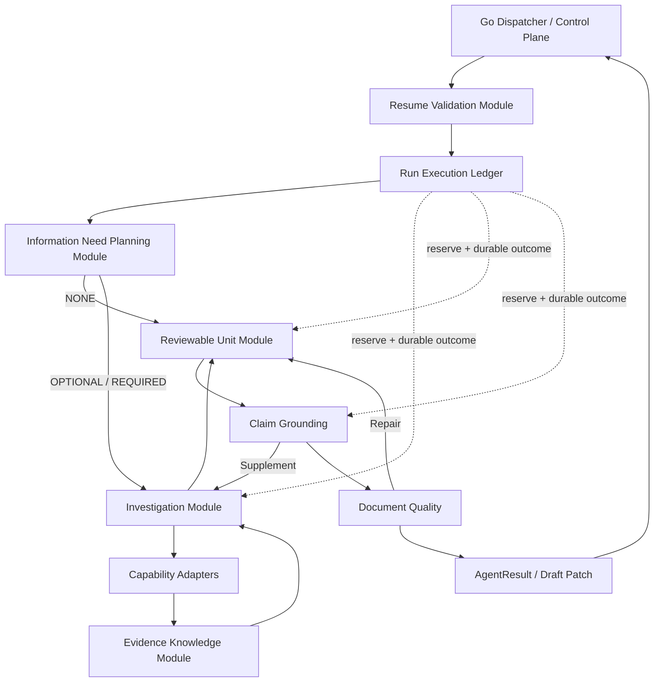

# Agent Loop 语义深化总体设计

> 状态：PROPOSED / READY FOR REVIEW
> 日期：2026-07-31
> 适用范围：`agent-python/`、`backend-go/internal/dispatcher/`、`backend-go/internal/runcontrol/`、`contracts/proto/agent/v1/`、`eval/`
> 目标版本：`agent-runtime.v4` / `agent-loop-snapshot.v3`
> 对应实施计划：[`2026-07-31-agent-loop-semantic-deepening-implementation-plan.md`](../plans/2026-07-31-agent-loop-semantic-deepening-implementation-plan.md)

关联约束：

- [`CONTEXT.md`](../../../CONTEXT.md)
- [`2026-07-21-prd-agent-v1.1-prd.md`](../../product/2026-07-21-prd-agent-v1.1-prd.md)
- [`2026-07-21-prd-agent-v1.1-design.md`](./2026-07-21-prd-agent-v1.1-design.md)
- [`2026-07-30-langgraph-controlled-agent-loop-design.md`](../plans/2026-07-30-langgraph-controlled-agent-loop-design.md)
- [`2026-07-30-langgraph-advanced-loops-implementation-design.md`](../plans/2026-07-30-langgraph-advanced-loops-implementation-design.md)
- [`ADR-0001`](../../adr/0001-external-systems-own-content.md)、[`ADR-0002`](../../adr/0002-remote-llm-only-in-production.md)、[`ADR-0003`](../../adr/0003-bounded-fair-queue-for-small-server.md)

---

## 0. 执行结论

当前 Agent Loop 的 Go/Python 所有权、事件 ACK、Artifact、Checkpoint 和
LangGraph 路由已经形成可用骨架；下一阶段不更换框架，而是按依赖顺序深化六个
Module：

1. **Resume Validation Module**：统一版本兼容、恢复 hydration 和单调不变量；
2. **Run Execution Ledger Module**：统一预算、幂等身份和副作用提交顺序；
3. **Information Need Planning Module**：产生 `NONE / OPTIONAL / REQUIRED` 和 typed Coverage；
4. **Evidence Knowledge Module**：把 Evidence 转为 Verified Fact、Unknown、Source Conflict 和 GroundingFinding；
5. **Investigation Module**：初始调查、真正 Replan 与 Targeted Supplement 共用同一执行语义；
6. **Reviewable Unit Module**：按当前 Confirmation Unit 生成、Grounding、Quality、Repair 和提交。

实现顺序固定为：

```text
Characterization / Eval baseline
  -> Resume + workflow version
  -> Execution ledger
  -> Information Need
  -> Evidence knowledge + Grounding
  -> Unified Investigation / Replan / Supplement
  -> Unit-scoped generation + Quality
  -> Shadow / Enforce / legacy removal
```

排序原因：恢复和预算错误会放大后续所有模型与工具副作用；Information Need 决定
是否调查；Evidence knowledge 决定调查结果能否成为事实；只有前三者稳定后，
Supplement、Unit 生成和 Quality 才能可靠复用同一语义。

---

## 1. 当前基线与问题

### 1.1 已具备

- Go Control Plane 拥有 PRD Task、Agent Run、Lease/Fencing、Queue Slot 和 PostgreSQL；
- Python Worker 通过 direct RPC 执行 Agent Run；
- Model Attempt、Evidence、Run Artifact 和 Checkpoint 逐事件提交并等待 Go ACK；
- `ACTION_VALIDATED`、`OBSERVED`、`DRAFTED`、`GROUNDED`、`QUALITY_*` 和
  `READY_TO_SUBMIT` 等恢复点已存在；
- Go 已持久化 Working Draft Version、Confirmation Unit Version/Decision 和 Revision Scope；
- 生产保持单 Agent Run 执行，不引入多 Agent 或并行 Tool Call。

### 1.2 核心差距

| PRD 语义 | 当前实现 | 风险 |
| --- | --- | --- |
| Information Need 有 requiredness、问题、来源、Coverage 和 fallback | 默认 Coverage 固定为 `repository_evidence` | 纯新增需求误调用工具；必需调查可被直接 Markdown 绕过 |
| Coverage 由有效信息而非命中数量推进 | 任意非空 Evidence 即标记 `COVERED` | 相关结果被误当成完成 |
| Evidence 必须形成 Verified Fact / Unknown / Conflict | Agent Runtime 主要保存 Evidence ref | Draft 缺少可验证事实层 |
| Grounding 验证来源版本和语义支持 | 主要验证 ref 是否存在 | “有引用”被误当成“引用支持结论” |
| Replan 改变调查策略 | 重复动作主要增加 `replan_count` | 计数存在但行为没有深化 |
| Supplement 复用 Investigation | Supplement 直接搜索并附加全部 ref | 绕过 Action Policy、Coverage 和 no-progress |
| 全 Run 共用预算 | 节点分散计数，存在硬编码阈值 | 调用后超预算或 shadow 产生隐藏成本 |
| 每次只生成当前 Confirmation Unit | 先生成全文再拆 Unit | 未体现锁定大纲和已确认上下文 |
| Quality 覆盖完整性、一致性和可验收性 | 主要检查空/重复 Unit | 文档通过不代表 PRD 达标 |
| Resume 校验所有恢复不变量 | Snapshot 是宽松字典且只检查少数状态 | revision 漂移、计数回退或 Draft receipt 冲突 |

### 1.3 不采用的方向

- 不用更大的 Prompt 替代结构化 Knowledge 和 Policy；
- 不让 LangGraph 直接连接 PostgreSQL；
- 不让模型决定预算、权限、Coverage 完成或 Agent Run 终态；
- 不把 Redis、LangGraph checkpoint 或 Python 内存变成第二个 Control Plane；
- 不在 2 vCPU / 2GB 档位并行 Grounding、Tool Call 或 Agent Run；
- 不先做 `runtime.py` 文件拆分再补语义；Module Depth 优先于目录美化。

---

## 2. 不可破坏的不变量

1. PostgreSQL 是编排事实唯一来源；Python 只计算并通过事件提交。
2. Published PRD 属于 Feishu；Repository Snapshot 属于固定 GitHub commit。
3. Agent Run 的模型、工具、Supplement 和 Repair 共用一份预算。
4. 每轮最多一次模型决策和一次 Capability 调用。
5. 模型输出永远先过确定性 Schema、权限、版本、预算和重复检查。
6. `Evidence != Fact`；Retrieval Hit 只有经过来源和支持性验证后才能形成 Fact。
7. `EMPTY` 只能形成 Unknown，不能形成“不存在”的 Fact。
8. CURRENT_STATE 和外部约束类 Claim 必须由 Supported Fact 支持。
9. Quality Repair 修改正文后必须重新 Grounding。
10. 已确认且未 reopen 的 Confirmation Unit 内容 hash 不得变化。
11. 所有外部副作用在进入下一节点前必须得到 Go durable ACK。
12. 未知 workflow/snapshot 版本、Repository revision 漂移、计数回退或集合缩小必须 fail closed。

---

## 3. 目标架构



LangGraph 只保留：节点推进、条件路由、循环和状态游标。每个领域阶段通过深
Module 提供小 Interface；Graph 不再自行解释 Evidence、预算、版本或 Unit 规则。

---

## 4. Resume Validation Module

### 4.1 职责

- 校验 `workflow_version`、snapshot schema、Run/Task identity；
- 校验 Repository binding/revision 与 snapshot 一致；
- 校验所有计数单调、append-only 集合不缩小；
- 根据 artifact key/hash hydration Draft、Knowledge 和 Report；
- 处理 `READY_TO_SUBMIT` 后 Draft 已 ACK、Task Version +1 的 receipt 恢复；
- 只根据 snapshot envelope `status` 选择恢复入口。

### 4.2 输入输出

```python
@dataclass(frozen=True)
class ValidatedRunState:
    status: LoopCheckpointStatus
    state: AgentState
    artifacts: ArtifactIndex
    evidence: EvidenceIndex
    submitted_draft: SubmittedDraftReceipt | None

class ResumeValidator(Protocol):
    def hydrate(self, context: RunContext) -> ValidatedRunState: ...
```

### 4.3 Snapshot v3

Snapshot 新增或明确：

- `repository_binding_id`、`repository_revision`；
- `run_budget` 与 `consumed_budget`；
- `information_need_artifact_key/hash`；
- `knowledge_artifact_key/hash`；
- append-only ID 集合摘要；
- `base_task_version`、`draft_key`、`draft_hash`；
- `workflow_version=agent-runtime.v4`。

Go 不再硬编码所有 Run 为 `agent-runtime.v1`。Run 创建时持久化 workflow version，
Dispatcher 原样传递，并按版本路由兼容 Worker。

---

## 5. Run Execution Ledger Module

### 5.1 职责

Ledger 对所有模型和 Capability 调用提供同一 Interface：

1. 计算稳定 operation key 和 request hash；
2. 调用前检查并预留剩余预算；
3. 提交 `PLANNED` 并等待 ACK；
4. 命中已完成的 durable outcome 时重放，不进行物理调用；
5. 执行 Adapter；
6. 校验并先保存可恢复 Artifact；
7. 提交 `SUCCEEDED/FAILED` 与实际用量；
8. 更新共享预算并保存 checkpoint。

### 5.2 预算模型

```text
RunBudget
  max_model_attempts
  max_tool_calls
  max_iterations
  max_replans
  max_supplements
  max_quality_repairs
  max_input_tokens
  max_output_tokens
  max_elapsed_ms

ConsumedBudget
  model_attempts
  tool_calls
  iterations
  replans
  supplements
  quality_repairs
  input_tokens
  output_tokens
  elapsed_ms
```

调用前如果剩余预算不足，返回确定性 Stop Reason，不发起远程调用。实际 Token 超过
估算时记录超额，但不允许任何后续节点继续消费预算。

### 5.3 Shadow 语义

- `off`：不构造高级路径；
- `shadow`：只运行无副作用的确定性检查和离线对比，不调用额外模型或 Capability；
- `enforce`：允许 Ledger 内的正式调用并持久化全部事件。

---

## 6. Information Need Planning Module

### 6.1 输出模型

```python
class Requiredness(StrEnum):
    NONE = "NONE"
    OPTIONAL = "OPTIONAL"
    REQUIRED = "REQUIRED"

@dataclass(frozen=True)
class InformationNeedPlan:
    need_id: str
    question: str
    requiredness: Requiredness
    source_types: tuple[str, ...]
    required_coverage: tuple[CoverageRequirement, ...]
    first_action_hint: ProposedAction | None
    fallback: str
    budget_allocation: BudgetAllocation
    planner_version: str
```

### 6.2 决策规则

- 纯新增且不依赖现有系统：默认 `NONE`；
- 修改字段、接口、状态、权限或持久化：代码来源通常为 `REQUIRED`；
- 历史背景或术语不明确：历史 PRD 为 `OPTIONAL` 或 `REQUIRED`；
- 用户明确给出授权假设：可从 `REQUIRED` 降级，但必须保留 assumption identity；
- Planner 只建议；RequirednessPolicy 校验并可收紧，不能被模型放宽。

Plan 保存为 `INFORMATION_NEED_PLAN` Run Artifact；恢复时不重新规划相同输入。

---

## 7. Evidence Knowledge Module

### 7.1 数据链路

```text
Raw Capability Result
  -> Evidence identity / access / revision validation
  -> Fact extraction
  -> Fact verification
  -> Unknown / Source Conflict detection
  -> Claim support assessment
  -> Coverage update
```

### 7.2 核心模型

```python
@dataclass(frozen=True)
class KnowledgeBundle:
    evidence_refs: tuple[str, ...]
    facts: tuple[VerifiedFact, ...]
    unknowns: tuple[Unknown, ...]
    conflicts: tuple[SourceConflict, ...]
    coverage_updates: tuple[CoverageUpdate, ...]

@dataclass(frozen=True)
class GroundingFinding:
    claim_id: str
    status: Literal["SUPPORTED", "PARTIAL", "UNSUPPORTED", "CONFLICTING", "NOT_REQUIRED"]
    fact_ids: tuple[str, ...]
    evidence_refs: tuple[str, ...]
    reason_code: str
```

### 7.3 Grounding 顺序

1. Evidence source identity、commit/revision、locator 和 excerpt hash 有效；
2. Fact type、scope、verification status 与 Evidence 链接有效；
3. Evidence 内容直接或经有界分类支持 Fact，而非仅语义相关；
4. Claim type 与 Fact scope 匹配；
5. 冲突未关闭时 Claim 不得 `SUPPORTED`；
6. 通过后才更新对应 Coverage。

确定性 Parser Fact 优先；无法确定性解析的支持性判断使用远程模型 Adapter，并记录
独立 Model Attempt。模型不能把 `INFERRED` 自动升级为 `CODE_VERIFIED`。

Knowledge 保存为 `KNOWLEDGE_BUNDLE` Artifact。初期不新增第二套长期 Fact 权威表；
Go 继续持久化直接 Evidence，Artifact 用于活动恢复、审阅和有界保留。

---

## 8. Investigation Module

### 8.1 统一模式

同一 Module 支持：

- `INITIAL`：当前 Unit 的首次调查；
- `REPLAN`：基于无进展原因改变查询策略；
- `SUPPLEMENT`：只围绕 unsupported blocking Claim 补查一次。

三种模式共用 Action Policy、Capability Adapter、Evidence Knowledge、预算和 checkpoint。

### 8.2 每轮流程

```text
ASSESS_GAP
  -> SELECT_ACTION
  -> VALIDATE_ACTION
  -> CHECKPOINT_ACTION
  -> EXECUTE_CAPABILITY
  -> BUILD_KNOWLEDGE
  -> UPDATE_COVERAGE
  -> CHECKPOINT_OBSERVATION
  -> CONTINUE / REPLAN / COMPLETE / PARTIAL / HUMAN_INPUT
```

Progress fingerprint 至少包含：Supported Fact IDs、Unknown IDs、Conflict IDs、
Coverage 状态和有效 Evidence refs。新增“相关但不支持”的 Evidence 不算 Coverage 进展。

Replan 输入必须包含 prior action、公开结果、失败原因和剩余预算；Replan 输出必须改变
Action Signature 或明确停止。只增加计数不算 Replan。

---

## 9. Reviewable Unit Module

### 9.1 Run Purpose

Go 为 Agent Run 持久化并传递：

```text
PLAN_OUTLINE
GENERATE_UNIT
REVISE_UNIT
FULL_REVIEW
```

`AgentRunInput` 增加版本化 `UnitScope`，包含：

- outline ID/version 和锁定 hash；
- current unit key、章节节点和依赖；
- confirmed Unit summaries/refs；
- reopened/immutable Unit keys；
- Requirement Brief ref 和用户反馈。

### 9.2 生成约束

- `GENERATE_UNIT/REVISE_UNIT` 每次只生成当前 Unit；
- 只使用 Supported Fact、用户目标决策、授权假设和已确认上下文；
- 不得新增、删除或重排锁定大纲节点；
- Repair 只返回 Unit Patch；
- Repair 后重新执行 Claim extraction 和 Grounding；
- 当前 Unit 提交后 Agent Run 结束，由 Go 等待用户确认并创建下一 Run。

### 9.3 Quality

Unit Quality 检查：章节覆盖、术语、规则、权限、状态/异常闭环、假设标记、引用完整、
验收标准可执行。Full Review 只输出问题清单和受影响 Unit，不自动修改已确认内容。

---

## 10. Artifact、State 与事件

### 10.1 Artifact 类型

| 类型 | 内容 | Snapshot 保存 |
| --- | --- | --- |
| `INFORMATION_NEED_PLAN` | requiredness、问题、Coverage、fallback | key + hash |
| `KNOWLEDGE_BUNDLE` | Fact、Unknown、Conflict、Coverage update | key + hash + ID 摘要 |
| `DRAFT_BUNDLE` | 当前 Unit / Draft 结构 | key + hash |
| `GROUNDING_REPORT` | Claim findings | key + hash + outcome |
| `QUALITY_REPORT` | issues/disposition | key + hash + outcome |
| `UNIT_PATCH` | 有界修订内容 | key + hash |

### 10.2 新恢复状态

```text
INITIALIZED
NEED_PLANNED
ACTION_VALIDATED
OBSERVED
INVESTIGATION_FINISHED
UNIT_DRAFTED
GROUNDING_SUPPLEMENT_REQUIRED
GROUNDED / GROUNDING_PARTIAL
QUALITY_REPAIR_REQUIRED
QUALITY_PASSED / QUALITY_NEEDS_HUMAN
CONFIRMATION_UNITS_BUILT
READY_TO_SUBMIT
```

### 10.3 事件顺序

```text
MODEL_ATTEMPT(PLANNED) ACK
  -> physical model call or durable replay
  -> RUN_ARTIFACT_SAVED(validated output) ACK
  -> MODEL_ATTEMPT(SUCCEEDED) ACK
  -> CHECKPOINT_SAVED ACK
```

Capability 遵循：`ACTION_VALIDATED checkpoint ACK -> physical call -> EVIDENCE ACK ->
KNOWLEDGE artifact ACK -> OBSERVED checkpoint ACK`。

---

## 11. 兼容与灰度

1. Go 首先持久化 workflow version；已有 Run 保持 `agent-runtime.v1`。
2. 新建内部/测试 Run 可显式选择 `agent-runtime.v4`。
3. v4 Worker 读取 v1/v2 snapshot 仅用于受支持的兼容入口；不能反向让旧 Worker 读取 v3。
4. 灰度前 drain v4 Run 才允许回滚 Worker。
5. `shadow` 只比较确定性结果，不产生额外远程副作用。
6. Enforce Gate 通过后才把默认 workflow version 切到 v4。
7. 至少保留一个发布周期的 legacy reader；之后删除 legacy producer。

---

## 12. 测试与 Eval

### 12.1 必测性质

- 相同输入得到稳定 Need Plan、Action Signature、Fact ID、Claim ID 和 Artifact hash；
- 任一 checkpoint 恢复不重复已 ACK 模型或 Capability；
- Snapshot 计数回退、集合缩小、revision 漂移全部失败；
- `NONE` 无 Tool Call；`REQUIRED` 不能被 Markdown 直接绕过；
- 非空但无支持性的 Evidence 不完成 Coverage；
- `EMPTY` 产生 Unknown；冲突产生 Source Conflict；
- Supplement 与 Initial 共用预算、去重和 no-progress；
- Repair 不得删除 Unknown、改变 Evidence 或修改 immutable Unit；
- Shadow 不增加模型和 Capability 调用；
- 每个 Agent Run 只执行一个 active Unit 的生成或修订。

### 12.2 Eval 对比

至少比较：

- 当前 `agent-runtime.v1`；
- v4 Need + Investigation；
- v4 Need + Knowledge + Grounding；
- v4 完整 Unit + Quality。

核心 Gate：Information Need Precision/Recall、Coverage Completion、Verified Fact
Accuracy、Evidence Precision、Unsupported Claim Rate、Critical Unknown Recall、Source
Conflict Detection、Acceptance Criteria Executability、Tool/Token Cost、P95 Latency、
恢复后重复物理调用数。

不得只以单元测试通过作为 Enforce 依据。

---

## 13. ADR 一致性

- **ADR-0001**：Knowledge、Draft 和 Report Artifact 仅用于活动恢复与有界审阅，
  不成为 Published PRD 或 Repository 内容权威。
- **ADR-0002**：语义分类和 Quality 模型检查只使用配置的远程模型；离线 Adapter
  仅用于测试。
- **ADR-0003**：所有子 Loop 串行且共享预算；等待用户时释放 Worker，不增加生产并发。

---

## 14. 完成定义

- Go 不再为所有 Run 硬编码 `agent-runtime.v1`；
- Resume Validation 覆盖所有 status、版本、revision、计数和 Artifact receipt；
- 所有模型/Capability 调用通过共享 Ledger，调用前可确定性拒绝超预算；
- Information Need 明确输出 `NONE / OPTIONAL / REQUIRED`；
- Coverage 只能由 Knowledge verdict 推进；
- CURRENT_STATE Claim 不会因“ref 存在”直接变为 Supported；
- Replan 真正改变策略，Supplement 复用 Investigation；
- 一个生成 Run 只处理当前 Confirmation Unit；
- Quality 覆盖 PRD 定义的完整性、一致性和可验收性；
- Shadow 零额外远程副作用；
- v4 固定 Eval 和 crash/recovery Gate 通过后再默认 Enforce。
